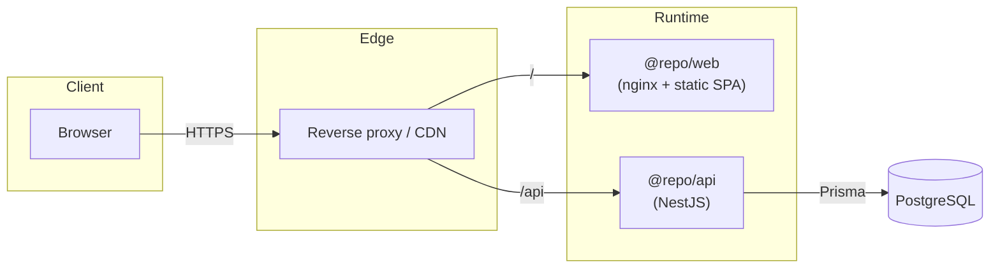
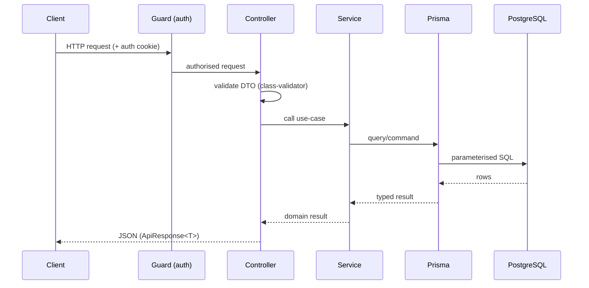

# Architecture

> **Status:** foundational. This document describes the intended architecture
> and the conventions code must follow. Domain modules are added as features
> are built; update this document alongside them.

## 1. Overview

Blank App is a **monorepo** containing a single-page web client and a REST API,
backed by PostgreSQL. It is deployed as two container images behind a reverse
proxy.

## 2. Components

### `apps/web` — React SPA

- React 19 + TypeScript, built by Vite, styled with Tailwind CSS v4 and
  shadcn/ui, icons from Lucide.
- Talks to the API over REST (`/api`). No direct database access.
- Served in production as static assets by nginx (SPA fallback to `index.html`).

### `apps/api` — NestJS REST API

- Layered: **controllers** (HTTP + validation) → **services** (business logic)
  → **Prisma** (persistence). One Nest module per feature.
- Cross-cutting concerns (auth guards, logging interceptors, exception filters,
  validation pipes) live in `common/`.
- Exposes an OpenAPI document via `@nestjs/swagger` (see [API.md](API.md)).

### `packages/types` — shared contracts

- Framework-free TypeScript types/DTO shapes shared by web and api. The single
  source of truth for cross-boundary shapes.

### `packages/config` — shared tooling

- ESLint flat-config presets (`base`, `react`, `nest`) and tsconfig presets.

### PostgreSQL + Prisma

- Prisma is the ORM and migration tool. The schema in
  `apps/api/prisma/schema.prisma` is the source of truth for the data model;
  migrations are committed.

## 3. Request lifecycle (API)

## 4. Boundaries & dependency rules

- **The web app never imports from the api app**, and vice versa. Shared shapes
  go through `@repo/types`.
- **Dependencies point inward:** controllers depend on services; services depend
  on the persistence layer; nothing depends on controllers.
- **No business logic in controllers or React components.** Controllers marshal
  HTTP; components render state.
- **All external input is validated at the boundary** before reaching a service.

## 5. Data & persistence

- One logical database. Access exclusively through Prisma; no raw string SQL.
- Every schema change is a committed migration. Destructive migrations are
  reviewed with extra care and are backward-compatible where feasible
  (expand/contract).
- Index any column used for filtering or ordering. Paginate all list queries.

## 6. Authentication & authorisation

- Authentication via **Better Auth** (see
  [ADR-0003](adr/0003-authentication-with-better-auth.md)), self-hosted against
  the same PostgreSQL instance.
- Sessions use secure, http-only, same-site cookies. State-changing requests are
  CSRF-protected.
- Authorisation is enforced in the API via Nest guards; the client never makes
  trust decisions.

## 7. Configuration

- 12-factor: all configuration via environment variables (typed with
  `@nestjs/config` in the API). See [`.env.example`](../.env.example).
- No environment-specific values are hard-coded; no secrets in the repo.

## 8. Observability (planned)

- Structured JSON logs with request correlation IDs.
- Health endpoints (`/health` liveness/readiness via `@nestjs/terminus`).
- Metrics/tracing to be selected on the roadmap (see [ROADMAP.md](ROADMAP.md)).

## 9. Deployment topology

Two immutable images (`web`, `api`) published to GHCR and promoted through
environments. See [DEPLOYMENT.md](DEPLOYMENT.md). The concrete hosting platform
is an open decision (see [TECH_DEBT.md](TECH_DEBT.md)); the container-first
foundation keeps it portable.

## 10. Cross-cutting principles

- **Type-safety end to end** — shared types, strict TS, validated DTOs.
- **Fail fast, degrade gracefully.** Surface errors in dev; handle them in prod.
- **Everything reproducible** — pinned toolchain, lockfile, containers.
