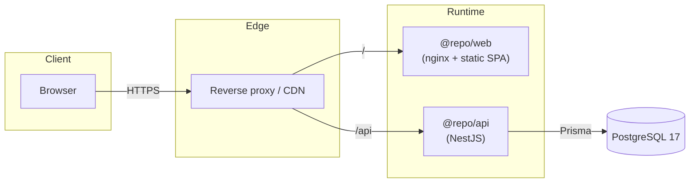
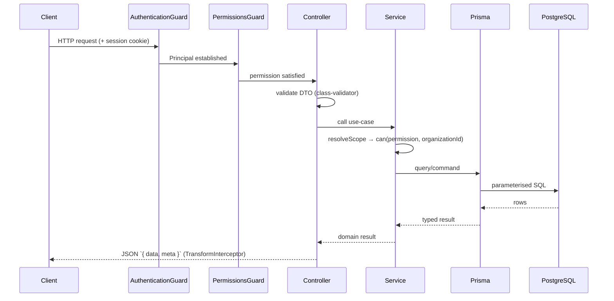

# Architecture

> **Status:** built and in use. This document describes the system as it stands
> and the conventions code must follow. Where an accepted ADR is not yet
> implemented, that is stated explicitly — §10 is the honest list.

## 1. Overview

SchedulePoint is a **monorepo** containing a single-page web client and a REST
API, backed by PostgreSQL. It is deployed as two container images behind a
reverse proxy. The API self-migrates on start (ADR-0018), so promoting an image
_is_ the deployment.

```mermaid
graph LR
  subgraph Client
    B[Browser]
  end
  subgraph Edge
    RP[Reverse proxy / CDN]
  end
  subgraph Runtime
    W["@repo/web<br/>(nginx + static SPA)"]
    A["@repo/api<br/>(NestJS)"]
  end
  DB[("PostgreSQL 17")]

  B -->|HTTPS| RP
  RP -->|/| W
  RP -->|/api| A
  A -->|Prisma| DB
```

There is deliberately **no cache, queue, or object store in the running system**
— see §10.

## 2. Components

### `apps/web` — React SPA

- React 19 + TypeScript, built by Vite, styled with Tailwind CSS v4 over
  hand-rolled WAI-ARIA APG primitives (no Radix), icons from Lucide.
- Talks to the API over REST (`/api/v1`). No direct database access.
- Served in production as static assets by nginx (SPA fallback to `index.html`).
- Feature-first under `src/features/`, inside a **persistent app shell** with a
  Client → Project → Plan Project Explorer (ADR-0029) and a canvas-first plan
  workspace (ADR-0030). See
  [FRONTEND_ARCHITECTURE.md](FRONTEND_ARCHITECTURE.md).
- The TSLD canvas is Canvas 2D with a parallel focusable DOM layer for
  accessibility (ADR-0026).

### `apps/api` — NestJS REST API

- Layered: **controllers** (HTTP + validation) → **services** (business logic)
  → **repositories** → **Prisma** (persistence). One Nest module per feature;
  20 feature modules under `src/modules/`.
- Cross-cutting concerns live in `src/common/`: `auth/` (principal, permissions,
  guest principal), `guards/`, `filters/`, `interceptors/`, `db/` (advisory-lock
  helpers), `hierarchy/` (the soft-delete cascade/restore lifecycle service),
  `dto/`, `query/`, `tokens/`, `validation/`, `mail/`.
- Exposes an OpenAPI document via `@nestjs/swagger` (see [API.md](API.md)).

### The scheduling engine — `apps/api/src/modules/schedule/engine/`

The CPM/GPM engine is a **pure function** (`computeSchedule`) with no framework,
database, or I/O dependency. Calendars, resources and external dates reach it
through injected ports. That purity is what makes the **recalc parity gate**
possible: absent an input, output must be byte-identical (ADR-0034). Every
engine-touching change has to argue that gate.

The engine is called by `ScheduleService.recalculate`, which owns the write: one
transaction, under the plan advisory lock, batched, deliberately bypassing
optimistic locking because the engine — not a user — owns the computed columns
(ADR-0022).

### `packages/interchange` — schedule import/export

Pure, framework-free canonical schedule model plus per-format parsers and
serialisers (XER, MSPDI) and a validate/repair/report step (ADR-0050). Consumed
by the thin persisting `interchange` API module. No Nest, no Prisma.

### `packages/engine-conformance` — the conformance fixture

Engine-**free** loaders, Zod schemas and coverage reporting for the versioned
P6-class benchmark fixture (ADR-0034). Kept engine-free so the structural CI
gate cannot accidentally depend on the thing it is validating.

### `packages/seed` and `packages/seed-http` — the seed catalogue

`@repo/seed` is the pure `SeedSpec` model and the builders that produce it: the
per-capability plans, the pairwise covering array, the scale generator and the
negative cases (ADR-0066). It knows how to **describe** a plan and never how to
create one — no HTTP, no Prisma, no DTOs — which is what lets one spec feed both
the seeder and the differential that runs `computeSchedule` on the same inputs.

`@repo/seed-http` is the seeder: an ordinary REST client that signs in, obeys
RBAC and holds the ADR-0028 pen. It gets **no privileged path**, deliberately —
if it cannot create something as a Planner, a Planner cannot either, and that is
reported as a finding. `apps/seed-cli` is the thin command around it.

Why a package rather than a script: the pairwise differential in `apps/api`
imports the _same_ seeder the CLI uses. A second one would drift, and the whole
premise is that the seeder is an ordinary client.

### `packages/types` — shared contracts

Framework-free TypeScript types/DTO shapes shared by web and api. The single
source of truth for cross-boundary shapes.

### `packages/config` — shared tooling

ESLint flat-config presets (`base`, `react`, `nest`) and tsconfig presets.

### PostgreSQL + Prisma

Prisma is the ORM and migration tool. `apps/api/prisma/schema.prisma` (27
models) is the source of truth for the data model; 47 migrations are committed.
Constraints Prisma cannot express — partial uniques, CHECK constraints, partial
indexes — are written as raw SQL in the migration and documented as a comment on
the model, never as an `@@index` that would drift (see
[DATABASE.md](DATABASE.md)).

## 3. Request lifecycle (API)

```mermaid
sequenceDiagram
  participant C as Client
  participant G as AuthenticationGuard
  participant P as PermissionsGuard
  participant Ct as Controller
  participant S as Service
  participant Pr as Prisma
  participant DB as PostgreSQL

  C->>G: HTTP request (+ session cookie)
  G->>P: Principal established
  P->>Ct: permission satisfied
  Ct->>Ct: validate DTO (class-validator)
  Ct->>S: call use-case
  S->>S: resolveScope → can(permission, organizationId)
  S->>Pr: query/command
  Pr->>DB: parameterised SQL
  DB-->>Pr: rows
  Pr-->>S: typed result
  S-->>Ct: domain result
  Ct-->>C: JSON `{ data, meta }` (TransformInterceptor)
```

Errors are shaped by `AllExceptionsFilter` into `{ error }` — never a stack
trace, never an internal message.

## 4. Boundaries & dependency rules

- **The web app never imports from the api app**, and vice versa. Shared shapes
  go through `@repo/types`.
- **Dependencies point inward:** controllers depend on services; services depend
  on repositories; nothing depends on controllers.
- **No business logic in controllers or React components.** Controllers marshal
  HTTP; components render state.
- **All external input is validated at the boundary** before reaching a service.
- **The engine depends on nothing.** It takes plain data and ports; it does not
  import Prisma, Nest, or any module. Anything it needs is passed in.
- **`@repo/interchange` and `@repo/engine-conformance` are pure** by design, so
  they can be tested and reasoned about in isolation; persistence lives in the
  thin module that consumes them.

## 5. Data & persistence

- One logical database. Access through Prisma; raw SQL only via Prisma's tagged
  template (parameterised), used for set-based sweeps and for constraints Prisma
  cannot express.
- Every schema change is a committed migration, and CI checks for
  schema/migration drift on every run.
- **Soft delete everywhere**, with cascades and restores coordinated by
  `HierarchyLifecycleService` and correlated by a `delete_batch_id`, so a restore
  brings back exactly what the delete removed.
- **Optimistic locking** (`version`) on user-editable rows; a stale write is a
  **409**.
- Index columns used for filtering or ordering — but measure first (`CLAUDE.md`
  §15); several candidate indexes have been measured and deliberately not added.
- Paginate all list queries (cursor-based).

## 6. Concurrency — three distinct layers

A plan can be opened by several people in one organisation, so concurrency is
handled at three levels that are deliberately not interchangeable:

| Layer               | Mechanism                           | Failure | Protects against                         |
| ------------------- | ----------------------------------- | ------- | ---------------------------------------- |
| **Optimistic lock** | `version` column checked on write   | **409** | Two users editing the same row           |
| **Advisory lock**   | Postgres advisory lock, per plan    | (waits) | Interleaved multi-row transactions       |
| **The pen**         | `PlanLock` lease + `assertHoldsPen` | **423** | Two users authoring the same plan at all |

The pen (ADR-0028) is a single-editor lease with heartbeat, TTL, graceful
hand-off and Org-Admin override. Structural writes assert it; reads and
progress edits do not.

## 7. Authentication & authorisation

- Authentication via **Better Auth** (ADR-0003), self-hosted against the same
  PostgreSQL instance. Sessions use secure, http-only, same-site cookies;
  state-changing requests are CSRF-protected.
- A global `AuthenticationGuard` establishes a **`Principal`**; deny-by-default,
  so an endpoint is protected unless it carries `@Public()`. That list is
  deliberately short: health, version, invitation acceptance, and the guest
  share surface.
- Authorisation is **RBAC + organisation (resource) scoping** (ADR-0012).
  Services call `resolveScope(principal, orgSlug)` then
  `principal.can(permission, organizationId)`. **A permission check without a
  scope check is the IDOR bug** — they are always paired.
- **Cross-organisation access returns 404, not 403.** A 403 would confirm the
  resource exists.
- **External guests** (ADR-0051) authenticate with a session-less bearer token
  against a **`GuestPrincipal`** — a separate type with no memberships and no
  `can()`. Member service methods take `Principal`, so passing a guest into one
  is a **compile error**: the isolation is structural, not a runtime check.

### The audit log (ADR-0072 / ADR-0073)

Added here by the 2026-08-04 reconciliation pass, which found this document
silent on it — an append-only table with database triggers is a structural
property of the system, not a feature detail.

- A single **`audit_events`** table, made append-only **in the database** by
  `BEFORE UPDATE OR DELETE` and `BEFORE TRUNCATE` triggers declared
  `ENABLE ALWAYS`, so the application role cannot bypass them. The honest claim
  is tamper-**resistant**, not tamper-proof: anyone with `ALTER TABLE` can still
  disable a trigger.
- Payloads pass an **allow-list per action**, plus a `NEVER_RECORD` substring
  ban catching `token`/`hash` independently. The redactor reduces any non-scalar
  to a type marker **by design**, which is why cascades record scalar counts
  rather than nested objects.
- **What earns a row is derived from two tests, not a list of opinions**
  (ADR-0073): **durability** — does the product otherwise keep a durable record?
  — and **blast radius** — does it change how _other people's_ work is
  evaluated? Both negative by default. Content edits are **permanently**
  excluded. A **route census**, derived by reflecting the live Nest module
  graph, fails the build if a route that changes who-can-do-what stops being
  audited, and forces every route to be classified exactly once.
- **The recalculation is deliberately never audited.** It is deterministic from
  inputs that are themselves auditable, so a row saying "the schedule was
  recomputed" is noise rather than evidence. Note the census's real shape before
  relying on it: it forces routes _to be_ audited and nothing forbids auditing
  one, so this is a rule with a documented reason, not a gate.
- Producers use `record()` inside a transaction (the insert shares the write's
  fate) or `recordBestEffort()` where there is no transaction to roll back. Which
  one a producer may call is pinned by
  `audit-producer-seams.structural.spec.ts`, because the property — "if this
  insert throws, what happens to the caller?" — differs only on a failure the
  application cannot be made to produce on demand.

## 8. Configuration

- 12-factor: all configuration via environment variables, typed and validated
  with Zod at startup (misconfiguration fails fast). See
  [`.env.example`](../.env.example).
- The web client reads only `VITE_`-prefixed variables, and only through
  `apps/web/src/config/env.ts` — never `import.meta.env` scattered through code.
- **Feature flags are the release mechanism** for large frontend changes. A flag
  defaults **off** while its quality gates are open and is flipped **on** in a
  deliberate enablement step. The flag-off path keeps a **parity suite**; that
  suite is the rollback contract and is never weakened to make a change easier.
- No environment-specific values are hard-coded; no secrets in the repo.

## 9. Observability

- **Structured JSON logs via Pino** (`nestjs-pino`) with a per-request
  correlation id, redaction of secrets and PII, and no `console.log`.
- **`GET /health`** (liveness) and **`GET /health/ready`** (readiness, checks the
  database via `@nestjs/terminus`). Both `@Public()`.
- **Rate limiting** via `@nestjs/throttler`: a global limit plus a tighter
  per-IP limit on the unauthenticated guest-share routes.
- Metrics and tracing are **not yet wired** — see §10 and
  [OBSERVABILITY.md](OBSERVABILITY.md).

## 10. Accepted but not yet implemented

These ADRs record how we will do something when we need it. Nothing in the
running system depends on them, and no dependency for them is installed. They
are listed here so nobody reads an ADR and assumes the capability exists:

| ADR      | Decision                                  | Reality                                      |
| -------- | ----------------------------------------- | -------------------------------------------- |
| ADR-0009 | Background processing with BullMQ + Redis | No queue, no Redis. All work is synchronous. |
| ADR-0010 | Caching strategy with Redis               | No cache layer. Reads go to Postgres.        |
| ADR-0011 | File storage via an S3 abstraction        | No object store; no user file uploads.       |
| ADR-0013 | Observability with OpenTelemetry + Pino   | Pino is wired; **OpenTelemetry is not**.     |

The mail port (`common/mail/`) exists with a **logging** implementation only; no
transport is configured, so invitation emails are logged rather than sent.

## 11. Deployment topology

Two immutable images (`web`, `api`) published to GHCR, per-package tagged
(`api-vX.Y.Z` / `web-vX.Y.Z`, ADR-0027) and promoted through environments. The
API runs its migrations on start (ADR-0018). An opt-in host-side pull trigger
can turn a published `:latest` into a deploy (ADR-0047). See
[DEPLOYMENT.md](DEPLOYMENT.md). The concrete hosting platform is still an open
decision (see [TECH_DEBT.md](TECH_DEBT.md)); the container-first foundation
keeps it portable.

## 12. Cross-cutting principles

- **Type-safety end to end** — shared types, strict TS, validated DTOs.
- **Purity where it buys a guarantee.** The engine, the interchange model and
  the canvas render model are pure so their behaviour can be pinned by tests
  that need neither a database nor a browser.
- **Fail fast, degrade gracefully.** Surface errors in dev; handle them in prod.
- **Everything reproducible** — pinned toolchain, lockfile, containers.
