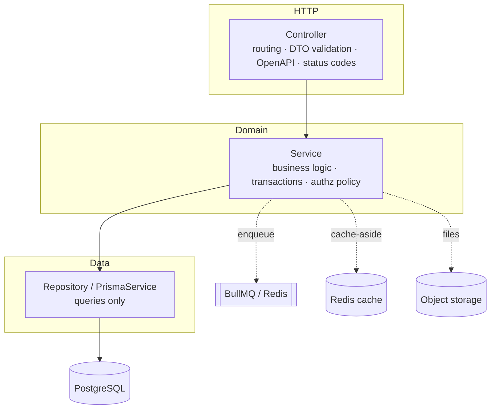
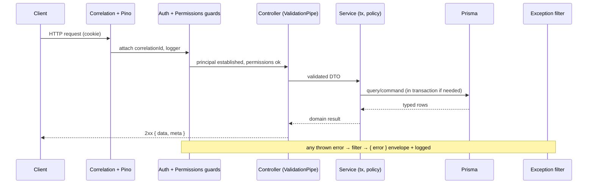

# Backend Architecture

> **Status:** implemented (infrastructure) + design. This document defines the
> architecture the API (`apps/api`) follows. The reusable infrastructure (config,
> Prisma, guards, filters, interceptors, health, bootstrap) is live in
> `apps/api/src/`; the **feature** patterns are demonstrated by the non-shipping
> template in [`apps/api/examples/reference-feature/`](../apps/api/examples/reference-feature/)
> (ADR-0014). Backed by ADRs [0008](adr/0008-backend-modular-monolith.md)–[0014](adr/0014-reference-feature-as-non-shipping-template.md)
> and [0003](adr/0003-authentication-with-better-auth.md).

## Guiding principles

Correctness · Security-by-default · Clear boundaries · Testability ·
Observability · Simplicity. **Optimise for long-term maintainability**; design
for the next decade, not the next sprint.

## Application architecture (ADR-0008)

A **modular monolith** built with **NestJS**. One deployable artifact, composed
of feature modules with strict internal layering.

## Module boundaries & dependency rules

- **Feature modules** own a slice of the domain (`modules/<feature>/`). Each
  exposes a small public surface (exported providers); internals stay private.
- **Dependencies point inward:** controller → service → repository. Nothing
  depends on the controller; the repository is the only Prisma consumer.
- **No feature imports another feature's internals.** Cross-feature needs go
  through an exported service or shared code (`common/`, `@repo/types`).
- **`common/`** holds cross-cutting infrastructure (guards, filters,
  interceptors, decorators, pipes, base DTOs, Prisma, auth context).
- These boundaries make modules the seams along which the monolith could later
  be split.

## Service structure & dependency injection

- **Constructor injection** everywhere (NestJS DI). Services are stateless and
  singleton-scoped.
- **Depend on abstractions for infrastructure** — `StorageService`,
  `CacheService`, `AuthContextService`, a `Clock` — via interfaces/abstract
  classes and provider tokens, so implementations are swappable and trivially
  faked in tests.
- **Thin controllers, thin workers.** HTTP controllers and BullMQ processors
  both delegate to services; business logic lives in exactly one place.

## Validation

- **Request validation** with `class-validator` + `class-transformer` DTOs,
  enforced by a **global `ValidationPipe`** configured `whitelist: true`,
  `forbidNonWhitelisted: true`, `transform: true`. Unknown properties are
  rejected; payloads are coerced to typed instances.
- **DTOs are the request contract** and the source of OpenAPI schemas
  (`@nestjs/swagger`). Validation failures return **422** with field-level
  detail (see `docs/API.md`).
- **Environment/config validation** with **Zod** at startup — the app refuses to
  boot with invalid configuration (fail fast).
- Validate at the boundary; services may assume validated input.

## Error handling

- A **global exception filter** maps everything to the standard `ApiError`
  envelope (`docs/API.md`): a stable `code`, a safe `message`, optional
  `details`. **No stack traces or internals** ever reach the client.
- **Domain errors** are typed exceptions (e.g. `NotFoundError`,
  `ConflictError`) mapped to the right HTTP status; **Prisma errors** are mapped
  (unique violation → 409, not-found → 404) by a dedicated filter.
- **4xx = expected** (logged at `warn`/`info`); **5xx = incidents** (logged at
  `error` with correlation ID and reported to telemetry).
- Never swallow errors; fail loud in dev, degrade gracefully in prod.

## Configuration

- **12-factor:** all config via environment, typed and validated through
  `@nestjs/config` + a Zod schema, exposed by a typed config service. Code never
  reads `process.env` directly.
- **No secrets in the repo** (`SECURITY.md`); `.env.example` documents shape.
  Distinct config per environment via the platform's secret manager.

## Background processing (ADR-0009)

- **BullMQ + Redis** for async/scheduled work. Producers enqueue from services;
  **processors live in the owning module** and delegate to services.
- Jobs are **durable, retried with backoff, and idempotent**; terminal failures
  go to a failed/dead-letter set. Repeatable jobs handle scheduled work.
- Jobs carry the correlation ID; the worker can be split into its own
  deployment later without code changes.

## Caching strategy (ADR-0010)

- **Cache-aside** behind a `CacheService` (Redis). Read-through on miss,
  **invalidate on write**. Namespaced, versioned keys; explicit per-use-case
  TTLs; no unbounded caches.
- **Correctness first:** cache only what tolerates its TTL's staleness; never
  cache authoritative computed results beyond safe bounds. **Cache only when
  profiling justifies it** (`docs/PERFORMANCE.md`).

## File storage strategy (ADR-0011)

- **Object storage (S3-compatible)** behind a `StorageService`. **Metadata in
  Postgres, bytes in the bucket.** Clients transfer via short-lived
  **pre-signed URLs**; large payloads never stream through the API. Private
  buckets, random keys, server-side content-type/size validation.

## Authentication (ADR-0003)

- **Better Auth**, cookie-based sessions (secure, http-only, same-site). A
  global authentication guard resolves the **principal** from the session via an
  `AuthContextService` seam; unauthenticated requests get **401**. Tokens are
  never exposed to client JS. State-changing requests are CSRF-protected.

## Authorisation (ADR-0012)

- **RBAC with organisation (resource) scoping**, **deny-by-default**. A
  `PermissionsGuard` + `@RequirePermissions()` enforces permissions; services
  additionally verify the principal's **membership/role for the specific
  resource** (anti-IDOR). Checks use **permissions**, not role names; richer
  object rules use CASL in a policy layer. `@Public()` opts an endpoint out.

## Observability (ADR-0013)

- **Structured JSON logs (Pino)** with a **correlation ID** on every log and
  response, sensitive fields redacted. **Metrics + traces via OpenTelemetry**
  (auto-instrumented HTTP/Prisma/Redis/BullMQ). **Liveness/readiness** via
  `@nestjs/terminus`. Full detail in [`OBSERVABILITY.md`](OBSERVABILITY.md).

## Request lifecycle (with cross-cutting concerns)

## Related standards

- [`API.md`](API.md) · [`DATABASE.md`](DATABASE.md) ·
  [`SECURITY_STANDARDS.md`](SECURITY_STANDARDS.md) ·
  [`OBSERVABILITY.md`](OBSERVABILITY.md) · [`PERFORMANCE.md`](PERFORMANCE.md) ·
  [`TESTING.md`](TESTING.md) · [`REFERENCE_FEATURE.md`](REFERENCE_FEATURE.md)
