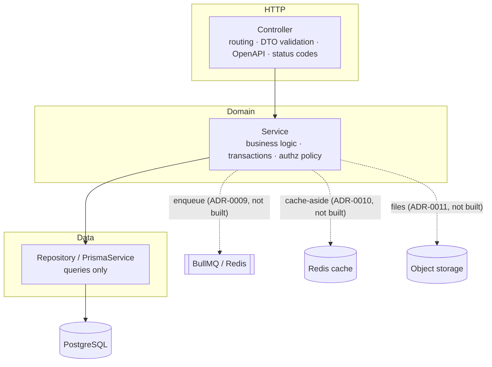
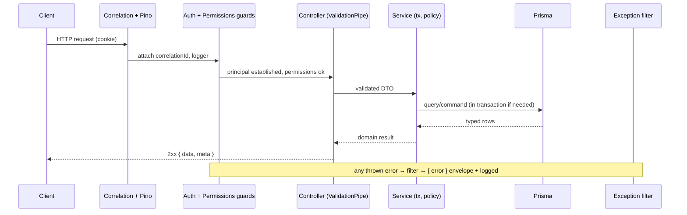

# Backend Architecture

> **Status:** built and in use. This document defines the architecture the API
> (`apps/api`) follows: 20 feature modules over shared infrastructure (config,
> Prisma, guards, filters, interceptors, health, bootstrap). The feature patterns
> are demonstrated by real shipping exemplars —
> [`modules/clients`](../apps/api/src/modules/clients/) (canonical shape),
> [`modules/notes`](../apps/api/src/modules/notes/) (cascade + polymorphic
> parent), [`modules/share`](../apps/api/src/modules/share/) (auth boundary) —
> per [ADR-0057](adr/0057-real-modules-replace-the-reference-template.md). Backed
> by ADRs [0003](adr/0003-authentication-with-better-auth.md),
> [0008](adr/0008-backend-modular-monolith.md) and
> [0012](adr/0012-authorization-rbac-scoped.md).
>
> Sections marked **_not yet built_** are accepted decisions with no
> implementation — no queue, cache or object store exists
> ([`ARCHITECTURE.md`](ARCHITECTURE.md) §10).

## Guiding principles

Correctness · Security-by-default · Clear boundaries · Testability ·
Observability · Simplicity. **Optimise for long-term maintainability**; design
for the next decade, not the next sprint.

## Application architecture (ADR-0008)

A **modular monolith** built with **NestJS**. One deployable artifact, composed
of feature modules with strict internal layering.

```mermaid
flowchart TD
  subgraph HTTP
    C[Controller<br/>routing · DTO validation · OpenAPI · status codes]
  end
  subgraph Domain
    S[Service<br/>business logic · transactions · authz policy]
  end
  subgraph Data
    R[Repository / PrismaService<br/>queries only]
  end
  DB[(PostgreSQL)]
  C --> S --> R --> DB
  S -. "enqueue (ADR-0009, not built)" .-> Q[[BullMQ / Redis]]
  S -. "cache-aside (ADR-0010, not built)" .-> K[(Redis cache)]
  S -. "files (ADR-0011, not built)" .-> O[(Object storage)]
```

The dotted edges are **decided, not built**. Everything solid is live.

## Module boundaries & dependency rules

- **Feature modules** own a slice of the domain (`modules/<feature>/`). Each
  exposes a small public surface (exported providers); internals stay private.
- **Dependencies point inward:** controller → service → repository. Nothing
  depends on the controller; the repository is the only Prisma consumer.
- **No feature imports another feature's internals.** Cross-feature needs go
  through an exported service or shared code (`common/`, `@repo/types`).
- **`common/`** holds cross-cutting infrastructure (guards, filters,
  interceptors, decorators, pipes, base DTOs, Prisma, auth context).
- These boundaries make modules the seams along which the monolith could later
  be split.

## Service structure & dependency injection

- **Constructor injection** everywhere (NestJS DI). Services are stateless and
  singleton-scoped.
- **Depend on abstractions for infrastructure** via provider tokens, so
  implementations are swappable and trivially faked in tests. The live examples
  are `AuthContextService` (the auth seam every API e2e spec overrides) and
  `MailService` (a logging implementation today). `StorageService` /
  `CacheService` follow the same shape when ADR-0010/0011 land.
- **Thin controllers.** Controllers marshal HTTP and delegate; business logic
  lives in exactly one place. The same will hold for queue processors.

## Validation

- **Request validation** with `class-validator` + `class-transformer` DTOs,
  enforced by a **global `ValidationPipe`** configured `whitelist: true`,
  `forbidNonWhitelisted: true`, `transform: true`. Unknown properties are
  rejected; payloads are coerced to typed instances.
- **DTOs are the request contract** and the source of OpenAPI schemas
  (`@nestjs/swagger`). Validation failures return **422** with field-level
  detail (see `docs/API.md`).
- **Environment/config validation** with **Zod** at startup — the app refuses to
  boot with invalid configuration (fail fast).
- Validate at the boundary; services may assume validated input.

## Error handling

- A **global exception filter** maps everything to the standard `ApiError`
  envelope (`docs/API.md`): a stable `code`, a safe `message`, optional
  `details`. **No stack traces or internals** ever reach the client.
- **Domain errors** are typed exceptions in `common/errors/domain-errors.ts`
  (`NotFoundError`, `ConflictError`, `ForbiddenError`, `ValidationError`,
  `GoneError`, `LockedError`) mapped to their HTTP status by
  `AllExceptionsFilter`, which also maps **Prisma** codes (`P2002` unique
  violation → 409, `P2025` not-found → 404) in the same place.
- **The wire `code` is the error _class_; the specific condition goes in
  `details.reason`** — see [`API.md`](API.md). A new branchable error adds a
  `reason`, not a new top-level code.
- **4xx = expected** (logged at `warn`); **5xx = incidents** (logged at `error`
  with the correlation ID). There is no error-reporting backend yet.
- Never swallow errors; fail loud in dev, degrade gracefully in prod.

## Configuration

- **12-factor:** all config via environment, typed and validated through
  `@nestjs/config` + a Zod schema, exposed by a typed config service. Code never
  reads `process.env` directly.
- **No secrets in the repo** (`SECURITY.md`); `.env.example` documents shape.
  Distinct config per environment via the platform's secret manager.

## Background processing (ADR-0009) — _not yet built_

- **BullMQ + Redis** for async/scheduled work. Producers enqueue from services;
  **processors live in the owning module** and delegate to services.
- Jobs are **durable, retried with backoff, and idempotent**; terminal failures
  go to a failed/dead-letter set. Repeatable jobs handle scheduled work.
- Jobs carry the correlation ID; the worker can be split into its own
  deployment later without code changes.

## Caching strategy (ADR-0010) — _not yet built_

- **Cache-aside** behind a `CacheService` (Redis). Read-through on miss,
  **invalidate on write**. Namespaced, versioned keys; explicit per-use-case
  TTLs; no unbounded caches.
- **Correctness first:** cache only what tolerates its TTL's staleness; never
  cache authoritative computed results beyond safe bounds. **Cache only when
  profiling justifies it** (`docs/PERFORMANCE.md`).

## File storage strategy (ADR-0011) — _not yet built_

- **Object storage (S3-compatible)** behind a `StorageService`. **Metadata in
  Postgres, bytes in the bucket.** Clients transfer via short-lived
  **pre-signed URLs**; large payloads never stream through the API. Private
  buckets, random keys, server-side content-type/size validation.

## Authentication (ADR-0003)

- **Better Auth**, cookie-based sessions (secure, http-only, same-site). A
  global authentication guard resolves the **principal** from the session via an
  `AuthContextService` seam; unauthenticated requests get **401**. Tokens are
  never exposed to client JS. State-changing requests are CSRF-protected.

## Authorisation (ADR-0012)

- **RBAC with organisation (resource) scoping**, **deny-by-default**. A
  `PermissionsGuard` + `@RequirePermissions()` enforces permissions; services
  additionally verify the principal's **membership/role for the specific
  resource** (anti-IDOR) via `resolveScope` + `principal.can(...)`. Checks use
  **permissions**, not role names. Object-level rules (note author-ownership,
  say) are explicit service-layer checks — there is **no policy-engine
  dependency**. `@Public()` opts an endpoint out, and that list is short and
  reviewed. **Cross-organisation access returns 404, not 403.**
- **External guests** use a separate `GuestPrincipal` with no memberships and no
  `can()`; member service methods take `Principal`, so a guest reaching one is a
  compile error (ADR-0051).

## Observability (ADR-0013 — partly built)

- **Built:** structured JSON logs (Pino) with a **correlation ID** on every log
  and response, sensitive fields redacted; **liveness/readiness** via
  `@nestjs/terminus`; a global rate limiter (`@nestjs/throttler`).
- **Not built:** metrics and traces. No OpenTelemetry dependency is installed.
  Full detail — and the standard for when it lands — in
  [`OBSERVABILITY.md`](OBSERVABILITY.md).

## Request lifecycle (with cross-cutting concerns)

```mermaid
sequenceDiagram
  participant Cl as Client
  participant MW as Correlation + Pino
  participant G as Auth + Permissions guards
  participant Ct as Controller (ValidationPipe)
  participant Sv as Service (tx, policy)
  participant Pr as Prisma
  participant F as Exception filter

  Cl->>MW: HTTP request (cookie)
  MW->>G: attach correlationId, logger
  G->>Ct: principal established, permissions ok
  Ct->>Sv: validated DTO
  Sv->>Pr: query/command (in transaction if needed)
  Pr-->>Sv: typed rows
  Sv-->>Ct: domain result
  Ct-->>Cl: 2xx { data, meta }
  Note over G,F: any thrown error → filter → { error } envelope + logged
```

## Related standards

- [`API.md`](API.md) · [`DATABASE.md`](DATABASE.md) ·
  [`SECURITY_STANDARDS.md`](SECURITY_STANDARDS.md) ·
  [`OBSERVABILITY.md`](OBSERVABILITY.md) · [`PERFORMANCE.md`](PERFORMANCE.md) ·
  [`TESTING.md`](TESTING.md) · [`REFERENCE_FEATURE.md`](REFERENCE_FEATURE.md)
