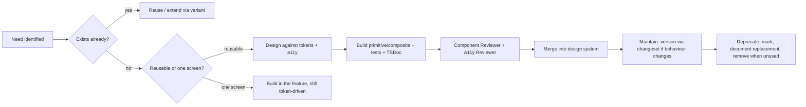

# Component Library Guidelines

> How we build, name, document, and test reusable components. Complements
> [`DESIGN_SYSTEM.md`](DESIGN_SYSTEM.md) (what things look like) and
> [`FRONTEND_ARCHITECTURE.md`](FRONTEND_ARCHITECTURE.md) (where they live).

## The five qualities

Every reusable component must be:

- **Composable** — built from smaller primitives; exposes composition
  (children/slots) over configuration flags. Prefer `<Card><Card.Header/>…`
  patterns to a dozen boolean props.
- **Documented** — typed props with TSDoc, and (for primitives) a usage example.
- **Testable** — behaviour verifiable via Testing Library queries by role/label.
- **Accessible** — keyboard + screen-reader support and correct semantics
  built in, not bolted on.
- **Reusable** — no business logic, no feature-specific assumptions, no
  hard-coded copy. Content comes via props/children.

## Component tiers

| Tier                   | Location                                    | Contains                                              | May depend on                         |
| ---------------------- | ------------------------------------------- | ----------------------------------------------------- | ------------------------------------- |
| **Primitive**          | `components/ui/`                            | Design-system building blocks (Button, Input, Dialog) | tokens, Radix, `cn()`                 |
| **Composite / layout** | `components/layout/`, feature `components/` | Assemblies (PageHeader, DataTable, BillCard)          | primitives                            |
| **Route/page**         | `routes/`                                   | Screen composition + data                             | composites, primitives, feature hooks |

Dependencies point **down** the tiers only. Primitives never import feature code.

## Naming conventions

- **Files & components:** `PascalCase` (`DataTable.tsx` exports `DataTable`).
  One primary component per file; co-locate tightly-coupled subcomponents.
- **Hooks:** `useCamelCase` (`useMediaQuery`), in `hooks/` (shared) or a
  feature's `hooks/`.
- **Types/interfaces:** `PascalCase`; a component's props are `‹Name›Props`.
- **Variants:** named, semantic values (`intent="destructive"`, `size="sm"`) —
  never style-leaking names like `blueBig`.
- **Booleans:** positive and prefixed (`isLoading`, `hasError`, `disabled`).
- **Event props:** `onX` for events, `onXChange` for controlled value changes.
- **Test files:** `‹Name›.test.tsx`, co-located with the component.
- **Feature public surface:** exported from the feature's `index.ts`; everything
  else is private to the feature.

## Component API rules

- **Props are minimal and typed.** No `any`. Extend the underlying element's
  props where sensible (`React.ComponentProps<'button'>`) so `className`,
  `aria-*`, and refs pass through.
- **Forward refs** on primitives that wrap a DOM node.
- **`className` merges**, it doesn't override — use `cn()` so callers can extend
  without breaking base styles. Do **not** expose `style` for theme-able values;
  use variants/tokens.
- **Variants via CVA.** Declare the variant matrix once; the component's type is
  derived from it. Call sites pick variants, never hand-write class strings.
- **Controlled/uncontrolled:** support both where it matters (inputs), following
  Radix conventions (`value`/`defaultValue`, `onValueChange`).
- **No business logic or data fetching** inside reusable components — pass data
  and callbacks in. Fetching lives in feature `api/` hooks.
- **No hard-coded user-facing copy** in primitives/composites.

## Component lifecycle

1. **Propose/justify** — reuse before building; extend before duplicating.
2. **Design** — against tokens and accessibility from the start.
3. **Build** — typed API, all states, light+dark, keyboard + SR support.
4. **Test** — behaviour and a11y (see below).
5. **Review** — Component + Accessibility reviewers (agents) for non-trivial
   components.
6. **Document** — props (TSDoc) and usage; add to the design-system inventory.
7. **Maintain** — behaviour-changing edits get a changeset; keep the API stable.
8. **Deprecate** — mark deprecated, document the replacement, remove once unused.
   Never leave two ways to do the same thing.

## Required states

A component with interaction or data must implement, and test, every applicable
state: default, hover, active/pressed, focus-visible, disabled, loading/busy,
error, empty, and selected/active. A missing state is an incomplete component.

## Testing requirements

- **Unit/behaviour** (Vitest + Testing Library): query by role/label, assert
  behaviour and accessible names — not implementation details or class names.
- **Interaction:** keyboard operability (Tab/Enter/Space/Esc/arrows as relevant)
  and focus behaviour for interactive components.
- **Variants:** at least a smoke render per variant/size.
- **Coverage:** meet the repo bar (`docs/TESTING.md`); every bug fix adds a
  regression test.
- Critical flows also get a Playwright journey with accessibility assertions.

## Documentation requirements

- **TSDoc** on the component and any non-obvious prop.
- A short **usage example** for primitives (in the file header or a co-located
  example) showing the common case and one variant.
- Add the component to the inventory in [`DESIGN_SYSTEM.md`](DESIGN_SYSTEM.md)
  when it becomes a shared standard.

## Anti-patterns (rejected in review)

- One-off styling or magic values instead of tokens/variants.
- Boolean-prop explosions instead of composition.
- Business logic, data fetching, or hard-coded copy inside reusable components.
- Duplicating an existing pattern instead of extending it.
- Removing focus outlines; `div`/`span` used as buttons; icon-only controls with
  no accessible name.
