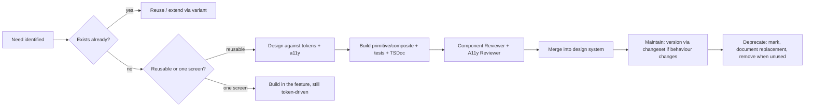

# Component Library Guidelines

> How we build, name, document, and test reusable components. Complements
> [`DESIGN_SYSTEM.md`](DESIGN_SYSTEM.md) (what things look like) and
> [`FRONTEND_ARCHITECTURE.md`](FRONTEND_ARCHITECTURE.md) (where they live).

## The five qualities

Every reusable component must be:

- **Composable** — built from smaller primitives; exposes composition
  (children/slots) over configuration flags. Prefer `<Card><Card.Header/>…`
  patterns to a dozen boolean props.
- **Documented** — typed props with TSDoc, and (for primitives) a usage example.
- **Testable** — behaviour verifiable via Testing Library queries by role/label.
- **Accessible** — keyboard + screen-reader support and correct semantics
  built in, not bolted on.
- **Reusable** — no business logic, no feature-specific assumptions, no
  hard-coded copy. Content comes via props/children.

## Component tiers

| Tier                   | Location                                    | Contains                                                     | May depend on                         |
| ---------------------- | ------------------------------------------- | ------------------------------------------------------------ | ------------------------------------- |
| **Primitive**          | `components/ui/`                            | Design-system building blocks (Button, Input, Dialog, Sheet) | tokens, native `<dialog>`, `cn()`     |
| **Composite / layout** | `components/layout/`, feature `components/` | Assemblies (PageHeader, DataTable, BillCard)                 | primitives                            |
| **Route/page**         | `routes/`                                   | Screen composition + data                                    | composites, primitives, feature hooks |

Dependencies point **down** the tiers only. Primitives never import feature code.

## Naming conventions

- **Files & components:** `PascalCase` (`DataTable.tsx` exports `DataTable`).
  One primary component per file; co-locate tightly-coupled subcomponents.
- **Hooks:** `useCamelCase` (`useMediaQuery`), in `hooks/` (shared) or a
  feature's `hooks/`.
- **Types/interfaces:** `PascalCase`; a component's props are `‹Name›Props`.
- **Variants:** named, semantic values (`intent="destructive"`, `size="sm"`) —
  never style-leaking names like `blueBig`.
- **Booleans:** positive and prefixed (`isLoading`, `hasError`, `disabled`).
- **Event props:** `onX` for events, `onXChange` for controlled value changes.
- **Test files:** `‹Name›.test.tsx`, co-located with the component.
- **Feature public surface:** exported from the feature's `index.ts`; everything
  else is private to the feature.

## Component API rules

- **Props are minimal and typed.** No `any`. Extend the underlying element's
  props where sensible (`React.ComponentProps<'button'>`) so `className`,
  `aria-*`, and refs pass through.
- **Forward refs** on primitives that wrap a DOM node.
- **`className` merges**, it doesn't override — use `cn()` so callers can extend
  without breaking base styles. Do **not** expose `style` for theme-able values;
  use variants/tokens.
- **Variants via CVA.** Declare the variant matrix once; the component's type is
  derived from it. Call sites pick variants, never hand-write class strings.
- **Controlled/uncontrolled:** support both where it matters (inputs), following
  the conventional prop shape (`value`/`defaultValue`, `onValueChange`). Some
  primitives are deliberately **controlled-only** — `Combobox` is, because the
  consumer owns the query, the debounce and the paging.
- **No business logic or data fetching** inside reusable components — pass data
  and callbacks in. Fetching lives in feature `api/` hooks.
- **No hard-coded user-facing copy** in primitives/composites.

## Component lifecycle


```mermaid
flowchart LR
  A[Need identified] --> B{Exists already?}
  B -- yes --> C[Reuse / extend via variant]
  B -- no --> D{Reusable or one screen?}
  D -- reusable --> E[Design against tokens + a11y]
  E --> F[Build primitive/composite + tests + TSDoc]
  F --> G[Component Reviewer + A11y Reviewer]
  G --> H[Merge into design system]
  D -- one screen --> I[Build in the feature, still token-driven]
  H --> J[Maintain: version via changeset if behaviour changes]
  J --> K[Deprecate: mark, document replacement, remove when unused]
```

1. **Propose/justify** — reuse before building; extend before duplicating.
2. **Design** — against tokens and accessibility from the start.
3. **Build** — typed API, all states, light+dark, keyboard + SR support.
4. **Test** — behaviour and a11y (see below).
5. **Review** — Component + Accessibility reviewers (agents) for non-trivial
   components.
6. **Document** — props (TSDoc) and usage; add to the design-system inventory.
7. **Maintain** — behaviour-changing edits get a changeset; keep the API stable.
8. **Deprecate** — mark deprecated, document the replacement, remove once unused.
   Never leave two ways to do the same thing.

## Required states

A component with interaction or data must implement, and test, every applicable
state: default, hover, active/pressed, focus-visible, disabled, loading/busy,
error, empty, and selected/active. A missing state is an incomplete component.

## Testing requirements

- **Unit/behaviour** (Vitest + Testing Library): query by role/label, assert
  behaviour and accessible names — not implementation details or class names.
- **Interaction:** keyboard operability (Tab/Enter/Space/Esc/arrows as relevant)
  and focus behaviour for interactive components.
- **Variants:** at least a smoke render per variant/size.
- **Coverage:** meet the repo bar (`docs/TESTING.md`); every bug fix adds a
  regression test.
- Critical flows also get a Playwright journey with accessibility assertions.

## Primitive: `Combobox` (`components/ui/combobox.tsx`)

The single **picker** primitive: a hand-rolled WAI-ARIA APG "Combobox with List
Autocomplete" on semantic HTML (no new dependency), sibling to `Menu`. It exists
because a native `<select>` cannot type-ahead-filter against a server, page a
large library, or annotate an option with its tier/state — and ADR-0053 §4 needed
all three in four different pickers (plan calendar, activity calendar, resource
calendar, assignment resource) plus the resource-group tree picker.

**It never fetches.** It is fully controlled and deliberately presentational: the
consumer owns `options`, `query`/`onQueryChange` (so it picks its own debounce and
query key) and `onLoadMore`. That keeps feature code out of the primitive tier and
lets the same component sit over a paged server search, a plain array, or a tree.

```tsx
<Label htmlFor="plan-calendar">Calendar</Label>
<Combobox
  id="plan-calendar"
  value={calendarId}
  onChange={setCalendarId}
  query={query}
  onQueryChange={setQuery}          // debounce here when the search is server-side
  options={options}                 // { value, label, group?, badge?, depth?, disabled? }
  selectedLabel={current?.name}     // renders the current value even when filtered out
  groupLabels={{ org: 'Organisation calendars', project: 'This project’s calendars' }}
  emptyOption={{ label: 'None' }}   // selecting it emits ''
  loading={isFetching}
  hasMore={hasMore}
  onLoadMore={loadMore}
  emptyMessage="No calendars match your search."
/>
```

Behaviours worth knowing before reaching for it:

- **The current value always renders**, even when the page it came from is filtered
  away — `selectedLabel` supplies the text, falling back to `Loading…`/`Unavailable`.
  A selection can therefore never silently blank. That **includes `emptyOption`**:
  `value=''` renders its label ("None", "Inherit from plan", "Top level"), exactly as
  the native `<select value="">` it replaces did. `''` with no `emptyOption` is the
  only genuinely-unset state, and that is what `placeholder` is for.
- **`badge` is part of the option's accessible name** (`"Standard, Archived"`), not a
  decorative pill — state is announced as well as seen (WCAG 1.4.1).
- **`depth` indents** for a tree picker. Never the only cue: pair it with a badge, a
  group, or a text column elsewhere.
- **"No matches" reflects `options`, not the reachable rows** — an `emptyOption` or a
  still-rendered selection never disguises a search that matched nothing.
- **"Load more" is keyboard-operable** — it is a real option and the last stop in the
  arrow-key sequence (Enter loads the next page without closing the popup or moving the
  selection), because it is the only route to page 2+ of a server-searched library
  (WCAG 2.1.1). Opening upwards with ArrowUp lands on the last real option, never on it.
- **The listbox is in-flow (absolute), not portalled** — its consumers live inside the
  native `<dialog>` used by `Dialog`, where a body portal would render _behind_ the
  top layer.
- Escape is handled on a capture-phase document listener, so it dismisses the popup
  **without** closing a surrounding `Dialog`.

Scope is intentionally minimal: single-select, list autocomplete (typing filters; it
never rewrites the input), no multi-select and no free-text entry. A consumer needing
more should extend this primitive rather than fork it. Behaviour + a11y contract:
`components/ui/combobox.test.tsx`.

## Primitive: `SearchField` (`components/ui/search-field.tsx`)

The house **list search** control: a labelled input with a leading Lucide `Search`
icon and an explicit clear button, over the shared `Input` — the `DESIGN_SYSTEM.md`
"Search" contract made concrete.

It exists because `type="search"`'s native ✕ is Chromium-only and never
keyboard-reachable, so a bare `<Input type="search">` leaves keyboard and screen-reader
users no way to clear a term. The clear affordance here is a real `<button>` with an
accessible name; the native one is suppressed so there is exactly one.

```tsx
<SearchField
  label="Search calendars" // visible label, never placeholder-only
  placeholder="Search by name"
  clearLabel="Clear calendar search" // the button's accessible name
  value={term}
  onChange={setTerm}
/>
```

Presentational and fully controlled: the consumer owns the term, the debounce and the
fetch. It does **not** own URL state either — a list screen's search belongs in typed
search params, which is the route's job (`hooks/use-url-filter-state.ts`).

## Primitives: `SegmentedControl` and `ToggleChip` — and how to choose

Two controls that look similar and mean different things. The choice is **semantic**, not
visual, and getting it backwards misdescribes the control even when it renders correctly.

| Use                | When                                                                                                 | Semantics                             |
| ------------------ | ---------------------------------------------------------------------------------------------------- | ------------------------------------- |
| `SegmentedControl` | A **mutually-exclusive** choice from a known set — Diagram _or_ Activities, Day _or_ Month _or_ Year | APG `radiogroup`: "one of a set of N" |
| `ToggleChip`       | An **independent boolean** — Critical, Chain, Non-working. Each stands alone                         | `aria-pressed` button: "this is on"   |
| `Badge`            | Output, not a control                                                                                | Plain text                            |

`SegmentedControl` (`components/ui/segmented-control.tsx`) implements the APG radiogroup:
roving `tabindex`, Arrow/Home/End with wraparound, `aria-checked`, and **focus follows
selection** (the control is the thing being acted on, so leaving focus behind would strand the
user on an option that is no longer current). Callers supply `label`, `value`, `onChange`,
`options`, and may add sizing classes — never colour.

`value` may be **`null`** for a question with **no answer yet** — a choice the user must make
rather than one with a default (the import dialog's resource-name collisions). The APG rule then
applies and the primitive enforces it: the **first** option carries the group's single tab stop,
so an unanswered group is still reachable. Deriving the tab stop from `value === option` alone
would give every option `tabIndex={-1}` and make it keyboard-unreachable — a WCAG 2.1.1 failure
that renders perfectly. Do **not** reach for `null` to express a default; if one of the options is
the safe answer, pass it.

`ToggleChip` (`components/ui/toggle-chip.tsx`) is a CVA `aria-pressed` button. Its pressed
state changes **fill and border**, so it never signals state by hue alone (WCAG 1.4.1).
**A chip that filters owes an announcement**: filtering a list without changing an announced
result count leaves screen-reader users with no evidence anything happened (WCAG 4.1.3) — pair
it with `useResultCountAnnouncement` or an equivalent live region. A chip that is a **form
field** owes nothing extra: its own `aria-pressed` already reports the value, and there is no
result set to count.

The reference consumer is the **working-days picker** in `CalendarFormDialog`'s
`WeekdayToggleGroup` — seven independent booleans in a labelled `<fieldset>`, which is the
form-field case above. It is deliberately not a `SegmentedControl`: turning Monday on says
nothing about Tuesday, so "one of a set of N" would misdescribe it.

## Primitive: `Tabs` (`components/ui/tabs.tsx`)

The WAI-ARIA APG `tablist` pattern, hand-rolled like `Menu` and `Combobox`. Controlled:
callers own `active` and pass `onChange`; the panel's content comes from a
`children: (active) => ReactNode` render prop, so there is exactly one panel in the DOM.

**It has one consumer** — `ActivityEditorDialog` — and is built for it deliberately. No
`renderTab` escape hatch, no orientation prop, no lazy-mount option. That is not an oversight
to be corrected the first time a second caller appears; it is the lesson `form.tsx` records,
where an escape hatch added "for flexibility" was removed the day it shipped. Add options when
a real second consumer needs them, and not before.

**Automatic activation.** Arrowing selects rather than merely focusing, which the APG
recommends when revealing a panel is cheap. Every panel's data is already in memory here, so
manual activation would only cost a keystroke.

**The panel is a tab stop (`tabIndex={0}`), which departs from the APG.** The APG suggests that
only for panels with no focusable children — guidance that assumes a panel which fits. Ours is
a scroll container inside a dialog, and a scrollable region that is not focusable cannot be
scrolled by keyboard at all. The conflict is real and **WCAG 2.1.1 wins**: the cost is one
extra tab stop, the alternative is content a keyboard user cannot reach. Recorded in ADR-0060
so it reads as a decision rather than a mistake.

**Markers are text, never colour** (WCAG 1.4.1). A `TabDescriptor`'s optional `marker` renders
a visible count badge or a presence dot **and** extends the tab's accessible name — "Scheduling,
3 problems". Its `label` is required for exactly that reason: a marker nobody can hear is
colour-only meaning, which is the specific way a validation error hides on an unfocused tab. An
unmarked tab's accessible name stays exactly its visible label, keeping name-in-label intact
(WCAG 2.5.3).

The tablist **scrolls horizontally rather than wrapping**: a wrapped tablist changes height as
markers appear and disappear, which reflows the panel under the user's cursor mid-edit.

## Layout: `BrandMark` and `AccountChip`

`BrandMark` (`components/layout/brand-mark.tsx`) is the tile + wordmark. The tile is
`bg-primary text-primary-foreground`, i.e. a token: inside chrome that is Corporate's amber on
navy and the brand blue on a white header. A literal amber would be unreadable on Light chrome.
The tile is `aria-hidden` — it repeats the wordmark's first letter, so exposing it would have a
screen reader announce "S SchedulePoint".

`AccountChip` (`components/layout/account-chip.tsx`) is an initials avatar opening a portalled
`Menu` with the theme choice, the signed-in email and Sign out. It replaced a theme-cycling
button, an always-visible email and an `outline` Sign-out button — two of which were the
Corporate theme's worst contrast defects. Three things it must keep doing: the trigger's
accessible name carries the email (initials identify nobody), focus returns to the trigger on
close, and the sign-out mutation's pending state disables the item so a second press cannot
fire a duplicate request. The theme is a **radio group** rather than a cycling button, because
a cycle never tells the user what the other three options are.

## Layout: `AuthShell` (`components/layout/auth-shell.tsx`)

The centred card every **public** screen sits in — sign-in, sign-up, accept-invite, and the
account-recovery screens (ADR-0074). It is the page's single `main` landmark, takes an optional
`title`/`description` (omit them when the children own their heading, as the accept-invite card
does), a `size` of `sm` for forms or `md` for the wider decision screens, and reflects `busy` as
`aria-busy`.

**It mounts `AnnouncerProvider`, and a public screen depends on that.** The app's provider lives
inside the authed shell, so out here `useAnnounce()` would otherwise resolve to the context's
no-op default and every "Check your email" / "That link has expired" would be announced to
nobody — silently, which is the only way that defect ever ships. Mounting the **same** provider
rather than hand-rolling a second live region is what keeps a component like
`ResendVerificationButton` working identically on a public screen and an authed one without
knowing where it is.

`InviteShell` is a thin named wrapper over it (`size="md"`, no title) rather than a second
implementation: it was a near-copy that had already drifted on width and on whether it announced
anything, and three new public screens were about to make that five callers on two shells — the
ADR-0062 shape, where each looks right alone and only a reader who opens the same thing two ways
ever notices one is a version behind.

## Primitive: `Surface` (`components/ui/surface.tsx`)

Marks a region as a **surface scope** (ADR-0055): the semantic token names keep their
meaning but resolve to a family validated for that surface.

```tsx
<Surface tone="chrome" as="header" className="border-border sticky top-0 border-b">
  {/* Descendants need no change: inside this scope, `text-muted-foreground` IS a grey
      validated against the header's fill. */}
</Surface>
```

**A scope is a component, not a class — deliberately.** The `--chrome-*` / `--panel-*`
families are not mapped into Tailwind's theme, so `bg-chrome` does not compile. There is no
class to hand-apply, which is what makes the boundary structural rather than a convention
someone has to remember. `surface-seams.structural.test.ts` pins the allowlist.

Contract:

- `tone` — `'chrome'` (the top band) or `'panel'` (the Project Explorer rail).
- `as` — the element to render (`header`, `nav`, `aside`…); defaults to `div`. Use
  `className="contents"` when the scope should be a pure colour context with no box.
- Renders `bg-background text-foreground`, which inside the scope _are_ the surface's own
  colours.
- **Nesting the same tone twice throws in development** and renders in production (the
  `defineToolbar` precedent): an inner scope rebinding names to the values they already
  hold means its author believes they are changing surface and are not.
- **Never branch on surface in JS.** The context exists only for that nesting check and is
  not exported. If a component needs to know where it is, the token vocabulary is
  incomplete — fix the family, not the component.

Overlays are outside every scope by construction: `Menu`, `Dialog`, `Sheet` and the
combobox listbox portal to `document.body`, so a menu opened from the navy toolbar paints
on `--popover`. That is intended — an overlay belongs to the page, not to the surface that
summoned it.

## Documentation requirements

- **TSDoc** on the component and any non-obvious prop.
- A short **usage example** for primitives (in the file header or a co-located
  example) showing the common case and one variant.
- Add the component to the inventory in [`DESIGN_SYSTEM.md`](DESIGN_SYSTEM.md)
  when it becomes a shared standard.

## Anti-patterns (rejected in review)

- One-off styling or magic values instead of tokens/variants.
- Boolean-prop explosions instead of composition.
- Business logic, data fetching, or hard-coded copy inside reusable components.
- Duplicating an existing pattern instead of extending it.
- Removing focus outlines; `div`/`span` used as buttons; icon-only controls with
  no accessible name.
