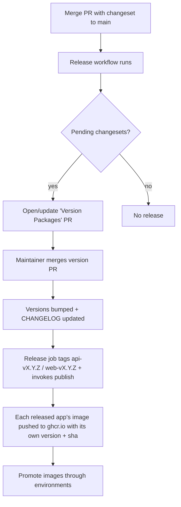
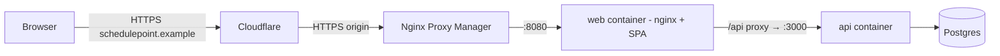

# Deployment & Release

> **Status:** the release pipeline (versioning + image publishing) is defined;
> the concrete hosting platform is an open decision (see
> [TECH_DEBT.md](TECH_DEBT.md)). This document describes the process the
> foundation supports.

## Release flow (overview)



## Versioning

- **Semantic Versioning**, driven by **Changesets**. Contributors add a
  changeset (`pnpm changeset`) for user-visible changes.
- The [`release`](../.github/workflows/release.yml) workflow maintains a
  "Version Packages" PR. Merging it bumps versions and writes `CHANGELOG.md`
  entries; the workflow then tags **each app that released independently** —
  `api-vX.Y.Z` / `web-vX.Y.Z` — and invokes image publishing directly for those
  apps (ADR-0027). Per-package tags are used because the two apps version on their
  own cadence, and a single aggregate `vX.Y.Z` tag silently skipped a web-only
  release once web caught up to api's version. (It does **not** use `changeset
publish` — that is npm-only and no-ops on our private packages, so it never tags.
  And it publishes by calling `docker-publish` as a reusable workflow rather than
  relying on the tag push to trigger it, because a push made with the default
  `GITHUB_TOKEN` cannot start another workflow.)

## Container images

- Built by [`docker-publish.yml`](../.github/workflows/docker-publish.yml): on
  version tags, when invoked by the release workflow (`workflow_call`), and
  manually via `workflow_dispatch`.
- Published to **GitHub Container Registry** (GHCR paths are all-lowercase):
  - `ghcr.io/huttonhomehub/schedulepoint_1/api`
  - `ghcr.io/huttonhomehub/schedulepoint_1/web`
- Tags: each image carries **its own** app version + `latest` on a release, plus
  commit `sha` and the branch name (e.g. `:main`) on manual/branch builds. Because
  the two apps version independently (ADR-0027), a coordinated deploy should pin
  `:main`/`:latest`/a git `sha`, or pin each app to its own version. Images include
  an **SBOM** and **build provenance**.
- Images are **immutable**: the same artifact is promoted across environments;
  we never rebuild per environment.
- To run the published images locally, use
  [`docker-compose.release.yml`](../docker-compose.release.yml) (see its header for
  the `docker login` and `IMAGE_TAG` steps). The API container applies pending
  database migrations on startup (`prisma migrate deploy`), so no manual
  migration step is needed.

## Running behind a reverse proxy (e.g. Nginx Proxy Manager + Cloudflare)

A common self-hosted topology fronts the stack with a reverse proxy and a CDN.
The browser only ever talks to the **web** container's public origin; the web
container's nginx proxies `/api/*` to the API on the internal network, so the
SPA calls the API **same-origin** (relative `/api/v1` — see
`apps/web/src/config/env.ts`). The API is **not** exposed publicly.



Point the proxy at the **web** container (`:8080`) only. Because the SPA uses a
relative API base, **you do not rebuild the web image per domain** — the same
image serves any hostname (`VITE_API_URL` is not consumed by the app).

### Required configuration

Set these on the **api** container (via your secret manager, not the compose
defaults). With `NODE_ENV=production` the API enforces its startup guards, so
all three below are mandatory:

| Variable             | Value for `https://schedulepoint.example`                                                                          | Why                                                                                                                   |
| -------------------- | ------------------------------------------------------------------------------------------------------------------ | --------------------------------------------------------------------------------------------------------------------- |
| `NODE_ENV`           | `production`                                                                                                       | Enables secure (HTTPS-only) auth cookies and the config guards.                                                       |
| `BETTER_AUTH_SECRET` | a strong random value (`openssl rand -base64 32`)                                                                  | Guard refuses to boot with a dev/insecure secret.                                                                     |
| `CORS_ORIGINS`       | `https://schedulepoint.example`                                                                                    | This is Better Auth's `trustedOrigins`. Must equal the **browser** origin or sign-up/in returns `403 Invalid origin`. |
| `BETTER_AUTH_URL`    | `https://schedulepoint.example`                                                                                    | The public base URL the auth handler builds links/callbacks against.                                                  |
| `TRUSTED_PROXY_IPS`  | the proxy hop(s) in front of the API (e.g. the Docker bridge CIDR such as `172.16.0.0/12`, or the web/NPM host IP) | Lets the API trust `X-Forwarded-For`/`-Proto` for the real client IP; guard refuses an empty value in production.     |

### Cloudflare & TLS

- Use SSL/TLS mode **Full (strict)** so every leg is HTTPS: the browser→Cloudflare
  leg (which makes the `Secure` auth cookie valid) **and** the Cloudflare→origin
  leg (so `X-Forwarded-Proto: https` reaches the API and links resolve as HTTPS).
  Give Nginx Proxy Manager a valid certificate (e.g. Let's Encrypt) for the origin.
- Ensure the proxy forwards `Host`, `X-Forwarded-For`, and `X-Forwarded-Proto`
  (Nginx Proxy Manager's "Websockets support" + default forwarding is fine); the
  web container already sets these when proxying to the API.

### Common pitfall: `403 Invalid origin` on sign-up/sign-in

Better Auth rejects any request whose `Origin` header is not in `trustedOrigins`
(= `CORS_ORIGINS`). If you reach the app on a URL that is not listed — a raw
`http://LAN-IP:8080`, a preview hostname, or the domain when `CORS_ORIGINS`
still points at localhost — auth calls fail with `403 Invalid origin`. Set
`CORS_ORIGINS` to the exact origin shown in the browser address bar. For a
plain HTTP LAN test (no TLS), also set `NODE_ENV=development`, otherwise the
`Secure` cookie is set but never sent back over HTTP and login silently fails.

## Environments (intended)

| Environment | Purpose                     | Source                            |
| ----------- | --------------------------- | --------------------------------- |
| Local       | Development                 | `docker compose`                  |
| Staging     | Pre-production verification | image tag from `main`/pre-release |
| Production  | Live                        | promoted SemVer-tagged image      |

Configuration and secrets are supplied per-environment via the platform's
secret manager — never baked into images or committed. See
[`.env.example`](../.env.example) for the required variables.

## Database migrations

- Applied with `prisma migrate deploy` as part of the release/deploy step,
  before the new API version serves traffic.
- Migrations are backward-compatible where feasible (expand/contract) so a
  rollout can proceed without downtime and a rollback stays safe.

## Runtime health & rollout

- The API exposes `/health` (liveness/readiness) for the orchestrator.
- Roll out gradually where the platform supports it; watch health and error
  rates. **Rollback = redeploy the previous image tag** (plus any compensating
  migration).

## Deploying a release to a self-hosted host (Docker Compose / Dockge)

**Publishing an image is not the same as deploying it.** A release builds and
pushes `web`/`api` images to GHCR automatically, but a running host keeps serving
whatever image it already pulled until you tell it to pull the new one. A release
that no host pulls simply never reaches users.

The reference stack (`docker-compose.release.yml`, and the production Dockge
stack) selects images by a tag from the environment:

```yaml
web:
  image: ghcr.io/huttonhomehub/schedulepoint_1/web:${WEB_IMAGE_TAG:-latest}
api:
  image: ghcr.io/huttonhomehub/schedulepoint_1/api:${API_IMAGE_TAG:-latest}
```

Two ways to run it:

- **Track `latest` (recommended for a single production line).** Set
  `WEB_IMAGE_TAG=latest` and `API_IMAGE_TAG=latest` in the stack `.env` (or omit
  them — the compose defaults to `latest`). Every release moves `web:latest` /
  `api:latest` to the newest of _that_ image (the two version independently, so
  each `latest` tracks its own app — ADR-0027). To ship a release you then just
  **pull + recreate** (below); no tag editing.
- **Pin explicit versions** (for staged/coordinated rollouts or easy rollback):
  set `WEB_IMAGE_TAG=0.15.0`, `API_IMAGE_TAG=0.10.1`, etc. Bump the pin per
  release. `latest` is ignored.

**Redeploy steps (both approaches need the pull):**

1. In **Dockge**, open the stack and click **Update** — it runs
   `docker compose pull` then `docker compose up -d`. From the host CLI in the
   stack directory the equivalent is:
   ```bash
   docker compose pull        # fetch the new image (or the moved :latest)
   docker compose up -d        # recreate only the containers whose image changed
   docker compose ps           # confirm versions + health
   ```
2. **A plain restart is a no-op.** `restart`/`up` without a `pull` re-uses the
   cached image — so restarting a `latest` stack does **not** pick up a new
   release. Always pull.
3. The **API self-migrates** on startup (`prisma migrate deploy`, ADR-0018), so a
   version bump applies pending DB migrations automatically before it serves.
4. Hard-refresh the browser (Ctrl/Cmd-F5) to drop the cached old web bundle.

**Rollback:** pin the previous version tag and Update (plus any compensating
migration) — see _Runtime health & rollout_.

### Automatic redeploy (Watchtower, opt-in — ADR-0047)

So a release reaches the host without a manual pull, the reference stack ships an
**optional** [Watchtower](https://containrrr.dev/watchtower/) service that polls
GHCR and pulls + recreates the app containers when their `:latest` digest moves.
It is **dormant by default** (a compose `autodeploy` profile) and **opt-in per
host** — nothing auto-deploys until you enable it.

**Enable it:**

```bash
# One-time: log the host in to GHCR so Watchtower can pull the private images.
echo $GHCR_PAT | docker login ghcr.io -u <github-user> --password-stdin   # read:packages

# Start the stack WITH the updater (Dockge: add COMPOSE_PROFILES=autodeploy to the
# stack .env, then Update):
COMPOSE_PROFILES=autodeploy docker compose -f docker-compose.release.yml up -d
```

What it does and does not touch:

- **Only the app containers.** It updates just the `web`/`api` containers (they
  carry `com.centurylinklabs.watchtower.enable=true`); it **never** recreates
  Postgres or itself.
- **Reuses your GHCR login.** It mounts the host Docker config
  (`/config.json`, read-only) rather than taking a PAT in the compose env. If your
  `config.json` isn't at `/root/.docker`, set `DOCKER_CONFIG_DIR` to its directory —
  an **absolute** path (Compose does not reliably expand `~`). That config must hold an
  **inline `auth` entry** for `ghcr.io`; if `docker login` used a credential helper
  (`credsStore`/`credHelpers` — common on Docker Desktop), Watchtower can't reach the
  helper and the private pull fails. Check with `grep ghcr.io ~/.docker/config.json`.
- **Self-migrates.** The recreated API applies pending migrations on startup
  (ADR-0018), so the pull **is** the deploy — no extra step.
- **Rolling + tidy.** It recreates one container at a time and prunes the old image.
  It recreates each container independently via the Docker API, so on a simultaneous
  web+api release it does **not** honour the compose `depends_on` health-gate that a
  manual `docker compose up -d` does — a brief cross-version window until both settle
  (harmless: the web nginx just retries `/api`). Use monitor-only + a manual
  `pull && up -d` if you need strict ordering.

**Knobs** (compose env, all optional):

| Variable                      | Default         | Effect                                                                                            |
| ----------------------------- | --------------- | ------------------------------------------------------------------------------------------------- |
| `WATCHTOWER_POLL_INTERVAL`    | `300`           | Seconds between GHCR checks.                                                                      |
| `WATCHTOWER_MONITOR_ONLY`     | `false`         | `true` = **notify only, don't update** — a manual gate that still tells you a release is waiting. |
| `WATCHTOWER_NOTIFICATION_URL` | _unset_         | Optional [shoutrrr](https://containrrr.dev/shoutrrr/) URL for release notifications.              |
| `DOCKER_CONFIG_DIR`           | `/root/.docker` | Host directory holding the GHCR `config.json` to mount.                                           |

**Disable it:** drop `autodeploy` from `COMPOSE_PROFILES` and `up -d` (or
`docker compose … --profile autodeploy down` to remove the container); the app
containers keep running. Note the updater needs the **Docker socket**, which is
root-equivalent on the host — an accepted cost of any host-side auto-updater, and
the reason it is label-scoped and opt-in (ADR-0047).

**Rollback still wins.** A pinned `WEB_IMAGE_TAG`/`API_IMAGE_TAG` (an explicit
version, not `latest`) is not moved by Watchtower — pin to roll back or to hold a
host on a known version.

## Pre-release checklist

- [ ] CI green on `main` (lint, typecheck, unit, e2e)
- [ ] CodeQL clean; no unresolved high-severity alerts
- [ ] Changesets present for user-visible changes
- [ ] `CHANGELOG.md` reflects the release
- [ ] Migrations reviewed and reversible/safe
- [ ] Relevant docs updated
