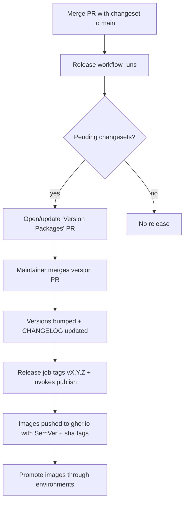

# Deployment & Release

> **Status:** the release pipeline (versioning + image publishing) is defined;
> the concrete hosting platform is an open decision (see
> [TECH_DEBT.md](TECH_DEBT.md)). This document describes the process the
> foundation supports.

## Release flow (overview)

## Versioning

- **Semantic Versioning**, driven by **Changesets**. Contributors add a
  changeset (`pnpm changeset`) for user-visible changes.
- The [`release`](../.github/workflows/release.yml) workflow maintains a
  "Version Packages" PR. Merging it bumps versions and writes `CHANGELOG.md`
  entries; the workflow then creates the `vX.Y.Z` tag and invokes image
  publishing directly. (It does **not** use `changeset publish` — that is npm-only
  and no-ops on our private packages, so it never tags. And it publishes by
  calling `docker-publish` as a reusable workflow rather than relying on the tag
  push to trigger it, because a push made with the default `GITHUB_TOKEN` cannot
  start another workflow.)

## Container images

- Built by [`docker-publish.yml`](../.github/workflows/docker-publish.yml): on
  version tags, when invoked by the release workflow (`workflow_call`), and
  manually via `workflow_dispatch`.
- Published to **GitHub Container Registry** (GHCR paths are all-lowercase):
  - `ghcr.io/huttonhomehub/schedulepoint_1/api`
  - `ghcr.io/huttonhomehub/schedulepoint_1/web`
- Tags: full SemVer + `latest` on a release, plus commit `sha` and the branch
  name on manual/branch builds. Images include an **SBOM** and **build
  provenance**.
- Images are **immutable**: the same artifact is promoted across environments;
  we never rebuild per environment.
- To run the published images locally, use
  [`docker-compose.release.yml`](../docker-compose.release.yml) (see its header for
  the `docker login`, `IMAGE_TAG`, and one-time migration steps).

## Environments (intended)

| Environment | Purpose                     | Source                            |
| ----------- | --------------------------- | --------------------------------- |
| Local       | Development                 | `docker compose`                  |
| Staging     | Pre-production verification | image tag from `main`/pre-release |
| Production  | Live                        | promoted SemVer-tagged image      |

Configuration and secrets are supplied per-environment via the platform's
secret manager — never baked into images or committed. See
[`.env.example`](../.env.example) for the required variables.

## Database migrations

- Applied with `prisma migrate deploy` as part of the release/deploy step,
  before the new API version serves traffic.
- Migrations are backward-compatible where feasible (expand/contract) so a
  rollout can proceed without downtime and a rollback stays safe.

## Runtime health & rollout

- The API exposes `/health` (liveness/readiness) for the orchestrator.
- Roll out gradually where the platform supports it; watch health and error
  rates. **Rollback = redeploy the previous image tag** (plus any compensating
  migration).

## Pre-release checklist

- [ ] CI green on `main` (lint, typecheck, unit, e2e)
- [ ] CodeQL clean; no unresolved high-severity alerts
- [ ] Changesets present for user-visible changes
- [ ] `CHANGELOG.md` reflects the release
- [ ] Migrations reviewed and reversible/safe
- [ ] Relevant docs updated
