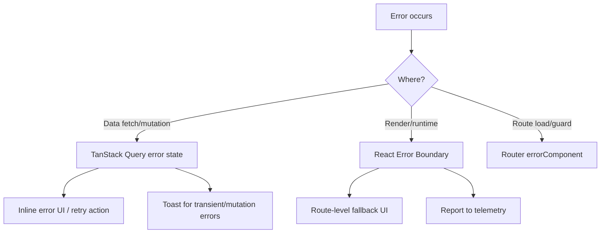
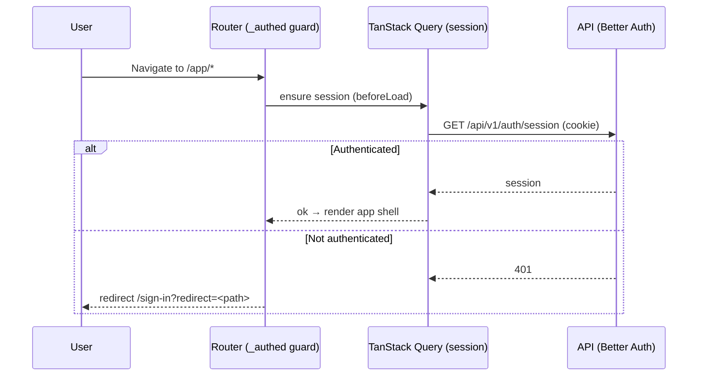

# Frontend Architecture

> **Status:** design. This document defines the architecture the web client
> (`apps/web`) will follow. No application features are implemented yet; this is
> the blueprint every future frontend change must respect. Decisions here are
> backed by ADRs [0004](adr/0004-frontend-state-management.md)–[0007](adr/0007-forms-and-validation.md).

## Guiding principles

Consistency · Accessibility · Responsiveness · Maintainability · Performance ·
Discoverability · Simplicity · Reuse. **Always optimise for long-term
maintainability over short-term convenience.**

## Technology summary

| Concern      | Choice                                            | ADR  |
| ------------ | ------------------------------------------------- | ---- |
| Framework    | React 19 + TypeScript (Vite)                      | —    |
| Styling      | Tailwind CSS v4 + design tokens + shadcn/ui + CVA | 0006 |
| Routing      | TanStack Router (file-based, type-safe)           | 0005 |
| Server state | TanStack Query                                    | 0004 |
| Client state | React local state · Context · Zustand (as needed) | 0004 |
| Forms        | React Hook Form + Zod                             | 0007 |
| Icons        | Lucide (`lucide-react`)                           | —    |
| Testing      | Vitest + Testing Library; Playwright (e2e)        | —    |

## Folder structure

A **feature-first** structure. Code is grouped by _what it does for the user_,
not by technical type. Cross-feature reuse lives in shared layers.

```text
apps/web/src/
├── main.tsx                # App entry: providers + router mount
├── app/                    # App-wide composition
│   ├── providers.tsx       #   Query client, theme, router, error boundary
│   └── router.tsx          #   Router instance & type registration
├── routes/                 # File-based routes (TanStack Router)
│   ├── __root.tsx          #   Root layout (providers-aware shell)
│   ├── _authed/            #   Layout route guarded by auth (app shell)
│   └── (public)/           #   Public routes (sign-in, etc.)
├── features/               # FEATURE modules (the bulk of the app)
│   └── <feature>/
│       ├── components/     #   Feature-scoped components
│       ├── api/            #   Query/mutation hooks + query keys
│       ├── hooks/          #   Feature-scoped hooks
│       ├── schemas/        #   Zod schemas for this feature
│       └── index.ts        #   Public surface of the feature
├── components/             # SHARED, app-agnostic components
│   ├── ui/                 #   Design-system primitives (shadcn/ui, generated)
│   └── layout/             #   App shell: sidebar, header, page scaffolds
├── hooks/                  # Shared hooks (useMediaQuery, useTheme, …)
├── lib/                    # Framework-agnostic helpers
│   ├── api/                #   Typed API client, fetch wrapper, error mapping
│   ├── query/              #   Query client factory, key helpers, defaults
│   ├── utils.ts            #   cn() and small pure helpers
│   └── telemetry.ts        #   Logging / telemetry facade
├── config/                 # Runtime config (env access, constants)
├── styles/                 # globals.css (design tokens) + any base styles
└── test/                   # Test setup and utilities
e2e/                        # Playwright specs
```

**Why:** feature-first modules keep related code together, make ownership and
deletion easy, and stop the "components/ dumping ground" anti-pattern. Shared
layers (`components/ui`, `lib`, `hooks`) hold only genuinely reusable code.
Dependencies flow **features → shared**, never shared → features, and never
feature → feature (share via a shared layer or `@repo/types`).

## Component organisation

Three tiers (details in [`COMPONENT_LIBRARY.md`](COMPONENT_LIBRARY.md)):

1. **Primitives** (`components/ui/`) — design-system building blocks (Button,
   Input, Dialog…). Accessible, themeable, no business logic. Owned as source.
2. **Composites / layout** (`components/layout/`, feature `components/`) —
   assemble primitives into meaningful UI (PageHeader, DataTable, BillCard).
3. **Route/page components** (`routes/`) — compose data + composites for a
   screen; contain no reusable logic.

## Feature organisation

Each feature is a self-contained module exposing a small public surface via its
`index.ts`. Internal files are private. A feature owns its data hooks, schemas,
and components. Deleting a feature should mean deleting one folder.

## Routing strategy (ADR-0005)

- **File-based routes** under `routes/`. Nested **layout routes** model the app
  shell once (`_authed/` renders sidebar + header; children render into it).
- **Typed params & search.** Path params and search params are validated with
  schemas; filters/pagination/sort live in typed search params (shareable,
  reload-safe).
- **Guards.** `beforeLoad` on the `_authed` layout enforces authentication and
  redirects unauthenticated users to sign-in with a `redirect` param.
- **Code splitting.** Routes are lazy by default (per-route chunks); the shell
  and critical path stay in the initial bundle. See
  [`FRONTEND_QUALITY.md`](FRONTEND_QUALITY.md).

## Data fetching & caching (ADR-0004)

**All server data goes through TanStack Query.** Components never fetch in
`useEffect` or store server data in `useState`.

- **Query hooks** live in each feature's `api/` folder (e.g. `useBills()`),
  wrapping a typed API client. UI imports hooks, not `fetch`.
- **Query keys** use a per-feature factory for consistency and safe
  invalidation:

  ```ts
  export const itemKeys = {
    all: ['items'] as const,
    lists: () => [...itemKeys.all, 'list'] as const,
    list: (filters: ItemFilters) => [...itemKeys.lists(), filters] as const,
    detail: (id: string) => [...itemKeys.all, 'detail', id] as const,
  };
  ```

- **Caching defaults** (set on the query client, tuned per query as needed):
  `staleTime` ~30s for lists, longer for rarely-changing reference data;
  `gcTime` 5m; `refetchOnWindowFocus` on for freshness; retry with backoff on
  transient errors only (never on 4xx).
- **Mutations** invalidate or optimistically update affected keys; on error
  they roll back and surface a toast (see error handling).
- **Prefetching** via route loaders warms the cache before render for a snappy
  perceived experience.
- **The API client** is a thin typed wrapper over `fetch` in `lib/api/`. It
  attaches credentials (cookies), sets headers, parses the standard response
  envelope, and maps errors to a typed `ApiError` (from `@repo/types`). A
  typed client generated from the API's OpenAPI spec (e.g. `openapi-typescript`)
  is the intended evolution once endpoints exist.

## Form handling (ADR-0007)

React Hook Form + Zod. Every form uses the shared accessible `Form` primitive
(binds labels/errors, focuses first invalid field, renders an error summary).
Submissions run through Query mutations. No bespoke form markup.

## Error handling

Layered, so nothing fails silently and users always get a recoverable state:



- **Error boundaries** wrap the app root and each route segment; they show a
  friendly fallback with a retry and report to telemetry. See
  [`FRONTEND_QUALITY.md`](FRONTEND_QUALITY.md).
- **Query errors** render inline (empty/error states) with a retry; mutation
  errors also raise a toast. 4xx are treated as expected domain outcomes and
  mapped to user-facing messages; 5xx are treated as incidents (reported).
- **Never** swallow errors or show raw messages/stack traces to users.

## Loading states

Consistency in perceived performance:

- **Skeletons** for initial content loads (match final layout to avoid shift).
- **Inline spinners / disabled + busy** for in-context actions (buttons show a
  pending state and are disabled while submitting).
- **Route pending components** for navigation; suspense boundaries for lazy
  chunks.
- Optimistic updates where safe, to make interactions feel instant.

Standards for skeletons/empty/loading live in [`DESIGN_SYSTEM.md`](DESIGN_SYSTEM.md).

## Authentication flow

Cookie-based sessions via Better Auth (see `docs/ARCHITECTURE.md` §6 and
ADR-0003). The client never stores tokens in JS-accessible storage.



- A `useSession()` query is the single source of truth for auth state.
- Sign-in/out are mutations that invalidate the session query.
- Guards live on layout routes; components read `useSession()` for conditional
  UI but never make the trust decision (the API always re-checks).

## Theme management

- Three modes: **light**, **dark**, **system**. A `ThemeProvider` (Context)
  stores the preference in `localStorage` and applies/removes the `.dark` class
  on `<html>`; `system` follows `prefers-color-scheme` live.
- To avoid a flash of the wrong theme, a tiny inline script in `index.html` sets
  the class before first paint.
- Components never branch on theme in JS — tokens flip automatically (ADR-0006).

## Responsive strategy

- **Mobile-first.** Base styles target small screens; enhance upward with
  Tailwind breakpoints (`sm 40rem`, `md 48rem`, `lg 64rem`, `xl 80rem`,
  `2xl 96rem`).
- **Fluid by default:** relative units, flex/grid, `max-width` containers;
  avoid fixed pixel widths.
- **Adaptive navigation:** the sidebar collapses to a drawer/sheet below `lg`.
- **A `useMediaQuery`/`useBreakpoint` hook** exposes breakpoints to logic when
  layout alone can't express a change.
- Layouts, tables, and dialogs each have documented responsive behaviour in
  [`DESIGN_SYSTEM.md`](DESIGN_SYSTEM.md) and [`UX_STANDARDS.md`](UX_STANDARDS.md).

## Configuration & environment

- Only `VITE_`-prefixed variables reach the client bundle. Access them through
  `config/` (a typed, validated accessor), never `import.meta.env` scattered
  across the code. No secrets in the client (see `SECURITY.md`).

## Dependency & import rules

- `features → shared`, never the reverse; no `feature → feature` imports.
- Use the `@/` alias for intra-app imports and `@repo/types` for shared
  contracts. Import order and grouping are enforced by ESLint.
- The design system is imported from `components/ui`; app code never reaches
  into Radix/shadcn internals directly.

## Testing

Per [`FRONTEND_QUALITY.md`](FRONTEND_QUALITY.md) and [`TESTING.md`](TESTING.md):
component tests with Testing Library (query by role/label), hook tests, and
Playwright journeys (including automated accessibility checks) for critical
paths.
