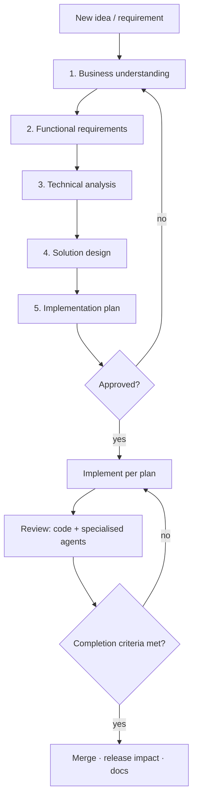
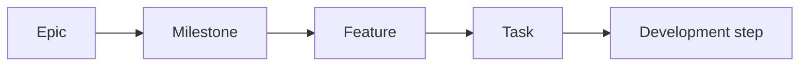

# Delivery Process — from idea to shipped feature

> The single, repeatable method for introducing **any** new requirement or
> feature into Blank App. It exists so every change is understood, designed,
> reviewed, and shipped to the same high bar — and so we **never jump from an
> idea straight to code**.
>
> Roles this process serves: Engineering Manager (flow & priorities), Product
> Owner (problem & value), Solution Architect (design), Technical Lead
> (implementation quality). One person or agent may wear several hats.

## Golden rule

**Understand → design → plan → get approval → build.** Writing code is the
_last_ step, not the first. If you can't yet describe the problem, the users,
and the acceptance criteria, you are not ready to design; if you can't describe
the design, you are not ready to plan; if the plan isn't approved, you don't
implement.

## The pipeline

Stages 1–5 produce a **Feature Spec** and an **Implementation Plan** (templates
in [`docs/templates/`](templates/)). Nothing in stages 1–5 writes application
code.

---

## Stage 1 — Business understanding

Answer, in the spec:

- **Problem** — what problem is being solved, and why now.
- **Users** — who they are (roles/personas) and what they need.
- **Primary use cases** — the handful of things they must be able to do.
- **User journeys** — the end-to-end paths (happy path + key alternates).
- **Expected outcomes** — what changes for the user/business when this ships.
- **Success criteria** — how we'll know it worked (measurable where possible).

**Identify anything unclear** and ask **only the important** clarification
questions — the ones whose answers change the design or scope. Don't ask what
you can reasonably decide yourself or find in the docs; state sensible defaults
and proceed.

## Stage 2 — Functional requirements

Convert the idea into structured, testable requirements:

- **User stories** — `As a <role>, I want <capability>, so that <benefit>`.
- **Acceptance criteria** — per story, in Given/When/Then; the definition of
  "works".
- **Workflows** — step-by-step behaviour for each use case.
- **Edge cases** — empty, maximum, concurrent, partial, and boundary conditions.
- **Permissions** — who may do what (map to RBAC + resource scope, ADR-0012).
- **Validation rules** — field/domain rules (shared client↔server where possible).
- **Error scenarios** — what can go wrong and the expected, user-safe outcome.

## Stage 3 — Technical analysis

Assess impact **before** designing the solution, across the whole system:

| Area               | Ask                                                                               |
| ------------------ | --------------------------------------------------------------------------------- |
| **Frontend**       | New/changed routes, components, state, forms? (docs/FRONTEND_ARCHITECTURE.md)     |
| **Backend**        | New/changed modules, services, endpoints? (docs/BACKEND_ARCHITECTURE.md)          |
| **Database**       | New models, migrations, indexes, constraints? (docs/DATABASE.md)                  |
| **API**            | New endpoints, versioning, contracts, OpenAPI? (docs/API.md)                      |
| **Security**       | AuthN/Z, permissions + scope, input, secrets, audit? (docs/SECURITY_STANDARDS.md) |
| **Performance**    | Query cost, N+1, caching, async/jobs, pagination? (docs/PERFORMANCE.md)           |
| **Infrastructure** | New services (Redis, storage), env/secrets, CI, containers?                       |
| **Testing**        | Unit, API/integration, e2e, a11y — what proves it? (docs/TESTING.md)              |
| **Observability**  | New logs/metrics/traces, health impact? (docs/OBSERVABILITY.md)                   |

Then list **dependencies**: prerequisites, affected features, third parties,
and anything that must land first.

## Stage 4 — Solution design

For each significant feature, design before building. Include, with **Mermaid
diagrams** where they add clarity:

- **Architecture overview** — the components involved and how they fit the
  existing architecture.
- **Data flow diagram** — how data moves through the system for this feature.
- **User flow diagram** — the user's path through the UI.
- **Database changes** — schema deltas (models, columns, indexes, constraints),
  designed with the **database-architect** agent and following DATABASE.md.
- **API changes** — new/changed endpoints, request/response DTOs, status codes,
  errors (docs/API.md).
- **Component changes** — new/changed frontend components and where they live
  (reuse the design system; no one-offs).
- **Implementation approach** — the chosen strategy and the alternatives
  considered. **If the design is architecturally significant, write an ADR**
  (see Change management).

## Stage 5 — Implementation planning

Break the work down top-down. Each level links to the one above:

- **Epic** — the initiative (maps to a roadmap theme).
- **Milestone** — a shippable increment / vertical slice.
- **Feature** — a coherent capability with its own spec.
- **Task** — a unit of work (typically one PR).
- **Development step** — the concrete steps inside a task.

Every item records: **description**, **complexity** (S/M/L/XL), **dependencies**,
**risks** (+ mitigation), and **testing requirements**. Sequence to deliver
**thin vertical slices** that keep `main` releasable. Use the
[implementation-plan template](templates/implementation-plan.md).

---

## Definition of Ready (may implementation start?)

A feature is ready to implement only when:

- [ ] Problem, users, and success criteria are clear (Stage 1)
- [ ] User stories have acceptance criteria; edge/error cases listed (Stage 2)
- [ ] Technical impact and dependencies assessed (Stage 3)
- [ ] Solution designed; ADR written if architecturally significant (Stage 4)
- [ ] Work broken into tasks with complexity/risks/tests (Stage 5)
- [ ] Critical questions answered; **the plan is approved**

## Development standards (during implementation)

Every implementation must:

- **Follow the approved architecture** (frontend & backend) — reuse before
  building; extend before duplicating.
- **Follow the design system** (tokens/components; no one-off styling) and
  **backend standards** (thin controllers→services→Prisma; deny-by-default
  auth; validated DTOs; standard envelopes; soft delete/audit/locking).
- **Include appropriate tests** (unit + API/integration + e2e/a11y as relevant).
- **Update documentation** touched by the change (docs/, READMEs).
- **Update relevant ADRs**; add a new ADR for architectural change.
- **Update `CLAUDE.md`** if project knowledge/standards change.
- **Build from the reference template.** New features are created by copying the
  canonical template (`docs/REFERENCE_FEATURE.md`,
  `apps/api/examples/reference-feature/`); diverging from its cross-cutting
  patterns requires a documented ADR (ADR-0015). Use the specialised **agents**
  to design and review (see below).

## Feature Completion Criteria (Definition of Done)

A feature is complete **only** when all hold:

- ✓ **Code implemented** to the approved design
- ✓ **Tests completed** (unit + integration/API + e2e/a11y as applicable; ≥ 80%
  on changed code; regression test for any bug fixed)
- ✓ **Documentation updated** (docs/, ADRs, READMEs)
- ✓ **Security reviewed** (security-reviewer: authN/Z, scope/IDOR, validation,
  secrets)
- ✓ **Performance considered** (backend-performance-reviewer: queries, N+1,
  pagination, caching/async where justified)
- ✓ **Accessibility considered** (accessibility-reviewer: WCAG 2.2 AA for UI)
- ✓ **Docker build succeeds** (images build; healthchecks pass)
- ✓ **CI passes** (format, lint, typecheck, tests — green)
- ✓ **Changelog updated** (a changeset added for user-visible change)
- ✓ **Version impact assessed** (SemVer bump chosen; breaking changes flagged)

This list is mirrored in the pull-request template.

## Change management

For **architectural changes**, create an [ADR](adr/) capturing:

- **Problem** / context and forces
- **Options considered** (with pros/cons)
- **Chosen solution**
- **Trade-offs**
- **Consequences** (positive, negative, follow-ups/new debt)

**Do not introduce major architectural changes without an ADR.** ADRs are
immutable once accepted — supersede, never edit. Smaller decisions go in
[`docs/DECISIONS.md`](DECISIONS.md).

## Version & release impact

Every user-visible change adds a **changeset** (`pnpm changeset`) declaring the
SemVer bump (patch/minor/major; pre-1.0 breaking → minor). Breaking API/contract
changes require an ADR and a migration note. See
[`docs/DEPLOYMENT.md`](DEPLOYMENT.md).

## Repository maintenance (periodic)

On a regular cadence (e.g. each milestone boundary), review and recommend
improvements to:

- **Architecture** — is it still fit for purpose? drift from the docs?
- **Dependencies** — updates, security advisories, unused packages.
- **Security** — new surfaces, CodeQL/secret-scanning findings.
- **Performance** — real metrics vs. targets; hot paths.
- **Technical debt** — [`docs/TECH_DEBT.md`](TECH_DEBT.md): pay down or re-justify.
- **Documentation quality** — accuracy, gaps, dead links.
- **UI consistency** — one-off styling, pattern drift.

Record outcomes as issues/backlog items, ADRs, or `TECH_DEBT.md`/`DECISIONS.md`
entries.

## Working method (especially for AI assistants)

When given a new application idea:

1. **Understand the goal** — restate the problem, users, and outcome.
2. **Analyse requirements** — draft the spec (Stages 1–3).
3. **Ask critical questions** — only those that change the design/scope; via
   `AskUserQuestion`. Otherwise state defaults and proceed.
4. **Produce a technical design** — Stage 4, with diagrams and (if needed) an ADR.
5. **Create an implementation roadmap** — Stage 5 breakdown.
6. **Wait for approval before coding.** Present the spec + plan and stop.

**Never jump directly from an idea to implementation.** The reviewer agents are
read-only advisors; the architect/analyst agents help design — use them.

## Artifacts & templates

| Artifact                      | Template                                                             | When                 |
| ----------------------------- | -------------------------------------------------------------------- | -------------------- |
| Feature Spec (Stages 1–4)     | [templates/feature-spec.md](templates/feature-spec.md)               | Every feature        |
| Implementation Plan (Stage 5) | [templates/implementation-plan.md](templates/implementation-plan.md) | Every feature        |
| ADR                           | [adr/_template.md](adr/_template.md)                                 | Architectural change |
| Worked example                | [examples/example-manage-items.md](examples/example-manage-items.md) | Reference only       |

The **feature-analyst** agent ([`.claude/agents/feature-analyst.md`](../.claude/agents/feature-analyst.md))
runs Stages 1–5 and produces these artifacts.
