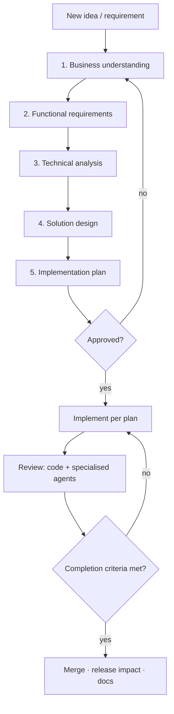
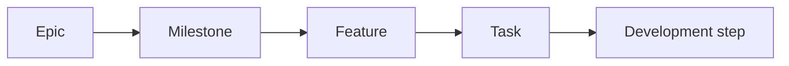

# Delivery Process — from idea to shipped feature

> The single, repeatable method for introducing **any** new requirement or
> feature into SchedulePoint. It exists so every change is understood, designed,
> reviewed, and shipped to the same high bar — and so we **never jump from an
> idea straight to code**.
>
> Roles this process serves: Engineering Manager (flow & priorities), Product
> Owner (problem & value), Solution Architect (design), Technical Lead
> (implementation quality). One person or agent may wear several hats.

## Golden rule

**Understand → design → plan → get approval → build.** Writing code is the
_last_ step, not the first. If you can't yet describe the problem, the users,
and the acceptance criteria, you are not ready to design; if you can't describe
the design, you are not ready to plan; if the plan isn't approved, you don't
implement.

## What a tech-debt row does and does not substitute for

**A row in [`TECH_DEBT.md`](TECH_DEBT.md) may stand in for stages 1–2 — but only while the change
stays inside the behaviour that row describes and adds no new surface.** The row already carries a
problem statement and a diagnosis, which is what stages 1–2 produce; that is why the substitution is
reasonable at all, and why it stops being reasonable the moment the work grows.

**The full Feature Spec and Implementation Plan are mandatory — regardless of size, and regardless
of the work having started — the moment the change does any of these:**

- adds or changes a **user-facing entry point**;
- adds or changes a **Playwright config or a CI step**;
- changes a **component's public contract** (a prop's type or optionality) or a **shared gate**;
- touches the **schema** (which additionally requires `database-architect`, without exception).

**Crossing a trigger mid-flight is not a reason to carry on.** It is the point at which the work
stops and the spec is written. The change that produced this rule did not look like spec-work when
it started and did by the time it finished.

**The triggers are what a change ADDS, never how big it is**, and that is measured rather than
chosen: across 181 non-release commits on `main`, file count is a poor discriminator — at its best
threshold a size rule still misclassifies 23% of them. The full derivation is in
[ADR-0105](adr/0105-a-register-row-is-not-a-spec.md).

---

## The pipeline

```mermaid
flowchart TD
  A[New idea / requirement] --> B[1. Business understanding]
  B --> C[2. Functional requirements]
  C --> D[3. Technical analysis]
  D --> E[4. Solution design]
  E --> F[5. Implementation plan]
  F --> G{Approved?}
  G -- no --> B
  G -- yes --> H[Implement per plan]
  H --> I[Review: code + specialised agents]
  I --> J{Completion criteria met?}
  J -- no --> H
  J -- yes --> K[Merge · release impact · docs]
```

Stages 1–5 produce a **Feature Spec** and an **Implementation Plan** (templates
in [`docs/templates/`](templates/)). Nothing in stages 1–5 writes application
code.

---

## Stage 1 — Business understanding

Answer, in the spec:

- **Problem** — what problem is being solved, and why now.
- **Users** — who they are (roles/personas) and what they need.
- **Primary use cases** — the handful of things they must be able to do.
- **User journeys** — the end-to-end paths (happy path + key alternates).
- **Expected outcomes** — what changes for the user/business when this ships.
- **Success criteria** — how we'll know it worked (measurable where possible).

**Identify anything unclear** and ask **only the important** clarification
questions — the ones whose answers change the design or scope. Don't ask what
you can reasonably decide yourself or find in the docs; state sensible defaults
and proceed.

## Stage 2 — Functional requirements

Convert the idea into structured, testable requirements:

- **User stories** — `As a <role>, I want <capability>, so that <benefit>`.
- **Acceptance criteria** — per story, in Given/When/Then; the definition of
  "works".
- **Workflows** — step-by-step behaviour for each use case.
- **Edge cases** — empty, maximum, concurrent, partial, and boundary conditions.
- **Permissions** — who may do what (map to RBAC + resource scope, ADR-0012).
- **Validation rules** — field/domain rules (shared client↔server where possible).
- **Error scenarios** — what can go wrong and the expected, user-safe outcome.

## Stage 3 — Technical analysis

Assess impact **before** designing the solution, across the whole system:

| Area               | Ask                                                                               |
| ------------------ | --------------------------------------------------------------------------------- |
| **Frontend**       | New/changed routes, components, state, forms? (docs/FRONTEND_ARCHITECTURE.md)     |
| **Backend**        | New/changed modules, services, endpoints? (docs/BACKEND_ARCHITECTURE.md)          |
| **Database**       | New models, migrations, indexes, constraints? (docs/DATABASE.md)                  |
| **API**            | New endpoints, versioning, contracts, OpenAPI? (docs/API.md)                      |
| **Security**       | AuthN/Z, permissions + scope, input, secrets, audit? (docs/SECURITY_STANDARDS.md) |
| **Performance**    | Query cost, N+1, caching, async/jobs, pagination? (docs/PERFORMANCE.md)           |
| **Infrastructure** | New services (Redis, storage), env/secrets, CI, containers?                       |
| **Testing**        | Unit, API/integration, e2e, a11y — what proves it? (docs/TESTING.md)              |
| **Observability**  | New logs/metrics/traces, health impact? (docs/OBSERVABILITY.md)                   |

Then list **dependencies**: prerequisites, affected features, third parties,
and anything that must land first.

## Stage 4 — Solution design

For each significant feature, design before building. Include, with **Mermaid
diagrams** where they add clarity:

- **Architecture overview** — the components involved and how they fit the
  existing architecture.
- **Data flow diagram** — how data moves through the system for this feature.
- **User flow diagram** — the user's path through the UI.
- **Database changes** — schema deltas (models, columns, indexes, constraints),
  designed with the **database-architect** agent and following DATABASE.md.
- **API changes** — new/changed endpoints, request/response DTOs, status codes,
  errors (docs/API.md).
- **Component changes** — new/changed frontend components and where they live
  (reuse the design system; no one-offs).
- **Implementation approach** — the chosen strategy and the alternatives
  considered. **If the design is architecturally significant, write an ADR**
  (see Change management).

## Stage 5 — Implementation planning

Break the work down top-down. Each level links to the one above:

```mermaid
flowchart LR
  E[Epic] --> M[Milestone] --> F[Feature] --> T[Task] --> S[Development step]
```

- **Epic** — the initiative (maps to a roadmap theme).
- **Milestone** — a shippable increment / vertical slice.
- **Feature** — a coherent capability with its own spec.
- **Task** — a unit of work (typically one PR).
- **Development step** — the concrete steps inside a task.

Every item records: **description**, **complexity** (S/M/L/XL), **dependencies**,
**risks** (+ mitigation), and **testing requirements**. Sequence to deliver
**thin vertical slices** that keep `main` releasable. Use the
[implementation-plan template](templates/implementation-plan.md).

Two authoring rules on top of that, both from **ADR-0081** and both written after a
milestone shipped, read as done in the commit log, and **could not be reached from the
product**:

- **A milestone claiming user-facing capability names its entry point.** Say which
  control the planner presses, in the milestone header. A milestone that deliberately
  ships dark — a schema, a pure model, a read path behind a later surface — says _that_,
  in the same place. There is no third state, and "the model landed" is not a claim that
  the capability exists.
- **The flag-on journey lands with the first user-facing milestone, not at
  enablement** — even as one skeletal step that opens the surface and presses the
  control. This is the enforcement half. The hole above survived a plan, a spec, a
  measurement harness, unit tests and a human read, and died the first time something
  drove the real product. The enablement milestone keeps its full journey; what moves
  earlier is its first step.

Working through a task list is evidence the tasks were done, not that a capability
exists — ADR-0058's _verify the claim; do not trust the document_, applied to the plan
itself.

---

## Definition of Ready (may implementation start?)

A feature is ready to implement only when:

- [ ] Problem, users, and success criteria are clear (Stage 1)
- [ ] User stories have acceptance criteria; edge/error cases listed (Stage 2)
- [ ] Technical impact and dependencies assessed (Stage 3)
- [ ] Solution designed; ADR written if architecturally significant (Stage 4)
- [ ] Work broken into tasks with complexity/risks/tests (Stage 5)
- [ ] Critical questions answered; **the plan is approved**
- [ ] **Every decision-bearing claim names its evidence** (ADR-0076) — see below

### Decision-bearing claims carry their evidence

When a spec, ADR, plan or risk table asserts a fact about behaviour — a cost, a
guarantee, a failure mode, "there is no enumeration concern here", "this is not
on the request path" — the artefact says **what was run or read** to establish
it: the command, the file and line, or the test. A pointer to another document
is not evidence; that is how a wrong claim gets laundered into a fact.

**The brief is not evidence either.** A claim inherited from the request that
started the work is checked like any other. This is not a hypothetical rule:

- ADR-0075's brief asserted "sign-up has no enumeration concern, so a design
  change is available there". It was **false**, and it had already been copied
  into a test docblock, a commit message and a `TECH_DEBT` row before anybody
  opened `sign-up.mjs`. Had it survived, the milestone would have shipped an
  account-existence oracle on an unauthenticated endpoint.
- One milestone later, that **same ADR's own risk table** said mail delivery has
  "no request-path cost". Also false — four endpoints were sitting on a live
  SMTP round trip bounded only by a ten-minute socket default.

Both were plausible, both were in the small set of statements that changed what
got built, and both passed review — because a reviewer reads a risk table as a
summary of work already done, not as a claim to test. The rule is deliberately
scoped to the decision-bearing claims: one that applies to every sentence is
followed for none.

## Development standards (during implementation)

Every implementation must:

- **Follow the approved architecture** (frontend & backend) — reuse before
  building; extend before duplicating.
- **Follow the design system** (tokens/components; no one-off styling) and
  **backend standards** (thin controllers→services→Prisma; deny-by-default
  auth; validated DTOs; standard envelopes; soft delete/audit/locking).
- **Include appropriate tests** (unit + API/integration + e2e/a11y as relevant).
- **Update documentation** touched by the change (docs/, READMEs).
- **Update relevant ADRs**; add a new ADR for architectural change.
- **Update `CLAUDE.md`** if project knowledge/standards change.
- **Build to the implementation standard.** New features match the layering,
  auth, envelopes, DB standards and tests in `docs/REFERENCE_FEATURE.md`,
  starting from the nearest real exemplar (`modules/clients`, `modules/notes`,
  `modules/share` — ADR-0057); diverging from those cross-cutting
  patterns requires a documented ADR (ADR-0015). Use the specialised **agents**
  to design and review (see below).

## Feature Completion Criteria (Definition of Done)

A feature is complete **only** when all hold:

- ✓ **Code implemented** to the approved design
- ✓ **Tests completed** (unit + integration/API + e2e/a11y as applicable; ≥ 80%
  on changed code; regression test for any bug fixed)
- ✓ **The pre-push gate was run, not just written** — `pnpm lint && pnpm
typecheck && pnpm test`, plus `scripts/e2e-local.sh api` for an `apps/api`
  change and `scripts/e2e-local.sh web:<suite>` for a new or changed flag-on
  journey (see [`docs/TESTING.md`](TESTING.md) "Before you push"). **CI is the
  second opinion, never the first.** A journey drives a real browser against a
  real API, so no unit suite can catch a wrong locator, a control whose
  accessible name differs from the assumption, or a panel that is collapsed
  under the flags that suite sets — and each of those costs a full CI cycle to
  learn.
- ✓ **Documentation updated** (docs/, ADRs, READMEs)
- ✓ **Security reviewed** (security-reviewer: authN/Z, scope/IDOR, validation,
  secrets)
- ✓ **Performance considered** (backend-performance-reviewer: queries, N+1,
  pagination, caching/async where justified)
- ✓ **Accessibility considered** (accessibility-reviewer: WCAG 2.2 AA for UI)
- ✓ **Docker build succeeds** (images build; healthchecks pass)
- ✓ **CI passes** (format, lint, typecheck, tests — green)
- ✓ **Changelog updated** (a changeset added for user-visible change)
- ✓ **Version impact assessed** (SemVer bump chosen; breaking changes flagged)

This list is mirrored in the pull-request template.

### Finishing a milestone is not finishing the work

A milestone that satisfies every box above is **done**; the _programme_ it belongs to is
not. When a multi-milestone plan has been approved, the next slice starts immediately —
in the same working turn — and the only two reasons to stop are that **every milestone
is complete** or that **a question needs an answer only the product owner can give**.

Written after an approved programme lost seven and a half hours between two milestones
with nothing failing and nothing blocked: a slice landed, a progress summary was
written, and the work simply did not resume until the product owner asked why. The
summary was the problem — it read like a natural end. It is not one. Report at the end
of a turn, not instead of continuing; and where a turn boundary would otherwise end the
work, schedule the resumption before it can (CLAUDE.md §19.11).

A blocking question blocks **one milestone**, not the programme. Ask it, then carry on
with everything that does not depend on the answer.

## Change management

For **architectural changes**, create an [ADR](adr/) capturing:

- **Problem** / context and forces
- **Options considered** (with pros/cons)
- **Chosen solution**
- **Trade-offs**
- **Consequences** (positive, negative, follow-ups/new debt)

**Do not introduce major architectural changes without an ADR.** ADRs are
immutable once accepted — supersede, never edit. Smaller decisions go in
[`docs/DECISIONS.md`](DECISIONS.md).

## Version & release impact

Every user-visible change adds a **changeset** (`pnpm changeset`) declaring the
SemVer bump (patch/minor/major; pre-1.0 breaking → minor). Breaking API/contract
changes require an ADR and a migration note. See
[`docs/DEPLOYMENT.md`](DEPLOYMENT.md).

## Repository maintenance — the reconciliation pass

**Trigger: each epic boundary, with a three-month hard floor.** The procedure is
[`docs/RECONCILE.md`](RECONCILE.md); the reasoning is
[ADR-0058](adr/0058-drift-control-and-the-reconciliation-pass.md).

This used to read "on a regular cadence (e.g. each milestone boundary)". That
produced months of drift — the operating manual described a repository with no
domain code while nineteen modules were shipping — so the trigger is now
specific and the checklist is derived from findings rather than imagination.

The pass covers architecture, dependencies, security, performance, the debt
register, documentation accuracy and UI consistency. Its governing rule:
**verify the claim; do not trust the document.** Every drift found so far was a
confident sentence nobody had re-checked.

Record outcomes as issues/backlog items, ADRs, or `TECH_DEBT.md`/`DECISIONS.md`
entries — and record **what was found wrong**, not just what changed. Those
findings are the evidence that the next pass is worth running.

## Working method (especially for AI assistants)

When given a new application idea:

1. **Understand the goal** — restate the problem, users, and outcome.
2. **Analyse requirements** — draft the spec (Stages 1–3).
3. **Ask critical questions** — only those that change the design/scope; via
   `AskUserQuestion`. Otherwise state defaults and proceed.
4. **Produce a technical design** — Stage 4, with diagrams and (if needed) an ADR.
5. **Create an implementation roadmap** — Stage 5 breakdown.
6. **Wait for approval before coding.** Present the spec + plan and stop.

**Never jump directly from an idea to implementation.** The reviewer agents are
read-only advisors; the architect/analyst agents help design — use them.

## Artifacts & templates

**Where they live.** A feature gets **one directory**:
`docs/specs/<feature-slug>/`, holding `feature-spec.md` and
`implementation-plan.md` side by side. It stays there after the feature ships —
it is the record of what was agreed, and ADRs cite it.
(`docs/plans/` and `docs/archive/` are historical; nothing new goes in either.)

| Artifact                      | Template                                                             | When                 |
| ----------------------------- | -------------------------------------------------------------------- | -------------------- |
| Feature Spec (Stages 1–4)     | [templates/feature-spec.md](templates/feature-spec.md)               | Every feature        |
| Implementation Plan (Stage 5) | [templates/implementation-plan.md](templates/implementation-plan.md) | Every feature        |
| ADR                           | [adr/_template.md](adr/_template.md)                                 | Architectural change |
| Worked example                | [examples/example-manage-items.md](examples/example-manage-items.md) | Reference only       |

The **feature-analyst** agent ([`.claude/agents/feature-analyst.md`](../.claude/agents/feature-analyst.md))
runs Stages 1–5 and produces these artifacts.
