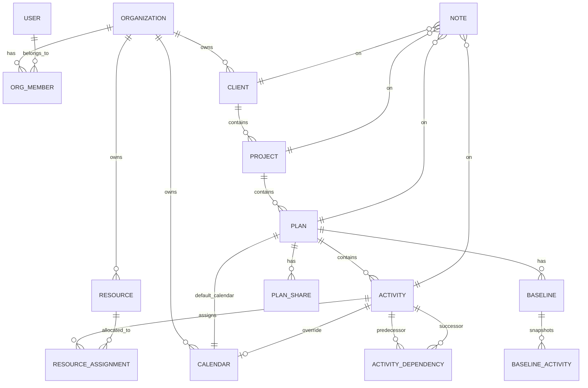

# Project Brief: SchedulePoint

- **Status:** Draft
- **Owner(s):** James Ewbank
- **Date:** 2026-07-09
- **Version:** 0.1
- **Related:** [`CLAUDE.md`](../CLAUDE.md) · [`docs/PROCESS.md`](PROCESS.md) · [`docs/ROADMAP.md`](ROADMAP.md) · [`docs/adr/`](adr/)

> This is product-level context. Individual features go through [`docs/PROCESS.md`](PROCESS.md) (understand → design → plan → approve → build), produced by the **feature-analyst** agent. Keep this brief current as a living, versioned document.

---

## 1. Vision

SchedulePoint is a browser-based construction scheduling application built around a **Time-Scaled Logic Diagram (TSLD)** as its primary interaction surface — planners build a schedule by drawing activities directly on a timeline and connecting them with logic, in the tradition of the Graphical Path Method. It gives construction planners a modern, collaborative alternative to desktop scheduling tools without collapsing the schedule into a bar chart.

## 2. Goals

- Make the **graphical logic diagram the primary way** planners create and edit a schedule — not a secondary visualisation of a Gantt-based data entry.
- Provide a browser-native experience with **no desktop install, no per-seat licensing overhead**, and a workflow team members can join with a link.
- Support the **CPM / GPM feature set construction planners actually use**: four dependency types with lag, calendars, constraints, progress, floats, baselines, and resources.
- Make **schedule logic and its drivers visually obvious**: dragging an activity through time should re-flow the network live, and the critical path should be one glance away.
- Support **coordinated team use**: many people reading a schedule concurrently, and a controlled hand-off of the editing role.

## 3. Non-Goals

- Not a general task tracker or PM board (no Trello/Asana boards, no ticketing).
- Not an ERP or cost-control system (no invoicing; no earned-value beyond schedule variance).
- Not a document-management system (notes attach to entities, but no drawings / RFI / submittals workflow).
- Not a mobile-first field app in v1 (desktop / tablet planning is the target; read-only mobile is future scope).
- Not attempting to replicate the full P6 feature surface (activity codes matrices, WBS coding structures, global change, full XER round-trip) in v1.

## 4. Target Users

- **Primary:** Construction planners / schedulers / project controls engineers who build and maintain CPM schedules. Comfortable with concepts like WBS, logic, float, and critical path. Work at a desktop with a large monitor, typically 1–3 hours per day inside the schedule.
- **Secondary:** Project managers and superintendents who read schedules, mark progress, and comment. Less scheduling-savvy — need the visual view to be immediately readable.
- **Tertiary:** Clients / owners who consume a read-only view for status.
- **Usage patterns:** Focused editing sessions for the planner; brief read-only check-ins for others; weekly / bi-weekly progress cycles.

## 5. Tenancy & Roles

- **Tenancy model:** **Multi-tenant (organisations).** A user belongs to one or more organisations; clients / projects / plans are **organisation-scoped**. Construction scheduling is a team-of-teams activity (main contractor, subs, client) and organisation boundaries are needed for sharing and permissioning.
- **Roles & permissions:**
  - **Org Admin** — manage members, billing, org-level settings and libraries.
  - **Planner** — full CRUD on clients / projects / plans / activities within the org; holds the edit lock.
  - **Contributor** — update progress and add notes on assigned plans; cannot alter logic or dates.
  - **Viewer** — read-only access to shared plans within the org.
  - **External Guest** — access to a specific plan via a share link (time-limited, revocable), read-only.
- **Sharing/invitation model:** Email invitation to an organisation with a role. Per-plan share links (view-only, revocable, optional expiry) for external stakeholders.

## 6. Problem Statement

Construction scheduling tools split into two camps: (a) heavyweight desktop applications (Primavera P6, MS Project) with steep learning curves, licensing cost, and Gantt-centric UX; and (b) lightweight web tools that are Gantt-only and drop the underlying logic model altogether. Netpoint proved there is real appetite for a graphical, network-first tool — but it remains a desktop product with a narrow footprint.

Planners who want the graphical experience currently have no browser-native option that (i) treats the Time-Scaled Logic Diagram as first-class, (ii) implements CPM / GPM correctly, and (iii) supports collaborative team use. SchedulePoint fills that gap.

## 7. Success Criteria

- A planner familiar with Netpoint / P6 can build a **50-activity logic diagram in under 20 minutes** on first use.
- **≥ 70% of editing sessions** happen in the graphical (TSLD) view, not the Gantt view (measured via view-mode telemetry).
- **CPM correctness parity** with P6 on a validation suite of ~20 canonical schedules (calendars, constraints, four dependency types with lag, activity status overrides).
- **P95 recalculation < 500ms** for a 500-activity plan on typical hardware; **< 2s** for 2,000 activities.
- **Plan open → editable interactive state < 1.5s** for a 500-activity plan.
- **≤ 1% conflict rate** on the plan-lock hand-off.
- **NPS ≥ 40** among a design-partner cohort of construction planners after 3 months of use.

## 8. Core Features (MoSCoW)

**Must have**
- Multi-tenant organisations with RBAC (roles above).
- Hierarchical navigation: Org → Client → Project → Plan → Activity.
- **Graphical Time-Scaled Logic Diagram** as the primary editing surface (draw activity, drag to reposition, pull logic between activities).
- Gantt view as an alternate projection of the same data (read-primary; edit supported).
- Activity types: task, start / finish milestone, hammock, level-of-effort.
- Four dependency types (FS / SS / FF / SF) with lag (working or calendar days) and a "driving" flag.
- Calendars: org-level library, per-plan default, per-activity override.
- Date constraints: SNET, SNLT, FNET, FNLT, MSO, MFO, mandatory.
- CPM engine: forward/backward pass, total float, critical path, near-critical threshold, driving-logic tracking.
- Progress: status (not started / in progress / complete), % complete, data date, retained-logic vs progress-override.
- Baselines: named snapshots, one active baseline per plan, variance display.
- Concurrent read; single-editor plan lock with clean hand-off.
- Undo/redo for logic and date edits.
- Notes attached to any entity.
- Basic export: PDF of the graphical view, CSV of activities.

**Should have**
- Resources: labor / equipment / materials library, assignments, cost roll-up. No auto-levelling in v1.
- Sharable read-only plan links for external guests.
- Activity search / filter / trace-chain in the graphical view.
- Minimap for large diagrams.
- Keyboard-first workflow (planners are power users).
- Import from XER / MPP (read-only, best-effort) to lower switching cost.

**Could have**
- Resource histogram view.
- Version history beyond baselines (per-activity change log).
- Real-time collaborative editing (multiple planners on one plan).
- Layout auto-arrange for the network view.
- Public API / webhooks.

**Won't have (for now)**
- Cost / earned value beyond schedule variance.
- Native mobile apps.
- Full P6-compatible round-trip (XER export beyond a v1 read).
- Risk analysis / Monte Carlo.
- Document management, RFIs, submittals.

## 9. Core Domain Entities

Snake_case columns, UUID v7 IDs, timestamptz, soft delete + audit + optimistic locking come from the base standards.

Key entity notes:
- **Activity** holds CPM outputs (early/late start/finish, total float, is_critical, is_near_critical), constraint fields, activity type, calendar override, status, percent_complete, and a **graphical layout position** (y-lane / vertical offset) used by the TSLD view — layout is part of the persisted model, not a runtime concern.
- **ActivityDependency** carries dep_type (FS/SS/FF/SF), lag_days, lag_unit (working/calendar), and is_driving.
- **Baseline** freezes plan + activity snapshots at a point in time; `is_active` marks the current comparison baseline.

## 10. User Journeys

1. **Green-field plan build (planner).** Create client → project → plan; set plan calendar and start date; on the TSLD canvas, drop the first activity by clicking on the timeline; drag its width to set duration; draw a logic line from its finish to a new blank spot to create the successor; repeat. Critical path highlights as the network grows.
2. **Weekly progress update (planner + contributor).** Contributor opens the plan (read + progress permissions); marks activities % complete and actual finish; posts a note on a slipping activity. Planner re-opens for full edit, sets the data date, runs CPM, reviews impact on the critical path.
3. **Client review (viewer / guest).** Planner generates a read-only share link (optional expiry) for the client's owner rep, who opens the graphical view in a browser without an account.
4. **Baseline & variance.** Planner creates a "Contract Baseline" snapshot before mobilisation; four months in, the current schedule shows critical-path activities 12 days behind baseline in both the TSLD (variance overlay) and Gantt (variance bar).
5. **Logic what-if.** Planner temporarily changes a driving FS to SS+5, sees the network re-flow live, and undoes if unwanted — no separate "what-if scenario" mode in v1; the undo stack is enough.

## 11. Functional Requirements

Grouped by area. Each of these will be broken out into a per-feature spec via [`docs/PROCESS.md`](PROCESS.md).

- **Org & access:** invitation flow, role changes, member removal, per-plan share links with revoke.
- **Hierarchy CRUD:** clients, projects, plans; soft-delete + restore for planners.
- **Graphical (TSLD) canvas — primary edit surface:**
  - Create activity by click-drag on the timeline (start = down, duration = drag right).
  - Reposition by drag (respects calendar and constraints).
  - Create dependency by drag from one activity edge to another (dep-type modifier keys: default FS; Shift = SS; Alt = FF).
  - Zoom (day / week / month / quarter / year + slider), pan, minimap.
  - Vertical lane assignment: manual (drag up/down) with optional auto-pack.
  - Live critical-path highlight; near-critical shading.
  - Driving-relationship arrows visually distinct from non-driving.
- **Gantt view — secondary:** tabular list + bars; sortable; editable duration and dates; same underlying model.
- **CPM engine:** forward/backward pass; four dep types; lag in working or calendar days; constraint types (SNET/SNLT/FNET/FNLT/MSO/MFO/mandatory); retained-logic vs progress-override toggle at plan level.
- **Calendars:** working-day patterns, holidays, per-activity override.
- **Progress:** status + % complete + actual dates; data date.
- **Baselines:** create, activate, delete; variance display in both views.
- **Resources:** library, assignments per activity, effort/cost totals (no levelling in v1).
- **Notes:** attach to any entity, list per entity, edit/delete.
- **Search, filter, trace-chain, isolate-selection** in both views.
- **Export:** PDF of visible TSLD viewport, CSV of activities and dependencies.
- **Import:** XER / MPP read (best-effort, v1 = one-way).
- **Undo/redo:** transactional per user session, covers all model mutations.

## 12. Non-Functional Requirements (app-specific deltas)

Baselines (accessibility, general performance, security, observability) come from the standard docs — the below are app-specific deltas only.

- **Interactive canvas performance:** the TSLD must sustain **≥ 45 fps** during pan / zoom / drag on a 500-activity plan; degrade gracefully to 30 fps at 2,000 activities.
- **CPM recalculation:** incremental where possible; a full recalc of 500 activities within 500ms P95.
- **Offline behaviour:** not required in v1. If the network drops mid-edit, buffer unsaved edits locally and surface a reconnect banner; do not attempt divergent-branch reconciliation.
- **Print/PDF:** the graphical view must render deterministically to a PDF that a scheduler could hand to a client.
- **Data-scale target:** up to **10 orgs × 100 plans × 2,000 activities × 4 dependencies each** per deployment in v1.

## 13. Security, Privacy & Compliance (app-specific)

- **Data sensitivity:** schedules are commercially sensitive but not regulated PII. Standard authenticated access with org scoping is sufficient; no HIPAA / PCI in scope.
- **Retention:** soft-delete for 90 days, then permanent purge; baselines never auto-purge (they are historical record).
- **Export of user data:** an org admin can export all org data (JSON + CSV) at any time; supports customer requests without a formal GDPR posture.
- **External share links:** must be revocable, must not be indexable, must support optional expiry and optional access log.
- **Audit log:** who did what to which plan (create/edit/delete/lock) retained for 1 year minimum — construction disputes rely on this trail.

## 14. Performance & Scale (app-specific targets)

- **Concurrency:** support **20 concurrent editors per org** (each on a distinct plan — single-plan concurrent edit is post-v1) and **200 concurrent readers per org**.
- **Data volumes:** typical plan 100–500 activities; large plan 2,000 activities (upper bound for v1). Typical org 20–100 plans.
- **Response-time targets beyond default:**
  - Plan open → interactive: P95 < 1.5s at 500 activities.
  - Activity create / move / dependency add → visual feedback: < 100ms.
  - CPM recalc after edit: P95 < 500ms at 500 activities.
- **Background processing:** CPM recalculation is synchronous in v1 (fast enough at target scale); export generation is async / job-queue backed.

## 15. Technical Requirements

Stack is inherited from the base — do not re-declare it here. App-specific requirements:

- **Canvas rendering:** HTML5 Canvas (or WebGL if profiling requires) for the TSLD. Choice deferred to the design phase; if we go WebGL that's an ADR because it deviates from the base's DOM-first frontend posture.
- **Integrations & external services (v1):**
  - Email (transactional): invitations, password reset, share notifications.
  - PDF generation (server-side): baseline + rendered view. Candidate stacks (headless browser, weasyprint) — decide per ADR.
  - XER / MPP parsing: server-side, likely a Python library; treat as an isolated worker.
- **Data sources / migrations:** none — this is a green-field product with no legacy data to migrate.
- **i18n/L10n:** **single-locale (en-GB) in v1.** Dates displayed dd-MMM-yyyy by default; times UTC-stored, browser-local displayed. Currency deferred (no cost in v1 UI).
- **Deviations from base stack:** none intended. If the graphical canvas needs WebGL, capture it as an ADR.

## 16. Deployment

- **Environments:** dev (local), staging (single instance), production (single instance in v1, horizontally scalable design).
- **Hosting target:** to be decided in a deployment ADR — likely a managed platform (Fly, Render, or a small Kubernetes cluster) with managed Postgres. Not committed here.
- **Supported browsers:** latest 2 versions of Chrome, Edge, Firefox, Safari on desktop; latest 1 version of Safari / Chrome on iPad-class tablets. No IE / legacy support.
- **Backups:** daily Postgres snapshot with 30-day retention; per-org export on demand.
- **Upgrade strategy:** rolling deploys, backwards-compatible migrations only, feature-flagged rollout for schema-affecting features.

## 17. Risks

| Risk | Type | Likelihood / Impact | Mitigation |
| ---- | ---- | ------------------- | ---------- |
| TSLD rendering perf collapses at 2,000 activities | Technical | Med / High | Profile early, prototype at target scale in the design phase, be prepared to move to WebGL (ADR). |
| CPM engine bugs erode trust with construction planners | Technical | Med / High | Golden-suite of ~20 canonical schedules validated against P6 outputs; block release on parity. |
| Scope creeps as we try to match every P6 feature | Project | High / Med | Strict MoSCoW (§8); every "should-have" needs a use case from a design partner. |
| XER / MPP import quality is poor, blocking migration from P6 | Technical | Med / Med | Explicit v1 scope of "best-effort read only"; publish the supported field list. |
| Single-editor lock frustrates larger teams | Product | Med / Med | Track lock-conflict rate; graduate to real-time collab in v2 if signal warrants. |
| Feedback pulls the product back toward Gantt-first | Product | Med / High | Vision is TSLD-first; capture pushback as backlog, don't drift. |

## 18. Constraints

- **Team:** single developer + AI-assisted workflow. Roadmap must fit that throughput; feature scope is aggressive relative to team size.
- **Budget:** infrastructure budget in the low hundreds/month at launch; no room for expensive vendor stacks.
- **Time:** aim for a usable v1 within one calendar year, with design-partner alpha at ~6 months.
- **Licensing:** all dependencies must be permissive (MIT / Apache / BSD). No GPL viral libraries.
- **Compatibility:** browser-based; must not require plugins or platform-specific runtimes.

## 19. Future Possibilities

Deliberately postponed — become backlog items when a real signal picks them up:

- Resource levelling and histogram view.
- Real-time collaborative editing (multiple planners on one plan).
- Monte Carlo / risk analysis.
- Mobile field app for progress capture.
- Full XER export (round-trip with P6).
- Public API / webhooks.
- AI-assisted schedule review (missing logic, redundant constraints, dangling activities).
- Cost / earned value.
- Owner-side portal branding.

## 20. Open Questions

**Critical (block design):**
- **How is a "user in multiple orgs" navigation modelled?** Impacts URL structure, session model, and the org-switcher UI. *Default assumption:* org lives in the URL path (`/orgs/{org}/…`) and the user has a switcher in the header.
- **Is the graphical canvas Canvas 2D or WebGL?** Answered by prototyping at scale in the design phase.
- **Retained-logic vs progress-override — plan-level toggle only, or per-activity too?** *Default assumption:* plan-level in v1.

**Non-blocking (state a default, revisit later):**
- Do we allow "hammock" activities to span across projects? Default: no, hammocks are plan-scoped.
- Should baselines be shareable across plans (e.g., master baseline for a program)? Default: no in v1.
- Does the graphical view need a "swimlane by resource / WBS" mode? Default: no in v1; manual lane assignment only.

## 21. Assumptions

- Design partners will be construction planners already familiar with Netpoint or P6 — we are not teaching CPM from scratch in v1.
- Screen size ≥ 13" laptop or larger is the target working environment.
- English-language only for v1.
- Postgres is the production database; SQLite is dev-only.
- A single-editor-per-plan lock is acceptable for design partners (validated later; graduates to real-time collab if it proves painful).

## 22. Glossary

- **CPM** — Critical Path Method. Standard forward/backward pass to compute early / late dates and float.
- **GPM** — Graphical Path Method. CPM's graphical successor, popularised by Netpoint; treats the network diagram as the schedule.
- **TSLD** — Time-Scaled Logic Diagram. Activities plotted horizontally by time and connected by logic lines — the visual output of GPM/CPM.
- **Activity** — a work item with a duration; the node in the network.
- **Dependency (logic tie)** — FS / SS / FF / SF relationship between two activities, with optional lag.
- **Total float** — days an activity can slip without delaying the project.
- **Critical path** — the chain of zero-float (or near-zero-float) activities driving project completion.
- **Data date** — the "as-of" date for progress; CPM re-schedules from this point forward.
- **Baseline** — a frozen snapshot of the schedule used for variance comparison.
- **Constraint** — an imposed date restriction on an activity (SNET, SNLT, MSO, etc.).
- **Retained logic vs progress override** — how CPM treats out-of-sequence progress.

## 23. Related Documentation

- Operating manual: [`CLAUDE.md`](../CLAUDE.md)
- Delivery process: [`docs/PROCESS.md`](PROCESS.md) · templates: [`feature-spec.md`](feature-spec.md), [`implementation-plan.md`](implementation-plan.md)
- Architecture: [`docs/ARCHITECTURE.md`](ARCHITECTURE.md), [`docs/BACKEND_ARCHITECTURE.md`](BACKEND_ARCHITECTURE.md), [`docs/FRONTEND_ARCHITECTURE.md`](FRONTEND_ARCHITECTURE.md)
- Standards: [`docs/DATABASE.md`](DATABASE.md), [`docs/SECURITY_STANDARDS.md`](SECURITY_STANDARDS.md), [`docs/PERFORMANCE.md`](PERFORMANCE.md), [`docs/DESIGN_SYSTEM.md`](DESIGN_SYSTEM.md), [`docs/API.md`](API.md)
- Decisions: [`docs/adr/`](adr/) · [`docs/DECISIONS.md`](DECISIONS.md)
- Direction: [`docs/ROADMAP.md`](ROADMAP.md), [`docs/BACKLOG.md`](BACKLOG.md)
