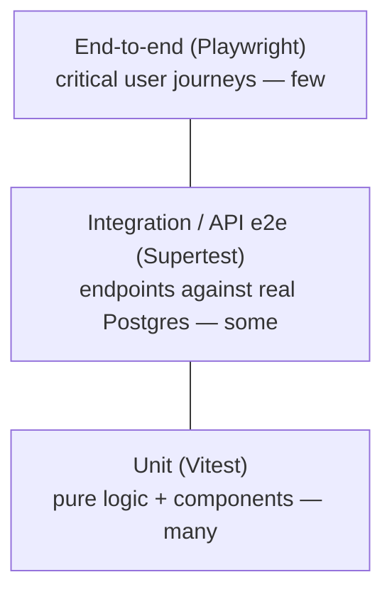

# Testing

> Tests are part of the definition of done. Every feature ships with tests;
> every bug fix ships with a regression test.

## The testing pyramid



Favour many fast unit tests, a solid layer of API integration tests, and a small
number of high-value end-to-end journeys.

## Tooling

| Layer            | Tool                                                   | Location                            |
| ---------------- | ------------------------------------------------------ | ----------------------------------- |
| Unit / component | [Vitest](https://vitest.dev) (+ Testing Library)       | `apps/*/src/**/*.{test,spec}.ts(x)` |
| API integration  | [Supertest](https://github.com/ladjs/supertest) + Nest | `apps/api/test/**/*.e2e-spec.ts`    |
| End-to-end (UI)  | [Playwright](https://playwright.dev)                   | `apps/web/e2e/**`                   |

## Principles

- **Deterministic & isolated.** No shared mutable state, no reliance on real
  time, network, or external services unless explicitly stubbed.
- **Test behaviour, not implementation.** Assert on observable outputs and DOM
  from the user's perspective (Testing Library queries by role/label).
- **Arrange–Act–Assert**, one behaviour per test, descriptive names.
- **Fast feedback.** Unit tests run in milliseconds; keep e2e focused.

## Coverage

- Target **≥ 80% line coverage on changed code**; overall coverage must not
  regress. Coverage is a signal, not a goal — don't write assertion-free tests
  to game it.
- Coverage is collected by Vitest (v8 provider) and reported in CI.

## Backend unit tests

- Test services in isolation with a **mocked Prisma** (no database): cover happy
  paths and failure modes — authorisation denied, not-found, conflict /
  optimistic-lock. See `reference.service.spec.ts` as the template.

## Backend integration / API tests

- Boot the **real Nest app** (global pipe, filter, interceptor, guards) and
  exercise endpoints via **Supertest**, asserting status codes and the standard
  `{ data, meta }` / `{ error }` envelopes. Template:
  `apps/api/test/reference.e2e-spec.ts`.
- **Auth seam:** override `AuthContextService` with a test principal (Nest's
  `overrideProvider`) — production auth stays deny-by-default.
- **Database:** run against a **real PostgreSQL** (a disposable instance locally,
  a service container in CI), with migrations applied first (`prisma migrate
deploy`). Each test sets up and tears down its own data; no cross-test
  coupling. Import `AppModule` lazily and **skip when `DATABASE_URL` is unset**
  so the suite stays green without a database and runs fully in CI.

## Frontend testing

- Component tests use Testing Library with the jsdom environment (see
  `apps/web/src/test/setup.ts`).
- Query by accessible role/name to keep tests aligned with accessibility.
- Playwright journeys cover the critical paths and include automated
  accessibility assertions.

## Engine conformance (structural gate)

The `@repo/engine-conformance` package vendors a P6-class CPM/PDM conformance fixture and an
**engine-free structural validator** (ADR-0034). Its Vitest suite runs in the standard **quality**
job via `pnpm test` — no database, no browser, no engine — and **blocks merge** if the fixture is
malformed (referential integrity, DAG, level-of-effort spans, open-end sets, progress sanity) or
stops covering a required feature. It asserts **no schedule dates**: the fixture specifies inputs and
intended behaviours, and the engine (measured by the differential harness in `apps/api`) is the thing
judged on dates. See
[`docs/specs/engine-conformance-framework/`](specs/engine-conformance-framework/) and the package
README.

The **differential harness** lives in `apps/api/src/modules/schedule/conformance/` (it imports the
real engine, so it cannot sit in the engine-free package). It has four parts, all in the standard
**quality** job:

- **First-principles goldens** (`goldens.ts`) — small hand-authored networks with exact,
  hand-computed dates for FS/SS/FF/SF, lag, weekend-skipping calendars, and constraint clamping.
  These are the oracle-free regression floor and, per ADR-0036 §3, the **safety net for the M1
  days→minutes rework**: their dates are invariant across that change, so a red diff is a reviewed
  re-baseline, never a silent drift.
- **Adapter** (`adapter.ts`) — maps the P6-class fixture onto today's day-granular engine and
  **reports every skip/approximation** (unsupported activity types, hour durations, per-activity
  calendars, progress, secondary constraints) rather than faking a value; its supported 119-activity
  subset is scheduled as a structural-regression smoke (dates there are a degradation, not a golden).
- **Differential scaffold** (`scenarios.ts`) — a living registry of the fixture's 13 scenarios; only
  the unprogressed baseline (S01) runs today, the rest are honest `todo`s citing the milestone that
  unlocks them. As a milestone lands an option, its scenario flips to a "dates must differ from S02"
  assertion in the same PR (ADR-0034 §8).
- **Negative-case contract** (`negative.spec.ts`) — hostile inputs must reject/report, never hang:
  cycle members are named, dangling references rejected, and calendar/lag walkers are bounded.
  Input-validity cases (negative duration, milestone-with-duration) are API-boundary concerns and
  marked `todo` at the engine level.

## Running tests

```bash
pnpm test           # all unit tests (Turborepo)
pnpm test:e2e       # all end-to-end tests
pnpm --filter @repo/api test         # API unit tests only
pnpm --filter @repo/api test:e2e     # API HTTP e2e (Supertest)
pnpm --filter @repo/web test:watch   # web unit tests in watch mode
```

## CI

`pnpm test` runs in the **quality** job (with the Prisma client generated), and
`pnpm test:e2e` runs in the **e2e** job — which provisions a Postgres service,
generates the Prisma client, and applies migrations (`prisma migrate deploy`)
before running — in [`.github/workflows/ci.yml`](../.github/workflows/ci.yml).
The API e2e suite runs there against real Postgres; Playwright browsers are added
when web e2e specs land (roadmap M1). All must pass before merge.

## Definition of done (testing)

- [ ] New behaviour has unit tests; endpoints have integration tests
- [ ] Bug fixes include a test that fails without the fix
- [ ] Critical journeys covered by an e2e test where appropriate
- [ ] No skipped/`.only` tests committed
- [ ] Coverage did not regress
