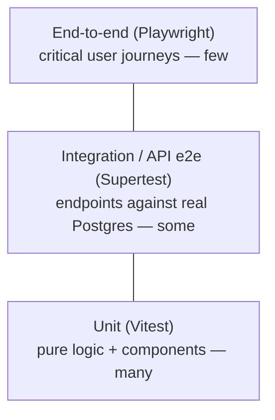

# Testing

> Tests are part of the definition of done. Every feature ships with tests;
> every bug fix ships with a regression test.

## The testing pyramid


```mermaid
graph TD
  E["End-to-end (Playwright)<br/>critical user journeys — few"]
  I["Integration / API e2e (Supertest)<br/>endpoints against real Postgres — some"]
  U["Unit (Vitest)<br/>pure logic + components — many"]
  E --- I --- U
```

Favour many fast unit tests, a solid layer of API integration tests, and a small
number of high-value end-to-end journeys.

## Tooling

| Layer            | Tool                                                   | Location                            |
| ---------------- | ------------------------------------------------------ | ----------------------------------- |
| Unit / component | [Vitest](https://vitest.dev) (+ Testing Library)       | `apps/*/src/**/*.{test,spec}.ts(x)` |
| API integration  | [Supertest](https://github.com/ladjs/supertest) + Nest | `apps/api/test/**/*.e2e-spec.ts`    |
| End-to-end (UI)  | [Playwright](https://playwright.dev)                   | `apps/web/e2e*/**` — see below      |

## Principles

- **Deterministic & isolated.** No shared mutable state, no reliance on real
  time, network, or external services unless explicitly stubbed.
- **Test behaviour, not implementation.** Assert on observable outputs and DOM
  from the user's perspective (Testing Library queries by role/label).
- **Arrange–Act–Assert**, one behaviour per test, descriptive names.
- **Fast feedback.** Unit tests run in milliseconds; keep e2e focused.
- **A test must fail without its fix.** Before committing a regression test,
  verify it goes red against the unfixed code. A test that passes either way
  documents nothing and gives false confidence — this has bitten us (a
  dirty-flag-gated render test that asserted "nothing changed", and an overflow
  test that could not overflow in jsdom).

## Coverage

- Target **≥ 80% line coverage on changed code**; overall coverage must not
  regress. Coverage is a signal, not a goal — don't write assertion-free tests
  to game it.
- **This is not currently enforced.** Vitest is configured with the v8 provider
  in both apps, so `--coverage` works on demand, but no threshold is set and CI
  does not collect it. Treat the bar as a review expectation, not a gate, until
  that changes.

## Backend unit tests

- Test services in isolation with a **mocked Prisma** (no database): cover happy
  paths and failure modes — authorisation denied, not-found, conflict /
  optimistic-lock, pen-not-held. `clients.service.spec.ts` is the plainest
  example; `notes.service.spec.ts` covers cascade and author-ownership.

## Backend integration / API tests

- Boot the **real Nest app** (global pipe, filter, interceptor, guards) and
  exercise endpoints via **Supertest**, asserting status codes and the standard
  `{ data, meta }` / `{ error }` envelopes. 28 specs live in `apps/api/test/`;
  `clients.e2e-spec.ts` is the canonical shape.
- **Every endpoint needs a cross-organisation test** asserting **404**, not 403
  (`docs/SECURITY_STANDARDS.md`). This is the one assertion that catches IDOR,
  and it is easy to omit because the happy path passes without it.
- **Auth seam:** override `AuthContextService` with a test principal (Nest's
  `overrideProvider`) — production auth stays deny-by-default.
- **Database:** run against a **real PostgreSQL** (a disposable instance locally,
  a service container in CI), with migrations applied first (`prisma migrate
deploy`). Each spec sets up and tears down its own data; no cross-test coupling.
  Import `AppModule` lazily and **skip when `DATABASE_URL` is unset**
  (`const hasDatabase = Boolean(process.env.DATABASE_URL)`) so the suite stays
  green without a database and runs fully in CI.

## Frontend testing

- Component tests use Testing Library with the jsdom environment (see
  `apps/web/src/test/setup.ts`).
- Query by accessible role/name to keep tests aligned with accessibility.
- **Flag-off parity suites are the rollback contract.** A feature behind a flag
  keeps a suite that mocks `@/config/env` with the flag off and asserts the prior
  surface. Never weaken one to make a change pass — the day it matters is the day
  you need it to be strict.
- **Structural tests pin invariants a reviewer cannot see.**
  `surface-seams.structural.test.ts` asserts the surface-scope families have no
  Tailwind utilities, so `<Surface>` stays the only route in. Reach for this
  shape when a rule's violation would look like a tidy-up in review.

## End-to-end (Playwright)

The default suite lives in `apps/web/e2e/`. **Each feature flag also has its own
directory and script**, run with that flag forced on — `pnpm test:e2e` alone does
not cover them:

```bash
pnpm --filter @repo/web test:e2e            # the default (flag-off) journeys
pnpm --filter @repo/web test:e2e:library    # e.g. the library-scoping journey
```

`ls apps/web/e2e*` is the authoritative list; `apps/web/package.json` maps each
directory to its script and forced flags, and `.github/workflows/ci.yml` runs
each as its own step. **A flag with no flag-on journey is untested in the state
users actually see** — add the suite and the CI step in the same pull request as
the flag.

Journeys include automated accessibility assertions.

### Running a Playwright suite locally

The suite's `webServer` starts the API and the dev server itself, but Postgres
must already be up and migrated:

```bash
sudo service postgresql start
pnpm --filter @repo/api exec prisma migrate deploy
pnpm --filter @repo/web test:e2e:library
```

If the sandbox's pre-installed Chromium is a different build from the one this
Playwright version expects, point every config at it rather than downloading a
second copy — they all honour the same escape hatch:

```bash
PLAYWRIGHT_CHROMIUM_PATH=/opt/pw-browsers/chromium-<build>/chrome-linux/chrome \
  pnpm --filter @repo/web test:e2e:library
```

Shared Playwright helpers live beside the suite they came from; the APG
`Combobox` driver (`apps/web/e2e/combobox.ts`) is imported across suites, because
`selectOption()` does not apply to a combobox and a label match is ambiguous
against its toggle button and listbox.

## Engine conformance

The `@repo/engine-conformance` package vendors a P6-class CPM/PDM conformance fixture and an
**engine-free structural validator** (ADR-0034). Its Vitest suite runs in the standard **quality**
job via `pnpm test` — no database, no browser, no engine — and **blocks merge** if the fixture is
malformed (referential integrity, DAG, level-of-effort spans, open-end sets, progress sanity) or
stops covering a required feature. It asserts **no schedule dates**: the fixture specifies inputs and
intended behaviours, and the engine (measured by the differential harness in `apps/api`) is the thing
judged on dates. See
[`docs/specs/engine-conformance-framework/`](specs/engine-conformance-framework/) and the package
README.

The **differential harness** lives in `apps/api/src/modules/schedule/conformance/` (it imports the
real engine, so it cannot sit in the engine-free package) and runs in the standard **quality** job.
Its parts:

- **First-principles goldens** (`goldens.ts`) — small hand-authored networks with exact,
  hand-computed dates for FS/SS/FF/SF, lag, weekend-skipping calendars, and constraint clamping.
  These are the oracle-free regression floor and, per ADR-0036 §3, were the **safety net for the M1
  days→minutes rework**: their dates are invariant across that change, so a red diff is a reviewed
  re-baseline, never a silent drift.
- **Adapter** (`adapter.ts`) — maps the P6-class fixture onto the engine's working-**minute** axis
  (ADR-0036/0037) via `buildWorkingTimeCalendar`, and **reports every remaining
  skip/approximation** rather than faking a value.
- **Differential scaffold** (`scenarios.ts`) — the fixture's 13 scenarios; **12 are runnable
  today**, each asserting that flipping its option must change the dates. The remainder is an
  honest `todo` citing the milestone that unlocks it. As a milestone lands an option, its scenario
  flips in the same PR (ADR-0034 §8).
- **Domain adapters** — `cross-plan-adapter.ts`, `earned-value-adapter.ts` and
  `resource-histogram-adapter.ts`, each with its own spec, extend the same
  approach to the read models built on the engine.
- **Negative-case contract** (`negative.spec.ts`) — hostile inputs must reject/report, never hang:
  cycle members are named, dangling references rejected, and calendar/lag walkers are bounded.

**The recalc parity gate.** `computeSchedule` is pure, so any new input must be
provably inert when absent: with the feature's input missing, output is
byte-identical. Every engine-touching change argues this, and it is the reason
new scheduling capability can land without re-baselining the goldens.

## Running tests

```bash
pnpm test           # all unit tests (Turborepo)
pnpm test:e2e       # the default end-to-end suites
pnpm --filter @repo/api test         # API unit tests only
pnpm --filter @repo/api test:e2e     # API HTTP e2e (Supertest, needs Postgres)
pnpm --filter @repo/web test:watch   # web unit tests in watch mode
```

## CI

Two jobs in [`.github/workflows/ci.yml`](../.github/workflows/ci.yml):

- **quality** — format check, lint, typecheck, `pnpm test`, then build. This is
  where the unit suites and the whole engine-conformance harness run.
- **e2e** — provisions a Postgres service, generates the Prisma client, applies
  migrations (`prisma migrate deploy`), checks for schema/migration drift, runs
  the API Supertest suite, then runs each Playwright suite as its own step
  (default, plus one per feature flag).

A third job, **image**, builds and smoke-boots the container images. All must
pass before merge.

## Definition of done (testing)

- [ ] New behaviour has unit tests; endpoints have integration tests
- [ ] Bug fixes include a test **verified to fail without the fix**
- [ ] Endpoints assert cross-organisation access returns 404
- [ ] Critical journeys covered by an e2e test; a new flag has a flag-on suite
- [ ] Engine changes argue the recalc parity gate
- [ ] No skipped/`.only` tests committed
