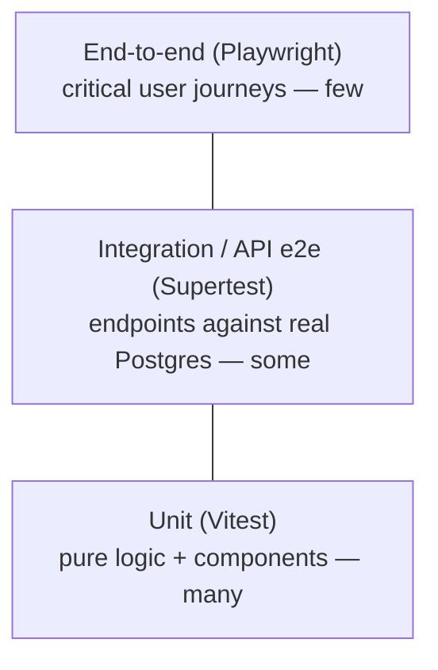

# Testing

> Tests are part of the definition of done. Every feature ships with tests;
> every bug fix ships with a regression test.

## The testing pyramid


```mermaid
graph TD
  E["End-to-end (Playwright)<br/>critical user journeys — few"]
  I["Integration / API e2e (Supertest)<br/>endpoints against real Postgres — some"]
  U["Unit (Vitest)<br/>pure logic + components — many"]
  E --- I --- U
```

Favour many fast unit tests, a solid layer of API integration tests, and a small
number of high-value end-to-end journeys.

## Tooling

| Layer            | Tool                                                   | Location                            |
| ---------------- | ------------------------------------------------------ | ----------------------------------- |
| Unit / component | [Vitest](https://vitest.dev) (+ Testing Library)       | `apps/*/src/**/*.{test,spec}.ts(x)` |
| API integration  | [Supertest](https://github.com/ladjs/supertest) + Nest | `apps/api/test/**/*.e2e-spec.ts`    |
| End-to-end (UI)  | [Playwright](https://playwright.dev)                   | `apps/web/e2e*/**` — see below      |

## Principles

- **Deterministic & isolated.** No shared mutable state, no reliance on real
  time, network, or external services unless explicitly stubbed.
- **Test behaviour, not implementation.** Assert on observable outputs and DOM
  from the user's perspective (Testing Library queries by role/label).
- **Arrange–Act–Assert**, one behaviour per test, descriptive names.
- **Fast feedback.** Unit tests run in milliseconds; keep e2e focused.
- **A test must fail without its fix.** Before committing a regression test,
  verify it goes red against the unfixed code. A test that passes either way
  documents nothing and gives false confidence — this has bitten us (a
  dirty-flag-gated render test that asserted "nothing changed", and an overflow
  test that could not overflow in jsdom).

## Coverage

Two different things, and confusing them is how the old claim went unnoticed
for so long:

**The review expectation** — target **≥ 80% line coverage on changed code**.
This is judgement, applied in review; nothing computes it. Coverage is a signal,
not a goal — don't write assertion-free tests to game it.

**The enforced floor** — `pnpm test:coverage` fails below a per-app threshold
set at the level measured on 2026-07-27:

| App         | Lines  | Statements | Branches | Functions |
| ----------- | ------ | ---------- | -------- | --------- |
| `@repo/web` | 87.36% | 85.59%     | 79.33%   | 81.38%    |
| `@repo/api` | 74.17% | 73.37%     | 70.92%   | 51.57%    |

These are **ratchets, not targets**: floors that stop coverage sliding, rounded
down from the measured figures so an unrelated refactor cannot redden CI. A
global 80% would fail the API suite today, and a gate that fails on day one gets
deleted rather than fixed. **Ratchet them up as coverage rises; never down
without saying why in the pull request.**

The API figures are unit-only — the Supertest suite exercises controllers and
guards but runs separately — so real exercised-code coverage is higher than the
table shows. The low `functions` figure is largely DTO classes and decorators.

> Until 2026-07-27 none of this worked at all: `@vitest/coverage-v8` was never
> installed, so `--coverage` failed outright even though both configs declared
> the provider and three documents plus a PR checkbox asserted an 80% bar.

## Backend unit tests

- Test services in isolation with a **mocked Prisma** (no database): cover happy
  paths and failure modes — authorisation denied, not-found, conflict /
  optimistic-lock, pen-not-held. `clients.service.spec.ts` is the plainest
  example; `notes.service.spec.ts` covers cascade and author-ownership.

## Backend integration / API tests

- Boot the **real Nest app** (global pipe, filter, interceptor, guards) and
  exercise endpoints via **Supertest**, asserting status codes and the standard
  `{ data, meta }` / `{ error }` envelopes. The specs live in `apps/api/test/`;
  `clients.e2e-spec.ts` is the canonical shape.
- **Every endpoint needs a cross-organisation test** asserting **404**, not 403
  (`docs/SECURITY_STANDARDS.md`). This is the one assertion that catches IDOR,
  and it is easy to omit because the happy path passes without it.
- **Auth seam:** override `AuthContextService` with a test principal (Nest's
  `overrideProvider`) — production auth stays deny-by-default.
- **Database:** run against a **real PostgreSQL** (a disposable instance locally,
  a service container in CI), with migrations applied first (`prisma migrate
deploy`). Each spec sets up and tears down its own data; no cross-test coupling.
  Import `AppModule` lazily and **skip when `DATABASE_URL` is unset**
  (`const hasDatabase = Boolean(process.env.DATABASE_URL)`) so the suite stays
  green without a database and runs fully in CI.

## Frontend testing

- Component tests use Testing Library with the jsdom environment (see
  `apps/web/src/test/setup.ts`).
- Query by accessible role/name to keep tests aligned with accessibility.
- **Flag-off parity suites are the rollback contract.** A feature behind a flag
  keeps a suite that mocks `@/config/env` with the flag off and asserts the prior
  surface. Never weaken one to make a change pass — the day it matters is the day
  you need it to be strict.
- **Structural tests pin invariants a reviewer cannot see.**
  `surface-seams.structural.test.ts` asserts the surface-scope families have no
  Tailwind utilities, so `<Surface>` stays the only route in. Reach for this
  shape when a rule's violation would look like a tidy-up in review.

  The audit log has three of them, and the reason each exists is worth copying:
  - `audit-coverage.structural.spec.ts` — the **route census**. Every HTTP route,
    read by reflecting the live Nest module graph, is either audited or excused
    with a **named reason**; a route in neither list fails. Its six positive
    assertions go further and force particular routes to _be_ audited, because the
    exhaustive halves cannot: a later refactor could reclassify a delete as
    "plan content" with a plausible sentence and pass everything else. Every reason
    is a decision somebody made — there is deliberately no "decide later" bucket,
    and a test asserts the one that existed has not come back.
  - `audit-vocabulary.structural.spec.ts` — the action vocabulary and its
    exhaustively-keyed maps.
  - `audit-producer-seams.structural.spec.ts` — which `AuditService` method each
    producer may call. `record()` fails its caller; `recordBestEffort()` swallows.
    Choosing wrongly is invisible until the audit table refuses an insert, which
    no test can make it do — so this reads the call sites instead, which is the
    part that is actually decidable.

## End-to-end (Playwright)

The default suite lives in `apps/web/e2e/`. **Each feature flag also has its own
directory and script**, run with that flag forced on — `pnpm test:e2e` alone does
not cover them:

```bash
pnpm --filter @repo/web test:e2e            # the default (flag-off) journeys
pnpm --filter @repo/web test:e2e:library    # e.g. the library-scoping journey
```

`ls apps/web/e2e*` is the authoritative list; `apps/web/package.json` maps each
directory to its script and forced flags, and `.github/workflows/ci.yml` runs
each as its own step. **A flag with no flag-on journey is untested in the state
users actually see** — add the suite and the CI step in the same pull request as
the flag.

`apps/web/e2e-recently-deleted/` is the counter-example to the sentence above: it drives a surface
with **no flag at all** (ADR-0096 ships unflagged), and it exists because a journey is not only a
flag's rollout gate — it is the only thing that navigates away from a screen and comes back.
Everything it proves is the server's or the router's: that a cascade really stamps one
`delete_batch_id`, that the cross-batch blocker computed in a raw `UNION ALL` exists, and that the
retention period on screen is the host's rather than a constant. It earned its place on the first
run three times over, the sharpest being a delete that never invalidated the recycle bin's own
query — the screen said "Nothing has been deleted" underneath a toast saying a client had just
been. No unit suite could reach it: each mounts one screen and seeds its cache directly.

`apps/web/e2e-authoring-flow/` is **both** — a flag-on journey for
`VITE_CANVAS_AUTHORING_FLOW`, and a diagnostic whose `link-direction.spec.ts`
half deliberately does not depend on that flag, because the defects it measures
were fixed outside it.

The diagnostic half exists because the behaviour it measures **cannot be reached
from a unit test at all**: the canvas gesture reducer maps the first click of a
two-click link to the predecessor with no inversion on any path, so only a real
browser, a real recalculation cadence and a real server can say which of those
clicks actually became a pick. When a defect report and the code disagree, that
gap is where the answer is — write the suite that measures it rather than the
test that re-states the code.

Journeys include automated accessibility assertions.

**`VITE_CANVAS_LINK_ROUTING` deliberately has no journey of its own**, and that is
the exception the rule above should have to argue with rather than a lapse. What
it changes is which pixels a line occupies inside a canvas that is `aria-hidden`
by design (ADR-0026 D7) — there is no accessible name, role or text for a journey
to assert against, and a screenshot comparison would pin antialiasing. It is
covered instead by two gates that can each fail for a specific reason:
`link-routing.test.ts` on what the geometry returns (including the no-obstacle
byte-identity, point for point) and `paint.routing-budget.test.ts` on what the
**painter** does with it — that flag-off still draws through the obstacle, that
flag-on does not, and that the extra work is bounded. The routing is exercised
end to end by every existing canvas journey, since it is now default-on.

### Measuring the canvas in a real browser

`apps/web/scripts/measure-link-routing.mjs` paints the real `paintScene` against
a real 2D context in Chromium and prints the per-frame distribution at 2,000
activities, routing off and on, at two zooms. It is **not** a test and does not
run in CI: absolute timings on a shared runner are noise, which is the reasoning
the counting-stub budget gates already record.

```bash
pnpm --filter @repo/web exec node scripts/measure-link-routing.mjs 200
```

Run it on a machine whose numbers mean something, and quote the machine with the
result. Its first run is why `docs/TECH_DEBT.md` #75 exists: ADR-0026 §9's ≤ 4 ms
p95 budget had been quoted for months without anyone measuring it, and the
already-shipped painter turned out to be four to six times over it.

### Running a Playwright suite locally

The suite's `webServer` starts the API and the dev server itself, but Postgres
must already be up and migrated:

```bash
sudo service postgresql start
pnpm --filter @repo/api exec prisma migrate deploy
pnpm --filter @repo/web test:e2e:library
```

If the sandbox's pre-installed Chromium is a different build from the one this
Playwright version expects, point every config at it rather than downloading a
second copy — they all honour the same escape hatch:

```bash
PLAYWRIGHT_CHROMIUM_PATH=/opt/pw-browsers/chromium-<build>/chrome-linux/chrome \
  pnpm --filter @repo/web test:e2e:library
```

Shared Playwright helpers live beside the suite they came from; the APG
`Combobox` driver (`apps/web/e2e/combobox.ts`) is imported across suites, because
`selectOption()` does not apply to a combobox and a label match is ambiguous
against its toggle button and listbox.

## Engine conformance

The `@repo/engine-conformance` package vendors a P6-class CPM/PDM conformance fixture and an
**engine-free structural validator** (ADR-0034). Its Vitest suite runs in the standard **quality**
job via `pnpm test` — no database, no browser, no engine — and **blocks merge** if the fixture is
malformed (referential integrity, DAG, level-of-effort spans, open-end sets, progress sanity) or
stops covering a required feature. It asserts **no schedule dates**: the fixture specifies inputs and
intended behaviours, and the engine (measured by the differential harness in `apps/api`) is the thing
judged on dates. See
[`docs/specs/engine-conformance-framework/`](specs/engine-conformance-framework/) and the package
README.

The **differential harness** lives in `apps/api/src/modules/schedule/conformance/` (it imports the
real engine, so it cannot sit in the engine-free package) and runs in the standard **quality** job.
Its parts:

- **First-principles goldens** (`goldens.ts`) — small hand-authored networks with exact,
  hand-computed dates for FS/SS/FF/SF, lag, weekend-skipping calendars, and constraint clamping.
  These are the oracle-free regression floor and, per ADR-0036 §3, were the **safety net for the M1
  days→minutes rework**: their dates are invariant across that change, so a red diff is a reviewed
  re-baseline, never a silent drift.
- **Adapter** (`adapter.ts`) — maps the P6-class fixture onto the engine's working-**minute** axis
  (ADR-0036/0037) via `buildWorkingTimeCalendar`, and **reports every remaining
  skip/approximation** rather than faking a value.
- **Differential scaffold** (`scenarios.ts`) — the fixture's 13 scenarios; **12 are runnable
  today**, each asserting that flipping its option must change the dates. The remainder is an
  honest `todo` citing the milestone that unlocks it. As a milestone lands an option, its scenario
  flips in the same PR (ADR-0034 §8).
- **Domain adapters** — `cross-plan-adapter.ts`, `earned-value-adapter.ts` and
  `resource-histogram-adapter.ts`, each with its own spec, extend the same
  approach to the read models built on the engine.
- **Negative-case contract** (`negative.spec.ts`) — hostile inputs must reject/report, never hang:
  cycle members are named, dangling references rejected, and calendar/lag walkers are bounded.

**The recalc parity gate.** `computeSchedule` is pure, so any new input must be
provably inert when absent: with the feature's input missing, output is
byte-identical. Every engine-touching change argues this, and it is the reason
new scheduling capability can land without re-baselining the goldens.

## Running tests

```bash
pnpm test           # all unit tests (Turborepo)
pnpm test:e2e       # the default end-to-end suites
pnpm --filter @repo/api test         # API unit tests only
pnpm --filter @repo/api test:e2e     # API HTTP e2e (Supertest, needs Postgres)
pnpm --filter @repo/web test:watch   # web unit tests in watch mode
```

## Before you push

**Run the gate that matches what you changed, in this order.** Each step is
cheaper than the one after it and than the CI round-trip it replaces, so a
failure should surface at the earliest step that can see it.

**Run it as one command: `pnpm prepush`** (or `scripts/prepush.sh --checks` for the gates alone).
This table is the reference for _what_ each step is and _when_ it applies; the script is how you run
them, and it exists because assembling this list by hand at the call site is what actually fails.
Three times in one session a correct gate reported a real failure that nobody read: a pipeline whose
exit status came from `tail`, an `&&` satisfied by an `echo`, and the loop run from `apps/web` where
these scripts do not exist — ten identical "command not found" lines that look exactly like ten real
failures. The script fixes its own working directory, derives the `check:*` roster from
`package.json` rather than restating it, runs every step rather than stopping at the first, and
exits non-zero if any failed.

It deliberately excludes the e2e half, which needs a database and a browser and belongs to
`scripts/e2e-local.sh` — the rows below still say when that is required.

**What it costs, measured 2026-08-25** (one file changed in `apps/web`, turbo warm elsewhere):
roughly **six minutes**, of which `pnpm test` is **345 s (94%)** — the whole 552-file web unit
suite, every run — `typecheck` 6.5 s, `lint` 8 s, and every `check:*` gate **together in seconds,
not minutes** (re-measured 2026-09-03: 12.3 s for the whole `--checks` pass. A precise figure is
deliberately not restated here — it has now been wrong twice, at 10.4 s and 11.5 s, because the gate
set grows; run `bash scripts/prepush.sh --checks` if the number matters, after
fixture suite landed — the three additions cost about a second between them). Two things follow, and the second is the one people get wrong. The `check:*` scripts are
**2%** of the gate and are the part that catches what a reviewer cannot see, so trimming _them_ to
make the gate faster buys nothing and costs the drift control; and the gate is not saving wall
clock against CI, whose equivalent job is **11 m 22 s** — it is saving a **round trip**, which is a
different and better thing. `docs/TECH_DEBT.md` **#191** carries the full breakdown and the one
remaining lever.

### One thing the gate structurally cannot check (ADR-0111)

**A change to a shared primitive's keyboard or focus contract gets a specialist review before it is
released.** `accessibility-reviewer`, plus `component-reviewer` when the change touches a rule more
than one primitive implements.

The primitives are the things in `components/ui/` owning a roving `tabindex`, a focus trap, an
arrow-key model or focus restoration — `Deck`, `Toolbar`, `Menu`, `Combobox`, `Tabs`, `Dialog`, the
`*Field` family. The contract is which keys they claim, which they pass on, and where focus goes
when something opens, closes, unmounts or shades.

**Why a review and not a test:** every defect in this class is a statement about what a real browser
does with a real focus ring — that a single-line input ignores the vertical arrows and a date input
does not, that a modal's top layer swallows a portalled menu, that `preventDefault` without
`stopPropagation` still reaches an ancestor through the React tree. jsdom has no layout, no top
layer and no focus ring, so the unit tier cannot ask; a journey can, but only about paths somebody
thought to drive, and nobody writes one for "press ArrowUp in the date field" before suspecting it.
Twice in two days such a change passed every gate here and was wrong (`docs/TECH_DEBT.md` #189, then
#192 **inside the fix for #189**, released). Both were found in minutes by a reviewer that executed
the component. Treat this as the weak instrument it is — it is cheap, and nothing else covers it.

**And the e2e half is where a reused server quietly invalidates the result.** `scripts/e2e-local.sh`
refuses to run while anything answers on 3000 or 5173, because `reuseExistingServer` is true outside
CI: Playwright adopts whatever is already there instead of starting one with the suite's own
environment, so the config's flag pins never apply and the run means nothing whichever way it goes.
That refusal fired twice in one session — a `pnpm --filter @repo/api start` left over from a
screenshot run held the port, and `pkill` did not reach it because the task supervisor restarted it.
Stop the background task, not just the process. The tell is the clock: the export journey takes ~20s
against its own API with the pen enforced and ~6s against a reused one without it.

**The first version of this note was written INTO the table**, after the header row, so Prettier
reflowed it into cells and the ten steps below it lost their header and rendered as literal
pipe-separated text. `check:doc-links` only checks links, so nothing caught it; a review reading the
file did. Worth keeping as the reason the note sits above the table rather than inside it.

| #   | Run                                                         | When                                                                                              |
| --- | ----------------------------------------------------------- | ------------------------------------------------------------------------------------------------- |
| 1   | `pnpm lint && pnpm typecheck`                               | always                                                                                            |
| 2   | `pnpm test`                                                 | always                                                                                            |
| 3   | `scripts/e2e-local.sh api`                                  | you touched `apps/api` — service, controller, DTO, schema or migration                            |
| 4   | `scripts/e2e-local.sh web:<suite>`                          | you **added or changed** a flag-on Playwright suite, or changed a surface one drives              |
| 4a  | `scripts/e2e-local.sh web`                                  | you changed a **screen** — its markup, its copy, or an accessible name                            |
| 4b  | the **base** suite + every suite that does not pin the flag | you **flipped a flag default** ([below](#flipping-a-default-changes-the-base-suite))              |
| 4c  | `scripts/e2e-sweep.sh`                                      | you replaced a **screen every journey signs in through**, or moved a control every journey clicks |
| 5   | `pnpm check:playbook`                                       | you added, renamed or removed a seed-catalogue plan (ADR-0066)                                    |
| 6   | `pnpm check:build-contract`                                 | you added a shared `packages/*` workspace package, or changed a Dockerfile                        |
| 7   | `pnpm check:counts`                                         | you added an ADR, module, model, migration, Playwright suite or web source file                   |
| 8   | `pnpm check:claims`                                         | you cited a dependency's source by file and line, or bumped `better-auth`/`better-call`           |
| 9   | `pnpm check:nginx`                                          | you touched `apps/web/nginx.conf` or a `CSP_*` default in a compose file                          |
| 10  | `git fetch origin main && pnpm check:frontend-only`         | always, and it is the one gate whose answer depends on **where the branch is**                    |
| 11  | `pnpm check:debt-status`                                    | you added, closed or edited a `docs/TECH_DEBT.md` row (ADR-0120)                                  |
| 12  | `pnpm check:doc-register`                                   | you changed `scripts/lib/doc-register.mjs` or either drift gate                                   |
| 13  | `pnpm check:reconcile-due`                                  | **advisory** — never blocks; see below                                                            |

**Step 13 is the only advisory gate, and `prepush.sh` prints it differently.** `check:reconcile-due`
exits **2**, not 1: the rule is that **exit 1 is for an obligation whose remedy is an edit to the
file that failed, and exit 2 for one whose remedy is somebody's judgement** (ADR-0120 D2). A missed
reconciliation pass is the second kind, and blocking a push on a documentation chore is how a gate
gets bypassed with `--no-verify` — after which it is bypassed always. So the run prints a yellow
`WARN` line with the finding, names the warned gates in the summary, and **still exits 0**.

That third state was a prerequisite rather than a preference: `run()` sends a passing gate's output
to a log and prints nothing, so before it an advisory gate was **completely silent**. Note the one
sharp edge — **`pnpm` itself treats exit 2 as a failed script**, so `pnpm check:reconcile-due` run on
its own reports failure. The convention lives inside `scripts/prepush.sh`, which is why the gate is
in no CI step; adding it to `ci.yml` by copying a neighbour would turn a product-owner decision into
a blocking gate by the back door.

**Exit 2 alone is not enough to be advisory, since 2026-09-02** (ADR-0124 D4). `tsc` uses exit 2 for
"I reported type errors", so a broken typecheck printed a yellow `WARN` and let the push through
from the day the three states landed until it was measured. The default is now **inverted**: a
non-zero exit blocks unless the gate is named in `prepush.sh`'s `ADVISORY_GATES` array, which today
has exactly one member. `pnpm check:advisory-agreement` asserts that list against the code in both
directions — a gate listed but incapable of warning would have its **real** failures downgraded, and
a gate capable but unlisted would have its advisory finding reported as blocking — and it reads the
array out of `prepush.sh` rather than restating it.

So making a gate advisory is now **two edits**: `report({ advisory: true })` in the gate, and its
name in `ADVISORY_GATES`. Doing one without the other fails `check:advisory-agreement`, by design.

**Step 4a is not covered by step 4**, and the difference cost a CI round on 2026-08-18. Every `web:`
target maps to `test:e2e:<suite>`; the base journey is `test:e2e` with no suffix, so until that day
`scripts/e2e-local.sh` had no way to run the suite covering the **shipped default configuration** —
and `e2e/recently-deleted.spec.ts` reached CI still asserting a screen ADR-0096 had replaced. A
sweep for the changed _label_ found nothing; the changed _screen_ had a journey of its own that
nobody could run. Change a screen, run the base journey.

**Step 4c — when the change is under every journey, sweep every journey.** `scripts/e2e-sweep.sh`
runs every flag-on suite in series, each against its own freshly-started servers.

**Read its last line, not its forty.** Since 2026-09-02 (ADR-0124 D5) the sweep ends with a verdict
— `SWEEP: N/M suites passed`, or the **names** of the failures and the log to read for each — and
exits non-zero when any suite fails. Before that it aggregated nothing and always exited 0, so one
`EXIT=1` among forty scrolled past: that is how the base journey went unrun for weeks while the
sweep reported it on every line. Failures are named rather than counted, because "1 failure" is a
number somebody scrolls past. It also refuses to report success when it ran **no** suites at all,
since every assertion in it is over a list and an empty list satisfies "nothing failed" perfectly.

**Its list is derived from `apps/web/package.json`, and this paragraph deliberately does not say how
many there are.** It used to be typed into the script, and on 2026-08-26 that list was found wrong in
both directions at once: it named `toolbar-fit`, which has had no script and no directory since
ADR-0109 D1 deleted that journey — `e2e-local.sh` maps `web:<name>` to `test:e2e:<name>`, so the
entry resolved to nothing and the sweep carried on past it — and it omitted **seven** suites that do
exist, `workspace-fit` among them, which is the one measuring WCAG 2.5.8 target size and therefore
the one a layout change is most likely to break. A sweep whose whole argument is that a search is
scoped by whichever directories you remember was itself scoped by whichever suites somebody
remembered. The default is now every `test:e2e:*` script the package declares, so a suite added
tomorrow is swept tomorrow. A count in prose is the same defect one file along (ADR-0076 Class 1).
Restarting between suites is load-bearing rather than tidy: the `VITE_` flags bake at `webServer`
start and `reuseExistingServer` is true outside CI, so a suite that inherits the previous one's
servers silently runs against the previous one's configuration.

**And a server _you_ left running does the same thing, which is why `e2e-local.sh` now refuses to
start while one is up.** The trap is worse than the sweep's, because the leftover server is usually
invisible: `nest start --watch` puts the environment on the CHILD process, so the watcher's
`/proc/<pid>/environ` is empty and even checking looks like it cleared it. On 2026-08-19 an API
server left over from a flag-on harness (`PLAN_EDIT_LOCK_ENFORCED=true`) made the base journey fail
seven specs, and the failure was blamed in turn on a palette change, on a grid refactor and finally
on the product — three false diagnoses, each argued from evidence, none of them the cause. Later the
same session a leftover **web** server produced the identical seven failures from the other side,
with no flag pin reaching the bundle. The script now probes 3000 and 5173 and exits rather than
running; `E2E_ALLOW_EXISTING_SERVER=1` overrides it, and is only ever right if you started that
server with the suite's exact environment.

**It is not a per-change step** — thirty-three suites is about forty minutes. Its trigger is a change
every journey passes through, and its first two runs say why:

- ADR-0098 replaced the landing every journey signs in through. A `grep` for the deleted heading
  across `src/` and `e2e/` found and fixed two specs; the sweep found a **third**, in `e2e-edit/`,
  which the grep had missed because it was scoped to the directories I happened to think of. **A
  search is scoped by what you remember; a sweep is scoped by nothing.**
- ADR-0097 collapsed the product to a single theme, and `e2e-public` was still sweeping three —
  twelve failures, every `dark` and `corporate` case, every `light` case green. That one is the
  sharper lesson: three passes over one theme would have read as three worlds covered while covering
  one, and the only thing that stopped it was `expectTheme`, written for exactly that reason. **A
  sweep finds the suites that are wrong about a change they were never about**, and neither of these
  two is named for what changed.
- ADR-0109 made `Recalculate` conditional — it appears only when the schedule is behind the plan —
  and the sweep found **six `e2e-gantt-editing` specs using an unconditional press as a
  cache-invalidation lever.** They seeded activities through the REST API, which leaves the open page
  knowing nothing about them, and then pressed a button whose mutation happened to invalidate the
  plan's queries. Nobody had written that reliance down and no suite named it; a control that stops
  being offered removes it silently, and the symptom is a Gantt with no rows rather than an error.
  **The rule this leaves behind: a helper that writes through the API tells the client itself** —
  with a reload, at the point of the out-of-band write — rather than relying on a later UI action to
  do it as a side effect. The same run found a real accessibility defect in the new control (its
  linked reason was polluting its accessible NAME, so three suites' `Start editing` locators
  resolved to two elements) that the unit suite structurally could not, because it matched the name
  with a regex.

It has now happened twice, and the second time the rule worked: ADR-0098 replaced the organisation
landing, and `e2e/auth.spec.ts` and `e2e/members.spec.ts` were both still asserting
`'Welcome to SchedulePoint'` — a heading that no longer exists anywhere. Both failed **locally**,
which is the whole point of step 4a. Note what a sweep would have missed again: neither spec is
named for the screen it lands on, so nothing about "the landing page" would have found them; they
were asserting a fixed string as a proxy for "we arrived". The replacements assert the
**organisation's own name**, which is a stronger claim — it proves the page resolved _this_
organisation rather than merely rendering something.

**Step 10 is the only gate that reads your branch's position.** `check:frontend-only` diffs
`origin/main...HEAD`, so it needs a fetched base and answers differently depending on what has
landed since. It is also the gate most likely to be **stale rather than wrong**: it reads an opt-in
declaration (`scripts/frontend-only.json`) that a finished epic is supposed to remove, and on
2026-08-18 it refused an unrelated branch on behalf of an epic that had shipped three weeks earlier.
The other checks are cheap and worth running before pushing whether or not the table says you must.

Step 9 exists because the web container's config is the one artefact no other
gate reads. It substitutes `apps/web/nginx.conf` exactly as the container does
(`NGINX_ENVSUBST_FILTER=^CSP_`, defaults parsed out of `docker-compose.yml`
rather than restated) and checks the property that has actually broken: a quoted
directive value containing its own delimiter, which is not a bad header but a
**boot failure** — nginx refuses the config and the container never serves a
request. `apps/web/e2e-csp` cannot catch it, because it reads the policy from
the compose file and serves it from a preview server: it tests the policy, never
nginx's parse of the file. Before this, CI's smoke-boot was the only thing that
would notice, a container build away and minutes after the push.

Steps 7 and 8 are ADR-0076's gates and both run in milliseconds off the
filesystem, so "always" is a fine answer for when to run them — the `When`
column says what makes them likely to **fail**, not what makes them worth
running. Step 8's failure on a dependency bump is deliberate: the bump is the
moment 34 file-and-line citations need re-reading, and it is the only moment
anybody would.

`scripts/e2e-local.sh` brings up Postgres, creates the `app` role and `app_test`
database **with the same credentials — and the same privileges — CI uses**,
applies migrations, finds the sandbox Chromium, and runs the targets you name.
It is idempotent, so re-running costs a few seconds. `--db-only` stops after the
database if you want to drive the suites yourself.

> **The role is a SUPERUSER because CI's is.** The `postgres:17-alpine` service
> container makes `POSTGRES_USER` a superuser; this script used to create a plain
> `CREATEDB` role, and the difference is invisible until a test depends on a
> privilege check — at which point it passes locally and fails in CI for a reason
> nothing in the output names. That happened: an ADR-0087 suite induced a failure
> with `REVOKE DELETE`, which a superuser bypasses entirely, so the sweep it
> expected to fail quietly succeeded. If you need a test to make the database
> refuse something, **use a trigger, not a privilege** — a trigger fires for
> superusers too. `retention-sweep.e2e-spec.ts` shows the shape.

```bash
scripts/e2e-local.sh                 # database + API e2e (the default gate)
scripts/e2e-local.sh web:wbs         # one flag-on suite, from cold, ~30s
scripts/e2e-local.sh api web:gantt   # both
```

**Step 4 is not optional for a new suite.** A flag-on journey is written against
a real browser and a real API, so nothing in steps 1–3 can tell you a locator is
wrong, a control's accessible name is different from what you assumed, or a
panel you are querying is collapsed. This is not hypothetical: the ADR-0063
enablement journey went through **five** CI rounds on defects in the journey
itself — a page-size cap that made the probe read an error envelope, a table that
lives in a collapsible panel under the flags that suite sets, a button labelled
`Diagram` that the spec called `TSLD`, and an ambiguous `role="status"` query.
Every one was visible in the first local run and none was visible without one.
Two of them were also masked by assertion order — see the rule below.

### Running several suites back to back: kill the API between them

**`pkill -f "nest start"` does not kill the API.** Nest spawns a child
`node apps/api/dist/main`, which survives, keeps port 3000, and — because
`reuseExistingServer` is `!process.env.CI`, i.e. **true** locally — is then
silently **reused** by the next suite. Two things follow, and the second is the
one that wastes an afternoon:

1. The next suite runs against the previous suite's **API environment**, not the
   one its own config declares.
2. `@nestjs/throttler`'s counter is per-process and in-memory, so the previous
   suite's requests count against the next one's budget (100 / 60 s). The next
   suite's **seeding** then fails with `429 RATE_LIMITED` — which reads as four
   unrelated journeys breaking, in a run where you have just changed something.

That is not hypothetical either: a full 32-suite sweep on 2026-08-13 reported
`gantt`, `wbs`, `search-nav` and `float-paths` failing, all of them
`seeding rejected … 429`, none of them real. It was diagnosed properly — the same
suite was run against `origin/main` and failed identically, which is what
separated "my change broke this" from "this harness is lying" — and the whole set
passed once the API was actually being torn down between suites.

So when sweeping suites yourself: kill `api/dist/main` **by that name**, wait for
**both** ports to stop answering before starting the next config, and if you are
running many in sequence raise `RATE_LIMIT_LIMIT` **for the local run only**. CI
is unaffected — it starts a fresh API per suite — and the product default
(100 / 60 s, `RATE_LIMIT_TTL` / `RATE_LIMIT_LIMIT`) must not be changed to make a
local sweep pass.

### Flipping a default changes the base suite

A flag flip is not covered by step 4, and the wording used to read as if it were.
The new journey you wrote pins the flag **on**, so it passes; what moves under you
is every suite that does **not** pin it — starting with the **base** suite, which
serves the app on the shipped defaults. Flipping a default is a change to the
surface that suite drives, even though you touched none of its files.

ADR-0070's flip proved it. `VITE_SUB_DAY_DURATIONS` default-on renames the
activity form's control from `Duration (working days)` to `Duration` — deliberate,
because the field no longer promises whole days — and three journeys were still
asking for the old label: the base `e2e/activities.spec.ts` and the
`e2e-activity-editor` / `e2e-programme` fixtures. The full local gate, both flag-on
journeys included, was green; CI went red on the base suite.

So: after a flip, run the base suite, and `grep` the other `e2e*/` directories for
any locator naming the copy the flip changes. Where the locator is **fixture setup**
rather than the assertion, accept both spellings with an anchored regex
(`/^Duration( \(working days\))?$/`) so the fixture survives the next flip; where
the label **is** what the test is about, pin the shipped default and let it fail
loudly if that default moves.

**Assert presence before absence.** `toHaveCount(0)` is satisfied by a surface
that never rendered, so an absence assertion placed first will pass for the
wrong reason and push the failure somewhere unrelated. Prove the surface is
there, then prove the thing you expect to be missing is missing.

## CI

Two jobs in [`.github/workflows/ci.yml`](../.github/workflows/ci.yml):

- **quality** — format check, lint, typecheck, **doc-link check**, **playbook
  check**, `pnpm test`, then build. This is where the unit suites and the whole
  engine-conformance harness run. `pnpm check:doc-links` walks every Markdown
  file and fails on a relative link that does not resolve; it deliberately
  ignores external URLs, so the gate never goes red for a reason outside the
  repository. `pnpm check:playbook` compares
  [`TEST_PLAYBOOK.md`](TEST_PLAYBOOK.md) against the plans the seed catalogue's
  builders actually produce, **in both directions** — a row naming a plan that
  no longer exists sends a reader to seed nothing, and a plan with no row gets
  seeded and demonstrates nothing (ADR-0066 M5.3). `pnpm check:build-contract`
  asserts the ADR-0019 obligation that every `@repo/*` an app depends on at
  runtime is COPYd and built in that app's Dockerfile **and** in the e2e job's
  direct "Build shared packages" step. That one exists because a local checkout
  cannot see the failure: the package already has a `dist/` from an earlier
  build, so the omission only appears on a clean machine — `@repo/layout`
  (ADR-0069) shipped that way and turned up as `Cannot find module` inside
  `nest build`, minutes into CI, for a module that plainly exists.
  `pnpm check:counts` re-derives `CLAUDE.md`'s six stage-banner figures from the
  tree; it exists because every one of them was wrong at a reconciliation pass,
  the correction told readers to re-run `ls | wc -l`, and five of six were wrong
  again a day later (ADR-0076). `pnpm check:claims` pins the 34 file-and-line
  citations this repository makes into `better-auth` and `better-call` — the
  version each was verified against, an anchor from the code at each cited line,
  and that no citation exists outside `scripts/dependency-claims.json`. Those
  citations are load-bearing (ADR-0074 and ADR-0075 both turn on them) and a
  minor bump moves every one while the prose keeps reading as authoritative.
  `pnpm check:debt-status` asserts that every `docs/TECH_DEBT.md` row carries a
  status a parser can find, that no row is annotated CLOSED in its heading while
  still present in the file, and that the compact table cannot silently regrow —
  because that file decides what gets picked up next, and **14 of its 138 rows**
  carried a machine-readable status, so a candidate recommended from it had been
  fixed three weeks earlier (ADR-0120). `pnpm check:doc-register` runs the
  fixtures for the parser both drift gates read with; two of its own cases had
  shipped **vacuous**, because Prettier normalised the malformation each fixture
  was named for, so each fixture now asserts its own contents before any case
  runs. `check:reconcile-due` is **deliberately not here**: it is advisory, and
  listing it would make it blocking by the back door.
  **None of these checks needs a database.**
- **e2e** — provisions a Postgres service, generates the Prisma client, applies
  migrations (`prisma migrate deploy`), checks for schema/migration drift, runs
  the API Supertest suite, then runs each Playwright suite as its own step
  (default, plus one per feature flag).

A third job, **image**, builds and smoke-boots the container images. All must
pass before merge.

## Definition of done (testing)

- [ ] New behaviour has unit tests; endpoints have integration tests
- [ ] Bug fixes include a test **verified to fail without the fix**
- [ ] Endpoints assert cross-organisation access returns 404
- [ ] Critical journeys covered by an e2e test; a new flag has a flag-on suite
- [ ] Engine changes argue the recalc parity gate
- [ ] No skipped/`.only` tests committed
