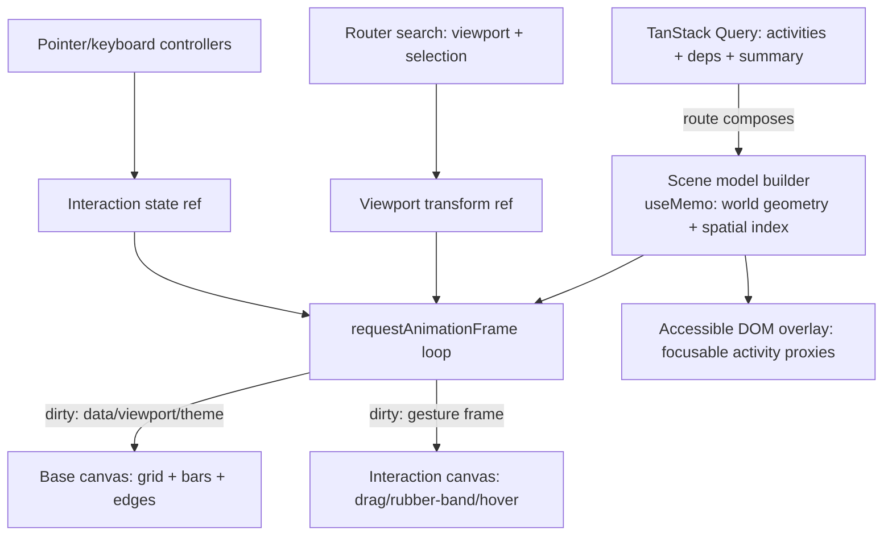
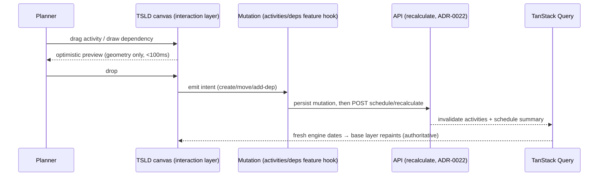

# ADR-0026: TSLD canvas — Canvas 2D rendering, coordinate/viewport model, interaction & accessibility architecture

- **Status:** Proposed
- **Date:** 2026-07-10
- **Deciders:** James Ewbank (with Claude Code — ui-architect)

## Context

The **Time-Scaled Logic Diagram (TSLD)** is SchedulePoint's flagship editing
surface and the reason the product exists: planners build a schedule by drawing
activities on a timeline and pulling logic between them, rather than filling a
Gantt grid (PROJECT_BRIEF §1, §8, §11). It is also the **most
performance-critical and most accessibility-hostile** UI in the app, and its
technology choice was **deliberately deferred to the design phase** (PROJECT_BRIEF
§15, §20; CLAUDE.md §15). This ADR makes that choice and fixes the surrounding
architecture. The companion Feature Spec and Implementation Plan
(`docs/specs/tsld-canvas.md`, `docs/plans/tsld-canvas.md`) defer the
rendering-technology decision and the render/interaction/a11y architecture to
this record.

The hard forces:

- **Interactive performance (NFR, PROJECT_BRIEF §12, §14).** Sustain **≥ 45 fps**
  during pan/zoom/drag on a **500-activity** plan; degrade gracefully to **30 fps
  at 2,000 activities**. Activity create/move/dependency-add → visual feedback
  **< 100 ms**. Plan open → interactive **< 1.5 s** at 500 activities. Data-scale
  ceiling: **2,000 activities × 4 dependencies** per plan. "TSLD rendering perf
  collapses at 2,000 activities" is a named **top technical risk** (§17), whose
  stated mitigation is to _prototype at target scale in the design phase and be
  prepared to move to WebGL under an ADR_.
- **DOM-first house posture.** The base frontend is React + DOM + Tailwind tokens
  - shadcn/ui (ADR-0004/0005/0006). Thousands of interactive nodes cannot live in
    the DOM. Any pixel-buffer renderer is a deliberate deviation from that posture —
    hence this ADR.
- **Correctness is server-owned.** The CPM engine is server-side, synchronous,
  and the single source of truth for dates and criticality (ADR-0022/0023/0024).
  x on the canvas is **derived from computed dates, not stored**; only y
  (`Activity.laneIndex`) is persisted. Re-deriving CPM in the browser would fork
  the engine and is a direct hit to the top _correctness_ risk (§17).
- **Accessibility is a merge gate.** WCAG 2.2 AA (CLAUDE.md §13). A raw canvas is
  invisible to assistive technology, yet planners are **keyboard-first power
  users** (§8 Should-have, §4).

The surrounding building blocks already exist and must be reused, not forked:
`ActivitySummary` (carries `laneIndex` + engine-owned CPM columns), the
activities/dependencies/schedule/baselines features, the synchronous
`POST …/schedule/recalculate` + `…/schedule/summary` seam (`useRecalculate`,
`useScheduleSummary`), the working-day calendar (server-only, ADR-0024), the
shared `useAnnounce()` live region, and semantic design tokens (ADR-0006).

## Decision

### 1. Render the TSLD with **Canvas 2D**, layered, retained-scene / immediate-draw — with a documented **WebGL escalation gate**

We will render the diagram to **HTML5 Canvas 2D**, not SVG/DOM and not (initially)
WebGL. Canvas 2D is the presumptive house choice (PROJECT_BRIEF §15), clears the
NFR envelope for the expected scale when paired with culling + layering, keeps the
smallest possible deviation from the DOM-first posture, and carries **zero new
runtime dependency**. WebGL (PixiJS/regl) is the **escalation path**, taken **only
if** the prototype-at-scale spike (Decision 9) proves Canvas 2D cannot hold the
frame budget — and taken **under an amending ADR**, because it is a larger
deviation and a new dependency.

The renderer is structured as a **retained scene model in JS driving immediate-mode
draw calls**. Canvas 2D is itself immediate-mode (it forgets everything after each
call); we keep a retained, culled **draw list** (the scene) in a `ref` and repaint
dirty frames from it. This gives us the ergonomics of a scene graph (diffing,
hit-testing, incremental invalidation) without a retained-mode library, and keeps
the WebGL escalation a swap of the _painter_, not a rewrite of the feature.

**Layering (static vs dynamic).** Two stacked `<canvas>` elements share one world
transform:

- **Base layer** — the timeline grid/ruler, all non-dragging activity bars, and
  all dependency edges. Repainted **only** when the viewport changes, data
  changes, or the theme flips — never per interaction frame.
- **Interaction layer** — the item(s) under an active gesture: the dragged bar, the
  rubber-band dependency being drawn, hover/selection highlight, the critical-path
  emphasis pulse. Repainted per animation frame during a gesture; cleared to
  nothing when idle.

A dragged bar is promoted to the interaction layer for the duration of the drag so
the (expensive) base layer is not re-rasterised on every pointer move. A third,
**DOM overlay** (not canvas) carries the accessibility tree, focus rings for AT,
and any HTML chrome (toolbar, zoom slider, minimap) — see Decisions 7–8.

**Hi-DPI / device-pixel-ratio.** Each canvas backing store is sized to
`cssSize × devicePixelRatio`; the context is `scale(dpr, dpr)`-normalised so all
drawing is authored in CSS pixels. Crisp 1-px grid lines snap to device pixels
(`Math.round(x) + 0.5`). We re-provision the backing store on resize **and** on DPR
change (moving a window between monitors), throttled through the rAF loop.

**Theme-awareness without forking tokens (ADR-0006).** The painter never hardcodes
colour. On mount and on every theme change it reads the **resolved** semantic-token
values (`getComputedStyle` on a hidden probe element that carries the token
utilities) into a plain palette object, and repaints. Tokens stay the single source
of truth for light/dark; the canvas is just another consumer. `prefers-reduced-
motion` disables the critical-path pulse and any transition animation.

**Text is the dominant cost, and is budgeted.** Filling text is the most expensive
Canvas 2D operation and the first thing to collapse at 2,000 nodes. Mitigations,
baked into the painter: draw labels only above a per-zoom-level legibility
threshold (at year zoom, bars are too narrow for text — draw none); clip each label
to its bar; cache measured text metrics; avoid per-frame font string churn. Label
density is one of the levers the spike tunes.

### 2. Coordinate & viewport model

- **World space.** `x = time`, `y = lane`. x is **derived**, not stored: the world
  x of a date `d` is `worldX(d) = daysFromDataDate(d) × PX_PER_DAY_AT_ZOOM`, where
  the origin is the **data date** `DD = Plan.plannedStart` (ADR-0023 §1). y is
  **persisted**: `worldY(a) = a.laneIndex × LANE_HEIGHT`. This is the essence of a
  _time-scaled_ diagram — horizontal position is a projection of the CPM result;
  vertical position is layout the planner owns.
- **Dates in, pixels out.** The canvas consumes the engine's inclusive display
  dates (`earlyStart`/`earlyFinish`, ADR-0023 §4) verbatim and only _positions_
  them. It performs **no** schedule arithmetic and **no** working-day maths (it has
  no calendar — ADR-0024 keeps calendars server-side). A bar spans
  `[worldX(earlyStart), worldX(earlyFinish) + oneDay)`; a milestone is a diamond at
  a single day.
- **Viewport transform.** `{ panX, panY, pxPerDay }`. `screen = (world − pan) `
  (with `pxPerDay` folded into `worldX`); `world = screen + pan`. One matrix, one
  inverse, used by both the painter and hit-testing so they can never disagree.
- **Zoom levels.** Discrete **day / week / month / quarter / year** stops plus a
  continuous slider between them; each stop fixes `pxPerDay` and the ruler's
  tick/label granularity. Zoom is **anchored at the cursor** (the world point under
  the pointer stays put). Non-working days are **not** shaded in v1 (deferred with
  ADR-0024's timeline-shading debt).

### 3. State ownership (consistent with ADR-0004)

Four homes, no exceptions:

- **Server state → TanStack Query.** Activities, dependencies, computed dates, and
  the schedule summary are read through the existing feature hooks
  (`useActivities`, `useDependencies`, `useScheduleSummary`) and their query keys.
  The canvas never fetches and never caches server data itself.
- **Shareable view state → URL search params (the router, ADR-0005).** The
  **committed** viewport (`pxPerDay`/zoom stop, pan, and the current selection —
  selected activity/dependency ids) lives in typed, validated search params so a
  view is deep-linkable and reload-safe (Journey 3: a planner sends a client a link
  to a specific region). Writes are **throttled / committed on gesture-end** — we
  never write the URL per animation frame.
- **Live gesture state → an ephemeral `ref`, not React state.** The _in-flight_
  viewport during an active pan/zoom, and the drag/rubber-band state, live in a
  mutable ref that drives the rAF loop directly. They must **not** be React state:
  a `setState` per pointer move would re-render the tree and blow the 45 fps budget.
  React learns the final value once, on gesture-end (which then updates the URL).
- **Local component state → `useState`/`useReducer`.** Toolbar mode (select / draw-
  dependency), transient dialogs, minimap visibility.

No Zustand: the genuinely global surface is nil, and a per-frame store would invite
exactly the re-render storm we are avoiding.

### 4. Rendering pipeline & virtualization



- **Scene model.** A `useMemo` derives, from the server data, a flat array of
  world-space activity boxes and dependency polylines plus a **spatial index**
  (activities bucketed by lane and sorted by x; a lane is `O(log n)` to range-scan).
  It is rebuilt only when the underlying data or `pxPerDay` changes — not per frame.
- **Culling / virtualization.** Every frame draws **only** what intersects the
  viewport rect, found via the spatial index. Off-screen activities and edges cost
  nothing. This — not raw draw speed — is what makes 2,000 activities tractable.
- **rAF loop with dirty flags.** A single `requestAnimationFrame` loop owns all
  painting. It coalesces inputs (pointer, wheel, keyboard, data invalidation, theme)
  into two dirty bits (`baseDirty`, `interactionDirty`) and repaints only the dirty
  layer(s). Idle ⇒ no repaint, no CPU.
- **React draws nothing per frame.** The canvas elements are mounted once; all
  painting is imperative off refs. React owns the _shell_ (toolbar, slider, minimap,
  dialogs, the a11y overlay) and re-renders only on discrete state changes. This is
  the load-bearing rule for the frame budget.

### 5. Hit-testing & interaction

- **Pointer → target by geometry + spatial index.** Convert the pointer to world
  space, range-scan the spatial index for the lane(s) under the cursor, and test the
  few candidate boxes. Edge **handles** (start/finish grips for resize and
  dependency-origin) are small hit rects at bar ends; dependency **lines** are hit
  by point-to-segment distance against only the polylines near the cursor. No
  off-screen colour-buffer picking in the Canvas 2D design (that is a WebGL-era
  option; see Alternatives).
- **Create by drag.** Pointer-down on empty canvas → drag right sets duration; drop
  emits a _create-activity_ intent at the drop lane and start day (PROJECT_BRIEF
  §11).
- **Move / reposition.** Dragging a bar body moves it on the interaction layer for
  instant feedback; on drop it emits a _reposition_ intent (see Decision 6 for what
  a horizontal move _means_ in a CPM model — a deferred product decision — vs a
  vertical/lane move, which is pure layout).
- **Lane drag + optional auto-pack.** Vertical drag changes `laneIndex` only; an
  optional _auto-pack_ command re-flows lanes to remove gaps. Because lane is
  layout, not schedule, lane changes persist via `useUpdateActivity` **without a
  recalculation** (Decision 6).
- **Draw dependency from an edge.** Pointer-down on a finish/start handle → rubber-
  band on the interaction layer → drop on a target activity emits an _add-dependency_
  intent. **Modifier keys pick the type** (PROJECT_BRIEF §11): default **FS**,
  **Shift = SS**, **Alt = FF**. **SF** (rare) is not on a modifier — it is set via the
  existing `AddDependencyDialog`/`DependencyEditor`, which the drop can open pre-
  filled. Live legality feedback (would this create a cycle? — the DAG invariant is
  ADR-0021) is shown during the rubber-band and enforced authoritatively by the API.
- **Critical path & driving arrows.** Criticality is read from
  `isCritical`/`isNearCritical` (engine-owned) and drawn as emphasis on the base
  layer. **Driving vs non-driving** arrows require an `isDriving` flag that
  **does not exist yet** on `DependencySummary` (nor, per ADR-0023's planned-only
  scope, is driving-logic tracking confirmed in the engine). **This is a required
  server + schema addition** (engine computes `is_driving` during the pass; add
  `isDriving: boolean` to the dependency DTO/`@repo/types`). Until it lands, the
  canvas ships **without** the driving distinction — it must **not** infer driving
  client-side (a correctness call the engine owns). Flagged to the feature-analyst as
  a cross-cutting dependency of the "driving arrows" requirement.

### 6. Recalculation seam — optimistic _preview_, authoritative _recompute_, no client CPM



- **During a gesture: optimistic, geometry-only preview.** The dragged bar / rubber-
  band follows the cursor on the interaction layer for sub-100 ms feedback. This
  preview moves _pixels_, never re-derives a schedule.
- **On drop: authoritative server recompute.** The intent is persisted through the
  owning feature's mutation, then the schedule is recomputed via the existing
  `POST …/schedule/recalculate` (`useRecalculate`), which invalidates the activities
  list and summary; the base layer repaints from the returned engine-owned dates.
  The engine remains the single source of truth (ADR-0022/0023/0024).
- **No client-side CPM engine — including no incremental preview of _dates_.** A
  browser CPM would be a second, drift-prone implementation of the product's most
  trust-sensitive logic (§17). The server recalc is budgeted at **< 500 ms @ 500**
  (PROJECT_BRIEF §14), inside a tolerable settle time. If, post-measurement, the
  round-trip feels laggy at scale, a **read-only client _forecast_ preview** (clearly
  styled as provisional, replaced by the authoritative result) may be proposed **in
  a future ADR** — it is explicitly out of scope here.
- **Layout vs schedule.** A **lane** change (`laneIndex`) is layout: persist it, do
  **not** recalculate. A **horizontal** move changes _when_ an activity sits, which
  in a pure CPM model is not a free attribute — it implies a constraint (e.g. SNET/
  MSO) or a start pin. **What a horizontal drag means in domain terms is a product
  decision owned by the Feature Spec**, not this ADR; architecturally, the canvas
  emits an intent and the activities feature owns the resulting mutation + recalc.

### 7. Accessibility — a parallel, focusable DOM model over an `aria-hidden` canvas

The canvas pixels are `aria-hidden`. Accessibility is delivered by a **parallel DOM
representation**, because a conforming alternative alone is not enough — the canvas
itself must be keyboard-operable for keyboard-first planners (WCAG 2.1.1).

- **DOM proxy overlay.** Absolutely-positioned, transparent, focusable elements —
  one per **visible** activity (virtualised with the same culling as the painter) —
  sit over the canvas in a container with `role="application"` (an intentional
  editing surface with custom keys) or `role="grid"` where a grid reading is
  clearer; this is validated with the accessibility-reviewer. Each proxy carries an
  accessible name (code + name + type) and description (dates, total float,
  critical/near-critical), and reflects selection via `aria-selected`.
- **Keyboard model (planners are power users).** Roving `tabindex` moves focus
  between activities (arrow keys within/along a lane; Tab to the toolbar).
  Enter/Space selects; a documented key set nudges position and lane, initiates a
  dependency (select predecessor → command → arrow to successor → Enter, with a
  type chooser), and opens edit — no pointer required. Focus moving in the DOM proxy
  **drives the viewport** (auto-pan/scroll the focused activity into view) and the
  canvas draws a matching focus ring, so keyboard and visual focus never diverge.
- **Announcements.** Selection, moves, dependency creation, and recompletion results
  are announced through the existing shared `useAnnounce()` polite live region
  (WCAG 4.1.3) — no new mechanism.
- **The activities table is the conforming alternative.** The existing
  `ActivitiesTable` (M3/M6/M7 — full computed columns, critical badges, variance)
  remains the fully-accessible tabular equivalent and the fallback for AT users who
  prefer it, but it does **not** excuse the canvas from keyboard operability.
- **Visible focus & contrast.** Focus rings use the `ring` token; criticality and
  driving state are **never encoded in colour alone** (line weight / dashing / arrow-
  head shape carry the same meaning) — CLAUDE.md §13.

### 8. Module structure & composition (no sideways feature imports)

The feature lives at **`apps/web/src/features/tsld/`** (product vocabulary; the
existing `features/schedule` owns CPM summary/recalc and is distinct). Internal
separation mirrors render / interaction / viewport:

```text
features/tsld/
├── components/        # TsldCanvas (shell), Toolbar, ZoomSlider, Minimap, A11yOverlay
├── render/            # layer painters (grid, bars, edges), scene-model builder, palette-from-tokens
├── interaction/       # pointer + keyboard controllers, hit-test, drag/rubber-band state machine
├── viewport/          # transform, zoom levels, world↔screen, URL <-> viewport sync
├── a11y/              # DOM proxy model, roving focus, keymap
├── hooks/             # useRafLoop, useCanvasDpr, useSceneModel
└── index.ts           # public surface: <TsldCanvas> + its typed props
```

- **The route composes; the canvas is parameterised.** Following the established
  precedent in `plan-detail.tsx` (which already fetches activities and passes a
  baseline-variance map _into_ the activities table so no feature imports another),
  the plan-detail route fetches activities/dependencies/summary and passes **read
  models + mutation callbacks** into `<TsldCanvas>`. `features/tsld` depends only on
  **shared layers and `@repo/types`** — it imports **no** other feature. This honours
  ADR-0004's `features → shared`, no `feature → feature` rule and keeps the canvas a
  pure, testable presentation-plus-interaction unit.
- **Lazy-loaded route chunk.** The canvas (and any WebGL escalation) is a
  heavy, non-critical bundle: it is `React.lazy` split behind a Suspense fallback so
  it never taxes the initial bundle (FRONTEND_QUALITY: route/heavy-dep splitting).

### 9. The **prototype-at-scale gate** (first task) and the WebGL escalation criteria

Before any production canvas code, the **first task in the plan is a throwaway
performance spike** — the mitigation PROJECT_BRIEF §17 mandates:

- **What.** A minimal Canvas 2D prototype rendering **500** and **2,000** synthetic
  activities × 4 dependencies, with the layering + culling of Decision 1/4, exercised
  under sustained **pan, zoom, and drag**.
- **Where.** On the §16 target hardware envelope: a mid-tier laptop **and** an
  iPad-class tablet (Safari), light and dark.
- **Pass/fail (the gate).** Canvas 2D **passes** if it sustains **≥ 45 fps @ 500**
  and **≥ 30 fps @ 2,000** during those gestures, with create/move/dep-add visual
  feedback **< 100 ms**, after applying layering + culling + the text budget. If it
  **fails** that bar after those optimisations are exhausted, we **escalate to WebGL
  (PixiJS as the leading candidate; regl as the lower-level fallback)** — recorded as
  an **amending ADR** to this one (per §15/§17 and CLAUDE.md §19.2), reusing this
  ADR's coordinate/viewport/state/interaction/a11y architecture unchanged (only the
  _painter_ and, if needed, colour-buffer hit-testing change).
- **Definition of "done" for the gate.** A short measurement note (numbers, method,
  hardware) attached to the plan, and a go/no-go on Canvas 2D. This keeps the
  highest-risk decision **evidence-led**, not asserted.

## Alternatives considered

- **SVG / DOM nodes per activity.** Best-in-class accessibility and trivial hit-
  testing (real DOM events), and it would let us reuse tokens directly. **Rejected at
  scale:** thousands of retained DOM/SVG nodes with per-frame transform updates
  cannot hold 45 fps at 500 — let alone 2,000 — activities; layout/paint/composite
  costs and memory make this the exact failure mode §17 warns about. We recover its
  a11y strength via the _virtualised_ DOM proxy (Decision 7), which only ever mounts
  the visible handful.
- **WebGL-first (PixiJS/regl).** Highest ceiling and the safe answer if scale were
  larger. **Rejected as the default:** it is the larger deviation from the DOM-first
  posture, adds a non-trivial dependency and shader/GPU complexity (and iPad/driver
  variance), and text — our dominant cost — is _harder_, not easier, in WebGL. At the
  v1 ceiling (2,000 activities) Canvas 2D with culling is very likely sufficient;
  adopting WebGL pre-emptively would be un-measured optimisation (CLAUDE.md §15). It
  remains the **gated** escalation, and the architecture is deliberately painter-
  swappable so escalating is cheap.
- **A client-side CPM engine for instant, authoritative drag feedback.** Tempting for
  sub-100 ms date updates during what-if drags. **Rejected:** it forks the product's
  most trust-critical logic across two languages/implementations — a direct hit to the
  §17 correctness risk — and duplicates ADR-0023/0024's carefully-specified day-math.
  We keep geometry-only optimistic preview + authoritative server recompute.
- **Canvas with no DOM a11y layer (rely on the activities table only).** Simplest, and
  the table is a genuine conforming alternative. **Rejected:** WCAG 2.1.1 requires the
  _editing surface itself_ to be keyboard-operable, and planners are keyboard-first
  power users; a table-only story makes the flagship UI second-class for AT users.
- **Viewport/selection in React state (or written to the URL every frame).** Simplest
  mental model. **Rejected:** per-frame `setState` re-renders the tree and per-frame
  history writes thrash the router — both break the frame budget. We split _live_
  gesture state (ref) from _committed_ view state (throttled URL), per Decision 3.
- **Off-screen colour-buffer picking for hit-testing (in Canvas 2D).** Elegant O(1)
  pointer→id. **Rejected for the 2D design:** it needs a second full-scene render into
  a hidden buffer each change and readbacks are awkward; the spatial-index geometry
  test is simpler and ample at this scale. It is reconsidered _if_ we escalate to
  WebGL, where it is a natural fit.

## Consequences

- **Positive.** Meets the NFR envelope at the v1 ceiling with **no new runtime
  dependency** and the **smallest** deviation from the DOM-first posture; the
  highest-risk call is settled by an **evidence gate**, not assertion. Coordinate,
  viewport, state, interaction, and a11y architecture are fixed **independently of
  the painter**, so a WebGL escalation is a contained swap. Reuse is high: existing
  activities/dependencies/schedule/baselines hooks, the recalc seam, `useAnnounce`,
  and semantic tokens are all consumed, not forked. Canvas ↔ keyboard focus never
  diverge; view state stays shareable (Journey 3).
- **Negative / cost.** Canvas 2D means we **hand-build** what the DOM gives free:
  hit-testing, focus management, and an entire **parallel accessible DOM model** — the
  single largest engineering cost of the feature, and non-negotiable for the merge
  gate. The painter must re-derive a **token palette** from `getComputedStyle` and
  repaint on theme change (a small, contained bridge, but a bridge nonetheless).
  Text rendering is a standing performance risk managed by zoom-thresholded labels.
- **Neutral / follow-ups & debt (documented).**
  - **`isDriving` is a required server + schema addition** (engine-computed
    driving-logic flag on the dependency + `@repo/types`) before "driving vs non-
    driving arrows" (PROJECT_BRIEF §8/§11) can ship; the canvas launches without it
    rather than guessing. Raised to the feature-analyst.
  - **What a horizontal drag means in CPM terms** (constraint vs start pin vs what-
    if) is a **product decision for the Feature Spec**, not this ADR.
  - **Deferred to their own future ADRs/specs:** a WebGL escalation (only if the
    gate fails); a read-only client _forecast_ preview (only if the server round-trip
    proves laggy); non-working-day **timeline shading** (already ADR-0024 debt);
    deterministic **PDF/print** of the viewport (server-side per §15 — the scene model
    is designed to enable a deterministic render path, but the pipeline is out of
    scope here); the **minimap** and swimlane-by-resource/WBS modes (§20 Should/Could).
  - CLAUDE.md §16 and the ADR index list this ADR as **Proposed** pending approval.

## References

- PROJECT_BRIEF §12 & §14 (canvas perf + response-time NFRs), §11 (TSLD functional
  requirements), §15 (Canvas-vs-WebGL deferral + WebGL-as-ADR), §16 (target browsers/
  hardware), §17 (rendering-collapse & CPM-correctness risks), §8/§10 (Must-haves,
  Journeys 3–5).
- ADR-0004 (state split), ADR-0005 (routing / typed search params), ADR-0006 (tokens
  - no one-off styling), ADR-0021 (DAG invariant), ADR-0022 (synchronous recalculate
  - plan lock), ADR-0023 (CPM date convention — inclusive display / data-date origin),
    ADR-0024 (working-day calendars — server-only).
- `docs/FRONTEND_ARCHITECTURE.md`, `docs/FRONTEND_QUALITY.md`, `docs/DESIGN_SYSTEM.md`,
  `docs/UX_STANDARDS.md`.
- Companion (parallel) artefacts: `docs/specs/tsld-canvas.md`,
  `docs/plans/tsld-canvas.md` (which defer this decision to this ADR).
- Existing seams reused: `apps/web/src/features/schedule/api/use-schedule.ts`
  (`useRecalculate`/`useScheduleSummary`), `apps/web/src/features/activities/`,
  `apps/web/src/features/dependencies/`, `apps/web/src/components/ui/announcer.tsx`,
  `apps/web/src/routes/plan-detail.tsx` (the composition precedent),
  `@repo/types` (`ActivitySummary.laneIndex`, `DependencySummary`).
