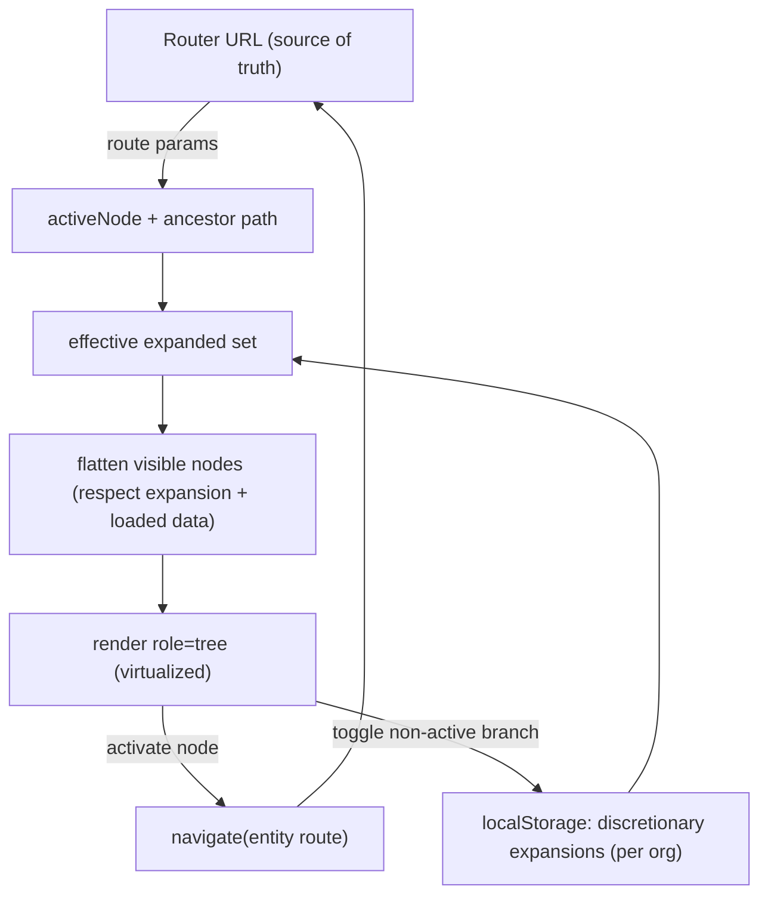

# ADR-0029: Persistent app-shell & hierarchy navigator — evolve `_authed` into a mounted-once shell, URL-derived selection, hand-rolled ARIA tree & virtualization

- **Status:** Proposed
- **Date:** 2026-07-12
- **Deciders:** James Ewbank (with Claude Code — ui-architect)
- **Related:** ADR-0004 (frontend state — server/URL/local split), ADR-0005
  (TanStack Router), ADR-0006 (tokens/shadcn/CVA), ADR-0012/0016 (RBAC + tenancy),
  ADR-0026 (TSLD canvas — the workspace this rail sits beside). Builds on the
  hierarchy CRUD slice (`docs/specs/hierarchy-crud.md`).

## Context

SchedulePoint navigates its **Org → Client → Project → Plan** hierarchy today by
click-through: `Clients` list → a client's `Projects` list → a project's `Plans`
list → the plan workspace (`/orgs/$orgSlug/plans/$planId`), which hosts the TSLD
canvas (ADR-0026). Each hop is a full route swap that unloads the previous screen.
For a planner who works across several plans in a session this is slow and
disorienting: there is no persistent sense of "where am I in the tree", and moving
plan→plan tears down and rebuilds the whole workspace.

The product owner has decided to add a **persistent left-rail tree navigator**
(an IDE-style file explorer) that stays mounted alongside the plan workspace, so
switching plans no longer unloads the shell. The scope for v1 is **locked**:

- **Augment, not replace.** The tree becomes the primary navigator; the existing
  list/management pages (CRUD, recently-deleted/restore, bulk actions) **stay**.
  The tree is navigation-first.
- **No search box in v1** (design so one can slot in later; do not build it).
- **Navigation-only** — selecting a node opens/navigates; **no in-tree
  create/rename/delete** in v1 (CRUD stays on the existing pages). Leave room for
  context-menu CRUD later.
- **Medium scale** — dozens of clients, hundreds of plans per org — so
  **lazy-load children on expand** and **virtualize** long child lists; never
  eager-load the whole tree.
- **Out of scope:** the Gantt/Network toggle and the canvas minimap.

The hard forces this ADR must resolve:

- **The router is the single source of truth (ADR-0004/0005).** A tree carries a
  natural temptation to hold its own "selected node" state. That would compete
  with the URL and break deep-link / refresh / back-forward. Selection must be a
  _view of the URL_, not a second store.
- **Accessibility is a merge gate (CLAUDE.md §13, WCAG 2.2 AA).** A tree widget is
  one of the most demanding ARIA patterns: `tree`/`treeitem`, roving tabindex,
  full arrow-key navigation, type-ahead, and correct focus management.
- **The house owns its primitives.** There is **no Radix / headless-UI dependency
  anywhere** in `apps/web`; accessible primitives are hand-rolled on semantic
  HTML (e.g. `Dialog` on the native `<dialog>` element). Any new dependency is a
  liability (CLAUDE.md §2).
- **Virtualization vs. accessibility tension.** Virtualizing removes offscreen
  rows from the DOM, which fights `aria-setsize`/`aria-posinset` and roving
  tabindex if done naïvely.
- **The dependency rule (FRONTEND_ARCHITECTURE.md):** `features → shared`, never
  the reverse, and **no `feature → feature` imports.** The navigator inherently
  needs the read queries of three features (clients, projects, plans).

The building blocks already exist and must be **reused, not forked**: the
per-level read queries `clientsQueryOptions` / `projectsQueryOptions` /
`plansQueryOptions`, the shared query-key factories in
`lib/query/hierarchy-keys.ts`, the entity routes above, the `sidebar*` design
tokens (DESIGN_SYSTEM.md), the `_authed` layout route, `useOrgRole` + `rbac.ts`,
and the shared `useAnnounce()` live region.

## Decision

We will **evolve the existing `_authed` layout into a persistent app-shell** —
**top bar + a collapsible/resizable left rail + a single main workspace region** —
that **mounts once and stays mounted**, where navigation swaps only the workspace
region's content. The **hierarchy navigator is what lives in the rail**, driven by
the router, built on a **hand-rolled ARIA `tree` primitive** and
**`@tanstack/react-virtual`**, reusing the existing per-level hierarchy queries
unchanged. The persistent shell is the **Milestone-1 foundation**; the tree, the
welcome state, and future view modes are the first things that populate it.

### 1. The persistent app-shell — evolve `_authed`, mount chrome once, render into an `<Outlet/>`

We already have an `_authed` layout route (`authed-layout.tsx`) that renders
`AppHeader` + `<Outlet/>`. This ADR **evolves that same shell** — it is **not**
greenfield — into three persistent regions: the top bar, the left navigator rail,
and the single main workspace region (the `<Outlet/>`). The chrome (top bar + rail)
is rendered **once** by the layout route and stays mounted; **child path routes
render into the outlet**, so navigating swaps only the workspace region's content.

Because the rail is part of the layout — not a child route — it **does not remount
when the plan route changes**: switching plan→plan swaps only the workspace, while
the rail, its expansion state, and its warm TanStack Query cache persist. This
mounted-once shell is the whole point of the feature.

```mermaid
flowchart LR
  subgraph Shell["_authed layout (persistent)"]
    H["AppHeader (org switcher, mobile rail toggle)"]
    subgraph Body["flex row"]
      R["NavigatorRail<br/>role=tree · collapsible · resizable (lg+)<br/>drawer/sheet (&lt; lg)"]
      O["Outlet — routed workspace<br/>(plan detail / TSLD canvas, lists, members…)"]
    end
    H --- Body
    R -->|navigate(entity route)| O
    O -.->|active route params| R
  end
```

- **Desktop (`lg+`):** persistent rail, **collapsible** (a toggle) and
  **resizable** (a keyboard-operable drag `separator`). Width and collapsed state
  persist to `localStorage` (per user).
- **Below `lg`:** the rail becomes an off-canvas **drawer/sheet**, toggled from the
  header — the same `sidebar ⇄ drawer at lg` shift the DESIGN_SYSTEM already
  mandates, using the existing `sidebar*` tokens. Opening moves focus into the
  drawer; closing returns focus to the trigger (the house dialog/sheet convention).
- Mobile-first and theme-aware are non-negotiable; no one-off styling — tokens +
  CVA only.

### 2. Selection is a view of the URL; expansion is derived-plus-local

The tree holds **no selection state of its own**. The _selected/active_ node is
whatever entity the current route addresses, read from route params
(`useParams`/`useRouterState`) exactly as `AppHeader` already derives its active
nav item. **Activating a node navigates** to that entity's existing route
(`.../clients/$clientId`, `.../projects/$projectId`, `.../plans/$planId`); the
tree then highlights it because the URL changed. Deep-link, refresh, and
back/forward therefore all work for free — no new routes are introduced.

**Expansion state** is deliberately split so it never fights the router:

- **Ancestor-path expansion is derived from the URL, not stored.** The path from
  the active node up to the root is always expanded, so landing on a deep plan URL
  auto-reveals the branch that contains it. Ancestor ids come from the already-
  cached `planQueryOptions`/`projectQueryOptions`/`clientQueryOptions` detail
  reads (the plan workspace already loads them); a cache miss triggers a cheap,
  cached detail fetch to learn the parents.
- **Discretionary expansions** (branches the user opened that are _not_ on the
  active path) are **local UI state** persisted to `localStorage`, keyed per org
  (`schedulepoint:nav:expanded:<orgSlug>`), as a set of node ids.
- The **effective expanded set = ancestorsOf(activeRoute) ∪ persistedExpansions.**
  The URL always wins for "what must be visible"; `localStorage` only _adds_ open
  branches. Expansion is **not** put in the URL — it is ancillary, non-shareable,
  and would bloat the URL and contend with typed search params.



### 3. Data fetching — reuse the per-level queries; lazy on expand

The navigator adds **no new query keys and no new endpoints.** It composes the
existing per-level reads:

- roots → `clientsQueryOptions(orgSlug)`
- a client's children → `projectsQueryOptions(orgSlug, clientId)`
- a project's children → `plansQueryOptions(orgSlug, projectId)`

A parent's children query is **enabled only when that parent is expanded**
(lazy-load on expand); collapsed branches never fetch. Because the tree reuses the
**same query keys** as the list/management pages, tree and pages share one cache:
creating a project on the Projects page invalidates
`projectKeys.listByClient(...)` and the tree's open branch refreshes with **no new
invalidation logic**. Child-count indicators on the list summaries let the tree
show a disclosure affordance only for non-empty branches, avoiding wasted fetches.
Optional: prefetch a node's children on hover/focus intent (the router already
uses `defaultPreload: 'intent'` for the route itself).

To honour the **no `feature → feature` imports** rule, the three read
`queryOptions` are **promoted to shared** (co-located with the key factories they
already depend on, under `lib/query/`), and **re-exported from each feature's
public surface** so existing call sites are unchanged. This extends the exact
precedent set for `hierarchy-keys.ts` ("these live in `lib` (shared)… each feature
re-exports its own factory"). Mutations stay in their features. The navigator UI
then depends **only on shared** code.

### 4. Accessibility — a hand-rolled ARIA `tree` following the WAI-ARIA APG

We will **adopt the proven WAI-ARIA APG Tree View _pattern_** and **hand-roll the
_implementation_** as a design-system primitive, consistent with the house's
own-our-primitives posture (native `<dialog>` for `Dialog`, etc.). We will **not**
add a headless library (react-aria, Ariakit, Radix): none ships a virtualization-
friendly tree, and each is a large dependency that contradicts the deliberate
no-Radix stance (CLAUDE.md §2). The pattern — not a library — is the reusable
asset.

Requirements the primitive implements exactly:

- `role="tree"` on the scroll viewport with an `aria-label`; each row
  `role="treeitem"` carrying `aria-level`, `aria-setsize`, `aria-posinset`,
  `aria-expanded` (parents only), and `aria-selected`/`aria-current="page"` for the
  active route node. The flattened-DOM form (aria-level + setsize + posinset) is
  explicitly sanctioned by the APG and is what makes virtualization compatible.
- **Roving tabindex:** exactly one visible treeitem has `tabindex=0`, all others
  `-1`; a `focusedId` in React state drives both the tabindex and `.focus()`.
- **Keyboard map (APG):** Up/Down move to prev/next visible item; Right expands (or
  moves to first child if already expanded); Left collapses (or moves to parent if
  already collapsed); Enter/Space **activate** (navigate); Home/End jump to
  first/last; **type-ahead** focuses the next item whose label starts with the
  typed characters. Focus is DOM-managed and never trapped.
- **Announcements:** lazy-load outcomes and errors are announced via the existing
  `useAnnounce()` polite live region (WCAG 4.1.3), e.g. "12 projects loaded".
- The resize `separator` is keyboard-operable with `aria-orientation` and arrow-key
  resizing. Visible focus uses existing focus tokens; meaning is never colour-only.

### 5. Virtualization — flatten-visible then `@tanstack/react-virtual`

We add **`@tanstack/react-virtual`** (one small dependency, same family as Query
and Router already in use). The tree is modelled as a **single flattened array of
_visible_ nodes** (respecting the effective expanded set and loaded data) fed to
**one `useVirtualizer`** over the rail's scroll viewport — the canonical TanStack
tree pattern — rather than nested per-level scrollbars. Per-level **loading /
empty / error** states are represented as **synthetic rows** in the flattened
array at the correct depth (a skeleton row, a muted "No projects" row, an
inline "Couldn't load — Retry" row), so there is one scroll container, one
virtualizer, and uniform row semantics.

Virtualization-vs-a11y is reconciled by: (a) setting `aria-setsize`/`aria-posinset`
on every rendered treeitem so AT knows the true totals despite windowing; (b)
guaranteeing the `focusedId` node is always rendered — moving focus offscreen
calls the virtualizer's `scrollToIndex` first, then focuses; (c) a modest overscan.
Virtualization may be gated to activate only past a threshold (e.g. > ~50 visible
rows) so short trees stay maximally simple.

### 6. RBAC & tenancy

The tree is **org-scoped by the URL's `orgSlug`** and renders only the active
org's hierarchy; the `OrgSwitcher` re-scopes it. Node reads are member-level
(all roles may browse — matching the existing `*:read` grants), so **no node is
role-gated for visibility**, and the tree shows only what the already
permission-and-scope-filtered list endpoints return (no new IDOR surface). Because
v1 is navigation-only there are no in-tree write affordances to gate; **future**
context-menu CRUD will gate on `canManageHierarchy(role)` exactly like the list
pages, with the API remaining the trust boundary. "Recently deleted" stays a
header/page entry point, not a tree node.

### 7. State model (mapped to ADR-0004 buckets)

| Concern                                   | Bucket                      | Home                                           |
| ----------------------------------------- | --------------------------- | ---------------------------------------------- |
| Node data per level                       | **Server (TanStack Query)** | existing `*QueryOptions` + `hierarchy-keys.ts` |
| Selected/active node + ancestor expansion | **URL (router)**            | existing entity routes; derived from params    |
| Discretionary expansion set               | **Local (persisted)**       | `localStorage` per org                         |
| Rail width / collapsed                    | **Local (persisted)**       | `localStorage` per user                        |
| `focusedId`, drawer-open                  | **Local (ephemeral)**       | React state / small context                    |

No global store (no Zustand) is introduced; a minimal `NavigatorProvider` context
may hold expansion + focus + rail prefs to avoid deep prop-drilling.

### 8. Component decomposition & placement

The navigator is **app-shell furniture** (tier-2 composite), placed in
`components/layout/navigator/` and composed by the `_authed` layout — it imports
**only shared** code (ui primitives + the now-shared hierarchy `queryOptions` +
`rbac` + router), respecting `features → shared` and `shell → shared`.

- `NavigatorRail` — the shell region: collapse/resize (lg+), drawer/sheet (< lg),
  header label + toggle, persistence of width/collapsed.
- `HierarchyTree` — the `role="tree"` container: owns `focusedId`/roving tabindex,
  the keyboard + type-ahead handler, the flattened-visible model, and the
  virtualizer.
- `TreeItemRow` — one `role="treeitem"`: disclosure control, entity icon (Lucide),
  label, active/selected styling, activate → navigate. Presentational.
- `useVisibleNodes(orgSlug)` — assembles the flattened visible array by reading the
  per-level `queryOptions` for each expanded parent, emitting synthetic
  loading/empty/error rows.
- `NodeStateRow` — renders the synthetic loading/empty/error rows at the right
  depth.
- Hooks: `useNavigatorExpansion(orgSlug)` (localStorage set + active-path
  derivation), `useRailPrefs()` (width/collapsed), `useRovingTreeKeyboard()`.

### 9. The workspace region has a no-selection welcome state (the authed index route)

The shell's workspace region (the `_authed` `Outlet`) hosts **either** a selected
plan workspace **or** a "no plan selected" welcome empty-state. The default
post-login landing is the **shell fully up** — rail ready, date ruler + TODAY
marker visible behind — with the main region showing a centered **"Select a plan
from the Project Explorer"** card plus a new-user **"+ Client → Project → Plan"**
hint. Architecturally this welcome state is the **index/no-selection route of the
authed area** (the layout's index route), **distinct from** an addressable
selected `…/plans/:id` route. The per-plan (and future per-view) routes are
confirmed as the addressable, deep-linkable targets; the index route is the
neutral home the rail navigates _away from_ on first selection. This persistent
two-region shell (rail + workspace-or-welcome) is the **Milestone-1 foundation**
we are evolving `_authed` into — later view modes and panels slot into the same
region without reshaping the shell.

### 10. Staged rollout behind a flag

Ships behind a `VITE_NAV_TREE` flag (the house pattern, cf. `VITE_TSLD_EDITING`),
default off until the a11y and virtualization gates are green, then flipped on.
The existing list/management pages remain the fallback throughout (augment, not
replace).

## Alternatives considered

- **Tree holds its own `selectedId` state (sync to URL via effects).** The obvious
  build, but it creates a second source of truth that drifts from the URL and
  breaks deep-link/refresh/back-forward — a direct violation of ADR-0004/0005.
  _Rejected_ in favour of deriving selection from route params.
- **A single-URL shell (one route; selection lives only in app state).** A literal
  "the shell is one page and the workspace content is switched in-place without a
  path change" approach — the mounted-once shell without addressable routes. It
  keeps the shell trivially persistent, but breaks deep-linking, refresh,
  back/forward, and shareable plan URLs, and re-invents selection state outside the
  router (against ADR-0004/0005). _Rejected_ — the shell mounts once **and** every
  plan/view is an addressable path route (`…/plans/:id`, `…/clients`, …) rendering
  into the outlet; we get persistence and real URLs, not one or the other.
- **Persist the full expansion set in the URL search params.** Makes expansion
  shareable, but bloats the URL, contends with the typed search-param scheme, and
  couples an ancillary UI preference to navigation history. _Rejected_; only the
  URL-implied _ancestor path_ drives expansion, discretionary opens go to
  `localStorage`.
- **Eager-load the whole tree once and keep it in memory.** Simplest data model,
  but violates the locked "lazy-load on expand" scope and does not scale to
  hundreds of plans; wasteful for branches never opened. _Rejected._
- **Adopt a headless tree library (react-aria `useTree` / Ariakit / Radix).** Gets
  a vetted a11y core, but every one is a substantial new dependency that
  contradicts the deliberate no-Radix, own-our-primitives posture, and none offers
  a first-class virtualized tree — we would still hand-write the windowing glue.
  _Rejected_ in favour of implementing the APG _pattern_ as a house primitive.
- **Hand-roll virtualization (or skip it).** Skipping fails the locked
  "virtualize long child lists" requirement at the stated scale; hand-rolling
  duplicates a solved problem. `@tanstack/react-virtual` is small, same-family, and
  battle-tested. _Rejected_ in favour of the library.
- **Nested per-level scroll containers (each expanded list scrolls independently).**
  Avoids a flattened model, but yields nested scrollbars and a poor keyboard/AT
  experience across levels. _Rejected_ in favour of flatten-visible + one
  virtualizer.
- **Build the rail inside a child route instead of the layout.** Would remount the
  rail (losing expansion and warm cache) on every plan switch — defeating the
  feature's reason to exist. _Rejected_ in favour of the layout-route mount.
- **Put the navigator in a `features/navigator/` folder importing the three
  features' hooks.** Violates the no `feature → feature` rule. _Rejected_ in favour
  of promoting the read `queryOptions` to shared (re-exported by features) and
  placing the UI in the shell layer.

## Consequences

- **Selection can never desync from the URL**, because it _is_ the URL; deep-link,
  refresh, and back/forward are correct by construction. Reviewers must reject any
  future PR that introduces a competing `selectedId` store in the tree.
- **The rail persists across plan switches**, delivering the "switch plans without
  unloading the workspace" goal; the workspace `Outlet` still route-swaps, but the
  warm Query cache + prefetch keep it fast.
- **Zero data duplication:** the tree and the management pages share one cache and
  one set of query keys, so mutations on the pages reflect in the tree with no
  extra wiring. This tightens the reuse win but also means the **read
  `queryOptions` become a shared contract** (a small, precedent-consistent move
  already established by `hierarchy-keys.ts`).
- **One new runtime dependency** (`@tanstack/react-virtual`) and **one new
  hand-rolled primitive** (the ARIA tree) enter the codebase. The tree primitive
  is now a maintained house asset (with its own keyboard/a11y test suite) — a cost
  we accept to avoid a heavier headless dependency.
- **A new app-shell region** changes the authed layout for every screen; the
  DESIGN_SYSTEM's `sidebar ⇄ drawer at lg` contract and `sidebar*` tokens now have
  a concrete consumer. FRONTEND_ARCHITECTURE.md's "Responsive strategy" and
  dependency-rule notes gain a navigator subsection (see below).
- **Accessibility is load-bearing and explicitly gated:** roving tabindex, the full
  APG key map, type-ahead, focus return on the mobile drawer, and
  setsize/posinset-under-virtualization must all be covered by Testing-Library +
  `@axe-core/playwright` before the flag flips — this is the highest-risk area and
  the reason for the staged rollout.
- **The persistent shell is the Milestone-1 foundation, not a detail.** Evolving
  `_authed` into a mount-once top-bar + rail + single workspace region establishes
  the frame that later view modes, panels, and the welcome/no-selection index route
  slot into without reshaping the shell. The workspace region hosts **either** a
  selected plan workspace **or** the welcome empty-state (the authed index route),
  and every plan/view remains an addressable, shareable path route.
- **Designed-for, not built:** a search box (filter over the flattened model), and
  role-gated context-menu CRUD are deliberate future slices; the flattened-visible
  model and the RBAC seam leave room for both without rework.
- **Neutral:** no backend change — the navigator consumes existing endpoints only.

## References

- CLAUDE.md §12 (frontend architecture/design system), §13 (a11y), §16 (ADR list).
- `docs/FRONTEND_ARCHITECTURE.md` (state buckets, dependency rules, responsive
  strategy), `docs/DESIGN_SYSTEM.md` (`sidebar*` tokens, breakpoints, sheets),
  `docs/UX_STANDARDS.md`.
- ADR-0004 (state split), ADR-0005 (routing), ADR-0006 (tokens), ADR-0026 (TSLD
  canvas workspace), ADR-0012/0016 (RBAC + tenancy).
- `docs/specs/hierarchy-crud.md`; `apps/web/src/lib/query/hierarchy-keys.ts`;
  `apps/web/src/routes/authed-layout.tsx`; `apps/web/src/components/layout/app-header.tsx`.
- WAI-ARIA Authoring Practices — Tree View pattern.
