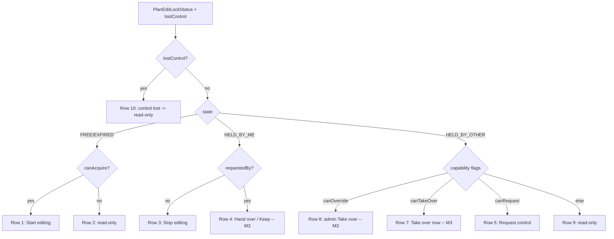
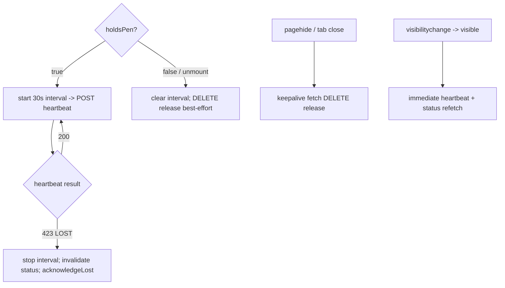

# Plan edit-lock — M2 front-end pen UX (`features/plan-lock/`)

- **Status:** Draft for approval (the "design before non-trivial UI" gate, CLAUDE.md §20).
- **Author:** ui-architect
- **Scope:** **M2** of the plan edit-lock feature — the front-end "pen": the lock-status query
  (poll + focus refetch), the acquire/release/heartbeat/request/handoff/take-over hooks, the
  `EditLockBanner`/`EditLockControls` surface, gating the existing editing affordances on
  _holding the pen_, and the distinct **423 (`LOCKED`)** handling. The API is **built** (M1
  shipped: `GET/POST/heartbeat/request/handoff/DELETE` under
  `/organizations/:orgSlug/plans/:planId/edit-lock`, plus the inert `assertHoldsPen` write-gate
  behind `PLAN_EDIT_LOCK_ENFORCED`).
- **Governing decisions:** **ADR-0028** (edit-lock lease + peer hand-off + 423 write-gate — the
  backend model this UI drives), ADR-0004 (state split: server→TanStack Query, URL→router,
  minimal local), ADR-0005 (router), ADR-0006 (tokens + shadcn/ui + CVA), ADR-0026 (TSLD canvas
  — the primary gated surface). Standards: `docs/FRONTEND_ARCHITECTURE.md`,
  `docs/DESIGN_SYSTEM.md`, `docs/UX_STANDARDS.md`. Feature: `docs/features/plan-edit-lock/`.
  Shared types: `@repo/types` (`PlanEditLockStatus`, `PlanEditLockState`, `PlanEditLockActor`,
  `PlanEditLockReason`, `PlanEditLockErrorDetails`).
- **Not in scope (M3):** the wired peer request/hand-off/take-over/override _controls_ and the
  multi-actor Playwright journey (M2 designs their **states** and endpoints but ships the
  read-only "who holds the pen" surface + Start/Stop + gating first); flipping
  `PLAN_EDIT_LOCK_ENFORCED` on in prod (ops action, gated on M2/M3 shipping); websocket
  propagation and a queryable audit table (ADR-0028 future work); the separate `VITE_TSLD_EDITING`
  a11y pre-enablement gate (TECH_DEBT #25).

This is a design + interaction spec. **No application code is written here.** Hook/type/keymap
sketches are illustrative (as in `docs/design/tsld-m5-a11y.md`), not files; they record the
architecture the implementer builds against and flag the decisions that need your input.

---

## 0. The state we build on (what M1 already gives us)

- **The endpoints exist and are authoritative.** All policy is resolved server-side and returned
  on `PlanEditLockStatus`: `state` (`FREE | HELD_BY_ME | HELD_BY_OTHER | EXPIRED`), `holder` /
  `requestedBy` actors, `expiresAt` / `heartbeatAt` / `graceEndsAt` ISO instants, and the four
  capability flags `canAcquire` / `canRequest` / `canTakeOver` / `canOverride`. **The client
  never re-derives lock policy** (who may take over, whether grace elapsed) — it renders per the
  flags. This is the crux that keeps the front end thin and correct: countdowns are advisory, the
  server decides.
- **423 is a first-class, distinct wire code.** `code: 'LOCKED'`, with
  `details: PlanEditLockErrorDetails` (`reason: PLAN_EDIT_LOCK_REQUIRED | _HELD | _LOST`, optional
  `holder`). It is **not** a 409 — the two must stay visually and semantically separate (ADR-0028
  consequence).
- **`apiFetch` already surfaces it.** A 423 rejects with `ApiFetchError { status: 423, error }`
  where `error.details` is the `PlanEditLockErrorDetails` (untyped as `unknown` at the boundary —
  the feature narrows it, exactly as `RecalculateButton` narrows the 422 `PLAN_START_REQUIRED`
  `details.reason` today). No client change is needed to _receive_ a 423; M2 adds the _branch_.
- **Enforcement is OFF in M2.** `PLAN_EDIT_LOCK_ENFORCED` defaults off, so gated writes do **not**
  423 yet. M2 therefore **derives `holdsPen` from the lock status and gates the UI**, and handles
  a 423 defensively (tested with mocks) so the code is correct the instant ops flip enforcement
  on — but the existing activities-table / dependency / recalculate flows keep working unchanged
  with enforcement off.

The M2 job, precisely: make the front end **acquire and hold the pen across every editing entry
point**, so that (a) two Planners never both see live editing affordances, and (b) ops can safely
flip `PLAN_EDIT_LOCK_ENFORCED` on afterwards without 423-ing shipped functionality.

---

## 1. `features/plan-lock/` module shape

Feature-first, mirroring `features/schedule` and `features/activities`
(`api/` hook module + `components/` + a thin `index.ts` public surface). No feature→feature
imports; the route composes.

```
features/plan-lock/
  api/
    use-plan-edit-lock.ts     # query + all mutations + the lifecycle hooks
  components/
    EditLockBanner.tsx        # the state→UI surface (§2)
    EditLockControls.tsx      # the button cluster the banner renders (Start/Stop/Request/…)
    EditLockBanner.test.tsx
    EditLockBanner.a11y.test.tsx
  lib/
    lock-error.ts             # classifyLockError(err) → PlanEditLockReason | null  (§4)
    lock-copy.ts              # centralised, reviewed copy strings per state/reason
  index.ts                    # public surface: usePlanPen, EditLockBanner, planLockKeys, isLockError
```

### 1.1 Query-key placement — extend `hierarchy-keys`

Add a `planLockKeys` factory to `lib/query/hierarchy-keys.ts` (alongside `scheduleKeys` /
`baselineKeys`, which already live there) and **re-export it from the feature** — the established
convention (a feature re-exports its own factory so callers still import from the feature surface,
while the factory itself is shared so cross-cutting invalidation depends _downward_).

```ts
export const planLockKeys = {
  all: (orgSlug: string) => ['plan-lock', orgSlug] as const,
  status: (orgSlug: string, planId: string) =>
    [...planLockKeys.all(orgSlug), 'plan', planId] as const,
};
```

One key per plan (the lock is 1:1 with a plan). This is the single key acquire / release /
heartbeat / request / handoff / take-over all invalidate.

### 1.2 The status query — `usePlanEditLock`

```ts
export function planEditLockQueryOptions(orgSlug: string, planId: string, enabled: boolean) {
  return queryOptions({
    queryKey: planLockKeys.status(orgSlug, planId),
    queryFn: () =>
      apiFetch<PlanEditLockStatus>(`/organizations/${orgSlug}/plans/${planId}/edit-lock`),
    enabled, // OFF when the pen layer is flag-disabled (§3.4) — no polling
    refetchInterval: 15_000, // ≤ 20 s propagation target (spec success criteria); see OQ-5
    refetchOnWindowFocus: true, // immediate reflect on focus (US-2)
    staleTime: 0, // status is inherently volatile — never serve it stale on mount
  });
}
```

- **Poll cadence 15 s** sits inside the ≤ 20 s propagation target with headroom for jitter, and is
  half the 30 s heartbeat so a holder's renewals are seen within one poll. `refetchOnWindowFocus`
  covers the "I alt-tabbed back" case immediately.
- Only the **plan-detail screen** mounts this; it is not a global subscription. When the pen layer
  is flag-off (§3.4) the query is `enabled: false` — zero network cost, current behaviour byte-for-byte.

### 1.3 Mutations — one per verb, house `useMutation` + invalidate pattern

Each is a thin `apiFetch` mutation whose `onSuccess`/`onSettled` invalidates
`planLockKeys.status(orgSlug, planId)` (and nothing else — the lock touches no other cache). Copy
the `use-schedule.ts` / `use-activities.ts` shape exactly.

| Hook                | Method + path                          | Body                  | Notes                                                                   |
| ------------------- | -------------------------------------- | --------------------- | ----------------------------------------------------------------------- |
| `useAcquireLock`    | `POST …/edit-lock`                     | `{ takeover?: bool }` | **returns 200** (idempotent upsert/renew/take-over). Default body `{}`. |
| `useReleaseLock`    | `DELETE …/edit-lock`                   | —                     | 204. Also used by the effect cleanup on nav-away (§5).                  |
| `useLockHeartbeat`  | `POST …/edit-lock/heartbeat`           | —                     | 200 renews; **423 `PLAN_EDIT_LOCK_LOST`** → drop-to-read-only (§5).     |
| `useRequestControl` | `POST …/edit-lock/request`             | —                     | 200 (benign no-op if free/mine). M3-wired.                              |
| `useHandoff`        | `POST …/edit-lock/handoff`             | —                     | 200 transfers to pending requester; 409 if none. M3-wired.              |
| `useTakeOver`       | `POST …/edit-lock` `{ takeover:true }` | `{ takeover:true }`   | Reuses `useAcquireLock` with `takeover`. Peer (post-grace) + admin.     |

`useTakeOver` is not a separate endpoint — it is `useAcquireLock` invoked with `{ takeover: true }`.
Keep one mutation and pass the flag, so acquire/renew/take-over share a code path (matching the
server's idempotent upsert).

### 1.4 The lifecycle hook — `useLockHeartbeat` (interval + release-on-leave)

The heartbeat is not a bare mutation; it owns an **interval effect while holding** plus the
**release-on-leave** wiring. Signature:

```ts
useLockHeartbeat(orgSlug, planId, { holding }: { holding: boolean });
```

Behaviour (correctness detail in §5): while `holding`, run a 30 s interval firing the heartbeat
mutation; on cleanup (holding→false or unmount) clear the interval and best-effort release; register
one `pagehide` listener that releases via a keepalive `fetch` (see §5 / OQ-2). On a 423
`PLAN_EDIT_LOCK_LOST` from any heartbeat, invalidate the status query and signal lost-control.

### 1.5 The orchestrator — `usePlanPen` (the one hook the route consumes)

To keep `plan-detail.tsx` clean and keep all the wiring co-located and unit-testable, expose a
single composition hook the route calls once:

```ts
const pen = usePlanPen(orgSlug, planId, { role });
// → { penManaged, status, holdsPen, isPending,
//     startEditing, stopEditing, requestControl, handoff, takeOver, override,
//     lostControl, acknowledgeLost }
```

- `penManaged` — is the pen layer active at all (flag on — §3.4). When false, `holdsPen` is not
  consulted; the route falls back to today's role-only gating.
- `holdsPen = penManaged && status?.state === 'HELD_BY_ME'`.
- `usePlanPen` composes `usePlanEditLock` + the mutations + `useLockHeartbeat(…, { holding: holdsPen })`
  and exposes intent methods that also drive the shared `useAnnounce()` region (e.g. `startEditing`
  announces "You're now editing this plan."). It holds the transient `lostControl` reason (§5).

This is the ADR-0004 split in practice: **server state** (the lease) lives entirely in TanStack
Query keyed by plan; **local state** is only the transient `lostControl` flag; there is **no URL
state** for the pen (it is ephemeral, not shareable/bookmarkable — deliberately not a search param).

---

## 2. State → UI mapping (`EditLockBanner` / `EditLockControls`)

One banner mounts once for the plan's schedule-editing region (§3). It is a **polite live region**
(`role="status"`) so every transition ("Jane is editing", "control was taken over") is announced
without stealing focus. It renders a `Badge` (status pill) + a sentence + an `EditLockControls`
cluster. **Tokens + shadcn/ui only — no one-off styling** (Button, Badge, Alert-style container
reusing the `EditConflictBanner` token recipe, ConfirmDialog for take-over/override).

The banner is a **pure function of `PlanEditLockStatus` + `lostControl`** — no client policy. Each
control's presence is keyed on a server capability flag, never a re-derived rule:

| #   | Condition (from status)                                           | Copy (see `lock-copy.ts`)                                                 | Controls                                   | Ships                         |
| --- | ----------------------------------------------------------------- | ------------------------------------------------------------------------- | ------------------------------------------ | ----------------------------- |
| 1   | `FREE`/`EXPIRED` + `canAcquire`                                   | "No one is editing." · (`EXPIRED`) "{holder} was editing (inactive)."     | **Start editing** (primary)                | M2                            |
| 2   | `FREE`/`EXPIRED` + `!canAcquire` (Viewer/Contributor)             | "No one is editing." (read-only)                                          | —                                          | M2                            |
| 3   | `HELD_BY_ME`, no `requestedBy`                                    | "You're editing this plan." · Badge "Editing"                             | **Stop editing** (outline)                 | M2                            |
| 4   | `HELD_BY_ME` + `requestedBy`                                      | "{requestedBy} is asking to edit."                                        | **Hand over** (primary) · **Keep editing** | M3                            |
| 5   | `HELD_BY_OTHER` + `canRequest`, request not mine                  | "{holder} is editing (active {relative heartbeatAt})." · Badge "Locked"   | **Request control**                        | M2 (badge/copy) · M3 (button) |
| 6   | `HELD_BY_OTHER`, my request pending, `!canTakeOver`               | "Requested — waiting for {holder} ({advisory countdown to graceEndsAt})." | **Take over now** (disabled)               | M3                            |
| 7   | `HELD_BY_OTHER` + `canTakeOver` (grace elapsed / holder inactive) | "{holder} hasn't responded. You can take over."                           | **Take over now** (primary)                | M3                            |
| 8   | `HELD_BY_OTHER` + `canOverride` (Org Admin)                       | "{holder} is editing." + admin note                                       | **Take over** → ConfirmDialog (immediate)  | M3                            |
| 9   | `HELD_BY_OTHER` + `!canRequest` (Viewer)                          | "{holder} is editing." (read-only)                                        | —                                          | M2                            |
| 10  | `lostControl` set (transient, just got 423 `_LOST`)               | "Editing control was taken over — you're now read-only." (distinct §4)    | **Dismiss** (reconciles on next poll)      | M2                            |

**M2 delivers rows 1–3, 9, 10** (the read-only "who holds the pen" surface, Start/Stop, and the
lost-control transition) plus the badge/copy for row 5. **M3 wires** the request/hand-off/take-over/
override controls (rows 4, 5-button, 6–8) — the component is authored with all rows so M3 is a
fill-in, not a rewrite. The take-over (row 7) and admin override (row 8) use the existing
`ConfirmDialog` (`role="alertdialog"`, focus-trapped) — override defaults to a `default`-variant
confirm ("Take over editing?"), not destructive.

**Copy discipline (UX_STANDARDS).** All strings live in `lock-copy.ts` and go through the
ux-reviewer. "active {relative}" uses a relative-time formatter over `heartbeatAt` (e.g. "just
now", "2 min ago"); the advisory countdown (row 6) is computed from `graceEndsAt` but is **never
placed in the live region** (§6) — it ticks silently and only the _transition_ to row 7 is
announced.



---

## 3. `plan-detail.tsx` integration

### 3.1 Split `canWrite` — pen-gate the schedule model only

Today `plan-detail.tsx` derives one `canWrite = canManageHierarchy(role)` and uses it for **both**
plan-metadata affordances and schedule-model affordances. The pen guards **only the on-canvas
schedule model** (activities, dependencies, positions, recalculate — ADR-0028 §7 / spec §1). So
split it:

```ts
const pen = usePlanPen(orgSlug, planId, { role });
const canWrite = canManageHierarchy(role); // role only — metadata/baselines
const canEditSchedule = pen.penManaged ? canWrite && pen.holdsPen : canWrite; // pen-gated
const canProgress = canReportProgress(role); // role only — Contributor path, UNCHANGED
```

| Affordance                                                   | Gate                                               | Rationale                                                       |
| ------------------------------------------------------------ | -------------------------------------------------- | --------------------------------------------------------------- |
| `TsldPanel canEdit`                                          | `canEditSchedule`                                  | on-canvas structural editing (the flagship surface)             |
| `CreateActivityButton`                                       | `canEditSchedule`                                  | activity create is pen-gated (spec gated-write list)            |
| `ActivitiesTable canWrite`                                   | `canEditSchedule`                                  | definition edit/delete are pen-gated                            |
| `DependencyEditor canManageLogic`                            | `canEditSchedule`                                  | dependency create/update/delete are pen-gated                   |
| `RecalculateButton canCalculate`                             | `canEditSchedule` (∧ `canCalculateSchedule(role)`) | recalc is pen-gated (Q-B)                                       |
| `ActivitiesTable canReportProgress`                          | `canProgress`                                      | **Contributor progress path is exempt (Q-C)** — never pen-gated |
| "Edit plan" button · `PlanFormDialog` · `PlanCalendarPicker` | `canWrite`                                         | plan **metadata** — version-guarded, not pen-gated (spec)       |
| `BaselinesPanel canManage`                                   | `canWrite`                                         | baselines are not in the gated-write list                       |

This split is the **deliberate, user-visible behaviour change** M2 introduces: once the pen layer
is on, a Planner must **Start editing** (take the pen) before the schedule-model affordances appear
— for the activities table _and_ the canvas alike. That is the whole point (it is what lets ops
flip `PLAN_EDIT_LOCK_ENFORCED` on without 423-ing the table). Progress reporting and plan-metadata
edits are untouched.

### 3.2 Where the banner mounts

Mount **one** `EditLockBanner` at the top of the schedule-editing region — directly under the
`Schedule` `<h2>` / above the `RecalculateButton` and the Logic-diagram + Activities blocks it
governs — because the pen governs _all_ of those affordances, not just the canvas. A single banner
is the one place that answers "who holds the pen" and offers Start/Stop; scattering it per-block
would fragment the mental model (UX_STANDARDS: one clear owner per state). It renders `null` when
`!pen.penManaged`.

### 3.3 Read-only remains fully functional

With no pen, every read path (activities list, dependencies, schedule summary, baselines, variance,
the TSLD read surface) is unchanged. The pen only ever _adds_ editing affordances; it never gates
reads. Viewers/Contributors see row 2/9 copy and the normal read surface.

### 3.4 The front-end rollout flag — `VITE_PLAN_EDIT_LOCK` **(critical decision — OQ-1)**

**Recommend: introduce `VITE_PLAN_EDIT_LOCK` (default off), read via `config/env.ts`, gating the
entire pen layer.** Rationale:

- Gating the _already-shipped, flag-on_ activities table on `holdsPen` is a user-visible change
  that is **not** behind `VITE_TSLD_EDITING`. Shipping it unconditionally would change live
  behaviour before enforcement is ready — violating "M1/M2 land dormant; `main` stays releasable
  with no user-visible change" (ADR-0028 §9).
- A front-end flag is the exact mirror of the backend's `PLAN_EDIT_LOCK_ENFORCED`, and ADR-0028's
  consequence already requires an **ordering**: the front end must acquire the pen on every entry
  point _before_ enforcement flips on. Two flags make that ordering operable:
  **enable `VITE_PLAN_EDIT_LOCK` first** (users start taking the pen — harmless while the backend
  still accepts non-holder writes), **then** flip `PLAN_EDIT_LOCK_ENFORCED`.
- When off: `usePlanPen` returns `penManaged: false`, the status query is `enabled: false` (no
  polling, no heartbeat), the banner renders nothing, and `canEditSchedule === canWrite` — today's
  behaviour byte-for-byte. This is the M1 "ships inert" discipline applied to the front end.

This is a rollout mechanism already implied by ADR-0028, not a new architectural decision — record
it as a **DECISIONS.md** note (§8), not a new ADR.

---

## 4. Distinct 423 (`LOCKED`) handling — extend the conflict pattern

The existing pattern: route write-handlers (`onTsldReposition`, `onTsldLink`, `onTsldAutoArrange`,
and the activities-table/dependency mutations) `catch (err)` and branch on `err instanceof
ApiFetchError && err.status === 409 (/422)`, returning a non-destructive `{ applied:false, conflict }`
message rendered by `EditConflictBanner` (`role="alert"`, warning tokens). A 423 currently falls
through to `throw err`. M2 adds the branch.

### 4.1 Classify at the boundary

`features/plan-lock/lib/lock-error.ts`:

```ts
export function classifyLockError(err: unknown): PlanEditLockReason | null {
  if (err instanceof ApiFetchError && err.status === 423) {
    return (
      (err.error.details as PlanEditLockErrorDetails | undefined)?.reason ??
      'PLAN_EDIT_LOCK_REQUIRED'
    );
  }
  return null;
}
```

(Narrowing `details` at the boundary, exactly as `RecalculateButton.isPlanStartRequired` narrows
the 422 today — the shared client leaves `details` as `unknown`.)

### 4.2 Route a 423 to the **lock** surface, not the 409 conflict banner **(critical — OQ-3)**

**Recommend:** a 423 is a **lock-state event**, so it belongs to the `EditLockBanner`'s lost-control
state (row 10), _not_ the per-edit `EditConflictBanner`. The route composes a single
`onWriteRejected(err)` helper (from `usePlanPen`) that every write-handler's catch calls:

```ts
function onWriteRejected(err: unknown): WriteRejection {
  const reason = classifyLockError(err);
  if (reason) {
    pen.acknowledgeLost(reason);                                    // set transient lostControl (row 10)
    queryClient.invalidateQueries({ queryKey: planLockKeys.status(orgSlug, planId) }); // reconcile
    return { kind: 'lock' };                                        // handler returns { applied:false, conflict:null }
  }
  if (err instanceof ApiFetchError && (err.status === 409 || err.status === 422)) {
    return { kind: 'conflict', message: /* existing 409/422 copy */ };
  }
  throw err;
}
```

Consequences, satisfying the task's three requirements:

1. **Drops to read-only.** Invalidating the lock query → refetch → `state` is no longer
   `HELD_BY_ME` → `holdsPen` false → `canEditSchedule` false → `TsldPanel`/table/recalc go
   read-only automatically. The transient `lostControl` flag bridges the ~poll-latency gap with
   _instant_ feedback (row 10), then clears when the fresh status arrives (self-reconciling — no
   stale banner).
2. **Distinct copy.** Row 10 ("Editing control was taken over — you're now read-only.") is visibly
   and semantically different from the 409 "This plan changed since you opened it… Refresh." The
   409 keeps its warning-toned `EditConflictBanner`; the 423 uses the lock banner (a "you lost the
   pen" state, not a "refresh to merge" prompt). **The write-handler does _not_ set the TsldPanel
   `conflict` string on a 423** — so the canvas never double-messages (one surface per concern).
3. **Reason-specific.** `PLAN_EDIT_LOCK_LOST` (stolen/expired mid-edit) → row 10 copy above.
   `PLAN_EDIT_LOCK_REQUIRED` (a write while the client _thought_ it was read-only — a race with a
   stale cache) → "You're not the current editor — take the pen to edit." Both drop to read-only;
   the copy differs. `PLAN_EDIT_LOCK_HELD` only arises from acquire/take-over (handled in
   `EditLockControls`, not the write path).

**Alternative (not recommended):** add a `variant: 'conflict' | 'lock'` prop to
`EditConflictBanner`. Rejected: it overloads a per-edit component with lock-state semantics and
duplicates the read-only transition the lock banner already owns. Keeping 409→`EditConflictBanner`
and 423→`EditLockBanner` is the cleaner one-surface-per-concern separation.

### 4.3 M2 reality

With `PLAN_EDIT_LOCK_ENFORCED` off, **no production write returns 423**, so this branch is exercised
by unit tests with a mocked 423, not live traffic. It ships correct-and-dormant so that the instant
ops flip enforcement on (M3+), a stolen pen degrades gracefully instead of throwing an unhandled
error into the canvas.

---

## 5. Heartbeat & lifecycle correctness

The single most bug-prone area. The rules the implementer must hit, and why:



- **Interval cleanup.** The heartbeat interval is created in an effect keyed on
  `[orgSlug, planId, holding]`; its cleanup `clearInterval`s. When `holding` flips false (Stop
  editing, or the pen is lost/handed off) or the component unmounts, the interval stops — **no
  leaked timer, no heartbeat after release.** Use a `ref` to the latest `mutate` so the interval
  callback never closes over a stale mutation.
- **Release on unmount (SPA nav-away).** The same effect's cleanup fires a best-effort `DELETE`
  release when the user navigates plan→plan or away while holding — a normal mutation, since the
  component is unmounting but the app is alive. The `key={planId}` remount already used for
  `TsldPanel` means a plan→plan nav is a real unmount → clean release of the old plan's pen.
- **Release on tab close — keepalive `fetch` DELETE, not `sendBeacon` (critical — OQ-2).**
  `beforeunload`/`pagehide` can't await a normal `fetch`. The task suggests `navigator.sendBeacon`,
  but **`sendBeacon` can only issue a `POST`**, whereas release is a **`DELETE`**. **Recommend
  `fetch(url, { method: 'DELETE', credentials: 'include', keepalive: true })` inside a `pagehide`
  handler** — `keepalive` survives page unload (empty body, well under the 64 KB cap), keeps the
  existing DELETE semantics and cookie auth, and needs **no new POST-release endpoint**. Prefer
  `pagehide` over `beforeunload` (fires on mobile/bfcache too). This is best-effort by design: the
  **120 s TTL is the correctness backstop** — a missed release just means the next Planner waits up
  to one TTL, never a stuck lock. (If you specifically want `sendBeacon`, M1 would need to add a
  `POST …/edit-lock/release` alias — flagged in OQ-2.)
- **Avoid double-acquire on focus.** Acquire is only ever a **user action** (the Start-editing
  button) — `refetchOnWindowFocus` refetches _status_, it never auto-acquires. The button
  additionally guards on `status.canAcquire` + the acquire mutation's `isPending`, and acquire is
  server-idempotent (re-acquire by the same user renews, never self-locks), so even a double-click
  is benign.
- **`PLAN_EDIT_LOCK_LOST` on heartbeat → drop to read-only.** The heartbeat mutation's `onError`
  runs `classifyLockError`; on `PLAN_EDIT_LOCK_LOST` it stops the interval, invalidates the status
  query, and sets `lostControl` — the exact same transition as a lost write (§4.2), so a stolen pen
  surfaces identically whether the user was mid-write or idle. The refetched status (`HELD_BY_OTHER`/
  `FREE`) then owns the steady state and `lostControl` clears.
- **Background-tab throttling.** Browsers throttle background `setInterval` to ~1/min; a 30 s beat
  may slip toward 60 s — still within the 120 s TTL (tolerate ~3 missed beats, per spec). On
  `visibilitychange → visible`, fire an **immediate** heartbeat + status refetch to re-establish
  promptly. No web-worker timer needed at v1 scale.
- **Two tabs, same user.** Holder grain is the _user_ (ADR-0028), so both tabs read `HELD_BY_ME`
  and both heartbeat — harmless (idempotent renew). Closing one tab releases; the other's next
  heartbeat **re-acquires** (same user, idempotent) so the pen isn't dropped while a sibling tab
  still edits. No special client coordination needed — this falls out of the server model. (Noted
  as an accepted behaviour, not a bug.)

---

## 6. Accessibility (WCAG 2.2 AA)

- **Banner as a polite live region.** `EditLockBanner` root is `role="status"` `aria-live="polite"`
  `aria-atomic="true"` so each state transition ("Jane is editing", "You're now editing",
  "control was taken over") is announced without stealing focus (4.1.3). It complements — does not
  replace — the shared `useAnnounce()` region, which speaks the _action_ result of Start/Stop.
- **Keep the countdown out of the live region (4.1.3).** The row-6 advisory countdown to
  `graceEndsAt` must **not** live inside the polite region — a per-second-updating number would
  spam AT. Render it in an `aria-hidden` span; announce only the _transition_ (row 6 → row 7,
  "You can now take over") once, when `canTakeOver` becomes true on a poll.
- **Keyboard-operable controls + visible focus.** Every control is a design-system `Button`
  (native `<button>`, `ring` token focus, no `div` click targets). The `EditConflictBanner`
  dismiss-button focus recipe is reused. Nothing here is pointer-only (2.1.1).
- **Take-over / override as proper dialogs.** Row 7 (peer take-over) and row 8 (admin override)
  confirm through the existing `ConfirmDialog` (`role="alertdialog"`, focus-trap, Esc-to-close,
  focus returns to the trigger) — the take-over is consequential (demotes the current holder), so
  it is a deliberate confirm, not a bare button.
- **Incoming-request prompt announced (row 4, holder side).** When `requestedBy` appears on a poll/
  heartbeat, the banner re-renders inside the polite region, so "{name} is asking to edit" is
  announced. **Recommend polite (not assertive):** it is actionable but not an emergency, and the
  holder may be mid-typing — an assertive interrupt would be hostile. The prompt persists visually
  (it does not auto-dismiss) so it can't be missed if the announcement is (OQ-4). The 45 s grace is
  server-authoritative, so a missed announcement never causes a surprise steal without the prompt
  having been shown.
- **Colour is never the sole signal (1.4.1).** Status is carried by the sentence + the `Badge`
  _text_ ("Editing" / "Locked"), with the variant colour only reinforcing — the `Badge` primitive
  already enforces legible token pairs on both themes.
- **Theme-aware, mobile-first.** All surfaces use semantic tokens (light/dark/system) and the
  control cluster wraps on narrow viewports (`flex-wrap`, as the plan header already does).

---

## 7. Testing shape

Mirrors the repo's split (`docs/FRONTEND_QUALITY.md`); deterministic, mocked client + timers.

- **Hook unit tests (Vitest, `vi.useFakeTimers()`, mocked `apiFetch`)** — `use-plan-edit-lock.test.ts`:
  `usePlanEditLock` polls at 15 s and refetches; `useLockHeartbeat` fires the heartbeat every 30 s
  **only while `holding`**, `clearInterval`s on unmount and on holding→false, and DELETE-releases on
  cleanup; a mocked **423 `PLAN_EDIT_LOCK_LOST`** stops the interval, invalidates the status key, and
  raises `lostControl`; `useAcquireLock`/`useTakeOver` hit the right path with the right body
  (`{}` vs `{ takeover:true }`) and invalidate; `pagehide` triggers the keepalive DELETE (assert the
  `fetch` call shape). Guard test: `refetchOnWindowFocus` does **not** auto-acquire.
- **Component tests (Vitest + Testing Library)** — `EditLockBanner.test.tsx`: render each status
  fixture (rows 1–10) and assert the copy + which controls appear (driven purely by the capability
  flags — e.g. a Viewer fixture shows no Start button; a `canTakeOver` fixture shows an enabled
  "Take over now"); Start/Stop fire acquire/release; the override confirm opens a `ConfirmDialog`.
  `EditLockBanner.a11y.test.tsx` (`vitest-axe`): zero violations across the states; assert the
  live-region role and that the countdown is `aria-hidden`.
- **Route integration tests** — `plan-detail` gating: with a `HELD_BY_ME` status the schedule
  affordances (TsldPanel `canEdit`, CreateActivityButton, RecalculateButton, ActivitiesTable
  `canWrite`) are enabled while **progress stays enabled** for a Contributor; with `HELD_BY_OTHER`
  they're hidden but reads render; a mocked **423** on a write invalidates the lock query, drops to
  read-only, and shows row-10 copy (not the 409 banner); `!penManaged` (flag off) reproduces
  today's role-only behaviour exactly.
- **Playwright.** M2 gets a **single-actor** journey (flag-on build): Start editing → affordances
  live + heartbeat observed → Stop → read-only; plus a mocked-423 drop-to-read-only. The
  **multi-actor hand-off journey lands in M3** (Task 3.2 — two browser contexts: peer request →
  grace → take-over; holder hand-over; admin immediate steal; expiry-reclaim), as the milestone
  plan already sequences (the M3 controls are the thing under test there).

---

## 8. Task slicing (M2) + ADR/DECISIONS check

Refines the implementation plan's 2.1–2.3 into four PR-sized slices; each keeps `main` releasable
(the pen layer is inert behind `VITE_PLAN_EDIT_LOCK` off).

- **2.1 — Foundations: keys, flag, client, status query.** Add `planLockKeys` to `hierarchy-keys.ts`;
  add `VITE_PLAN_EDIT_LOCK` to `config/env.ts` (default off, mirroring `TSLD_EDITING_ENABLED`);
  `usePlanEditLock` (poll + focus) + `classifyLockError` + `isLockError`. _Tests:_ query-option +
  classifier unit tests.
- **2.2 — Mutations + lifecycle hooks + `usePlanPen`.** `useAcquireLock`/`useReleaseLock`/
  `useLockHeartbeat`/`useRequestControl`/`useHandoff`/`useTakeOver`; the heartbeat interval +
  `pagehide` keepalive-DELETE release + lost-control handling; the `usePlanPen` orchestrator.
  _Tests:_ the §7 hook suite (fake timers).
- **2.3 — `EditLockBanner`/`EditLockControls` (M2 rows 1–3, 9, 10 + row-5 badge/copy).** Design-system
  Button/Badge/Alert-recipe/ConfirmDialog; polite live region; `lock-copy.ts`. _Tests:_ component +
  `vitest-axe`; **ux-reviewer + accessibility-reviewer + component-reviewer**.
- **2.4 — plan-detail integration: split gating + banner mount + distinct 423.** `usePlanPen`;
  `canEditSchedule` split (§3.1); mount the banner (§3.2); `onWriteRejected` routing 423→lock,
  409/422→conflict (§4). _Tests:_ route gating + both-banner tests; single-actor Playwright;
  changeset. **performance-reviewer** (poll/heartbeat cost).

**ADR vs DECISIONS.** **No new ADR** — ADR-0028 already governs the model, the 423 vocabulary, the
staged rollout, and polling; this doc is its front-end realisation. One **`docs/DECISIONS.md`**
entry is warranted (per the repo's lighter-decision log), covering the three front-end choices this
doc settles:

> **Plan edit-lock — web pen layer (M2).** The front-end pen ships behind **`VITE_PLAN_EDIT_LOCK`**
> (default off), enabled in prod **before** `PLAN_EDIT_LOCK_ENFORCED` so the FE acquires the pen on
> every editing entry point first (ADR-0028 §9 ordering). Lock status is TanStack-Query server state
> keyed by `planLockKeys` (poll 15 s + `refetchOnWindowFocus`); the heartbeat is a 30 s interval
> while `HELD_BY_ME`, and **release-on-unload uses a keepalive `fetch` DELETE on `pagehide`** (not
> `sendBeacon`, which is POST-only), with the 120 s TTL as the backstop. A **423 `LOCKED`** is
> treated as a lock-state event routed to `EditLockBanner`'s lost-control state (invalidate + drop
> to read-only), kept distinct from the 409 `EditConflictBanner`. Capability flags are
> server-resolved — the client renders per `canAcquire/canRequest/canTakeOver/canOverride` and never
> re-derives policy. Refines nothing in ADR-0028; records the FE realisation.

---

## 9. Critical decisions needing your input (recommended defaults stated)

1. **[Critical — rollout] `VITE_PLAN_EDIT_LOCK` front-end flag (§3.4).** Recommend **yes** — a
   default-off flag gating the whole pen layer, enabled _before_ `PLAN_EDIT_LOCK_ENFORCED`, so M2
   ships inert and `main` stays releasable (gating the shipped activities table on `holdsPen` is
   otherwise a live behaviour change). Confirm, or ship the pen layer unconditionally?
2. **[Critical — lifecycle] Release-on-unload transport (§5).** Recommend **keepalive `fetch`
   DELETE on `pagehide`** over `navigator.sendBeacon` (which is POST-only and would force a new
   `POST …/release` endpoint into the already-shipped M1 API). Confirm keepalive-fetch, or do you
   want M1 to add a POST-release alias so `sendBeacon` can be used?
3. **[Critical — error UX] 423 routed to the lock banner, not the 409 banner (§4.2).** Recommend
   treating a 423 as a lock-state event (invalidate → read-only + row-10 copy) via `EditLockBanner`,
   keeping 409/422 on `EditConflictBanner`. Confirm, or prefer a `variant` prop overloading the
   single conflict banner?
4. **[Confirm — a11y] Incoming-request politeness (§6).** Recommend the request prompt (row 4) is a
   **polite** live-region update with a persistent visual prompt (not `assertive`), so it never
   interrupts a holder mid-type. Acceptable, or make it assertive given the 45 s grace?
5. **[Confirm — cadence] Poll 15 s / heartbeat 30 s (§1.2).** Recommend poll **15 s** (inside the
   ≤ 20 s propagation target, half the heartbeat) + `refetchOnWindowFocus`. Heartbeat 30 s is fixed
   by ADR-0028 config. Confirm 15 s, or prefer 20 s (fewer requests, at the target's edge)?

## Blocking vs suggested — summary

- **Blocking before 2.3/2.4 build:** OQ-2 (release transport shapes the lifecycle hook and possibly
  the M1 API) and OQ-3 (423 surface shapes the banner + route wiring). OQ-1 shapes whether 2.4
  changes live behaviour, so answer it before 2.4.
- **Confirmations (defaults stated; will proceed unless you object):** OQ-4, OQ-5.
- **Design decisions made here (non-blocking, documented above):** feature-first
  `features/plan-lock/` shape and `usePlanPen` orchestrator (§1); the pure status→UI mapping keyed
  on server capability flags (§2); the `canWrite`/`canEditSchedule`/`canProgress` gating split with
  a single banner mount (§3); `classifyLockError` at the boundary (§4); interval/`pagehide`/
  lost-control lifecycle rules (§5); banner-as-polite-live-region + countdown-out-of-region + confirm
  dialogs (§6); the four-slice M2 breakdown and one DECISIONS note, no new ADR (§8).
