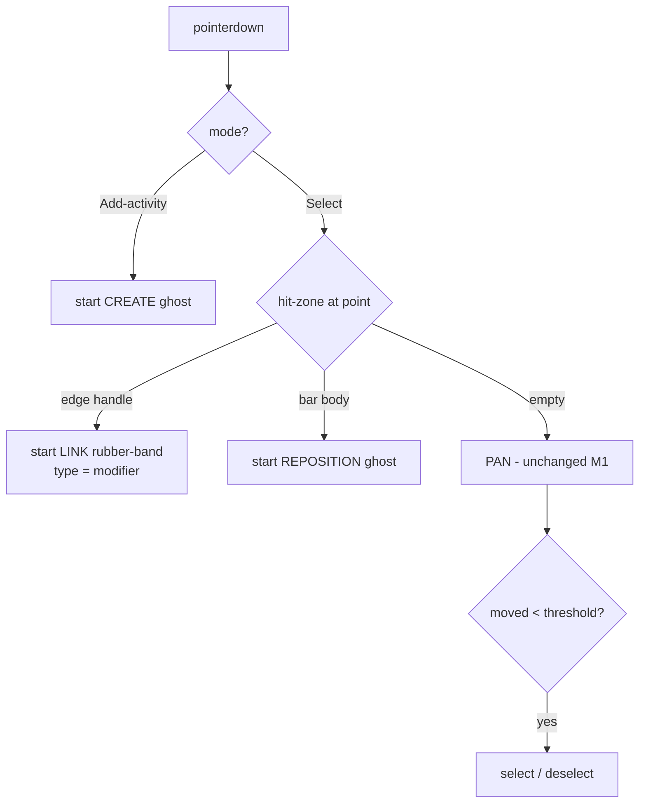

# TSLD Milestone 2 — on-canvas structural editing: interaction model & frontend design

- **Status:** Draft for approval (the "design before non-trivial UI" gate, CLAUDE.md §20)
- **Author:** ui-architect
- **Scope:** M2 of the TSLD canvas plan — create-by-drag (2.1), reposition-in-time as a
  constraint edit (2.2), dependency-draw with modifier keys (2.3). Behind a feature flag,
  OFF by default.
- **Governing decisions:** ADR-0026 (canvas rendering/coordinate/state/interaction/a11y),
  ADR-0021 (DAG invariant), ADR-0022 (synchronous recalc + plan lock), ADR-0023 (date
  convention), ADR-0024 (working-day calendars, server-only). Feature spec:
  `docs/specs/tsld-canvas.md` (US-4/5/6, W-2/3/5). Plan: `docs/plans/tsld-canvas.md` §M2.
- **Not in scope:** lane-drag persistence + auto-pack (M4 — needs the batch endpoint),
  driving arrows (M3 — needs the engine flag), the full native in-canvas keymap (M5).

This is a design + interaction spec. **No application code is written here.** It records
the concrete architecture the implementer builds against and flags the decisions that need
your input before 2.1 starts.

---

## 0. Where M1 leaves us (the surface we extend)

- `apps/web/src/features/tsld/components/TsldCanvas.tsx` is a **single** `<canvas>` with an
  imperative rAF loop (`viewRef`/`sizeRef`/`dirtyRef`/`fittedRef`/`sceneRef`), native
  non-passive wheel-zoom, and a pointer handler that does **pan + click-to-select** with a
  4 px drag threshold (`CLICK_MOVE_THRESHOLD_PX`, line 17; handlers lines 170-190).
- `TsldPanel.tsx` composes the canvas + the parallel `role="listbox"` a11y representation
  and owns `selectedId` + `fitSignal` (lines 91-92). It takes only
  `activities / dependencies / dataDate` (lines 76-81) — **no** org/plan/role yet.
- The pure geometry lives in `render/render-model.ts`: `activityRect`, `hitTest`,
  `dayAtScreenX`/`laneAtScreenY` (the inverse transforms editing needs already exist, lines
  112-119), `dependencyPolyline`, `cull`.
- ADR-0026 Decision 1 already specifies **two stacked canvases** (base + interaction); M1
  shipped only the base. **M2 adds the interaction layer — this implements the ADR, it is
  not a deviation.**

---

## 1. Editing modes & gesture routing

### The core conflict

Only **one** editing gesture genuinely competes with read-only pan: **create-by-drag**,
because it is "pointer-down on empty canvas and drag" — exactly the pan gesture. Reposition
(pointer-down on a **bar body**) and dependency-draw (pointer-down on an **edge handle**)
are unambiguous by hit-zone and need no mode. So we introduce the smallest possible mode
surface: **one explicit tool toggle for create**, everything else is hit-zone routed inside
the default Select mode. This preserves M1 pan/zoom untouched.

### Two modes (local component state, per ADR-0026 D3)

- **Select (default).** Behaves exactly like M1 for empty-canvas drag (pan) and click
  (select). Adds hit-zone routing on pointer-down:
  - empty canvas → **pan** (unchanged)
  - bar/milestone body → **reposition-in-time** gesture
  - start/finish **edge handle** (a small hit rect at each bar end) → **dependency-draw**
  - click without passing the drag threshold → **select** (unchanged)
- **Add-activity (explicit toggle in a toolbar).** Empty-canvas drag → **create ghost**.
  While in this mode, panning is via space-drag or the wheel/trackpad (zoom stays on wheel);
  the mode is sticky until toggled off or `Esc`. This is the standard drawing-tool pattern
  and keeps "drag empty canvas" unambiguous.

The mode lives in `useState` in `TsldPanel` (ADR-0026 D3 "Toolbar mode" is named local
state) and is passed to the canvas. When editing is disabled (§4) the toolbar and all
edit routing are absent and the canvas is byte-for-byte the M1 read-only surface.

### Gesture routing (pointer-down classifier)



Hit-zone classification is a new pure helper in `render-model.ts` (e.g.
`classifyHit(activities, point, view, dataDate) -> { kind: 'empty' | 'body' | 'startHandle'
| 'finishHandle', id? }`) built from the existing `activityRect` + small end-cap rects. It
reuses the M1 spatial logic; hit-testing and painting keep sharing one transform so they
cannot disagree (ADR-0026 D2/D5).

**Decision (mine, non-blocking): one create-mode toggle + hit-zone routing for the rest.**
Rationale: minimal mode surface, zero regression to pan/zoom, discoverable affordances
(edge handles appear on hover), and it matches ADR-0026 D3/D5 verbatim. Alternative — a
full 3-tool palette (select/create/link) — is more discoverable but heavier and makes
reposition/link modal for no benefit, so rejected.

---

## 2. Controller architecture

### Module layout (fills in ADR-0026 D8's `interaction/`)

```text
features/tsld/
├── components/
│   ├── TsldCanvas.tsx        # + interaction <canvas>, wires controllers, emits intents
│   ├── TsldToolbar.tsx       # NEW: mode toggle (Select / Add activity), Fit button moves here
│   └── EditConflictBanner.tsx# NEW: non-destructive 409 surface
├── interaction/              # NEW
│   ├── gesture-machine.ts    # pure reducer: events + mode + modifiers -> GestureState + intent
│   ├── create-controller.ts  # geometry for the create ghost + intent builder
│   ├── reposition-controller.ts
│   ├── link-controller.ts    # modifier -> DependencyType, rubber-band geometry, intent builder
│   └── hit-zones.ts          # edge-handle rects (or fold into render-model)
├── render/
│   ├── paint.ts              # + paintInteractionLayer(ghosts, rubberBand, pendingGhost)
│   └── render-model.ts       # + classifyHit, ghost geometry helpers (all pure)
```

`features/tsld` still imports **only** shared layers + `@repo/types` (ADR-0026 D8,
ADR-0004). It never imports the activities/dependencies/schedule features.

### State ownership (holds ADR-0026 D3 exactly)

| State                                                                                       | Home                                      | Why                                                                   |
| ------------------------------------------------------------------------------------------- | ----------------------------------------- | --------------------------------------------------------------------- |
| **Live gesture** (in-flight ghost rect, rubber-band endpoint, drag origin, active modifier) | mutable `gestureRef` driving the rAF loop | per-frame; `setState` here would blow the 45 fps budget (ADR-0026 D3) |
| **Committed pending edit** (the dropped ghost awaiting server truth) + `mode` + conflict    | `useState` in `TsldPanel`                 | discrete, not per-frame; the right home for post-commit UI            |
| **Server truth** (activities/deps/dates)                                                    | TanStack Query via the existing hooks     | canvas never fetches (ADR-0026 D3)                                    |
| **Committed viewport / selection**                                                          | URL search params (unchanged M1)          | shareable, reload-safe                                                |

### The imperative wiring

- **Gesture machine is pure.** `gesture-machine.ts` is a reducer:
  `reduce(state, event, ctx) -> { state, intent? }` where `event` ∈ {pointerDown, pointerMove,
  pointerUp, keyEscape, modifierChange} and `ctx` carries mode + the transform + hit result.
  It is exhaustively unit-testable with no canvas/DOM — the same "pure core, imperative shell"
  split M1 used for `render-model`.
- **The shell drives it.** `TsldCanvas` pointer handlers feed events into the machine, write
  the resulting transient geometry into `gestureRef`, and set `interactionDirty`. The rAF
  loop paints `gestureRef`'s ghost/rubber-band on the **interaction canvas** each frame and
  clears it to nothing when the machine returns to `idle` (ADR-0026 D1/D4: base layer is not
  re-rasterised during a gesture).
- **Commit emits an intent, never a mutation.** On `pointerUp` the machine yields a
  discriminated-union `EditIntent`:
  - `{ kind: 'create', startDay, endDay, laneIndex }`
  - `{ kind: 'reposition', activityId, version, startDay }`
  - `{ kind: 'link', predecessorId, successorId, type }`
    `TsldCanvas` calls a single `onIntent(intent)` prop. **`TsldPanel` owns the mutation +
    recalc** (it is the composition point that has `orgSlug`/`planId`/the hooks), keeping the
    canvas a pure presentation-plus-interaction unit (ADR-0026 D8 "route composes; canvas is
    parameterised", the `plan-detail.tsx` precedent).
- **Esc-cancel.** While the machine is non-idle, a `keydown` listener (added on gesture
  start, removed on end) sends `keyEscape`, which resets the machine to `idle`, clears
  `gestureRef`, sets `interactionDirty`, and emits **no** intent. Releasing outside the
  canvas bounds does the same (US-4 line 116).

### Props `TsldPanel` gains (threaded from `plan-detail.tsx`)

`plan-detail.tsx` already computes `canWrite = canManageHierarchy(role)` (line 35) and holds
`orgSlug`/`planId`. It passes `orgSlug`, `planId`, and `canEdit={canWrite}` into `TsldPanel`
(new props). `TsldPanel` combines that with the flag (§4) and instantiates
`useCreateActivity` / `useUpdateActivity` / `useCreateDependency` / `useRecalculate`.

---

## 3. Optimistic → authoritative reconcile

### Lifecycle

```mermaid
sequenceDiagram
  participant U as Planner
  participant G as gestureRef + interaction canvas
  participant P as TsldPanel (owns pending state + mutations)
  participant A as API (mutation, then recalc)
  participant Q as TanStack Query

  U->>G: drag (create / move / link)
  G-->>U: live ghost, geometry only (<16ms, well under 100ms)
  U->>G: drop
  G->>P: onIntent(EditIntent)
  Note over P: pendingEdit = { ghost, status:'saving' }<br/>gestureRef cleared; ghost now painted from pendingEdit
  P->>A: mutate (POST/PATCH)  --> then POST schedule/recalculate
  A-->>Q: invalidate activities + summary (+ deps)
  Q-->>P: fresh engine dates
  Note over P: base layer repaints authoritative;<br/>pendingEdit cleared (ghost removed)
```

- **<100 ms feedback is met by construction:** the ghost renders in the same rAF frame as
  the pointer move — no network on the feedback path (ADR-0026 D6).
- **During the round-trip:** ownership of the ghost transfers from `gestureRef` (live) to
  `pendingEdit` (React state). The canvas keeps drawing the dropped ghost in a **pending
  style** (reduced opacity + a small "saving…" affordance in the toolbar/announcer) so the
  bar/link doesn't visibly vanish-then-reappear. The base layer still shows old truth
  underneath until Query refetches; when the authoritative dates arrive the base repaints and
  `pendingEdit` clears. Recalc is budgeted `<500 ms @ 500` (ADR-0022) — inside a tolerable
  settle.
- **Sequencing:** mutation **then** recalc (two server calls). `TsldPanel` does
  `await create/updateMutateAsync(...)` then `await recalcMutateAsync()`. The existing
  `useRecalculate` already invalidates activities + summary + baseline variance on success
  (`use-schedule.ts` lines 51-56); the create/update hooks invalidate the activity list too.
- **No client CPM, not even for dates** (ADR-0026 D6): the ghost moves pixels; the engine
  owns the re-flow.

### 409 rollback (the interim concurrency posture)

There is no plan edit-lock yet, so every write races on the optimistic-locking `version`.
`apiFetch` throws `ApiFetchError` with `.status` (`lib/api/client.ts` lines 10-18, 55-60),
so `TsldPanel` branches on `err.status === 409`:

| Gesture                   | 409 cause                              | Rollback behaviour                                                                                                                                                                                                                                                    |
| ------------------------- | -------------------------------------- | --------------------------------------------------------------------------------------------------------------------------------------------------------------------------------------------------------------------------------------------------------------------- |
| Reposition (PATCH)        | stale `version` (someone else edited)  | discard `pendingEdit` ghost; show `EditConflictBanner` ("This plan changed since you opened it — your move wasn't applied. Refresh to see the latest."); invalidate the activity list so the base repaints to current truth. **Never** re-send with a bumped version. |
| Link (POST /dependencies) | cycle or duplicate (ADR-0021)          | discard the optimistic arrow; inline message from `err.error.message` ("That link would create a cycle" / "That link already exists").                                                                                                                                |
| Create (POST) then recalc | recalc 409 = plan lock held (ADR-0022) | keep the created row (it persisted), surface a "recalculating elsewhere — try again" banner; the next recalc reconciles.                                                                                                                                              |

The banner is **non-destructive**: it never discards the user's other work and never
silently overwrites. The version for a reposition is read **live** from the Query cache at
intent time (the `byId` pattern already used in `DependencyEditor.tsx` lines 146-151), so a
retry after refresh carries the fresh version.

**Working-day snap caveat (must flag).** ADR-0024/0026 keep calendars **server-side**; the
canvas has no calendar. So the ghost snaps only to **whole calendar-day columns** (integer
`dayAtScreenX`), and the **server** maps the constraint to the working-day calendar. If the
dropped day is a non-working day, the authoritative bar may land a day or two off the ghost
after recalc. This is honest (the engine owns the calendar) but the ghost cannot claim
working-day snapping the spec's W-3 wording implies. See Open Question 4.

---

## 4. Flag + gating

### Flag shape in `config/env.ts`

`config/env.ts` holds no `VITE_` flags yet, so establish the sanctioned pattern:

```ts
/** Reads a boolean VITE_ flag ("true"/"1" → true), defaulting off. */
function flag(value: string | undefined): boolean {
  return value === 'true' || value === '1';
}

/**
 * On-canvas TSLD structural editing (M2). OFF by default; there is no plan edit-lock
 * yet, so this stays flagged until concurrency is hardened (interim: version-409 banner).
 */
export const TSLD_EDITING_ENABLED = flag(import.meta.env.VITE_TSLD_EDITING);
```

Add `VITE_TSLD_EDITING=` to `.env.example` with a one-line comment. Access is only ever
through this module (never `import.meta.env` elsewhere) — the rule this file's header states.

### Reading role + flag

- `plan-detail.tsx` passes `canEdit={canWrite}` (role: Planner/Org Admin, line 35) into
  `TsldPanel`, mirroring how it already threads `canWrite` into `PlanCalendarPicker`/
  `BaselinesPanel`.
- `TsldPanel` computes `const editingEnabled = canEdit && TSLD_EDITING_ENABLED;`. The flag is
  a feature-local build concern (belongs in the feature); the role is the route's concern
  (already computed there) — this split matches the existing pattern and keeps the gate in
  one obvious place.
- **Read-only fallback:** when `editingEnabled` is false, `TsldPanel` renders **exactly
  today's M1 surface** — no toolbar mode toggle, no edit pointer handlers, no interaction
  layer wiring active. The safest possible default: OFF = zero behaviour change. Server-side
  RBAC still enforces every write (the flag/role gate is UX, not trust — `use-org-role.ts`
  header).

---

## 5. Accessibility equivalents (so M5 hardens, not retrofits)

**Compliance argument for M2:** every capability M2 exposes on the canvas is _already_
keyboard-operable through an existing, tested dialog. M2 adds pointer gestures as an
_alternative_ input to capabilities that keep their keyboard path — it introduces **no new
pointer-only capability** (the WCAG 2.1.1 line the plan draws for M2, deferring the richer
native keymap to M5).

| Canvas gesture                  | Existing keyboard-operable equivalent (available in M2)                                           | M5 upgrade                                                                                                  |
| ------------------------------- | ------------------------------------------------------------------------------------------------- | ----------------------------------------------------------------------------------------------------------- |
| Create-by-drag                  | `CreateActivityButton` → `ActivityFormDialog` (RHF+Zod, full keyboard)                            | in-canvas `Insert`/"n" opens the same dialog pre-filled with the focused lane; later, native duration nudge |
| Reposition-in-time (constraint) | Activity edit form's `constraintType`/`constraintDate` fields (`activity-schemas.ts` lines 71-81) | focus activity → `Alt+←/→` nudges the SNET date by one day, announced via `useAnnounce`                     |
| Create dependency               | `AddDependencyDialog` (`AddDependencyDialog.tsx` line 32; keyboard, cycle/dup inline)             | select predecessor → `L` → arrow to successor → `Enter` → type chooser (FS/SS/FF/SF)                        |
| Re-lane (vertical)              | deferred to **M4** (needs the batch endpoint); table/inspector remains the path                   | `Alt+↑/↓` changes `laneIndex`                                                                               |

Concretely for M2, the parallel `listbox` in `TsldPanel` (lines 186-208) gains, alongside its
existing arrow navigation (`onListKeyDown`, lines 106-118): `Enter` on a focused activity to
open its edit dialog, an "add activity" command, and an "add link from here" command — each
routing into the existing dialogs. Every edit outcome is announced through the existing
shared `useAnnounce()` polite region (no new mechanism, ADR-0026 D7). The `ActivitiesTable`
remains the fuller conforming alternative.

**Design rule for the implementer:** an edit capability may not ship to the canvas in a
sub-slice unless its keyboard equivalent above is wired in the _same_ PR. This keeps 2.1/2.2/
2.3 individually WCAG-clean and leaves M5 to _upgrade_ the ergonomics (native in-canvas
manipulation + live-region richness), not to _retrofit_ missing paths.

---

## 6. Task slicing

Confirmed order **2.1 → 2.2 → 2.3**, refined into independently reviewable/testable slices.
Each is behind `TSLD_EDITING_ENABLED` and keeps `main` releasable (OFF = M1).

**Slice 2.0 — editing foundation (prerequisite; ships dark behind the flag).**
Interaction `<canvas>` layer + `paintInteractionLayer`; the pure `gesture-machine` + mode
model + `TsldToolbar` (Select / Add-activity); `TSLD_EDITING_ENABLED` in `config/env.ts` +
`.env.example`; `EditConflictBanner`; `TsldPanel` prop additions + read-only fallback; the
`pendingEdit` reconcile scaffold. _Needs:_ unit tests for the gesture machine + `classifyHit`;
component test that the flag OFF renders the untouched M1 surface (no regression). No user
capability yet — reviewable as pure scaffolding.

**Slice 2.1 — create-by-drag.** `create-controller` + ghost geometry; drop → name-capture
popover (see OQ1) → `useCreateActivity` → `useRecalculate` → reconcile; sub-day rule (OQ2);
Esc/out-of-bounds cancel; keyboard equivalent (create dialog from the listbox). _Needs:_
component tests with simulated pointer events (jsdom pointer sequence, as `TsldPanel.test.tsx`
already simulates keyboard); **reuse** existing `POST /activities` API e2e (no new endpoint);
Playwright create-journey behind the flag; perf assertion that ghost paint is on the
interaction layer (base not dirtied mid-drag).

**Slice 2.2 — reposition-in-time (constraint edit).** `reposition-controller`; body-drag ghost
snapped to calendar-day columns; drop → map to `constraintType='SNET'` + `constraintDate` via
`useUpdateActivity` (carries live `version`) → recalc → reconcile; clamp/infeasible surfaced
(ADR-0023); `Alt+←/→` keyboard nudge. _Needs:_ component tests (drag maps to the right PATCH
body incl. version); **reuse** existing `PATCH /activities/:id` e2e + a **version-409** e2e
proving the banner path; Playwright move-journey.

**Slice 2.3 — dependency-draw.** `link-controller`; edge-handle hit-zones + hover affordance;
modifier → type (default FS, Shift=SS, Alt=FF; SF via the existing `AddDependencyDialog`/
`DependencyEditor` opened pre-filled — ADR-0026 D5); rubber-band preview; drop → `POST
/dependencies` → recalc → reconcile arrows; **rollback on cycle/duplicate 409**; keyboard link
command. _Needs:_ component tests per modifier; **reuse** the existing cycle-409 / duplicate-409
dependency e2e; Playwright link-journey. **Recommend deferring** drop-on-empty-creates-a-new-
successor (Journey 1) out of 2.3 — it compounds create+link+two recalcs; land plain
activity-to-activity linking first (OQ5).

**Reviews per M2 slice** (from the plan §M2): ui-architect (interaction model), ux-reviewer
(gesture discoverability, modifier affordances, pending/conflict copy), accessibility-reviewer
(no pointer-only capability), component-reviewer (no one-off styling; tokens/CVA),
security-reviewer (writes stay org/plan-scoped, IDOR), api-reviewer + backend-performance-
reviewer (reused contracts, recalc cadence), test-engineer.

---

## 7. ADR check

**M2 needs no new ADR and no amendment to ADR-0026.** Everything M2 does is already decided:

- Create/move/link interaction + edge-handle hit-testing + modifier-key type selection —
  ADR-0026 **D5**.
- Optimistic geometry-only preview → authoritative recalc, no client CPM — ADR-0026 **D6**.
- Two-layer canvas, gesture state in a ref, mode in local state — ADR-0026 **D1/D3/D4**.
- Intents via callback props, no feature-to-feature imports — ADR-0026 **D8**.
- A parallel keyboard path over an `aria-hidden` canvas — ADR-0026 **D7**.
- **What a horizontal drag _means_** (the one thing ADR-0026 D6 explicitly deferred) is
  resolved by the **Feature Spec**, not an ADR: horizontal move = an imposed **SNET**
  constraint at the dropped start (`docs/specs/tsld-canvas.md` US-5 line 120, W-3 line 147).

Two things are worth a **lightweight `docs/DECISIONS.md` entry** (not ADR-level — both are
local, reversible, and already anticipated by the plan/spec):

1. **Gesture-routing policy** — one explicit Add-activity mode + hit-zone routing for
   reposition/link inside Select (this doc §1).
2. **Interim concurrency posture** — no edit-lock yet, so gate on version-409 + a
   non-destructive conflict banner (this doc §3; plan risk row "Editing ships before the
   plan edit-lock exists").

**What _would_ require an ADR (and we are deliberately not doing in M2):** a client-side
_forecast_ preview of dates during drag, or treating horizontal drag as a start-pin/what-if
rather than a constraint — ADR-0026 D6 reserves the forecast for its own future ADR. If a
usability finding later pushes us there, that is a new ADR, not an M2 change.

---

## Open questions needing your input

1. **[BLOCKING for 2.1] Nameless create.** `activityFormSchema` requires `name` (≥1 char,
   `activity-schemas.ts` line 61) but a drag produces no name. Options: (a) create immediately
   with a default "New activity" then focus an inline rename — fastest, but persists a junk row
   if the user meant to abort; (b) drop opens a small inline name popover anchored at the ghost,
   `Enter` commits `POST`+recalc, `Esc` cancels with no persistence — no junk rows, reuses
   validation, still <100 ms optimistic ghost. **I recommend (b).** Confirm.
2. **[BLOCKING for 2.1] Sub-day drag.** US-4 (line 115) allows either a milestone or a min
   1-day activity. **I recommend default = 1-day `TASK`** (least surprising); milestones are
   created by switching type in the inspector. Confirm, or specify a milestone modifier.
3. **[Confirm] Reposition constraint type.** Spec says default **SNET** (line 120). SNET is the
   soft choice (logic can still push later); MSO would pin hard. I will implement **SNET**
   unless you prefer MSO.
4. **[Confirm] Working-day snap honesty.** The ghost snaps to calendar-day columns; the server
   applies the working-day calendar, so the bar may settle a day or two off the ghost after
   recalc on a non-working drop day (§3 caveat; ADR-0024 keeps calendars server-side).
   Acceptable? (The alternative — shipping a client calendar — contradicts ADR-0024/0026.)
5. **[Scope trim suggestion] Drop-on-empty link → new successor (Journey 1).** Compounds
   create+link+two recalcs. I recommend deferring it out of 2.3 (plain activity-to-activity
   links first) to a later slice. Agree?

## Blocking vs. suggested — summary

- **Blocking (need answers before building 2.1):** OQ1 (nameless create), OQ2 (sub-day rule).
- **Confirmations (defaults stated, will proceed unless you object):** OQ3 (SNET), OQ4
  (calendar-day ghost), OQ5 (defer drop-on-empty).
- **Design decisions I have made (non-blocking, documented above):** one create-mode +
  hit-zone routing (§1); interaction layer as the second canvas (§0/§2); intents-via-callback
  with mutations owned by `TsldPanel` (§2); `VITE_TSLD_EDITING`/`TSLD_EDITING_ENABLED` shape
  and the `editingEnabled = canEdit && flag` gate (§4); no new ADR, two DECISIONS.md notes (§7).
