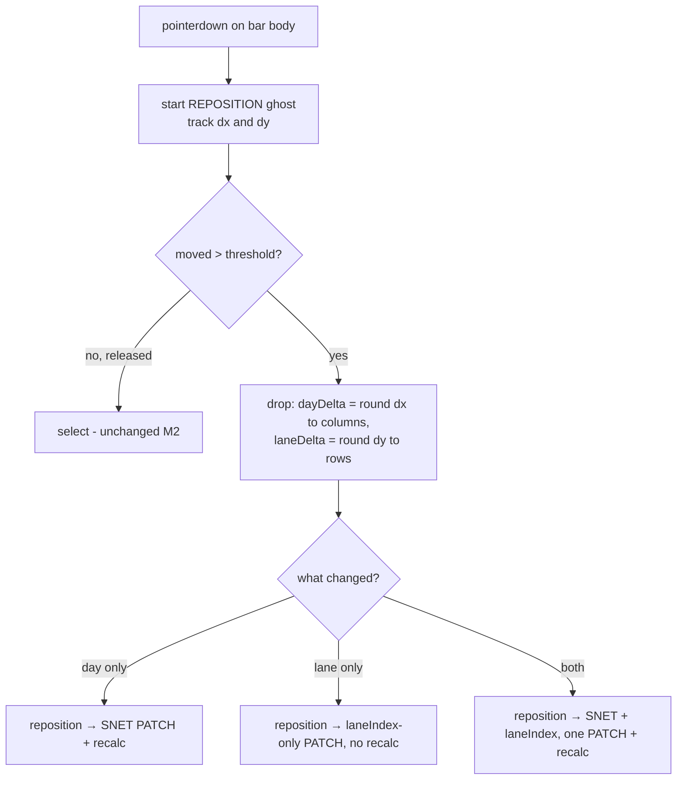

# TSLD Milestone 4 — layout persistence & auto-pack: interaction model & frontend design

- **Status:** Draft for approval (the "design before non-trivial UI" gate, CLAUDE.md §20).
  **Revised** after the OQ1 decision: **free 2D drag** was chosen over dominant-axis lock (see §1/§8).
- **Author:** ui-architect
- **Scope:** M4 of the TSLD canvas plan. A single body drag now moves a bar **freely in both axes at
  once** — dx → a new start day (an **SNET** constraint, **recalcs**) **and** dy → a new `laneIndex`
  (**no recalc**) — committed as **one atomic versioned write** on the existing single-activity
  PATCH. An explicit **"Auto-arrange lanes"** action re-flows lanes with a deterministic greedy
  packer and persists through the **batch positions endpoint** (already built — §0). Behind
  `VITE_TSLD_EDITING`, OFF by default — same gate as M2; the read-only surface is unchanged.
- **Governing decisions:** ADR-0026 (canvas rendering/coordinate/state/interaction/a11y — esp.
  **D5** "Lane drag + optional auto-pack" and **D6** "Layout vs schedule"), ADR-0022 (synchronous
  recalc + plan lock; its engine-owned batched write is a deliberate **contrast** — §4/§8), ADR-0023
  (date convention). Plan: `docs/plans/tsld-canvas.md` §M4. Prior art: `docs/design/tsld-m2-editing.md`.
- **Not in scope:** multi-select group drag (deferred — §2), undo of auto-pack (not built; the
  confirm dialog is the mitigation — §5), driving-arrow styling (M3), the full native in-canvas
  keymap and screen-reader hardening (M5).

This is a design + interaction spec. **No application code is written here.** Type sketches below
are illustrative (as in the M2 doc), not files.

---

## 0. Where we stand (the surface we extend, and what already exists)

- **The gesture machine already owns a horizontal body drag.** `interaction/gesture-machine.ts`
  `repositioning` tracks **only** x (`grabX`, `movedPastThreshold`, `grabDay`, `currentStartDay`,
  `spanDays`; `laneIndex` carried but never changed). Past the pixel threshold it emits
  `{ kind: 'reposition', activityId, startDay }`, which the route maps to an **SNET** PATCH +
  **recalc** (`plan-detail.tsx` `onTsldReposition`, lines 116-161). M4 makes this drag **2D** by
  also tracking dy → `laneIndex`, and extends the **same** `reposition` intent — it does **not** add
  a separate `relane` intent (that was the axis-lock design; superseded).
- **Task 4.1's batch endpoint is already built.** `PATCH /organizations/:orgSlug/plans/:planId/
activities/positions` exists (`plan-activities.controller.ts` `@Patch('positions')`,
  `UpdatePositionsDto` = `{ positions: { id, laneIndex, version }[] }`, ≤ 2000 rows, single
  all-or-nothing transaction, per-row optimistic lock, **no recalc**). **M4's frontend work is
  therefore 4.2 (single-bar free-2D drag) + 4.3 (auto-pack).** The batch endpoint is the **auto-pack
  path** and the **future multi-drag path** — **not** the single-bar path (§4).
- **The single-activity PATCH already accepts everything a free-2D drop needs, together.**
  `PATCH /organizations/:orgSlug/activities/:activityId` (`UpdateActivityDto`) accepts
  `constraintType` + `constraintDate` (the SNET) **and** `laneIndex` **and** `version` in one body,
  all optional-send-only-what-changed (`update-activity.dto.ts` lines 67-93). So a single-bar drop
  that changes both time and lane is **one atomic versioned PATCH** — no batch call, no
  two-write ordering, no atomicity problem (§4). **Frontend caveat:** the web `updateBody` /
  `ActivityFormValues` do **not** currently thread `laneIndex` (`use-activities.ts` line 42;
  `activity-schemas.ts`), so 4.2 must add an optional `laneIndex` passthrough on the update path —
  a small, contained change (§3/§4).
- **The intent → mutation seam is settled.** `TsldCanvas` emits `EditIntent` via `onIntent`;
  `TsldPanel` owns pending state, the conflict banner (`EditConflictBanner`) and version-409
  branching; the **route** owns the mutation + recalc and reads the live `version` from the Query
  cache at intent time. M4 threads the _extended_ `reposition` intent through this exact seam.
- **The pending-ghost mechanism already draws a bar at an arbitrary lane.** `PendingGhost`
  (`{ startDay, endDay, laneIndex }`) is painted via `dayCellRect(...)`. A 2D move is the same ghost
  at a new day **and** lane — reused verbatim (§4).
- **The inverse transforms exist.** `render-model.ts` has `laneAtScreenY`, `laneRowAt` (clamps
  `≥ 0`), `dayColumnAt`, `dayCellRect`, `activityRect`; `LANE_HEIGHT` is fixed, so a lane delta is
  `round(dy / LANE_HEIGHT)` and a day delta is the existing `dayColumnAt` difference.
- **`editingEnabled` gating is unchanged** (`showDiagram && canEdit && TSLD_EDITING_ENABLED &&
onCreate`). M4 adds no new flag and no new role check; OFF = today's read-only M1 diagram.

---

## 1. The disambiguation decision: **free 2D drag** (OQ1 — chosen by the user)

### The decision

A press on a **bar body** that travels past `REPOSITION_THRESHOLD_PX` moves the bar **freely on both
axes simultaneously**: the ghost follows the cursor, its start snapping to **day columns** (x) and
its lane snapping to **lane rows** (y). On drop, both changes commit in **one** write. A press with
no travel is still a **select** (unchanged from M2).

This supersedes the dominant-axis-lock proposal in the prior draft. Direct 2D manipulation is the
most literal "drag it where you want it" model; the user chose it explicitly (§8, DECISIONS note 1).

### The two-write concern — resolved by the single-activity endpoint, not by axis-lock

The earlier draft avoided free-2D because time (SNET + recalc) and lane (no recalc) are different
domains with different persistence — two writes from one gesture. **For a single activity — which is
M4's entire scope (multi-select stays deferred, §2) — that concern dissolves:** the existing
`PATCH /organizations/:orgSlug/activities/:activityId` accepts the SNET fields **and** `laneIndex`
**and** the `version` in **one atomic, optimistically-locked body**. So a free-2D single-bar drop is
**one PATCH, one version check, one conflict story** — then the existing post-reposition recalc. No
ordering, no atomicity gap, no batch call.

### Per-axis snapping absorbs jitter (no accidental re-lane)

Because dy is rounded to whole lanes (`round(dy / LANE_HEIGHT)`), a mostly-horizontal drag whose
vertical wander stays within **half a lane** yields a lane delta of **0** — it is a pure time move,
exactly like M2. Symmetrically, sub-half-day horizontal wander yields a day delta of 0. The rounding
gives a free half-cell dead-zone on each axis, so free-2D does **not** cause accidental re-lanes on
an intended time move (and vice versa). This is the mitigation for the main free-2D risk, and it
needs no extra threshold machinery.

### Gesture routing (extends the M2 classifier)



Edge-handle (link) and empty-canvas (create/pan) routing are untouched from M2.

---

## 2. Single vs multi-activity drag — **multi-select still deferred**

The codebase has a single-selection model (`selectedId: string | null`). True multi-drag needs a
whole selection subsystem (marquee/shift-click, multi-`aria-selected` listbox, group-drag geometry
and group-conflict semantics) — none of which exist, and none of which free-2D changes.

**M4 ships single-activity free-2D drag; multi-select drag is deferred.** The bulk-tidy payoff comes
from **auto-pack** (§5), which moves many bars at once through the **batch endpoint**. Deferring
keeps M4 tight, and multi-drag lands later as an _additive_ controller feeding the **already-built
batch endpoint** (its natural N-row home) — no contract change. This is also _why_ the single-bar
path uses the single-activity PATCH and the batch path is reserved for auto-pack + future multi-drag
(§4): single-bar gets one atomic write; the batch endpoint's all-or-nothing semantics are exactly
what a multi-row operation wants.

---

## 3. Gesture-machine & intent changes (all in the pure core)

### The extended intent (no new `relane` intent)

```ts
// interaction/gesture-machine.ts — the reposition intent gains an optional lane change
| {
    kind: 'reposition';
    activityId: string;
    /** New early-start day (SNET at the dropped column). Omitted/undefined ⇒ time unchanged. */
    startDay?: number;
    /** New lane (whole, ≥ 0). Omitted/undefined ⇒ lane unchanged. */
    laneIndex?: number;
  }
```

The machine reports **only what actually changed** (each field present iff its axis moved a whole
cell). This is what lets the route pick the minimal write + the correct recalc decision (§4). The
`link` and `create` intents are unchanged.

### The `repositioning` state extension

`repositioning` gains the y-axis twins of its x fields (no axis field — both move together):

```ts
kind: 'repositioning';
// … existing x fields (grabDay, grabX, originStartDay, spanDays, currentStartDay) …
grabY: number; // screen y at grab — for the lane delta
originLaneIndex: number; // lane at grab
currentLaneIndex: number; // lane under the pointer (round(dy / LANE_HEIGHT), clamped ≥ 0)
```

Reducer changes (pure, exhaustively unit-testable, as today):

- **`pointerMove`:** update `currentStartDay` from `dayColumnAt` (as today) **and**
  `currentLaneIndex = max(0, originLaneIndex + round((y − grabY) / LANE_HEIGHT))`. The
  `movedPastThreshold` guard now trips on **either** axis (`max(|dx|,|dy|) > threshold`).
- **`pointerUp`:** unchanged select guard (never moved, or ended on the _same_ day **and** lane).
  Otherwise emit **one** `reposition` intent, populating `startDay` iff
  `currentStartDay !== originStartDay` and `laneIndex` iff `currentLaneIndex !== originLaneIndex`.

### Shell + paint changes (imperative shell, minimal)

- `TsldCanvas.liveGhostRect` uses `state.currentStartDay` **and** `state.currentLaneIndex`, so the
  ghost tracks both axes during the drag. The `BodyGrab` already carries `laneIndex`; the machine now
  also records `grabY`.
- `TsldPanel.onIntent`'s existing `reposition` branch extends: build the optimistic `PendingGhost` at
  the new day **and** lane, call the route's `onReposition` with both optional fields, clear on
  settle, surface `conflict` on refusal, announce the move (mention the new lane when it changed).

### Threading `laneIndex` to the write (the one real plumbing task)

The route's `onTsldReposition` calls `useUpdateActivity`, whose `updateBody` (`use-activities.ts`
line 42) is built from `ActivityFormValues` and **omits `laneIndex`**. 4.2 adds an **optional
`laneIndex` passthrough** to the update input + `updateBody` (the backend `UpdateActivityDto` already
accepts it), so the same hook carries the lane change. No new hook, no new endpoint for the
single-bar path.

---

## 4. Persistence & conflict surfacing

### The single-bar write matrix (4.2) — all on `PATCH …/activities/:activityId`

The route reads the activity's live `version` from the Query cache (today's pattern) and issues the
**minimal** body for what changed:

| dx (day)  | dy (lane) | PATCH body                                                            | recalc?                      |
| --------- | --------- | --------------------------------------------------------------------- | ---------------------------- |
| changed   | unchanged | `{ constraintType:'SNET', constraintDate, version, …def }`            | **yes** (M2 path, unchanged) |
| unchanged | changed   | `{ laneIndex, version }`                                              | **no**                       |
| changed   | changed   | `{ constraintType:'SNET', constraintDate, laneIndex, version, …def }` | **yes**                      |
| unchanged | unchanged | — (select; no write)                                                  | —                            |

- **Only-what-changed (OQ recommendation, per the coordinator's lean):** a lane-only drop
  (`dx` rounds to 0) sends just `{ laneIndex, version }` and **skips recalc** — a lane is layout,
  not schedule (ADR-0026 D6). A time-only drop is the plain M2 SNET write + recalc. A both-axes drop
  is **one** PATCH with both + recalc. (The current `onTsldReposition` resends the definition fields
  defensively; since `UpdateActivityDto` is send-only-what-changed, a lane-only write can be the
  minimal `{ laneIndex, version }`.)
- **Invalidation:** the SNET recalc path invalidates activities + summary + variance (via
  `useRecalculate`, unchanged). A **lane-only** write invalidates **only** the activities list — no
  recalc, no summary/variance (dates/criticality/variance don't move), so it is markedly cheaper.
- **Overwrite semantics unchanged:** a horizontal move imposes SNET-at-new-start, overwriting any
  prior constraint on that activity — exactly as M2 already does; adding `laneIndex` to the same body
  doesn't change that.

### Conflict surfacing — one story, reused from M2

Because the single-bar drop is **one versioned PATCH**, its 409 story is **identical to M2's
reposition**: a stale `version` means the whole move (time and/or lane) was **not** applied →
discard the `PendingGhost`, show `EditConflictBanner` ("This plan changed since you opened it — your
move wasn't applied. Refresh to see the latest."), invalidate so the base repaints to truth, never
re-send with a bumped version. No new conflict path for the single-bar case.

### The batch endpoint — the auto-pack (and future multi-drag) path only

Auto-pack (§5) writes **N** rows through the already-built `PATCH …/plans/:planId/activities/
positions`, which is **all-or-nothing**: a 409 means **at least one** row was stale, so **nothing**
was applied. Its copy must say so — distinct from the single-bar wording:

| Case                          | Rows                      | On 409                                     | Banner copy                                                                                    |
| ----------------------------- | ------------------------- | ------------------------------------------ | ---------------------------------------------------------------------------------------------- |
| Single-bar free-2D drag (4.2) | 1 (single-activity PATCH) | that row stale → nothing applied           | "This plan changed since you opened it — your move wasn't applied. Refresh…" (M2 copy)         |
| Auto-arrange (4.3, batch)     | N                         | **any** row stale → **whole** pack refused | "The plan changed since you opened it, so auto-arrange wasn't applied. Refresh and try again." |

Both reuse `EditConflictBanner` + `onRefresh`; both are non-destructive; neither re-sends with
bumped versions.

### Optimistic reconcile (single-bar)

```mermaid
sequenceDiagram
  participant U as Planner
  participant G as gestureRef + interaction canvas
  participant P as TsldPanel (pending ghost + banner)
  participant A as API (PATCH .../activities/:id)
  participant Q as TanStack Query

  U->>G: free-2D drag (x + y)
  G-->>U: ghost tracks day column + lane row (<16ms)
  U->>G: drop
  G->>P: onIntent({ kind:'reposition', activityId, startDay?, laneIndex? })
  Note over P: PendingGhost at new day+lane; call onReposition
  P->>A: ONE PATCH (SNET and/or laneIndex, version)
  alt time changed
    A-->>A: then POST schedule/recalculate
  end
  A-->>Q: invalidate activities (+ summary/variance iff recalc ran)
  Q-->>P: fresh truth → base repaints; PendingGhost cleared
```

Auto-arrange is **not** optimistically previewed per-bar (a bulk N-bar reorder has no single ghost,
and it is a confirmed, fast, no-recalc write): the confirm dialog shows a saving state, then the
activities-list invalidation repaints all lanes authoritatively — and cannot leave a half-applied
optimistic state on the all-or-nothing endpoint.

---

## 5. "Auto-arrange lanes" — affordance + the pure packer

### Affordance

An **"Auto-arrange lanes"** button in `TsldToolbar` (visible only when `editingEnabled`). Clicking
opens a **confirm dialog** (shadcn `AlertDialog`) — the reorder can move many bars and **undo is not
built** (plan risk "surprising reorder → confirm + (once undo lands) reversible"): "Auto-arrange
lanes? This repacks activities into the fewest lanes with no time-overlap. It changes only vertical
layout, not dates — but it can't be undone yet." Confirm → compute pack → batch PATCH → invalidate →
announce "Lanes auto-arranged; N activities moved." The button and dialog are ordinary focusable
controls, so the capability is keyboard-operable out of the box (§6).

### The packer — pure, in `render/`, unit-tested

A pure module **`render/auto-pack.ts`** (sibling to `render-model.ts`, the same pure-core discipline
— no canvas/DOM/React/network), exhaustively unit-testable:

```ts
export function packLanes(
  items: readonly { id: string; startDay: number; endDay: number; laneIndex: number }[],
): { id: string; laneIndex: number }[]; // returns ONLY rows whose lane changes
```

- **Deterministic greedy first-fit.** Sort by `(startDay, endDay, id)` — a total order, so the result
  is deterministic regardless of input order. Walk the list; assign each item to the **first** lane
  whose last-occupied finish is strictly before this start (`item.startDay > laneMaxEnd[lane]`), else
  open a new lane; set that lane's running max end to `item.endDay`. Inclusive-finish convention
  (ADR-0023): a bar occupies `[startDay, endDay]`; a milestone is `startDay === endDay`.
- **Minimal diff.** Only rows whose `laneIndex` actually changes are returned — the smallest batch,
  fewest version checks, no no-op writes.
- **Undated activities excluded.** An activity with `earlyStart === null` has no x position (not
  drawn), so it cannot be packed; it keeps its lane and is omitted from the batch. If nothing needs
  moving, the action is a no-op (button disabled / early return).

The toolbar action maps `packLanes`'s result to the route's `onBatchPositions`, which builds
`{ positions: [{ id, laneIndex, version }] }` (versions read live from the cache) and calls the
already-built endpoint. **The packer never persists.**

---

## 6. Accessibility — both axes keyboard-operable in M4, hardened in M5

Free-2D is a **pointer** capability that changes **both** axes, so per the M2/M5 discipline
(**no new pointer-only capability**, WCAG 2.1.1) each axis needs a keyboard path, wired in the same
slice:

| Axis / capability                              | Keyboard equivalent available for M4                                                                                                                                                                                                                                             | M5 hardening                                                                                           |
| ---------------------------------------------- | -------------------------------------------------------------------------------------------------------------------------------------------------------------------------------------------------------------------------------------------------------------------------------- | ------------------------------------------------------------------------------------------------------ |
| **Lane** (`laneIndex`) — new on the canvas     | In the parallel listbox, **`Alt+↑ / Alt+↓`** on the focused activity moves it one lane → the lane-only `{ laneIndex, version }` PATCH (no recalc); announced "Moved … to lane N" via `useAnnounce`. **Wired in 4.2.**                                                            | roving-focus + documented full keymap; focus-follows-viewport; live-region richness; axe + SR journeys |
| **Time** (SNET) — already canvas-covered by M2 | The activity **edit dialog** (`constraintType`/`constraintDate` fields) is the shipped keyboard path for reposition-in-time (M2 shipped **no** in-canvas time nudge — the listbox handles only Enter/arrows). No regression; free-2D adds no _new_ pointer-only time capability. | in-canvas `Alt+←/→` SNET nudge (the M2 doc's reserved upgrade)                                         |
| Auto-arrange                                   | The toolbar **button + confirm dialog** — already fully keyboard-operable; result announced                                                                                                                                                                                      | same keymap doc + journeys                                                                             |

`Alt+↑/↓` fires only from the listbox keyboard context, orthogonal to M2's use of Alt as a _pointer_
modifier during edge-handle link drag and to the M5-reserved `Alt+←/→` time nudge. This mirrors
ADR-0026 D7 ("a documented key set nudges position and lane") and the M2 doc's stated upgrade row,
brought forward minimally so M4 is WCAG-clean and M5 _upgrades_ ergonomics rather than _retrofitting_
a missing path.

**Design rule (unchanged from M2):** the free-2D drag slice may not merge unless `Alt+↑/↓` (lane) is
wired in the same PR; the time axis relies on the already-shipped edit-dialog path; the auto-arrange
slice ships its inherently keyboard-operable button/dialog.

---

## 7. Task slicing

`4.1` (backend batch endpoint) is **already implemented** (§0). Remaining M4 frontend work,
each behind `TSLD_EDITING_ENABLED` (OFF = the M1/M2 surface, `main` stays releasable):

**Slice 4.2 — Single-bar free-2D drag + persistence (frontend).** Extend the gesture machine to 2D
(track `grabY`/`currentLaneIndex`; `reposition` intent gains optional `laneIndex`; both-axes/only-
what-changed emit — §3); extend `TsldCanvas.liveGhostRect` + `TsldPanel.onIntent` for the 2D ghost;
thread an optional `laneIndex` through `updateBody`/`useUpdateActivity`; route `onTsldReposition`
issues the minimal PATCH + conditional recalc (§4 matrix); reuse the M2 conflict banner; wire
**`Alt+↑/↓`** lane-nudge in the listbox (§6). _Tests:_ gesture-machine unit tests (2D delta,
per-axis rounding/dead-zone, threshold on either axis, select-vs-move, minimal-change emit) — the
highest-value new tests; component test (2D drag → the correct minimal PATCH body incl. version;
lane-only skips recalc; 409 → banner); **reuse** the existing `PATCH /activities/:id` e2e (+ a
version-409 e2e); Playwright free-2D journey; perf assertion that the 2D ghost paints on the
interaction layer.

**Slice 4.3 — Auto-pack (frontend).** Pure `render/auto-pack.ts` + exhaustive unit tests
(determinism under input permutation, no time-overlap in output, minimal diff, milestone/undated
handling); `TsldToolbar` "Auto-arrange lanes" button + `AlertDialog`; `useBatchPositions` hook +
route `onBatchPositions` calling the **already-built** endpoint; announce result. _Tests:_ packer
unit suite (the core); component test (confirm → batch of the expected rows; N-row 409 → the
auto-arrange banner copy); **reuse** the batch endpoint's e2e; Playwright auto-arrange journey.

_Reviews per slice_ (plan §M4): ui-architect (interaction), ux-reviewer (free-2D discoverability +
jitter/snap feel, auto-arrange confirm copy, conflict copy), accessibility-reviewer (no pointer-only
capability; `Alt+↑/↓` + the edit-dialog time path), component-reviewer (no one-off styling;
toolbar/dialog use tokens + shadcn), security-reviewer (writes stay org/plan-scoped, IDOR),
api-reviewer + backend-performance-reviewer (single-activity vs batch contracts; conditional recalc),
test-engineer.

---

## 8. ADR / DECISIONS check

**M4 needs no new ADR and no amendment to ADR-0026.** Everything is already decided there: lane
changes persist without recalc (D5/D6); intent-via-callback with the route owning the mutation and
`features/tsld` importing only shared + `@repo/types` (D8); optimistic geometry-only preview →
authoritative reconcile (D6).

Two **`docs/DECISIONS.md`** entries are warranted (local, reversible; not ADR-level):

1. **Free-2D body drag (chosen over dominant-axis lock).** A single body drag moves a bar in **both
   axes at once**; on drop it commits as **one** versioned `PATCH …/activities/:id` carrying the SNET
   constraint (if the day changed) and/or `laneIndex` (if the lane changed), followed by the existing
   recalc **only when the day changed**. **Why:** the user chose direct 2D manipulation as the most
   literal "drag it where you want it" model; the two-write concern that motivated axis-lock
   **dissolves for a single activity** because the single-activity endpoint already accepts the SNET
   fields + `laneIndex` + `version` atomically, and per-axis rounding gives a half-cell dead-zone
   that prevents accidental cross-axis changes. Reversible: re-introducing axis-lock would be a
   machine-only change.
2. **Batch-reorder concurrency posture (auto-pack / future multi-drag).** The batch positions
   endpoint is **all-or-nothing with per-row optimistic locking** — a single stale `version` refuses
   the whole write — surfaced via the non-destructive conflict banner with auto-arrange-specific
   copy. Note the deliberate **contrast with ADR-0022**: the _engine-owned_ CPM batched write
   bypasses optimistic locking because the engine is authoritative; this _user-authored_ layout batch
   **enforces** it because the planner's `version` is exactly what concurrency must protect.

**What _would_ need an ADR (and we are not doing in M4):** multi-select group-drag semantics (§2), or
making auto-pack automatic rather than opt-in.

---

## Open questions needing your input

OQ1 (disambiguation) is **resolved: free 2D drag.** No remaining _blocking_ question. The following
are confirmations with stated defaults — I will proceed unless you object:

1. **[Confirm] Only-what-changed writes.** A lane-only drop sends `{ laneIndex, version }` and
   **skips recalc**; a time-only drop is the M2 SNET write + recalc; a both-axes drop is **one** PATCH
   with both + recalc (§4). Agree (this is the coordinator's stated lean)?
2. **[Confirm] Multi-select deferred.** Single-activity free-2D in 4.2; auto-pack in 4.3 via the
   batch endpoint; manual multi-drag deferred (additive later on the same batch endpoint) — §2.
3. **[Confirm] Auto-pack scope & non-optimistic apply.** The packer excludes **undated** activities
   and auto-arrange is **not** optimistically previewed (confirmed, fast, no-recalc bulk write that
   reconciles on refetch) — §4/§5.
4. **[Confirm] Keyboard equivalents.** `Alt+↑/↓` (lane) wired in 4.2; the time axis relies on the
   already-shipped edit-dialog constraint path; the full keymap + in-canvas time nudge harden in M5
   (§6).
5. **[Confirm] No undo yet.** Auto-arrange is guarded by an explicit action + confirm dialog; undo is
   future work (§5).

## Blocking vs. suggested — summary

- **Blocking:** none — OQ1 is decided (free-2D).
- **Confirmations (defaults stated; will proceed unless you object):** OQ1–OQ5 above.
- **Design decisions I have made (non-blocking, documented above):** extend the **`reposition`
intent** with optional `laneIndex` rather than adding a `relane` intent (§3); the 2D
`repositioning` state + per-axis rounding dead-zone (§1/§3); single-bar drop = **one atomic
single-activity PATCH**, batch endpoint reserved for auto-pack + future multi-drag (§4); thread
`laneIndex` through `updateBody`/`useUpdateActivity` (§3); minimal-write + conditional-recalc matrix
(§4); reuse of `PendingGhost` + `EditConflictBanner` (§3/§4); pure `render/auto-pack.ts` greedy
first-fit with a minimal diff (§5); slicing 4.2 → 4.3, with 4.1 already built (§7); no new ADR, two
DECISIONS.md notes (§8).
</content>

</invoke>
