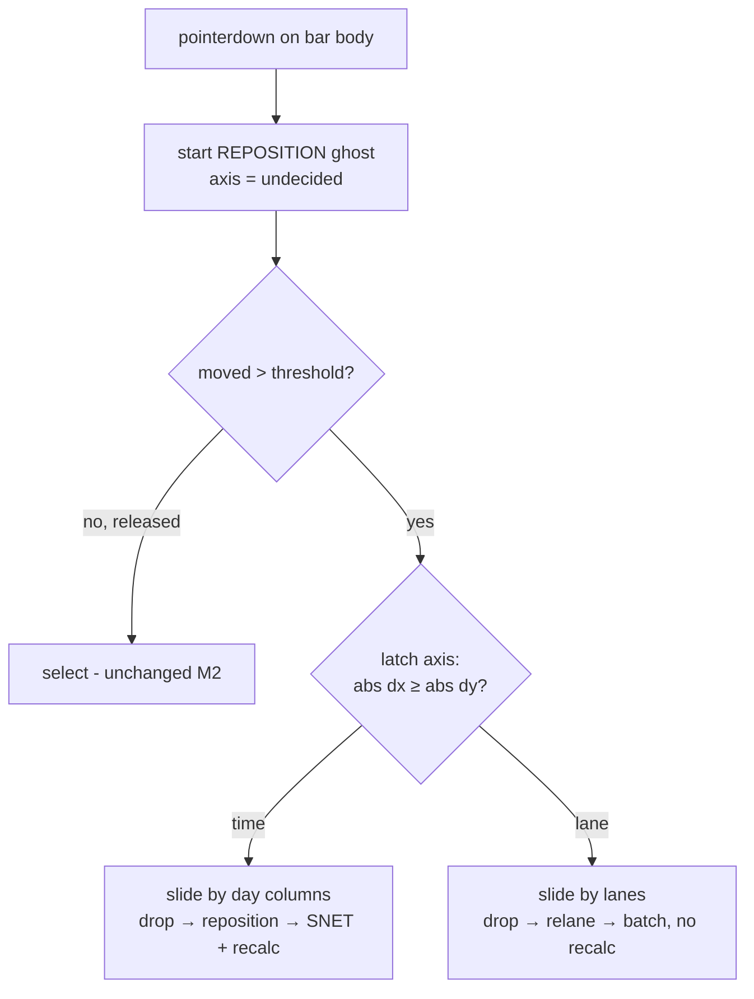

# TSLD Milestone 4 — layout persistence & auto-pack: interaction model & frontend design

- **Status:** Draft for approval (the "design before non-trivial UI" gate, CLAUDE.md §20)
- **Author:** ui-architect
- **Scope:** M4 of the TSLD canvas plan — a **batch position endpoint + lane drag** (4.1 backend,
  4.2 controller) and **opt-in auto-pack lanes**. Vertical drag changes `laneIndex` only and
  persists via the new batch endpoint **without a CPM recalc**; an explicit "Auto-arrange lanes"
  action re-flows lanes with a deterministic greedy packer and persists through the same endpoint.
  Behind `VITE_TSLD_EDITING`, OFF by default — same gate as M2.
- **Governing decisions:** ADR-0026 (canvas rendering/coordinate/state/interaction/a11y —
  esp. **D5** "Lane drag + optional auto-pack" and **D6** "Layout vs schedule"), ADR-0022
  (synchronous recalc + plan lock; the engine-owned batched write it establishes is a
  **contrast**, see §4), ADR-0023 (date convention), ADR-0004 (state split). Plan:
  `docs/plans/tsld-canvas.md` §M4. Prior art: `docs/design/tsld-m2-editing.md`.
- **Not in scope:** multi-select lane drag (deferred — §2), undo of auto-pack (not built; the
  confirm dialog is the mitigation — §5), driving-arrow styling (M3), the full native in-canvas
  keymap and screen-reader hardening (M5).

This is a design + interaction spec. **No application code is written here.** It records the
concrete architecture the implementer builds against and flags the decisions that need your
input before 4.2 starts. Type sketches below are illustrative (as in the M2 doc), not files.

---

## 0. Where M2/M3 leave us (the surface we extend)

- **The gesture machine already owns a horizontal body drag.** `interaction/gesture-machine.ts`
  `repositioning` state tracks **only** the x axis (`grabX`, `movedPastThreshold`, `grabDay`,
  `currentStartDay`, `spanDays`, `laneIndex` carried but never changed). On drop past the pixel
  threshold it emits `{ kind: 'reposition', activityId, startDay }`, which the route maps to an
  **SNET** `PATCH /activities/:id` + **recalc** (`plan-detail.tsx` `onTsldReposition`, lines
  116-161). This is M4's fixed point: the horizontal path stays byte-for-byte intact.
- **The intent → mutation seam is settled.** `TsldCanvas` emits `EditIntent` via `onIntent`;
  `TsldPanel` owns pending state, the conflict banner (`EditConflictBanner`) and version-409
  branching; the **route** owns the mutation + recalc and reads the live `version` from the Query
  cache at intent time (`plan-detail.tsx`). M4 threads a **new intent and a new mutation** through
  this exact seam — no new wiring pattern.
- **The pending-ghost mechanism already draws a bar at an arbitrary lane.** `PendingGhost`
  (`{ startDay, endDay, laneIndex }`) is painted on the interaction layer via `dayCellRect(...)`.
  A lane move is _the same ghost at a different `laneIndex`_ — we reuse it verbatim (§4).
- **The inverse transforms and lane helpers exist.** `render-model.ts` has `laneAtScreenY`,
  `laneRowAt` (clamps `≥ 0`), `screenYOfLane`, `dayCellRect`, `activityRect` — everything a lane
  drag and the packer need. `LANE_HEIGHT` is fixed, so a lane delta is `round(dy / LANE_HEIGHT)`.
- **The batch endpoint does not exist yet.** Task 4.1 adds `PATCH …/activities/positions`
  `{ positions: { id, laneIndex, version }[] }` (transactional, per-row optimistic lock,
  org/plan-scoped, **no recalc**). This design assumes 4.1 lands first and the frontend consumes it.
- **`editingEnabled` gating is unchanged.** `TsldPanel` already computes
  `showDiagram && canEdit && TSLD_EDITING_ENABLED && onCreate !== undefined`. M4 adds no new flag
  and no new role check — the lane-drag and auto-pack affordances appear **only** inside the
  existing edit surface; OFF = today's read-only M1 diagram.

---

## 1. The core disambiguation: horizontal (time) vs vertical (lane) on one body drag

### The conflict

A press on a **bar body** must resolve to one of three outcomes: a **select** (no travel), a
**time move** (horizontal → SNET reposition, **recalcs** — M2, built), or a **lane move**
(vertical → `laneIndex` batch write, **no recalc** — new). Time and lane are _different domains_
with _different persistence and different recalc semantics_, so conflating them is the risk.

### Options

| Option                                                                    | What a diagonal drag does                                                                                                              | Cost                                                                                                                                                        | Verdict         |
| ------------------------------------------------------------------------- | -------------------------------------------------------------------------------------------------------------------------------------- | ----------------------------------------------------------------------------------------------------------------------------------------------------------- | --------------- |
| **A. Free 2D drag** — both axes commit                                    | Persists a new day **and** a new lane → **two writes** with different semantics (SNET+recalc **and** batch no-recalc) from one gesture | Surprising: a user nudging sideways also silently re-lanes; ordering/atomicity of two dissimilar writes; the "combined" case complicates the conflict story | **Rejected**    |
| **B. Dominant-axis lock** — decide one axis at threshold, constrain to it | Snaps to the intended axis; the gesture is **either** a time move **or** a lane move, never both — one write, one clear semantic       | Slight learning ("drag has a grain"); a genuinely diagonal intent needs two gestures                                                                        | **Recommended** |
| **C. Modifier** — plain drag = time, modifier/handle = lane               | Explicit                                                                                                                               | Undiscoverable; no good touch story; adds a chord to a common operation                                                                                     | Rejected        |

### Recommendation — **B, dominant-axis lock** (decided at threshold, hysteresis-stable)

Once the pointer crosses `REPOSITION_THRESHOLD_PX`, the machine **latches** the axis from the
dominant delta at that instant (`|dx| ≥ |dy|` → `time`, else `lane`) and **holds it for the rest
of the gesture** — a later change of direction cannot flip it. Thereafter the ghost moves along
the locked axis only:

- **`time`** — exactly M2: the bar slides horizontally by whole-day columns; drop emits
  `reposition` (SNET + recalc). Vertical mouse noise is ignored. **Zero behaviour change** for the
  shipped path.
- **`lane`** — the bar slides vertically by whole lanes (`round(dy / LANE_HEIGHT)`, clamped `≥ 0`);
  its time is untouched; drop emits the new `relane` intent (batch write, **no recalc**).

Rationale: it is the standard direct-manipulation grain (maps/diagramming tools), yields **one
write and one recalc decision per gesture**, keeps M2's horizontal path pixel-identical, and
removes the "two dissimilar writes from one drag" problem entirely — which in turn keeps the
conflict-surfacing story simple (§4). A cursor hint (`col-resize` once latched `time`,
`row-resize` once `lane`) makes the latched axis legible.

**No combined single-gesture move.** A planner who wants both a new day and a new lane performs
two gestures (they are conceptually two edits: "reschedule" and "re-arrange"). This is the direct
answer to the plan's implicit "does a combined move do both writes?" — **it does not**; see §3 for
why that is the right call and what a future combined path would have to look like.

### Gesture routing (extends the M2 classifier)



Edge-handle (link) and empty-canvas (create/pan) routing are untouched from M2.

---

## 2. Single vs multi-activity lane drag — **multi-select deferred**

The plan lists "single/multi drag". The codebase has a **single-selection** model
(`selectedId: string | null`) throughout `TsldPanel` and the parallel listbox. True multi-drag
requires a whole selection subsystem — marquee/shift-click selection, a multi-`aria-selected`
listbox, group-drag geometry, and group-conflict semantics — none of which exist.

**Recommendation: M4 ships _single-activity_ lane drag; multi-select drag is deferred.** The
payoff the plan wants from the batch endpoint — tidying the whole diagram at once — is delivered
by **auto-pack** (§5), which is the bulk re-lane operation. The batch endpoint (4.1) is still built
to accept **N** rows (auto-pack needs that), so adding manual multi-drag later is _additive_ — a
selection model + a group-drag controller feeding the **same** intent/endpoint, no contract
change. Deferring keeps M4 a tight, reviewable slice and avoids inventing a selection model under
time pressure.

---

## 3. Gesture-machine & intent changes (all in the pure core)

### The new intent

```ts
// added to the EditIntent union in interaction/gesture-machine.ts
| {
    kind: 'relane';
    activityId: string;
    /** The activity's new lane (whole, ≥ 0). Time is unchanged — no recalc. */
    laneIndex: number;
  }
```

Symmetric with `reposition`: the intent carries **geometry only**; the **route** reads the live
`version` from the Query cache at intent time (the pattern `onTsldReposition` already uses) and
builds the single-row batch body `{ positions: [{ id, laneIndex, version }] }`.

### The `repositioning` state extension

`repositioning` gains the y-axis twins of its x fields and a latched axis:

```ts
kind: 'repositioning';
// … existing x fields (grabDay, grabX, originStartDay, spanDays, currentStartDay) …
grabY: number; // screen y at grab — for the dy threshold + lane delta
originLaneIndex: number; // lane at grab
currentLaneIndex: number; // lane under the (axis-locked) pointer
axis: 'undecided' | 'time' | 'lane'; // latched once movedPastThreshold
```

Reducer changes (pure, exhaustively unit-testable, as today):

- **`pointerMove`, `axis === 'undecided'`:** compute `dx = |x − grabX|`, `dy = |y − grabY|`. Once
  `max(dx, dy) > REPOSITION_THRESHOLD_PX`, set `movedPastThreshold = true` and latch
  `axis = dx ≥ dy ? 'time' : 'lane'`.
- **`axis === 'time'`:** exactly the current logic (update `currentStartDay`; `currentLaneIndex`
  stays `originLaneIndex`).
- **`axis === 'lane'`:** update `currentLaneIndex = max(0, originLaneIndex + round((y − grabY) /
LANE_HEIGHT))`; `currentStartDay` stays `originStartDay`.
- **`pointerUp`:** unchanged select guard (never moved, or ended on origin). Then branch on axis —
  `time` and moved → `reposition` (as today); `lane` and `currentLaneIndex !== originLaneIndex` →
  `relane`; otherwise `select`.

### Shell + paint changes (imperative shell, minimal)

- `TsldCanvas.liveGhostRect` uses `state.currentLaneIndex` (not the frozen `laneIndex`) for the
  `repositioning` ghost, so a lane drag animates vertically. The `BodyGrab` the shell supplies
  already carries `laneIndex`; the machine now also records `grabY` from the pointer.
- The cursor reflects the latched axis (`row-resize` / `col-resize`) for legibility.
- `TsldPanel.onIntent` gains a `relane` branch that mirrors the `reposition` branch: set an
  optimistic `PendingGhost` at the **new lane** (same `PendingGhost` type, `laneIndex` changed),
  call the route's `onRelane`, clear the ghost on settle, surface `conflict` on refusal, announce
  "Moved … to lane N" only when `applied`.

### Why no combined write, and what one would require (deferred)

With axis-lock there is **no** single gesture that changes both time and lane, so there is **no
two-write ordering/atomicity question** at the route — a pure lane move hits the batch endpoint
(no recalc); a pure time move hits the SNET PATCH (recalc). This is deliberate: the two writes have
**opposite recalc semantics**, and sequencing them under a shared conflict banner (which one was
refused? do we roll back the other?) is exactly the complexity we avoid. _If_ usability testing
later demands a combined move, it is a **new decision** (DECISIONS/ADR): it would run
**lane-batch first** (cheap, no recalc) **then** the SNET PATCH + recalc, presented as one logical
operation with all-or-nothing rollback — explicitly out of scope for M4.

---

## 4. Persistence & conflict surfacing — the batch write's all-or-nothing semantics

### The new mutation hook + route handler

- **`useBatchPositions(orgSlug, planId)`** (in `features/activities/api`, beside
  `useUpdateActivity`): `PATCH …/activities/positions` with `{ positions: { id, laneIndex,
version }[] }`. On success it invalidates **only** `activityKeys.listByPlan` — **not** the
  schedule summary, **not** baseline variance, **and it does not call recalc**: a lane is layout,
  not schedule (ADR-0026 D6), so dates, criticality and variance are all unchanged. This makes a
  lane change markedly cheaper than a reposition (one list invalidation, zero engine work).
- The **route** (`plan-detail.tsx`) adds `onRelane` (single row) and reuses the same handler body
  for `onBatchPositions` (auto-pack, N rows). Both read each activity's live `version` from the
  Query cache and build the `positions` array. Return an outcome shaped like `TsldEditOutcome`
  (`{ applied, conflict }`) so `TsldPanel` reuses its existing banner/announce plumbing verbatim.

### 409 semantics — the key difference from the single-PATCH reposition

The reposition PATCH is a single row: a 409 means _that_ row was stale. The batch endpoint is
**transactional and all-or-nothing** — so a 409 means **at least one** row was stale and therefore
**nothing was applied**. The copy must be honest about that:

| Case             | Rows | On 409                                     | Banner copy                                                                                                                    |
| ---------------- | ---- | ------------------------------------------ | ------------------------------------------------------------------------------------------------------------------------------ |
| Manual lane drag | 1    | that row stale → nothing applied           | "This plan changed since you opened it — your move wasn't applied. Refresh to see the latest." (reuses the M2 reposition copy) |
| Auto-arrange     | N    | **any** row stale → **whole** pack refused | "The plan changed since you opened it, so auto-arrange wasn't applied. Refresh and try again."                                 |

Both reuse `EditConflictBanner` + the existing `onRefresh` (which refetches activities/deps/
variance). The banner is **non-destructive** and we **never** re-send with bumped versions — a
retry happens only after the user refreshes and re-issues the action, carrying fresh versions.

### Optimistic reconcile

```mermaid
sequenceDiagram
  participant U as Planner
  participant G as gestureRef + interaction canvas
  participant P as TsldPanel (pending ghost + banner)
  participant A as API (PATCH .../activities/positions — no recalc)
  participant Q as TanStack Query

  U->>G: vertical drag (axis latched = lane)
  G-->>U: live ghost slides by whole lanes (<16ms)
  U->>G: drop
  G->>P: onIntent({ kind:'relane', activityId, laneIndex })
  Note over P: PendingGhost at new lane; call route onRelane
  P->>A: batch PATCH [{ id, laneIndex, version }]
  A-->>Q: invalidate activities list (no summary/variance, no recalc)
  Q-->>P: fresh lane → base layer repaints; PendingGhost cleared
```

- **Manual lane drag** is optimistic (the ghost sits at the target lane through the round-trip),
  exactly like M2 reposition — on 409 the ghost is discarded and the base repaints to truth.
- **Auto-arrange** is **not** optimistically previewed per-bar (a bulk N-bar reorder has no single
  ghost, and it is a confirmed, fast, no-recalc write): the confirm dialog's action shows a saving
  state, then the activities-list invalidation repaints all lanes authoritatively. Simpler and it
  cannot leave a half-applied optimistic state on the all-or-nothing endpoint.

---

## 5. "Auto-arrange lanes" — affordance + the pure packer

### Affordance

An **"Auto-arrange lanes"** button in `TsldToolbar` (visible only when `editingEnabled`). Clicking
opens a **confirm dialog** (shadcn `AlertDialog`) — because the reorder can move many bars and
**undo is not built yet** (plan risk "surprising reorder → confirm + (once undo lands)
reversible"): "Auto-arrange lanes? This repacks activities into the fewest lanes with no
time-overlap. It changes only vertical layout, not dates — but it can't be undone yet." Confirm →
compute pack → `onBatchPositions` → invalidate → announce "Lanes auto-arranged; N activities
moved." The button and dialog are ordinary focusable controls, so the whole capability is keyboard-
operable out of the box (§6).

### The packer — pure, in `render/`, unit-tested

A pure module **`render/auto-pack.ts`** (sibling to `render-model.ts`, the same pure-core
discipline — no canvas/DOM/React/network), so it is exhaustively unit-testable:

```ts
export function packLanes(
  items: readonly { id: string; startDay: number; endDay: number; laneIndex: number }[],
): { id: string; laneIndex: number }[]; // returns ONLY rows whose lane changes
```

- **Deterministic greedy first-fit.** Sort by `(startDay, endDay, id)` — a total order, so the
  result is deterministic regardless of input order. Walk the sorted list; assign each item to the
  **first** lane whose last-occupied finish day is strictly before this item's start
  (`item.startDay > laneMaxEnd[lane]`), else open a new lane; update that lane's running max end to
  `item.endDay`. Uses the inclusive-finish convention (ADR-0023) — a bar occupies
  `[startDay, endDay]`; a milestone is `startDay === endDay`.
- **Returns the minimal diff.** Only rows whose `laneIndex` actually changes are returned, so the
  batch is as small as possible — fewer version checks, no no-op writes, smaller conflict surface.
- **Undated activities are excluded.** An activity with `earlyStart === null` has no x position
  (it is not drawn), so it cannot be packed; it keeps its current `laneIndex` and is omitted from
  the batch. Noted for the implementer and the empty-result case (nothing to pack → the button is
  a no-op / disabled).

`packLanes` consumes only the render-model shapes the panel already derives; the toolbar action
maps its result to the route's `onBatchPositions`. **The packer never persists** — persistence is
the one batch endpoint, shared with lane drag.

---

## 6. Accessibility — keyboard equivalents wired in M4, hardened in M5

**Compliance argument:** M4 introduces two pointer capabilities (drag-to-relane, auto-arrange).
Per the M2/M5 discipline (**no new pointer-only capability**, WCAG 2.1.1), each ships its keyboard
path **in the same slice**:

| Canvas capability    | Keyboard equivalent wired in M4                                                                                                                                                     | M5 hardening                                                                                                      |
| -------------------- | ----------------------------------------------------------------------------------------------------------------------------------------------------------------------------------- | ----------------------------------------------------------------------------------------------------------------- |
| Lane drag (`relane`) | In the parallel listbox, **`Alt+↑ / Alt+↓`** on the focused activity moves it one lane up/down → the same single-row `relane` path; announced "Moved … to lane N" via `useAnnounce` | Roving-focus + documented full keymap; focus-follows-viewport; live-region richness; axe + screen-reader journeys |
| Auto-arrange         | The toolbar **button + confirm dialog** are already fully keyboard-operable; result announced                                                                                       | Same keymap doc + journeys                                                                                        |

`Alt+↑/↓` is orthogonal to M2's use of Alt (a _pointer_ modifier during edge-handle link drag) and
to the M5-reserved `Alt+←/→` SNET nudge — it fires only from the listbox keyboard context. This
mirrors ADR-0026 D7 ("a documented key set nudges position and lane") and the M2 doc's stated M5
upgrade row ("`Alt+↑/↓` changes `laneIndex`"), brought forward minimally so M4 is WCAG-clean and
M5 _upgrades_ ergonomics rather than _retrofitting_ a missing path.

**Design rule (unchanged from M2):** the lane-drag slice may not merge unless `Alt+↑/↓` is wired in
the same PR; the auto-arrange slice ships its button/dialog (inherently keyboard-operable).

---

## 7. Task slicing

Confirmed order **4.1 → 4.2 → 4.3**, each behind `TSLD_EDITING_ENABLED` (OFF = the M1/M2 surface,
`main` stays releasable).

**Slice 4.1 — Batch position endpoint (backend).** `PATCH …/activities/positions`,
DTO `{ positions: { id, laneIndex, version }[] }`; validate **every** id is in this plan/org
(deny-by-default, IDOR-safe); **single transaction**, **per-row optimistic lock** (409 if any
`version` stale → whole batch refused), **no recalc**; standard `{ data | error }` envelope;
`docs/API.md` + OpenAPI. _Reviews:_ api + security + backend-performance + database-architect
(confirm no new index needed). _Tests:_ API e2e — scope/IDOR, all-or-nothing atomicity, version
conflict, empty/duplicate-id rejection. **No frontend capability yet.**

**Slice 4.2 — Lane-drag controller + persistence (frontend).** Extend the gesture machine
(dominant-axis lock, `relane` intent — §3); extend `liveGhostRect`/cursor in `TsldCanvas`;
`useBatchPositions` hook; route `onRelane`; optimistic ghost + conflict banner reuse (§4);
**`Alt+↑/↓`** keyboard relane in the listbox (§6). _Tests:_ gesture-machine unit tests (axis latch,
hysteresis, threshold, select-vs-move-vs-relane branching) — the highest-value new tests;
component test (vertical drag → single-row batch body incl. version; 409 → banner); **reuse** the
4.1 e2e; Playwright relane journey behind the flag; perf assertion that lane-ghost paint stays on
the interaction layer.

**Slice 4.3 — Auto-pack (frontend).** Pure `render/auto-pack.ts` + exhaustive unit tests
(determinism under input permutation, no time-overlap in output, minimal diff, milestone/undated
handling); `TsldToolbar` "Auto-arrange lanes" button + `AlertDialog`; persist via
`onBatchPositions` (reuses 4.2's hook/handler); announce result. _Tests:_ packer unit suite (the
core); component test (confirm → batch of the expected rows; N-row 409 → the auto-arrange banner
copy); Playwright auto-arrange journey.

_Reviews per slice_ (plan §M4): ui-architect (interaction), ux-reviewer (axis-grain
discoverability, auto-arrange confirm copy, conflict copy), accessibility-reviewer (no pointer-only
capability; `Alt+↑/↓`), component-reviewer (no one-off styling; toolbar/dialog use tokens + shadcn),
security-reviewer (batch stays org/plan-scoped, IDOR), api-reviewer + backend-performance-reviewer
(4.1 contract, atomicity, no-recalc), test-engineer.

---

## 8. ADR / DECISIONS check

**M4 needs no new ADR and no amendment to ADR-0026.** Everything is already decided there:

- **Lane drag changes `laneIndex` only; optional auto-pack re-flows lanes; lane changes persist
  without a recalculation** — ADR-0026 **D5** and **D6** ("Layout vs schedule") verbatim.
- Intent-via-callback, route owns the mutation, `features/tsld` imports only shared + `@repo/types`
  — ADR-0026 **D8** (unchanged).
- Optimistic geometry-only preview → authoritative reconcile — ADR-0026 **D6** (here the
  authoritative step is a plain list refetch, no recalc).

Two **`docs/DECISIONS.md`** entries are warranted (local, reversible, anticipated by the plan/spec
— not ADR-level):

1. **Dominant-axis-lock gesture policy** — a body drag latches **one** axis at threshold and
   resolves to **either** a time move (SNET + recalc) **or** a lane move (batch, no recalc), never
   both; there is **no combined single-gesture write** (this doc §1/§3).
2. **Batch-reorder concurrency posture** — the layout batch endpoint is **all-or-nothing with
   per-row optimistic locking** (a single stale `version` refuses the whole write), surfaced via the
   non-destructive conflict banner with auto-arrange-specific copy. Note the deliberate **contrast
   with ADR-0022**: the _engine-owned_ CPM batched write bypasses optimistic locking because the
   engine is authoritative; this _user-authored_ layout batch **enforces** it because the planner's
   `version` is exactly what concurrency must protect.

**What _would_ need an ADR (and we are deliberately not doing):** a combined time+lane single-
gesture write (§3), multi-select group drag semantics (§2), or making auto-pack automatic rather
than opt-in. None are in M4.

---

## Open questions needing your input

1. **[BLOCKING for 4.2] Disambiguation policy.** Confirm **dominant-axis lock** (a body drag is
   _either_ a time move _or_ a lane move, never both — §1). The alternative (free 2D → two writes)
   is rejected for the reasons in §1/§3. This is the one genuinely blocking call.
2. **[Confirm] Multi-select lane drag deferred.** M4 ships single-activity lane drag + auto-pack;
   manual multi-drag is deferred to a later slice (the endpoint already takes N rows, so it is
   additive). Agree, or is manual multi-drag required in M4?
3. **[Confirm] Auto-pack scope & non-optimistic apply.** The packer excludes **undated** activities
   (no x to pack) and auto-arrange is **not** optimistically previewed (confirmed, fast, no-recalc
   bulk write that reconciles on refetch) — §4/§5. Acceptable?
4. **[Confirm] Keyboard equivalent.** `Alt+↑/↓` in the parallel listbox for relane in M4 (minimal,
   WCAG-clean); the full documented keymap is hardened in M5 (§6). Confirm.
5. **[Confirm] No undo yet.** Auto-arrange is guarded by an explicit action + confirm dialog;
   undo/reversal is not built (plan's "once undo lands" is future work). Acceptable as the
   mitigation for M4?

## Blocking vs. suggested — summary

- **Blocking (need an answer before building 4.2):** OQ1 (dominant-axis lock).
- **Confirmations (defaults stated; will proceed unless you object):** OQ2 (defer multi-select),
  OQ3 (auto-pack scope + non-optimistic), OQ4 (`Alt+↑/↓` keyboard relane), OQ5 (no undo yet).
- **Design decisions I have made (non-blocking, documented above):** the `relane` intent + the
`repositioning` state/axis extension (§3); reuse of `PendingGhost` + `EditConflictBanner` for the
lane path (§3/§4); `useBatchPositions` invalidates only the activity list, no recalc/summary/
variance (§4); all-or-nothing 409 copy split (manual vs auto-arrange) (§4); the pure `render/
auto-pack.ts` greedy first-fit with a minimal diff (§5); slicing 4.1→4.2→4.3 (§7); no new ADR,
two DECISIONS.md notes (§8).
</content>

</invoke>
