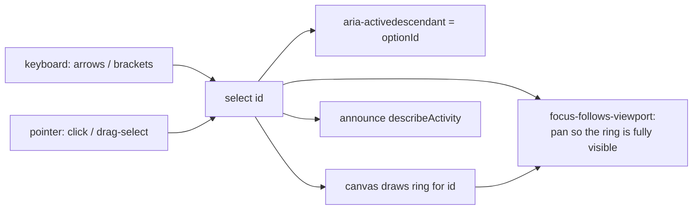
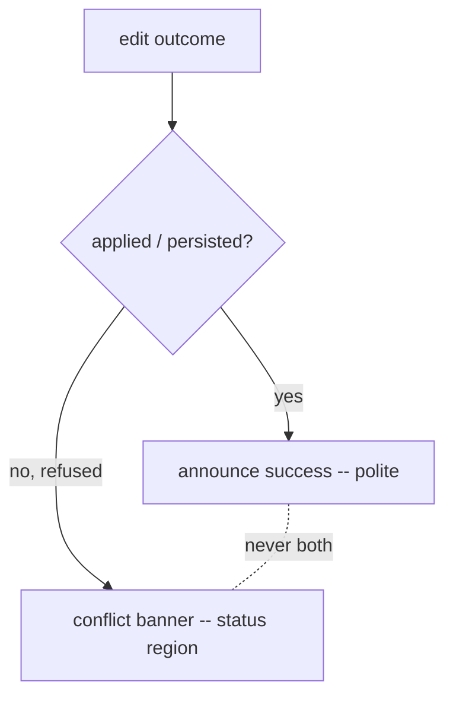

# TSLD Milestone 5 — accessibility: keyboard model & accessible representation

- **Status:** Draft for approval (the "design before non-trivial UI" gate, CLAUDE.md §20).
- **Author:** ui-architect
- **Scope:** M5 of the TSLD canvas plan — **Task 5.1** (accessible read representation, hardened)
  and **Task 5.2** (keyboard interaction model for editing). This is the **WCAG 2.2 AA
  hardening** milestone: it consolidates the accessible surface that shipped incrementally
  across M1–M4 with explicit "deferred to M5" gaps, closes them, and documents a single
  canonical focus model + keymap. `accessibility-reviewer` **leads** the AA sign-off (plan §M5).
- **Governing decisions:** ADR-0026 (canvas rendering/coordinate/state/interaction/a11y — esp.
  **D7** "parallel focusable DOM a11y layer" and **D3** state ownership), ADR-0021 (DAG),
  ADR-0022/0023 (recalc + date convention), ADR-0024 (server-only calendars). Prior art:
  `docs/design/tsld-m2-editing.md` §5, `docs/design/tsld-m4-layout.md` §6, and the
  `docs/DECISIONS.md` M3 entry (driving-edge definition, which deferred a driving cue in
  `describeActivity` to M5). Plan: `docs/plans/tsld-canvas.md` §M5.
- **Not in scope:** delete/undo on the canvas (deletion stays in the activities table — the
  conforming alternative); multi-select keyboard drag (follows the deferred multi-select
  subsystem, M4 §2); a client-side link legality pre-check (its own tracked deferral);
  automated screen-reader assertions in CI (SR verification is a manual/assisted pass — §5).

This is a design + interaction spec. **No application code is written here.** Type/keymap
sketches are illustrative (as in the M2/M4 docs), not files. It records the concrete
architecture the implementer builds against and flags the decisions that need your input.

---

## 0. Where M1–M4 leave us (the accessible surface we harden)

The parallel accessible representation already exists and is load-bearing — M5 **consolidates**
it, it does not build it from scratch:

- **The canvas is `aria-hidden`; a parallel `sr-only` listbox is the AT surface.**
  `TsldPanel.tsx` renders `<ul role="listbox" tabIndex={0}>` with `role="option"` children,
  labelled "Activities in the diagram", using **`aria-activedescendant`** to point at the active
  option (lines 571-593). Selection is single (`selectedId`); the **canvas draws the ring** for
  the selected id, so the visible focus lives on the canvas, not on the (visually hidden) listbox.
- **`describeActivity(a)`** (lines 42-51) is the option's accessible text — currently
  `{code name}, {start}–{finish}, lane N{, critical|near-critical}`, or `…, not yet scheduled`.
  `totalFloat` and per-activity driving are **available but not yet surfaced** (`ActivitySummary.totalFloat`,
  `DependencySummary.isDriving`).
- **Keyboard, as shipped:** `onListKeyDown` (lines 238-284) handles `↑/↓/Home/End` navigation,
  `Enter` → `onOpenLogic` (the link path), and `Alt+↑/↓` → a lane-only reposition (M4). It has a
  no-op-at-lane-0 early-return **with no feedback** (line 262) and **no in-flight guard** on the
  Alt-repeat write.
- **Announcements** go through the shared `useAnnounce()` polite region
  (`components/ui/announcer.tsx`); the code already follows a truthful **only-announce-when-applied**
  rule (lines 336-339, 381-390, 411-412) so a success line never contradicts a conflict banner.
- **The gesture surface** (`interaction/gesture-machine.ts`) emits `create` / `reposition` (free-2D
  day+lane) / `link` intents; `TsldPanel.onIntent` maps them to route handlers. Every pointer
  capability has a keyboard equivalent **today** (M2 §5, M4 §6), so M5 is an **ergonomics + rigor**
  pass, not a "retrofit a missing path" pass.

**The four documented gaps M5 closes** (the "deferred to M5" notes + TECH_DEBT #24):

1. **Focus model is undocumented and diverges from ADR-0026 D7's text.** D7 named _roving
   tabindex_ over _absolutely-positioned transparent proxies_; what shipped is
   _aria-activedescendant_ over an _sr-only listbox_. Better, but unratified (§1).
2. **No focus-follows-viewport.** Keyboard selection can ring an **off-screen** bar — a
   2.4.7/2.4.11 hole (M4 §6 deferral; §1).
3. **Incomplete keymap.** No in-canvas time nudge (`Alt+←/→`, reserved since M2), no chain
   navigation, no keyboard create parity, no documented/discoverable keymap (§2).
4. **`describeActivity` under-describes** (no float, no driving, no logic ties — M3 deferral); and
   the announcement policy has two rough edges — **no lane-boundary feedback** (#24b) and a
   **rapid-key-repeat self-race** that spawns spurious 409 banners (#24a) (§3, §4).

---

## 1. Focus model — ratify `aria-activedescendant`, add focus-follows-viewport

### The decision: keep `aria-activedescendant`, not roving `tabindex`

APG lists **both** techniques as valid for `listbox`. The deciding factor here is that the
listbox is **`sr-only`** and the **visible focus indicator is the canvas ring**, not a DOM
outline. That changes the usual trade-off:

- **Roving `tabindex`** moves real DOM focus onto each `<li>`. Its main payoff — a browser-native
  visible focus ring and simple `:focus` styling — is **worthless here**: the option is
  visually hidden, so a moved DOM focus ring would be invisible. It would also make the listbox
  **N tab stops** worth of internal state to manage, and interacts badly with any future
  virtualisation of the option list (focus stranded on an unmounted row).
- **`aria-activedescendant`** keeps DOM focus on the single `<ul>` and publishes the active option
  to AT. One tab stop. Crucially, **one source of truth** drives everything: `selectedId` sets
  `aria-activedescendant` **and** the canvas ring, so — per ADR-0026 D7's promise that "keyboard
  and visual focus never diverge" — they **cannot** disagree.

**Recommendation: standardise on `aria-activedescendant` + the `sr-only` `role="listbox"`, and
record it in `docs/DECISIONS.md` as the canonical model, referencing ADR-0026 D7.** The
_architecture_ D7 fixed (parallel DOM over an `aria-hidden` canvas, canvas ring, `useAnnounce`) is
unchanged; only the _technique_ (activedescendant vs roving; sr-only listbox vs positioned
proxies) is refined — a DECISIONS-level ratification, not an ADR reversal (see §6, and OQ1 on
whether you want a formal D7 amendment instead).

> **Role note.** `listbox` (not `application`/`grid`, both floated in D7) is retained: it gives AT
> a free "list, N items, X selected" reading, and standard `↑/↓/Home/End` are exactly listbox keys.
> The M5 additions (`[`/`]`, `Space`, `n`) are **documented custom keys layered on** the listbox;
> the standard listbox contract still holds, so this is a conforming extension, not a role fight.

### Selection ↔ ring ↔ focus stay in sync (and 2.4.7 / 2.4.11)



- **WCAG 2.4.7 (Focus Visible):** the ring is the visible focus indicator, painted with the `ring`
  token (ADR-0026 D7). M5 adds the missing half: **focus-follows-viewport**. On every selection
  change, if the selected activity's `activityRect` under the current viewport is not fully inside
  the canvas (inset by a small margin), `TsldCanvas` **pans the minimum distance to reveal it**
  (zoom unchanged; if the bar is wider than the viewport, align its start). Pointer selection is
  already visible, so reveal is a no-op there; keyboard selection is the case this fixes. The pan
  writes the ref and commits to the URL on settle (ADR-0026 D3 — never per-frame).
- **WCAG 2.4.11 (Focus Not Obscured, Minimum — new in 2.2):** the reveal margin keeps the ring off
  the canvas edges; the toolbar, legend, and conflict banner render **outside/above** the canvas
  box (not overlapping it), so nothing author-created can obscure the focused ring. The listbox
  itself is the single tab stop, so there is no obscured-tab-stop case.
- **Entry:** tabbing into the listbox with nothing selected still selects `activities[0]`
  (existing `onFocus`), which now also **reveals** it. Tab order: listbox ⇄ toolbar (unchanged).

---

## 2. The complete, documented keymap

Focus is on the parallel listbox. **Read** rows work with the edit flag **off**; **Edit** rows are
active only when `editingEnabled` (`canEdit && VITE_TSLD_EDITING && onReposition/…`).

### Navigation & inspection (read — no flag)

| Key                 | Action                                                                               | Status       |
| ------------------- | ------------------------------------------------------------------------------------ | ------------ |
| `↑` / `↓`           | Previous / next activity in list order                                               | shipped (M1) |
| `Home` / `End`      | First / last activity                                                                | shipped (M1) |
| `[` / `]`           | Jump to the **driving** predecessor / successor first; repeat cycles the rest, wraps | **NEW 5.1**  |
| `Space`             | Announce **extended detail** on demand (float + predecessors/successors + driving)   | **NEW 5.1**  |
| `Enter`             | Open the logic (dependency) editor for the focused activity (the link path)          | shipped (M2) |
| `?` (`Shift`+`/`)   | Open the **keyboard-shortcuts help** sheet (discoverability for power users)         | **NEW 5.1**  |
| `Esc`               | Cancel an in-flight gesture / exit add-activity mode / close the create popover      | shipped (M2) |
| `Tab` / `Shift+Tab` | Move to / from the toolbar (the listbox is one tab stop)                             | shipped (M1) |

### Editing (behind `VITE_TSLD_EDITING`)

| Key           | Action                                                                                 | Status                    |
| ------------- | -------------------------------------------------------------------------------------- | ------------------------- |
| `Alt`+`↑`/`↓` | Move the focused activity up / down one **lane** (layout-only PATCH, **no recalc**)    | shipped (M4)              |
| `Alt`+`←`/`→` | Nudge **start** one calendar day earlier / later (an **SNET** constraint, **recalcs**) | **NEW 5.2** (M2-reserved) |
| `n`           | Open the **create-activity dialog** pre-filled with the focused lane + start           | **NEW 5.2** (ergonomic)   |

### How M5 closes each pointer-only ergonomics gap (2.1.1 analysis)

WCAG 2.1.1 requires each **function** to be keyboard-operable — not each **input method**. Every
canvas function already has a conforming keyboard path; M5 adds **in-canvas** keyboard parity so
the flagship surface isn't second-class for keyboard-first planners (ADR-0026 D7's stricter bar).

| Canvas capability         | Conforming keyboard path (shipped)                                 | M5 in-canvas upgrade                          | 2.1.1   |
| ------------------------- | ------------------------------------------------------------------ | --------------------------------------------- | ------- |
| Reposition-in-time (SNET) | Activity edit dialog `constraintType`/`constraintDate`             | `Alt+←/→` day nudge (§4 coalesced write)      | met     |
| Re-lane                   | `Alt+↑/↓` in the listbox                                           | + lane-boundary feedback (#24b, §4)           | met     |
| Link-draw                 | `Enter` → logic editor (all four types incl. SF; cycle/dup inline) | chain-nav `[`/`]` to reach the endpoint first | met     |
| **Create-by-drag**        | Activities-table **CreateActivityButton → ActivityFormDialog**     | `n` opens that dialog pre-filled (lane/start) | met     |
| Auto-arrange              | Toolbar button + confirm dialog (already keyboard-operable)        | listed in the `?` help                        | met     |
| **Chain navigation**      | (was never a pointer capability — traced visually)                 | `[`/`]` (driving-first)                       | n/a→met |

**Create-by-drag, specifically (the one worth arguing).** The pointer gesture "draw a bar of
arbitrary span at an arbitrary lane" is a convenience input; the **function** "create an activity
at a lane/start with a duration" is fully keyboard-operable through the existing
`ActivityFormDialog` (RHF+Zod, sets name/type/duration/lane/constraint). So create-by-drag is
**already 2.1.1-clean** — the table dialog is the conforming alternative. M5 does **not** invent a
canvas-native "keyboard draw a span" mode (a poor fit for keys); it adds `n` as a shortcut that
opens the **same** dialog pre-filled from the focused activity's lane/start, closing the
_ergonomic_ gap only. (`n` is a bare letter; the listbox has no type-ahead today — if type-ahead is
ever added, `n` moves to a chord. Noted, not blocking.)

### Chain navigation semantics (`[` / `]`)

Predecessor/successor tracing is the workflow the TSLD exists for ("drivers at a glance"). `[`
selects the **driving** predecessor (the edge whose timing sets this activity's early start —
`DependencySummary.isDriving`) **first**, because that is the binding tie a planner traces up the
critical/driving path; a repeated `[` cycles the remaining predecessors in list order and wraps. `]`
mirrors it for successors. Each jump **announces the tie**, so driving + logic-tie information is
delivered exactly when it is relevant (§3). With no predecessor/successor, the key announces
"No predecessors." / "No successors." All derived from the already-present `dependencies` prop —
pure read, so this ships in 5.1 **without** the edit flag.

---

## 3. Accessible representation completeness — three-tier disclosure

The plan wants dates, lane, **float**, **critical**, **driving**, and **logic ties** exposed
without a verbose per-keystroke announcement. The answer is **progressive disclosure across three
tiers**, so the always-spoken text stays lean and richness is on demand:

| Tier                         | Trigger                | Content                                                                                                            |
| ---------------------------- | ---------------------- | ------------------------------------------------------------------------------------------------------------------ |
| **1 — Name** (per keystroke) | `↑/↓/Home/End`, select | `{code name}, {start}–{finish}, lane N, {float}, {critical}` — one lean sentence                                   |
| **2 — Summary** (on demand)  | `Space`                | float + "**P** predecessors, **S** successors; start driven by **{name}**; drives **{name}**"                      |
| **3 — Full** (on demand)     | `Enter`                | the **logic editor** — the fully keyboard-navigable predecessors/successors table with the **Driving** column (M3) |

- **Tier 1 (`describeActivity`, enriched).** Add **float** where it adds information and keep the
  criticality cue: `critical` already implies zero float, so — `critical` → `", critical"`;
  `near-critical` → `", near-critical, {totalFloat} days float"`; otherwise → `", {totalFloat} days
float"`; omit float when `totalFloat` is null (uncomputed). Dates/lane unchanged. This is the
  full extent of what is spoken on every arrow keystroke.
- **Tier 2 (`Space`).** A "tell me more" that answers the M3-deferred question without cluttering
  navigation: it announces the **logic ties + driving** for the focused activity, computed from
  `dependencies`. This is the **detail affordance** — it is where driving lives, rather than folded
  into every Tier-1 announcement. (Standard listbox `Space` "selects", but selection already
  follows focus here, so `Space` is free to mean "detail" — documented in the `?` help.)
- **Tier 3 (`Enter`).** Unchanged: the logic editor is the fuller conforming alternative and already
  carries the Driving column in text (M3 DECISIONS note).

**Decision (recommend): do _not_ fold driving/logic-ties into the Tier-1 name.** Hearing "3
predecessors, driven by X, drives Y" on every arrow press is exactly the verbosity the plan warns
against. Driving is surfaced (a) terse where a planner acts on it — the `[`/`]` chain-nav
announcement ("Predecessor: {name}, **driving**") and (b) fully in Tier 2/3. See OQ2 if you would
rather a single terse `", driving"` token also ride in Tier 1.

---

## 4. Live-region announcement policy

One coherent, non-contradictory set, extending the shipped **only-announce-when-applied** rule.



**Invariant (WCAG 4.1.3):** for any single outcome, **exactly one** of {success announcement,
conflict banner} fires — never both, never neither. The `EditConflictBanner` must itself be a live
region (`role="status"`, polite) so a refusal is spoken without stealing focus.

| Outcome                                | Applied → announce (polite)                                                                                        | Refused → banner (status)                                      |
| -------------------------------------- | ------------------------------------------------------------------------------------------------------------------ | -------------------------------------------------------------- |
| Select / navigate                      | Tier-1 `describeActivity` (shipped)                                                                                | —                                                              |
| `Space` detail / `[` `]` chain-nav     | Tier-2 summary / tie announcement (§3) — **NEW**                                                                   | "No predecessors/successors." (informational, polite)          |
| Create                                 | "Activity '{name}' added." (shipped)                                                                               | create failure keeps the popover; recalc-only failure → banner |
| Reposition — time (`Alt+→`/drag)       | "Moved '{name}'." (`+ "; dates will update"` if lane too) (shipped)                                                | stale version → move-conflict banner (shipped)                 |
| Reposition — lane (`Alt+↑↓`/drag)      | "Moved '{name}' to lane N." (shipped)                                                                              | stale version → move-conflict banner (shipped)                 |
| **Lane boundary (#24b)** — **NEW**     | `Alt+↑` at lane 0 / `Alt+↓` beyond last used lane: "Already in the top lane."                                      | —                                                              |
| Link                                   | "Linked '{pred}' to '{succ}'." (shipped)                                                                           | cycle/duplicate → banner from `err.error.message` (shipped)    |
| Delete (arrives via refetch) — **NEW** | if the selected bar vanished: move selection to the nearest neighbour + "Activity removed."                        | —                                                              |
| Recalc completion                      | **no separate announcement** — the edit outcome already spoke; a second "Schedule recalculated" would double-speak | —                                                              |
| Auto-arrange                           | "Lanes auto-arranged; N activities moved." / "…already arranged; nothing to move." (shipped)                       | any stale version → auto-arrange-copy banner (shipped)         |

### The rapid-key-repeat self-race (#24a) — coalesce + serialize

Holding `Alt+↑` (or the new `Alt+←/→`) fires the OS key-repeat faster than the PATCH round-trip, so
a second nudge reads a **pre-refetch** `version` → a self-inflicted 409 banner (and, for time
nudges, a recalc **per keystroke**). **Recommended fix: coalesce the burst into one write, and
serialize writes.**

- **Coalesce.** While the key repeats, move the ring **optimistically** (drive the existing
  `pendingReposition` ghost / an optimistic lane/start override) and **debounce the commit**
  (~150 ms after the last repeat). On settle, issue **one** minimal PATCH to the **net** lane /
  net day (+ one recalc for a time change), reading `version` **live from the cache** at commit
  time. A held `Alt+↑` that crosses three lanes is **one** `{ laneIndex, version }` write, not
  three racing ones — the self-race cannot occur, and recalc cost is bounded to one per settle.
- **Serialize.** Never start the next burst's write while the previous write's invalidation is
  in flight (an in-flight flag), so cross-burst versions are always fresh.

This supersedes a plain "drop repeats while in-flight" guard, which would fix the race but throw
away intended fast nudges (one lane per round-trip). See OQ3.

---

## 5. Testing — axe integration + keyboard-only journeys

**axe (component, Vitest + `vitest-axe`):** a new `TsldPanel.a11y.test.tsx` asserts **zero
violations** across the render states — empty, read-only (flag off), and editing (flag on) — plus
targeted assertions the linter can't make: the listbox is labelled and is a single tab stop; every
`aria-activedescendant` value resolves to a present `role="option"` id; the legend is
non-colour-encoded; the shortcuts help is reachable and labelled. axe is a **floor**, not the
whole gate (it can't see the canvas ring or hear announcements).

**Keyboard-only journeys (Playwright, `page.keyboard` only — no mouse):**

- **5.1 read journey (default build, flag OFF)** — open a calculated plan → `Tab` to the diagram →
  `↑/↓/Home/End` navigate (assert the announcer text each step) → `[`/`]` chain-nav (assert the tie
  announcement and that selection lands on the driving neighbour) → `Space` detail → `Enter` opens
  the logic editor → assert **focus-follows-viewport** revealed an off-screen bar (viewport moved).
  Plus an `@axe-core/playwright` scan of the page with the diagram present.
- **5.2 edit journey (flagged build, `VITE_TSLD_EDITING=true`)** — `Alt+↑/↓` relane (assert lane
  persisted, no recalc), `Alt+←/→` time nudge (assert SNET/date changed after recalc), a **held**
  `Alt+↑` across several lanes asserts **one** net write and **no spurious conflict banner** (the
  #24a regression test), lane-0 boundary announcement (#24b), `n` → create dialog → assert
  "added". Every capability is exercised with the keyboard alone — the plan's "operable by
  keyboard" proof.

**CI reality to design around (TECH_DEBT #1):** CI runs **Chromium against a real API + Postgres**.
Two consequences: (a) the **edit** journey needs a **flag-on web build** — add a Playwright project
(or job step) that builds/serves the web app with `VITE_TSLD_EDITING=true`; the read journey needs
no flag; (b) both journeys **create their own scoped plan/activities** in setup and rely on RBAC
scoping for isolation (no shared fixtures), like the existing journeys. **Screen-reader
verification is a manual/assisted pass** (NVDA + VoiceOver smoke against the read + edit journeys),
owned by the `accessibility-reviewer` for sign-off — automated SR assertions are out of scope for
CI and should not be faked with axe.

---

## 6. Task slicing

Both slices keep `main` releasable. **5.1 ships the read hardening with the edit flag OFF** — it is
pure value with no edit-lock/flag dependency; **5.2 hardens the keyboard edit model behind the
existing `VITE_TSLD_EDITING`** (OFF = the read surface).

**Slice 5.1 — Accessible read representation hardening (no flag).**
Ratify the `aria-activedescendant` model + single tab stop; add **focus-follows-viewport** (reveal
the ring on selection — 2.4.7/2.4.11); enrich Tier-1 `describeActivity` (float + critical); add
**`Space`** Tier-2 detail and **`[`/`]`** driving-first chain navigation (read-only); add the
**`?` shortcuts-help** sheet (documents the whole keymap in-app); delete-reconcile selection move.
_Tests:_ `vitest-axe` component suite; the 5.1 keyboard-only Playwright journey (default build);
pure unit tests for the chain-nav predecessor/successor selection (driving-first + cycle + wrap)
and the enriched `describeActivity` (float phrasing, uncomputed/null, not-scheduled).

**Slice 5.2 — Keyboard edit-model hardening (behind `VITE_TSLD_EDITING`).**
`Alt+←/→` SNET **time nudge**; **coalesce + serialize** for all Alt-nudges (fix #24a) with an
optimistic ghost; **lane-boundary feedback** (#24b); `n` **keyboard create** into the pre-filled
dialog; complete the announcement policy table (§4); extend the `?` help with the edit keys.
_Tests:_ the 5.2 keyboard-only Playwright journey (flag-on build), including the **held-key
one-write / no-spurious-banner** regression and the boundary announcement; component tests that a
coalesced burst issues a single minimal PATCH with the live version and (time) one recalc; reuse
the existing `PATCH /activities/:id` + version-409 e2e.

_Reviews per slice_ (plan §M5): **accessibility-reviewer (lead, WCAG 2.2 AA sign-off)**,
ux-reviewer (keyboard workflow for power users; help discoverability; announcement copy),
component-reviewer (no one-off styling — the help sheet uses shadcn `Dialog`/`Sheet` + tokens),
test-engineer (axe + keyboard journeys).

**TECH_DEBT reconciliation.** 5.2 resolves **#24 (a)** and **(b)**. #24 **(c)** (manual lane-drop
visual overlap cue) is a UX/paint follow-up, not an a11y blocker — leave tracked; **(d)** route-level
test harness and **(e)** the `invalidateActivity` helper stay tracked (unchanged by M5). Update the
#24 row to reflect (a)/(b) closed.

---

## 7. ADR / DECISIONS check

**M5 needs no new ADR and no reversal of ADR-0026.** Everything is within D7's intent (parallel
focusable DOM over an `aria-hidden` canvas; ring; `useAnnounce`) and D3 (viewport in a ref,
committed to the URL on settle). What M5 **fixes in place** is the _technique_ D7's prose named
loosely, so one **`docs/DECISIONS.md`** entry is warranted (per the plan's "DECISIONS note on the
focus model + keymap"):

> **TSLD accessibility model & canonical keymap (M5).** The parallel a11y surface is a single
> `sr-only` `role="listbox"` driven by **`aria-activedescendant`** (not roving `tabindex`) over the
> `aria-hidden` canvas, with the **canvas ring** as the visible focus and **focus-follows-viewport**
> keeping it on-screen (2.4.7/2.4.11). The canonical keymap is §2 (`↑/↓/Home/End`, `[`/`]`
> driving-first chain nav, `Space` detail, `Enter` logic editor, `?` help; edit: `Alt+↑↓` lane,
> `Alt+←→` SNET nudge, `n` create). **Why:** the sr-only/activedescendant model is a strictly better
> fit than D7's proposed roving-proxy model given the visible focus is the ring, not a DOM outline;
> it keeps one tab stop and one source of truth so keyboard and visual focus can't diverge.
> Reversible; refines ADR-0026 D7 rather than superseding it.

**What _would_ need an ADR (and M5 is not doing):** switching the surface role from `listbox` to
`application`/`grid` (a different AT contract); a canvas-native keyboard "draw" create mode; or
automated screen-reader assertions in CI.

---

## Open questions needing your input

1. **[Critical — ratify vs amend] Focus model record.** M5 standardises on
   **`aria-activedescendant` + sr-only `listbox`**, which is what shipped and is better than
   ADR-0026 D7's _text_ ("roving `tabindex`", positioned proxies). **I recommend recording this as
   a `DECISIONS.md` note referencing D7** (§7) rather than amending the ADR, since the architecture
   is unchanged and only the technique is refined. Confirm — or do you want a formal **D7
   amendment** for tidiness?
2. **[Critical — verbosity] Driving in Tier 1?** I recommend **keeping driving/logic-ties out of
   the per-keystroke name** and delivering them via `Space` (Tier 2), `[`/`]` chain-nav, and the
   logic editor (Tier 3) — the lean-announcement answer to the M3-deferred "fold driving into
   `describeActivity`". Acceptable, or do you want a single terse `", driving"` token in Tier 1 too?
3. **[Critical — behaviour] Rapid-nudge fix.** I recommend **coalesce + serialize** (optimistic
   ring, one net write per burst, live version) over a plain in-flight drop-guard, because it fixes
   the #24a self-race **and** preserves fast multi-lane/multi-day nudges and bounds recalc to one
   per settle (§4). Confirm the coalescing approach (it adds an optimistic-override path and a
   debounce), or prefer the simpler drop-guard (loses fast repeats)?

**Confirmations (defaults stated; I will proceed unless you object):**

4. **Keymap specifics** — `[`/`]` driving-first chain nav, `Space` = detail, `Alt+←/→` = SNET day
   nudge, `n` = create, `?` = shortcuts help (§2). `n` is a bare letter, safe until/unless list
   type-ahead is added (then it moves to a chord).
5. **Create parity** — the activities-table dialog remains the conforming 2.1.1 alternative; `n`
   only adds in-canvas ergonomic parity (no canvas-native keyboard "draw" mode) (§2).
6. **Slicing** — 5.1 read hardening ships **flag-off**; 5.2 edit hardening ships **behind
   `VITE_TSLD_EDITING`**; the edit Playwright journey runs in a **flag-on** CI build (§5/§6).
7. **SR verification** — a manual NVDA/VoiceOver smoke owned by the accessibility-reviewer, not
   automated in CI (§5).

## Blocking vs. suggested — summary

- **Blocking (need answers before 5.1/5.2 build):** none strictly block 5.1 (read hardening is
  low-risk); OQ2 shapes `describeActivity`/`Space` and OQ3 shapes the nudge write-path, so answer
  them before **5.2**. OQ1 is a documentation-form choice.
- **Confirmations (defaults stated, will proceed unless you object):** OQ4–OQ7.
- **Design decisions I have made (non-blocking, documented above):** `aria-activedescendant` over
  roving tabindex (§1); focus-follows-viewport for 2.4.7/2.4.11 (§1); three-tier disclosure with
  `Space` as the detail affordance (§3); the exactly-one-of {success, banner} live-region invariant
  and the coalesce-and-serialize nudge policy (§4); axe + two keyboard-only journeys with a flag-on
  edit build (§5); slicing 5.1 (no flag) → 5.2 (flagged) (§6); no new ADR, one DECISIONS note (§7).

```

```
