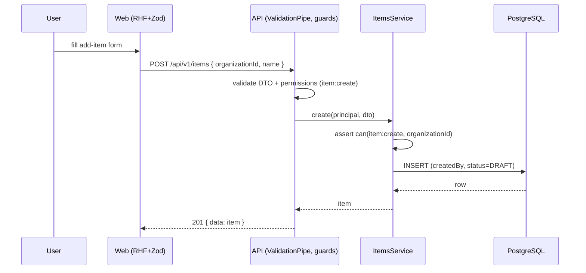

<!--
WORKED EXAMPLE — illustrates the delivery process (docs/PROCESS.md) end to end
for a GENERIC feature. It is NOT an approved spec and NO code has been written.
It shows how the feature-spec + implementation-plan templates are filled in,
including diagrams. Replace "Item" with your real entity when you build.
-->

# Feature Spec (EXAMPLE): Manage items

> ⚠️ **Illustrative only.** A deliberately domain-neutral example ("items"
> belonging to an organisation) that demonstrates the process on the base repo.
> Nothing here is implemented.

- **Status:** Draft (example)
- **Author(s):** Solution Architect (example)
- **Date:** 2026-07-09
- **Related ADR(s):** none (uses existing architecture; no new ADR needed)

## 1. Business understanding

**Problem.** An organisation needs to capture and browse a simple collection of
"items" (a stand-in for whatever your first real entity is) — create them, see
them in a list, and open one.

**Users.** Members of an organisation (roles per ADR-0012 / ADR-0016):
`ORG_ADMIN`/`PLANNER`/`CONTRIBUTOR` can create; `VIEWER` can only read.

**Primary use cases.** (1) Create an item; (2) list an organisation's items;
(3) view a single item.

**User journey (happy path).** A member opens the organisation → "Add item" →
enters a name (and optional details) → saves → the item appears in the list.

**Success criteria.** A user completes the primary action in < 30s (p90); list
p95 < 200ms.

**Open questions.** _Critical:_ none for the example. _Non-critical:_ what fields
does a real "item" need? **Default:** name + description + status; extend later.

## 2. Functional requirements

**US-1** — As a member, I want to create an item, so the organisation can track it.

- **Given** I'm a member of organisation O **when** I submit a valid item **then**
  it's created with status `DRAFT` and attributed to me.
- **Given** an invalid payload (empty name) **when** I submit **then** I get 422
  and nothing is saved.
- **Given** I'm only a `VIEWER` **when** I try to create **then** I get 403.

**US-2** — As a member, I want to list my organisation's items (newest-first,
paginated), with a designed empty state when there are none.

**Permissions.** `item:create` (ORG_ADMIN, PLANNER, CONTRIBUTOR); `item:read`
(all) — always checked **in the item's organisation** (anti-IDOR).

**Validation.** `name` 1–120 chars; `description` ≤ 2000; `status` in an enum.
Shared Zod (web) / class-validator (API).

**Error scenarios.**

| Scenario                         | Detection      | Result            | Status |
| -------------------------------- | -------------- | ----------------- | ------ |
| Not a member of the organisation | scope check    | forbidden message | 403    |
| Invalid payload                  | DTO validation | field errors      | 422    |
| Item not found                   | lookup         | not found         | 404    |

## 3. Technical analysis

| Area     | Impact | Notes                                                              |
| -------- | ------ | ------------------------------------------------------------------ |
| Frontend | med    | `items` list + create form, using DataTable/Form primitives        |
| Backend  | med    | new `items` module modelled on the reference template              |
| Database | med    | new `items` table; index on `(organization_id, status)`            |
| API      | med    | `POST /api/v1/items`, `GET /api/v1/items`, `GET /api/v1/items/:id` |
| Security | med    | `item:*` permissions + organisation scope; validated DTOs          |
| Testing  | med    | unit (service) + API e2e (Supertest) + web component/e2e           |

**Dependencies.** Authentication + organisation membership must exist first
(wire Better Auth into the seam), since items are organisation-scoped and gated.

## 4. Solution design

### Data flow (create)

### Database changes (design sketch — not committed)

Copy the reference model sketch
(`apps/api/examples/reference-feature/schema.reference.prisma`) and rename
`ReferenceItem` → `Item`: snake_case columns, UUID v7, `timestamptz`,
`organization_id` scope, soft delete, auditing, optimistic-locking `version`,
and `@@index([organization_id, status])`.

### API changes

| Method | Path                | Permission    | Returns                      |
| ------ | ------------------- | ------------- | ---------------------------- |
| POST   | `/api/v1/items`     | `item:create` | 201 `{ data: Item }`         |
| GET    | `/api/v1/items`     | `item:read`   | 200 `{ data: Item[], meta }` |
| GET    | `/api/v1/items/:id` | `item:read`   | 200 `{ data: Item }` / 404   |

### Implementation approach

Copy the **reference template** (`docs/REFERENCE_FEATURE.md`) for the backend
`items` module; build the frontend `items` feature per `FRONTEND_ARCHITECTURE.md`.

---

# Implementation Plan (EXAMPLE)

### Epic: First feature (walking skeleton)

#### Milestone: Create & view items

- **Task 1 — `items` model + migration.** (S) Copy the reference schema; rename;
  `prisma migrate dev`.
- **Task 2 — Items module (create/list/get).** (M) Copy the reference module;
  DTOs, scoped authz (`item:*`), pagination; unit + e2e tests; update API.md.
- **Task 3 — Items list route.** (M) DataTable + empty/loading/error states.
- **Task 4 — Add-item form.** (M) RHF + Zod, accessible Form primitive, mutation.

### Sequencing

Task 1 → 2 (backend slice) → 3 → 4 (UI slice). Each PR meets the Feature
Completion Criteria.

> Next step per the process: **get approval on this spec + plan before writing
> any code.**
