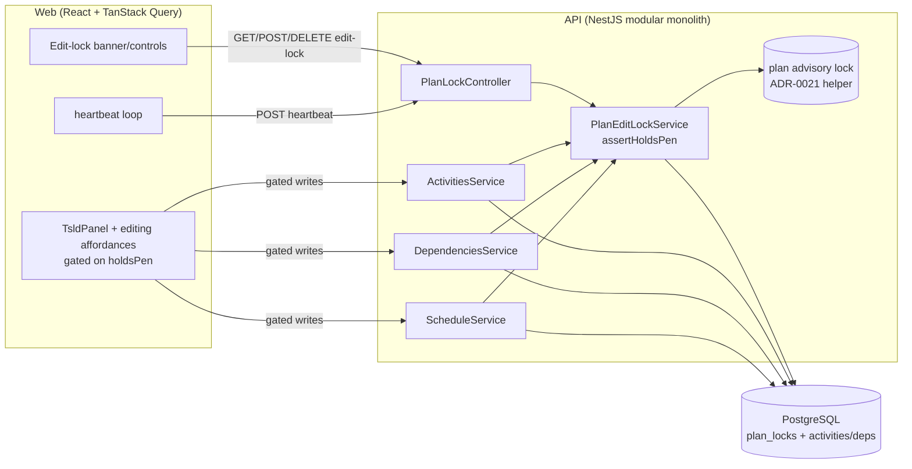
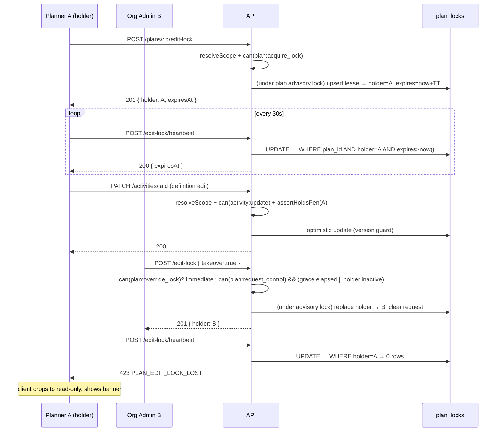

# Feature Spec: Single-editor plan edit-lock with clean hand-off

- **Status:** **Approved — critical questions answered (§1 Open questions), in build**
- **Author(s):** Feature Analyst (Claude Code)
- **Date:** 2026-07-11 (approved 2026-07-11)
- **Tracking issue / epic:** TBD
- **Roadmap link:** `docs/ROADMAP.md` backlog — "Plan edit-lock (single-editor hand-off)"; unblocks `docs/plans/tsld-canvas.md` Milestone 2 (structural editing, currently flag-gated on this feature).
- **Related ADR(s):** **ADR-0028 (new, to be authored — sketched in §4).** Composes with ADR-0012/0016 (RBAC + scope), ADR-0021 (plan advisory lock / DAG invariant), ADR-0022 (CPM recalc write model), ADR-0026 (TSLD canvas).

---

## 1. Business understanding

### Problem

SchedulePoint's entire on-canvas TSLD editing surface is **already built and
reviewed** — create-by-drag and dependency-draw (M2), free-2D reposition and
lane auto-pack (M4), and keyboard editing (M5) — but it sits dormant behind the
`VITE_TSLD_EDITING` flag, which is **off by default specifically because there is
no plan edit-lock yet** (see the block comment on `TSLD_EDITING_ENABLED` in
`apps/web/src/config/env.ts` and `docs/plans/tsld-canvas.md` M2: editing is
"enabled once the plan edit-lock lands"). Until concurrency is hardened, two
Planners editing the same plan would race — the interim posture is only the
optimistic-lock `version` 409 conflict banner, which prevents _lost data_ but
gives a poor, collision-heavy editing experience and no notion of _who currently
holds the pen_.

The brief makes this a **Must-have** (PROJECT_BRIEF §8): "Concurrent read;
single-editor plan lock with clean hand-off." The payoff of this feature is
therefore outsized: it is the **single remaining precondition** that lets a large
body of finished editing work ship to production.

### Users

Organisation-scoped roles (ADR-0016; `apps/api/src/common/auth/org-permissions.ts`):

- **Planner** — the primary editor. Builds/edits the schedule on the canvas.
  Needs to _take the pen_, know they hold it, and hand it over cleanly. Brief §5:
  "Planner … holds the edit lock." A Planner may also **request control** of a
  plan another Planner is holding: the holder is prompted to hand over, and if
  they don't respond within a short grace window (or their session is already
  inactive), the requester can take over — a graceful, peer-to-peer hand-off
  (Q-A answer).
- **Org Admin** — everything a Planner can do, plus the authority to **force take
  over immediately** — skipping the request/grace handshake — a lock a Planner
  left held (e.g. someone closed their laptop for the weekend mid-edit).
- **Contributor** — reports progress (status / % / actual dates) on a separate
  write path. Must **not** be blocked by, and must not block, a Planner's
  structural editing (brief §5, §10 weekly-progress journey).
- **Viewer / External Guest** — read-only; see _that_ a plan is being edited (and
  by whom) but never acquire the pen.

### Primary use cases

1. **Take the pen** — a Planner opens a plan and starts editing, acquiring an
   exclusive edit-lock on that plan.
2. **See the pen's state** — anyone viewing the plan sees whether it is free,
   who holds it, and (for a Planner) whether they can start editing.
3. **Hand off cleanly** — the holder stops editing (or leaves), releasing the
   lock so the next Planner can pick it up.
4. **Request control (peer hand-off)** — a second Planner asks the holder for the
   pen; the holder is prompted to hand over, and after a grace window (or if the
   holder is already inactive) the requester can take over.
5. **Recover a stuck lock** — a crashed/closed editor's lock auto-releases after
   a lease expiry; an Org Admin can also **force** take-over a live lock without
   waiting out the grace window.
6. **Be protected server-side** — the API rejects structural writes from anyone
   who does not currently hold the pen, distinctly from an optimistic conflict.

### User journeys

**Happy path (take → edit → release).** Planner opens a plan (read-only by
default). The header shows "No one is editing — **Start editing**". They click it;
the client acquires the lock and the canvas/editing affordances become live. A
background heartbeat keeps the lease alive while they work. When they click "Stop
editing" (or navigate away / close the tab), the lock is released and the plan
returns to read-only for everyone.

**Contended (graceful peer hand-off — Q-A).** A second Planner, Sam, opens the
same plan. The header shows "**Jane Doe is editing** (active just now)" and the
canvas is read-only for Sam, alongside a **Request control** button. Sam clicks
it; Jane's client shows "**Sam is requesting control — Hand over / Keep
editing**". If Jane clicks **Hand over**, the pen passes to Sam immediately. If
Jane keeps editing (or ignores the prompt), a short **grace window** (default
45 s) elapses and Sam's button becomes **Take over now**; taking over is audited
and drops Jane to read-only with a "control was taken over" banner. If Jane's
session was already inactive (missed heartbeats) when Sam requests, Sam can take
over without waiting out the grace window.

**Stuck lock (expiry / admin override).** Jane closes her laptop without
releasing. Her heartbeat stops; after the lease TTL the lock is **expired**. The
next Planner now sees "Jane Doe was editing (inactive) — **Start editing**" and
can reclaim it. Independently, an **Org Admin** can **Take over** even a _live,
active_ lock **immediately** — skipping the request/grace handshake (an audited
action); when they do, Jane's client drops to read-only with a "control was
taken over" banner and any in-flight edit is rejected non-destructively.

See §4 user-flow diagram.

### Expected outcomes

- The `VITE_TSLD_EDITING` flag's concurrency blocker is removed, so the dormant
  M2/M4/M5 editing surface can be enabled in production (subject to the _separate_
  a11y pre-enablement gate already noted in `env.ts` / TECH_DEBT #25 — this
  feature does not discharge that gate).
- Two people never structurally edit the same plan at once; hand-off is explicit
  and observable, not a race.
- Contributors' weekly progress cycle is unaffected (never blocked by a Planner
  holding the pen).

### Success criteria

- **≤ 1% conflict rate on the plan-lock hand-off** (PROJECT_BRIEF §7) — measured
  as edit-lock write rejections (423) per structural write attempt.
- A crashed/closed editor's lock is reclaimable within one lease TTL (default
  target ≤ 2 min) with **no operator intervention**.
- Lock status is reflected to other viewers within one poll interval (target
  ≤ 20 s, and immediately on window focus).
- Acquire/heartbeat/release add negligible latency (p95 < 50 ms; heartbeat is a
  single-row conditional `UPDATE`).
- No regression to the existing optimistic-lock (409) or recalc advisory-lock
  behaviour.

### Open questions — **RESOLVED at approval (2026-07-11)**

**CRITICAL (answers change design/scope):**

- **Q-A · Live-lock take-over policy.** **ANSWERED: _Any Planner_ can request /
  take over** (not the stated Org-Admin-only default). A Planner may **request
  control** of a live lock; the holder is prompted to hand over, and after a
  **grace window** (default 45 s) — or immediately if the holder is already
  inactive — the requester may **take over** (audited). **Org Admin** retains an
  **immediate** force take-over that skips the request/grace handshake. This
  brings the graceful Planner→Planner hand-off **into v1 scope** (it was the
  deferred option). New permission `plan:request_control` (Planner + Org Admin);
  `plan:override_lock` (Org Admin) now means _immediate_ override.
- **Q-B · Is `recalculate` gated by the edit-lock?** **ANSWERED: yes** — CPM
  recalculation (`schedule:calculate`, Planner/Org Admin) is a plan mutation that
  rewrites the engine-owned columns and is invoked by every TSLD edit flow, so it
  requires holding the pen. **Progress reporting stays lock-free** (see Q-C).
- **Q-C · Progress path exemption.** **ANSWERED: exempt** — the Contributor
  progress path (`activity:update_progress`) is **NOT** lock-gated. It is a
  distinct write path (status/%/actual dates only, no logic/date/structure
  change) guarded by optimistic `version`, and the weekly-progress cycle must run
  concurrently with a Planner holding the pen.

**Non-critical (defaults chosen; revisit later, no need to block):**

- **Acquire model:** explicit "Start editing" button (default), not auto-acquire
  on first edit gesture — clearer mental model, no accidental pen-grabbing on open.
- **Lock holder grain:** the **user** (not the browser session). The same user in
  two tabs both "hold" it (no self-lockout); single-editor-per-_user_.
- **Lease TTL / heartbeat cadence:** TTL 120 s, heartbeat every 30 s (tolerate ~3
  missed beats). Tunable via config.
- **Hand-off grace window / holder-inactive threshold:** grace 45 s (how long a
  requester waits before a peer take-over is allowed); "inactive" = last
  heartbeat older than the heartbeat cadence + tolerance (~90 s). Both server
  config. A holder past the inactive threshold can be taken over without waiting
  out the grace window.
- **Plan metadata edits** (name/description/status/calendar/`plannedStart` via the
  plan form) remain guarded by optimistic `version` only, **not** the edit-lock —
  the pen guards the _on-canvas schedule model_ (activities, dependencies,
  positions, recalculate). `plannedStart` (the data date) feeding CPM is noted but
  low-conflict and version-guarded.
- **Realtime transport:** polling (TanStack Query interval + refetch-on-focus) in
  v1; websockets deferred until real-time collab (a brief Could-have) lands.
- **Data model:** a dedicated `PlanLock` table, not columns on `Plan` (see §4).
- **Expired-row cleanup:** none needed in v1 (expired rows are harmless and
  reclaimed on next acquire); a sweeper is optional future tidy-up.

## 2. Functional requirements

### User stories & acceptance criteria

> **US-1** — As a **Planner**, I want to acquire an exclusive edit-lock on a plan,
> so that I can edit its schedule knowing no one else is editing it concurrently.
>
> - **Given** a plan whose lock is free (or expired) **when** I click "Start
>   editing" **then** the lock is granted to me, its lease is set, and the editing
>   surface becomes live.
> - **Given** the lock is held by another Planner with a _live_ lease **when** I
>   try to acquire **then** I get **423** with the current holder's identity and
>   the UI stays read-only.
> - **Given** I already hold the lock (same user, another tab) **when** I acquire
>   again **then** it succeeds and renews my lease (no self-lockout).

> **US-2** — As **any member/guest**, I want to see the plan's edit-lock state, so
> that I understand whether I can edit and who currently holds the pen.
>
> - **Given** I open a plan **then** I see one of: _free_ (and, if I'm a Planner,
>   a "Start editing" affordance), _held by <name> (active <relative time>)_, or
>   _previously held by <name> (inactive) — reclaimable_.
> - **Given** the lock state changes on the server **when** ≤ one poll interval
>   passes, or I focus the window **then** the displayed state updates.

> **US-3** — As the **lock holder**, I want my lease kept alive while I actively
> edit and released when I leave, so hand-off is clean without me thinking about it.
>
> - **Given** I hold the lock and the tab is open **then** a heartbeat renews the
>   lease on a fixed cadence.
> - **Given** I click "Stop editing", navigate away, or close the tab **then** the
>   lock is released (best-effort on close via `sendBeacon`; lease TTL is the
>   backstop).
> - **Given** my lease has been stolen or expired **when** my next heartbeat runs
>   **then** I get **423 `PLAN_EDIT_LOCK_LOST`**, the surface drops to read-only,
>   and I'm told control was lost.

> **US-4** — As a **Planner**, I want to request control of a plan another Planner
> is holding and take it over after a grace window, so hand-off is possible without
> an admin when the holder has stepped away but their lease hasn't expired.
>
> - **Given** a plan held by another Planner with a live lease **when** I click
>   "Request control" **then** a pending request is recorded and the holder is
>   prompted to hand over.
> - **Given** the holder clicks "Hand over" **then** the pen passes to me
>   immediately and their client drops to read-only.
> - **Given** the holder neither hands over nor releases **when** the grace window
>   (default 45 s) elapses — **or** the holder is already inactive (missed
>   heartbeats) when I request — **then** "Take over now" becomes available; taking
>   over is audited and demotes the previous holder on their next poll/heartbeat/write.

> **US-4a** — As an **Org Admin**, I want to force take over a live lock
> immediately, so a plan left held by an absent editor is recovered without waiting
> out the grace window.
>
> - **Given** a plan held by another user **when** I choose "Take over" and confirm
>   **then** I acquire the lock at once (no grace wait), the event is audited, and
>   the previous holder's client is demoted to read-only on its next
>   poll/heartbeat/write.

> **US-5** — As a **Contributor**, I want to report progress regardless of who
> holds the edit-lock, so the weekly progress cycle is never blocked.
>
> - **Given** a Planner holds the pen **when** I submit a progress update
>   (`activity:update_progress`) **then** it succeeds (subject only to optimistic
>   `version`), never a 423.

> **US-6** — As the **API**, I want to reject structural writes from non-holders,
> so the single-writer invariant is server-authoritative, not merely a UI state.
>
> - **Given** I do not hold the pen **when** I call any gated write (activity
>   create/update/delete/restore, positions batch, dependency create/update/delete,
>   schedule recalculate) **then** I get **423 `PLAN_EDIT_LOCK_REQUIRED`**, and
>   nothing is written.
> - **Given** I hold the pen but send a stale row `version` **then** I still get
>   the existing **409** optimistic conflict — the two are distinct.

### Workflows

1. **Acquire:** resolve org scope → check `plan:acquire_lock` → under the plan
   advisory lock, read the lock row → if absent/expired/mine, upsert my lease
   (200/201); if live-and-not-mine, 423 (unless a take-over path below applies).
2. **Heartbeat (holder):** conditional single-row `UPDATE … WHERE plan_id AND
holder_user_id AND expires_at > now()` setting new `heartbeat_at`/`expires_at`;
   rowcount 0 → 423 `PLAN_EDIT_LOCK_LOST`. The response echoes any pending
   `requestedBy` so the holder is prompted to hand over.
3. **Release / hand-off:** holder deletes the lock row → 204 (**release**); or the
   holder hands directly to a pending requester (**hand-off**) → the requester's
   next acquire succeeds. Org Admin may force-release.
4. **Request control (Planner):** check `plan:request_control` → under the advisory
   lock, if the lock is live-and-not-mine, stamp `requested_by`/`requested_at`
   (newest request wins) → 200 with the holder + request state. No pen transfer yet.
5. **Take over:** acquire with `takeover: true`. Permitted when **either** the
   caller has `plan:override_lock` (Org Admin — _immediate_), **or** the caller has
   `plan:request_control` **and** (the holder is inactive, i.e. past the heartbeat
   tolerance, **or** the caller's own pending request has aged past the grace
   window). Under the advisory lock, replace the holder; audit; previous holder
   learns via next poll/heartbeat/write. Otherwise 423 (must request / wait).
6. **Gated write:** existing service flow (resolve scope → `assertCan`) → **new
   `assertHoldsPen`** → write. For graph writes that already take the advisory
   lock (dependency create, recalc), the assertion runs inside that lock.

### Edge cases

- **Same user, two tabs:** both hold (holder = user); heartbeats from either renew;
  writes from either pass. Acceptable single-editor-per-user semantics.
- **Crashed/closed browser:** no release fires; lease expires after TTL; next
  Planner reclaims. No sweeper required.
- **Steal mid-edit:** displaced holder's in-flight mutations return 423
  non-destructively (nothing applied) — mirrors the existing 409 handling; the
  client never silently replays. Auto-arrange (a single all-or-nothing batch) is
  already atomic.
- **Plan soft-deleted while locked:** gated writes 404; the lock row is
  irrelevant and cascades/ignored; on restore the lock is free.
- **Membership revoked while holding:** next heartbeat/write fails authz (403);
  lease expires by TTL.
- **Clock/lease boundary:** expiry is evaluated server-side against `now()`; the
  client's countdown is advisory only.
- **Acquire races (two Planners click simultaneously):** serialised by the plan
  advisory lock; exactly one wins, the other gets 423.

### Permissions

Map to RBAC + org scope (ADR-0012; deny-by-default). **New permission codes:**

| Permission             | Granted to         | Guards                                                                        |
| ---------------------- | ------------------ | ----------------------------------------------------------------------------- |
| `plan:acquire_lock`    | Planner, Org Admin | acquire / heartbeat / release own lock; hand off to a requester               |
| `plan:request_control` | Planner, Org Admin | request control of a live lock; take over after grace / holder inactive (Q-A) |
| `plan:override_lock`   | Org Admin only     | **immediate** force take-over of a live lock (skips grace); force-release     |
| `plan:read` (exists)   | every member       | read lock status                                                              |

All checks are evaluated **in the plan's organisation** (anti-IDOR), exactly like
the existing hierarchy checks. Gated write endpoints keep their current permission
(`activity:*`, `dependency:*`, `schedule:calculate`) **and additionally** require
holding the pen. `activity:update_progress` is deliberately **not** pen-gated.

### Validation rules

- `takeover` (acquire body): optional boolean, default `false`. Shared Zod (web) /
  class-validator (API). Whether it is _permitted_ is decided server-side by
  permission + lock state (never trusted from the client).
- No free-text input in this feature; all identifiers are path UUIDs validated by
  the existing `ParseUuidPipe`. The request-control endpoint takes no body.
- Lease TTL / heartbeat cadence **and the hand-off grace window** are **server
  config**, never client input (a client cannot request a longer lease or a
  shorter grace).

### Error scenarios

| Scenario                                                   | Detection                              | User-facing result                                                       | Status                            |
| ---------------------------------------------------------- | -------------------------------------- | ------------------------------------------------------------------------ | --------------------------------- |
| Not a member of the org / plan not found                   | scope resolution                       | friendly not-found                                                       | 404                               |
| Lacks `plan:acquire_lock`                                  | permission check                       | forbidden message                                                        | 403                               |
| Acquire while another holds a **live** lease               | lock-row read under adv. lock          | "Jane is editing" — read-only, offer Request control / (admin) Take over | **423**                           |
| Take over before grace elapsed & holder still active       | grace/inactivity check under adv. lock | "Requested — waiting for Jane (Ns)"; Take-over not yet allowed           | **423** `PLAN_EDIT_LOCK_HELD`     |
| Structural write without holding the pen                   | `assertHoldsPen`                       | "You're not the editor — Start editing" banner                           | **423** `PLAN_EDIT_LOCK_REQUIRED` |
| Heartbeat/write after lease stolen or expired              | conditional update rowcount 0          | "Control was taken over / timed out" → read-only                         | **423** `PLAN_EDIT_LOCK_LOST`     |
| Stale row `version` while holding the pen                  | optimistic `updateMany` count 0        | existing "changed elsewhere — refresh"                                   | 409                               |
| Request control / take-over without `plan:request_control` | permission check                       | forbidden                                                                | 403                               |
| Immediate override without `plan:override_lock`            | permission check                       | forbidden (Planners must request + wait out grace)                       | 403                               |

**423 Locked** is introduced specifically so lock-precondition failures are
**distinct** from 409 optimistic conflicts on the wire and in the UI.

**Staged rollout of enforcement.** The `assertHoldsPen` write-gate ships behind a
server flag `PLAN_EDIT_LOCK_ENFORCED` (default **off**). The activities-table CRUD,
dependency editor, and recalculate flows are already shipped and **flag-on** (only
the TSLD canvas is behind `VITE_TSLD_EDITING`), and none acquire a lock yet — so
enforcing the gate unconditionally would 423 live functionality. M1 therefore lands
the full mechanism dormant; enforcement is flipped on only once the front end
acquires the pen across every editing entry point (M2/M3).

## 3. Technical analysis

| Area           | Impact | Notes                                                                                                                                                                                                  |
| -------------- | ------ | ------------------------------------------------------------------------------------------------------------------------------------------------------------------------------------------------------ |
| Frontend       | med    | New `features/plan-lock/` (status query with poll, acquire/release/heartbeat mutations, banner + controls). Gate existing editing affordances on `holdsPen`. Distinct 423 handling.                    |
| Backend        | med    | New `plan-lock` module (controller→service→repository) modelled on the reference template; shared `PlanEditLockService.assertHoldsPen` injected into activities/dependencies/schedule services.        |
| Database       | med    | One new `PlanLock` table (1:1 with plan via PK). No change to `Plan`. Additive migration; no backfill.                                                                                                 |
| API            | med    | New `edit-lock` sub-resource (GET/POST/heartbeat/DELETE). Gated writes gain a 423 response; documented in OpenAPI + `docs/API.md`.                                                                     |
| Security       | high   | New permissions + scope; deny-by-default; audited override; server-authoritative single-writer invariant; no new secrets.                                                                              |
| Performance    | low    | Heartbeat = one indexed single-row UPDATE; status = one PK read; acquire reuses the existing plan advisory lock. Poll interval bounded.                                                                |
| Infrastructure | low    | No new services (no Redis/websocket needed for v1). Two config values (TTL, heartbeat).                                                                                                                |
| Observability  | med    | Structured audit logs for acquire/release/heartbeat-loss/override/expiry (brief §13 requires lock events audited ≥ 1 year — v1 via structured logs; a dedicated audit-log table remains future scope). |
| Testing        | high   | Unit (lock state machine, expiry, steal), API e2e (acquire/contend/heartbeat/steal/gated-write 423 vs 409), web component + Playwright hand-off journey + a11y of the banner/controls.                 |

### Dependencies

- **Prerequisite (already in place):** Plans module + `Plan` model; the plan
  advisory-lock helper (`common/db/plan-advisory-lock.ts`, ADR-0021); optimistic
  locking; RBAC principal + `org-permissions.ts`; the domain-error → HTTP filter.
- **Foundational change:** add a `LockedError` (→ **423**) to `common/errors/` and
  the `all-exceptions.filter.ts` status map, plus shared error-reason constants in
  `@repo/types`.
- **Unblocks:** `VITE_TSLD_EDITING` enablement (this feature is its named
  precondition); does **not** by itself flip the flag (the a11y gate in `env.ts` /
  TECH_DEBT #25 is separate).
- **Separate feature — do not couple:** **Undo/redo** (a distinct Must-have). The
  edit-lock is undo/redo's precondition (a coherent per-user undo stack assumes a
  single writer), but it is scoped and shipped independently.

## 4. Solution design

### Architecture overview

The edit-lock is a **third, distinct concurrency concept** layered above the two
that already exist — it does not replace either:

| Layer                  | Mechanism                               | Grain                 | Purpose                                                         |
| ---------------------- | --------------------------------------- | --------------------- | --------------------------------------------------------------- |
| Integrity              | optimistic `version` (409)              | per row               | prevents lost updates — the **hard** guarantee (unchanged)      |
| Serialization          | `pg_advisory_xact_lock` (ADR-0021/0022) | per plan, per txn     | serialises graph writes/recalc within a transaction (unchanged) |
| **Coordination (new)** | **`PlanLock` lease + 423 write-gate**   | per plan, per session | **"who holds the pen"** — human-facing single-writer hand-off   |



### Data flow

**Acquire, gated write, and steal:**



**Peer request-control hand-off (Q-A):**

```mermaid
sequenceDiagram
  participant P1 as Planner A (holder)
  participant P2 as Planner B (requester)
  participant API
  participant DB as plan_locks
  P2->>API: POST /edit-lock/request
  API->>API: can(plan:request_control), lock live & not mine
  API->>DB: (under adv. lock) set requested_by=B, requested_at=now()
  API-->>P2: 200 { holder: A, requestedBy: B }
  Note over P1: next heartbeat/poll surfaces "B is requesting control"
  alt A hands over
    P1->>API: POST /edit-lock/handoff
    API->>DB: replace holder → B, clear request
    API-->>P1: 200 { holder: B }
  else A ignores; grace elapses (or A already inactive)
    P2->>API: POST /edit-lock { takeover:true }
    API->>DB: (grace elapsed) replace holder → B, clear request, AUDIT
    API-->>P2: 201 { holder: B }
  end
```

### User flow

```mermaid
flowchart TD
  Open[Open plan] --> St{Lock state?}
  St -- free/expired --> CanEdit{Planner?}
  CanEdit -- no --> RO[Read-only view]
  CanEdit -- yes --> Start[Show: Start editing]
  Start --> Acq[Click Start editing] --> Hold[Holding the pen:<br/>editing live + heartbeat]
  Hold --> Stop[Stop editing / leave / close]
  Stop --> Rel[Release] --> Free[Lock free]
  St -- held by other (live) --> Other[Read-only:<br/>"Name is editing"]
  Other --> Admin{Org Admin?}
  Admin -- yes --> Take[Take over (confirm, audited)] --> Hold
  Admin -- no --> Wait[Wait for release/expiry] --> St
  Hold -. stolen/expired .-> Lost[423 lost → read-only banner]
```

### Database changes

New table `plan_locks` (follows `docs/DATABASE.md`: snake_case, UUID/TEXT ids,
`timestamptz`). It intentionally **does not** live on `Plan`: frequent heartbeat
writes must not touch `Plan.version`/`updated_at` (they would masquerade as plan
edits and collide with plan-metadata optimistic locking — the same separation
principle ADR-0022 applies to engine-owned columns).

```
model PlanLock {
  planId          String    @id @map("plan_id") @db.Uuid        // PK ⇒ one lock per plan (the invariant)
  organizationId  String    @map("organization_id") @db.Uuid    // denormalised for scoped reads/audit
  holderUserId    String    @map("holder_user_id")              // Better Auth id = TEXT
  acquiredAt      DateTime  @map("acquired_at") @db.Timestamptz(3)
  heartbeatAt     DateTime  @map("heartbeat_at") @db.Timestamptz(3)
  expiresAt       DateTime  @map("expires_at") @db.Timestamptz(3)
  requestedByUserId String? @map("requested_by_user_id")        // pending peer request-control (Q-A); TEXT
  requestedAt     DateTime? @map("requested_at") @db.Timestamptz(3) // when the grace window started
  createdAt       DateTime  @default(now()) @map("created_at") @db.Timestamptz(3)
  updatedAt       DateTime  @updatedAt @map("updated_at") @db.Timestamptz(3)

  plan Plan @relation(fields: [planId], references: [id], onDelete: Cascade)
  @@index([organizationId])
  @@map("plan_locks")
}
```

- **Presence = held; absence = free.** No per-plan backfill for existing plans.
- `requested_by_user_id` / `requested_at` hold at most one **pending** peer
  request (newest wins). They are cleared whenever the holder changes (acquire /
  take-over / release), so a stale request never carries across a hand-off. The
  grace window is `now() − requested_at ≥ HANDOFF_GRACE_MS`.
- An expired row (`expires_at < now()`) is treated as free and overwritten on the
  next acquire — no sweeper needed in v1.
- Design with the **database-architect** agent before writing the migration
  (confirm the `Plan.planLock?` back-relation and the `onDelete` choice against the
  hierarchy soft-delete/cascade conventions).

### API changes

New sub-resource under a plan (envelopes per `docs/API.md`):

| Method | Path                                             | Permission                                                  | Returns / errors                                                                                                                                   |
| ------ | ------------------------------------------------ | ----------------------------------------------------------- | -------------------------------------------------------------------------------------------------------------------------------------------------- |
| GET    | `/api/v1/organizations/:org/plans/:id/edit-lock` | `plan:read`                                                 | 200 `{ data: LockStatus }` (free/held/expired, holder, isMine, requestedBy, canAcquire, canRequest, canTakeOver, canOverride)                      |
| POST   | `/api/v1/organizations/:org/plans/:id/edit-lock` | `plan:acquire_lock`                                         | 201 `{ data: LockStatus }` · 423 held (with `takeover:true`: needs `plan:override_lock` **or** `plan:request_control` after grace/holder-inactive) |
| POST   | `…/plans/:id/edit-lock/heartbeat`                | `plan:acquire_lock`                                         | 200 `{ data: LockStatus }` (echoes pending `requestedBy`) · 423 `PLAN_EDIT_LOCK_LOST`                                                              |
| POST   | `…/plans/:id/edit-lock/request`                  | `plan:request_control`                                      | 200 `{ data: LockStatus }` (records pending request) · 423 if free/mine (nothing to request)                                                       |
| POST   | `…/plans/:id/edit-lock/handoff`                  | `plan:acquire_lock` (holder)                                | 200 `{ data: LockStatus }` — release to the pending requester · 409 if no pending request                                                          |
| DELETE | `…/plans/:id/edit-lock`                          | `plan:acquire_lock` (holder) / `plan:override_lock` (force) | 204                                                                                                                                                |

**Gated write endpoints (add 423, keep existing behaviour):** `POST plans/:id/activities`,
`PATCH/DELETE/POST activities/:aid[/restore]`, `PATCH plans/:id/activities/positions`,
`POST plans/:id/dependencies`, `PATCH/DELETE dependencies/:did`,
`POST plans/:id/schedule/recalculate`. **Not gated:** `PATCH activities/:aid/progress`,
all reads, plan-metadata `PATCH plans/:id`.

Shared types in `@repo/types`: `LockStatus` DTO, the error `code` (`LOCKED`) and
`reason` union (`PLAN_EDIT_LOCK_REQUIRED | PLAN_EDIT_LOCK_HELD | PLAN_EDIT_LOCK_LOST`).
`PLAN_EDIT_LOCK_HELD` covers both a plain contended acquire and a premature
take-over (grace not yet elapsed / holder still active). Add `LockedError` (→ 423)
to `common/errors/domain-errors.ts` + the filter's `domainStatus`/`statusCode` map
(`423 → 'LOCKED'`).

### Component changes

- New `apps/web/src/features/plan-lock/`: `usePlanEditLock` (query, poll interval +
  `refetchOnWindowFocus`), `useAcquireLock` / `useReleaseLock` / `useLockHeartbeat`
  (interval effect while holding; release-on-unmount + `beforeunload`
  `navigator.sendBeacon`), `useRequestControl` / `useHandoff` / `useTakeOver`, and
  an `EditLockControls`/`EditLockBanner` component (design-system Button/Badge/Alert;
  states: free-can-edit, holding, holding-with-pending-request (Hand over / Keep),
  held-by-other (Request control → Take over now once grace elapses),
  expired-reclaimable; Org-Admin "Take over" immediate, with a confirm dialog). A
  requester's countdown to "Take over now" is advisory — the server is authoritative.
- `plan-detail.tsx`: derive `holdsPen` from the lock query and pass
  `canEdit = canManageHierarchy(role) && holdsPen` into `TsldPanel` and the other
  editing affordances (`CreateActivityButton`, activities-table edit,
  `RecalculateButton`, `DependencyEditor` write). Progress affordances stay keyed
  on `canReportProgress` only.
- Distinct 423 handling: extend the existing conflict-banner pattern
  (`features/tsld/components/EditConflictBanner.tsx`) so a `LOCKED` response drops
  the surface to read-only and invalidates the lock query — visibly different copy
  from the 409 "changed elsewhere" path.
- No one-off styling; reuse tokens/components. Cover loading/empty/error/held
  states. WCAG 2.2 AA: the banner is a polite live-region; controls are keyboard
  operable with visible focus; the take-over confirm is a proper dialog.

### Implementation approach & alternatives

**Chosen:** a dedicated `PlanLock` table with a lease (heartbeat + TTL) **and**
explicit release, a server-authoritative **write-gate** (`assertHoldsPen` → 423)
injected into the existing write services, acquire/steal serialised by **reusing
the existing plan advisory lock**, a **peer request-control hand-off** (request →
grace window → take-over, with immediate override for Org Admins), and **polling**
for status propagation. This maximally reuses in-place machinery (advisory-lock
helper, optimistic locking, RBAC, error filter, reference-template module shape)
and keeps the three concurrency concerns cleanly separated.

**On the peer hand-off (Q-A):** the request/grace/take-over handshake is modelled
with two nullable columns on the same row (no second table, no timers/jobs) —
"grace elapsed" is a pure `now() − requested_at` comparison evaluated on the next
take-over attempt, so there is nothing to schedule or sweep. It reuses the same
advisory-lock critical section as acquire, so a request, a hand-off, and a
take-over can never interleave inconsistently.

**Alternatives considered:**

- **Lock columns on `Plan` (raw-SQL heartbeat bypassing `version`).** Works, but
  every plan read carries lock columns and heartbeats still write the `Plan` row
  (row-lock contention with metadata edits). A separate table is cleaner and
  mirrors ADR-0022's derived-vs-edited separation. _Rejected._
- **Lease-only (no explicit release) or release-only (no lease).** Lease-only
  leaves a just-departed editor's plan locked for a full TTL (poor hand-off);
  release-only never recovers from a crash. **Both** (explicit release + TTL
  backstop) gives clean hand-off _and_ crash recovery. _Chosen._
- **Guard/decorator (`@RequiresPlanEditLock`) instead of a service call.** A guard
  can't cheaply resolve the plan id for the _flat_ activity/dependency routes
  (id is derived from the resource), and service-layer authority matches the
  codebase (checks live in services, not only guards). _Rejected in favour of
  `assertHoldsPen` in the services._
- **Websockets / Redis pub-sub for realtime.** Right answer once multi-editor
  real-time collab lands (brief Could-have), but disproportionate for a
  single-writer lock at v1 scale. Polling meets the ≤ 20 s propagation target with
  zero new infrastructure. _Deferred (documented escape hatch)._

**ADR-0028 sketch (architecturally significant — author before build):**

> **Title:** Single-editor plan edit-lock (advisory lease + peer hand-off + server-side write gate).
> **Context:** Brief Must-have; the sole precondition to enabling the built TSLD
> editing surface; must compose with — not replace — optimistic locking (ADR-0022)
> and the plan advisory lock (ADR-0021). **Decision:** a `PlanLock` lease table
> (presence = held, PK enforces one-per-plan), heartbeat + TTL with explicit
> release, holder = user, a 423 `LockedError` write-gate (`assertHoldsPen`) on
> structural/logic/recalc writes, progress path exempt, acquire/steal serialised
> by the existing advisory lock, polling for propagation. **Hand-off (Q-A):** any
> Planner may **request control**; after a grace window (or if the holder is
> inactive) the requester may **take over**; Org Admin may **override
> immediately**. Modelled with two nullable request columns on the same row and a
> pure `now() − requested_at` grace comparison — no timers, jobs, or second table.
> All take-overs audited. **Alternatives:** columns-on-Plan; lease-only/release-only;
> guard-only; websockets; Org-Admin-only steal (rejected per Q-A) — as above.
> **Consequences:** three explicit concurrency layers; unblocks `VITE_TSLD_EDITING`;
> introduces 423 to the API vocabulary; a dedicated audit-log table and websocket
> propagation remain future work.

## 5. Links

- Implementation plan: `docs/features/plan-edit-lock/implementation-plan.md`
- Reference template: `docs/REFERENCE_FEATURE.md`,
  `apps/api/examples/reference-feature/`
- Composes with: ADR-0012/0016, ADR-0021, ADR-0022, ADR-0026;
  `docs/plans/tsld-canvas.md`; `apps/web/src/config/env.ts` (`TSLD_EDITING_ENABLED`)
- Docs to update on build: `docs/API.md`, `docs/DATABASE.md`, `docs/adr/` (new
  ADR-0028), `docs/ROADMAP.md`, `CLAUDE.md` §16 ADR list, `docs/TECH_DEBT.md` #25.
