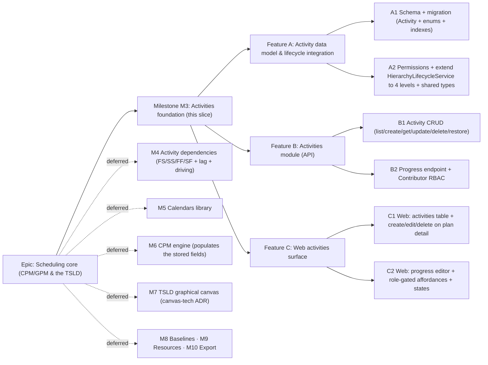

# Implementation Plan: Activities foundation

- **Feature spec:** [`docs/specs/activities-foundation.md`](../specs/activities-foundation.md)
- **Status:** Approved (2026-07-10) — building A1→C2 with the four recommended defaults.
- **Owner:** Claude

## Breakdown

### Epic

**Scheduling core (CPM/GPM & the TSLD)** — deliver the schedule model and engine
that make SchedulePoint a scheduling tool: activities, logic, calendars,
constraints, the CPM/GPM computation, and the Time-Scaled Logic Diagram that
draws it. Maps to the flagship theme in PROJECT_BRIEF §8 (Must-have). This plan
covers **only its first milestone (M3, Activities foundation)**; the later
milestones are named for sequencing but **not specced here**:

- **M4 — Activity dependencies:** `ActivityDependency` (FS/SS/FF/SF + lag +
  lag-unit + `is_driving`) between activities in a plan; unblocks the network.
- **M5 — Calendars library:** org-level calendars, per-plan default, per-activity
  override (wires up the `calendar_id` column reserved in M3).
- **M6 — CPM engine:** forward/backward pass, total float, critical + near-critical
  — **populates the engine-owned columns M3 persists** (a write-path addition, no
  wide migration, thanks to M3).
- **M7 — TSLD graphical canvas:** the primary edit surface; its **rendering tech
  (Canvas 2D vs WebGL) is a deferred ADR** (PROJECT_BRIEF §15). Consumes
  `lane_index` from M3.
- **M8/M9/M10 — Baselines · Resources · Export:** all snapshot/assign/emit the
  `Activity` M3 delivers.

### Milestone: M3 — Activities foundation (shippable slice)

**Outcome:** a Planner (or Org Admin) can create, browse, edit, delete and restore
activities within a plan — deny-by-default, org-scoped, IDOR-safe, cascade-aware —
via an activities **table** on the plan-detail screen; a **Contributor** can
update progress (status / % complete / actual dates) but not logic; Viewers browse
read-only. The `Activity` model persists the full field set (type, duration,
calendar ref, progress, constraints, CPM outputs, lane) so M4–M10 are additive.
`main` stays releasable after every task (each is an additive vertical slice).

---

#### Feature A: Activity data model & lifecycle integration

> **Description:** The `Activity` model + `ActivityType`/`ActivityStatus`/
> `ConstraintType` enums and migration; the new permission codes (incl.
> `activity:update_progress`); **extending the shared `HierarchyLifecycleService`
> from three levels to four** so cascade delete/restore include activities; the
> `@repo/types` contracts. The foundation the module and UI build on.
> **Complexity:** M
> **Dependencies:** the hierarchy slice (Client → Project → **Plan**) on `main`.
> **Risks:** the lifecycle change touches shared, already-shipped code → full
> **regression** coverage of the existing client/project/plan cascade; partial
> indexes must be raw SQL; CPM columns must be nullable/defaulted and excluded from
> write DTOs (engine-owned); `created_by`/`updated_by` must be **TEXT**.
> **Testing requirements:** migration applies cleanly on real Postgres in CI; unit
> tests for the 4-level cascade/restore (activities included; batch semantics;
> top-down `PARENT_DELETED`; **regression: 3-level cascade unchanged**) and the
> role→permission map (progress granted to Contributor+; definition write not).

##### Task A1 — Schema + migration for `Activity` (≈ one PR)

- **Description:** Add the `Activity` model + the three enums to `schema.prisma`
  (UUID v7, snake_case, denormalised `organization_id`, `plan_id` FK `RESTRICT`,
  full field set incl. engine-owned CPM columns and `lane_index`, audit with
  **TEXT** `created_by`/`updated_by`, soft delete, `version`, `delete_batch_id`);
  add the `Plan.activities` back-relation; write the migration including the
  **raw-SQL partial-unique** name & code indexes (`WHERE deleted_at IS NULL`
  [`AND code IS NOT NULL`]) and the scope/parent indexes. No app behaviour yet.
- **Complexity:** M
- **Dependencies:** none (first task)
- **Risks:** Prisma cannot express partial indexes → raw SQL mirroring
  `uq_plans_project_name`; date-only fields must be `@db.Date` (not timestamptz);
  don't over-index the 2,000-row-per-plan ceiling — finalise the set with
  **database-architect**.
- **Testing:** migration up/down on real Postgres in CI; schema snapshot/typegen
  check; repository-level unit that the active filter excludes soft-deleted rows.
- **Development steps:**
  1. `Activity` model + `ActivityType`/`ActivityStatus`/`ConstraintType` enums +
     `Plan.activities` relation in `schema.prisma`; `prisma migrate dev`.
  2. Hand-edit the migration to add partial-unique (name, code) + scope/parent +
     `delete_batch_id` indexes (raw SQL).
  3. Update `docs/DATABASE.md` (Activity model, engine-owned columns, reserved
     `calendar_id`, 4-level cascade note); changeset.

##### Task A2 — Permissions, lifecycle extension & shared types (≈ one PR)

- **Description:** Extend `common/auth/org-permissions.ts` — add all `activity:*`
  codes to `HIERARCHY_READ`/`HIERARCHY_WRITE`, add a new `PROGRESS_WRITE` set
  (`activity:update_progress`) granted to `CONTRIBUTOR`/`PLANNER`/`ORG_ADMIN`.
  **Extend `HierarchyLifecycleService` to a fourth level** (`'activity'`): activity
  is a leaf lifecycle entity (its own delete/restore) and is included in the
  cascade of client/project/plan deletes and in `restoreBatch`. Add
  `ActivitySummary`/`ActivityType`/`ActivityStatus`/`ConstraintType` to
  `packages/types` (const arrays as source-of-truth, à la `ORGANIZATION_ROLES`).
- **Complexity:** M
- **Dependencies:** A1
- **Risks:** editing shared, shipped lifecycle code → **regression** the 3-level
  cascade; keep the helper entity-agnostic (no fourth divergent copy); the whole
  cascade/restore stays in one `$transaction`; `assertParentActive` for an activity
  checks its parent **plan**.
- **Testing:** unit — plan delete now also soft-deletes its active activities in
  the same batch; client/project delete cascades down to activities; restore
  returns the activities; `PARENT_DELETED` when the plan is still deleted;
  **regression tests for the existing client/project/plan cascade still pass**;
  role→permission map (Contributor has read+progress only, not definition write).
- **Development steps:**
  1. Permission codes + `PROGRESS_WRITE` set in `org-permissions.ts`; unit the map.
  2. Extend `HierarchyLifecycleService` (`HierarchyEntity` +`'activity'`; cascade
     paths for client/project/plan include activities; leaf activity delete/restore);
     unit + regression tests.
  3. `@repo/types` contracts; changeset.

---

#### Feature B: Activities module (API)

> **Description:** The `activities` module — nested list/create under a plan, flat
> get/update/**progress**/delete/restore by id — the org-scoped CRUD plus the
> progress-vs-logic RBAC split.
> **Complexity:** L
> **Dependencies:** Feature A.
> **Risks:** IDOR on activity id → always load `findActive(id, organizationId)`;
> 404 (not 403) for non-members via `resolveScope`; name/code uniqueness under
> concurrency → DB partial-unique mapped to 409; the progress DTO must be
> **whitelisted** so a definition field cannot leak through.
> **Testing requirements:** unit (scope, name/code uniqueness, milestone/duration
> & constraint cross-field rules, optimistic lock, progress-field whitelist,
> restore/`PARENT_DELETED`); API e2e (CRUD, progress RBAC matrix, IDOR 404 matrix,
> 409s, cascade+restore round-trip with the plan).

##### Task B1 — Activity CRUD (list/create/get/update/delete/restore) (≈ one PR)

- **Description:** Copy the reference module + the `plans` module → `activities`:
  `PlanActivitiesController` (`…/plans/:planId/activities` list/create) and
  `ActivitiesController` (`…/activities/:activityId` get/patch/delete +
  `…/restore`); `ActivitiesService` (reuse `resolveScope`, `PlanRepository` to
  load the active parent plan, `assertCan`, the lifecycle helper);
  `ActivityRepository` (active filter, versioned definition update, scoped loads);
  `CreateActivityDto`/`UpdateActivityDto` (+ cross-field validators) and
  `ActivityResponseDto.from()`.
- **Complexity:** L
- **Dependencies:** A2
- **Risks:** transaction correctness for delete/restore → one `$transaction` via
  the helper; copy `organization_id` from the parent plan, never from input;
  milestone⇒duration-0 and constraintType⇔constraintDate enforced in the DTO.
- **Testing:** unit (authz, name/code→409, stale version→409, milestone/constraint
  422s, soft-delete, restore, `PARENT_DELETED` when plan deleted); API e2e
  (201+Location, list only in-scope, 404 for non-member/foreign id/foreign plan,
  delete→gone, restore round-trip, delete-plan cascades to activities).
- **Development steps:**
  1. DTOs (+ cross-field validators), repository, service, both controllers, module.
  2. Delete/restore via the extended lifecycle helper; audit logs.
  3. OpenAPI/`docs/API.md`; changeset.

##### Task B2 — Progress endpoint + Contributor RBAC (≈ one PR)

- **Description:** Add `PATCH …/activities/:activityId/progress` guarded by
  `activity:update_progress`, with `UpdateActivityProgressDto` (status?,
  percentComplete?, actualStart?, actualFinish? + version) validated with
  `whitelist + forbidNonWhitelisted` so a definition field is a 422; a service
  `updateProgress` doing the optimistic-locked update over progress fields only;
  audit entry distinct from a definition update.
- **Complexity:** M
- **Dependencies:** B1
- **Risks:** the RBAC split is the security-critical part → e2e that a Contributor
  can change **only** progress and a definition field is rejected (403 at the
  definition route, 422 at the progress route); a Viewer is 403 on both.
- **Testing:** unit (progress whitelist, range/date validation, optimistic lock);
  API e2e (Contributor updates progress ✓; Contributor definition PATCH → 403;
  definition field to progress route → 422; Viewer → 403; version conflict → 409).
- **Development steps:**
  1. `UpdateActivityProgressDto` + service `updateProgress` + controller route.
  2. Audit + structured log for progress updates.
  3. OpenAPI/`docs/API.md`; changeset.

---

#### Feature C: Web activities surface

> **Description:** The `features/activities` folder and the activities **table**
> mounted on the existing plan-detail route, with create/edit/delete for writers
> and a progress editor for Contributors — reusing the design-system primitives
> and the hierarchy feature patterns. **No new route.**
> **Complexity:** L
> **Dependencies:** Features B (the APIs) + the existing `plan-detail` route.
> **Risks:** deep-linking to a deleted/foreign plan already handled by the plan
> route loader; optimistic UI vs 409 → conflict toast + refetch; a11y of
> table/dialogs/menus → primitives + axe; the placeholder region must be cleanly
> replaced (it is the seam the TSLD canvas supersedes later).
> **Testing requirements:** component tests (table, form dialog incl. type/duration
> & milestone rule, progress dialog, delete confirm, permission-gated affordances);
> Playwright journeys (create activity; contributor updates progress; delete) + axe;
> empty/loading/error states covered.

##### Task C1 — Web: activities table + create/edit/delete on plan detail (≈ one PR)

- **Description:** `features/activities` — hooks (`useActivities`, `useActivity`,
  `useCreateActivity`, `useUpdateActivity`, `useDeleteActivity`,
  `useRestoreActivity`; extend `lib/query/hierarchy-keys` with `activityKeys`),
  Zod `activity-schemas.ts`, and components `ActivitiesTable`, `ActivityFormDialog`
  (type + duration with the milestone⇒0 rule), `DeleteActivityConfirm`. Mount
  `<ActivitiesTable>` in `plan-detail.tsx` in place of the reserved placeholder;
  Planner/Admin see create/edit/delete; CPM columns render "—".
- **Complexity:** L
- **Dependencies:** B1
- **Risks:** table performance at up to 2,000 rows → paginate/virtualise as needed
  (measure; simple pagination first); enum label maps (`ACTIVITY_TYPE_LABELS`,
  `ACTIVITY_STATUS_LABELS`) shared; write affordances hidden for non-writers.
- **Testing:** component (table renders columns/empty/loading/error; form incl.
  milestone rule; delete confirm; gated buttons); Playwright (create activity →
  row appears) + a11y.
- **Development steps:**
  1. `features/activities` hooks + `activityKeys` + schemas.
  2. `ActivitiesTable` + `ActivityFormDialog` + `DeleteActivityConfirm`.
  3. Replace the plan-detail placeholder; empty/loading/error states; changeset.

##### Task C2 — Web: progress editor + role-gated affordances (≈ one PR)

- **Description:** `ActivityProgressDialog` (status / % complete / actual
  start/finish) wired to `useUpdateActivityProgress`; a `canUpdateProgress` role
  helper (Contributor+); the progress action shown to Contributors (who see no
  create/edit/delete) and to Planners; Viewers see none. Conflict (409) → toast +
  refetch.
- **Complexity:** M
- **Dependencies:** B2, C1
- **Risks:** the UI must mirror the API's RBAC split exactly (Contributor: progress
  only) — but the API is the source of truth; date inputs a11y/locale (en-GB
  `dd-MMM-yyyy` display, `YYYY-MM-DD` wire) reuse the design-system date field.
- **Testing:** component (progress dialog; affordance visibility per role; conflict
  toast); Playwright (contributor updates progress → status/percent reflected) + a11y.
- **Development steps:**
  1. `ActivityProgressDialog` + `useUpdateActivityProgress` + `canUpdateProgress`.
  2. Wire the progress action into the table per role; conflict handling.
  3. Empty/loading/error polish; changeset.

## Sequencing & slices

Strict order; each PR keeps `main` releasable:

1. **A1 → A2** — schema, permissions, the 4-level lifecycle extension, shared
   types. No user-facing behaviour yet, but `main` still builds/releases and the
   existing hierarchy cascade is regression-covered.
2. **B1 → B2** — API: full CRUD, then the progress split. After B2 the whole
   activity loop (incl. the Contributor progress path) works via the API,
   exercisable by e2e/HTTP before the UI lands.
3. **C1 → C2** — the activities table + writer CRUD, then the Contributor progress
   editor. After C2 the milestone outcome is fully met end-to-end.

No feature flags required — each slice is additive and independently valuable (the
API is usable before the screens; browse/CRUD works before the progress editor).
Dependencies, calendars, the CPM engine and the canvas are explicitly deferred to
M4–M7 (spec §1/§4); the CPM columns and `lane_index` ship empty now so those
slices are additive.

## Definition of Done (per task)

Each task's PR must satisfy the Feature Completion Criteria in
[`docs/PROCESS.md`](../PROCESS.md): code to the approved design, tests (unit + API
e2e + web/e2e/a11y as relevant, ≥ 80% on changed code, **regression tests for the
extended cascade**), docs/OpenAPI/`API.md`/`DATABASE.md`/`DECISIONS.md` updates,
**security review** (authN/Z, scope/IDOR, the progress-vs-logic split, validation),
**performance** (scope/parent indexes, pagination, no N+1, no wide serialisation),
**accessibility** (WCAG 2.2 AA), Docker build + CI green, a changeset, and
version-impact assessed.

**Recommended agents:** **database-architect** (A1 — Activity schema, index set,
partial-uniques, date-only vs timestamptz, confirm whether engine-owned CPM columns
warrant an ADR now); **security-reviewer** (B1/B2 — IDOR, org-scoping, the
progress-vs-logic RBAC split, DTO whitelisting, validation); **api-reviewer** (all
endpoints, the `/progress` sub-resource shape, envelopes, status codes);
**backend-performance-reviewer** (list endpoint at the 2,000-row ceiling, indexes,
serialisation width); **test-engineer** (IDOR + progress-RBAC + 4-level
cascade/restore e2e matrices, incl. the hierarchy regression); **component-reviewer**

- **ux-reviewer** + **accessibility-reviewer** (C1/C2 — table, dialogs, progress
  editor, role-gating); **devops-reviewer** (migration in CI).

## Risks & assumptions (rollup)

| Risk / assumption                                            | Likelihood | Impact | Mitigation                                                                                                         |
| ------------------------------------------------------------ | ---------- | ------ | ------------------------------------------------------------------------------------------------------------------ |
| Activity-type set for v1 — **critical Q**                    | med        | med    | Confirm at approval; default = model all 5, expose Task + Start/Finish Milestone in the UI (hammock/LOE reserved). |
| Human-facing `code` now vs later — **critical Q**            | med        | low    | Default = include now (optional, per-plan unique); avoids a later backfilling migration.                           |
| Duration unit before calendars — **critical Q**              | med        | low    | Default = integer working days (= calendar days until M5); milestones 0; documented.                               |
| Ship CPM columns now vs defer — **critical Q**               | med        | med    | Default = ship now (nullable, engine-owned); avoids a wide migration + backfill in M6; fallback = defer.           |
| Extending the shared lifecycle helper breaks 3-level cascade | med        | high   | Keep it entity-agnostic; whole cascade/restore in one `$transaction`; **regression tests** on the existing tree.   |
| IDOR / cross-tenant or cross-plan leak                       | low        | high   | `resolveScope` (404) + load by `(id, organization_id)`; parent-plan active-load; e2e IDOR matrix.                  |
| Progress-vs-logic RBAC leak (Contributor changes logic)      | low        | high   | Dedicated `/progress` sub-resource + `update_progress` permission + whitelisted DTO; e2e RBAC matrix.              |
| Denormalised `organization_id` drifts from the plan's org    | low        | med    | Copied from the resolved plan inside the create tx, never from input; unit test.                                   |
| Partial-unique (name/code) / soft-delete indexes wrong       | med        | med    | database-architect + raw-SQL migration mirroring `uq_plans_project_name`; review.                                  |
| `created_by`/`updated_by` typed uuid instead of TEXT         | med        | med    | Explicit TEXT columns (Better Auth ids are TEXT) — called out in A1; bit an earlier slice.                         |
| Table performance at the 2,000-activity ceiling              | med        | med    | Cursor pagination; measure before virtualising; backend-performance-reviewer on the list query.                    |
| CPM columns / layout decisions later judged ADR-worthy       | med        | low    | Recorded in `DECISIONS.md` now; flagged for promotion in M6 (CPM) / with reviewers (spec §4).                      |
| Reserved `calendar_id` without a FK yet                      | low        | low    | Nullable column, not client-settable; FK added by M5 (Calendars); documented as reserved.                          |
