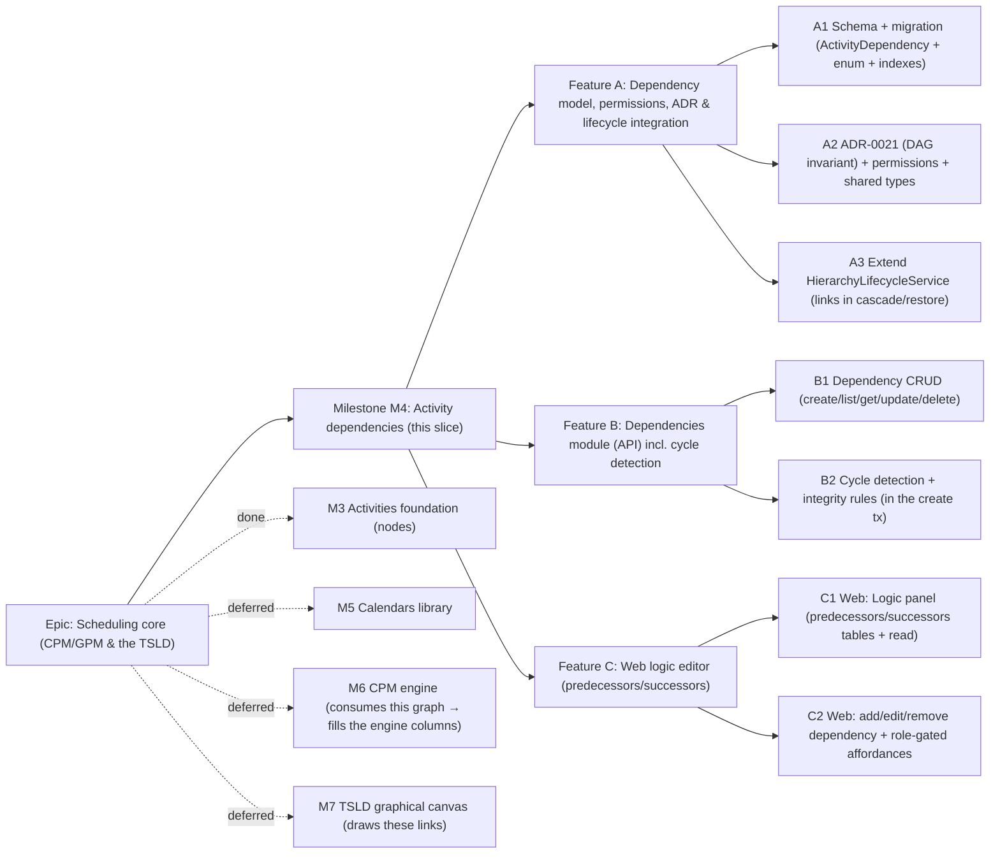

# Implementation Plan: Activity logic / dependencies

- **Feature spec:** [`docs/specs/activity-dependencies.md`](../specs/activity-dependencies.md)
- **Status:** Draft — awaiting approval (three critical questions in the spec §1).
- **Owner:** Claude

## Breakdown

### Epic

**Scheduling core (CPM/GPM & the TSLD)** — deliver the schedule model and engine
that make SchedulePoint a scheduling tool. **M3** delivered the nodes (Activities);
**this plan covers M4**, the edges (dependencies) that form the network. The later
milestones are named for sequencing but **not specced here**:

- **M5 — Calendars library** (wires the `calendar_id` reserved in M3; gives "working
  days" real meaning for durations **and lags**).
- **M6 — CPM engine:** forward/backward pass, total float, critical/near-critical —
  **consumes the DAG this slice guarantees** and writes the engine-owned columns M3
  persists. A `is_driving` flag on the dependency (which link drives the successor)
  is an additive engine-owned column added then, not now.
- **M7 — TSLD graphical canvas:** draws activities **and these links**; rendering-tech
  ADR (Canvas 2D vs WebGL) is deferred to that slice.

### Milestone: M4 — Activity dependencies (shippable slice)

**Outcome:** a Planner (or Org Admin) can link activities within a plan with typed
(FS/SS/FF/SF), lagged relationships, retype/relag and remove them, and browse any
activity's predecessors/successors — deny-by-default, org-scoped, cross-plan- and
IDOR-safe, and **guaranteed acyclic** (self-loops, duplicates and cycles are
rejected). Contributors/Viewers read logic but cannot change it. Deleting an
activity/plan takes its links with it (batch-restore where endpoints survive). The
`ActivityDependency` model is the complete edge the CPM engine (M6) will read, so M6
is additive. `main` stays releasable after every task.

---

#### Feature A: Dependency model, permissions, ADR & lifecycle integration

> **Description:** The `ActivityDependency` model + `DependencyType` enum and
> migration; **ADR-0021** (the DAG invariant & cycle-prevention strategy); the new
> `dependency:*` permission codes; the `@repo/types` contracts; and **extending
> `HierarchyLifecycleService`** so activity/plan cascade + restore include links.
> The foundation the module and UI build on.
> **Complexity:** M
> **Dependencies:** the M3 Activities foundation slice on `main`.
> **Risks:** the lifecycle change touches shared, already-shipped code → full
> **regression** coverage of the M3 4-level cascade; partial indexes must be raw SQL;
> named self-referential relations on `Activity` are easy to mis-wire; `created_by`/
> `updated_by` must be **TEXT**.
> **Testing requirements:** migration applies cleanly on real Postgres in CI; unit
> tests for the extended cascade/restore (links included; endpoint-guarded restore;
> **regression: M3 cascade unchanged**) and the role→permission map (logic write =
> Planner+ only, not Contributor).

##### Task A1 — Schema + migration for `ActivityDependency` (≈ one PR)

- **Description:** Add the `ActivityDependency` model + `DependencyType` enum to
  `schema.prisma` (UUID v7, snake_case, denormalised `organization_id` + `plan_id`,
  two `RESTRICT` FKs to `activities` via **named relations**, `type`/`lag_days`,
  audit with **TEXT** `created_by`/`updated_by`, soft delete, `version`,
  `delete_batch_id`); add the `Activity.predecessorLinks`/`successorLinks` and
  `Plan.dependencies`/`Organization.dependencies` back-relations; write the migration
  including the **raw-SQL partial-unique** pair index and the direction/scope indexes.
  No app behaviour yet.
- **Complexity:** M
- **Dependencies:** none (first task)
- **Risks:** Prisma cannot express partial indexes → raw SQL mirroring
  `uq_activities_plan_name`; two FKs to one table need explicit relation names or
  Prisma errors; finalise the index set + the **Q1 unique shape** (per-type vs
  per-pair) with **database-architect** at approval.
- **Testing:** migration up/down on real Postgres in CI; schema snapshot/typegen
  check; repository-level unit that the active filter excludes soft-deleted rows.
- **Development steps:**
  1. `ActivityDependency` model + `DependencyType` enum + named back-relations in
     `schema.prisma`; `prisma migrate dev`.
  2. Hand-edit the migration to add the partial-unique
     `(predecessor_id, successor_id, type)` + `predecessor_id` / `successor_id` /
     `plan_id`-composite / `organization_id` / `delete_batch_id` indexes (raw SQL).
  3. Update `docs/DATABASE.md` (model, indexes, denormalised scope, link-in-cascade
     note); changeset.

##### Task A2 — ADR-0021 + permissions + shared types (≈ one PR)

- **Description:** Write **ADR-0021 — Activity dependency graph: the DAG invariant &
  service-layer cycle prevention** (problem; options: service walk vs DB CTE/closure;
  choice; concurrency argument; 2,000-node scale limit + revisit trigger). Extend
  `common/auth/org-permissions.ts` — add `dependency:read` to `HIERARCHY_READ` and
  `dependency:create/update/delete` to `HIERARCHY_WRITE`. Add `DependencyType` (const
  array source-of-truth, à la `ORGANIZATION_ROLES`) and `DependencySummary` to
  `packages/types`. Record the **permission-namespace** and **link-cascade/restore**
  decisions in `docs/DECISIONS.md`.
- **Complexity:** S
- **Dependencies:** A1
- **Risks:** keep the permission map change additive (no Contributor logic grant —
  unit-test the matrix); keep the `@repo/types` enum in lock-step with Prisma.
- **Testing:** unit — role→permission map (Contributor has `dependency:read` only, no
  write; Planner/Admin have full; Viewer read-only); a lock-step test that the shared
  `DependencyType` union equals the Prisma enum.
- **Development steps:**
  1. ADR-0021 in `docs/adr/`; link it from the spec and `CLAUDE.md` §16.
  2. Permission codes in `org-permissions.ts`; unit the map.
  3. `@repo/types` contracts + `DECISIONS.md` entries; changeset.

##### Task A3 — Extend `HierarchyLifecycleService` for links (≈ one PR)

- **Description:** Extend the shared lifecycle helper so **cascade delete** also
  soft-deletes dependencies: for the `activity` leaf, stamp active links where
  `predecessor_id = id OR successor_id = id`; for `plan`/`project`/`client`, stamp
  active links whose `plan_id ∈` the affected plans — all in the same batch/
  transaction. Add a `dependency` leaf entity (its own fresh batch) for the direct
  DELETE. Extend **restoreBatch** to reactivate a batch's links **only where both
  endpoints are active** (endpoint-guarded — leaves dangling links soft-deleted).
- **Complexity:** M
- **Dependencies:** A1
- **Risks:** editing shared, shipped lifecycle code → **regression** the M3 4-level
  cascade; the endpoint-guarded restore must not accidentally leave a plan-level batch
  partially restored (plan batches are self-consistent — only single-activity restore
  can dangle); the whole cascade/restore stays in one `$transaction`.
- **Testing:** unit — activity delete also soft-deletes its incident links (both
  directions) in the batch; plan/project/client delete cascades to contained links;
  activity restore reactivates links whose other end is active and **leaves** those
  whose other end is deleted; plan restore reactivates all its links; **regression:
  the M3 activity/plan/project/client cascade + restore still pass**.
- **Development steps:**
  1. Extend `cascadeSoftDelete` (`'dependency'` leaf + incident/contained link stamps
     for the four existing entities).
  2. Extend `restoreBatch` with the endpoint-guarded link reactivation.
  3. Unit + regression tests; changeset.

---

#### Feature B: Dependencies module (API) incl. cycle detection

> **Description:** The `dependencies` module — nested create/list under a plan,
> activity predecessors/successors lists, flat get/update/delete by id — the
> org-scoped, plan-scoped CRUD plus the **DAG-preserving integrity rules** (self-loop,
> duplicate, cycle).
> **Complexity:** L
> **Dependencies:** Feature A.
> **Risks:** IDOR / cross-plan link → load both endpoints via
> `findActiveByIdInOrg` **and** assert both `plan_id == :planId`; the **cycle check
> must run inside the create transaction** to be race-safe (ADR-0021); duplicate under
> concurrency → DB partial-unique mapped to 409; the update DTO must **whitelist**
> `type`/`lag`/`version` so an endpoint field cannot leak through.
> **Testing requirements:** unit (scope + cross-plan, self-loop 422, duplicate 409,
> **cycle detection: self/2-node mirror/longer cycle**, optimistic lock, endpoint-
> immutability); API e2e (CRUD, cycle 409 matrix, IDOR/cross-plan 404 matrix, cascade
> round-trip with an activity/plan delete).

##### Task B1 — Dependency CRUD (create/list/get/update/delete) (≈ one PR)

- **Description:** Copy the reference module + the `activities` module → `dependencies`:
  `PlanDependenciesController` (`…/plans/:planId/dependencies` list/create),
  `ActivityDependenciesController` (`…/activities/:activityId/predecessors|successors`
  lists), `DependenciesController` (`…/dependencies/:dependencyId` get/patch/delete);
  `DependenciesService` (reuse `resolveScope`, `ActivityRepository` to load/scope the
  endpoints, `assertCan`, the lifecycle helper for delete); `DependencyRepository`
  (active filter, versioned update over `type`/`lag`, direction/plan-scoped loads, a
  **plan edge-load** for the cycle check); `CreateDependencyDto`/`UpdateDependencyDto`
  and `DependencyResponseDto.from()` (with light endpoint summaries, no N+1).
- **Complexity:** L
- **Dependencies:** A2, A3
- **Risks:** copy `organization_id`/`plan_id` from the endpoints, never from input;
  batch-load endpoint summaries for the response (avoid N+1); `updateMany(where
version)` for the optimistic lock; the direction lists must filter active + scope.
- **Testing:** unit (authz, endpoint scope + cross-plan 404, duplicate→409, stale
  version→409, endpoint-field rejected); API e2e (201+Location, plan/direction lists
  in-scope only, 404 for non-member/foreign/other-plan ids, delete→gone).
- **Development steps:**
  1. DTOs, repository (+ edge-load), service, three controllers, module.
  2. Delete via the extended lifecycle helper; audit logs; response endpoint summaries.
  3. OpenAPI/`docs/API.md`; changeset.

##### Task B2 — Cycle detection + integrity rules (≈ one PR)

- **Description:** Add a pure `CycleDetector` (reachability walk over a plan-scoped
  adjacency map) and wire it into `create`: inside the create `$transaction`, load the
  plan's active edges, walk from the proposed **successor** over successor-edges, and
  reject with **409 `CYCLE_DETECTED`** if the **predecessor** is reachable; also reject
  the **self-loop** (`pred == succ` → 422) before the walk. Ensure the create tx uses
  a sufficient isolation/row-lock so a concurrent mirror insert cannot bypass the
  invariant (per ADR-0021).
- **Complexity:** M
- **Dependencies:** B1
- **Risks:** the cycle guarantee is the security-/correctness-critical part → unit the
  self-loop, direct 2-node mirror, and a longer (A→B→C→A) cycle, plus the concurrent
  mirror-insert race; keep the walk O(V+E) and load edges once (indexed by `plan_id`).
- **Testing:** unit (`CycleDetector`: acyclic pass; self/2-node/3-node cycle reject;
  large-graph performance smoke); API e2e (create that would loop → 409; concurrent
  A→B / B→A → exactly one succeeds; duplicate → 409).
- **Development steps:**
  1. `CycleDetector` pure function + plan edge-load repo method; unit it in isolation.
  2. Wire into `create` inside the tx (self-loop guard + walk); isolation/lock note.
  3. OpenAPI/`docs/API.md` error docs; changeset.

---

#### Feature C: Web logic editor (predecessors/successors)

> **Description:** The Logic panel opened from the M3 activities table — Predecessors
> and Successors tables with add/edit/remove for writers and read-only for others —
> reusing the design-system primitives and the M3 feature patterns. **No new route;
> no canvas.**
> **Complexity:** L
> **Dependencies:** Feature B (the APIs) + the existing M3 `plan-detail` activities table.
> **Risks:** the add picker must exclude self and reflect server-authoritative cycle/
> duplicate rejections as friendly inline errors (never a client-only guarantee);
> optimistic UI vs 409 → conflict toast + refetch; a11y of tables/dialogs/combobox →
> primitives + axe; keep the panel a clean seam the TSLD canvas supersedes later.
> **Testing requirements:** component tests (both tables, add dialog incl. type/lag +
> self-exclusion, edit dialog, remove confirm, permission-gated affordances, cycle/
> duplicate error surfacing); Playwright journeys (add a dependency; catch a loop;
> remove) + axe; empty/loading/error states covered.

##### Task C1 — Web: Logic panel (predecessors/successors, read) (≈ one PR)

- **Description:** `features/activities` (extended) or `features/dependencies` —
  hooks (`usePredecessors`, `useSuccessors`, `usePlanDependencies`; extend
  `lib/query/hierarchy-keys` with `dependencyKeys`), Zod `dependency-schemas.ts`, and
  a `DependencyEditor` component rendering Predecessors and Successors tables (other
  end · type · lag) with empty/loading/error states. Add a **"Logic"** row action to
  the M3 `ActivitiesTable` that opens the panel; `DEPENDENCY_TYPE_LABELS` + lag
  formatter. Read-only in this task.
- **Complexity:** M
- **Dependencies:** B1
- **Risks:** two lists per activity → parallel queries + shared keys; enum/lag label
  maps shared; the panel surface must be role-agnostic here (affordances land in C2).
- **Testing:** component (tables render columns/empty/loading/error; label maps);
  Playwright (open Logic panel → predecessors/successors shown) + a11y.
- **Development steps:**
  1. Hooks + `dependencyKeys` + schemas + label maps.
  2. `DependencyEditor` (two read-only tables) + the "Logic" row action.
  3. Empty/loading/error states; changeset.

##### Task C2 — Web: add / edit / remove + role-gated affordances (≈ one PR)

- **Description:** `AddDependencyDialog` (combobox over the plan's other activities —
  **excludes self**; type select defaulting FS; lag input) wired to
  `useCreateDependency`; `EditDependencyDialog` (type + lag) → `useUpdateDependency`;
  `RemoveDependencyConfirm` → `useDeleteDependency`. Gate add/edit/remove on
  `dependency:create/update/delete` via a `canManageLogic` helper (Planner/Admin);
  Contributors/Viewers see the tables only. Surface **409 `CYCLE_DETECTED`** /
  `DUPLICATE_DEPENDENCY` / optimistic-lock conflicts as friendly inline errors/toasts
  - refetch.
- **Complexity:** M
- **Dependencies:** B2, C1
- **Risks:** the UI must mirror the API's rules but the **API is the source of truth**
  (client cycle-preview is a nicety, not a guarantee); lag input a11y (signed integer,
  units label); conflict handling consistent with M3.
- **Testing:** component (add dialog incl. self-exclusion + type/lag; edit; remove
  confirm; affordance visibility per role; cycle/duplicate error surfacing); Playwright
  (Planner adds an FS link → appears on both activities; attempt a loop → inline error;
  remove → gone) + a11y.
- **Development steps:**
  1. `AddDependencyDialog` + `EditDependencyDialog` + `RemoveDependencyConfirm` +
     mutations + `canManageLogic`.
  2. Wire affordances into the panel per role; cycle/duplicate/conflict handling.
  3. Empty/loading/error polish; changeset.

## Sequencing & slices

Strict order; each PR keeps `main` releasable:

1. **A1 → A2 → A3** — schema, ADR-0021 + permissions + shared types, then the
   lifecycle extension. No user-facing behaviour yet, but `main` still builds/releases
   and the M3 cascade is regression-covered.
2. **B1 → B2** — API: CRUD first, then the cycle detection + integrity rules. After B2
   the whole dependency loop (incl. the DAG guarantee) works via the API, exercisable
   by e2e/HTTP before the UI lands.
3. **C1 → C2** — the read-only Logic panel, then the add/edit/remove editor. After C2
   the milestone outcome is fully met end-to-end.

No feature flags required — each slice is additive and independently valuable (the API
is usable before the screens; browse works before the editor). The CPM engine, the
canvas and driving-flag are explicitly deferred to M5–M7; this model is the complete
edge M6 reads, so those slices are additive.

## Definition of Done (per task)

Each task's PR must satisfy the Feature Completion Criteria in
[`docs/PROCESS.md`](../PROCESS.md): code to the approved design, tests (unit + API
e2e + web/e2e/a11y as relevant, ≥ 80% on changed code, **regression tests for the
extended cascade**), docs/OpenAPI/`API.md`/`DATABASE.md`/`DECISIONS.md`/`ADR-0021`
updates, **security review** (authN/Z, org + plan scope/IDOR, the cycle guarantee,
DTO whitelisting), **performance** (direction/plan indexes, pagination, the bounded
cycle walk, no N+1 in the response summaries), **accessibility** (WCAG 2.2 AA),
Docker build + CI green, a changeset, and version-impact assessed.

**Recommended agents:** **database-architect** (A1 — model, the Q1 unique shape,
two-FK named relations, direction indexes); **security-reviewer** (B1/B2 — IDOR +
cross-plan scoping, the server-side cycle guarantee, DTO whitelisting of immutable
endpoints); **api-reviewer** (endpoint shapes — plan vs activity-direction lists,
envelopes, status codes, the 409 taxonomy); **backend-performance-reviewer** (the
cycle-walk cost at the 2,000-node ceiling, the edge-load query, response N+1);
**test-engineer** (cycle-detection + concurrency + IDOR/cross-plan + cascade/restore
e2e matrices, incl. the M3 regression); **component-reviewer** + **ux-reviewer** +
**accessibility-reviewer** (C1/C2 — tables, add/edit dialogs, combobox, role-gating).

## Risks & assumptions (rollup)

| Risk / assumption                                              | Likelihood | Impact | Mitigation                                                                                                      |
| -------------------------------------------------------------- | ---------- | ------ | --------------------------------------------------------------------------------------------------------------- |
| Unique per-pair vs per-type — **critical Q1**                  | med        | med    | Confirm at approval; default = unique `(pred, succ, type)` (allows SS+FF overlap ladder). Sets the DB index.    |
| New `dependency:*` set vs reuse `activity:*` — **critical Q2** | med        | low    | Default = new namespace (read→Viewer+, write→Planner+). Cheap, legible, future-guest-friendly.                  |
| Link cascade/restore on activity delete — **critical Q3**      | med        | med    | Default = soft-delete + same-batch, endpoint-guarded restore; no standalone restore endpoint. Sets lifecycle.   |
| A cycle is persisted (engine non-terminates)                   | low        | high   | Server-side walk **inside the create tx** + ADR-0021 concurrency guarantee; unit + e2e cycle matrices.          |
| Concurrent mirror inserts (A→B \|\| B→A) both pass             | low        | high   | Sufficient isolation/row-lock on the create tx (ADR-0021); e2e race test asserts exactly one succeeds.          |
| Extending the shared lifecycle breaks the M3 cascade           | med        | high   | Keep it entity-agnostic; whole cascade/restore in one `$transaction`; **regression tests** on the M3 tree.      |
| Endpoint-guarded restore leaves a dangling link soft-deleted   | low        | low    | Documented, bounded (only single-activity restore where the other end was separately deleted); user recreates.  |
| IDOR / cross-tenant or **cross-plan** link                     | low        | high   | `resolveScope` (404) + load both endpoints by `(id, org)` **and** assert same `plan_id`; e2e cross-plan matrix. |
| Two self-referential FKs on `Activity` mis-wired               | med        | med    | Explicit named relations; database-architect review; migration up/down in CI.                                   |
| N+1 when listing links (fetching endpoint names)               | med        | med    | Batch-load endpoint summaries in the response mapper; backend-performance-reviewer on the list query.           |
| Cycle walk too slow at the 2,000-node ceiling                  | low        | med    | O(V+E), edges loaded once via the `plan_id` index; performance smoke test; DB-CTE fallback gated by ADR-0021.   |
| DependencyType enum drifts from Prisma                         | low        | med    | Const-array source-of-truth in `@repo/types` + a lock-step unit test.                                           |
| Client cycle-preview mistaken for the guarantee                | low        | med    | API is authoritative; UI surfaces the 409; documented in the component/tests.                                   |
