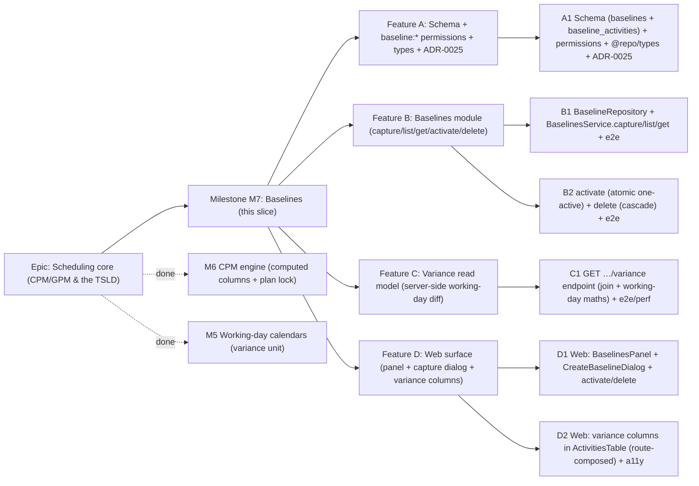

# Implementation Plan: Baselines (M7)

- **Feature spec:** [`docs/specs/baselines.md`](../specs/baselines.md)
- **Status:** Draft — awaiting approval (five critical questions in the spec §1, each with a recommended default)
- **Owner:** Feature Analyst / Claude

## Breakdown



### Epic

**Scheduling core (CPM/GPM & the TSLD)** — the schedule model and engine that make
SchedulePoint a scheduling tool. M3 delivered activities, M4 the dependency DAG, M5
working-day calendars, M6 the CPM engine (computed dates/float/critical path). **This
plan covers M7 Baselines** — freezing a plan of record and comparing the live schedule
against it (PROJECT_BRIEF §8/§10/§11, Journey 4).

### Milestone: M7 — Baselines (shippable slice)

**Outcome:** a Planner (or Org Admin) can **capture** named schedule snapshots,
**activate** exactly one as the plan's comparison baseline, and **delete** obsolete
ones; every member sees **per-activity variance** (start/finish/float in working days)
against the active baseline in the activities table, plus a plan-level roll-up.
Baselines are a permanent historical record that survives the activities' 90-day
purge. `main` stays releasable after every task: schema + permissions land first
(unused), then capture/list, then activate/delete, then variance, then the web.

---

#### Feature A: Schema + `baseline:*` permissions + types + ADR-0025

> **Description:** The two Prisma models (`Baseline`, `BaselineActivity`) with the
> one-active partial unique and snapshot columns; the `baseline:*` permissions wired
> into `HIERARCHY_READ`/`HIERARCHY_WRITE`; the cross-boundary `@repo/types` shapes;
> and **ADR-0025** (snapshot-copy vs reference, one-active invariant, server-side
> working-day variance). Lands first, unused, so `main` stays releasable.
> **Complexity:** M
> **Dependencies:** M6/M5 on `main`; the reference template; `org-permissions.ts`.
> **Risks:** partial uniques are raw SQL (Prisma can't express them) →
> **database-architect** review; snapshot-copy decision is load-bearing → capture it
> in ADR-0025 before building on it.
> **Testing requirements:** unit (permission matrix: read to all, create/activate/delete
> to Planner+Admin only) + a migration up/down smoke in CI.

##### Task A1 — Schema + `baseline:*` permissions + `@repo/types` + ADR-0025 (≈ one PR)

- **Description:** Add `Baseline` and `BaselineActivity` models per spec §4 (UUID v7,
  snake_case, timestamptz, soft delete + `delete_batch_id`, TEXT audit, `version`;
  denormalised `organization_id`; `source_activity_id` as a **plain UUID, no FK**).
  Migration adds the documented `@@index`es plus raw-SQL partial uniques
  `uq_baselines_plan_active` (`WHERE is_active = true AND deleted_at IS NULL`) and
  `uq_baselines_plan_name` (`WHERE deleted_at IS NULL`) and the partial delete-batch
  indexes. Add `baseline:read` to `HIERARCHY_READ` and
  `baseline:create|activate|delete` to `HIERARCHY_WRITE`; extend the permission-matrix
  unit test. Add `BaselineSummary`, `BaselineDetail`, `BaselineActivitySnapshot`,
  `BaselineVarianceRow`, `PlanVarianceSummary` to `@repo/types`. Write **ADR-0025**.
- **Complexity:** M
- **Dependencies:** none (additive schema + permissions).
- **Risks:** the one-active partial unique must ignore soft-deleted **and** inactive
  rows → precise `WHERE` + a migration test; snapshot-copy retention rationale →
  ADR-0025 + `docs/DATABASE.md` "Baseline: the plan-of-record snapshot" section.
- **Testing:** unit (permission matrix; types compile) + migration smoke.
- **Development steps:**
  1. Prisma models + migration (tables, FKs RESTRICT, indexes, partial uniques as raw SQL).
  2. `baseline:*` permissions + matrix test; `@repo/types` shapes.
  3. ADR-0025; `docs/DATABASE.md` + `CLAUDE.md` §16 ADR list; changeset.

---

#### Feature B: Baselines module — capture / list / get / activate / delete

> **Description:** The new org-scoped **`baselines` module** (controller →
> `BaselinesService` → `BaselineRepository`), copied from the reference template and
> following the calendars/hierarchy CRUD patterns. Capture freezes the plan's current
> computed activities under the M6 plan lock; activate flips the single active baseline
> atomically; delete soft-cascades the baseline + its snapshot rows. Deny-by-default,
> org-scoped, standard envelopes, optimistic locking.
> **Complexity:** L
> **Dependencies:** Feature A; the M6 `ScheduleService`/`ScheduleRepository`
> (plan lock + load-activities); `HierarchyLifecycleService`.
> **Risks:** IDOR/cross-tenant → `resolveScope` + org-filtered loads + e2e; capture
> consistency vs recalc → reuse the plan advisory lock; the one-active flip must be
> atomic → tx + partial unique backstop.
> **Testing requirements:** unit (`BaselinesService`: scope/authz; first-baseline
> auto-active; one-active flip; empty-plan 422; duplicate 409) + API e2e (capture;
> list; get with snapshot; RBAC 403 for Viewer/Contributor writes; IDOR 404; duplicate
> 409; empty-plan 422; activate atomicity; delete-active clears variance).

##### Task B1 — `BaselineRepository` + `BaselinesService.capture/list/get` + e2e (≈ one PR)

- **Description:** Implement `BaselineRepository` (org-scoped create-with-snapshot via
  `createMany`, cursor list newest-first, get-with-snapshot) and `BaselinesService`
  (resolveScope → assertCan → validate → persist). **Capture:** in one `$transaction`,
  acquire the plan write-lock (reuse `ScheduleRepository.lockPlanForWrite`), load the
  plan's active activities, reject if none / `projectFinish` null (`422
SCHEDULE_NOT_CALCULATED`), insert the `Baseline` (setting `is_active` when it is the
  plan's first) + batched `BaselineActivity` rows (identity + computed dates),
  denormalising `organization_id` from the plan. Add the `BaselinesController` `POST`
  (201) and the two `GET`s; module wiring + OpenAPI.
- **Complexity:** L
- **Dependencies:** A1.
- **Risks:** snapshot must be consistent with recalc → shared plan lock; batched insert
  size (≤ ~2,000) → `createMany` in the tx, no per-row round-trips; "first baseline"
  race → determined inside the locked tx.
- **Testing:** unit (auth/scope; first-active; empty-plan 422; duplicate name 409;
  snapshot copies identity + dates) + API e2e (capture → list → get; RBAC matrix; IDOR
  404; 409/422).
- **Development steps:**
  1. `CreateBaselineDto` (shared Zod/class-validator) + `BaselineRepository`.
  2. `BaselinesService.capture/list/get` + `BaselinesController` (POST/GET) + module.
  3. `docs/API.md`; unit + e2e; changeset.

##### Task B2 — `activate` (atomic one-active) + `delete` (cascade) + e2e (≈ one PR)

- **Description:** Add `activate` (`POST …/:id/activate`, 200): under the plan
  write-lock, clear the current active baseline (`is_active = false`) then set the
  target active — idempotent if already active; the partial unique is the backstop.
  Add `delete` (`DELETE …/:id`, 204): soft-delete the baseline **and** its snapshot
  rows in one `delete_batch_id` (extend `HierarchyLifecycleService` with a `'baseline'`
  level, or a self-contained service soft-cascade — baseline → its snapshot rows).
  Deleting the active baseline simply leaves the plan with none active.
- **Complexity:** M
- **Dependencies:** B1.
- **Risks:** activate atomicity under concurrency → plan lock + partial unique; delete
  must also cascade from a plan/project/client delete → verify the hierarchy cascade
  reaches baselines (add `'baseline'` to the lifecycle service if not covered) with an
  e2e; name reuse after delete → partial unique ignores soft-deleted rows.
- **Testing:** unit (activate flips exactly one; idempotent; delete cascades snapshot
  rows) + API e2e (activate A then B → only B active; delete active → variance empty;
  RBAC 403; plan delete cascades baselines; restore brings them back).
- **Development steps:**
  1. `activate` (locked tx flip) + controller route.
  2. `delete` soft-cascade (lifecycle `'baseline'` level) + controller route.
  3. `docs/API.md` + `docs/DATABASE.md` cascade note; unit + e2e; changeset.

---

#### Feature C: Variance read model (server-side working-day diff)

> **Description:** `GET …/baselines/variance` — the read model that joins the plan's
> live activities against the **active** baseline's snapshot on `source_activity_id`
> and computes start/finish/float variance in **working days** on the plan's calendar
> (reusing `buildWorkingDayCalendar` + `workingDaysBetween`, ADR-0024), plus a
> `PlanVarianceSummary` roll-up. Returns empty when there is no active baseline.
> **Complexity:** M
> **Dependencies:** Features A+B; the engine calendar arithmetic (M5); the
> `ScheduleRepository` calendar load.
> **Risks:** variance-sign correctness → documented convention + unit tests
> (positive = behind); working-day maths must match the engine → reuse the same factory;
> perf at 2,000 activities → one bounded plan-scoped read, O(n) join, calendar built once.
> **Testing requirements:** unit (`computeVariance`: matched/added/removed rows; sign;
> working-day diffs incl. weekends/holidays; float variance; empty active baseline) +
> API e2e (variance vs a known baseline after progress; added/removed activities;
> no-active-baseline empty) + **perf smoke** at 500/2,000.

##### Task C1 — `GET …/baselines/variance` + join + working-day maths + e2e/perf (≈ one PR)

- **Description:** Add `BaselinesService.variance`: resolveScope → `baseline:read` →
  find the active baseline (else `{ data: [], meta: { baselineId: null } }`) → load its
  `baseline_activities`, the plan's live active activities, and the plan calendar (one
  query each) → build the working-day calendar → join on `source_activity_id`,
  producing `BaselineVarianceRow[]` (current vs baseline start/finish/float,
  `startVarianceDays`/`finishVarianceDays`/`floatVarianceDays` via `workingDaysBetween`,
  `inBaseline`, and removed rows) + `PlanVarianceSummary` (active baseline id/name,
  `capturedAt`, worst finish slip, counts behind/added/removed). Add the controller
  `GET` (bounded, unpaginated — note the exemption) + OpenAPI. Extract the diff into a
  **pure `computeVariance` helper** for exhaustive unit tests.
- **Complexity:** M
- **Dependencies:** B1 (snapshot rows), B2 (an active baseline to compare).
- **Risks:** sign/off-by-one → pure helper + inverse-style unit cases against the
  engine's own day arithmetic; a large plan → single indexed loads + one calendar
  build; a null current date (never-recalculated live activity) → variance null, not 0.
- **Testing:** unit (`computeVariance` matched/added/removed; sign; weekend/holiday
  working-day diff; float variance; null current dates) + API e2e (behind/ahead cases;
  added/removed; empty active) + **perf smoke** at 500/2,000.
- **Development steps:**
  1. `computeVariance` pure helper + unit suite.
  2. `BaselinesService.variance` (loads + calendar build) + controller `GET`.
  3. `docs/API.md` + `docs/PERFORMANCE.md` note; e2e + perf smoke; changeset.

---

#### Feature D: Web surface — panel + capture dialog + variance columns

> **Description:** Make baselines usable in the UI: a **Baselines panel** on the plan
> view (list + active badge + activate/delete, Planner-gated) with a **Create baseline**
> dialog, and **variance columns** injected into the existing activities table via the
> plan route (no feature→feature import). Design-system primitives only; no timeline
> overlay (canvas deferred).
> **Complexity:** M
> **Dependencies:** Features B+C (endpoints + `@repo/types`).
> **Risks:** RBAC gating must match the server (`useOrgRole` → Planner/Org Admin);
> variance columns must render only when an active baseline exists; a11y of the table +
> dialog + actions; 409/422 surfaced as friendly inline messages.
> **Testing requirements:** component (panel across empty/loading/error/populated;
> activate/delete visibility per role; create dialog 409/422 messaging; variance columns
> present only with an active baseline) + Playwright (Planner captures a baseline →
> progresses/recalculates → variance shows slip; Viewer sees read-only) + axe.

##### Task D1 — Web: `BaselinesPanel` + `CreateBaselineDialog` + activate/delete (≈ one PR)

- **Description:** `features/baselines` — add `baselineKeys` to
  `lib/query/hierarchy-keys.ts` + hooks (`useBaselines`/`useBaseline`/create/activate/
  delete). Build `BaselinesPanel` (table: name, active badge, `capturedAt`,
  `capturedProjectFinish`, activity count; per-row Activate/Delete gated on
  `baseline:*`) and `CreateBaselineDialog` (RHF+Zod name; surfaces `DUPLICATE_BASELINE`
  and `SCHEDULE_NOT_CALCULATED` with a "recalculate first" hint). Empty/loading/error
  states; invalidate baseline + variance queries on mutation.
- **Complexity:** M
- **Dependencies:** B1/B2.
- **Risks:** role gating parity with server; delete-active UX (variance disappears) →
  clear messaging; mobile density → responsive table.
- **Testing:** component (panel/dialog across states; role gating; 409/422 messaging) + axe.
- **Development steps:**
  1. `baselineKeys` + hooks.
  2. `BaselinesPanel` + `CreateBaselineDialog` + states.
  3. a11y; changeset.

##### Task D2 — Web: variance columns in `ActivitiesTable` (route-composed) + a11y (≈ one PR)

- **Description:** Add `useBaselineVariance(orgSlug, planId)` (in `features/baselines`)
  and have the **plan route** pass an optional `varianceByActivityId` map **prop** into
  the activities feature's `ActivitiesTable`, which renders start/finish/float variance
  columns (with a behind/ahead visual cue — never colour alone, WCAG 2.2) **only when
  the prop is present**. No `features/activities` → `features/baselines` import; the
  route composes both. A small "no active baseline" affordance when variance is absent.
- **Complexity:** M
- **Dependencies:** C1, D1.
- **Risks:** cross-feature coupling → optional prop owned by the route (not a sideways
  import); variance meaning encoded beyond colour (icon/sign text) for a11y; column
  density on mobile → responsive/optional columns.
- **Testing:** component (`ActivitiesTable` with/without variance prop; sign/format;
  added/removed rows) + Playwright (capture → recalc → variance visible) + axe.
- **Development steps:**
  1. `useBaselineVariance` hook + variance-by-activity map selector.
  2. `ActivitiesTable` optional variance columns (route wires the prop).
  3. a11y (non-colour cue) + Playwright journey; changeset.

## Sequencing & slices

Strict order; each PR keeps `main` releasable:

1. **A1** — schema + `baseline:*` permissions + types + **ADR-0025**. Additive and
   unused; no user-facing change.
2. **B1 → B2** — the **baselines module**. After B1 planners can capture/list via HTTP;
   after B2 they can activate (one-active guaranteed) and delete. Nothing yet reads
   variance, so the schedule is unchanged.
3. **C1** — the **variance read model**. After C1 variance is available via HTTP.
4. **D1 → D2** — the **web surface**. After D2 the milestone outcome is met end-to-end
   (Journey 4, minus the deferred canvas overlay).

**Optional cut:** stop after **C1** to ship baselines **API-first** (Feature D moves to
a follow-up); the sequence is designed so this is a clean boundary. No feature flags
required — each slice is additive and independently valuable.

**Explicitly deferred (follow-ups):** TSLD/Gantt variance **overlays** (canvas
milestone); baseline **rename** and **baseline-vs-baseline** compare; **cross-plan /
program** baselines (§20 default: no in v1); guest variance visibility (with the share
ADR); PDF export of a baseline (§9 — its own ADR).

## Definition of Done (per task)

Each task's PR must satisfy the Feature Completion Criteria in
[`docs/PROCESS.md`](../PROCESS.md): code to the approved design, tests (unit + API e2e +
web/e2e/a11y as relevant, ≥ 80% on changed code, a **perf smoke** at 500/2,000 for C1),
docs (`ADR-0025`, `DATABASE.md`, `API.md`, `PERFORMANCE.md`, `CLAUDE.md`, `ROADMAP.md`,
OpenAPI, `@repo/types`), **security review** (org scope + IDOR on all routes;
deny-by-default; no client-supplied snapshot data), **performance** (batched snapshot
insert; bounded variance read; calendar built once), **accessibility** (WCAG 2.2 AA on
web; variance not colour-only), Docker build + CI green, a changeset, and version-impact
assessed.

**Recommended agents:** **database-architect** (A1 — the two tables, the one-active +
name partial uniques, `source_activity_id` as a non-FK, the snapshot columns);
**security-reviewer** (B1/B2/C1 — org scope + IDOR on capture/activate/delete/variance,
deny-by-default, the anti-IDOR resolveScope, no client snapshot injection);
**api-reviewer** (B1/B2/C1 — endpoint shapes, the 201/200/204/404/409/422 taxonomy, the
activate-as-action `200`, the bounded variance list exemption); **backend-performance-reviewer**
(B1 batched snapshot insert; C1 the variance join + calendar build + the 500/2,000 NFR);
**test-engineer** (the capture/RBAC/IDOR/409/422 e2e matrix; the atomic-activate test;
the `computeVariance` sign/working-day/added/removed unit design; the null-current-date
case); **component-reviewer** + **ux-reviewer** + **accessibility-reviewer** (D1/D2 —
the panel, the capture dialog, and the variance columns incl. the non-colour cue).

## Risks & assumptions (rollup)

| Risk / assumption                                         | Likelihood | Impact | Mitigation                                                                                                            |
| --------------------------------------------------------- | ---------- | ------ | --------------------------------------------------------------------------------------------------------------------- |
| Snapshot-copy vs reference model — **critical Q1**        | med        | high   | Default = **snapshot-copy** (self-contained; `source_activity_id` non-FK); survives activity hard-purge; ADR-0025.    |
| Variance computation location — **critical Q2**           | med        | med    | Default = **server-side dedicated endpoint** reusing engine working-day maths; activities response untouched.         |
| Force recalc before capture — **critical Q3**             | med        | med    | Default = **snapshot current**, but reject empty/never-calculated (422); surface `capturedAt` + "recalc first".       |
| Auto-activate on capture — **critical Q4**                | low        | med    | Default = **first baseline auto-active**, later captures inactive; no silent re-point of variance.                    |
| Variance unit — **critical Q5**                           | low        | med    | Default = **working days** on the plan calendar (consistent with float/lag); raw dates also exposed.                  |
| Two active baselines slip through concurrently            | low        | high   | **Partial unique** `uq_baselines_plan_active` + plan advisory lock on activate; e2e concurrency test.                 |
| Capture taken mid-recalculation (inconsistent snapshot)   | low        | med    | Reuse the M6 plan write-lock; capture reads inside the locked tx.                                                     |
| Variance sign / off-by-one wrong                          | med        | high   | Pure `computeVariance` helper; reuse engine `workingDaysBetween`; documented sign + exhaustive unit cases.            |
| Perf: variance / capture at 2,000 activities              | low        | med    | Batched `createMany`; single indexed loads; O(n) join; calendar built once; perf smoke at 500/2,000.                  |
| Baseline not cascaded by a plan/project/client delete     | med        | med    | Add `'baseline'` to `HierarchyLifecycleService`; e2e that a plan delete soft-deletes + restores its baselines.        |
| Cross-feature coupling (variance columns in activities)   | med        | low    | Route composes; `ActivitiesTable` takes an **optional prop**; no `features/activities` → `features/baselines` import. |
| Baseline of null dates (never-calculated plan) is useless | low        | low    | 422 `SCHEDULE_NOT_CALCULATED` guard; UI hint to recalculate first.                                                    |
| Activity added/removed after capture confuses variance    | med        | low    | `inBaseline` flag + explicit removed rows + `meta` counts; documented in the DTO.                                     |

```

```
