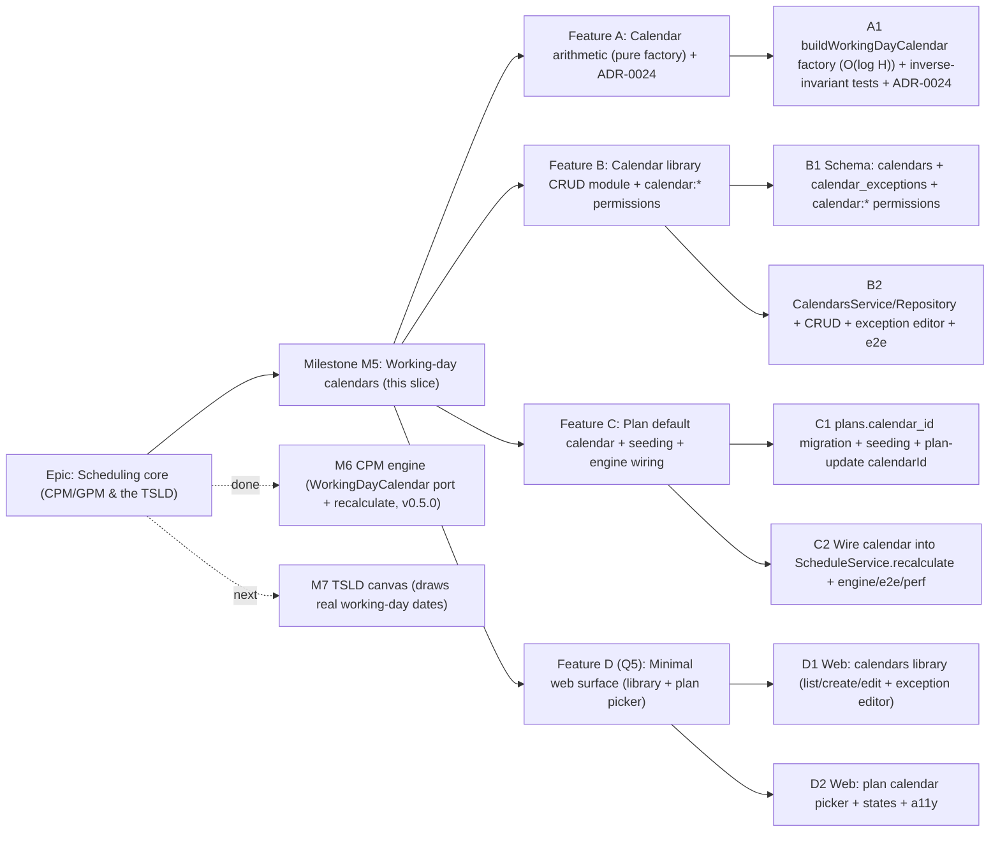

# Implementation Plan: Working-day calendars

- **Feature spec:** [`docs/specs/calendars.md`](../specs/calendars.md)
- **Status:** Draft — awaiting approval (five critical questions in the spec §1, each with a recommended default)
- **Owner:** Feature Analyst / Claude

## Breakdown

### Epic

**Scheduling core (CPM/GPM & the TSLD)** — deliver the schedule model and engine
that make SchedulePoint a scheduling tool. M3 delivered nodes, M4 edges + the DAG
invariant, **M6** the CPM engine (with the `WorkingDayCalendar` **port** as a
deliberate seam). **This plan covers M5**, the **working-day calendars** that fill
that seam so the engine computes true working-day dates. M7 (the TSLD canvas)
consumes the resulting dates.

### Milestone: M5 — Working-day calendars (shippable slice)

**Outcome:** a Planner (or Org Admin) can build a reusable **org calendar library**
(working weekdays + holiday/working-exception dates), assign a **default calendar
to a plan**, and recalculate (M6) to get a schedule whose dates **skip weekends and
holidays**. A plan with **no** calendar behaves exactly as today (all-days-work),
so existing plans and the M6 golden suite are unaffected until they opt in. New
plans default to a seeded **Standard (Mon–Fri)** calendar per org. The calendar
arithmetic is **pure, correct, and O(1)/O(log H)**, so recalculation stays within
the M6 NFR (< 500ms @ 500, < 2s @ 2,000). The pure CPM engine's **pass code is
unchanged** — calendars enter only through the existing port. `main` stays
releasable after every task: the pure factory lands first (unused, fully tested),
then the CRUD library, then the plan default + engine wiring, then the web.

---

#### Feature A: Calendar arithmetic (pure factory) + ADR-0024

> **Description:** A **pure, dependency-free** factory
> `buildWorkingDayCalendar(workingWeekdays, exceptions)` added to the engine's
> `calendar.ts` (alongside `allDaysWorkCalendar`), returning a `WorkingDayCalendar`
> whose `addWorkingDays`/`workingDaysBetween` are implemented with **O(1) week
> arithmetic + O(log H) binary search** over a sorted exception array — never a
> day-by-day loop. Plus **ADR-0024** (the calendar model, scoping, back-compat
> rule, performance contract, and per-activity deferral). No HTTP, no Prisma —
> lands first, unused, fully unit-tested, so `main` stays releasable.
> **Complexity:** M
> **Dependencies:** M6 engine on `main` (the `WorkingDayCalendar` interface).
> **Risks:** off-by-one in weekend/holiday skipping and the inverse relationship →
> the property invariant `addWorkingDays(from, workingDaysBetween(from,to)) === to`
> plus hand-worked cases; a pattern with no working days looping forever → the
> `workingWeekdays > 0` invariant (validated + CHECK) + a guard/test; the formula
> being subtly wrong vs a naive loop → a differential test against a simple
> reference loop over a bounded range.
> **Testing requirements:** unit only — Mon–Fri skips Sat/Sun; a holiday inside a
> span pushes the finish out by one working day; a **working exception** (worked
> Saturday) pulls it in; the **inverse invariant** across positive/negative/zero
> offsets; a differential test vs a naive day-counter over ±400 days; boundary
> (data date on a non-working day → offset 0 is that day, offset 1 the next working
> day); 7-day calendar with holidays behaves like all-days minus holidays.

##### Task A1 — `buildWorkingDayCalendar` factory + inverse-invariant tests + ADR-0024 (≈ one PR)

- **Description:** Implement the factory taking a `workingWeekdays` bitmask (bit
  `i` = weekday `i`, `0 = Monday`) and a **sorted** array of `{ date, isWorking }`
  exceptions. `addWorkingDays(date, n)`: advance by whole weeks using the per-week
  working-day count, then step the remainder, applying exception overrides via
  binary search; converges without a per-day scan. `workingDaysBetween(from, to)`:
  count working weekdays in `[from,to)` via week arithmetic, then add/subtract
  exceptions in range (binary search bounds). Export it from the engine index.
  Write **ADR-0024** (model, scoping, back-compat = null→all-days-work, O(log H)
  contract, per-activity deferral + multi-calendar-edge reasoning).
- **Complexity:** M
- **Dependencies:** none (pure; the port interface already exists).
- **Risks:** the week-arithmetic remainder + exception correction is the subtle
  part → differential test vs a naive loop; non-terminating pattern → enforce ≥1
  working weekday at the factory boundary (throw on 0) mirroring the DB CHECK.
- **Testing:** unit — all cases in Feature A's testing requirements; assert the
  factory throws on an empty weekday pattern.
- **Development steps:**
  1. Factory input types + `buildWorkingDayCalendar` (week math + binary search).
  2. Export from `engine/index.ts`; unit tests incl. inverse invariant + differential.
  3. ADR-0024; changeset (internal library — small changeset OK, not yet wired).

---

#### Feature B: Calendar library CRUD module + `calendar:*` permissions

> **Description:** The new org-scoped **`calendars` module** (controller →
> `CalendarsService` → `CalendarRepository`), copied from the reference template
> and following the Client/Plan hierarchy CRUD + `HierarchyLifecycleService`
> patterns: create/list/get/update/delete calendars and add/remove exceptions,
> all org-scoped, deny-by-default, soft-deleted with cascade batch, optimistic
> locking, standard envelopes. Plus the **`calendar:*`** permissions and the
> schema (two tables). CRUD works via HTTP after this feature, independent of the
> engine wiring.
> **Complexity:** L
> **Dependencies:** Feature A not required (independent); reference template,
> `org-permissions`, `HierarchyLifecycleService`.
> **Risks:** IDOR/cross-tenant → `resolveScope` + org-filtered loads + e2e;
> weekday/exception validation → shared DTO + DB CHECK/partial uniques; delete of a
> calendar in use → deferred to C1 (needs `plans.calendar_id`); until then delete is
> unguarded-but-unreferenced (no plan can reference a calendar yet).
> **Testing requirements:** unit (`CalendarsService`: scope/authz, weekday
> validation, duplicate name/exception, version conflict) + API e2e (CRUD;
> RBAC 403 for Viewer/Contributor writes; IDOR 404; duplicate 409; exception
> add/remove).

##### Task B1 — Schema (`calendars` + `calendar_exceptions`) + `calendar:*` permissions (≈ one PR)

- **Description:** Add the `Calendar` and `CalendarException` Prisma models per
  §4 (UUID v7, snake_case, timestamptz, soft delete + `delete_batch_id`, audit,
  `version`; `working_weekdays smallint` CHECK `> 0 AND <= 127`; partial uniques
  `uq_calendars_org_name`, `uq_calendar_exceptions_cal_date` as raw SQL; the
  documented indexes). Migration includes the CHECKs/partial uniques. Add
  `calendar:read` to `HIERARCHY_READ` and `calendar:create|update|delete` to
  `HIERARCHY_WRITE` in `org-permissions.ts`; unit the matrix. Add `Calendar` /
  `CalendarException` shapes + the `WorkingWeekdays` bitmask helper to `@repo/types`.
- **Complexity:** M
- **Dependencies:** A1 helpful (the bitmask helper can be shared) but not blocking.
- **Risks:** partial uniques/CHECKs are raw SQL (Prisma can't express them) →
  **database-architect** review; bitmask semantics must be documented once and
  shared → the `WorkingWeekdays` helper in `@repo/types`.
- **Testing:** unit (permission matrix; bitmask helper round-trips); a migration
  smoke (up/down) in CI.
- **Development steps:**
  1. Prisma models + migration (tables, FKs RESTRICT, CHECKs, partial uniques, indexes).
  2. `calendar:*` permissions + matrix test; `@repo/types` shapes + bitmask helper.
  3. `docs/DATABASE.md` update; changeset.

##### Task B2 — `CalendarsService`/`Repository` + CRUD + exception editor + e2e (≈ one PR)

- **Description:** Implement `CalendarRepository` (org-scoped CRUD, cursor list,
  exception add/remove) and `CalendarsService` (resolveScope → assertCan → validate
  → persist), the `CalendarsController` routes (§4 table minus the delete-in-use
  guard, which needs C1), and module wiring. Reuse `HierarchyLifecycleService` for
  soft-delete/restore of a calendar + its exceptions (`delete_batch_id`).
- **Complexity:** L
- **Dependencies:** B1.
- **Risks:** cross-tenant leakage → org-filtered loads + e2e IDOR; exception
  duplicate/validation → partial unique + DTO; keep controllers thin → logic in the
  service (house standard).
- **Testing:** unit (authz/scope; weekday & exception validation; duplicate/version
  errors) + API e2e (full CRUD; RBAC matrix; IDOR 404; add/remove exception; list
  pagination).
- **Development steps:**
  1. `CalendarRepository` + `CalendarsService` + DTOs (`class-validator`, shared with Zod).
  2. `CalendarsController` + module + OpenAPI.
  3. `docs/API.md`; API e2e matrix; changeset.

---

#### Feature C: Plan default calendar + seeding + engine wiring

> **Description:** Wire calendars into scheduling: add the nullable
> **`plans.calendar_id`** FK, **seed** a per-org Standard (Mon–Fri) calendar
> (migration backfill + on org create), default **new plans** to it, accept
> `calendarId` on **plan update** (validated same-org active), add the **delete-in-
> use guard** to calendars, and make **`ScheduleService.recalculate` load the
> plan's calendar and inject `buildWorkingDayCalendar`** (null → `allDaysWorkCalendar`).
> After this feature the engine computes real working-day dates end-to-end via HTTP.
> **Complexity:** L
> **Dependencies:** Features A + B; the M6 `ScheduleService`/repository; the Plans module.
> **Risks:** changing recalc must NOT regress the null-calendar path → re-run the M6
> golden suite as a regression; perf with a real calendar → perf smoke at 500/2,000;
> seeding inside org-create tx must not break existing org-create tests → update them;
> the plan `calendarId` must be anti-IDOR → same-org active check inside the update tx.
> **Testing requirements:** unit (recalc picks the right calendar; null → all-days;
> plan-update validates same-org calendar; delete-in-use guard) + API e2e (recalc
> with a Mon–Fri + holidays calendar yields working-day dates; null-calendar
> regression identical to M6; assign foreign calendar → 404/422; delete in-use →
> 409; new plan defaults to Standard) + perf smoke.

##### Task C1 — `plans.calendar_id` migration + seeding + plan-update `calendarId` + delete guard (≈ one PR)

- **Description:** Add the nullable `plans.calendar_id` FK (RESTRICT) + index
  (migration). Data migration seeds one Standard calendar per existing org; extend
  `OrganizationsService.create` to seed it in the org-create tx; default new plans'
  `calendarId` to the org Standard in `PlansService.create`. Add optional
  `calendarId` to the plan update DTO with a **same-org, active** validation inside
  the update tx (else 404/422). Add the **`CALENDAR_IN_USE` (409)** guard to
  `CalendarsService.delete` (count active plans referencing the calendar). Update
  the plan response + `@repo/types` `Plan` with `calendarId`.
- **Complexity:** M
- **Dependencies:** B1/B2; the Plans + Organizations services.
- **Risks:** backfill correctness for existing orgs → idempotent seed + a migration
  test; org-create/plan-create test churn → update fixtures; the in-use guard must
  count only ACTIVE plans → filtered count + test.
- **Testing:** unit (seed on org create; plan-create default; plan-update same-org
  validation; delete-in-use count) + API e2e (assign/clear a plan's calendar; foreign
  calendar rejected; delete guarded; migration seeds Standard).
- **Development steps:**
  1. Migration (`plans.calendar_id` FK + index; backfill Standard per org).
  2. Seed on org-create; plan-create default; plan-update `calendarId` validation;
     delete-in-use guard; `Plan.calendarId` in `@repo/types` + response.
  3. `docs/DATABASE.md` + `docs/API.md`; unit + e2e; changeset.

##### Task C2 — Wire the calendar into `ScheduleService.recalculate` + engine/e2e/perf (≈ one PR)

- **Description:** Extend the schedule repository to load the plan's calendar
  (`working_weekdays`) + its **active** exceptions (one query, ordered by date) as
  part of the recalculate snapshot. In `ScheduleService.recalculate`, build the
  `WorkingDayCalendar` via `buildWorkingDayCalendar(...)` when `plan.calendarId` is
  set, else pass `allDaysWorkCalendar`, and hand it to `computeSchedule` at the
  existing `ComputeOptions.calendar` seam — **no engine-pass change**. Add the
  `calendarId` (or "all-days-work") to the recalc audit log.
- **Complexity:** M
- **Dependencies:** A1, C1.
- **Risks:** the calendar load adds a query inside the plan-locked tx → keep it one
  indexed query, build the calendar once; perf regression → smoke at 500/2,000 with a
  real calendar; null-calendar behaviour must be byte-identical to M6 → regression e2e
  against the M6 golden expectations.
- **Testing:** unit (`ScheduleService`: builds the right calendar; null path uses
  all-days; exceptions passed sorted) + API e2e (recalc with Mon–Fri + holidays →
  no date on Sat/Sun/holiday, finish absorbs non-working days; null-calendar identical
  to M6; constraint-date-on-non-working-day still correct) + **perf smoke** at 500/2,000.
- **Development steps:**
  1. Schedule repository: load calendar + active exceptions (one query).
  2. `ScheduleService`: build + inject the port impl; audit the calendar used.
  3. `docs/PERFORMANCE.md` note (calendar-math complexity within the recalc NFR);
     e2e + perf smoke; changeset.

---

#### Feature D (Q5 default — drop if deferred): Minimal web surface

> **Description:** Make calendars usable in the UI — an org **Calendars library**
> screen (list, create/edit with a weekday toggle group, an exception editor) and a
> **plan calendar picker** (Planner-only) on the plan view — reusing design-system
> primitives. **No timeline visualisation** (M7). If the human chooses the API-first
> cut, this whole feature is dropped and calendars are managed via HTTP.
> **Complexity:** M
> **Dependencies:** Features B + C (the endpoints + `Calendar`/`Plan.calendarId` types).
> **Risks:** weekday-toggle ↔ bitmask binding correctness → the shared helper + a
> component test; delete-in-use 409 surfaced as a friendly message, not a raw error;
> a11y of the toggle group, date inputs, and select → primitives + axe; empty states.
> **Testing requirements:** component (calendars table + form + exception editor;
> plan picker visibility per role; 409/empty states) + Playwright (Planner creates a
> calendar + holiday → assigns to a plan → recalculates → working-day dates appear) + axe.

##### Task D1 — Web: calendars library (list / create / edit + exception editor) (≈ one PR)

- **Description:** `features/calendars` — `calendarKeys` + hooks
  (`useCalendars`/`useCalendar`/create/update/delete/add-exception/remove-exception);
  a `CalendarsTable`, a `CalendarForm` (name + a **weekday toggle group** bound to the
  bitmask via the shared helper), and a `CalendarExceptionsEditor` (add a dated
  holiday/working exception + label; list + remove). Empty/loading/error states;
  delete surfaces `CALENDAR_IN_USE` inline.
- **Complexity:** M
- **Dependencies:** B2, C1.
- **Risks:** bitmask binding → shared helper + component test; date validation →
  Zod `YYYY-MM-DD`; mobile density → responsive table.
- **Testing:** component (table/form/editor across empty/loading/error/populated; the
  weekday toggle round-trips the bitmask; duplicate/409 messaging) + axe.
- **Development steps:**
  1. `calendarKeys` + hooks + shared bitmask binding.
  2. `CalendarsTable` + `CalendarForm` + `CalendarExceptionsEditor`.
  3. States + a11y; changeset.

##### Task D2 — Web: plan calendar picker + states + a11y (≈ one PR)

- **Description:** A `PlanCalendarPicker` (Select of the org's calendars, gated on
  `plan:update`; read-only label for others) that patches `Plan.calendarId` and
  invalidates the plan + schedule queries so a later Recalculate reflects it. Clearing
  the calendar sets null. Non-Planners see the calendar name read-only.
- **Complexity:** S
- **Dependencies:** D1.
- **Risks:** role gating must match the server; clearing vs unset semantics; a11y of
  the select + read-only state.
- **Testing:** component (picker visibility per role; set/clear; invalidation) +
  Playwright (Planner assigns a calendar → recalculates → dates change; Viewer sees
  read-only) + axe.
- **Development steps:**
  1. `PlanCalendarPicker` + role gating + set/clear.
  2. Query invalidation + read-only state.
  3. a11y polish; changeset.

## Sequencing & slices

Strict order; each PR keeps `main` releasable:

1. **A1** — the **pure calendar factory** + ADR-0024. Lands **unused** but fully
   unit-tested (inverse invariant + differential). No user-facing change.
2. **B1 → B2** — the **calendar library** (schema + CRUD). After B2 planners can
   manage calendars via HTTP; nothing yet consumes them, so scheduling is unchanged.
3. **C1 → C2** — the **plan default + engine wiring**. After C1 plans can reference a
   calendar and new plans default to Standard; after C2 recalculation produces real
   working-day dates. The **null-calendar path stays identical to M6** (regression-
   guarded).
4. **D1 → D2** — the **minimal web surface**. After D2 the milestone outcome is met
   end-to-end in the UI.

**Optional cut (Q5 = defer web):** stop after **C2** and ship calendars **API-first**;
Feature D moves into M7. The sequence is designed so this is a clean boundary —
nothing in A–C depends on D.

No feature flags required — each slice is additive and independently valuable (the
factory is proven before it is wired; the library works before plans consume it; the
engine wiring is opt-in per plan). **Per-activity calendar override**, **calendar-day
lag unit**, **bulk holiday import / holiday-data provider**, **snap-data-date-to-
working-day**, and **timeline non-working shading** are explicitly deferred
(follow-ups; the override needs its own ADR for multi-calendar edge arithmetic).

## Definition of Done (per task)

Each task's PR must satisfy the Feature Completion Criteria in
[`docs/PROCESS.md`](../PROCESS.md): code to the approved design, tests (unit +
API e2e + web/e2e/a11y as relevant, ≥ 80% on changed code, a **perf smoke** at
500/2,000 for C2), docs (`ADR-0024`, `DATABASE.md`, `API.md`, `PERFORMANCE.md`,
`CLAUDE.md`, `ROADMAP.md`, OpenAPI, `@repo/types`), **security review** (org scope +
IDOR on calendar CRUD and plan assignment; the delete-in-use guard; deny-by-default),
**performance** (calendar built once; O(1)/O(log H) math; the recalc NFR held),
**accessibility** (WCAG 2.2 AA on any web), Docker build + CI green, a changeset, and
version-impact assessed.

**Recommended agents:** **database-architect** (B1/C1 — the two tables, the
`working_weekdays` CHECK, partial uniques, the `plans.calendar_id` FK + index, and the
seeding/backfill migration); **security-reviewer** (B2/C1 — org scope + IDOR on
calendar CRUD and plan-calendar assignment, the delete-in-use guard, deny-by-default);
**api-reviewer** (B2/C1 — endpoint shapes, envelopes, the 201/204/404/409/422 taxonomy,
the plan `calendarId` field); **backend-performance-reviewer** (C2 — the extra
calendar load inside the locked tx, the O(log H) math, and the recalc NFR at 500/2,000);
**test-engineer** (A1 inverse-invariant + differential design; the CRUD/RBAC/IDOR and
working-day-date e2e matrices; the null-calendar regression); **component-reviewer** +
**ux-reviewer** + **accessibility-reviewer** (D1/D2 — the weekday toggle group, the
exception editor, and the plan picker).

## Risks & assumptions (rollup)

| Risk / assumption                                            | Likelihood | Impact | Mitigation                                                                                                                                |
| ------------------------------------------------------------ | ---------- | ------ | ----------------------------------------------------------------------------------------------------------------------------------------- |
| Calendar content model — **critical Q1**                     | med        | med    | Default = **weekday bitmask + dated exceptions with an `isWorking` flag** (holidays + working exceptions); ADR-0024.                      |
| Assignment scope / per-activity override — **critical Q2**   | med        | high   | Default = **org library + per-plan default**; **defer per-activity override** (multi-calendar edge = engine change); own ADR later.       |
| Engine integration approach — **critical Q3**                | low        | med    | Default = **build the port impl in `ScheduleService`, engine unchanged**; O(log H) math (not a day loop); inverse-invariant + perf smoke. |
| Migration / back-compat default — **critical Q4**            | med        | med    | Default = **null calendar → all-days-work** (opt-in); new plans → seeded Standard; recalc is explicit → no silent change.                 |
| Web now vs deferred — **critical Q5**                        | med        | low    | Default = **minimal web** (library + plan picker); Feature D is a clean, droppable cut after C2.                                          |
| Off-by-one in weekend/holiday skipping                       | med        | high   | Pure factory + **inverse invariant** + **differential vs a naive loop** + hand-worked cases; ADR-0024.                                    |
| Non-terminating `addWorkingDays` (no working day in pattern) | low        | high   | `working_weekdays > 0` DB CHECK + factory throws on empty pattern; unit-proven.                                                           |
| Recalc perf regression with a real calendar (< 2s @ 2,000)   | low        | med    | Calendar built **once**, O(1)/O(log H) per call; one indexed exception load; perf smoke in CI.                                            |
| Null-calendar path drifts from M6 behaviour                  | low        | med    | Regression e2e vs the M6 golden expectations; null → `allDaysWorkCalendar` unchanged.                                                     |
| IDOR: plan references a foreign/deleted calendar             | low        | high   | Same-org **active** validation inside the plan-update tx; e2e IDOR matrix.                                                                |
| Deleting a calendar in use dangles a plan reference          | low        | med    | Service **in-use guard** (409 `CALENDAR_IN_USE`) counting active plans; soft delete + FK RESTRICT defence in depth.                       |
| Seeding inside org-create breaks existing tests              | med        | low    | Update org-create fixtures; idempotent backfill migration for existing orgs; migration test.                                              |
| Planner expects per-activity calendars (brief §5)            | med        | low    | Documented deferral with reasoning (ADR-0024); reserved `activities.calendar_id` keeps the door open, no schema churn.                    |
| Data date on a non-working day surprises a planner           | low        | low    | Offset 0 = data date as given (documented); a "snap to working day" toggle is a noted follow-up.                                          |

</content>
