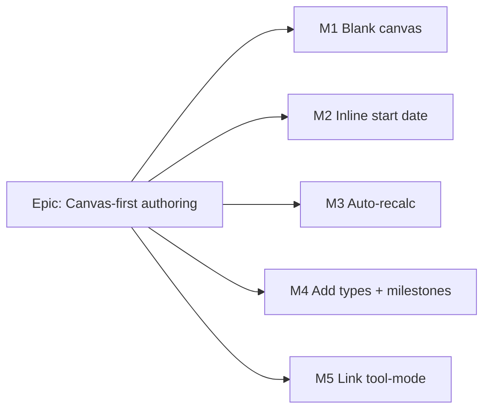

<!--
Implementation Plan — Stage 5 of docs/PROCESS.md. Produced with the Feature Spec
(docs/specs/canvas-first-authoring.md). Sequenced as thin vertical slices that keep
`main` releasable behind VITE_CANVAS_AUTHORING (default-off during build).
-->

# Implementation Plan: Canvas-first plan authoring

- **Feature spec:** `docs/specs/canvas-first-authoring.md` (Stages 1–4)
- **Status:** Draft (awaiting approval)
- **Owner:** TBD

## Breakdown

### Epic

**Canvas-first plan authoring** — let a planner build a whole plan on the TSLD canvas (place →
type → link → auto-schedule) without the activities-table detour. Roadmap theme: TSLD editing
surface / plan workspace authoring (follows ADR-0030 layout + ADR-0031 toolbar). All work sits
behind **`VITE_CANVAS_AUTHORING`** (default-off during build; flip default-on per milestone only
once that slice's a11y/perf/e2e gates are green — mirrors the `VITE_TSLD_EDITING` /
`VITE_CANVAS_WORKSPACE` / `VITE_CANVAS_TOOLBAR` rollout). Prerequisite: **ADR-0032 accepted**
(co-authored with ui-architect) before build starts.

**Cross-cutting Task 0 — flag + ADR (part of M1's first PR).** Add `VITE_CANVAS_AUTHORING`
(`config/env.ts` `flagDefaultOff` + `.env.example`), write/land ADR-0032, add the flag-on e2e
project scaffold (`test:e2e:authoring`, mirror `test:e2e:toolbar`). No behaviour yet.

---

### Milestone: M1 — Blank interactive canvas (shippable slice)

**Outcome:** on a new empty plan (flag on), the interactive time-scaled canvas mounts (anchored to
`plannedStart ?? today`) and a writer can draw the **first Task** on it — no table detour. (Uses
the existing canvas inline recalc for now; unified auto-recalc lands in M3.)

#### Feature: Empty-canvas render path + first draw

> **Description:** Relax the `TsldPanel` empty-state/`showDiagram` gate to render `TsldCanvas`
> whenever a timeline anchor exists; anchor `dataDate = plannedStart ?? todayIso`; first draw sets
> `plannedStart` when null (Critical Q1 default).
> **Complexity:** L
> **Dependencies:** Task 0 (flag, ADR-0032).
> **Risks:** the today-anchor vs real `plannedStart` coherence (mitigation: first structural write
> pins `plannedStart` = anchor before create; unit + e2e cover the null-start path). Empty-grid
> a11y (mitigation: keep the parallel listbox mounted empty; announce "nothing scheduled yet").
> **Testing requirements:** unit (gate predicate; anchor fallback; first-draw-sets-start), component
> (empty writer vs read-only states), e2e/a11y (open empty plan → draw first Task; axe).

##### Task 1 — Relax the render gate behind the flag (≈ one PR)

- **Description:** In `TsldPanel.tsx`, when `VITE_CANVAS_AUTHORING` is on, render `TsldCanvas` when
  `dataDate !== null` regardless of `isCalculated`/`activities.length`; keep the read-only empty
  note. Compute `dataDate = plannedStart ?? todayIso` in the workspace (pass through).
- **Complexity:** M
- **Dependencies:** Task 0.
- **Risks:** flag-off must be byte-for-byte (mitigation: gate every change; snapshot the flag-off
  path).
- **Testing:** unit (gate predicate both flag states), component (empty canvas mounts; read-only
  shows note), a11y (empty listbox + grid).
- **Development steps:**
  1. Thread `todayIso`/anchor into the canvas render; branch the early-return + `showDiagram` on
     the flag.
  2. Keep the "nothing scheduled yet" note for the read-only/empty case.
  3. Update the flag-on e2e; changeset (feat, web).

##### Task 2 — First-draw-sets-start + create honours anchor

- **Description:** In `use-plan-workspace-model.ts` `onTsldCreate`, when `plannedStart` is null set
  it to the anchor (today) via the M2 `useSetPlanStart` (or an inline targeted PATCH) **before**
  the create, so SNET dates are coherent (Critical Q1 default (a)).
- **Complexity:** M
- **Dependencies:** Task 1; overlaps M2 Task 1 (`useSetPlanStart`) — land that hook first or inline
  it here and refactor in M2.
- **Risks:** race between the plan PATCH and the create (mitigation: await the start PATCH, then
  create; use the fresh `version`).
- **Testing:** unit (null-start → start set then create), e2e (first draw on a start-less plan).
- **Development steps:**
  1. Add the null-start guard + set-start-then-create sequence.
  2. Reflect the new start in the (M2) inline control.
  3. Docs note in ADR-0032 §consequences; changeset.

---

### Milestone: M2 — Inline timeline start-date control (shippable slice)

**Outcome:** a writer can set/adjust the plan's start date from a control next to the canvas; the
timeline re-anchors and (when activities exist) the schedule updates. Read-only sees the date as
static text.

#### Feature: Start-date toolbar control + targeted PATCH

> **Description:** `useSetPlanStart` (clone of `useSetPlanCalendar`) + a Frame-group toolbar
> `render` item that reads `plan.plannedStart` and writes it, re-anchoring the canvas.
> **Complexity:** M
> **Dependencies:** M1 (anchor concept); ADR-0031 toolbar registry (exists).
> **Risks:** re-anchor churn / viewport jump (mitigation: `dataDate` change already drives a single
> re-fit via `fitSignal`; no per-tick refit). Gating choice (Critical Q3).
> **Testing requirements:** unit (`useSetPlanStart` body + version), component (control writer vs
> read-only; announce), e2e (set start → timeline re-anchors), a11y (labelled date input, keyboard).

##### Task 1 — `useSetPlanStart` hook

- **Description:** Targeted `PATCH /plans/:id` of `{ plannedStart, version }`; write returned plan
  to the detail cache; invalidate schedule summary (mirror `useSetPlanCalendar`).
- **Complexity:** S
- **Dependencies:** none.
- **Risks:** stale version (mitigation: cache the returned fresh `version`).
- **Testing:** unit (mutation body, cache write, invalidation).
- **Development steps:** 1) add hook; 2) export; 3) unit test; changeset.

##### Task 2 — Inline Start-date control (Frame group)

- **Description:** A registry `render` item with a labelled native date input; writer-gated per
  Critical Q3 default (`canEditSchedule`); read-only renders static text; announce on change.
- **Complexity:** M
- **Dependencies:** Task 1; new `TsldToolbarContext` fields (`plannedStart`, `setPlannedStart`).
- **Risks:** toolbar overflow/measurement (mitigation: Tier-1 Frame item; test overflow).
- **Testing:** component (states + announce), e2e/a11y.
- **Development steps:** 1) extend context + builder; 2) registry item; 3) wire re-anchor; 4) docs (UX_STANDARDS inline date control); changeset.

---

### Milestone: M3 — Auto-recalculate after structural edits (shippable slice)

**Outcome:** after any structural edit from the canvas **or** the table, the schedule
recalculates automatically (coalesced); the manual Recalculate button remains as a force.

#### Feature: Coalescing auto-recalc controller

> **Description:** `usePlanAutoRecalc` (`notify()`/`flush()` over `useRecalculateCommand`); wire all
> structural mutations (canvas + table + start-date) to `notify()`; unify the canvas callbacks off
> their inline recalc (Critical Q2 default); manual button = `flush()`.
> **Complexity:** L
> **Dependencies:** M1/M2 (surfaces that notify); ADR-0032 auto-recalc amendment.
> **Risks:** double-recalc / perceived lag / recalc storm on large plans (mitigation: trailing
> ~500 ms debounce + single-flight; optimistic ghost covers the gap; perf test at ~2,000
> activities). Pen/no-start guards (mitigation: skip notify when `!canRecalc`/no start).
> **Testing requirements:** unit (coalescing state machine: burst→one recalc, flush, guards),
> component (table create auto-plots), e2e (canvas + table edits auto-update; manual still forces),
> perf (no recalc-per-edit; draw within budget).

##### Task 1 — `usePlanAutoRecalc` controller

- **Description:** Plan-scoped coalescer wrapping `useRecalculateCommand`; trailing debounce,
  single-flight, `flush()` immediate; guards on `canRecalc` + `plannedStart`.
- **Complexity:** M
- **Dependencies:** none (uses existing recalc command).
- **Risks:** timer leaks across plan nav (mitigation: key by plan; flush/cancel on unmount, mirror
  `use-coalesced-nudge`).
- **Testing:** unit (coalescing, flush, guards, unmount).
- **Development steps:** 1) hook + tests; 2) expose from the model; changeset.

##### Task 2 — Wire structural mutations + unify canvas path

- **Description:** Canvas `onTsldCreate`/`onTsldLink`/`onTsldReposition` `notify()` instead of
  awaiting inline recalc; table create/delete + logic-editor link `notify()`; start-date change
  `notify()`; manual Recalculate `flush()`.
- **Complexity:** M
- **Dependencies:** Task 1.
- **Risks:** a surface silently not wired (mitigation: single shared model callback; e2e per
  surface). Behaviour parity of the "row appears" UX (mitigation: keep optimistic ghost/preview).
- **Testing:** component + e2e (each surface auto-plots), regression (existing conflict banners).
- **Development steps:** 1) route wiring; 2) drop inline awaits; 3) manual→flush; 4) docs
  (FRONTEND_ARCHITECTURE auto-recalc pattern; ADR-0022 amendment note); changeset.

---

### Milestone: M4 — Add-activity type picker + on-canvas milestones (shippable slice)

**Outcome:** the Add control offers Task / Start milestone / Finish milestone; milestones are
placed with a single click as zero-duration diamonds directly on the canvas.

#### Feature: Create-type in the gesture machine + Add split-button

> **Description:** `EditIntent.create.type`; milestone single-click create; `createType` in canvas
> UI state; the `add-activity` registry item becomes a type split-button; `onTsldCreate` honours
> the type (duration 0 for milestones).
> **Complexity:** L
> **Dependencies:** M1 (canvas hosts creation); ADR-0031 registry.
> **Risks:** click-vs-drag disambiguation for milestones (mitigation: milestone mode treats a drag
> as a click; unit-test the gesture machine). Non-goal creep (Hammock/LOE) (mitigation: menu labels
> them "in the activity dialog", no canvas path).
> **Testing requirements:** unit (gesture: milestone click, task drag, type in intent; create-body
> maps duration 0), component (split-button menu + pressed state), e2e/a11y (place a milestone by
> keyboard-accessible menu + click), regression (Task drag unchanged).

##### Task 1 — Gesture machine + intent `type`

- **Description:** Add `createType` to `GestureCtx`; emit `type` on `create`; milestone single-click
  → zero-span create; keep Task drag. Pure, unit-tested.
- **Complexity:** M
- **Dependencies:** M1.
- **Risks:** threshold interaction with select (mitigation: reuse `REPOSITION_THRESHOLD_PX` logic).
- **Testing:** unit (all create paths).
- **Development steps:** 1) extend types + reducer; 2) tests; changeset.

##### Task 2 — `createType` state + Add split-button + route mapping

- **Description:** `createType`/`setCreateType` in `useTsldCanvasUiState`; split-button render for
  `add-activity` (Menu picks type); `onTsldCreate` sends milestone `type`+`durationDays:0` (SNET
  placement like Task).
- **Complexity:** M
- **Dependencies:** Task 1.
- **Risks:** pen-gating parity (mitigation: keep the group `penGated`).
- **Testing:** component (menu + gating), e2e (place Start + Finish milestone).
- **Development steps:** 1) UI state; 2) registry split-button; 3) route mapping; 4) docs
  (UX_STANDARDS Add split-button); changeset.

---

### Milestone: M5 — Link tool-mode replacing edge-drag (shippable slice)

**Outcome:** a two-click Link tool (predecessor → successor, FS default with a type choice)
replaces the edge-hover-drag gesture, which is removed; the keyboard link path is preserved.

#### Feature: `link` EditMode + Link toolbar tool; remove edge-drag

> **Description:** `EditMode` += `'link'`; two-click link in the gesture machine emitting the
> existing `link` intent; remove the `linking` rubber-band + edge-handle link branches + modifier
> chording; `linkType` (FS/SS/FF) in canvas UI state; Link toolbar item with a type choice; keep
> listbox Enter → `DependencyEditor`.
> **Complexity:** L
> **Dependencies:** M4 (mode/UI-state plumbing precedent); ADR-0031 reserved Link tool-mode slot.
> **Risks:** removing a shipped gesture (mitigation: flag-gated; the two-click + keyboard paths
> fully replace it; e2e both). Link-mode a11y (mitigation: announce each step; Esc exits; listbox
> path is the 2.1.1 alternative). Selection semantics collision (mitigation: first click in link
> mode picks predecessor, not selection).
> **Testing requirements:** unit (gesture: two-click link, cancel on empty/self/Esc; edge-drag
> states removed), component (Link tool + type choice + pressed state), e2e/a11y (create a link by
> two clicks; keyboard via logic editor; axe), regression (client legality + 409/422 conflicts).

##### Task 1 — Two-click link in the gesture machine; remove edge-drag

- **Description:** Add `'link'` mode + `pendingPredecessorId`; emit `link` on second click (type =
  `linkType`); delete the `linking` state, `startHandle`/`finishHandle` link branches, and
  `modifiersToLinkType` chording; stop edge-handle link hit-testing in `TsldCanvas`.
- **Complexity:** M
- **Dependencies:** M4.
- **Risks:** dead code / lingering references (mitigation: typecheck + remove tests for removed
  paths; template verify).
- **Testing:** unit (link two-click + cancels; edge-drag gone).
- **Development steps:** 1) reducer changes; 2) canvas hit-test cleanup; 3) tests; changeset.

##### Task 2 — Link toolbar tool + type choice; keep keyboard path

- **Description:** `linkType`/`setLinkType` in UI state; a Link registry item (mode toggle) + a
  FS/SS/FF choice; announcements; verify the listbox Enter → logic-editor path unchanged.
- **Complexity:** M
- **Dependencies:** Task 1.
- **Risks:** SF omission confusion (mitigation: type choice = FS/SS/FF; SF stays in logic editor —
  documented non-goal).
- **Testing:** component (tool + type choice + gating), e2e/a11y.
- **Development steps:** 1) UI state; 2) registry Link item + type choice; 3) docs (UX_STANDARDS
  Link tool-mode; ADR-0026 link-gesture removal; ADR-0031 promotion); changeset.

## Sequencing & slices

Task 0 (flag + ADR-0032 + e2e scaffold) → **M1** (blank canvas + first draw) → **M2** (inline
start date; `useSetPlanStart` also un-blocks M1 Task 2) → **M3** (auto-recalc; unifies surfaces) →
**M4** (types + milestones) → **M5** (Link tool-mode). Each milestone is independently shippable
behind `VITE_CANVAS_AUTHORING`; flip the flag default-on only after that slice's a11y/perf/e2e
gates are green (per-milestone gate). Flag-off is today's behaviour byte-for-byte at every step.
M1 relies on the existing canvas inline recalc until M3 unifies recalculation — so no milestone
leaves the canvas unable to plot.

## Definition of Done (per task)

Each task's PR must satisfy the Feature Completion Criteria in
[`docs/PROCESS.md`](../PROCESS.md): code to the approved design, tests (unit + component +
e2e/a11y as relevant; ≥ 80% changed-line coverage), docs/ADRs updated, security-reviewer (gating
reflects existing RBAC + pen; no new IDOR surface), backend-performance-reviewer (auto-recalc
coalescing/single-flight; no recalc storm), accessibility-reviewer (WCAG 2.2 AA: empty grid, Add
menu, Start-date, Link mode, keyboard paths), Docker build, CI green, changeset, version impact.

## Risks & assumptions (rollup)

| Risk / assumption                                                     | Likelihood | Impact | Mitigation                                                                                    |
| --------------------------------------------------------------------- | ---------- | ------ | --------------------------------------------------------------------------------------------- |
| Auto-recalc amends ADR-0022's explicit-action model                   | high       | med    | ADR-0032 documents it; client-side coalescing only; endpoint unchanged; manual force retained |
| Coalescing feels laggy or storms the recalc endpoint on large plans   | med        | med    | trailing ~500 ms debounce + single-flight + optimistic ghost; perf test at ~2,000 activities  |
| Rendering the canvas before recalc / on an empty plan (ADR-0026 gate) | med        | med    | reuse `DEFAULT_VIEWPORT` fallback; anchor = today; ADR-0032 records the gate change           |
| Today-anchor vs real `plannedStart` incoherence (Critical Q1)         | med        | med    | first draw pins `plannedStart` = anchor before create; e2e covers null-start                  |
| Removing a shipped gesture (edge-drag link) surprises users           | low        | med    | flag-gated; two-click + keyboard fully replace it; announce/discoverable Link tool            |
| Start-date write gating ambiguity (Critical Q3)                       | med        | low    | default `canEditSchedule`; confirm at approval                                                |
| Milestone click-vs-drag disambiguation                                | low        | low    | milestone mode treats drag as click; unit-tested gesture machine                              |
| Assumption: no backend/schema change needed                           | low        | high   | verified — all endpoints/fields exist (milestone type/duration, plannedStart PATCH, recalc)   |

> Next step per the process: **get approval on this spec + plan (and ADR-0032) before writing any
> application code.**
