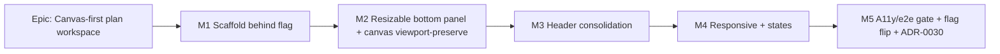

# Implementation Plan: Canvas-first plan workspace

- **Feature spec:** `docs/specs/canvas-first-plan-workspace.md`
- **Status:** Draft
- **Owner:** TBD

## Breakdown

Frontend-only. Every task keeps `main` releasable because all behaviour sits behind
`VITE_CANVAS_WORKSPACE` (default-off until M5). Flag-off = today's stacked page,
byte-for-byte.

### Epic

**Canvas-first plan workspace** — make the TSLD canvas the primary, full-height
surface of the plan workspace, with the activity table as a resizable/collapsible
bottom panel and the plan chrome condensed into a slim header. Roadmap theme: the
TSLD editing surface / plan workspace.

---

### Milestone: M1 — Canvas-first scaffold behind a flag (shippable)

**Outcome:** with `VITE_CANVAS_WORKSPACE` on, opening a plan shows a slim header, the
canvas filling the workspace, and the activity table docked at the bottom at a fixed
height (no resize yet). Flag-off is unchanged.

---

#### Feature: Flag + workspace layout skeleton

> **Description:** introduce the flag and the `PlanWorkspace` flex-column layout that
> re-homes today's sections; make the canvas fill height.
> **Complexity:** M
> **Dependencies:** ADR-0029 shell, ADR-0026 canvas (landed).
> **Risks:** re-homing many sections risks losing a capability → mitigate with a
> section-by-section checklist mirrored from the spec's re-homing table + component tests.
> **Testing requirements:** component tests that every re-homed capability renders and
> is reachable; flag-off snapshot unchanged; canvas fills its region.

##### Task 1.1 — Add `VITE_CANVAS_WORKSPACE` flag (default-off)

- **Description:** add a default-off flag helper + the flag to `config/env.ts`; document
  in `.env.example`. Default-off because gates aren't green yet (unlike the existing
  default-on flags), mirroring how `VITE_NAV_TREE` began its rollout.
- **Complexity:** S
- **Dependencies:** none
- **Risks:** accidental default-on before gates → explicit `flagDefaultOff` helper +
  test asserting off-by-default.
- **Testing:** unit test for `flagDefaultOff('true'|undefined|'1')`.
- **Development steps:**
  1. Add `flagDefaultOff` (opt-in: true only for `'true'`/`'1'`) to `config/env.ts`.
  2. Export `CANVAS_WORKSPACE_ENABLED = flagDefaultOff(import.meta.env.VITE_CANVAS_WORKSPACE)`.
  3. Document the flag in `.env.example` and update docs/env references.

##### Task 1.2 — Extract `PlanWorkspace` and branch `PlanDetailScreen`

- **Description:** move the route-composed orchestration (query composition + the
  `onTsldCreate/Reposition/Link/AutoArrange/Refresh` callbacks + gating) out of
  `PlanDetailScreen` into a `PlanWorkspace` component in
  `components/layout/workspace/`; `PlanDetailScreen` renders `PlanWorkspace` when the
  flag is on, else today's stacked JSX.
- **Complexity:** L
- **Dependencies:** 1.1
- **Risks:** behaviour drift during extraction → keep callbacks verbatim; cover with the
  existing `plan-detail.gating.test.tsx` (extend to the new component); no logic change.
- **Testing:** port/extend gating tests against `PlanWorkspace`; flag-off path asserted
  byte-for-byte (render the old tree).
- **Development steps:**
  1. Create `PlanWorkspace` = flex column (`min-h-0 flex-1`): header slot, canvas region
     (`flex-1 min-h-0`), static bottom region.
  2. Lift the callbacks + gating (`derivePlanGating`, `usePlanPen`, queries) unchanged.
  3. Branch `PlanDetailScreen` on `CANVAS_WORKSPACE_ENABLED`.
  4. Loading/error/not-found branches render inside the workspace region.

##### Task 1.3 — Make `TsldPanel`/canvas fill available height

- **Description:** drop `TsldPanel`'s fixed `h-[480px]` wrapper in favour of a fill mode
  (region provides height); verify `TsldCanvas` fills via its existing ResizeObserver.
- **Complexity:** M
- **Dependencies:** 1.2
- **Risks:** flag-off must keep the 480px look → gate fill via a prop; default keeps
  today's height. Canvas empty/not-computed states must still render at flexible height.
- **Testing:** component test that the panel fills a tall/short container; existing
  `TsldPanel` tests still pass with the prop defaulted off.
- **Development steps:**
  1. Add a `fill`/`className` prop to `TsldPanel`; when set, the canvas container is
     `h-full` (min-height floor), not `h-[480px]`.
  2. `PlanWorkspace` passes `fill`; keep read-only/empty/not-computed states.
  3. Update docs note on the canvas container height source.

---

### Milestone: M2 — Resizable, collapsible bottom activity panel (shippable)

**Outcome:** with the flag on, the user can drag the activity panel up/down, collapse
and expand it (pointer + keyboard), with height/collapsed persisted — and the canvas
does not "jump" during a resize.

---

#### Feature: Bottom panel resize/collapse + canvas viewport-preserve

> **Description:** a horizontal splitter and prefs hook plus the canvas resize amendment
> so dragging doesn't reset the viewport. **Per product-owner steer (2026-07-13): extract
> a single, orientation-aware resizable-panel primitive rather than copy the rail's — the
> existing Project Explorer rail (`RailResizer` + `use-rail-prefs`) refactors onto the
> shared primitive too, so both the rail (vertical splitter / width) and the activity panel
> (horizontal splitter / height) share one implementation.** The rail's public behaviour
> and tests must stay green through the refactor.
> **Complexity:** L
> **Dependencies:** M1.
> **Risks:** (1) canvas re-fit on every resize tick → viewport jump (addressed in 2.1);
> (2) virtualization at small heights → the table must stay usable; (3) splitter a11y.
> **Testing:** unit (prefs clamp, keyboard steps), component (states, clamps), a11y
> (separator roles/keys), interaction/perf (no viewport jump on drag).

##### Task 2.1 — Preserve canvas viewport on resize

- **Description:** amend `TsldCanvas.measure()` so a container resize re-provisions the
  backing store and repaints **without** forcing a re-fit (no `fittedRef=false` on
  resize); keep initial fit-on-mount and the explicit Fit control. Ships first so the
  drag in 2.3 is smooth.
- **Complexity:** M
- **Dependencies:** M1
- **Risks:** must not break `fitSignal`/`dataDate` re-fit or first-paint fit → keep those
  triggers; only remove the resize-driven re-fit.
- **Testing:** unit/interaction test: after a simulated resize the viewport (pan/pxPerDay)
  is unchanged; `fitSignal` still re-fits; first mount fits. Assert draw within budget.
  **Note (M2):** the jsdom test setup stubs `ResizeObserver` as a **no-op** (its callback
  never fires), so a resize cannot be driven in a unit test — the no-jump-on-drag assertion
  moves to the **M5 Playwright** interaction gate (drag the panel; assert the canvas viewport
  is stable). The code change (drop the resize-driven `fittedRef=false`; keep mount + `fitSignal`
  fits) is landed and covered by review + the existing mount-fit tests.
- **Development steps:**
  1. In `measure()`, on size change: resize backing store + set dirty, but do **not** set
     `fittedRef.current = false`.
  2. Confirm mount-time fit still runs (guard on first measured size).
  3. Add a regression test for "resize preserves viewport"; note the change for ADR-0026.

##### Task 2.2 — `useActivityPanelPrefs` hook

- **Description:** local persisted `{ height, collapsed }` with clamp + reset-on-corrupt,
  mirroring `use-rail-prefs.ts` (constants `PANEL_MIN_OPEN`, `PANEL_DEFAULT_HEIGHT`,
  `CANVAS_MIN_HEIGHT`; `clampPanelHeight`).
- **Complexity:** S
- **Dependencies:** M1
- **Risks:** stale height when viewport shrinks → clamp against a passed-in max.
- **Testing:** unit: clamp bounds, corrupt-storage reset, collapse/expand transitions.
- **Development steps:**
  1. Create the hook + constants beside the panel component.
  2. Persist under a namespaced key (e.g. `schedulepoint-activity-panel`).
  3. Expose `setHeight/collapse/expand`; clamp on read and write.

##### Task 2.3 — `ActivityPanelResizer` + `ActivityBottomPanel`

- **Description:** a horizontal `role="separator"` splitter (pointer + ArrowUp/Down +
  Home/End, `aria-orientation="horizontal"`, `aria-valuenow/min/max/text`, ≥24px hit
  area — mirroring `RailResizer`), and the panel container with collapsed handle bar and
  open (table) states; wire `ActivitiesTable` + `BaselineVarianceSummary` +
  `CreateActivityButton` inside; announce state changes via `useAnnounce`.
- **Complexity:** L
- **Dependencies:** 2.1, 2.2
- **Risks:** clamp math (canvas-min vs panel-min) → derive max from measured workspace
  height (ResizeObserver on the column); virtualization at small height → keep the
  DataTable scroll container; keyboard focus on collapse → return focus to the handle.
- **Testing:** component (collapse/expand/drag clamps, persisted restore), a11y (axe +
  keyboard resize + announcements), table still renders/scrolls at min height.
- **Development steps:**
  1. Build `ActivityPanelResizer` from the `RailResizer` template (horizontal axis).
  2. Build `ActivityBottomPanel`: collapsed handle bar (title + count + expand) and open
     body (variance summary + Add + `ActivitiesTable` in a scroll container).
  3. Wire into `PlanWorkspace`; clamp panel height to `[PANEL_MIN_OPEN, colH − HEADER −
CANVAS_MIN]`; persist; announce collapse/expand/resize.
  4. Consolidate the pen read-only note to one place.

---

### Milestone: M3 — Header consolidation (shippable)

**Outcome:** the slim `PlanHeaderBar` exposes name/status, compact summary, Recalculate,
pen status, and an overflow menu for Edit / Calendar / Baselines / Plan details —
nothing from the old page is lost.

---

#### Feature: `PlanHeaderBar` + re-homed chrome

> **Description:** compact header with a `Menu` overflow that hosts the calendar picker,
> baselines panel, edit dialog, and plan-details popover.
> **Complexity:** M
> **Dependencies:** M1 (M2 not required).
> **Risks:** capability loss / discoverability → checklist + UX review; keep controls
> gated exactly as today.
> **Testing:** component (every control present + correctly gated by role/pen), a11y
> (menu keyboard + focus), no-regression on Recalculate/baseline/calendar flows.

##### Task 3.1 — Compact header: name/status/summary/Recalculate/pen

- **Description:** header row with plan name + status badge, a compact
  `ScheduleSummaryStrip`, `RecalculateButton`, and pen status; single conditional pen strip.
- **Complexity:** M
- **Dependencies:** M1
- **Risks:** summary strip density on narrow header → responsive truncation, values in
  a popover if needed.
- **Testing:** component gating tests (canRecalc/pen); a11y.
- **Development steps:**
  1. Build `PlanHeaderBar`; place summary + Recalculate + pen status.
  2. Replace the double `PenReadOnlyNote` with one strip below the header.

##### Task 3.2 — Overflow menu: Edit / Calendar / Baselines / Plan details

- **Description:** a `Menu` (`components/ui/menu.tsx`) exposing Edit plan (opens
  `PlanFormDialog`), Calendar (opens a popover hosting `PlanCalendarPicker`), Baselines
  (popover/panel hosting `BaselinesPanel`), and Plan details (status, planned start,
  description).
- **Complexity:** M
- **Dependencies:** 3.1
- **Risks:** popover focus management → reuse house dialog/menu conventions; baselines
  panel sizing inside a popover → allow a wider panel/sheet.
- **Testing:** component (each menu item opens the right surface, gated); a11y
  (menu + dialog focus return); baseline/calendar mutations still work.
- **Development steps:**
  1. Add the overflow `Menu` to the header (keyboard/right-click parity per UX_STANDARDS).
  2. Host `PlanCalendarPicker`, `BaselinesPanel`, `PlanFormDialog`, plan-details.
  3. Preserve write-gating (role/pen) on each.

---

### Milestone: M4 — Responsive + workspace states (shippable)

**Outcome:** the workspace is mobile-first: `< md` uses a Diagram/Activities segmented
toggle; loading/error/not-found/not-computed states are covered.

---

#### Feature: Narrow-screen model + states

> **Description:** below `md`, present one pane at a time (toggle); polish workspace
> loading/empty/error states.
> **Complexity:** M
> **Dependencies:** M1–M2.
> **Risks:** breakpoint interplay with the rail drawer (< lg) → test at `sm`/`md`/`lg`.
> **Testing:** component (breakpoint behaviour), a11y (toggle is a proper control),
> visual states.

##### Task 4.1 — `< md` Diagram / Activities segmented toggle

- **Description:** below `md`, replace the split (canvas + resizer + panel) with a
  segmented control switching a single full-height pane between Diagram and Activities.
- **Complexity:** M
- **Dependencies:** M2
- **Risks:** state coherence when crossing breakpoints → derive pane from a small local
  state; canvas re-fit only on becoming visible.
- **Testing:** component: at `< md` only one pane; toggle switches; `md+` shows the split.
- **Development steps:**
  1. Add the segmented toggle (tokens/CVA) shown only `< md`.
  2. Render one pane at a time; hide the resizer `< md`.

##### Task 4.2 — Workspace loading/error/empty/not-computed states

- **Description:** workspace skeleton on load; existing not-found card on error; canvas +
  table empty-states; not-computed canvas message + header Recalculate CTA.
- **Complexity:** S
- **Dependencies:** M1
- **Risks:** skeleton layout shift → reserve header/panel heights.
- **Testing:** component per state; a11y (loading announced/labelled).
- **Development steps:**
  1. Build a workspace skeleton (header + canvas spinner + panel skeleton).
  2. Wire error/empty/not-computed branches.

---

### Milestone: M5 — A11y/e2e gate, ADR-0030, flag flip

**Outcome:** the feature meets the merge gates and is turned on by default.

---

#### Feature: Gate + enablement

> **Description:** full a11y + e2e coverage, ADR-0030 accepted, docs updated, flag
> flipped to default-on.
> **Complexity:** M
> **Dependencies:** M1–M4.
> **Risks:** flipping default-on before gates green → keep default-off until this
> milestone's checks pass, exactly as `VITE_NAV_TREE`/`VITE_TSLD_EDITING` were staged.
> **Testing:** `@axe-core/playwright` on the workspace; keyboard resize/collapse journey;
> perf assertion (no viewport jump, repaint budget).

##### Task 5.1 — E2E + a11y journeys (flag-on)

- **Description:** Playwright: open plan from the rail → canvas fills → drag panel up →
  keyboard-resize → collapse → expand; axe clean; `< md` toggle journey.
- **Complexity:** M
- **Dependencies:** M1–M4
- **Risks:** flag-on suite wiring → follow the existing `test:e2e:edit` pattern.
- **Testing:** the journeys themselves; run under a flag-on project.
- **Development steps:**
  1. Add a flag-on Playwright project + specs.
  2. Add axe checks to the workspace journey.

##### Task 5.2 — ADR-0030, docs, changeset, flag flip

- **Description:** write ADR-0030 (canvas-first workspace + bottom panel, amends
  ADR-0029; notes the ADR-0026 viewport-on-resize change); update
  FRONTEND_ARCHITECTURE/DESIGN_SYSTEM/UX_STANDARDS, CLAUDE.md §16, `.env.example`; add a
  changeset; flip `flagDefaultOff` → `flagDefaultOn` (or set default-on) once gates green.
- **Complexity:** S
- **Dependencies:** 5.1
- **Risks:** flipping without deploy confidence → flip as the final, separate step.
- **Testing:** docs/link check; CI green.
- **Development steps:**
  1. Author ADR-0030; update the ADR index + related docs.
  2. Add a changeset (minor; pre-1.0 UI change).
  3. Flip the flag default to on.

## Sequencing & slices

M1 (scaffold, fixed panel) → M2 (resize + canvas viewport-preserve; 2.1 lands before the
drag in 2.3) → M3 (header) → M4 (responsive + states) → M5 (gate + flip). Every slice is
independently shippable behind `VITE_CANVAS_WORKSPACE` (default-off); flag-off keeps
today's page byte-for-byte, so `main` stays releasable throughout. The flag flips to
default-on only in M5 after a11y/perf/e2e gates are green — the house rollout pattern.

## Definition of Done (per task)

Each task's PR satisfies the Feature Completion Criteria in `docs/PROCESS.md` (code,
tests, docs, security, performance, accessibility, Docker build, CI, changelog, version
impact). Security surface is nil here (no backend/RBAC change), but accessibility and
performance are load-bearing gates.

## Risks & assumptions (rollup)

| Risk / assumption                                    | Likelihood | Impact | Mitigation                                                                      |
| ---------------------------------------------------- | ---------- | ------ | ------------------------------------------------------------------------------- |
| Canvas re-fits (viewport jumps) on every resize tick | high       | high   | Task 2.1 preserves viewport on resize; keep explicit Fit; perf test.            |
| Re-homing loses a plan capability                    | med        | high   | Spec re-homing table as a checklist; component tests per capability; UX review. |
| Activity table unusable at small panel heights       | med        | med    | Keep DataTable scroll container + `PANEL_MIN_OPEN`; test at min height.         |
| Horizontal splitter a11y regressions                 | med        | high   | Mirror `RailResizer` roles/keys; axe + keyboard tests; accessibility-reviewer.  |
| Narrow-screen split too cramped                      | med        | med    | `< md` segmented toggle (Task 4.1); mobile-first tests.                         |
| Persisted height stale after viewport shrink         | low        | low    | Clamp against measured max; lazy re-persist.                                    |
| Flag flipped on before gates green                   | low        | high   | Default-off until M5; flip as a final separate step.                            |

Assumptions: plan URL/selection stay unchanged (ADR-0029); no backend/API/DB change;
editing gating unchanged (ADR-0028). Recommended build agents: **ui-architect** (draft
ADR-0030 + workspace layout), **component-reviewer** (panel/header API + tokens),
**accessibility-reviewer** (splitter, menus, focus, `< md` toggle), **ux-reviewer**
(header consolidation, state coverage), **performance-reviewer** (canvas repaint/no-jump
on resize).
