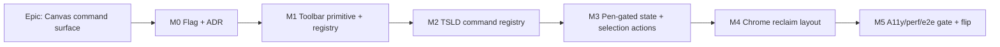

# Implementation Plan: Canvas-maximal chrome reclaim + future-proof Toolbar architecture

- **Feature spec:** `docs/specs/canvas-toolbar-architecture.md` (awaiting approval)
- **Status:** Draft (awaiting approval)
- **Owner:** TBD (frontend; ui-architect co-authors the ADR)

> **Sequencing principle:** deliverable **A (chrome reclaim) builds on B (toolbar
> architecture)** — B lands first. Everything ships behind a **new** `VITE_*` flag
> (default-off during build; flip on when a11y/e2e/perf gates are green). The legacy
> stacked page (`VITE_CANVAS_WORKSPACE=false`) and the current ADR-0030 workspace (new
> flag off) both stay untouched, so `main` is releasable after every task.

## Breakdown

### Epic

**Canvas command surface** — make the TSLD canvas the star of the plan workspace by
reclaiming chrome into a slim header + one toolbar row, on top of a durable, declarative
toolbar-item registry that absorbs the CPM/GPM feature set over the product's life.
(Refines ADR-0030; roadmap theme: TSLD / plan workspace.)

---

### Milestone: M0 — Flag + ADR (foundation)

**Outcome:** the new flag exists (default-off) and the architecture is agreed in an ADR;
no user-visible change.

#### Feature: Flag + architectural decision

> **Description:** Add the `VITE_*` flag and write the toolbar registry/taxonomy/pen-gating ADR.
> **Complexity:** S
> **Dependencies:** none
> **Risks:** ADR taxonomy churns later → mitigate by co-authoring with **ui-architect** and encoding the taxonomy as types (the compiler enforces the group set).
> **Testing requirements:** flag unit test (default-off); ADR reviewed.

##### Task 1 — Add `VITE_CANVAS_TOOLBAR` flag (default-off)

- **Description:** Add `CANVAS_TOOLBAR_ENABLED = flagDefaultOff(import.meta.env.VITE_CANVAS_TOOLBAR)` to `apps/web/src/config/env.ts` with a rollout-ordering comment.
- **Complexity:** S
- **Dependencies:** none
- **Risks:** none.
- **Testing:** unit — default-off; `"true"`/`"1"` on.
- **Development steps:** 1) add flag; 2) test; 3) note in `docs/TECH_DEBT.md` rollout tracker.

##### Task 2 — Write the ADR (registry + taxonomy + pen-gated toolbar)

- **Description:** `docs/adr/00XX-tsld-toolbar-registry-and-taxonomy.md` per the spec §4 outline; capture the two forks' chosen answers + the view-mode-slot decision.
- **Complexity:** S
- **Dependencies:** approval of this spec (fork answers)
- **Risks:** premature lock-in → keep reserved groups explicitly "reserved".
- **Testing:** n/a (doc). Update `CLAUDE.md` §16 ADR list.
- **Development steps:** 1) draft with ui-architect; 2) record fork decisions; 3) link spec/plan.

---

### Milestone: M1 — Toolbar primitive + registry (the core future-proofing)

**Outcome:** a generic, tested, APG-conformant `<Toolbar>` + `ToolbarItem` registry exist
in isolation (Storybook/test harness), independent of the TSLD. **This is the priority.**

#### Feature: Generic `<Toolbar>` primitive + registry contract

> **Description:** `ToolbarItem`/`ToolbarGroup`/`ToolbarTier`/`ToolbarContext` types; a `<Toolbar items context>` that partitions by group→tier, gates items, and demotes overflow responsively; overflow via the shared `Menu`; Tier-2 popover host.
> **Complexity:** L
> **Dependencies:** M0
> **Risks:** (a) overflow measurement thrash → one `ResizeObserver` + memoised partitions + hysteresis; (b) a11y roving-tabindex bugs → test against APG; (c) over-engineering → keep the item shape minimal, one `render` escape hatch.
> **Testing requirements:** unit (partition/order/gating/overflow determinism, invariant assertions); component (roving tabindex Arrow/Home/End, overflow keyboard, popover focus return); axe on the harness.

##### Task 1 — Registry types + `defineToolbar` + invariants

- **Description:** Define the `ToolbarItem` contract (`id, group, tier, order, icon, label, penGated, isVisible, isEnabled, isActive, onActivate|render`), `ToolbarContext`, and dev-time invariant checks (unique id, non-empty label, exactly one of onActivate/render).
- **Complexity:** M
- **Dependencies:** M0/Task2
- **Risks:** contract too rigid → validate against every current control on paper first.
- **Testing:** unit — invariant assertions; partition-by-group/sort-by-order; visibility/enable/active predicates.
- **Development steps:** 1) types; 2) `defineToolbar`; 3) pure partition/gating functions; 4) unit tests.

##### Task 2 — `<Toolbar>` render + APG keyboard model

- **Description:** `role="toolbar"`, `role="group"` per group with `aria-label`, roving tabindex, Arrow/Home/End, Tier-1 inline / Tier-2 popover trigger / Tier-3 overflow.
- **Complexity:** M
- **Dependencies:** Task 1
- **Risks:** focus management across popover/overflow → reuse `Menu`/`Dialog` focus conventions.
- **Testing:** component — keyboard nav; pressed state; disabled reasons; axe.
- **Development steps:** 1) render groups/tiers; 2) roving tabindex; 3) overflow `Menu`; 4) tests; 5) doc the primitive in `COMPONENT_LIBRARY.md`.

##### Task 3 — Responsive overflow (measure + demote)

- **Description:** One `ResizeObserver`; when Tier-1 items don't fit, demote lowest-priority (tier then order) into overflow deterministically; `⋯` always reachable.
- **Complexity:** M
- **Dependencies:** Task 2
- **Risks:** layout thrash / flicker → measure off a stable container, hysteresis, memoise.
- **Testing:** unit — demotion order given widths (jsdom width injection); component — narrow-container snapshot; Playwright covers real measurement later (M5).
- **Development steps:** 1) measurement hook; 2) demotion algorithm; 3) tests; 4) "add a command" recipe doc.

---

### Milestone: M2 — TSLD command registry (wire to existing seams)

**Outcome:** every current canvas control (zoom/scale/fit/toggles/add-activity/auto-arrange
/recalculate/legend/summary/plan-actions/shortcuts) is expressed as a registry item and
renders via `<Toolbar>` in a harness — no layout change yet (flag still off).

#### Feature: TSLD toolbar-item registry + context

> **Description:** `useToolbarContext(model, canvasHandle, uiState)` builds `ToolbarContext` from `usePlanWorkspaceModel` + local canvas state; the registry array wires groups 1–7 to existing seams (`TsldCanvasHandle`, `setViewToggles`, `setMode`, `model.onTsld*`, Recalculate, dialogs). Reserved items (view-mode slot, `Filter▾`) registered as stubs.
> **Complexity:** L
> **Dependencies:** M1
> **Risks:** (a) re-render coupling to the canvas → memoise item lists + context; never re-run `describeActivity` (ADR-0030 perf note); (b) behaviour drift from the model → items read model capability flags, never re-derive rules.
> **Testing requirements:** unit (each item's isEnabled/isActive/onActivate maps to the right seam; reserved stubs render inert); component (harness renders full set, groups/tiers correct).

##### Task 1 — Context builder

- **Description:** `useToolbarContext` composing selection/mode/zoom/view + model gating + canvas handle + command callbacks.
- **Complexity:** M
- **Dependencies:** M1
- **Risks:** stale closures → derive from current model each render, memoise stable callbacks.
- **Testing:** unit — context reflects model flags + ui state.
- **Development steps:** 1) hook; 2) tests.

##### Task 2 — Frame/Lens/Help items (read-only groups)

- **Description:** Scale presets, zoom −/+, Fit, Today, `View▾`, view-mode slot (reserved), `Legend▾`, shortcuts, `Summary▾` + Project-finish chip.
- **Complexity:** M
- **Dependencies:** Task 1
- **Risks:** duplicate legend/summary logic → import existing `LEGEND`/`ScheduleSummaryStrip`/`TsldViewControls` internals, don't rewrite.
- **Testing:** unit — item mapping; component — popovers render existing content.
- **Development steps:** 1) items; 2) popover bodies; 3) tests.

##### Task 3 — Author + Plan-actions items

- **Description:** `+ Add Activity`, Link (button, Fork-1 default), Auto-arrange, Milestone (reserve); Recalculate, Baselines, Calendar, Plan details, Export (reserve). Absorb `PlanActionsMenu` items into the overflow group.
- **Complexity:** M
- **Dependencies:** Task 1
- **Risks:** losing a `PlanActionsMenu` capability → checklist parity test.
- **Testing:** unit — each maps to model/dialog; parity checklist vs current `PlanActionsMenu`.
- **Development steps:** 1) items; 2) dialog wiring reuse; 3) tests.

---

### Milestone: M3 — Pen-gated state + selection actions

**Outcome:** the Author group flips on/off as a set with a compact pen status (no big
banner card), and selecting an object surfaces its actions — still in the harness/behind
the flag.

#### Feature: Pen-gated toolbar + compact pen status

> **Description:** `penGated` items enable/disable as a set from `ctx.editing`; a compact pen-status control reuses `resolveLockView` + `EditLockControls` so the full ADR-0028 hand-off (Start/Stop/Request/Take-over/Override/Keep/Dismiss, incoming request, lost control) stays reachable and announced.
> **Complexity:** M
> **Dependencies:** M2
> **Risks:** regressing the ADR-0028 hand-off or its announcements → reuse the existing view-resolution + controls; keep the live region; parity test vs `EditLockBanner`.
> **Testing requirements:** unit (group flips with pen; capability race no-ops + announces); component (compact control exposes every ADR-0028 action; live-region announced; focus return); a11y.

##### Task 1 — Pen-gating as a group state

- **Description:** Author group + selection author-actions gate on `ctx.editing`; disabled reason surfaced.
- **Complexity:** S
- **Dependencies:** M2
- **Testing:** unit — set on/off; race no-op.
- **Development steps:** 1) gating; 2) tests.

##### Task 2 — Compact pen-status control

- **Description:** Replace the big `EditLockBanner` card with a compact status + primary action in the header/toolbar; surface transient prompts without stealing focus.
- **Complexity:** M
- **Dependencies:** Task 1
- **Risks:** hand-off UX regressions → **accessibility-reviewer** pass; keep `role="status"`.
- **Testing:** component — every action reachable; announced; e2e later.
- **Development steps:** 1) control reusing lock internals; 2) transient prompt surfacing; 3) tests.

#### Feature: Selection-contextual actions (floating default — Fork 2)

> **Description:** With a bar/link selected, a floating (default) surface of registry-driven object actions: Edit, Delete, Set constraint, Open logic — pen-gated, keyboard-reachable, focus-returning.
> **Complexity:** M
> **Dependencies:** M2
> **Risks:** floating positioning + canvas viewport interplay → anchor off selection geometry; don't disturb `aria-activedescendant`.
> **Testing requirements:** unit (visibility on selection kind); component (keyboard reach, focus return, dismiss on deselect); a11y.

##### Task 1 — Selection-actions surface

- **Description:** Floating bar consuming the object-action registry items; shows/hides on `ctx.selection`.
- **Complexity:** M
- **Dependencies:** M2, Pen-gating Task 1
- **Testing:** unit + component per above.
- **Development steps:** 1) surface; 2) wire object-action items; 3) tests.

---

### Milestone: M4 — Chrome reclaim layout (A builds on B)

**Outcome:** behind the new flag, the plan workspace shows a slim header + one `<Toolbar>`
row + full-height canvas + collapsed-by-default activities panel; every former band is
reachable in ≤ 1 interaction.

#### Feature: Slim header + toolbar-hosted workspace

> **Description:** Refactor `plan-workspace.tsx`/`PlanHeaderBar` to collapse the 7 bands into header + `<Toolbar>`; make `TsldPanel` chromeless when hosted here (drop its hint/`TsldToolbar`/`TsldViewControls`/legend); activities panel collapsed by default on this surface. Flag-branch only; ADR-0030 layout is the flag-off path.
> **Complexity:** L
> **Dependencies:** M2, M3
> **Risks:** (a) canvas height/fit regressions → reuse ADR-0030 `ResizeObserver` clamp + viewport-preserve; (b) `<md` behaviour → keep the Diagram/Activities `radiogroup`; (c) hidden capability → reachability checklist.
> **Testing requirements:** unit (flag branch; collapsed-by-default); component (header renders; canvas fills); Playwright height assertion (M5).

##### Task 1 — Collapse header bands into header + Toolbar

- **Description:** Replace `PlanHeaderBar`'s banner/summary with the slim line + compact pen status + `⋯`; mount `<Toolbar>` above the canvas.
- **Complexity:** M
- **Dependencies:** M2, M3
- **Risks:** breadcrumb/title/status regressions → keep existing `Breadcrumbs`.
- **Testing:** component — two rows only; every band reachable.
- **Development steps:** 1) header refactor; 2) mount Toolbar; 3) tests.

##### Task 2 — Chromeless `TsldPanel` + collapsed-by-default panel

- **Description:** `TsldPanel` accepts a `chromeless` prop (or the workspace hosts a bare canvas) so it stops drawing its own toolbar/legend/hint; activities panel defaults collapsed via `use-activity-panel-prefs`.
- **Complexity:** M
- **Dependencies:** Task 1
- **Risks:** legacy workspace must keep its chrome → gate on the flag/prop, don't remove.
- **Testing:** unit — collapsed default; component — canvas + listbox intact.
- **Development steps:** 1) `chromeless` prop; 2) default-collapsed; 3) tests.

---

### Milestone: M5 — Quality gate + flip (default-on)

**Outcome:** a11y/perf/e2e gates green; the flag flips default-on; docs + ADR finalised.

#### Feature: Journey, reviews, and flip

> **Description:** A flag-on Playwright journey (mirror `test:e2e:workspace`): height assertion, command reachability, keyboard nav, axe zero-violations, pen read-only announced. Address ux/a11y/component review findings; flip the flag default-on; update docs.
> **Complexity:** M
> **Dependencies:** M4
> **Risks:** perf regression (toolbar re-renders touch the canvas) → **performance-reviewer** pass + the ADR-0030 memoisation guard; jsdom can't measure overflow → assert in Playwright.
> **Testing requirements:** e2e/a11y journey; the M1–M4 unit/component suites green; coverage ≥ 80% on changed code.

##### Task 1 — Playwright flag-on journey + axe

- **Complexity:** M · **Dependencies:** M4 · **Testing:** height, reachability, keyboard, axe.
- **Development steps:** 1) e2e project; 2) assertions; 3) wire into CI.

##### Task 2 — Specialist review passes + fixes

- **Complexity:** M · **Dependencies:** Task 1 · **Testing:** re-run suites after fixes.
- **Development steps:** 1) **ux-reviewer**; 2) **accessibility-reviewer**; 3) **component-reviewer**; 4) **performance-reviewer**; 5) fold findings.

##### Task 3 — Flip default-on + docs/ADR finalise + changeset

- **Complexity:** S · **Dependencies:** Task 2
- **Development steps:** 1) `flagDefaultOff`→`flagDefaultOn` with rollout note; 2) update `FRONTEND_ARCHITECTURE.md`/`DESIGN_SYSTEM.md`/`COMPONENT_LIBRARY.md`/`UX_STANDARDS.md`, ADR-0030 note, `CLAUDE.md` §16; 3) changeset (minor).

## Sequencing & slices

1. **M0** flag + ADR (no user change; `main` releasable).
2. **M1** toolbar primitive + registry in isolation — **the priority; get the types/seam
   right here.** Independently testable/valuable.
3. **M2** TSLD command registry wired to existing seams (harness only; flag off).
4. **M3** pen-gating + selection actions (harness/flag).
5. **M4** chrome-reclaim layout consumes M1–M3 behind the flag (**A builds on B**).
6. **M5** gates green → flip default-on.

Each milestone is a thin, flag-gated slice; the current ADR-0030 workspace (flag off) and
the legacy stacked page (`VITE_CANVAS_WORKSPACE=false`) remain the releasable fallbacks
throughout.

## Definition of Done (per task)

Each task's PR satisfies the Feature Completion Criteria in `docs/PROCESS.md` (code, tests,
docs, security, performance, accessibility, Docker build, CI green, changelog/changeset,
version impact). Frontend-only: security surface is limited to preserving deny-by-default
gating reflection; a11y and performance are the load-bearing gates.

## Risks & assumptions (rollup)

| Risk / assumption                                      | Likelihood | Impact | Mitigation                                                                                                      |
| ------------------------------------------------------ | ---------- | ------ | --------------------------------------------------------------------------------------------------------------- |
| Overflow measurement thrash / flicker                  | med        | med    | One `ResizeObserver`, memoised partitions, hysteresis; Playwright covers real measurement.                      |
| Toolbar re-renders touch the canvas (perf)             | med        | high   | Memoise item lists + context; never re-run `describeActivity`; performance-reviewer + ADR-0030 guard.           |
| ADR-0028 pen hand-off regresses in the compact control | med        | high   | Reuse `resolveLockView`/`EditLockControls`; keep the live region; accessibility-reviewer parity check.          |
| A capability silently lost in the reclaim              | med        | high   | Reachability checklist vs ADR-0030 + `PlanActionsMenu`; e2e reachability assertions.                            |
| Registry contract churns after adoption                | low        | med    | ui-architect co-owns; taxonomy encoded as types; reserved groups explicit.                                      |
| Fork decisions change scope late                       | low        | med    | Two forks + view-mode surfaced as critical questions; defaults let M1–M2 proceed regardless (reserve-friendly). |
| `<md` toolbar too dense on phones                      | med        | med    | Aggressive overflow (Tier-1 = scale + Add Activity + `⋯`); keep the Diagram/Activities toggle.                  |
