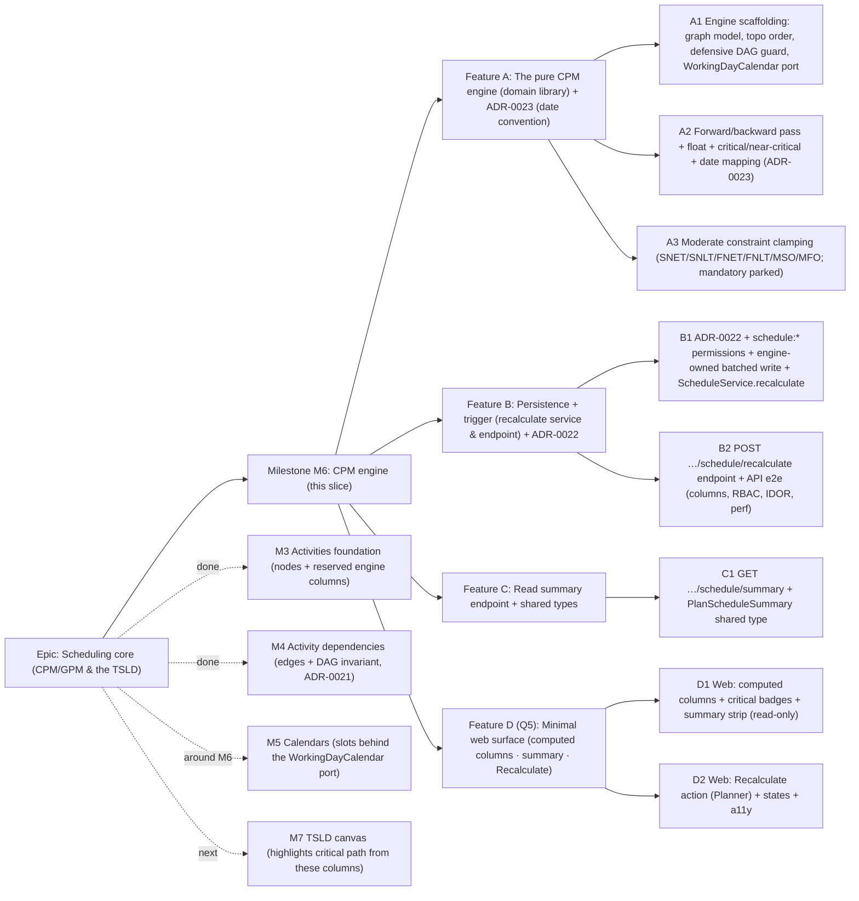

# Implementation Plan: CPM engine (forward/backward pass, float, critical path)

- **Feature spec:** [`docs/specs/cpm-engine.md`](../specs/cpm-engine.md)
- **Status:** Draft — awaiting approval (five critical questions in the spec §1, each with a recommended default).
- **Owner:** Feature Analyst / Claude

## Breakdown

### Epic

**Scheduling core (CPM/GPM & the TSLD)** — deliver the schedule model and engine that
make SchedulePoint a scheduling tool. **M3** delivered the nodes (Activities, incl. the
reserved engine-owned columns); **M4** delivered the edges (Dependencies) and the DAG
invariant (ADR-0021). **This plan covers M6**, the **CPM engine** that reads that DAG
and populates the reserved columns. **M5 (Calendars)** slots behind the engine's
`WorkingDayCalendar` port (either order); **M7 (TSLD canvas)** consumes the computed
columns to highlight the critical path — both are additive on this slice and are **not
specced here**.

### Milestone: M6 — CPM engine (shippable slice)

**Outcome:** a Planner (or Org Admin) can **recalculate a plan** and get a correct
**planned** schedule — early/late start & finish, total float, and the live **critical
path** (plus near-critical) — persisted on every activity and summarised at the plan
level (project finish, critical count). The engine honours all four relationship types
with lag and the six moderate constraints, is proven against a **golden suite** of
hand-worked networks, runs **synchronously** within the brief's performance targets
(< 500ms @ 500, < 2s @ 2,000), and writes its results **without** disturbing the
optimistic-lock `version` or any definition/progress column. Readers see the computed
schedule (columns already on the activity response; a summary endpoint aggregates them).
Per the Q5 default, a **minimal web surface** shows the dates + critical badges and
offers a Recalculate action. `main` stays releasable after every task: the pure engine
lands first (unused, fully unit-tested), then persistence + endpoint, then web.

---

#### Feature A: The pure CPM engine (domain library) + ADR-0023

> **Description:** A **dependency-free domain library** (`apps/api/src/schedule/engine/`)
> — the graph model, a Kahn **topological order** with a **defensive DAG guard**, the
> **forward/backward pass**, **moderate-constraint clamping**, **total float** and
> **critical/near-critical**, and the offset→date mapping behind a **`WorkingDayCalendar`
> port** (MVP: all-days-work). Plus **ADR-0023** (the date convention). No HTTP, no
> Prisma — pure functions, exhaustively unit-tested against a **golden suite** of
> hand-worked CPM networks. This is the correctness core and lands first, unused, so
> `main` stays releasable.
> **Complexity:** L
> **Dependencies:** none (pure library; reads plain input structs the service will build).
> **Risks:** CPM correctness is a **top product risk** (PROJECT_BRIEF §17) → golden-suite
> parity is the mitigation; off-by-one in the inclusive-date mapping and milestone
> (duration-0) handling → the continuous-internal / inclusive-display convention (ADR-0023)
>
> - explicit milestone tests; constraint clamping getting float wrong → per-constraint
>   unit tests incl. negative float.
>   **Testing requirements:** unit only — each of FS/SS/FF/SF with positive/negative lag;
>   a zero-duration milestone; each supported constraint; parallel paths with a distinct
>   critical chain; the near-critical band boundary (float exactly 5 vs 6); empty / island
>   / multi-open-start / multi-open-end plans; the **defensive DAG guard** (a hand-injected
>   cycle throws, does not loop); a known **worked CPM example** whose ES/EF/LS/LF/float
>   and critical set are verified by hand.

##### Task A1 — Engine scaffolding: graph model, topological order, DAG guard, calendar port (≈ one PR)

- **Description:** Create `schedule/engine/` with the input/output types
  (`EngineActivity` {id, durationDays, type, constraintType?, constraintDate?},
  `EngineEdge` {predecessorId, successorId, type, lagDays}, `EngineResult` per activity,
  `EngineSummary`), a `buildGraph` + **Kahn topological sort** with a **defensive DAG
  guard** (residual cycle → throw `ScheduleGraphNotADagError`), and the
  **`WorkingDayCalendar`** port (`addWorkingDays(date, n)`, `workingDaysBetween(a, b)`)
  with the trivial **all-days-work** implementation. Export shared constants
  (`NEAR_CRITICAL_THRESHOLD_WORKING_DAYS = 5`). No pass maths yet.
- **Complexity:** M
- **Dependencies:** none
- **Risks:** the port surface must be small enough that M5 can implement it without
  engine change → keep it to add/between only; Kahn must be deterministic (stable node
  order) for reproducible results → sort seeds by id.
- **Testing:** unit — topo order of a known DAG; deterministic ordering; the DAG guard
  throws on an injected 2-node and 3-node cycle; the all-days-work calendar maps offsets
  1:1.
- **Development steps:**
  1. Engine types + `buildGraph` + Kahn topo sort + `ScheduleGraphNotADagError`.
  2. `WorkingDayCalendar` port + all-days-work impl + constants.
  3. Unit tests for topo/guard/calendar; no docs/changeset yet (internal, not wired).

##### Task A2 — Forward/backward pass, float, critical/near-critical, date mapping + ADR-0023 (≈ one PR)

- **Description:** Implement the **forward pass** (ES/EF in continuous offsets; `EF = ES
  - D`; ES = max of incoming FS/SS/FF/SF-with-lag bounds and 0), the **project finish**
(`T = max EF`), the **backward pass** (LF/LS; LF = min of outgoing bounds and T), the
**total float** (`LS − ES`), and **critical (≤0) / near-critical (0<TF≤5)** flags;
then the **offset→inclusive-date mapping** via the calendar port (task `early_finish =
    DD + EF − 1`; milestone `early_finish = early_start`; symmetric for late). Write
**ADR-0023 — CPM scheduling date convention** (data date = `plannedStart`; continuous-
    internal / inclusive-display; milestone rule; working-days = calendar-days seam;
    relationship-bound table). Constraints handled in A3 (this task ignores them).
- **Complexity:** L
- **Dependencies:** A1
- **Risks:** the four relationship types + signed lag are the crux → a golden-network
  test per type (positive and negative lag); milestone off-by-one → explicit start/finish-
  milestone tests; multi-predecessor max / multi-successor min → parallel-path test.
- **Testing:** unit — the worked CPM example (all ES/EF/LS/LF/float verified by hand);
  each relationship type + lag; a milestone; parallel paths with the correct critical
  chain; near-critical boundary (TF = 5 near-critical, TF = 6 neither); islands and
  multi-open-end.
- **Development steps:**
  1. Forward pass + relationship lower-bound arithmetic (per the spec §4 table).
  2. Project finish + backward pass + upper-bound arithmetic + float + flags.
  3. Offset→inclusive-date mapping via the calendar port; ADR-0023; golden-suite unit
     tests; changeset (engine library user-visible once wired — small changeset OK).

##### Task A3 — Moderate constraint clamping (SNET/SNLT/FNET/FNLT/MSO/MFO; mandatory parked) (≈ one PR)

- **Description:** Add constraint clamping to the passes: **forward** — `SNET` (`ES ≥
c`), `FNET` (`EF ≥ c`), `MSO` (`ES = c`), `MFO` (`EF = c`); **backward** — `SNLT` (`LS
≤ c`), `FNLT` (`LF ≤ c`), `MSO` (`LS = c`), `MFO` (`LF = c`) — converting
  `constraintDate` to an offset via the calendar port. **Park** `MANDATORY_START` /
  `MANDATORY_FINISH` as their moderate equivalents (`MSO`/`MFO`) and count them in the
  summary's `parkedConstraintCount`. Ensure a constraint logic cannot satisfy yields
  **negative total float** (surfaced, not error).
- **Complexity:** M
- **Dependencies:** A2
- **Risks:** constraints interacting with float is the subtle part → a unit test per
  constraint type incl. a violated `FNLT` producing negative float and criticality;
  `MSO`/`MFO` pinning must not silently drop logic-driven lateness → tested; mandatory
  parking must be visible (count + documented), not silent.
- **Testing:** unit — one network per constraint type asserting the clamped date and the
  resulting float; a violated-constraint (negative float, critical) case; a
  `MANDATORY_*` treated as `MSO`/`MFO` with `parkedConstraintCount` incremented.
- **Development steps:**
  1. Constraint offset conversion + forward clamps (SNET/FNET/MSO/MFO).
  2. Backward clamps (SNLT/FNLT/MSO/MFO) + mandatory-parking + `parkedConstraintCount`.
  3. Per-constraint unit tests incl. negative float; update ADR-0023's constraint table;
     changeset.

---

#### Feature B: Persistence + trigger (recalculate service & endpoint) + ADR-0022

> **Description:** The **`schedule` module** (controller → `ScheduleService` →
> repository), copied from the reference template: it loads the plan's active activities
> (M3 repo) and active dependencies (M4 `findActiveEdgesByPlan`), runs the **pure engine**
> (Feature A), and **persists** the seven engine-owned columns via a **batched raw
> `UPDATE`** that never touches `version`/`updated_by`/`updated_at` — all in **one
> transaction under the plan-scoped lock** (reusing ADR-0021's lock). Plus **ADR-0022**
> (execution & persistence model) and the new **`schedule:*`** permissions. The
> **`POST …/schedule/recalculate`** endpoint exposes it synchronously.
> **Complexity:** L
> **Dependencies:** Feature A; the M3 activity repo + M4 `findActiveEdgesByPlan` on `main`.
> **Risks:** the engine-owned write **must not** bump `version` or collide with a
> definition/progress edit → targeted raw `UPDATE` of only the seven columns +
> concurrent-edit test; recompute racing a dependency create / another recompute →
> plan-scoped lock (ADR-0021) + test; hitting the perf NFR at 2,000 activities → two
> indexed loads + one batched `unnest` write + a perf test; IDOR/cross-plan → resolveScope
>
> - plan-scoped loads + e2e.
>   **Testing requirements:** unit (`ScheduleService`: scope/authz, 422 no-start, empty
>   plan no-op, results mapped to the batched write, lock acquired) + API e2e (recompute
>   populates the columns; `version`/`updated_by` unchanged; RBAC 403; multi-path plan →
>   expected critical set; IDOR/cross-plan 404; 422 no-start; perf smoke at 500/2,000).

##### Task B1 — ADR-0022 + `schedule:*` permissions + engine-owned write + `ScheduleService.recalculate` (≈ one PR)

- **Description:** Write **ADR-0022 — CPM execution & persistence model** (synchronous
  explicit endpoint vs on-write vs queued — options, choice, the brief's "synchronous in
  v1" steer; the plan-scoped-lock reuse; the **engine-owned batched write bypassing
  optimistic locking**; the scale ceiling + when to consider the queued path). Add
  `schedule:read` to `HIERARCHY_READ` and `schedule:calculate` to `HIERARCHY_WRITE` in
  `org-permissions.ts` (unit the matrix). Implement `ScheduleRepository`: a **plan-scoped
  lock** acquire (advisory / `SELECT … FOR UPDATE` on `plans`), the two active loads
  (reuse M3/M4 methods), and the **batched raw `UPDATE`** of the seven engine columns via
  `unnest($1::uuid[], $2::date[], …)`. Implement `ScheduleService.recalculate(principal,
orgSlug, planId)`: resolveScope → assertCan → load plan (404) → 422 if no
  `plannedStart` → tx { lock → load graph → engine.compute → batched write → audit } →
  return the summary. No controller yet.
- **Complexity:** L
- **Dependencies:** A2 (A3 for constraints), M3/M4 repos.
- **Risks:** the raw `UPDATE` casts/shape → **database-architect** review; forgetting to
  bypass `@updatedAt` → assert `updated_at`/`version` unchanged in a test; lock choice
  (advisory vs `FOR UPDATE`) must match ADR-0021 → reuse the same helper.
- **Testing:** unit — authz/scope, 422 no-start, empty-plan no-op, the write includes
  only the seven columns (spy/asserts version untouched), lock acquired before load; a
  small end-to-end service test over a known network asserting persisted values.
- **Development steps:**
  1. ADR-0022; `schedule:*` permissions + matrix unit test.
  2. `ScheduleRepository` (lock, loads, batched `unnest` UPDATE) + `ScheduleService.
recalculate` + audit; wire the engine + all-days-work calendar.
  3. `docs/PERFORMANCE.md` (recompute NFR + batched write) + `docs/OBSERVABILITY.md`
     (recompute log/metric); changeset.

##### Task B2 — `POST …/schedule/recalculate` endpoint + API e2e (≈ one PR)

- **Description:** Add `ScheduleController` with `POST
/organizations/:orgSlug/plans/:planId/schedule/recalculate` (`schedule:calculate`;
  `ParseUuidPipe` on `planId`; returns `200 { data: PlanScheduleSummaryDto }`; 422
  `PLAN_START_REQUIRED`; 403/404 per the matrix) and the module wiring. Map the engine's
  `ScheduleGraphNotADagError` to a **loud 500 + distinct log** (should be unreachable —
  ADR-0021). Full API e2e + a performance smoke.
- **Complexity:** M
- **Dependencies:** B1
- **Risks:** the endpoint is the only write path → security-reviewer on scope/IDOR and
  that it cannot mutate definition/progress; perf NFR → e2e timing at 500/2,000 in CI
  (as a smoke, not a hard gate initially).
- **Testing:** API e2e — recompute a multi-path plan → 200 + summary; the persisted
  activity columns match the expected critical set; `version`/`updated_by` unchanged;
  Viewer/Contributor → 403; non-member/foreign/other-plan → 404; no `plannedStart` →
  422; a 500-activity plan completes within budget (smoke).
- **Development steps:**
  1. `ScheduleController` + module + error mapping; `PlanScheduleSummaryDto`.
  2. OpenAPI + `docs/API.md` (the endpoint, statuses, the 422/500 taxonomy).
  3. API e2e matrix + perf smoke; changeset.

---

#### Feature C: Read summary endpoint + shared types

> **Description:** The read-side `GET …/schedule/summary` that aggregates the **persisted**
> columns (max `early_finish`, `count(is_critical)` …) **without** recomputing, plus the
> **`PlanScheduleSummary`** shared type in `@repo/types` (source of truth for the web).
> Thin, additive, read-only.
> **Complexity:** S
> **Dependencies:** B1 (the summary shape/DTO) — can land alongside B2.
> **Risks:** the aggregate must be a single indexed query, not N+1 → one grouped query;
> keep the summary shape identical to what recalculate returns (one DTO/type).
> **Testing requirements:** unit (aggregate maps null finish when never computed) + API
> e2e (summary reflects the last recompute; RBAC read for all roles; IDOR 404).

##### Task C1 — `GET …/schedule/summary` + `PlanScheduleSummary` shared type (≈ one PR)

- **Description:** Add the `PlanScheduleSummary` type + const shape to `packages/types`;
  add the controller route (`schedule:read`) and a `ScheduleService.summary(...)` that
  runs a single aggregate over the plan's active activities (max `early_finish`, counts
  of critical/near-critical, activity count, `dataDate = plannedStart`) and returns the
  same DTO as recalculate.
- **Complexity:** S
- **Dependencies:** B1
- **Risks:** an empty/never-computed plan → null-safe aggregate; keep read RBAC as
  `schedule:read` (all members).
- **Testing:** unit (null finish when uncomputed; counts correct); API e2e (reflects the
  last recompute; all roles read; 404 for foreign/other-plan).
- **Development steps:**
  1. `PlanScheduleSummary` in `@repo/types` (lock-step with the DTO).
  2. `GET summary` route + aggregate service method.
  3. OpenAPI/`API.md`; changeset.

---

#### Feature D (Q5 default — drop if deferred to M7): Minimal web surface

> **Description:** Make the engine **visible** in the existing M3 plan view — computed
> columns + critical/near-critical badges (read-only), a schedule **summary strip**, and
> a Planner-only **Recalculate** action — reusing the design-system primitives. **No new
> route; no canvas.** If the human chooses the engine-first cut (Q5), this whole feature
> is dropped and the engine ships API-only.
> **Complexity:** M
> **Dependencies:** Features B + C (the endpoints + `PlanScheduleSummary`) + the M3
> `plan-detail` activities table.
> **Risks:** the Recalculate action must surface the 422 (no start date) as a friendly
> inline prompt, not a raw error; a11y of the new columns/badges/summary + action →
> primitives + axe; keep it a clean seam the M7 canvas supersedes (highlighting lives
> there, not here); dates formatted per PROJECT_BRIEF §15 (dd-MMM-yyyy).
> **Testing requirements:** component (computed columns + badges render incl.
> empty/"not calculated" state; summary strip; Recalculate visibility per role; 422
> prompt) + Playwright (Planner recalculates → dates/badges/summary appear; Viewer sees
> read-only) + axe; loading/empty/error states covered.

##### Task D1 — Web: computed columns + critical badges + summary strip (read-only) (≈ one PR)

- **Description:** `features/schedule` (or extend `features/activities`) — a
  `useScheduleSummary(planId)` hook (extend the query-key factory with `scheduleKeys`),
  date/float formatters, a `ScheduleSummaryStrip` (project start/finish, duration,
  critical count; "not yet calculated" empty state), and **read-only** computed columns
  (early/late start & finish, total float) + a **critical / near-critical badge** column
  added to the M3 `ActivitiesTable`.
- **Complexity:** M
- **Dependencies:** C1
- **Risks:** empty/never-computed plan → clear "not calculated" states; column density on
  mobile → responsive/columns-hide per the design system; badge colour never the only
  signal (a11y — pair with text).
- **Testing:** component (columns/badges/summary render across empty/loading/error/
  populated; formatters); Playwright (open plan → read-only schedule visible) + axe.
- **Development steps:**
  1. `scheduleKeys` + `useScheduleSummary` + formatters.
  2. `ScheduleSummaryStrip` + computed columns + badge column in `ActivitiesTable`.
  3. Empty/loading/error states; changeset.

##### Task D2 — Web: Recalculate action (Planner) + states + a11y (≈ one PR)

- **Description:** A `useRecalculate(planId)` mutation and a `RecalculateButton` gated on
  `schedule:calculate` (Planner/Org Admin), which on success invalidates and refetches
  the activities + summary queries; surface **422 `PLAN_START_REQUIRED`** as a friendly
  inline prompt ("set the plan's start date first"), and other errors as a toast.
  Readers do not see the action.
- **Complexity:** M
- **Dependencies:** D1, B2
- **Risks:** the API is authoritative (client never computes) — the button just triggers
  - refetches; permission-gating must match the server; loading/disabled states during
    the (sub-second, but possibly 2s) recompute; a11y of the action + prompt.
- **Testing:** component (action visibility per role; 422 prompt; success refetch; busy/
  disabled state); Playwright (Planner recalculates → dates & badges & summary update;
  no-start plan → inline prompt) + axe.
- **Development steps:**
  1. `useRecalculate` + `RecalculateButton` + role gating.
  2. 422/error surfacing + query invalidation/refetch + busy state.
  3. a11y polish; changeset.

## Sequencing & slices

Strict order; each PR keeps `main` releasable:

1. **A1 → A2 → A3** — the **pure engine** + ADR-0023. Lands **unused** but fully
   unit-tested (golden suite). No user-facing behaviour; `main` builds/releases.
2. **B1 → B2** — persistence + the recalculate endpoint + ADR-0022. After B2 the engine
   is **usable via HTTP** (exercisable by e2e/curl) and the reserved columns populate;
   `version` stays untouched.
3. **C1** — the read summary endpoint + `PlanScheduleSummary` (can land alongside B2).
4. **D1 → D2** — the minimal web surface (read-only columns/badges/summary, then the
   Recalculate action). After D2 the milestone outcome is met end-to-end in the UI.

**Optional cut (Q5 = defer web):** stop after **C1** and ship the engine **API-only**;
Feature D moves into M7 with the canvas. The sequence is designed so this is a clean
boundary — nothing in A–C depends on D.

No feature flags required — each slice is additive and independently valuable (the engine
is correct and tested before it is wired; the API works before the screens; reads work
before the Recalculate action). `is_driving`, progress-aware forecasting, the per-plan
near-critical threshold, true hammock/LOE derivation, and rich critical-path
highlighting are explicitly deferred (fast-follows / M7).

## Definition of Done (per task)

Each task's PR must satisfy the Feature Completion Criteria in
[`docs/PROCESS.md`](../PROCESS.md): code to the approved design, tests (unit golden-suite

- API e2e + web/e2e/a11y as relevant, ≥ 80% on changed code, a **perf smoke** at
  500/2,000), docs (OpenAPI/`API.md`, `PERFORMANCE.md`, `OBSERVABILITY.md`, `ADR-0022`,
  `ADR-0023`, `CLAUDE.md`, `ROADMAP.md`), **security review** (org + plan scope/IDOR; the
  recompute cannot mutate definition/progress; engine-owned write), **performance**
  (two indexed loads, O(V+E) compute, one batched write, no N+1; the recompute NFR),
  **accessibility** (WCAG 2.2 AA on any web), Docker build + CI green, a changeset, and
  version-impact assessed. **No schema migration** in this slice (engine columns pre-exist).

**Recommended agents:** **database-architect** (B1 — the batched `unnest` `UPDATE`
shape/casts, confirming the `(plan_id, created_at, id)` index serves the load, the lock
choice consistent with ADR-0021); **security-reviewer** (B1/B2 — org/plan scope + IDOR,
that the engine write is column-scoped and cannot be abused to edit definitions/progress,
deny-by-default on the two routes); **api-reviewer** (B2/C1 — endpoint shapes, envelopes,
the 200/422/404/403 taxonomy, the summary DTO); **backend-performance-reviewer** (B1/B2 —
the two loads, the O(V+E) compute, the single batched write, and the < 500ms/ < 2s NFR at
500/2,000); **test-engineer** (the golden-suite unit design + the e2e/RBAC/IDOR/perf
matrices + the concurrent-edit / version-untouched test); **component-reviewer** +
**ux-reviewer** + **accessibility-reviewer** (D1/D2 — the computed columns, badges,
summary strip, and Recalculate action).

## Risks & assumptions (rollup)

| Risk / assumption                                                       | Likelihood     | Impact | Mitigation                                                                                                            |
| ----------------------------------------------------------------------- | -------------- | ------ | --------------------------------------------------------------------------------------------------------------------- |
| Execution model — sync endpoint vs on-write vs queued — **critical Q1** | med            | high   | Default = **synchronous explicit endpoint** (matches brief §14); ADR-0022. Auto-trigger/queue additive later.         |
| Planned-only vs progress-aware — **critical Q2**                        | med            | med    | Default = **planned-only** (ignore actuals); progress-aware is an additive later slice; keeps golden suite clean.     |
| Constraint scope — **critical Q3**                                      | med            | med    | Default = **six moderate** constraints; mandatory parked as MSO/MFO + counted; full parity is a fast-follow.          |
| Near-critical threshold — **critical Q4**                               | low            | low    | Default = **≤ 5 working days**, fixed constant; per-plan setting is a trivial additive follow-up.                     |
| Web in this slice vs deferred to M7 — **critical Q5**                   | med            | low    | Default = **minimal web slice** (columns/badges/summary + Recalculate); Feature D is a clean, droppable cut.          |
| **CPM correctness** (P6-parity trust — PROJECT_BRIEF §17)               | med            | high   | Pure engine + **golden-suite** unit tests per type/lag/milestone/constraint/parallel/near-critical; ADR-0023.         |
| Engine write bumps `version` / collides with a user edit                | med            | high   | Targeted raw `UPDATE` of **only** the 7 engine columns; bypass `@updatedAt`; concurrent-edit + version test.          |
| Off-by-one in inclusive dates / milestone (duration-0) handling         | med            | med    | Continuous-internal / inclusive-display convention (ADR-0023) + explicit milestone/boundary unit tests.               |
| Recompute races a dependency create / another recompute                 | low            | med    | **Plan-scoped lock** reused from ADR-0021; serialised per plan; consistent snapshot; race test.                       |
| Perf NFR missed at 2,000 activities (< 2s)                              | low            | med    | Two indexed loads + O(V+E) compute + one batched `unnest` write; perf smoke in CI; queued path documented (ADR-0022). |
| Residual cycle reaches the engine (invariant breach)                    | very low       | high   | ADR-0021 guarantees the DAG; engine's **defensive** Kahn guard fails loud (logged), never loops/persists garbage.     |
| Constraint conflict handling confuses users                             | low            | med    | Surface as **negative float + critical** in MVP; a dedicated conflicts report is deferred + documented.               |
| IDOR / cross-tenant or cross-plan recompute/summary                     | low            | high   | `resolveScope` (404) + plan-scoped, org-filtered loads; e2e IDOR/cross-plan matrix.                                   |
| `plannedStart` null at recompute                                        | med            | low    | **422 `PLAN_START_REQUIRED`** with a friendly prompt; no implicit "today".                                            |
| M5 Calendars changes working-day math                                   | high (planned) | low    | Engine built against the **`WorkingDayCalendar` port**; M5 slots a real calendar with **no engine change**.           |
| Hammock / LOE modelled as fixed-duration in MVP                         | low            | low    | Documented deferral; web exposes only TASK + milestones (M3), so invisible now; derived-duration is a follow-up.      |

</content>
</invoke>
