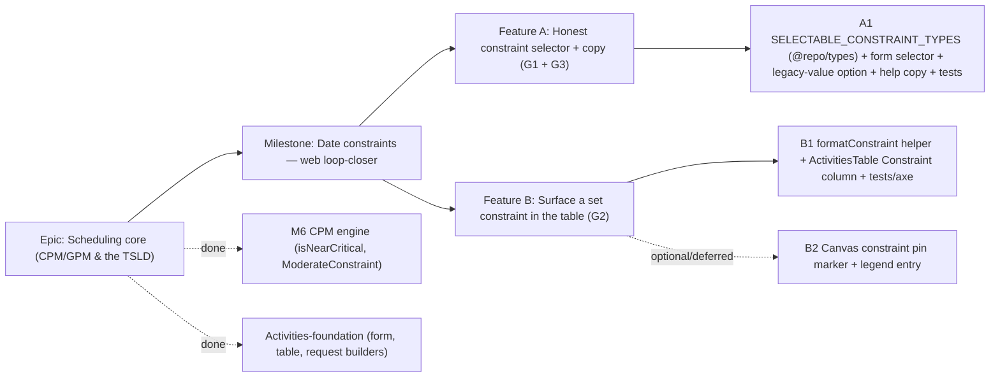

# Implementation Plan: Date constraints — web UI (loop-closer)

- **Feature spec:** [`docs/specs/date-constraints-web.md`](../specs/date-constraints-web.md)
- **Status:** Approved (2026-07-12) — implemented
- **Owner:** Feature Analyst / Claude

> **Scope note.** Per the spec's verification finding, the create/edit constraint
> **form** and **near-critical shading** (table badges + canvas dashed outline +
> legend) already exist and pass their tests. This plan lands only the three genuine
> gaps: **G1** honest selector, **G2** table surfacing, **G3** copy — plus an
> **optional, deferred** canvas marker. Total: 1–2 small PRs.

## Breakdown

### Epic

**Scheduling core (CPM/GPM & the TSLD)** — the schedule model and engine that make
SchedulePoint a scheduling tool. Activities, the dependency DAG, calendars, the CPM
engine (incl. `isNearCritical` and moderate-constraint clamping), and baselines are
delivered. **This plan closes the "Date constraints (web)" loop** — making the
already-honoured constraints correctly selectable and legible in the UI.

### Milestone: Date constraints — web loop-closer (shippable slice)

**Outcome:** the activity form offers only constraint types the engine honours
exactly as labelled (no silent parked downgrade), a set constraint is visible in the
activities table without opening each row, and "parked" is explained where it
appears — with no change to the API, engine, schema, or the activity-edit write path
(optimistic lock + pen unchanged). `main` stays releasable after each task.

---

#### Feature A: Honest constraint selector + copy (G1 + G3)

> **Description:** Restrict the create/edit constraint selector to the six types the
> engine honours as-labelled (SNET/SNLT/FNET/FNLT/MSO/MFO), stop offering the parked
> `MANDATORY_*` pair, and handle a pre-existing parked value honestly (shown, never
> silently mutated on open). Add short help copy to the field and a tooltip to the
> schedule summary's "Parked constraints" figure.
> **Complexity:** S
> **Dependencies:** none beyond current `main` (engine `ModerateConstraint`,
> `@repo/types`, the existing form).
> **Risks:** silently mutating a legacy parked value on form open → guard with a
> round-trip test; drift between the web subset and the engine's honoured set → define
> the subset once in `@repo/types` and reference the engine's `ModerateConstraint` in
> a comment/lock-step test.
> **Testing requirements:** unit (selectable set excludes `MANDATORY_*`; legacy value
> injected + round-trips unchanged on no-op save; pairing rule intact) + component
> (selector option list) + extend the existing form Playwright/edit assertions.

##### Task A1 — Selectable subset + selector + legacy-value option + copy (≈ one PR)

- **Description:** Add `SELECTABLE_CONSTRAINT_TYPES` (the six moderate kinds) to
  `@repo/types`, mirroring the engine's `ModerateConstraint` (with a lock-step note).
  In `ActivityFormDialog`, iterate the selectable subset instead of all
  `CONSTRAINT_TYPES`; when the edited activity's `constraintType` is a parked value,
  inject one honest option (label from a small `PARKED_CONSTRAINT_LABELS` map, e.g.
  "Mandatory start — applied as Must start on") and pre-select it so a no-op save
  round-trips the stored value. Add help text under the constraint field
  (UX_STANDARDS/DESIGN_SYSTEM copy). Add a tooltip/help to the "Parked constraints"
  stat in `ScheduleSummaryStrip` explaining the moderate-equivalent behaviour.
- **Complexity:** S
- **Dependencies:** none.
- **Risks:** the legacy-value injection must not fire for non-parked values (keep the
  selector list stable) → derive it purely from the current value; help copy must not
  overwhelm the field → one concise sentence + per-type labels already present.
- **Testing:** unit (subset excludes `MANDATORY_*`; the refine/pairing still holds);
  component (edit an activity with `MANDATORY_START` → option present, pre-selected,
  no-op save sends the original value; switching to `SNET`/"None" behaves as today);
  extend `ActivityFormDialog.test.tsx`; axe on the dialog.
- **Development steps:**
  1. `SELECTABLE_CONSTRAINT_TYPES` + `PARKED_CONSTRAINT_LABELS` in `@repo/types` /
     web schema; wire the form selector + legacy-value option.
  2. Help copy on the field; "Parked constraints" tooltip in the summary strip.
  3. Unit/component/axe tests; `docs/ROADMAP.md` note; changeset (minor).

---

#### Feature B: Surface a set constraint in the table (G2)

> **Description:** Make a set constraint legible from the activities table via a new,
> responsive **Constraint** column driven by a pure format helper — non-colour-alone,
> with an accessible full-label. Optionally (deferred) mirror it as a small canvas
> pin marker.
> **Complexity:** S
> **Dependencies:** Feature A only for shared labels (can also land independently).
> **Risks:** column density on mobile → hide below a breakpoint like the late-date
> columns; meaning encoded beyond text → text-only cell (no colour dependency).
> **Testing requirements:** unit (`formatConstraint`: each honoured type, a parked
> value, and null) + component (cell renders short text + full aria-label; em dash
> when unset; column hides at narrow width) + axe.

##### Task B1 — `formatConstraint` helper + `ActivitiesTable` Constraint column (≈ one PR)

- **Description:** Add a pure `formatConstraint(activity)` to `lib/schedule-format.ts`
  returning `{ short, full } | null` (e.g. `{ short: 'SNET · 1 May 2026', full:
'Start no earlier than 1 May 2026' }`, and a parked value formatted honestly).
  Add a `Constraint` column to `ActivitiesTable` that renders `short` with the `full`
  string as `aria-label`/`title`, an em dash when unset, hidden below a breakpoint
  (mirroring `scheduleColumn`'s `hideBelow`).
- **Complexity:** S
- **Dependencies:** A1 (labels) — otherwise independent.
- **Risks:** date formatting consistency → reuse `formatCalendarDate`; screen-reader
  clarity → provide the spelled-out `full` label, not just the shorthand.
- **Testing:** unit (`formatConstraint` across honoured/parked/null; date format);
  component (`ActivitiesTable` shows the cell + aria-label; em dash; responsive hide);
  axe (no colour-only meaning).
- **Development steps:**
  1. `formatConstraint` helper + unit suite.
  2. `Constraint` column in `ActivitiesTable` (responsive, accessible label).
  3. Component/axe tests; changeset (minor).

##### Task B2 — (Optional, deferred) Canvas constraint pin marker

- **Description:** Draw a small constraint marker (a pin/tick at the constrained
  edge) in `paint.ts` for activities with a constraint, and add a matching legend
  entry in `TsldPanel`. Non-colour-alone (a shape cue), consistent with ADR-0026.
- **Complexity:** S
- **Dependencies:** B1.
- **Risks:** canvas draw-budget (ADR-0026 ≤4ms p95 @ 2,000) → cheap per-bar shape,
  only for constrained + culled-visible activities; a11y parity → describe the
  constraint in the parallel focusable DOM layer (`a11y.ts`).
- **Testing:** unit (`paint` draws the marker only when constrained) + the canvas
  a11y layer test.
- **Development steps:**
  1. Marker in `paint.ts` (render-model flag from `constraintType`).
  2. Legend entry + a11y-layer description.
  3. Tests; changeset. **Deferrable** — not required for the milestone outcome.

## Sequencing & slices

Each PR keeps `main` releasable; no feature flags required (all additive UI):

1. **A1** — honest selector + copy. Immediately fixes the WYSIWYG correctness gap;
   no visual change for activities without a parked value.
2. **B1** — table surfacing. Makes set constraints legible.
3. **B2** — _optional/deferred_ canvas marker; ship only if desired now, otherwise a
   clean follow-up.

**Optional cut:** ship **A1 alone** first (the correctness fix) and B1 as a fast
follow — A1 is independently valuable and the smallest honest fix.

**Explicitly deferred:** the canvas constraint pin (B2, unless approved now);
hard-mandatory (`MANDATORY_*`) engine semantics remain parked per ADR-0023 §6 (a
separate engine follow-up, out of scope here).

## Definition of Done (per task)

Each task's PR satisfies the Feature Completion Criteria in
[`docs/PROCESS.md`](../PROCESS.md): code to the approved design, tests (unit +
component + axe; extend the activity-edit Playwright journey where relevant; ≥ 80% on
changed code), docs (`docs/ROADMAP.md` item moved to "Delivered"; `@repo/types` doc
comment), **accessibility** (WCAG 2.2 AA — constraint indicator and near-critical cue
never colour-alone), **security** (no new surface — confirm the write path/gating is
untouched), **performance** (table cell derived from fetched data; canvas marker
within the draw budget if B2 lands), Docker build + CI green, a changeset (minor,
pre-1.0), and version impact assessed. **No ADR, no API/DB change.**

**Recommended agents:** **component-reviewer** + **ux-reviewer** + **accessibility-reviewer**
(A1/B1/B2 — the selector honesty, the constraint cell/marker, non-colour cues, help
copy); **test-engineer** (the selectable-subset + legacy-value round-trip design and
the `formatConstraint` cases). A **security-reviewer** pass is low-priority here (no
new surface) but can confirm the write path and gating are genuinely untouched. No
database-architect / api-reviewer / backend-performance-reviewer needed — there is no
backend change.

## Risks & assumptions (rollup)

| Risk / assumption                                                         | Likelihood | Impact | Mitigation                                                                                                                   |
| ------------------------------------------------------------------------- | ---------- | ------ | ---------------------------------------------------------------------------------------------------------------------------- |
| Reduced scope not agreed (brief assumed nothing exists) — **critical Q1** | med        | med    | Spec documents the verified-present pieces; **confirm** before build; default = proceed with G1–G3.                          |
| Dropping `MANDATORY_*` from the selector — **critical Q2**                | low        | med    | Default = drop from selectable; keep valid in the enum; show legacy values honestly, never mutate on open (round-trip test). |
| Where/whether to surface the constraint — **critical Q3**                 | low        | low    | Default = responsive table column now; canvas pin (B2) deferred/optional.                                                    |
| Silent mutation of a legacy parked value on form open                     | med        | med    | Inject an honest pre-selected option; no-op-save round-trip test.                                                            |
| Web selectable subset drifts from the engine's honoured set               | low        | med    | Single source in `@repo/types` mirroring `ModerateConstraint`; lock-step comment/test.                                       |
| Constraint indicator encodes meaning in colour                            | low        | med    | Text-bearing cell + spelled-out aria-label; axe test.                                                                        |
| Rebuilding already-shipped form/shading (scope creep)                     | med        | med    | Spec's "Current state (verified)" table; touch only the three gaps.                                                          |
| Canvas marker exceeds the draw budget (if B2 taken)                       | low        | med    | Cheap per-bar shape, constrained+visible only; reuse ADR-0026 culling; draw-time check.                                      |
