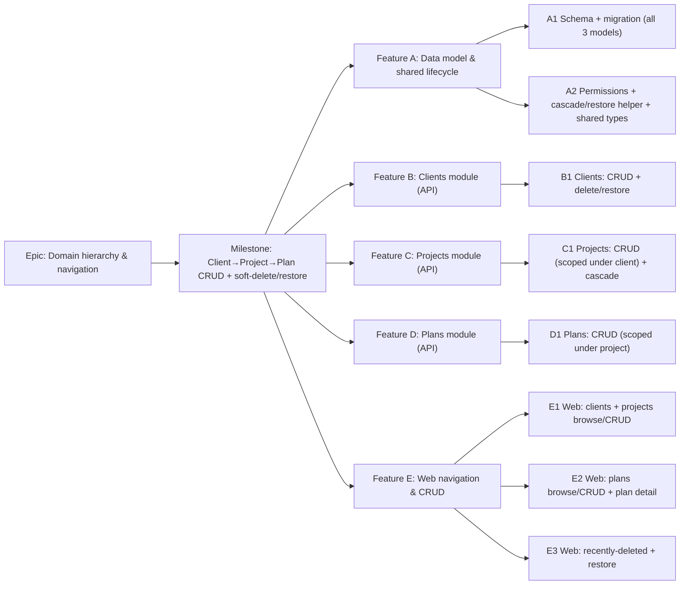

# Implementation Plan: Client → Project → Plan hierarchy CRUD

- **Feature spec:** [`docs/specs/hierarchy-crud.md`](../specs/hierarchy-crud.md)
- **Status:** Draft (awaiting approval)
- **Owner:** _TBD_

## Breakdown

### Epic

**Domain hierarchy & navigation** — deliver the Org → Client → Project → Plan
containers and their navigation so scheduling features have somewhere to live.
Maps to roadmap **M2**.

### Milestone: Client → Project → Plan CRUD + soft-delete/restore (shippable slice)

**Outcome:** a Planner (or Org Admin) can create, browse, rename, delete and
restore clients, projects and plans within their organisation — deny-by-default,
org-scoped, IDOR-safe, cascade-aware — and navigate the tree in the web app;
Contributors/Viewers can browse read-only. `main` stays releasable after every
task (each task is an additive vertical slice).

---

#### Feature A: Data model & shared lifecycle

> **Description:** The `Client`/`Project`/`Plan` models + `PlanStatus` enum and
> migration; the new permission codes; the shared cascade soft-delete + batch
> restore helper; the `@repo/types` contracts. The foundation the three modules
> build on.
> **Complexity:** M
> **Dependencies:** the org onboarding & membership slice (already on `main`).
> **Risks:** partial-unique / soft-delete / cascade indexes wrong → design with
> **database-architect** and review the raw-SQL migration; `created_by` columns
> must be **TEXT** (Better Auth ids are not uuid — bit the prior slice).
> **Testing requirements:** migration applies cleanly on real Postgres in CI;
> unit tests for the cascade/restore helper (batch semantics, top-down invariant)
> and the role→permission map.

##### Task A1 — Schema + migration for `Client`/`Project`/`Plan` (≈ one PR)

- **Description:** Add the three models + `PlanStatus` enum to `schema.prisma`
  (UUID v7, snake_case, denormalised `organization_id`, parent FKs `RESTRICT`,
  audit with **TEXT** `created_by`/`updated_by`, soft delete, `version`,
  `delete_batch_id`); write the migration including the **raw-SQL partial-unique**
  name indexes (`WHERE deleted_at IS NULL`) and scope/parent indexes. No app
  behaviour yet.
- **Complexity:** M
- **Dependencies:** none (first task)
- **Risks:** Prisma cannot express partial indexes → add as raw SQL, mirror the
  existing `uq_organizations_slug` pattern; denormalised-org invariant is enforced
  in the service layer (A2/B1), not the DB.
- **Testing:** migration up/down on real Postgres in CI; a schema snapshot/typegen
  check; repository-level unit test that the active filter excludes soft-deleted rows.
- **Development steps:**
  1. Models + `PlanStatus` enum in `schema.prisma`; `prisma migrate dev`.
  2. Hand-edit the migration to add partial-unique + scope indexes (raw SQL).
  3. Update `docs/DATABASE.md` (denormalised scope + `delete_batch_id` notes); changeset.

##### Task A2 — Permissions, cascade/restore helper & shared types (≈ one PR)

- **Description:** Extend `common/auth/org-permissions.ts` with `HIERARCHY_READ`
  (all `*:read`, to every role) and `HIERARCHY_WRITE` (all
  `*:create|update|delete|restore`, to `PLANNER` + `ORG_ADMIN`); implement the
  shared cascade soft-delete + batch restore helper (generates `delete_batch_id`,
  soft-deletes a row + descendants in a `$transaction`, restores by batch,
  enforces the top-down `PARENT_DELETED` invariant); add `ClientSummary`/
  `ProjectSummary`/`PlanSummary`/`PlanStatus` to `packages/types`.
- **Complexity:** M
- **Dependencies:** A1
- **Risks:** cascade correctness under concurrency → do the whole cascade/restore
  in one transaction; batch-scoped restore preserves earlier independent deletes;
  keep the helper entity-agnostic to avoid three divergent copies.
- **Testing:** unit — cascade deletes exactly the active subtree; restore returns
  exactly the batch; `PARENT_DELETED` when an ancestor is deleted; role→permission
  map grants read to all, write to Planner/Org Admin only.
- **Development steps:**
  1. Permission codes + sets in `org-permissions.ts`; unit test the map.
  2. Cascade/restore helper (shared) with unit tests.
  3. `@repo/types` contracts; changeset.

---

#### Feature B: Clients module (API)

> **Description:** The `clients` module — list/create/get/update/delete/restore —
> the first full end-to-end proof of the org-scoped CRUD + cascade pattern.
> **Complexity:** M
> **Dependencies:** Feature A.
> **Risks:** IDOR on client id → always load `findActive(id, organizationId)`;
> 404 (not 403) for non-members via `resolveScope`; name uniqueness under
> concurrency → DB partial-unique mapped to 409.
> **Testing requirements:** unit (scope, uniqueness, optimistic lock, cascade to
> projects/plans, batch restore); API e2e (CRUD, IDOR 404 matrix, 409s, cascade +
> restore round-trip).

##### Task B1 — Clients CRUD + delete/restore (≈ one PR)

- **Description:** Copy the reference module → `clients`: controller
  (`organizations/:orgSlug/clients` list/create, `…/clients/:clientId`
  get/patch/delete, `…/clients/:clientId/restore`), service (reuse
  `resolveScope`, `assertCan`, the cascade/restore helper), repository (active
  filter, versioned update, scoped-by-org loads), DTOs + response mappers.
- **Complexity:** M
- **Dependencies:** A2
- **Risks:** transaction correctness for cascade + audit → one `$transaction`;
  restore name-collision check before restoring.
- **Testing:** unit (authz, uniqueness→409, stale version→409, cascade, restore,
  `PARENT_DELETED` n/a at top level); API e2e (201+Location, list only mine,
  404 for non-member/foreign id, delete cascades, restore round-trip).
- **Development steps:**
  1. DTOs, repository, service, controller, module wiring.
  2. Cascade delete + batch restore via the shared helper; audit logs.
  3. OpenAPI/`docs/API.md`; changeset.

---

#### Feature C: Projects module (API)

> **Description:** The `projects` module — nested create/list under a client,
> flat get/update/delete/restore by id — cascading deletes to plans.
> **Complexity:** M
> **Dependencies:** Feature B (shares the pattern; parent = client).
> **Risks:** parent-client scoping → load the **active** parent client in-org
> before create/list (404 otherwise); copy `organization_id` from the parent, never
> from input.
> **Testing requirements:** unit (parent scope, uniqueness per client, cascade to
> plans, restore); API e2e (create under client, list within client, IDOR/parent
> 404s, cascade + restore).

##### Task C1 — Projects CRUD scoped under client + cascade (≈ one PR)

- **Description:** `projects` module mirroring `clients`, but create/list are
  nested under `…/clients/:clientId/…` (parent must be active in scope) and
  item ops are `…/projects/:projectId`. Delete cascades to the project's plans;
  restore is batch-scoped and requires the parent client active.
- **Complexity:** M
- **Dependencies:** B1
- **Risks:** same-name project under different clients must be allowed (unique per
  `client_id`); deleting a project already cascade-deleted by its client is a
  no-op/404.
- **Testing:** unit (parent-active check, per-client uniqueness, cascade, restore
  requires active client → `PARENT_DELETED`); API e2e (nested create/list, 404
  for foreign/deleted client, cascade + restore).
- **Development steps:**
  1. DTOs, repository, service, controller (nested + flat routes), module.
  2. Cascade to plans + batch restore; audit.
  3. OpenAPI/`docs/API.md`; changeset.

---

#### Feature D: Plans module (API)

> **Description:** The `plans` module — nested create/list under a project, flat
> get/update/delete/restore — plus plan metadata (`status`, `plannedStart`).
> **Complexity:** M
> **Dependencies:** Feature C (parent = project).
> **Risks:** date-only `plannedStart` handling (store `date`, no TZ drift);
> status enum kept in step with `@repo/types`.
> **Testing requirements:** unit (parent scope, uniqueness per project, status
> default, date validation, restore requires active project); API e2e (nested
> create/list, metadata round-trip, IDOR/parent 404s, delete/restore).

##### Task D1 — Plans CRUD scoped under project (≈ one PR)

- **Description:** `plans` module mirroring `projects` (no children, so delete
  cascades to nothing); adds `status`/`plannedStart` to create/update DTOs and
  response. Restore requires the parent project active.
- **Complexity:** M
- **Dependencies:** C1
- **Risks:** `plannedStart` date parsing/serialisation (validate `YYYY-MM-DD`,
  store as `date`); ensure list ordering deterministic for the cursor.
- **Testing:** unit (status default DRAFT, invalid status/date → 422, per-project
  uniqueness, restore/`PARENT_DELETED`); API e2e (create with metadata, get, list,
  404 matrix, delete/restore).
- **Development steps:**
  1. DTOs (`status?`, `plannedStart?`), repository, service, controller, module.
  2. Response mapper incl. metadata; audit.
  3. OpenAPI/`docs/API.md`; changeset.

---

#### Feature E: Web navigation & CRUD

> **Description:** The org-scoped web routes and screens to browse and manage the
> tree, plus the recently-deleted/restore surface — reusing the design-system
> primitives and the `_authed` shell.
> **Complexity:** L
> **Dependencies:** Features B/C/D (the APIs they consume) + the existing web shell.
> **Risks:** deep-linking to a deleted/foreign parent → route loaders surface a
> not-found state; optimistic UI vs 409 → conflict toast + refetch; a11y of
> dialogs/tables/menus → primitives + axe checks.
> **Testing requirements:** component tests (tables, form dialogs, delete confirm,
> status/date fields); Playwright journeys (create client→project→plan; delete→
> restore) + axe a11y; empty/loading/error states covered.

##### Task E1 — Web: clients + projects browse & CRUD (≈ one PR)

- **Description:** `features/clients` + `features/projects` (hooks + `Table` +
  `FormDialog` + delete confirm); routes `/orgs/$orgSlug/clients`,
  `/orgs/$orgSlug/clients/$clientId` (projects list),
  `/orgs/$orgSlug/projects/$projectId` (plans list shell); `Breadcrumbs`; write
  affordances hidden for non-writers.
- **Complexity:** L
- **Dependencies:** B1, C1
- **Risks:** membership guard reuse → `ensureOrgMembership` in each `beforeLoad`;
  parent-id 404 handled in the loader.
- **Testing:** component (tables, dialogs, permission-gated buttons); Playwright
  (create client → open → create project) + a11y.
- **Development steps:**
  1. `features/clients` hooks/components; clients + client-detail routes.
  2. `features/projects` hooks/components; project route; breadcrumbs.
  3. Register routes in `app/router.tsx`; empty/loading/error states; changeset.

##### Task E2 — Web: plans browse & CRUD + plan detail (≈ one PR)

- **Description:** `features/plans` (hooks + `PlansTable` + `PlanFormDialog` with
  `StatusSelect` + planned-start date field); route
  `/orgs/$orgSlug/plans/$planId` (metadata + a placeholder region reserved for
  the future TSLD canvas).
- **Complexity:** M
- **Dependencies:** D1, E1
- **Risks:** date input a11y/locale (en-GB `dd-MMM-yyyy` display, `YYYY-MM-DD`
  wire) → reuse a design-system date field; status select uses the native
  primitive.
- **Testing:** component (plans table, form incl. status/date, plan detail shell);
  Playwright (create plan → land on detail) + a11y.
- **Development steps:**
  1. `features/plans` hooks/components; plans list under project.
  2. Plan detail route with canvas placeholder; register routes.
  3. Empty/loading/error states; changeset.

##### Task E3 — Web: recently-deleted & restore (≈ one PR)

- **Description:** `/orgs/$orgSlug/recently-deleted` (`RecentlyDeletedList` reusing
  the DataTable primitive) with a Restore action; surfaces the top-down invariant
  (`PARENT_DELETED` → "restore its parent first") and name-collision (`NAME_TAKEN`)
  as clear, accessible messages.
- **Complexity:** M
- **Dependencies:** E1, E2 (and the API's deleted-list / restore endpoints)
- **Risks:** the deleted-list endpoint shape is the one deferred API detail
  (spec §4) → finalise it here with **api-reviewer** (per-entity `?deleted=true`
  vs a combined `/deleted` route); restore toasts must reflect cascade ("client
  and 3 plans restored").
- **Testing:** component (deleted list, restore action, blocked-restore message);
  Playwright (delete client → restore → subtree returns) + a11y.
- **Development steps:**
  1. Finalise + implement the deleted-list/restore hooks.
  2. `RecentlyDeletedList` + route; invariant/collision messaging.
  3. Docs touch-ups; changeset.

## Sequencing & slices

Strict order; each PR keeps `main` releasable:

1. **A1 → A2** — schema, permissions, shared lifecycle helper, types. No user-
   facing behaviour yet, but `main` still builds/releases.
2. **B1 → C1 → D1** — API bottom-up by hierarchy level. After D1 the full
   Client→Project→Plan CRUD + cascade/restore works via the API (exercisable by
   e2e/HTTP even before the UI lands).
3. **E1 → E2 → E3** — web navigation and CRUD, then the restore surface. After E3
   the milestone outcome is fully met end-to-end.

No feature flags required — each slice is additive and independently valuable
(the APIs are usable before the screens; browse works before restore). Re-parenting
and 90-day purge are explicitly deferred (spec §1).

## Definition of Done (per task)

Each task's PR must satisfy the Feature Completion Criteria in
[`docs/PROCESS.md`](../PROCESS.md): code to the approved design, tests (unit +
API e2e + web/e2e/a11y as relevant, ≥ 80% on changed code), docs/OpenAPI/
`API.md`/`DATABASE.md`/`DECISIONS.md` updates, **security review** (authN/Z,
scope/IDOR, cascade correctness, validation), **performance** (scope/parent
indexes, pagination, no N+1 on child counts), **accessibility** (WCAG 2.2 AA),
Docker build + CI green, a changeset, and version-impact assessed.

**Recommended agents:** database-architect (A1 — schema/indexes/partial-unique +
`delete_batch_id`; confirm whether the cascade/denormalised-scope conventions
warrant an ADR), security-reviewer (B1/C1/D1 — IDOR, cascade scoping, validation),
api-reviewer (all endpoints + the deferred deleted-list shape in E3),
backend-performance-reviewer (list endpoints, child-count queries),
test-engineer (IDOR + cascade/restore e2e matrices), component-reviewer +
ux-reviewer + accessibility-reviewer (E1/E2/E3), devops-reviewer (migration in CI).

## Risks & assumptions (rollup)

| Risk / assumption                                            | Likelihood | Impact | Mitigation                                                                                              |
| ------------------------------------------------------------ | ---------- | ------ | ------------------------------------------------------------------------------------------------------- |
| Cascade delete policy (cascade vs RESTRICT) — **critical Q** | med        | med    | Confirm at approval; default = cascade soft-delete + `delete_batch_id`; RESTRICT is a smaller fallback. |
| IDOR / cross-tenant or cross-parent leak                     | low        | high   | `resolveScope` (404) + load children by `(id, organization_id[, parent_id])`; e2e IDOR matrix.          |
| Cascade/restore incorrectness under concurrency              | low        | high   | Whole cascade/restore in one `$transaction`; batch-scoped restore; unit + e2e cover.                    |
| Restore creates an orphan under a deleted ancestor           | low        | high   | Top-down invariant (`PARENT_DELETED`); restore asserts parent active.                                   |
| Partial-unique / soft-delete indexes wrong                   | med        | med    | database-architect + raw-SQL migration mirroring `uq_organizations_slug`; review.                       |
| `created_by`/`updated_by` typed uuid instead of TEXT         | med        | med    | Explicit TEXT columns (Better Auth ids are TEXT) — called out in A1; bit prior slice.                   |
| N+1 on per-list child counts                                 | med        | low    | Grouped/aggregate count query, not per-row; backend-performance-reviewer.                               |
| Denormalised `organization_id` drifts from parent's org      | low        | med    | Copied from the resolved parent inside the create tx, never from input; unit test.                      |
| Deleted-list endpoint shape deferred                         | med        | low    | Finalise in E3 with api-reviewer; core 18 CRUD routes are fixed now.                                    |
| Deep-link to deleted/foreign parent                          | med        | low    | Route loaders surface not-found gracefully; covered by component tests.                                 |
