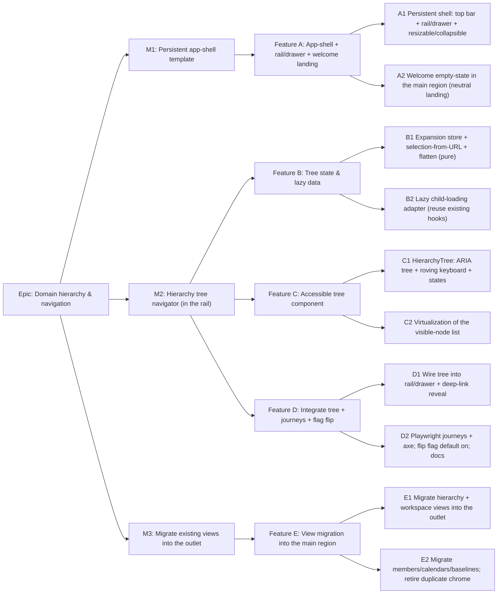

# Implementation Plan: Persistent hierarchy navigator

- **Feature spec:** [`docs/specs/hierarchy-navigator.md`](../specs/hierarchy-navigator.md)
- **Status:** Approved — implemented (M1 + M2 shipped; navigator on by default). M3 view-migration + C2 virtualization tracked as fast-follows.
- **Owner:** _TBD_
- **Related ADR:** ADR-0029 — Persistent app-shell + hierarchy navigator (must be accepted before/with build)

## Breakdown

### Epic

**Domain hierarchy & navigation** — make moving around the Org → Client → Project
→ Plan hierarchy fast, persistent, and accessible, on a persistent app-shell. This
feature delivers the navigation half (the CRUD half shipped in
[hierarchy-crud](../specs/hierarchy-crud.md)). Maps to the roadmap navigation-UX
theme. Delivered in three milestones; **M1 + M2 is the shippable P1** read-only
navigator in a working shell. We are **evolving the existing `_authed` shell, not
building greenfield.**

### Milestone M1: Persistent app-shell template (shippable slice)

**Outcome:** the `_authed` layout becomes a persistent app-shell — top bar +
collapsible/resizable left rail + a single main workspace region (`<Outlet/>`) —
that stays mounted while navigation swaps only the main region. Below `lg` the rail
is a drawer opened from the top bar. With no plan selected, the main region shows
the **neutral welcome empty-state**. The rail holds a placeholder (the real tree
lands in M2). Behind `VITE_NAV_TREE`; flag-off = today's behaviour, so `main` stays
releasable.

---

#### Feature A: App-shell + rail/drawer + welcome landing

> **Description:** Evolve the `_authed` layout into the persistent shell (chrome
> once + main-region Outlet), responsive rail→drawer, theme-aware, with the neutral
> welcome empty-state; rail renders a placeholder (tree lands in M2).
> **Complexity:** M
> **Dependencies:** none (first tasks); ADR-0029 accepted.
> **Risks:** shell regressions to existing pages → gate entirely behind the flag and
> keep the flag-off path byte-for-byte today's layout; drawer focus-trap/`Esc` a11y →
> reuse the existing `Dialog` primitive's Radix behaviour.
> **Testing requirements:** component tests for the layout at `lg`+ (pinned rail +
> main region) and `< lg` (rail hidden, toggle opens drawer, `Esc`/select closes,
> focus returns); welcome empty-state renders when no plan selected; flag-off renders
> the current layout unchanged; axe on the shell.

##### Task A1 — Persistent shell: top bar + rail/drawer (≈ one PR)

- **Description:** Add `VITE_NAV_TREE` to typed `config/`. Evolve
  `routes/authed-layout.tsx` into `top bar + [NavigatorRail | main region
(Outlet)]` (flex row) on `lg`+, with a **collapsible + resizable** rail (persist
  the width + pinned/collapsed preference), and a `NavigatorDrawer` (Sheet — a
  drawer variant of the existing `Dialog`, or a new `components/ui/sheet.tsx`
  primitive if warranted) below `lg`; add an accessible "Show Project Explorer"
  control to `AppHeader` (visible `< lg`). Rail/drawer render a placeholder region
  for now. Rail present on all org-scoped routes (PO-confirmed).
- **Complexity:** M
- **Dependencies:** none
- **Risks:** introducing a shared `Sheet` primitive touches the design system →
  keep it a thin, tokenised wrapper over the existing `Dialog`/Radix, update
  `docs/COMPONENT_LIBRARY.md`/`CLAUDE.md` §12 if added; component-reviewer. Resize
  handle a11y (keyboard-resizable, `aria` on the separator) → covered by tests.
- **Testing:** component tests (rail pinned/resizable/collapsible ≥`lg`; drawer
  toggle/close/focus < `lg`; flag-off = unchanged layout); axe on the shell.
- **Development steps:**
  1. Add the flag to `config/`; add `Sheet` (or extend `Dialog`) if needed.
  2. Evolve `AuthedLayout` into the shell; header toggle + persisted rail width/pin.
  3. Update `docs/FRONTEND_ARCHITECTURE.md` (persistent app-shell), `docs/TECH_DEBT.md`
     (mark the drawer-shell debt in progress); changeset.

##### Task A2 — Welcome empty-state in the main region (≈ one PR)

- **Description:** A `WelcomeEmptyState` rendered in the main region when no plan is
  selected (the org home / any org-scoped route with no plan in the URL): a centered
  "Select a plan from the Project Explorer" card over the neutral workspace backdrop
  (date ruler + TODAY marker visible behind it, per the PO screenshot). When the org
  has no clients, additionally show the "+ Client → Project → Plan" getting-started
  hint linking to the Clients page (creation lives there). Canvas minimap stays out
  of scope.
- **Complexity:** S
- **Dependencies:** A1
- **Risks:** reusing the TSLD backdrop without mounting the whole canvas → render a
  lightweight static ruler/TODAY backdrop element, not the interactive `TsldPanel`
  (performance-reviewer); empty-vs-new-user branching driven by `useClients`.
- **Testing:** component (card present with no plan; getting-started hint only when
  no clients; links resolve) + axe.
- **Development steps:**
  1. `WelcomeEmptyState` + neutral backdrop element; wire into the org home route.
  2. New-user hint branch on `useClients` empty.
  3. Changeset.

---

### Milestone M2: Hierarchy tree navigator (shippable slice)

**Outcome:** the rail's placeholder is replaced by the real Project Explorer — a
persistent, accessible Client → Project → Plan tree: expand nodes (children
lazy-loaded, long lists virtualized), open any node by mouse or keyboard, the rail
stays mounted across plan-to-plan navigation, deep-links auto-reveal the selected
path, and the tree passes WCAG 2.2 AA / axe. **No backend change; navigation-only.**
The `VITE_NAV_TREE` flag is flipped on at the end of this milestone.

---

#### Feature B: Tree state & lazy data

> **Description:** The headless state layer — expansion set (persisted per-org),
> selection derived from the URL, pure flattening into the visible-node list with
> ARIA metadata, and the lazy child-loading adapter that reuses the existing query
> hooks. No visuals; pure/testable.
> **Complexity:** M
> **Dependencies:** Feature A (a place to mount), but B is largely independent and
> can proceed in parallel.
> **Risks:** selection/expansion coupling bugs → keep selection a pure function of
> route params (never stored), expansion the only mutable state; child-query fan-out
> → one query per expanded parent, `enabled` on expansion, shared cache keys.
> **Testing requirements:** unit tests for `flattenVisible` (order, level, setSize,
> posInSet), selection-from-params, `expandPath` (deep-link ancestor reveal),
> `sessionStorage` persistence (round-trip + corrupt-state reset), and the child
> adapter's enabled/disabled logic.

##### Task B1 — Expansion store, selection-from-URL & flatten (pure) (≈ one PR)

- **Description:** `features/navigator/hooks`: `useExpansionState(orgSlug)` (an
  expanded-id `Set`, persisted per-org in `sessionStorage`, with
  `toggle/expand/collapse/expandPath`); selection derived from `useParams`
  (`clientId`/`projectId`/`planId`); pure `flattenVisible(...)` producing ordered
  nodes with `level/setSize/posInSet`; a pure `treeKeydown` reducer mapping keys →
  intents. Unit tests only (no DOM).
- **Complexity:** M
- **Dependencies:** none
- **Risks:** persisted-state trust → validate shape/size on read, reset on
  mismatch; never rely on it for correctness (only convenience).
- **Testing:** unit — flatten invariants; selection mapping for each route depth;
  `expandPath` reveals ancestors; keyboard reducer covers ↑/↓/←/→/Home/End/Enter;
  corrupt storage ignored.
- **Development steps:**
  1. Expansion store + persistence; selection derivation; flatten; keyboard reducer.
  2. Exhaustive unit tests.
  3. Changeset.

##### Task B2 — Lazy child-loading adapter (reuse existing hooks) (≈ one PR)

- **Description:** `useHierarchyTree(orgSlug)` orchestrator: roots via `useClients`;
  for each **expanded** client `useProjects(orgSlug, clientId)` and each expanded
  project `usePlans(orgSlug, projectId)`, `enabled` by expansion; expose per-node
  status (loading/empty/error/loaded) and the assembled `childrenByParent` for
  `flattenVisible`. On mount, `expandPath` the selected route's ancestors and enable
  their queries (deep-link reveal). Reuses `clientKeys`/`projectKeys`/`planKeys`, so
  page CRUD invalidations refresh the tree for free.
- **Complexity:** M
- **Dependencies:** B1
- **Risks:** dynamic hook fan-out (a query per expanded node) → drive it with a
  stable child-loader subcomponent per expanded parent (or a controlled map of
  query results) to respect the rules of hooks; avoid refetch storms via existing
  `staleTime`.
- **Testing:** unit/integration (with a mocked query client) — expanding enables a
  query once; collapsing keeps cache; deep-link enables the ancestor chain; error
  surfaces per node.
- **Development steps:**
  1. Orchestrator + per-node status assembly reusing the feature hooks.
  2. Deep-link `expandPath`-on-mount wiring.
  3. Tests; changeset.

---

#### Feature C: Accessible tree component

> **Description:** The `HierarchyTree`/`TreeNode` view — a first-class ARIA `tree`
> with roving-tabindex keyboard operation, selected/expanded/hover/focus visuals
> from tokens, all per-node and root states, and virtualization of the visible list.
> **Complexity:** L
> **Dependencies:** Features A + B.
> **Risks:** ARIA `tree` + virtualization interaction (setSize/posInSet with
> windowing; focused node must stay rendered) → force-render the focused node,
> compute ARIA counts from the full flattened model not the window; accessibility-
> reviewer sign-off is a gate.
> **Testing requirements:** component tests (roles/attributes, roving focus, each
> key, selected reflects URL, every state) + **axe**; keyboard-only interaction
> tests.

##### Task C1 — HierarchyTree: ARIA tree, roving keyboard & states (≈ one PR)

- **Description:** `HierarchyTree` (`role="tree"`, single tab stop, roving
  `tabindex`, wired to the `treeKeydown` reducer) rendering `TreeNode`s
  (`role="treeitem"`, chevron toggle + `<Link>` label, `aria-level/-expanded/`
  `-selected/-setsize/-posinset`, Lucide icons per level). Implements root
  loading/empty/error and per-node loading/empty/error states, selected/hover/focus
  styling from tokens (light + dark), and live-region announcements via the existing
  `AnnouncerProvider`. Renders un-virtualized first (small lists) to lock behaviour.
- **Complexity:** L
- **Dependencies:** B2
- **Risks:** focus management on expand/collapse/navigate → keep focus on the acting
  node; announce changes; visible focus ring per WCAG 2.2.
- **Testing:** component + axe (tree semantics, each keyboard action, selection
  follows URL, all states); reduced-motion honoured for any expand animation.
- **Development steps:**
  1. `TreeNode` + `HierarchyTree` with ARIA + roving focus + states.
  2. Announcements + selected/focus visuals (tokens).
  3. Component/axe tests; changeset.

##### Task C2 — Virtualize the visible-node list (≈ one PR)

- **Description:** Window the flattened visible list with `@tanstack/react-virtual`
  (add the dependency), keeping ARIA counts from the full model and force-rendering
  the focused/selected node so keyboard nav reaches any item. No behavioural change
  vs C1 for small lists.
- **Complexity:** M
- **Dependencies:** C1
- **Risks:** windowing breaking keyboard reachability/screen-reader counts → tests
  assert focus can traverse a large synthetic branch and `setSize` stays correct;
  performance-reviewer checks scroll/render cost.
- **Testing:** component (large synthetic branch: scroll, keyboard traverse to a
  windowed node, ARIA counts) + axe; a lightweight render-cost check.
- **Development steps:**
  1. Integrate the virtualizer over the flattened list.
  2. Force-render focused/selected; preserve ARIA counts.
  3. Tests; update `docs/FRONTEND_QUALITY.md` note; changeset.

---

#### Feature D: Integration, rollout & journeys

> **Description:** Mount the tree in the rail and drawer, prove the end-to-end
> journeys (persistence across plan switches, deep-link reveal, drawer, keyboard),
> then flip `VITE_NAV_TREE` on by default.
> **Complexity:** M
> **Dependencies:** Features A, B, C.
> **Risks:** the "rail persists across navigation" guarantee regressing → an e2e
> assertion that the tree DOM node identity survives a plan→plan navigation; flag
> flip → do it in its own PR after all gates are green.
> **Testing requirements:** Playwright journeys + axe; manual cross-browser keyboard
> pass; visual check light/dark and `sm`–`xl`.

##### Task D1 — Wire the tree into rail + drawer; deep-link reveal (≈ one PR)

- **Description:** Replace Feature A's placeholder with `HierarchyTree` in both
  `NavigatorRail` and `NavigatorDrawer`; selecting a node navigates via `<Link>`
  and (on `< lg`) closes the drawer; ensure deep-link `expandPath`-on-mount reveals
  and scrolls the selected node into view. Keep the existing `Breadcrumbs` and
  header nav (augment, not replace).
- **Complexity:** M
- **Dependencies:** A1, C2
- **Risks:** scroll-into-view vs. virtualization → scroll by the virtualizer's API
  to the selected index; drawer-close focus return.
- **Testing:** component (rail + drawer render the tree; select closes drawer;
  selected scrolls into view); integration with the router.
- **Development steps:**
  1. Mount tree in rail + drawer; drawer-close-on-select.
  2. Deep-link reveal + scroll-to-selected.
  3. Changeset.

##### Task D2 — Journeys, a11y, and flag flip (≈ one PR)

- **Description:** Add Playwright journeys: (1) from Plan A, expand another
  client→project, open Plan B, and **assert the navigator DOM persists** and its
  expansion/scroll survive; (2) deep-link a plan URL → tree auto-reveals +
  highlights; (3) small-screen drawer open→select→close; (4) full keyboard
  traversal + open. Run axe in each. Then flip `VITE_NAV_TREE` to default-on and
  update docs.
- **Complexity:** M
- **Dependencies:** D1
- **Risks:** flipping the flag changes the default shell for all users → separate,
  clearly-scoped PR; runbook note for the ops switch.
- **Testing:** Playwright (the four journeys) + axe; flag-off baseline still green.
- **Development steps:**
  1. Playwright journeys + axe checks.
  2. Flip `VITE_NAV_TREE` default-on; update `docs/FRONTEND_ARCHITECTURE.md`,
     `docs/UX_STANDARDS.md`/`DESIGN_SYSTEM.md` (rail⇄drawer pattern),
     `docs/TECH_DEBT.md` (retire the owed drawer shell), `docs/ROADMAP.md`.
  3. Accept/ link ADR-0029; changeset.

---

### Milestone M3: Migrate existing views into the outlet

**Outcome:** the existing route screens render inside the shell's single main
region instead of each owning full-page chrome — removing per-page shell
duplication so the top bar + rail are truly composed once. Purely structural; each
view's content and behaviour are unchanged. Can follow P1 (M1+M2) without blocking
its ship, since the shell already hosts these views via the Outlet.

---

#### Feature E: View migration into the main region

> **Description:** Move each existing screen's content into the shell's main region,
> retiring its duplicated page-shell wrapper (`main` chrome), so navigation swaps
> only content. No new behaviour.
> **Complexity:** M
> **Dependencies:** M1 (the shell). Independent of M2, but best after it so the
> rail is real when views are verified in place.
> **Risks:** subtle layout/scroll regressions per view → migrate a few views per PR
> with visual + component checks; keep the plan-workspace (TSLD) scroll/resize
> behaviour intact (performance + a11y reviewers on that one).
> **Testing requirements:** existing component/e2e suites stay green per migrated
> view; visual check light/dark and `sm`–`xl`; the TSLD workspace re-verified.

##### Task E1 — Migrate hierarchy + workspace views (≈ one PR)

- **Description:** Migrate `clients`, `client-detail`, `project-detail`, and
  `plan-detail` (the TSLD workspace) to render inside the main region; drop each
  screen's own outer `main` wrapper in favour of the shell's; keep `Breadcrumbs`.
- **Complexity:** M
- **Dependencies:** A1
- **Risks:** the plan-workspace canvas is the heaviest view → confirm no
  scroll/resize/perf regression (backend-performance/performance-reviewer, a11y).
- **Testing:** existing suites green; Playwright workspace journey re-run; axe.
- **Development steps:**
  1. Migrate the four views; remove duplicated chrome.
  2. Re-verify the TSLD workspace in the outlet.
  3. Changeset.

##### Task E2 — Migrate members / calendars / baselines; retire duplicate chrome (≈ one PR)

- **Description:** Migrate the remaining org-scoped screens (`members`,
  `calendars`, and the baselines surfaces) into the main region; delete any
  now-unused per-page shell scaffolding.
- **Complexity:** S
- **Dependencies:** E1
- **Risks:** low — these are lighter list/detail views.
- **Testing:** existing suites green; visual + axe checks.
- **Development steps:**
  1. Migrate the remaining views; remove leftover chrome.
  2. Update `docs/FRONTEND_ARCHITECTURE.md` (single main-region convention).
  3. Changeset.

## Sequencing & slices

Behind `VITE_NAV_TREE` (default **off** until D2), so every PR keeps `main`
releasable — flag-off is exactly today's behaviour. The shippable **P1 = M1 + M2**.

1. **M1 — A1 → A2** — the persistent shell + rail/drawer placeholder + welcome
   empty-state. B1/B2 can proceed in parallel with A2.
2. **M2 — B1 → B2 → C1 → C2 → D1 → D2** — headless state + lazy data, then the
   accessible + virtualized tree, then integrate, prove journeys + a11y, and
   **flip the flag on**. End of M2 = shippable read-only navigator (P1).
3. **M3 — E1 → E2** — migrate the existing views into the outlet (structural
   clean-up; can trail P1).

Named **future phases** remain out of scope: **Phase 2** in-tree CRUD (context
menus), **Phase 3** server-side search. Neither is built here.

## Definition of Done (per task)

Each task's PR must satisfy the Feature Completion Criteria in
[`docs/PROCESS.md`](../PROCESS.md): code to the approved design (conforming to
ADR-0029); tests (unit + component + Playwright/axe as relevant, ≥ 80% on changed
code); docs updated (`FRONTEND_ARCHITECTURE.md`, `UX_STANDARDS.md`/`DESIGN_SYSTEM.md`,
`COMPONENT_LIBRARY.md` if a `Sheet` primitive is added, `TECH_DEBT.md`, `ROADMAP.md`,
ADR-0029); **accessibility reviewed** (WCAG 2.2 AA — the ARIA `tree` is a
first-class deliverable); **performance considered** (code-split, lazy queries,
virtualization; no bundle/render regression to the workspace); **security**
(no new surface — confirm org scope/RBAC unchanged and `sessionStorage` holds only
non-sensitive ids); Docker build + CI green; a changeset; version impact assessed
(user-visible → minor pre-1.0).

**Recommended agents.** **ui-architect** (owns ADR-0029; consult on the shell +
state split). Reviewers: **accessibility-reviewer** (gating — ARIA tree, keyboard,
focus, virtualization/SR interaction), **component-reviewer** (tree/node API,
token/variant usage, any new `Sheet` primitive, no one-offs), **ux-reviewer**
(rail⇄drawer pattern, empty/error copy, hierarchy, Q1/Q3 decisions),
**performance-reviewer** (bundle/code-split, virtualization, re-render cost). No
backend reviewers needed for v1 (zero API change); **api-reviewer** +
**backend-performance-reviewer** + **security-reviewer** only become relevant if
Q2 (counts) or a Phase-3 search endpoint is later approved.

## Risks & assumptions (rollup)

| Risk / assumption                                            | Likelihood | Impact | Mitigation                                                                                                                                                          |
| ------------------------------------------------------------ | ---------- | ------ | ------------------------------------------------------------------------------------------------------------------------------------------------------------------- |
| ADR-0029 not yet accepted                                    | med        | med    | Build to the spec's stated defaults; block the flag-flip (D2) on ADR-0029 acceptance.                                                                               |
| Q2 decorators / Q3 node-click — **resolved**                 | —          | —      | PO decisions: **no decorators in v1**; **folders expand-only** (only plan leaves navigate/load the canvas). Rail scope resolved (persistent shell, all org routes). |
| M3 view migration causes per-view layout/scroll regressions  | med        | med    | Migrate few views per PR; visual + component checks; re-verify the heavy TSLD workspace.                                                                            |
| ARIA `tree` + virtualization breaks keyboard/SR reachability | med        | high   | Force-render focused/selected node; ARIA counts from full model; accessibility-reviewer gate.                                                                       |
| Shell restructure regresses existing pages                   | low        | high   | Everything behind `VITE_NAV_TREE`; flag-off path unchanged; component tests both ways.                                                                              |
| "Rail persists across navigation" guarantee regresses        | low        | high   | e2e asserts the navigator DOM node identity survives plan→plan navigation.                                                                                          |
| Dynamic per-node query fan-out violates rules of hooks       | med        | med    | Per-expanded-parent child-loader subcomponent / controlled results map; not conditional hooks.                                                                      |
| New `@tanstack/react-virtual` / `Sheet` dependency footprint | low        | low    | TanStack (on-stack) windowing; `Sheet` as a thin tokenised `Dialog` wrapper; reviewed.                                                                              |
| Persisted expansion state corrupt/stale                      | low        | low    | Validate shape/size on read; reset silently; never used for correctness.                                                                                            |
| Mobile richness vs. desktop-first product (brief §3)         | low        | low    | Deliver the responsive drawer per standards; heavy workspace stays desktop/tablet-oriented.                                                                         |
