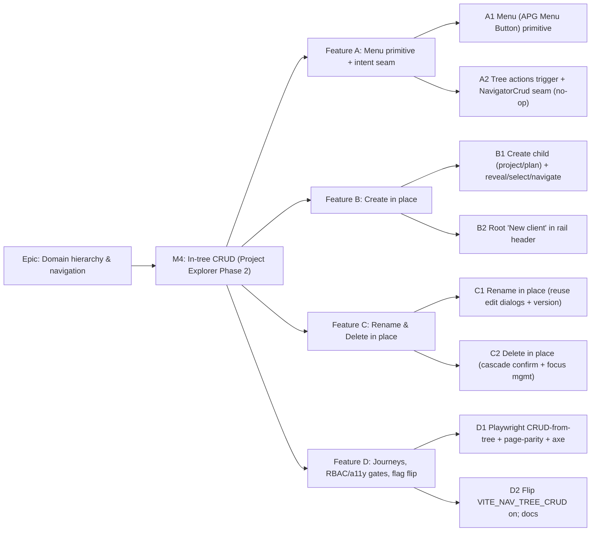

<!--
Implementation Plan — Stage 5 of docs/PROCESS.md.
Navigator in-tree CRUD (Project Explorer — Phase 2). Thin vertical slices; main stays releasable.
-->

# Implementation Plan: Navigator in-tree CRUD (Project Explorer — Phase 2)

- **Feature spec:** [`docs/specs/navigator-in-tree-crud.md`](../specs/navigator-in-tree-crud.md)
- **Status:** Shipped — all features (A+B+C+D) delivered; `VITE_NAV_TREE_CRUD` is
  **on by default** (specialist-review a11y fixes + flag-on Playwright journeys green).
  CQ-1 (Menu primitive + coordinator seam recorded as an ADR-0029 extension in
  `DECISIONS.md`) and CQ-2 (root "New client" in the rail header) both approved.
- **Owner:** _TBD_
- **Related ADR:** ADR-0029 (this is its named Phase 2 — extension, **no new ADR**; `Menu` primitive recorded in `DECISIONS.md`/`COMPONENT_LIBRARY.md`)

## Breakdown

### Epic

**Domain hierarchy & navigation** — make moving around **and shaping** the Org →
Client → Project → Plan hierarchy fast, persistent, and accessible on the persistent
app-shell. Phase 1 (navigation) shipped; **Phase 2 (this plan) adds in-tree CRUD**,
reusing the existing endpoints, dialogs, and soft-delete/cascade model. Maps to the
roadmap navigation-UX theme.

### Milestone M4: In-tree CRUD (shippable slice)

**Outcome:** a writer (Planner/Org Admin) can **create, rename, and soft-delete**
clients, projects, and plans **directly from the Project Explorer** — via right-click,
a per-row "⋯" button, or the keyboard Menu key — using the same dialogs, validation,
optimistic-locking, cascade, and Recently Deleted flow as the management pages.
Contributors/Viewers see a navigation-only tree unchanged. **Zero backend change.**
Ships behind **`VITE_NAV_TREE_CRUD`** (default **off** until D2), so every PR keeps
`main` releasable — flag-off = today's navigation-only tree.

---

#### Feature A: Menu primitive + intent seam

> **Description:** The reusable, accessible pieces: a hand-rolled APG `Menu` primitive,
> and the wiring that lets the shared tree **emit CRUD intents** to a shell-layer
> coordinator without a `feature → feature` import — delivered as a **no-op seam** first
> (menu opens, items present, actions not yet handled) so behaviour is provable in
> isolation.
> **Complexity:** L
> **Dependencies:** shipped navigator (M1+M2) + hierarchy-crud on `main`.
> **Risks:** APG menu a11y (focus in/out, Esc-return, roving) → build to the pattern with
> axe + keyboard tests as a gate; menu vs. tree keyboard-model collision → menu is a
> separate focus scope, tree roving-tabindex restored on close (tested).
> **Testing requirements:** unit (`nodeActions(kind, canWrite)`); component + **axe**
> (menu roles, open/close, roving, Esc returns focus to trigger, RBAC hides items);
> tree keyboard model intact after menu close.

##### Task A1 — `Menu` (APG Menu Button) primitive (≈ one PR)

- **Description:** Add `components/ui/menu.tsx` (`Menu`, `MenuItem`) — hand-rolled on
  semantic HTML: `role="menu"`/`menuitem`, focus moves into the menu on open, ↑/↓/Home/
  End roving, Esc + click-away close with **focus return to the trigger**, trigger carries
  `aria-haspopup="menu"` + `aria-expanded`; popover anchored to trigger (and to a pointer
  position for right-click); tokenised, theme-aware, reduced-motion-safe. No new npm dep.
- **Complexity:** M
- **Dependencies:** none
- **Risks:** reinventing a11y subtly wrong → mirror the `Dialog` primitive's focus
  conventions; axe + keyboard tests gate; component-reviewer + accessibility-reviewer.
- **Testing:** component + axe (roles/attrs, keyboard nav, Esc/click-away, focus return);
  light/dark snapshot; reduced-motion.
- **Development steps:**
  1. Implement `Menu`/`MenuItem` on semantic HTML with the APG keyboard model.
  2. Component + axe tests; `docs/COMPONENT_LIBRARY.md` + `CLAUDE.md` §12 line +
     `docs/DECISIONS.md` entry.
  3. Changeset.

##### Task A2 — Tree actions trigger + `NavigatorCrud` seam (no-op) (≈ one PR)

- **Description:** Add the pure `nodeActions(kind, canWrite)` helper; give `TreeItemRow`
  the actions trigger (right-click, writer-only "⋯" button, Menu/Shift+F10 folded into
  the existing keyboard path) rendering the `Menu`; introduce `NavigatorCrudContext`
  (`onNodeAction`, `canWrite`) and a `NavigatorCrud` shell coordinator wired into the rail
  - drawer — **actions log/no-op for now**. Extend the virtualization force-render rule to
    keep an open-menu row mounted. All behind `VITE_NAV_TREE_CRUD`.
- **Complexity:** M
- **Dependencies:** A1
- **Risks:** `feature → feature` leak → the tree imports **only** the context + `Menu`
  (shared); ESLint boundary check stays green. Menu row unmounting under windowing → force-
  render while open (tested).
- **Testing:** unit (`nodeActions` by kind+role); component (trigger opens menu with the
  right items; non-writer sees none; tree roving intact after close) + axe.
- **Development steps:**
  1. `nodeActions` helper + tests.
  2. Trigger + `Menu` in `TreeItemRow`; `NavigatorCrudContext` + no-op coordinator in the
     rail/drawer; force-render open-menu row.
  3. Component/axe tests; changeset.

---

#### Feature B: Create in place

> **Description:** Wire the create actions end-to-end: "New project"/"New plan" from a
> node menu and "New client" from the rail header, reusing the existing form dialogs +
> create hooks, then reveal/select/focus (and navigate for a plan).
> **Complexity:** M
> **Dependencies:** Feature A.
> **Risks:** post-create orientation racing the invalidation refetch → resolve the new
> node id from the mutation result and `expandPath` + set selection/focus once the branch
> query settles; navigate only for a plan.
> **Testing requirements:** component (each create opens the correct scoped dialog; on
> success the branch reveals + selects the new node; plan navigates); integration with a
> mocked query client.

##### Task B1 — Create child (project / plan) (≈ one PR)

- **Description:** In `NavigatorCrud`, handle `create-project` (open `ProjectFormDialog`
  scoped to the client) and `create-plan` (open `PlanFormDialog` scoped to the project);
  on success invalidate via the existing hooks, `expandPath(parent)`, select + focus the
  new node, **navigate to it if a plan**, and announce.
- **Complexity:** M
- **Dependencies:** A2
- **Risks:** selecting a node not yet in `rows` → focus/select applies after the branch
  refetch settles (effect keyed on the new id appearing in `rows`).
- **Testing:** component (menu → dialog scoped correctly; success reveals + selects; plan
  navigates; folder does not); announcement fired.
- **Development steps:**
  1. Coordinator handlers + reused dialogs + post-success orientation.
  2. Component/integration tests.
  3. Changeset.

##### Task B2 — Root "New client" in the rail header (≈ one PR)

- **Description:** Add a `canManageHierarchy`-gated "New client" control to the
  `NavigatorRail` header (CQ-2) opening `ClientFormDialog` via the coordinator; on success
  the new client appears as the first root and is selected + focused. Works in the empty-org
  state.
- **Complexity:** S
- **Dependencies:** B1
- **Risks:** low; keep rail-header layout tokenised; hidden for non-writers.
- **Testing:** component (control present for writers only; creates + reveals the client;
  empty-org path) + axe.
- **Development steps:**
  1. Rail-header control + coordinator hook-up.
  2. Tests; changeset.

---

#### Feature C: Rename & Delete in place

> **Description:** Rename via the reused edit dialogs (with optimistic-lock `version`), and
> soft-delete via the reused `ConfirmDialog` with kind-appropriate cascade copy + robust
> post-delete focus management.
> **Complexity:** M
> **Dependencies:** Feature A (B optional but sequenced after).
> **Risks:** rename needs the full summary (`version`) not just the tree node → look it up
> from the cached parent list query via `parentId`; delete focus loss → deterministic
> `nextFocusAfterDelete` helper.
> **Testing requirements:** unit (`nextFocusAfterDelete`); component (rename seeds
> version + 409 path; delete cascade copy per kind; focus lands on a live sibling; deleted
> selection falls to not-found) + axe; parity with the page behaviour.

##### Task C1 — Rename in place (≈ one PR)

- **Description:** Handle `rename` in `NavigatorCrud`: resolve the target's full summary
  (with `version`) from the cached list query (`useClients` / `useProjects(parentId)` /
  `usePlans(parentId)`), open the existing edit dialog seeded from it; success relabels via
  invalidation; 409 shows the API message + refetch (existing dialog behaviour, unchanged).
- **Complexity:** M
- **Dependencies:** A2
- **Risks:** stale/missing cache entry → if absent, fetch the detail (existing detail
  queries) before opening; never open with an undefined version.
- **Testing:** component (edit dialog seeded correctly per kind; save relabels; 409 →
  message + refetch); integration.
- **Development steps:**
  1. Summary resolution + reused edit dialog wiring.
  2. Tests; changeset.

##### Task C2 — Delete (soft, cascade) in place (≈ one PR)

- **Description:** Handle `delete`: open `ConfirmDialog` with kind-appropriate cascade copy
  (client → "all its projects and plans"; project → "all its plans"; plan → itself; all
  end "You can restore it later."); on confirm call the existing delete hook (parent id
  from the node's `parentId`); invalidate; move focus via `nextFocusAfterDelete`; announce.
  Deleted node flows to Recently Deleted (no new wiring).
- **Complexity:** M
- **Dependencies:** A2 (C1 for shared coordinator plumbing)
- **Risks:** focus falling to `<body>` on row unmount → compute the next focus target
  before the refetch removes the row (mirror the pages' `flushSync` focus pattern);
  deleting the selected/ancestor node → workspace not-found + no orphan highlight (tested).
- **Testing:** unit (`nextFocusAfterDelete`: sibling→prev→parent→container); component
  (cascade copy per kind; confirm deletes + focus target; selected-node delete) + axe.
- **Development steps:**
  1. `nextFocusAfterDelete` helper + tests.
  2. Confirm + delete hook wiring + focus management + announce.
  3. Component/axe tests; changeset.

---

#### Feature D: Journeys, gates & rollout

> **Description:** Prove the end-to-end CRUD-from-tree journeys and page-parity, gate on
> RBAC + a11y, then flip `VITE_NAV_TREE_CRUD` on and update docs.
> **Complexity:** M
> **Dependencies:** Features A, B, C.
> **Risks:** flag flip changes default behaviour for writers → its own PR after all gates
> green; RBAC regression → explicit non-writer journeys asserting no affordances.
> **Testing requirements:** Playwright (create/rename/delete from tree; RBAC-hidden for
> Viewer/Contributor; keyboard-only path; drawer path) + axe in each; page-parity checks.

##### Task D1 — Playwright journeys + parity + axe (≈ one PR)

- **Description:** Add journeys: (1) writer creates a plan under a project from the tree →
  new plan revealed + opened; (2) rename a client → relabels; (3) delete a project → cascade
  confirm → row leaves tree, appears in Recently Deleted, focus safe; (4) Viewer/Contributor
  sees **no** write affordances; (5) full keyboard-only open-menu-and-act; (6) small-screen
  drawer CRUD. Run axe in each; assert the tree DOM persists across a CRUD op.
- **Complexity:** M
- **Dependencies:** C2, B2
- **Risks:** flaky focus/async assertions → await the branch refetch + announcement region.
- **Testing:** the six Playwright journeys + axe; parity assertions (same requests as the
  pages).
- **Development steps:**
  1. Playwright journeys + axe.
  2. Fix any gaps found; changeset.

##### Task D2 — Flip `VITE_NAV_TREE_CRUD` on; docs (≈ one PR)

- **Description:** Flip the flag default-on; update `docs/COMPONENT_LIBRARY.md` (Menu),
  `docs/FRONTEND_ARCHITECTURE.md` (NavigatorCrud coordinator seam), `docs/UX_STANDARDS.md`
  (tree context-menu pattern), `docs/DECISIONS.md`, `CLAUDE.md` §12, and `docs/ROADMAP.md`
  (navigator Phase 2 done). Confirm ADR-0029 referenced (not amended).
- **Complexity:** S
- **Dependencies:** D1
- **Risks:** default change for all writers → separate, clearly-scoped PR; flag-off baseline
  stays green.
- **Testing:** flag-off navigation-only baseline green; flag-on journeys green.
- **Development steps:**
  1. Flip the flag; docs updates.
  2. Changeset; version-impact note (user-visible → minor pre-1.0).

## Sequencing & slices

Behind `VITE_NAV_TREE_CRUD` (default **off** until D2), so every PR keeps `main`
releasable — flag-off is exactly today's navigation-only tree.

1. **Feature A — A1 → A2** — the `Menu` primitive, then the tree trigger + no-op
   coordinator seam (provable in isolation).
2. **Feature B — B1 → B2** — create child, then root "New client".
3. **Feature C — C1 → C2** — rename, then delete (can run in parallel with B after A2).
4. **Feature D — D1 → D2** — journeys + gates, then flip the flag on.

**Out of scope (named future phases, not built here):** Phase 3 server-side search;
drag-and-drop move/reparent; multi-select bulk ops; restore-from-tree; anything touching
the TSLD canvas.

## Definition of Done (per task)

Each task's PR must satisfy the Feature Completion Criteria in
[`docs/PROCESS.md`](../PROCESS.md): code to the approved design (conforming to ADR-0029);
tests (unit + component + Playwright/axe as relevant, ≥ 80% on changed code); docs updated
(`COMPONENT_LIBRARY.md`, `FRONTEND_ARCHITECTURE.md`, `UX_STANDARDS.md`, `DECISIONS.md`,
`CLAUDE.md` §12, `ROADMAP.md`); **accessibility reviewed** (WCAG 2.2 AA — the APG menu +
preserved tree keyboard model are gating); **performance considered** (invalidate-only,
no new N+1, open-menu force-render); **security** (no new server surface — confirm
`canManageHierarchy` gating client-side and unchanged server RBAC/scope; no new IDOR);
Docker build + CI green; a changeset; version impact assessed (user-visible → **minor**
pre-1.0).

**Recommended agents.** **ui-architect** (confirm the coordinator seam + `Menu` primitive
fit ADR-0029; decide DECISIONS.md vs. a short ADR-0030 if reviewers prefer). Reviewers:
**accessibility-reviewer** (gating — APG menu, focus in/out/return, tree keyboard model
intact, axe), **component-reviewer** (the new `Menu` primitive API, tokens/variants, no
one-offs, tree trigger API), **ux-reviewer** (context-menu pattern, cascade copy,
post-action orientation, RBAC-hidden affordances). Backend reviewers **not required**
(zero API/DB change) — **security-reviewer** may do a light pass to confirm no new write
surface and that gating is UX-only over the existing enforced RBAC.

## Risks & assumptions (rollup)

| Risk / assumption                                       | Likelihood | Impact | Mitigation                                                                                                    |
| ------------------------------------------------------- | ---------- | ------ | ------------------------------------------------------------------------------------------------------------- |
| New `Menu` primitive a11y subtly wrong                  | med        | high   | Build to APG; axe + keyboard-only tests as a gate; accessibility-reviewer sign-off; mirror `Dialog` focus.    |
| Menu breaks the tree's roving-tabindex keyboard model   | med        | high   | Menu is a separate focus scope; restore roving on close; component test asserts tree keyboard intact.         |
| `features/navigator` leaks a `feature → feature` import | low        | med    | Tree imports only `Menu` + `NavigatorCrudContext` (shared); coordinator lives in the composition layer; lint. |
| Post-create/-delete focus lost to `<body>`              | med        | med    | Deterministic `nextFocusAfterDelete`; apply select/focus after the branch settles; mirror pages' flushSync.   |
| Rename opened without a fresh optimistic-lock `version` | low        | med    | Resolve full summary from cache; fetch detail if absent; 409 path reuses the dialog's existing handling.      |
| Open menu row unmounts under virtualization             | low        | med    | Extend force-render to open-menu rows (or close menu on scroll); tested against a large synthetic branch.     |
| CQ-1/CQ-2 unresolved (Menu+seam / root "New client")    | med        | med    | Recommended defaults stated; block A1/B2 on approval; fallback ADR-0030 only if reviewers require it.         |
| Flag flip changes default for all writers               | low        | med    | Separate scoped PR after all gates green; flag-off baseline stays green.                                      |
| Scope creep into drag/drop, bulk, restore, search       | med        | low    | Explicitly out of scope in spec + plan; reject in review.                                                     |
