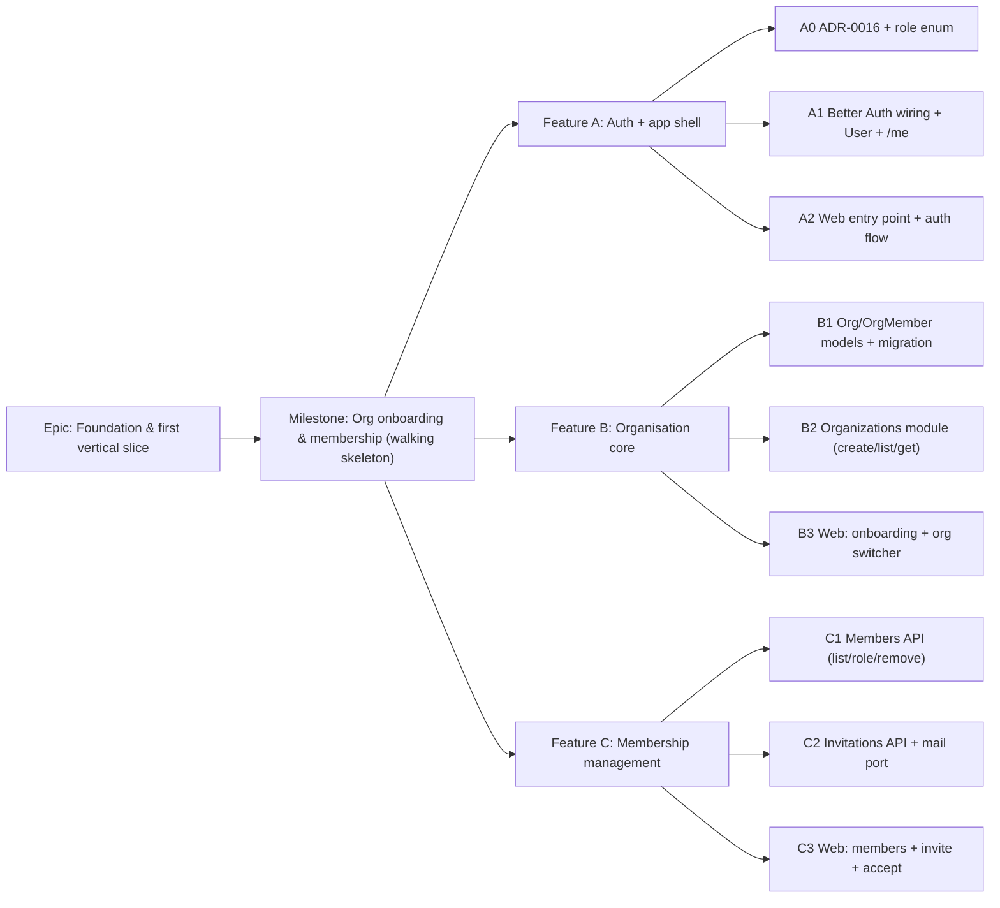

# Implementation Plan: Organisation onboarding & membership

- **Feature spec:** [`docs/specs/org-onboarding-membership.md`](../specs/org-onboarding-membership.md)
- **Status:** Draft (awaiting approval)
- **Owner:** _TBD_

## Breakdown

### Epic

**Foundation & first vertical slice** — stand up the walking skeleton and the
first real feature (organisation onboarding & membership) that every future
SchedulePoint capability scopes against. Maps to roadmap **M1**.

### Milestone: Org onboarding & membership (shippable slice)

**Outcome:** a user can sign up/in/out, create an organisation (becoming its Org
Admin), switch between their orgs, invite people by email with a role, accept an
invitation, and view/change-role/remove members — all deny-by-default and
organisation-scoped, on a mobile-first, theme-aware web app. `main` stays
releasable after every task.

---

#### Feature A: Authentication & app shell (the walking skeleton)

> **Description:** Better Auth wired end-to-end, the first web entry point, and
> one authenticated org-scoped read (`/api/v1/me`) — proving web ↔ api ↔ Postgres
> and the auth/logging cross-cutting stack.
> **Complexity:** L
> **Dependencies:** none (must land first).
> **Risks:** Better Auth ↔ NestJS/Prisma integration friction → spike the mount +
> session resolution behind the existing `AuthContextService` seam early; keep the
> provider behind that boundary (ADR-0003) so it stays swappable.
> **Testing:** service unit tests (principal resolution); API e2e for sign-up/in/
> out + `/me` (real Postgres); web component tests for auth forms; Playwright
> journey (sign in → shell) with a11y checks.

##### Task A0 — ADR-0016 + role enum in the auth seam (≈ one PR)

- **Description:** Write **ADR-0016** (core identity & tenancy model + role set),
  record the `MailService`-port decision, and update the reference template's
  `OrganizationRole` enum + role→permission map to
  `ORG_ADMIN/PLANNER/CONTRIBUTOR/VIEWER`. No app behaviour yet.
- **Complexity:** S
- **Dependencies:** none
- **Risks:** template drift → run `scripts/verify-template.sh`; keep enum values
  additive-friendly (`EXTERNAL_GUEST` reserved but unused).
- **Testing:** template verify script green; unit test for the role→permission map.
- **Development steps:**
  1. Author `docs/adr/0016-core-identity-tenancy-role-model.md`.
  2. Update `common/auth/principal` `OrganizationRole` + reference permissions.
  3. Update `CLAUDE.md` §1/§16 references; add a changeset.

##### Task A1 — Better Auth wiring + `User` model + `/api/v1/me` (≈ one PR)

- **Description:** Mount Better Auth (`/api/auth/*`); model `User` and Better
  Auth's tables in Prisma (first migration slice); resolve the principal from the
  session in `AuthContextService`; add authenticated `GET /api/v1/me` returning
  the user + (empty for now) memberships.
- **Complexity:** L
- **Dependencies:** A0
- **Risks:** session/cookie/CSRF misconfig → follow `SECURITY_STANDARDS` (secure,
  http-only, same-site, CSRF on mutations); non-enumerating auth errors.
- **Testing:** unit (principal from session); API e2e sign-up/in/out + `/me`
  (200 authed, 401 anon); throttler on auth routes.
- **Development steps:**
  1. Add `BETTER_AUTH_SECRET` etc. to the Zod config schema + `.env.example`.
  2. Prisma models for `User`(+ Better Auth tables); `prisma migrate dev`.
  3. Implement the `AuthContextService` adapter + `/me` controller/service.
  4. Wire rate-limiting on auth endpoints; update `API.md`/OpenAPI; changeset.

##### Task A2 — Web entry point + auth flow + `_authed` shell (≈ one PR)

- **Description:** Land `main.tsx`, providers, router, `styles/globals.css`; public
  `sign-in`/`sign-up` routes; `_authed` layout guard + minimal app shell (header,
  theme toggle); `useSession`. This removes the "no web entry point" tech debt.
- **Complexity:** L
- **Dependencies:** A1
- **Risks:** flash-of-wrong-theme / unguarded routes → inline theme script + guard
  in `beforeLoad`; CI must now build web.
- **Testing:** component tests (forms, guard redirect); Playwright sign-in journey
  + axe a11y; enable web build in CI.
- **Development steps:**
  1. Bootstrap entry, providers, router, root layout, tokens.
  2. `features/auth` (forms, hooks) via `Form` primitive + Zod.
  3. `_authed` guard + `components/layout` shell + `ThemeToggle`.
  4. Update `TECH_DEBT.md`/`ROADMAP.md`; CI web build on; changeset.

---

#### Feature B: Organisation core

> **Description:** The canonical `Organization`/`OrgMember` scoping model, org
> creation (creator → Org Admin), listing a user's orgs, the org-scope resolver,
> and the web onboarding + org switcher.
> **Complexity:** M
> **Dependencies:** Feature A.
> **Risks:** slug uniqueness under concurrency → DB partial-unique + retry-with-
> suffix; scope resolver must 404 (not 403) for non-members (anti-enumeration).
> **Testing:** unit (create tx, slug suffixing, scope check); API e2e (create/list/
> get, IDOR 404); web component + journey (create first org, switch).

##### Task B1 — `Organization` + `OrgMember` models + migration (≈ one PR)

- **Description:** Add both models + `OrganizationRole` enum usage per DATABASE.md
  (UUID v7, snake_case, soft-delete, audit, `version`, scoped/partial-unique
  indexes). Design with **database-architect** first.
- **Complexity:** M
- **Dependencies:** A1
- **Risks:** getting partial-unique/soft-delete indexes right → review migration SQL.
- **Testing:** repository unit tests (soft-delete filter, optimistic-lock helper);
  migration applies cleanly on real Postgres in CI.
- **Development steps:**
  1. Models + enums in `schema.prisma`; `prisma migrate dev`.
  2. Repositories with centralised soft-delete filter + `updateIfVersionMatches`.
  3. Update `DATABASE.md` note; changeset.

##### Task B2 — Organizations module: create / list / get + scope resolver (≈ one PR)

- **Description:** Copy the reference module → `organizations`; `POST` (create + Org
  Admin in one tx), `GET` list (caller's orgs), `GET :orgSlug`; the reusable
  **org-scope resolver** (resolve by slug → load membership → `principal.can`); wire
  memberships into `/me` and the principal.
- **Complexity:** M
- **Dependencies:** B1
- **Risks:** transaction correctness (org+membership atomic) → `$transaction`;
  audit-log entry on create.
- **Testing:** unit (authz, tx, slug); API e2e (201 + Location, list only mine,
  404 for non-member).
- **Development steps:**
  1. DTOs, service (tx, slug uniquify), controller, permissions map.
  2. Scope resolver used by all `:orgSlug` routes.
  3. OpenAPI/`API.md`; changeset.

##### Task B3 — Web: onboarding + org switcher + org-scoped routing (≈ one PR)

- **Description:** `_authed/onboarding` (create first org), header `OrgSwitcher`,
  `/orgs/$orgSlug/…` routing with URL as authoritative active org, "last active
  org" convenience redirect.
- **Complexity:** M
- **Dependencies:** B2, A2
- **Risks:** deep-linking to an org you're not in → route loader handles 404
  gracefully; empty-membership routing loop → guard routes to onboarding.
- **Testing:** component (switcher, create form), Playwright (sign up → create org
  → land on members) + a11y.
- **Development steps:**
  1. `features/organizations` hooks + `CreateOrganizationForm` + `OrgSwitcher`.
  2. `$orgSlug` routes + redirect logic; empty/loading/error states.
  3. Changeset; docs touch-ups.

---

#### Feature C: Membership management

> **Description:** List members, change role, remove, invite by email, accept an
> invitation — via a stubbed mail port — with the last-admin invariant and
> optimistic locking.
> **Complexity:** L
> **Dependencies:** Feature B.
> **Risks:** IDOR on member/invite ids → always scope by org from the URL and load
> the resource in-scope; last-admin invariant enforced inside the transaction;
> tokens hashed at rest.
> **Testing:** unit (last-admin, optimistic-lock, email/expiry checks); API e2e
> (403/404/409/410 matrix, IDOR); web + Playwright invite→accept journey.

##### Task C1 — Members API: list / change role / remove (≈ one PR)

- **Description:** `members` module: `GET members` (cursor-paginated),
  `PATCH members/:id` (role + version), `DELETE members/:id` (soft delete), with the
  **last-admin invariant** and optimistic locking; audit-log entries.
- **Complexity:** M
- **Dependencies:** B2
- **Risks:** lost updates / removing last admin → versioned update + in-tx admin
  count check.
- **Testing:** unit (last-admin, stale-version 409); API e2e (permission matrix,
  IDOR 404, 409 cases).
- **Development steps:**
  1. DTOs, service (invariants, tx), controller, permissions.
  2. Cursor pagination; response DTOs (safe user summary).
  3. OpenAPI/`API.md`; changeset.

##### Task C2 — Invitations API + `MailService` port (stub) (≈ one PR)

- **Description:** `invitations` module: create (`member:invite`), list pending,
  revoke, `GET :token` preview, `POST accept`. Store **token hash** + expiry;
  publish the link via a `MailService` port (v1 = logging/stub adapter);
  invite→accept is transactional.
- **Complexity:** L
- **Dependencies:** B2 (accept adds an OrgMember)
- **Risks:** token leakage → hash at rest, raw token only in the create response +
  email; expired/duplicate handling → 410/409 per error table; publish **after**
  commit.
- **Testing:** unit (hash lookup, expiry, email match, already-member); API e2e
  (201, accept 200, 404/410/403/409); mail port called once after commit.
- **Development steps:**
  1. `MailService` interface + stub adapter + provider token; config keys.
  2. DTOs, service (token gen/hash, tx accept), controller, permissions.
  3. Add **410** to `API.md`; OpenAPI; changeset.

##### Task C3 — Web: members screen + invite + accept (≈ one PR)

- **Description:** `/orgs/$orgSlug/members` screen (`MembersTable`), `InviteMemberDialog`,
  inline `RoleSelect` change, remove-with-confirm, and the public
  `accept-invite` route (`AcceptInvitationCard`, auth-then-accept).
- **Complexity:** L
- **Dependencies:** C1, C2, B3
- **Risks:** optimistic UI vs 409 → surface conflict toast + refetch; a11y of
  dialog/table/menu → design-system primitives + axe checks.
- **Testing:** component (table, dialog, role change, remove); Playwright invite →
  accept → appears in roster + a11y; empty/loading/error states covered.
- **Development steps:**
  1. `features/members` hooks + components (primitives only).
  2. `accept-invite` route with sign-in redirect + token preservation.
  3. Changeset; docs.

## Sequencing & slices

Strict order, each PR keeps `main` releasable:

1. **A0 → A1 → A2** — walking skeleton: after A2 a user can sign in and see an
   (org-less) shell; web builds in CI.
2. **B1 → B2 → B3** — after B3 a user can create/switch organisations.
3. **C1 → C2 → C3** — after C3 full membership management works end-to-end.

No feature flags required (each slice is independently valuable and additive).
`accept-invite` is usable as soon as C2/C3 land; before that, the copyable link in
the create response makes onboarding testable even without an email provider.

## Definition of Done (per task)

Each task's PR must satisfy the Feature Completion Criteria in
[`docs/PROCESS.md`](../PROCESS.md): code to the approved design, tests
(unit + API e2e + web/e2e/a11y as relevant, ≥ 80% on changed code), docs/ADR/
OpenAPI updates, **security review** (authN/Z, scope/IDOR, token handling,
CSRF, rate-limit), **performance** (indexes, pagination, no N+1), **accessibility**
(WCAG 2.2 AA), Docker build + CI green, a changeset, and version-impact assessed.

**Recommended agents:** database-architect (B1), security-reviewer (A1/B2/C1/C2 —
IDOR, tokens, CSRF), api-reviewer (all endpoints), backend-performance-reviewer
(list endpoints), test-engineer (e2e matrices), component-reviewer + ux-reviewer +
accessibility-reviewer (A2/B3/C3), devops-reviewer (A2 CI web build).

## Risks & assumptions (rollup)

| Risk / assumption                                              | Likelihood | Impact | Mitigation                                                                 |
| -------------------------------------------------------------- | ---------- | ------ | -------------------------------------------------------------------------- |
| Better Auth ↔ NestJS/Prisma integration friction               | med        | high   | Spike behind the `AuthContextService` seam in A1; keep provider swappable. |
| Role-enum change drifts from the reference template             | med        | med    | ADR-0016 + `scripts/verify-template.sh` in A0; update template in step.    |
| IDOR / cross-tenant leak                                        | low        | high   | Permission + org-scope on every route; 404 for non-member; e2e IDOR tests. |
| Last-admin invariant bypassed under concurrency                 | low        | high   | Enforce admin-count check **inside** the transaction; unit + e2e cover it. |
| Invite token leakage                                            | low        | high   | Hash at rest; raw token only in create response + email; expiry + revoke.  |
| Slug collision under concurrent creation                        | low        | med    | DB partial-unique + retry-with-suffix; test concurrent create.             |
| No email provider in v1 (assumption)                            | high       | low    | `MailService` port + stub adapter; copyable link in UI; provider follow-up.|
| Email verification not blocking in v1 (assumption)              | med        | med    | Verification sent, not enforced for alpha; revisit before GA.              |
| Open self-service sign-up (assumption — **critical Q**)         | med        | med    | Confirm at approval; if closed alpha, gate sign-up + `organization:create`.|
| CI now builds web (new surface)                                 | med        | low    | Land entry point + build in A2 with devops-reviewer.                        |
