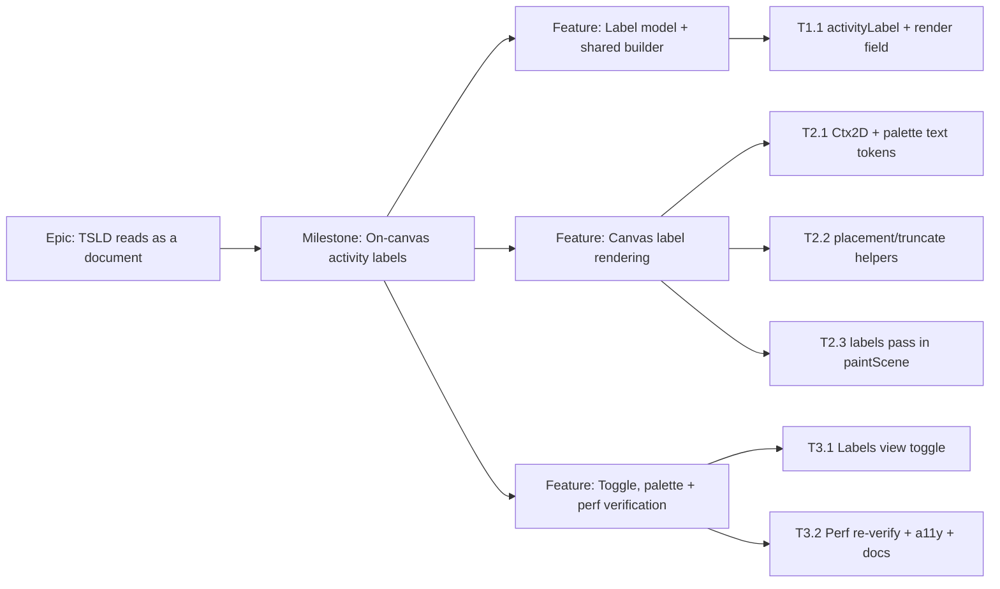

# Implementation Plan: On-canvas activity labels for the TSLD canvas

- **Feature spec:** `docs/specs/tsld-activity-labels.md`
- **Status:** Shipped — implemented (code + name + duration on the bar; canvas `fillText`
  confirmed by ui-architect; sixth "Labels" toggle default-on). Perf re-verified on the ADR-0026
  spike **after correcting its label path to run the real truncation/measure/placement code on
  realistic labels**: p95 9.4ms draw @ 2,000 activities (median 6ms), vs 3.6ms labels-off — inside
  the ≤16ms 60fps budget. Extension within ADR-0026 (DECISIONS).
- **Owner:** TBD

## Breakdown

### Epic

**TSLD reads as a document** — make the flagship diagram self-describing (PROJECT_BRIEF §1,
§11; Journey 3). This feature is the "labels" increment; it maps to the TSLD readability
theme that already produced the ruler, zoom presets, layer toggles, today marker and
non-working shading.

### Milestone: On-canvas activity labels (shippable slice)

**Outcome:** on a calculated plan, every visible bar wide enough shows its `code name`
inside (clipped/ellipsised), short bars and milestone diamonds show a beside-label where
there's room, labels vanish below a legibility zoom and can be toggled off — all within the
ADR-0026 draw budget and with the visible label provably equal to the accessible name.

Each task below is one PR and keeps `main` releasable. Because labels are a pure additive
paint gated by a toggle defaulting on, there is no dark-launch flag needed; the _rendering_
tasks (T2.x) land the pass but the visible-by-default behaviour is completed and
perf-confirmed at T3.2 — the intermediate PRs keep the toggle default such that no
half-built text ships (see Sequencing).

---

#### Feature: Label model + shared builder

> **Description:** Give the pure render model a `label` string, sourced from one shared
> builder that also feeds the accessible name — so visible and accessible text can never
> diverge (WCAG 2.5.3). No pixels change yet.
> **Complexity:** S
> **Dependencies:** none (existing render pipeline).
> **Risks:** builder drift → mitigated by making `describeActivity` consume it and asserting
> the prefix relationship in a unit test.
> **Testing requirements:** unit — `activityLabel` (code/no-code/trim), and a test asserting
> the visible label is a leading substring of `describeActivity` output.

##### Task 1.1 — Shared `activityLabel` + `RenderActivity.label` (≈ one PR)

- **Description:** Extract `activityLabel(a)` in `render/a11y.ts`
  (`a.code ? \`${a.code} ${a.name}\` : a.name`), refactor `describeActivity`to use it for
its`name`const, add`label: string`to`RenderActivity`in`render-model.ts`, and set it
in `toRenderActivities` (`to-render-model.ts`).
- **Complexity:** S
- **Dependencies:** none.
- **Risks:** none material (additive field; render model stays enum-free — a plain string).
- **Testing:** extend `a11y.test.ts` (builder cases + label-in-name prefix assertion);
  update `to-render-model.test.ts` and `render-model.test.ts` to cover/carry `label`.
- **Development steps:**
  1. Add + export `activityLabel` in `a11y.ts`; refactor `describeActivity` onto it.
  2. Add `label` to `RenderActivity`; populate at the seam.
  3. Update unit tests (builder, prefix invariant, seam mapping).
  4. No docs/changeset yet (no user-visible change) — note the field in the render-model
     doc comment.

---

#### Feature: Canvas label rendering

> **Description:** Draw the labels in the Canvas 2D base-layer painter — adaptive
> inside/beside/suppress placement, cached measurement, ellipsis truncation, LOD zoom
> threshold, and contrast-correct text tokens.
> **Complexity:** L
> **Dependencies:** Task 1.1 (the `label` field).
> **Risks:** (a) `fillText`/`measureText` cost → cull + cache + threshold + font-once/frame;
> (b) contrast in one theme → paired on-fill foreground tokens, accessibility-reviewer sign-off;
> (c) label/neighbour collisions → lane-neighbour geometry check + suppress.
> **Testing requirements:** unit for the pure helpers; painter tests against an extended mock
> `Ctx2D` asserting inside/beside/suppress/hidden decisions and clip usage; snapshot that
> labels-off is byte-identical to today.

##### Task 2.1 — `Ctx2D` text surface + palette text tokens

- **Description:** Widen the painter's `Ctx2D` type to include `fillText`, `measureText`,
  `save`, `restore`, `clip`, `rect`, and the `font`/`textBaseline`/`textAlign` properties.
  Add label text colours to `TsldPalette` (`labelInsideOn`, `labelInsideCritical`,
  `labelInsideNearCritical`, `labelBeside`) and resolve them in `palette.ts`/`resolveTsldPalette`
  from `--color-primary-foreground`, `--color-destructive-foreground`,
  `--color-warning-foreground`, `--color-foreground` (with jsdom fallbacks).
- **Complexity:** S
- **Dependencies:** none (can land alongside/after 1.1).
- **Risks:** picking a token that fails contrast in a theme → verified in T3.2's audit; choose
  paired on-fill tokens by construction so the risk is low.
- **Testing:** `palette` resolution test (new keys, fallbacks); type-level compile check that
  the mock `Ctx2D` satisfies the widened surface.
- **Development steps:**
  1. Extend `Ctx2D` and every painter test's mock context.
  2. Add palette keys + resolve them; update `palette` fallbacks.
  3. Unit-test the resolver additions.

##### Task 2.2 — Pure placement + truncation helpers

- **Description:** Add pure, unit-tested helpers to `render-model.ts`: constants
  (`LABEL_MIN_PX_PER_DAY`, `LABEL_INSIDE_MIN_PX`, `LABEL_PAD_PX`, `LABEL_GAP_PX`,
  `LABEL_FONT`); `labelPlacement({ rect, isMilestone, nextLeftX })` →
  `'inside' | 'beside' | 'none'`; `truncateToWidth(text, maxPx, measure, ellipsisPx)` →
  fitted string (returns full text when it fits; trims + ellipsis otherwise). A tiny
  `MeasureCache` (Map keyed by text → width) wrapper so the painter measures each unique
  string at most once.
- **Complexity:** M
- **Dependencies:** none.
- **Risks:** off-by-one truncation / infinite trim loop → bounded loop + explicit tests for
  empty, 1-glyph, exact-fit, overflow, and all-ellipsis cases.
- **Testing:** exhaustive `render-model.test.ts` cases for placement (wide bar, narrow bar,
  milestone, colliding neighbour, sub-threshold zoom) and truncation with a stub `measure`.
- **Development steps:**
  1. Add constants + `labelPlacement` + `truncateToWidth` + `MeasureCache`.
  2. Unit-test each with a deterministic stub measurer (e.g. width = chars × k).

##### Task 2.3 — Labels pass in `paintScene`

- **Description:** After the bars/milestone layer, add the labels pass (base layer only),
  gated by `viewToggles.labels` **and** `view.pxPerDay ≥ LABEL_MIN_PX_PER_DAY`. Iterate the
  already-computed `visibleIds` (per lane, in x order so the next-neighbour x is available for
  beside collision), set `ctx.font`/`textBaseline`/`textAlign` **once**, and for each: pick
  placement via `labelPlacement`, choose the colour (inside → on-fill token by criticality;
  beside → `labelBeside`), then `truncateToWidth` via the cache and `fillText`. (Shipped without
  `save`/`clip`/`restore` — truncation alone fits the text to the box, so no per-label clip is
  needed, which is cheaper. Each visible activity's rect is computed once per frame and shared
  across the bar/label/selection layers.) Zero steady-state allocation; cache lives across frames.
- **Complexity:** M
- **Dependencies:** Tasks 1.1, 2.1, 2.2.
- **Risks:** per-frame `measureText` (budget) → cache keyed by text (font fixed, so stable
  across pan/zoom); clip cost → only around drawn labels; visual regression to bars-off path →
  the pass is fully skipped when the toggle is off (assert byte-identical).
- **Testing:** `paint.test.ts` — with labels on: inside label drawn for a wide bar (clip
  called, text set), beside for a milestone/short bar with room, suppressed on collision,
  none below threshold; with labels off: no text ops called and output matches the pre-feature
  path; assert `ctx.font` set once per frame.
- **Development steps:**
  1. Thread a `MeasureCache` into `paintScene` (ref-held in `TsldCanvas`, or module-scoped).
  2. Implement the pass with the placement/colour/clip/truncate logic.
  3. Painter unit tests (on/off/threshold/placement).
  4. Manual check in the running app at day/week/month/quarter zooms, light + dark.

---

#### Feature: Toggle, palette wiring + perf/a11y verification

> **Description:** Expose the "Labels" view toggle (sixth control), and close the milestone
> with the ADR-0026 perf re-verification, the accessibility contrast/label-in-name sign-off,
> and docs/changeset.
> **Complexity:** M
> **Dependencies:** Feature "Canvas label rendering".
> **Risks:** perf regression only visible at scale → re-run the spike harness with labels on;
> contrast failure in a theme → accessibility-reviewer gate before default-on.
> **Testing requirements:** control test (toggle renders/operates, defaults on); spike-harness
> measurement note; axe/a11y unchanged; e2e smoke that labels appear/disappear on toggle.

##### Task 3.1 — "Labels" view toggle

- **Description:** Add `labels: true` to `DEFAULT_VIEW_TOGGLES` and the `TsldViewToggles`
  type (Task 2.1 may already add the type field; this task adds the default + control), and a
  `{ key: 'labels', label: 'Labels' }` entry to `TOGGLES` in `TsldViewControls.tsx`. The
  `TsldPanel` `viewToggles`/`toggleView` plumbing carries it with no structural change.
- **Complexity:** S
- **Dependencies:** Task 2.3 (so toggling has a visible effect).
- **Risks:** none material — mirrors the five existing toggles exactly.
- **Testing:** extend `TsldViewControls.test.tsx` (sixth checkbox present, labelled, toggles);
  a panel test that flipping the toggle re-renders the canvas scene with `labels` changed.
- **Development steps:**
  1. Add the default + `TOGGLES` entry.
  2. Update control + panel tests.

##### Task 3.2 — Perf re-verify, a11y sign-off, docs + changeset

- **Description:** Re-run the ADR-0026 `prototypes/tsld-spike/` harness with the labels pass
  enabled at 500 and 2,000 activities under continuous pan/zoom; attach a short measurement
  note confirming draw p95 stays within budget (escalate/optimise if not — the evidence gate).
  Run the accessibility-reviewer over label contrast (all four token pairings, both themes)
  and the label-in-name invariant. Add the `docs/DECISIONS.md` entry (extension within
  ADR-0026), any `docs/DESIGN_SYSTEM.md` note for the new palette text tokens, and a
  changeset (minor, user-visible).
- **Complexity:** M
- **Dependencies:** Tasks 2.3, 3.1.
- **Risks:** budget miss at 2,000 → first tighten LOD threshold / cap max labels per frame /
  coarsen truncation; only if exhausted, reconsider the DOM-overlay escalation (ui-architect).
- **Testing:** spike measurement note; accessibility-reviewer report; existing
  `TsldPanel.axe.test.tsx` still green; optional Playwright assertion that a known activity
  name is drawn (via the accessible listbox, which is unchanged) and that the toggle hides it.
- **Development steps:**
  1. Extend the spike harness; capture and record numbers (method + hardware).
  2. Accessibility-reviewer pass on contrast + label-in-name; fix tokens if needed.
  3. Write the DECISIONS entry; note tokens in DESIGN_SYSTEM if warranted.
  4. Add changeset; confirm CI green (lint/typecheck/test).

## Sequencing & slices

1. **T1.1** — model + shared builder (no pixels; safe, releasable).
2. **T2.1 → T2.2 → T2.3** — text surface/tokens, pure helpers, then the painter pass. The
   pass ships **on by default** once T2.3 + T3.1 land together, so `main` never carries a
   half-drawn labels state: keep T2.3 and T3.1 in close sequence (or one PR if small), and do
   not flip any perceived-default until T3.2's perf/a11y gates pass. If a reviewer wants extra
   safety, T2.3 can land with the pass wired but `labels` defaulted **off**, flipping to **on**
   only in T3.2 after the gates — a one-line, fully reversible change.
3. **T3.1 → T3.2** — toggle, then the perf/a11y/docs close-out.

No feature flag or backend change is required; every task is independently reviewable and
keeps `main` releasable. The one hard gate before default-on is **T3.2's perf re-verification**
(ADR-0026 evidence discipline) and the **accessibility contrast sign-off**.

## Definition of Done (per task)

Each task's PR must satisfy the Feature Completion Criteria in
[`docs/PROCESS.md`](../PROCESS.md) — code, tests (≥ 80% on changed code), docs, security
(n/a here — no new data/auth), performance (T3.2 gate), accessibility (contrast +
label-in-name), Docker build, CI green, changelog/changeset, and version impact (minor).

## Risks & assumptions (rollup)

| Risk / assumption                                                   | Likelihood | Impact | Mitigation                                                                                                                                                                         |
| ------------------------------------------------------------------- | ---------- | ------ | ---------------------------------------------------------------------------------------------------------------------------------------------------------------------------------- |
| `fillText`/`measureText` breaks the draw budget at 2,000 activities | med        | high   | Cull to visible; cache widths keyed by text; cached ellipsis; LOD zoom threshold; font set once/frame; re-verify on the spike harness (T3.2) before default-on.                    |
| Label text fails WCAG contrast in one theme                         | med        | high   | Use paired on-fill foreground tokens (not the #28 fill/stroke tokens); accessibility-reviewer signs off both themes before default-on.                                             |
| Beside-labels clutter / collide in dense lanes                      | med        | med    | Suppress on lane-neighbour collision; beside only when clear room exists; LOD hides at coarse zoom.                                                                                |
| Visible label diverges from accessible name                         | low        | med    | One shared `activityLabel` builder feeds both; unit-assert the prefix invariant.                                                                                                   |
| DOM-overlay would actually be better (crispness/i18n)               | low        | med    | Recommendation is canvas-text (ADR-0026-aligned); **ui-architect confirms the canvas-vs-DOM call before build**; escalation is a contained painter-adjacent change if ever needed. |
| Assumption: single-locale LTR text is acceptable for v1             | high       | low    | Documented limitation; the shared builder is the future bidi/locale seam.                                                                                                          |
