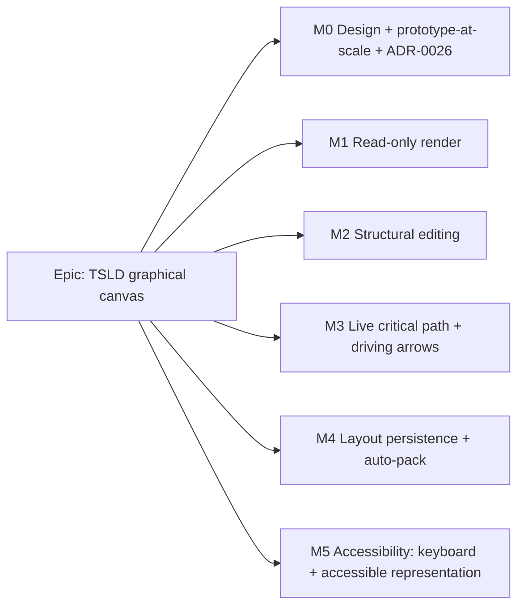

# Implementation Plan: Time-Scaled Logic Diagram (TSLD) graphical canvas

- **Feature spec:** [`docs/specs/tsld-canvas.md`](../specs/tsld-canvas.md) (Draft — awaiting approval)
- **Status:** Draft
- **Owner:** TBD (build); design shared with **ui-architect** (ADR-0026 rendering)

> Sequenced as thin vertical slices that keep `main` releasable. The **read** milestone ships value with no edit-lock dependency; **edit** milestones are gated behind a feature flag and the plan edit-lock (spec §1 Open question 2). The rendering-technology decision (Canvas 2D vs WebGL) is settled in **ADR-0026 by ui-architect** during Milestone 0 and does not block the render-model work, which is renderer-agnostic.

## Breakdown

### Epic

**TSLD graphical canvas** — deliver SchedulePoint's flagship primary editing surface (roadmap: "The TSLD graphical canvas"). Turn the existing domain/CPM foundation into the graphical, network-first editing experience that is the product's reason to exist (PROJECT_BRIEF §1/§2).

---

### Milestone 0: Design, prototype-at-scale & rendering ADR (no shippable UI)

**Outcome:** the rendering technology is decided with evidence; the renderer-agnostic architecture and render-model contract are fixed; the team knows Canvas 2D vs WebGL before hardening the render slice.

> **Owned jointly with ui-architect.** This milestone is design-only; it may produce a throwaway benchmark harness but no production feature code.

#### Feature: Rendering decision & architecture

> **Description:** prototype the draw loop at target scale, benchmark against the §12 fps budget, and record the decision + rendering architecture in ADR-0026.
> **Complexity:** L
> **Dependencies:** none (uses existing seed data / synthetic plans).
> **Risks:** prototype under-represents real interaction cost → build the harness with real pan/zoom/drag, not static paint. Canvas 2D fails at 2,000 → ADR-0026 escalates to WebGL (planned-for, not a surprise).
> **Testing requirements:** a reproducible **performance harness** measuring fps during pan/zoom/drag and time-to-interactive at 500 and 2,000 activities.

##### Task 0.1 — Prototype-at-scale benchmark (ui-architect)

- **Description:** throwaway Canvas 2D prototype rendering 2,000 activities × ~4 deps with virtualised draw; measure fps under scripted pan/zoom/drag.
- **Complexity:** L · **Dependencies:** none · **Risks:** synthetic data unrepresentative → mirror realistic lane spread/dep density.
- **Testing:** the harness itself is the artefact; capture numbers vs the ≥ 45/≥ 30 fps budget.
- **Steps:** 1) synthetic plan generator; 2) minimal culled Canvas2D renderer; 3) scripted interaction driver + fps capture; 4) if budget missed, spike a WebGL variant for comparison.

##### Task 0.2 — ADR-0026: rendering technology + architecture (ui-architect)

- **Description:** record Problem/Options/Choice/Trade-offs/Consequences for Canvas 2D vs WebGL; define the `CanvasRenderer` port, render-model contract, layering/caching, hit-testing.
- **Complexity:** M · **Dependencies:** 0.1 · **Risks:** premature lock-in → keep the port renderer-agnostic so a later swap is contained.
- **Testing:** n/a (design doc); acceptance = numbers back the choice.
- **Steps:** 1) draft ADR from harness results; 2) define port + render-model interfaces; 3) review; 4) mark ADR proposed→accepted.

##### Task 0.3 — Frontend feature-architecture note (ui-architect + feature-analyst)

- **Description:** confirm the `tsld` feature folder shape, state split (local viewport vs URL zoom/pan vs Query server-state), and the accessible-representation approach, consistent with FRONTEND_ARCHITECTURE.md.
- **Complexity:** S · **Dependencies:** 0.2 · **Steps:** update `docs/FRONTEND_ARCHITECTURE.md` with the feature's placement; no code.

---

### Milestone 1: Read-only render (shippable slice)

**Outcome:** any role can open a plan and read it graphically — time axis, activity bars in lanes, dependency arrows, critical-path highlight/near-critical shading, pan, zoom (day→year + slider), minimap, inspect. No editing. No edit-lock dependency. Immediately releasable.

#### Feature: Render model & viewport

> **Description:** pure geometry (dates+scale→pixels, lane→y, arrow routing, hit-testing) + viewport (zoom/pan) driving the renderer port.
> **Complexity:** XL · **Dependencies:** M0 (ADR-0026) · **Risks:** perf regressions vs prototype → keep the harness in CI as a guard; arrow-routing complexity → start with orthogonal routing, iterate.
> **Testing requirements:** heavy **unit** tests on the pure render model (deterministic geometry, routing, hit-testing); component test mounting the renderer with a fixed plan; perf harness gate at 500.

##### Task 1.1 — Render-model core (pure)

- **Description:** dates+zoom-scale→x, `laneIndex`→y, bar/milestone/hammock geometry, FS/SS/FF/SF arrow endpoint selection + orthogonal routing, lag indication, hit-testing.
- **Complexity:** L · **Dependencies:** M0 · **Testing:** exhaustive unit tests (all dep types, zoom levels, milestones, off-screen culling). · **Steps:** 1) scale/axis maths; 2) activity geometry; 3) arrow routing; 4) hit-test; 5) unit tests.

##### Task 1.2 — Renderer port + paint (per ADR-0026)

- **Description:** implement the `CanvasRenderer` (Canvas 2D default) consuming the render model; virtualised/culled draw loop, layered caching, rAF batching.
- **Complexity:** L · **Dependencies:** 1.1 · **Risks:** fps → performance-reviewer + harness. · **Testing:** component/visual smoke + perf harness. · **Steps:** paint axis/lanes/bars/arrows; culling; layer cache; theme tokens.

##### Task 1.3 — Data wiring (TanStack Query)

- **Description:** fetch plan + activities + dependencies + schedule summary; build render model; loading/empty/error states; time-to-interactive < 1.5 s at 500.
- **Complexity:** M · **Dependencies:** 1.1 · **Testing:** component tests for states; e2e open-plan. · **Steps:** query hooks (reuse existing); model assembly; states.

#### Feature: Navigation chrome

> **Description:** zoom controls (day/week/month/quarter/year + slider + ctrl-scroll), pan, minimap with viewport rectangle; zoom/pan reflected in URL for shareable views.
> **Complexity:** L · **Dependencies:** Render model & viewport · **Risks:** zoom-about-cursor maths → unit-test the transform. · **Testing:** unit (transforms), component (controls), e2e (zoom/pan/minimap), perf (≥ 45 fps at 500).

##### Task 1.4 — Zoom/pan + URL state

- **Complexity:** M · **Dependencies:** 1.2 · **Steps:** zoom transform (about cursor); pan; TanStack Router URL sync; unit + component tests.

##### Task 1.5 — Minimap + time axis + inspector (read)

- **Complexity:** M · **Dependencies:** 1.2 · **Steps:** minimap (whole-diagram + viewport rect + click-recenter); axis labels per scale; read-only `ActivityInspector`/`DependencyInspector`; markers (today/data-date).

#### Feature: Critical-path read (static)

> **Description:** highlight `isCritical`/critical chain, shade `isNearCritical` — colour **plus** non-colour encoding (weight/pattern/glyph). Driving arrows come in M3 (need engine change).
> **Complexity:** S · **Dependencies:** 1.2 · **Testing:** unit (styling map), a11y (non-colour encoding), e2e. · **Steps:** style map from engine flags; legend; contrast/non-colour check.

> **Reviews for M1:** ui-architect (renderer), performance-reviewer (fps/bundle/culling), component-reviewer (design-system compliance, no one-offs), ux-reviewer (navigation, states, hierarchy), accessibility-reviewer (non-colour encoding, focus on chrome), test-engineer (render-model + e2e + perf harness).

---

### Milestone 2: Structural editing (flagged; edit-lock gated)

**Outcome:** a Planner can build a network on the canvas — create by click-drag, reposition in time, and draw dependencies with modifier keys — with optimistic feedback < 100 ms and authoritative recalc on drop. Ships behind a feature flag; enabled once the plan edit-lock lands (spec §1 Q2).

> **Cross-cutting risk:** editing without a lock → concurrent-write conflicts. Mitigation: gate behind the edit-lock; interim rely on optimistic-locking `version` 409s with a conflict banner (no silent overwrite).

#### Feature: Create & reposition activities

> **Description:** click-drag create (start+duration); drag-to-reposition-in-time as a constraint edit (calendar-snapped); drag validity/clamping; optimistic→recalc-on-drop reconciliation.
> **Complexity:** XL · **Dependencies:** M1; edit-lock (or flag) · **Risks:** "move = constraint edit" semantics confuse users → clear affordance + inspector echo; recalc round-trip feels laggy → optimistic ghost + skeleton reconcile. · **Testing:** component (simulated pointer), API e2e (create/patch reused), Playwright journey, perf (feedback < 100 ms).

##### Task 2.1 — Create-by-drag controller

- **Complexity:** L · **Dependencies:** M1 · **Steps:** pointer capture; ghost bar; sub-day→milestone rule; `POST /activities` (existing) + recalc; reconcile; Esc-cancel; tests.

##### Task 2.2 — Reposition-in-time controller (constraint edit)

- **Complexity:** L · **Dependencies:** 2.1, ADR-0024 calendars · **Steps:** working-day snap; map drop→`constraintType/Date` via existing `PATCH /activities/:id`; clamp/flag infeasible (ADR-0023); recalc; reconcile; tests.

#### Feature: Draw dependencies (modifier keys)

> **Description:** drag edge→edge to create a tie; FS default, Shift=SS, Alt=FF, SF via menu; live type/validity preview; cycle/duplicate rejection with rollback.
> **Complexity:** L · **Dependencies:** M1; ADR-0021 · **Risks:** cycle preview cost → rely on server enforcement, cheap client heuristic only. · **Testing:** component (each modifier), API e2e (cycle 409, duplicate 409 reused), Playwright.

##### Task 2.3 — Dependency-draw controller

- **Complexity:** L · **Dependencies:** M1 · **Steps:** edge hit-zones; modifier→type; preview line; `POST /dependencies` (existing); rollback on 409; drop-on-empty → new successor + tie (Journey 1); tests.

> **Reviews for M2:** ui-architect (interaction model), ux-reviewer (gesture discoverability, modifier affordances), accessibility-reviewer (no pointer-only capability — see M5), security-reviewer (writes stay scoped/locked), api-reviewer (reused contracts), backend-performance-reviewer (recalc cadence), test-engineer.

---

### Milestone 3: Live critical path & driving arrows

**Outcome:** after every edit the critical path re-highlights and **driving vs non-driving** dependency arrows are visually distinct — closing the "drivers at a glance" promise. Requires the CPM engine to emit driving-logic flags.

#### Feature: Engine driving-logic output + schema

> **Description:** add `ActivityDependency.is_driving` (engine-owned); extend the CPM recalculate batched write to compute & persist it; expose `isDriving` on the dependency response DTO.
> **Complexity:** L · **Dependencies:** M1 (read); extends ADR-0022 · **Risks:** engine-contract change → short ADR/DECISIONS entry + golden-suite regression to preserve CPM parity (PROJECT_BRIEF §17). · **Testing:** engine unit tests (driving computation on canonical schedules), API e2e (`is_driving` on recalc + in GET), migration test.

##### Task 3.1 — Schema + migration (`is_driving`)

- **Complexity:** S · **Dependencies:** database-architect · **Steps:** add column (default false, engine-owned); raw-SQL migration; backfill false; update `docs/DATABASE.md`.

##### Task 3.2 — Engine computes/persists driving flags

- **Complexity:** L · **Dependencies:** 3.1 · **Steps:** compute driving relationships in the backward/forward pass; include in the engine-owned batched write (ADR-0022); DTO exposes `isDriving`; golden-suite regression; short ADR/DECISIONS note.

#### Feature: Live drivers on canvas

> **Description:** re-highlight critical path and re-style arrows (driving vs non-driving; non-colour encoding) after each recalc reconcile.
> **Complexity:** S · **Dependencies:** 3.2, M1 critical-path read · **Testing:** component (style map), e2e (edit→re-flow→driving distinct), a11y (non-colour). · **Steps:** consume `isDriving`; distinct arrow style; legend; tests.

> **Reviews for M3:** database-architect (schema), backend-performance-reviewer + api-reviewer (engine write + DTO), performance-reviewer (re-style cost), accessibility-reviewer (encoding), test-engineer (golden-suite parity).

---

### Milestone 4: Layout persistence & auto-pack

**Outcome:** lane assignments persist efficiently (single/multi drag) and an optional "Auto-arrange lanes" tidies the diagram. Confirms x=time-derived / y=lane-stored.

#### Feature: Batch position endpoint + lane drag

> **Description:** new `PATCH …/activities/positions` (transactional, per-row optimistic lock, org/plan-scoped) backing vertical drag (and later auto-pack); no CPM recalc.
> **Complexity:** M · **Dependencies:** M2 · **Risks:** partial-failure semantics → single transaction, all-or-nothing + clear conflict surfacing. · **Testing:** API e2e (scope/IDOR, version conflict, atomicity), component (lane drag), security review.

##### Task 4.1 — Batch position endpoint (backend)

- **Complexity:** M · **Dependencies:** database-architect (confirm no new index needed) · **Steps:** DTO `{ positions: {id,laneIndex,version}[] }`; validate every id in plan/org; single transaction; envelope; `docs/API.md` + OpenAPI; e2e.

##### Task 4.2 — Lane-drag controller + persistence

- **Complexity:** M · **Dependencies:** 4.1 · **Steps:** vertical drag→`laneIndex`; drop→batch PATCH; optimistic reorder; conflict banner; tests.

#### Feature: Auto-pack lanes (opt-in)

> **Description:** deterministic greedy first-fit packer into fewest non-overlapping-in-time lanes; explicit action + confirm; persists via batch endpoint.
> **Complexity:** M · **Dependencies:** 4.1 · **Risks:** surprising reorder → confirm + (once undo lands) reversible. · **Testing:** unit (packer determinism/no-overlap), e2e. · **Steps:** packing algorithm (pure, unit-tested); action + confirm; batch persist.

> **Reviews for M4:** database-architect + api-reviewer + security-reviewer + backend-performance-reviewer (batch write), component-reviewer/ux-reviewer (drag + auto-arrange affordance), test-engineer.

---

### Milestone 5: Accessibility — keyboard model & accessible representation

**Outcome:** every canvas capability is operable by keyboard and exposed through a parallel accessible representation with live-region announcements — the hardest a11y problem in the product, addressed head-on. WCAG 2.2 AA.

> May be **built incrementally alongside M1–M4** (the accessible representation for reading in M1; keyboard edit commands as each edit capability lands) and **hardened here**. Treated as a first-class milestone so it is never dropped.

#### Feature: Accessible parallel representation

> **Description:** a focusable, ARIA-annotated list/tree of activities (dates, lane, float, critical, driving, logic ties) kept in sync with the visual diagram; ARIA live region for edit outcomes.
> **Complexity:** L · **Dependencies:** M1 (read model); grows with M2–M4 · **Risks:** drift between canvas and accessible view → both consume the same render model. · **Testing:** Playwright + axe a11y checks, screen-reader smoke, keyboard-only journey.

##### Task 5.1 — Accessible read representation

- **Complexity:** M · **Dependencies:** M1 · **Steps:** structured list/tree from render model; roles/labels; focus management (2.4.7/2.4.11); axe tests.

##### Task 5.2 — Keyboard interaction model (edit)

- **Complexity:** L · **Dependencies:** M2 (edit controllers) · **Steps:** documented shortcuts for create/move/link/relane; arrow-navigation between activities & along chains; live-region announcements; ensure no pointer-only capability; keyboard-only e2e.

> **Reviews for M5:** accessibility-reviewer (lead, WCAG 2.2 AA sign-off), ux-reviewer (keyboard workflow for power users), component-reviewer, test-engineer (axe + keyboard journeys).

---

## Sequencing & slices

1. **M0** design/prototype/ADR-0026 — no shippable UI; unblocks confident building. **Gate:** fps evidence.
2. **M1** read-only render — first shippable, valuable slice; **no edit-lock dependency**; safe to release. Accessible read representation (5.1) rides alongside.
3. **M2** structural editing — **behind a feature flag**, enabled when the plan edit-lock lands (or interim `version`-conflict handling). Keyboard edit commands (5.2) accrue as controllers land.
4. **M3** live critical path + driving arrows — engine change (schema + compute) then canvas styling.
5. **M4** layout persistence + auto-pack — batch endpoint + lane drag, then opt-in auto-pack.
6. **M5** a11y hardening — sign-off across all capabilities.

Each milestone keeps `main` releasable; edit surfaces stay flag-guarded until their prerequisites (edit-lock, engine driving output) are met. The perf harness from M0 runs in CI as a regression guard from M1 onward.

## Definition of Done (per task)

Each task's PR satisfies the Feature Completion Criteria in [`docs/PROCESS.md`](../PROCESS.md): code to the approved design, tests (unit + API/e2e + a11y as applicable; ≥ 80% on changed code), docs updated (`docs/API.md`, `docs/DATABASE.md`, `docs/FRONTEND_ARCHITECTURE.md`, OpenAPI, ADRs), security reviewed (scope/IDOR/validation/rate-limit), performance considered (fps harness / query cost), accessibility considered (WCAG 2.2 AA; keyboard path), Docker build green, CI green, changeset added, SemVer impact assessed (additive → minor pre-1.0).

## Risks & assumptions (rollup)

| Risk / assumption                                                      | Likelihood | Impact | Mitigation                                                                                                         |
| ---------------------------------------------------------------------- | ---------- | ------ | ------------------------------------------------------------------------------------------------------------------ |
| Rendering perf collapses at 2,000 activities                           | Med        | High   | M0 prototype-at-scale gate; ADR-0026; renderer-agnostic port so WebGL is a contained swap; CI perf harness         |
| Editing ships before the plan edit-lock exists                         | Med        | Med    | Flag-gate M2; interim optimistic-lock `version` 409 + conflict banner; treat lock as prerequisite                  |
| Engine driving-logic change regresses CPM parity                       | Med        | High   | Golden-suite regression (PROJECT_BRIEF §17); database-architect + short ADR; engine-owned write only               |
| Canvas a11y under-delivered (hardest problem)                          | Med        | High   | First-class M5 + accessible read representation from M1; axe + keyboard journeys in CI; no pointer-only capability |
| "Move = constraint edit" semantics confuse planners                    | Med        | Med    | Clear affordance + inspector echo; usability test with design partners                                             |
| Optimistic-then-recalc feels laggy vs "live re-flow" aspiration        | Med        | Med    | < 100 ms optimistic ghost; fast (<500 ms) recalc; live client CPM explicitly deferred, documented                  |
| Scope creep toward Gantt/undo/resources/export                         | High       | Med    | Explicit out-of-scope list in the spec; each is its own milestone                                                  |
| **Assumption:** ADR-0026 owned by ui-architect lands before M1 hardens | —          | —      | Confirmed division of ownership; render-model work proceeds renderer-agnostic in parallel                          |
