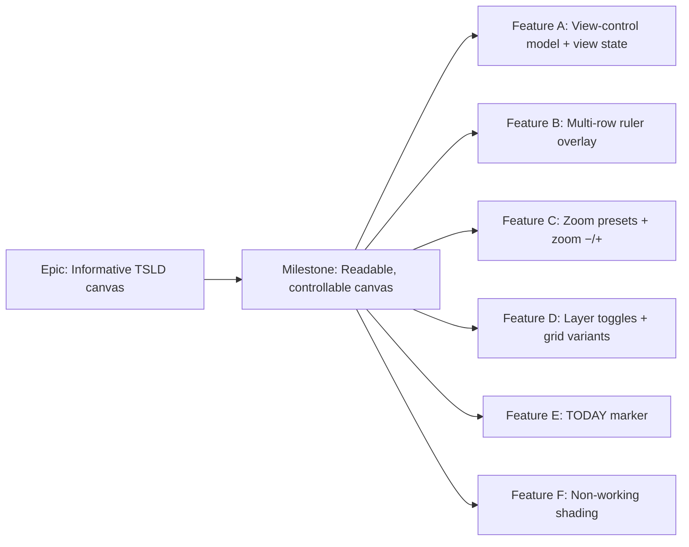

# Implementation Plan: Informative TSLD canvas (readability + view-control upgrade)

- **Feature spec:** [`docs/specs/tsld-informative-canvas.md`](../specs/tsld-informative-canvas.md)
- **Status:** Draft — **awaiting approval before implementation**
- **Owner:** _tbd_

## Breakdown

### Epic

**Informative TSLD canvas** — bring the previous prototype's readability + view
controls (adaptive time-scale ruler, zoom presets, layer toggles, today marker,
non-working shading) to the current Canvas 2D TSLD, entirely client-side, within
ADR-0026. Maps to the roadmap's TSLD canvas readability theme.

### Milestone: Readable, controllable canvas (shippable slice)

**Outcome:** a planner can read the time scale at any zoom, jump to Day…Year presets
(or zoom −/+) by mouse or keyboard, locate today, see non-working days shaded, and
declutter layers — with the view shareable/reload-stable via the URL. Delivered as
thin vertical slices behind a `VITE_TSLD_VIEW_CONTROLS` flag (default on once green)
so `main` stays releasable throughout.

---

#### Feature A: View-control model & view state

> **Description:** the pure math (ruler ticks, zoom-preset reframing, working-day
> predicate) in `render-model.ts`, plus the URL view-state schema on the plan route.
> Foundation for B–F; ships no visible change on its own.
> **Complexity:** M
> **Dependencies:** none (all inputs present).
> **Risks:** ruler tick generation could be O(plan) instead of O(visible) → keep it
> strictly viewport-bounded, asserted by a unit test on a multi-year span. Granularity
> thresholds could overlap labels → derive from `pxPerDay` and unit-test the boundaries.
> **Testing requirements:** unit tests for `rulerTicks`, `zoomToPreset`/`stepZoom`/
> `presetOf`, and `isWorkingDay` (mask + exceptions); a Zod parse test for view state
> defaults/garbage.

##### Task A1 — Ruler-tick + zoom-preset math (pure)

- **Description:** add `rulerTicks(view, size)`, `zoomToPreset(view, size, pxPerDay)`,
  `stepZoom(view, size, factor)`, `presetOf(pxPerDay)` to `render-model.ts`.
- **Complexity:** M
- **Dependencies:** —
- **Risks:** off-by-one at month/year boundaries (UTC calendar math) → reuse
  `daysBetween`/`addCalendarDays`; cover boundary dates in tests.
- **Testing:** unit tests over each zoom stop, viewport-bounded generation, centre-
  anchored reframing, and active-preset derivation.
- **Development steps:**
  1. Implement the tick model (year/month/day bands over the visible day span + margin).
  2. Implement preset/step zoom reusing `zoomAt`/`clampPxPerDay`, anchored on centre.
  3. Add exhaustive unit tests; update the module doc-comment.

##### Task A2 — Working-day predicate (pure)

- **Description:** `isWorkingDay(dayOffset, dataDate, calendar)` from the
  `workingWeekdays` mask (Phase 1) with an exceptions map slot (Phase 2 fills it).
- **Complexity:** S
- **Dependencies:** —
- **Risks:** weekday index vs mask bit order mismatch → use `WorkingWeekdays.has` and
  test Mon–Sun mapping against `plannedStart`'s weekday.
- **Testing:** unit — Standard Mon–Fri mask shades Sat/Sun; all-days mask shades none;
  exception override wins over the mask.

##### Task A3 — URL view-state schema on the plan route

- **Description:** Zod schema for `{ zoom: ZoomLevel, dayGrid, monthGrid, yearGrid,
today, nonWorking }` as TanStack Router search params (defaults on), with defensive
  fallback; helpers to read/update it.
- **Complexity:** S
- **Dependencies:** A1 (`ZoomLevel`).
- **Risks:** search-param churn causing re-renders → memoise; keep the live viewport
  in the canvas ref (not URL). Garbled URL → fall back to defaults (tested).
- **Testing:** unit parse tests (defaults, partial, invalid); route-level render test.
- **Development steps:**
  1. Define the search schema + defaults on `plan-detail` route.
  2. Add typed read/update helpers.
  3. Tests for parse/fallback.

#### Feature B: Multi-row ruler overlay

> **Description:** a DOM overlay inside `TsldCanvas` rendering the year/month/day
> bands from `rulerTicks`, synced to the viewport via the rAF loop.
> **Complexity:** M
> **Dependencies:** Feature A (A1), and the viewport/command seam (Task B1).
> **Risks:** ruler desyncing from bars on fast pan/zoom → drive it from the same rAF
> loop that repaints the canvas, off the same `viewRef`, never from lagged setState.
> **Testing requirements:** component test (renders correct bands for a viewport;
> re-tiles on transform change); axe (overlay is `aria-hidden`, adds no interaction);
> visual sync verified in the Playwright journey.

##### Task B1 — Viewport/command seam in `TsldCanvas`

- **Description:** expose a minimal imperative seam (callback props or ref handle) so
  the toolbar can command zoom presets/steps, and surface the measured size + live
  view to the internal ruler — **without** moving the viewport out of its ref (ADR-0026
  D3). **This is the ui-architect touch-point.**
- **Complexity:** M
- **Dependencies:** A1.
- **Risks:** re-introducing per-frame setState → design reviewed by ui-architect;
  keep commands imperative and one-shot.
- **Testing:** unit/component — a preset command mutates the viewport ref and marks
  dirty; no render storm.
- **Development steps:**
  1. Draft the seam; **run ui-architect** on it; record the decision in `DECISIONS.md`.
  2. Implement command handlers + internal ruler data source.
  3. Component tests.

##### Task B2 — Ruler DOM overlay component

- **Description:** render stacked year/month/day rows as an `aria-hidden` top band,
  positioned from `rulerTicks`, updated each frame; adapts rows to zoom.
- **Complexity:** M
- **Dependencies:** B1, A1.
- **Risks:** label overlap at boundaries → drop the finest row past the granularity
  threshold (from A1); test at each stop.
- **Testing:** component (bands + adaptation), axe, theme-token colours.

#### Feature C: Zoom presets + zoom −/+

> **Description:** toolbar segmented control (Day/Week/Month/Quarter/Year) + zoom −/+
> buttons, wired through the B1 seam and URL state; **Fit to plan** unchanged.
> **Complexity:** S
> **Dependencies:** Feature A (A1, A3), Task B1.
> **Risks:** active-preset flicker between stops on wheel zoom → derive pressed state
> from `presetOf(pxPerDay)` with a tolerance; disable −/+ at bounds.
> **Testing requirements:** component + axe (keyboard-operable, `aria-pressed`); unit
> for preset→`pxPerDay` and bound-disabling; Playwright: click Month → reframed.

##### Task C1 — Zoom controls in `TsldToolbar` + wiring

- **Description:** add the preset segmented control + zoom −/+; write the choice to URL
  state; command the canvas via B1; reflect the active preset.
- **Complexity:** S
- **Dependencies:** A1, A3, B1.
- **Risks:** mobile crowding → wrap the toolbar; presets collapse to a compact group.
- **Testing:** component/axe + unit; extend the Playwright journey.
- **Development steps:**
  1. Add controls + `aria-pressed`/disabled logic.
  2. Wire to URL state + canvas command.
  3. Tests + docs (toolbar doc-comment).

#### Feature D: Layer toggles & grid variants

> **Description:** the five labelled checkboxes (Day/Month/Year grid, Today,
> Non-working) gating paint layers; generalise the existing weekly gridline into
> day/month/year grid variants.
> **Complexity:** M
> **Dependencies:** Feature A (A3), the painter.
> **Risks:** grid variants adding draw cost → each is a culled, batched single stroke
> pass; verify the budget. Colour-only meaning → paired with the legend (non-colour).
> **Testing requirements:** paint-layer unit (each layer gated on/off); component/axe
> (checkboxes labelled/operable, state announced); perf-harness budget assertion.

##### Task D1 — Grid variants + toggle gating in the painter

- **Description:** replace the single weekly Layer 1 with gated day/month/year grid
  passes; add a `TsldViewToggles` flag object to the scene; extend the palette.
- **Complexity:** M
- **Dependencies:** —
- **Risks:** z-order regressions → keep grids below bars, above the non-working wash;
  snapshot the layer order in tests.
- **Testing:** unit over the painter with each toggle; budget check.

##### Task D2 — Toggle checkboxes in the toolbar + legend

- **Description:** the checkbox group wired to URL state and passed to the canvas;
  extend `TsldPanel` legend with Today + Non-working entries.
- **Complexity:** S
- **Dependencies:** A3, D1.
- **Risks:** none material.
- **Testing:** component/axe; legend snapshot.

#### Feature E: TODAY marker

> **Description:** a gated dashed vertical + "TODAY" label at the local-today day
> offset about `plannedStart`.
> **Complexity:** S
> **Dependencies:** Feature A (A1), D1 (toggle plumbing), the painter.
> **Risks:** timezone drift → floor the local date to `YYYY-MM-DD` and map via
> `daysBetween` (no wall-clock math on canvas); test the mapping.
> **Testing requirements:** unit (marker position for a known today/dataDate; hidden
> when toggle off / off-screen); component + axe (no a11y-tree change).

##### Task E1 — Today paint layer

- **Description:** add the gated today line + label layer (above bars, below
  selection); palette `today` from `--color-destructive`.
- **Complexity:** S
- **Dependencies:** A1, D1.
- **Risks:** label overlap with the ruler → place the label just under the ruler band.
- **Testing:** unit + component; extend the Playwright journey (today visible/toggle).

#### Feature F: Non-working shading

> **Description:** shade non-worked columns — Phase 1 from the weekly mask (zero extra
> fetch), Phase 2 adds dated exceptions via the existing `useCalendar` detail.
> **Complexity:** M (F1 S, F2 S)
> **Dependencies:** Feature A (A2), D1 (toggle plumbing), the painter.
> **Risks:** shading cost on long plans → cull to visible columns, one batched fill;
> plan without a calendar → shade nothing / disable toggle. Exceptions fetch failure →
> degrade to mask-only (tested).
> **Testing requirements:** unit (predicate → shaded columns, Standard vs all-days,
> exception override); component (toggle + no-calendar path); perf budget assertion.

##### Task F1 — Non-working wash (weekly mask)

- **Description:** resolve the plan's calendar mask from the already-loaded
  `useCalendars` list (via `plan.calendarId`); paint a gated muted wash beneath the
  gridlines over visible non-working columns; palette `nonWorking` from `--color-muted`.
- **Complexity:** S
- **Dependencies:** A2, D1.
- **Risks:** null calendar → toggle shades nothing / disabled with title.
- **Testing:** unit + component/axe; budget check.
- **Development steps:**
  1. Resolve mask on the route; pass the predicate to the canvas.
  2. Add the gated wash layer (culled, batched, correct z-order).
  3. Tests; extend the Playwright journey.

##### Task F2 — Dated exceptions (holidays) — follow-up

- **Description:** fetch the plan calendar's `CalendarDetail` via the existing
  `useCalendar` hook; fold `exceptions` into the predicate (Phase 2); degrade to
  mask-only on fetch error.
- **Complexity:** S
- **Dependencies:** F1.
- **Risks:** extra query → it's cached + read-only, and only when Non-working is on;
  fetch error degrades gracefully.
- **Testing:** unit (exception override) + component (degrade path).
- **Development steps:**
  1. Wire the detail fetch (only when a calendar + the toggle are present).
  2. Merge exceptions into the predicate.
  3. Tests; update the spec's phase note; changeset.

## Sequencing & slices

Behind a `VITE_TSLD_VIEW_CONTROLS` flag (default on once green), delivered in order —
each keeps `main` releasable and is independently valuable:

1. **A1/A2/A3** — pure model + URL state (no visible change; fully unit-tested).
2. **B1 → B2** — the ruler (the biggest single readability win) after the
   ui-architect-reviewed seam.
3. **C1** — zoom presets + −/+ (mouse **and** keyboard zoom parity).
4. **D1 → D2** — grid variants + toggles (declutter).
5. **E1** — today marker.
6. **F1** — non-working shading (weekly mask).
7. **F2** — holiday exceptions (optional follow-up; can ship next release).

Explicitly **out of scope / next** (not pulled in): the left Gantt/activity tree,
the Network view, undo/redo, the toolbar **filter box** and the **minimap** shown in
the prototype, per-activity calendars, and any export/print of the timeline. Each is
a separate slice; none is a prerequisite for the readability upgrade.

## Definition of Done (per task)

Each task's PR must satisfy the Feature Completion Criteria in
[`docs/PROCESS.md`](../PROCESS.md) (code, tests ≥ 80% on changed code, docs, security,
performance — the ≤4 ms p95 budget holds — accessibility WCAG 2.2 AA, Docker build, CI
green, changeset, version impact). Recommended reviewers during build:
**ui-architect** (Task B1 seam — before build), **component-reviewer** (toolbar
controls, token/variant use, no one-offs), **accessibility-reviewer** (toggles/presets
keyboard + SR; canvas stays `aria-hidden`), **performance-reviewer** (draw budget /
bundle), and **test-engineer** (unit + Playwright coverage). No backend reviewers are
needed — there is no backend change.

## Risks & assumptions (rollup)

| Risk / assumption                                            | Likelihood | Impact | Mitigation                                                                 |
| ------------------------------------------------------------ | ---------- | ------ | -------------------------------------------------------------------------- |
| New layers breach the ≤4 ms p95 draw budget                  | med        | med    | cull to visible columns; batched single passes; assert in the perf harness |
| Ruler desyncs from bars on fast pan/zoom                     | med        | med    | drive ruler from the same rAF loop + `viewRef`; never lagged setState      |
| Viewport-out-of-ref refactor (B1) regresses editing gestures | med        | high   | ui-architect review + DECISIONS entry; keep viewport ref-authoritative     |
| Non-working shading needs a backend addition                 | low        | med    | **de-risked** — mask + exceptions already exposed; client-only both phases |
| URL search churn causes re-render jank                       | low        | low    | memoise; keep only discrete state in URL, live transform in the ref        |
| Timezone/DST drift on "today"                                | low        | med    | UTC calendar-day math (`daysBetween`); local date floored to `YYYY-MM-DD`  |
