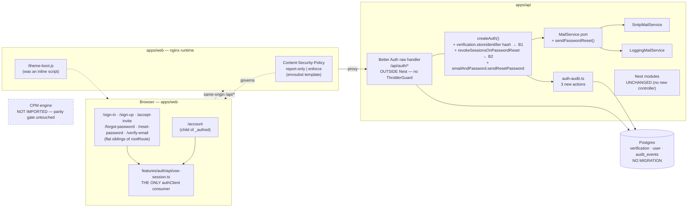
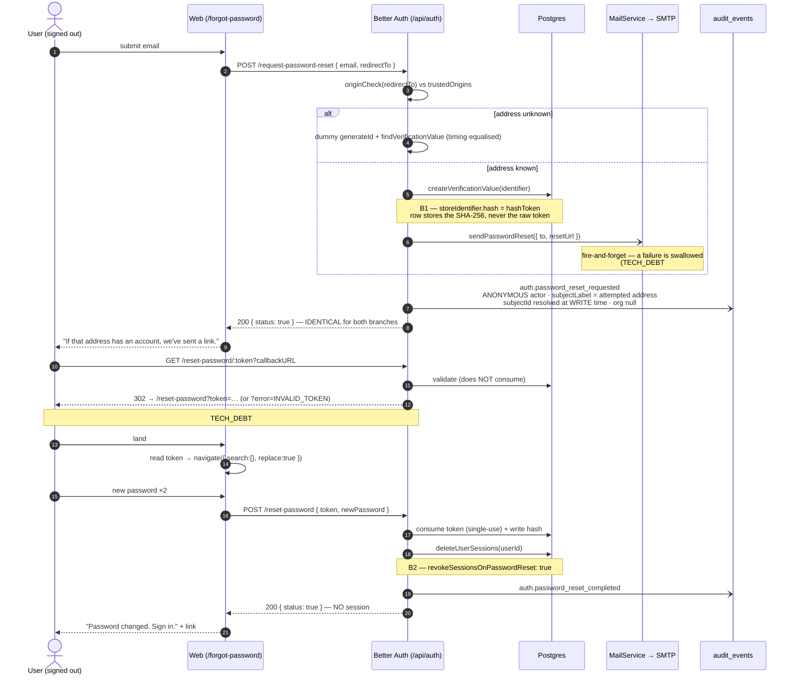
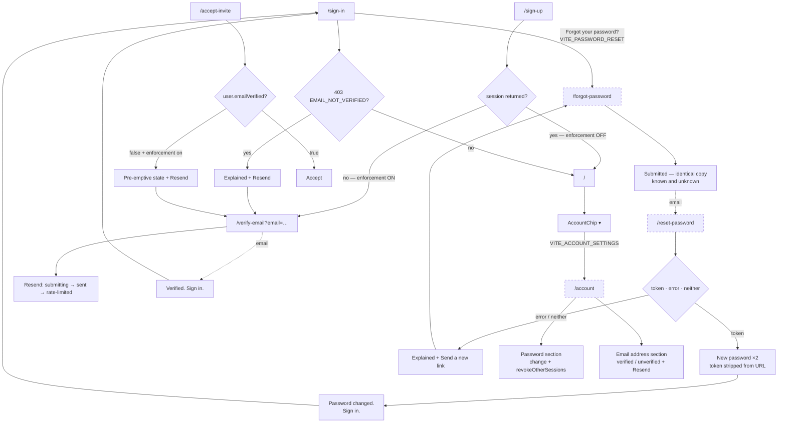

# Feature Spec: Account security — recovery, verification enforcement, and a Content-Security-Policy

- **Status:** Draft — awaiting product-owner approval
- **Author(s):** feature-analyst (Product Owner / Solution Architect / Technical Lead hats)
- **Date:** 2026-08-04
- **Tracking issue / epic:** _(to be raised on approval)_
- **Roadmap link:** security hardening / `docs/TECH_DEBT.md` #8, #16, #88
- **Related ADR(s):** **ADR-0074** (to be written with M0 — see §4.7). Builds on
  ADR-0003 (Better Auth), ADR-0012/0016 (RBAC + tenancy), ADR-0051 (token hashing
  precedent), ADR-0060 (the `VITE_` build-time-constant rule), ADR-0072/0073 (audit).

> **Register honesty check (ADR-0071's lesson, CLAUDE.md §16).** `docs/adr/` holds
> `0001`–`0073` with no gaps and no unfiled decisions found while choosing a number.
> ADR-0071's absence — the thing that lesson is about — has been fixed;
> `docs/adr/0071-per-assignment-lag.md` exists. **0074 is genuinely free.**

---

## 0. Corrections to the advisory inputs

Two advisory reports informed this spec (security-reviewer, ui-architect). Per ADR-0058
(_verify the claim; do not trust the document_) the load-bearing claims were spot-checked.
Both reports hold up well. Three corrections, stated plainly because that is the point of
the rule:

### 0.1 The invitation-accept refusal is **not** a dead end today — it is a third latent one

The ui-architect report's §3 heading says the refusal is "**already a dead end today —
BLOCKING**". The task brief repeats it. **It is not reachable today.** The throw is guarded:

```ts
// apps/api/src/modules/invitations/invitations.service.ts:218-220
if (this.config.requireEmailVerification && !user.emailVerified) {
  throw new ForbiddenError('Verify your email address before accepting this invitation.');
}
```

`requireEmailVerification` is `AUTH_REQUIRE_EMAIL_VERIFICATION`, which is `false` on the
running deployment (`docs/TECH_DEBT.md` #16). So this is a **latent** dead end that arms
with the flag, exactly like the sign-up bounce and the sign-in 403 — not a live defect
users are hitting. The same report's own blocking-list item 5 says this correctly
("unreachable at enforcement-off"), so the report contradicts itself; the body is right and
the heading is wrong.

**Why this matters and why it does not change the plan.** It changes the _urgency framing_
— nobody is stuck right now, so this is not a hotfix — but not the _ordering_: all three
must land before the flip, and the flip is what makes all three reachable at once. What it
does change is the honesty of the claim we make to the product owner. Saying "already
broken" when it is not is how a register stops being trusted.

### 0.2 `MailService`'s own docblock is stale

`apps/api/src/common/mail/mail.service.ts:6` says "v1 ships a logging stub". A real SMTP
adapter exists (`common/mail/smtp-mail.service.ts`) and is selected whenever `MAIL_SMTP_URL`
is set — CLAUDE.md §17 was corrected on 2026-08-04 and this docblock was not. The port gains
a third method in M0; fix the sentence in the same commit.

### 0.3 The route census claim, restated precisely

The security report says the census "cannot see these routes and will not fail". Verified —
`apps/api/src/modules/audit/audit-coverage.structural.spec.ts:45-47` states it in its own
docblock. Note the census's actual shape, which CLAUDE.md §16 (ADR-0072) records and the
ADR-0073 implementation plan gets wrong: its assertions force a route **to be** audited and
force every route to be **classified**; nothing forbids auditing one. Either way, for Better
Auth routes **there is no gate in either direction**, because there is no Nest controller
metadata to reflect over. "Add the audit later" therefore has nothing behind it. See §2.6.

Everything else in both reports was checked where load-bearing and found accurate,
including both `[RE-VERIFIED]` blocking findings (§1.1), the absent CSP header
(`apps/web/nginx.conf:33-35`), the single inline script (`apps/web/index.html:8-23`),
`useSignUp` inspecting only `error` (`use-session.ts:76-81`), and the route shape
(`apps/web/src/app/router.tsx` — three flat public routes, code-based `createRoute`, not
file-based).

---

## 1. Business understanding

### Problem

**SchedulePoint has no account recovery.** A user who forgets their password cannot get back
in — not "the screen is missing", but the server refuses: `createAuth()` configures
`emailAndPassword` with no `sendResetPassword`, so Better Auth throws
`RESET_PASSWORD_DISABLED` on `POST /request-password-reset`
(`better-auth/dist/api/routes/password.mjs:53-59`). A signed-in user cannot change their
password either. There is no account screen to host any of it: `/me` is `@Get()` only
(`apps/api/src/modules/me/me.controller.ts:28`) and the router has no `/account`.

Today the only recovery is an operator with database access. That is not a product.

**Three related things compound it:**

1. **`TECH_DEBT` #16 — email verification is built but not switched on.** The debt row says
   "No code change is needed." **That is true for the API and false for the web.** Three
   dead ends arm themselves the day an operator sets `AUTH_REQUIRE_EMAIL_VERIFICATION=true`:
   sign-up silently returns no session and bounces to `/sign-in` with no message; sign-in
   returns a bare 403 with no resend affordance; and invitation acceptance refuses with a
   sentence instructing the user to do something the product provides no way to do (§0.1).
   Turning on the switch that closes a real authorisation gap therefore breaks registration.

2. **Two blocking gaps in _this app's_ auth wiring** (§1.1) that become exploitable the
   moment reset exists at all.

3. **`TECH_DEBT` #8 — the web origin serves no Content-Security-Policy.** The app renders
   user-authored text everywhere (activity names, notes, plan titles, imported XER/MSPDI
   fields) and an injected-script bug would have no second line of defence. #8 calls this
   "the highest-value unclaimed security control in the repo".

### 1.1 The two blocking findings — these outrank every screen in this spec

Both are one configuration key in `apps/api/src/common/auth/better-auth.ts`, both are gaps
in **this app's wiring** rather than in Better Auth, and both were independently re-verified
against the installed `better-auth@1.6.25` and by reading the whole `betterAuth({…})` call.

| #      | Finding                                                                                                                                                                                                                                                                                                                         | Evidence                                                                                                                                | Fix                                                                                                                                                     |
| ------ | ------------------------------------------------------------------------------------------------------------------------------------------------------------------------------------------------------------------------------------------------------------------------------------------------------------------------------- | --------------------------------------------------------------------------------------------------------------------------------------- | ------------------------------------------------------------------------------------------------------------------------------------------------------- |
| **B1** | **Reset tokens would be stored in cleartext.** `betterAuth({…})` sets no `verification` key, so `getStorageOption` returns `undefined` and `processIdentifier` returns the identifier **unchanged**. The `verification` row's `identifier` column would hold the literal `reset-password:<token>` for the full one-hour window. | `better-auth.ts:118-237` (no `verification` key — confirmed by reading the entire call); `dist/db/verification-token-storage.mjs:11-16` | `verification: { storeIdentifier: { hash: hashToken } }`, reusing **this app's own** `common/tokens/token.ts` hasher so there is one hashing convention |
| **B2** | **A completed reset would leave every session alive.** `resetPassword` calls `deleteUserSessions` only when `emailAndPassword.revokeSessionsOnPasswordReset` is truthy. It is unset.                                                                                                                                            | `password.mjs:173`; `better-auth.ts:125-134`                                                                                            | `revokeSessionsOnPasswordReset: true`                                                                                                                   |

**Why these outrank the UI.** B1 fails the bar this repository set for its own tokens —
ADR-0051 and `common/tokens/token.ts:15-22`: mint 256-bit, return raw once, store **only**
the SHA-256 hash, so a database leak never yields a usable credential. Anyone with read
access to `verification` — a backup, a replica, a reporting connection, a future injection
elsewhere — would hold a live account-takeover credential for every outstanding reset. B2
means that "I forgot my password" — which is sometimes _caused by_ a compromise — does not
evict the compromise.

Both compound with `TECH_DEBT` #88 (§3.5): `GET /reset-password/:token` validates and
**302-redirects with the raw token as a query parameter on the `Location` header**
(`password.mjs:127-163`), and the GET does **not** consume it. A proxy that logs `Location`,
or a mail scanner that follows the redirect, captures a live token for the full hour — so an
attacker needs no database access at all.

### Users

All roles, because this is the account layer beneath the organisation model — a Viewer
forgets a password exactly as often as an Org Admin.

| Role (ADR-0016)                                                       | What they need here                                                                                                          |
| --------------------------------------------------------------------- | ---------------------------------------------------------------------------------------------------------------------------- |
| **Any signed-out user**                                               | Request a reset; set a new password from an emailed link; understand a refusal without being told whether the address exists |
| **Any signed-in member** (Org Admin / Planner / Contributor / Viewer) | Change their own password; see whether their address is verified; resend the verification email                              |
| **Invitee** (has an account, not yet a member)                        | Accept an invitation, or be told plainly why they cannot and how to fix it                                                   |
| **Org Admin**                                                         | Turn on verification enforcement without stranding their organisation                                                        |
| **Operator** (the product owner, CLAUDE.md §17)                       | Flip `AUTH_REQUIRE_EMAIL_VERIFICATION` knowing what it will and will not break; observe CSP violations before enforcing      |
| **External Guest** (ADR-0051)                                         | **Nothing.** Guests hold no account. The `/share` surface is out of scope and untouched.                                     |

### Primary use cases

1. Recover access to an account whose password is forgotten.
2. Change a password from inside the app, evicting other sessions.
3. See verification status and get a fresh verification email, **without a session**.
4. Understand, on-screen, why sign-up / sign-in / invitation-accept refused when
   verification is enforced — and act on it.
5. Enforce email verification without stranding existing accounts.
6. Serve a Content-Security-Policy on the web origin, observed before enforced.

### User journeys

**Happy path — reset.** Sign-in → "Forgot your password?" → `/forgot-password` → submit
address → identical "if that address has an account, we've sent a link" for known and
unknown → email → click → auth handler validates + 302s to `/reset-password?token=…` → app
strips the token from the URL → new password twice → success → **"Password changed. Sign
in."** with a link (reset creates **no** session — `password.mjs:174` returns
`{status:true}`) → sign in → every other session is already dead (B2).

**Happy path — change password.** Signed in → account menu → `/account` → Password section →
current + new + confirm → saved, other devices signed out, said so on screen.

**Enforcement-on alternate.** Sign up → no session is returned → route to
`/verify-email?email=…` ("Check your email") → email → verify → "Verified. Sign in." →
sign in.

**Enforcement-on refusals.** Sign-in 403 `EMAIL_NOT_VERIFIED` → a first-class state with a
**Resend verification email** button, not a red string. Invitation accept → the card shows
the unverified state **pre-emptively** from `user.emailVerified` (which it already holds)
with a Resend button, keeping the server's 403 as the authoritative second word.

### Expected outcomes

- Nobody needs an operator to get back into their account.
- `AUTH_REQUIRE_EMAIL_VERIFICATION=true` becomes a decision the product owner can take,
  which closes the ADR-0016 §5 gap: invitation acceptance stops granting membership on an
  **unverified** email match.
- Reset tokens meet the bar ADR-0051 set; a reset evicts a hijacked session.
- The web origin gains its first document security policy.

### Success criteria

| #   | Criterion                                                                                                                             | How it is measured                                                                |
| --- | ------------------------------------------------------------------------------------------------------------------------------------- | --------------------------------------------------------------------------------- |
| S1  | A signed-out user with a working mailbox regains access unaided                                                                       | Flag-on Playwright journey against a real API + a captured mail transport         |
| S2  | The `verification` table never holds a usable reset token                                                                             | API e2e: request a reset, assert **no row's `identifier` contains the raw token** |
| S3  | A completed reset kills other sessions                                                                                                | API e2e: two sessions, reset via one, assert the other 401s                       |
| S4  | No screen distinguishes a known address from an unknown one                                                                           | Unit + e2e: identical rendered output and identical status for both               |
| S5  | With `AUTH_REQUIRE_EMAIL_VERIFICATION=true`, sign-up, sign-in and invite-accept each reach a screen that explains and offers a resend | Playwright journey run with the env var **both on and off** (§3.7)                |
| S6  | Zero unexpected CSP violations across every route, including the new ones                                                             | Report-only window reviewed by the operator before enforce                        |
| S7  | Every password-credential change is a row in `audit_events`                                                                           | `auth-audit.spec.ts` + API e2e (no census gate exists — §2.6)                     |

### Open questions

Three critical (§6). Everything else has a stated default and proceeds.

---

## 2. Functional requirements

### 2.1 User stories & acceptance criteria

> **US-1** — As a **signed-out user**, I want to request a password-reset link, so that I can
> regain access without contacting an administrator.
>
> - **Given** any syntactically valid address **when** I submit `/forgot-password` **then**
>   I see one confirmation whose text, layout and announced content are **identical**
>   whether or not the address has an account, and the response status is identical.
> - **Given** an address that has an account **then** a reset email is sent containing a
>   single-use link valid for one hour.
> - **Given** I submit more than 3 requests in 60 s in production **then** I get a
>   rate-limited state that does **not** reveal whether the address exists.
> - **Given** the server has no `sendResetPassword` configured (`RESET_PASSWORD_DISABLED`, 400) **then** I see "Password reset isn't available — contact your administrator",
>   which must **not** read as "no such account".
> - **Given** the network fails **then** my input is preserved and I can retry.

> **US-2** — As a **signed-out user with a reset link**, I want to set a new password, so that
> I can sign in again.
>
> - **Given** I follow the emailed link **then** the auth handler validates the token and
>   redirects to `/reset-password?token=…`, and the app **removes the token from the URL
>   immediately** (`navigate({ search: {}, replace: true })`) so it is never in history or a
>   later referrer.
> - **Given** `?error=INVALID_TOKEN`, **or** neither `token` nor `error` **then** I get an
>   explanation and a "Send a new link" action — never a crash and never an empty form.
>   (`validateSearch` accepts both keys permissively; house rule, `router.tsx:169-170`.)
> - **Given** a new password < 12 or > 128 characters, or a mismatched confirmation **then**
>   I get an inline field error before submit.
> - **Given** the token was consumed between the landing redirect and my submit **then** the
>   server's `INVALID_TOKEN` is shown as "This link has already been used".
> - **Given** success **then** I see "Password changed. Sign in." with a link — **not** a
>   navigation into the app, because reset issues no session — **and** my other sessions
>   have been revoked (B2).

> **US-3** — As a **signed-in member**, I want to change my password, so that I can rotate a
> credential I think is exposed.
>
> - **Given** a wrong current password **then** the 401 is attached **to the current-password
>   field**, not shown as a form banner.
> - **Given** a valid change **then** it succeeds, `revokeOtherSessions: true` is sent, my
>   current session survives, and the screen said "You'll be signed out on other devices"
>   **before** I submitted.
> - **Given** success **then** a `role="status"` confirmation announces and the form resets.

> **US-4** — As a **signed-in member**, I want to see whether my email address is verified and
> resend the link, so that I can accept invitations and keep working after enforcement.
>
> - **Given** `emailVerified` is false **then** `/account` shows an Email address row with an
>   unverified state and a **Resend** button.
> - **Given** I resend **then** I see submitting → sent → (rate-limited, 3/60 s in
>   production) states, each announced.

> **US-5** — As a **signed-out user affected by enforcement**, I want the refusal to explain
> itself and offer a resend, so that I am not stranded.
>
> - **Given** enforcement is on **when** I sign up **then** the response carries no session
>   and I am routed to `/verify-email?email=…` showing "Check your email", **not** bounced to
>   `/sign-in`.
> - **Given** enforcement is on and the address is **already registered** **then** I see the
>   **same** "account created — check your email" copy, because Better Auth deliberately
>   returns a generic duplicate response in this mode (`sign-up.mjs:163` + `sign-up.mjs:203-241`). Adding an
>   "email already in use" message would reintroduce the enumeration oracle the library just
>   closed. **This is a requirement, not an omission.**
> - **Given** enforcement is on **when** I sign in with an unverified address **then** the
>   403 `EMAIL_NOT_VERIFIED` renders as a distinct state with a **Resend verification email**
>   button — client-initiated, so it has visible pending/sent/rate-limited states.
> - **Given** enforcement is on **when** I open an invitation while unverified **then** the
>   card shows a pre-emptive unverified state with Resend, **before** the Accept button
>   renders; the server's 403 remains the authoritative second word.

> **US-6** — As an **operator**, I want the web origin to serve a CSP, observed before
> enforced, so that an injected-script bug has a second line of defence.
>
> - **Given** report-only mode **then** violations appear in the browser console and nothing
>   breaks.
> - **Given** enforce mode **then** every route — including the four new ones and the
>   canvas/PDF/print export paths — works with no violation.
> - **Given** a rollback is needed **then** the mode reverts **without a new image** (§4.5).

> **US-7** — As an **operator**, I want to enforce verification without stranding existing
> accounts, so that turning on a security control is not an outage.
>
> - **Given** the flip is proposed **then** the **real** count of `emailVerified = false`
>   accounts on the **deployed** database has been taken — not estimated (§6, CQ-1).
> - **Given** the flip happens **then** the resend entry point is already live and reachable
>   **without a session**.

> **US-8** — As an **Org Admin or auditor**, I want credential changes in the audit log, so
> that "who changed the password on this account, and when" is answerable from evidence.
>
> - **Given** a password change, a completed reset, or a reset request **then** an
>   `audit_events` row exists with the right action and actor.
> - **Given** any of those **then** the payload contains **no token and no hash** (the
>   redactor's `NEVER_RECORD` ban, `audit-redactor.ts:162-175`).
> - **Given** `auth.password_reset_requested` for an address that resolves to a user **then**
>   it is readable **only by that user** via the ADR-0073 C2 `?include=attempts` projection —
>   never on an organisation feed (§2.6).

### 2.2 Workflows

**W1 — Request reset.** `/forgot-password` (prefilled from `?email=` if present) → validate
address client-side → `authClient.requestPasswordReset({ email, redirectTo: '/reset-password' })`
→ **always** render the same submitted state. **Never** pre-check the address against a
members lookup, and never branch the rendering: Better Auth already equalises timing with a
dummy `generateId`/`findVerificationValue` on the unknown branch (`password.mjs:67-79`), and
the only way to lose that is for us to undo it above.

**W2 — Consume reset.** Email link → `{authBaseURL}/reset-password/{token}?callbackURL=…`
→ handler validates → **302 to the app** with `?token=…` or `?error=INVALID_TOKEN` → route
reads the search param → **strips it (`replace: true`)** → holds it in component state →
form → `authClient.resetPassword({ newPassword, token })` → success screen with a sign-in
link.

**W3 — Change password.** `/account` → Password section → `authClient.changePassword({
currentPassword, newPassword, revokeOtherSessions: true })` → success `role="status"` +
reset.

**W4 — Resend verification (session-less).** `/verify-email?email=…` or the sign-in 403
branch or the invitation card → `authClient.sendVerificationEmail({ email, callbackURL })` →
submitting → sent. This endpoint enforces a hard **500 ms floor**
(`email-verification.mjs:108-127`) specifically to hide the difference between a fast local
JWT sign and a slow SMTP call — so a spinner is expected, and shortening it is not a
performance improvement.

**W5 — Enforce verification (operator).** Count unverified accounts on the deployed database
→ decide the existing-user question (CQ-1) → execute the chosen backfill → confirm the web
bundle carrying the three unflagged fixes is live → set the env var → verify sign-up →
`/verify-email` → verify → sign-in end to end.

**W6 — CSP.** Move the theme-boot script to a static file → ship
`Content-Security-Policy-Report-Only` → operator observes across **every** route including
the new ones → flip the mode variable → redeploy.

### 2.3 Edge cases

| Case                                                        | Expected behaviour                                                                                                                                                                                                                                       |
| ----------------------------------------------------------- | -------------------------------------------------------------------------------------------------------------------------------------------------------------------------------------------------------------------------------------------------------- |
| Reset requested for an unknown address                      | Identical response, identical screen, identical status. No timing signal (library-provided).                                                                                                                                                             |
| Reset requested for an **unverified** address               | Same. Reset is a recovery path, not a verification path; branching would leak.                                                                                                                                                                           |
| Two reset links requested; first used                       | Second is `INVALID_TOKEN` → "This link has already been used." (Better Auth consumes single-use: `internal-adapter.mjs:773-783`.)                                                                                                                        |
| Token expired (1 h default)                                 | Same explained state + "Send a new link".                                                                                                                                                                                                                |
| Reset link **prefetched by a mail scanner**                 | The GET only redirects; it does **not** consume. The user's own click still works. But the scanner's proxy may have logged the `Location` header carrying the token — this is `TECH_DEBT` #88 extended (§3.5).                                           |
| `redirectTo` origin not in `CORS_ORIGINS`                   | `originCheck` (`password.mjs:50`) rejects **every** reset and nothing on screen explains it. A **deployment precondition**, verified in M0, not code (`auth.module.ts:34`).                                                                              |
| SMTP relay broken                                           | Every request still returns `{status:true}` and no email arrives. Inherited from `TECH_DEBT` #94 — the same invisible-failure mode as verification. Do **not** invent a stricter contract for this one message (§3.6).                                   |
| Already signed in, visits `/forgot-password`                | Point at `/account`; do not bounce silently.                                                                                                                                                                                                             |
| Signed-in user changes password on device A                 | Device B's session dies at its next request; the client's existing 401 → `/sign-in` path handles it.                                                                                                                                                     |
| Sign-up with an **existing** address, enforcement **on**    | Generic success. Required (US-5).                                                                                                                                                                                                                        |
| Sign-up with an existing address, enforcement **off**       | Unchanged from today (the library's normal duplicate error).                                                                                                                                                                                             |
| Unverified user **already signed in** when the flip happens | Keeps working until the session expires — the API session guard never checks `emailVerified`. That window is the **only** time an authenticated verification surface would be true, and it is why `/account` hosts it rather than a shell banner (§4.4). |
| CSP report-only produces violations from a dependency       | Falsify the strict `style-src` in the window; the documented fallback is `'unsafe-inline'` on **`style-src` only**, never `script-src`.                                                                                                                  |
| Rate limit hit in dev/test                                  | Cannot happen: `rateLimit.enabled: options.isProduction` (`better-auth.ts:169-173`). Tests must not assume the limiter.                                                                                                                                  |

### 2.4 Permissions

Nothing in this epic is organisation-scoped, and that is the load-bearing fact: **an account
is the user's, not an organisation's**. There is no new permission and no change to
ADR-0012's RBAC matrix.

| Capability                             | Who                                            | Scope        | Enforcement                                                                                  |
| -------------------------------------- | ---------------------------------------------- | ------------ | -------------------------------------------------------------------------------------------- |
| Request a password reset               | Anyone (unauthenticated)                       | none         | Better Auth, rate-limited 3/60 s (production)                                                |
| Complete a password reset              | Holder of a valid single-use token             | that account | Better Auth token validation                                                                 |
| Change password                        | The signed-in user, on their own account only  | that account | Better Auth session; there is no "change another user's password" endpoint and none is added |
| Resend verification                    | Anyone who knows the address (unauthenticated) | that address | Better Auth, 3/60 s + a 500 ms floor                                                         |
| Read `/account`                        | Any signed-in member                           | own account  | `_authed` guard                                                                              |
| Read own `auth.password_*` events      | The subject only                               | own account  | ADR-0073 C2 `?include=attempts` self-projection (§2.6)                                       |
| Flip `AUTH_REQUIRE_EMAIL_VERIFICATION` | Operator                                       | deployment   | env var — **not a role and not a `VITE_` flag**                                              |

**Explicitly not added:** an Org Admin cannot reset a member's password, cannot mark a member
verified, and cannot read another member's `auth.*` rows. Each would be a new privilege
across a tenancy boundary in a multi-tenant product, and none is required by any story here.
Recorded in §5 rather than smuggled in.

### 2.5 Validation rules

Shared client↔server via `auth-schemas.ts` (extend it — do **not** add a second schema file):

| Field                             | Rule                                                                          | Source of truth                                                                       |
| --------------------------------- | ----------------------------------------------------------------------------- | ------------------------------------------------------------------------------------- |
| `email`                           | `z.email()`                                                                   | `auth-schemas.ts:9` (existing)                                                        |
| `newPassword`                     | ≥ 12, ≤ 128                                                                   | mirrors `minPasswordLength: 12` / `maxPasswordLength: 128` (`better-auth.ts:127-128`) |
| `confirmPassword`                 | must equal `newPassword`                                                      | client-only; the server has no confirm concept                                        |
| `currentPassword`                 | non-empty                                                                     | server is authoritative (401)                                                         |
| `newPassword` ≠ `currentPassword` | client-side guard                                                             | UX only                                                                               |
| `token`                           | opaque string, never logged, never rendered, stripped from the URL after read | §4.6                                                                                  |

No new database field, so no `class-validator` DTO: every write here is a Better Auth route,
not a Nest controller. **That has a consequence worth stating** — no `@Throttle` decorator
can ever reach these routes, because Better Auth is mounted as a raw Node handler outside
Nest (`app-setup.ts:26-32,49-53`) and `ThrottlerGuard` (`app.module.ts:95`) does not see it.
Better Auth's own limiter is the **only** limiter on them. Nobody should try to add one.

### 2.6 Audit coverage — **in scope, decided deliberately**

**Decision: in scope, landing in M0 with the flows.** Reasoning, applying ADR-0073's two
tests rather than an opinion about which endpoints are interesting:

- **Durability test.** A password change is not recoverable from any other state. The `user`
  row's hash changes with no history; `updated_by` does not exist on it and would say nothing
  about _who was refused_.
- **Blast-radius test.** A credential change alters who can access the account — the same
  class as the five `auth.*` events ADR-0072 already records.

Both pass. And unlike every other coverage decision in the codebase, **there is no gate that
would catch the omission** (§0.3). ADR-0072/0073's own stated reason for existing is that
"later" has historically meant never. So it lands now.

**Three new `AuditAction` members**, each needing an `AUDIT_ACTION_CATEGORY` entry
(→ `sign-ins`; note the C4 lesson that the action-filter cap is **derived** from
`AUDIT_ACTIONS` and must not fall behind — three new actions must not silently re-break it):

| Action                          | Actor       | Seam                                                                         | Notes                                          |
| ------------------------------- | ----------- | ---------------------------------------------------------------------------- | ---------------------------------------------- |
| `auth.password_changed`         | the user    | `hooks.after` on `/change-password`                                          | Same shape as the existing five                |
| `auth.password_reset_completed` | the user    | `emailAndPassword.onPasswordReset` (`password.mjs:172`) **or** `hooks.after` | **Verify against a real hook before choosing** |
| `auth.password_reset_requested` | `ANONYMOUS` | its own `hooks.after` branch on `ctx.path`                                   | **Needs real design — see below**              |

**`auth.password_reset_requested` cannot use the existing classification signals.** The
handler returns success uniformly for known and unknown addresses, so `failed` is always
false and `newSession` always null — `classifyAuthEvent` (`auth-audit.ts:105-133`) has
nothing to branch on. It needs the **ADR-0073 C2.2 attribution pattern**: `ANONYMOUS` actor,
the attempted address as `subjectLabel` **with the caller's casing preserved**, and a
best-effort `subjectId` resolved at **write** time via `findUserIdByEmail` — never at read
time, because addresses get reassigned and a read-time join would silently move one person's
history into another's. The normaliser is `toLowerCase()` and **nothing else** (C2.1: trimming
would attribute a probe to an account that input could never have reached).

**And a design point neither advisory report raised: this row is itself an enumeration
oracle if it is readable in the wrong place.** It records an attempted address plus a
resolved user id. It must therefore inherit the failed-sign-in reachability rule exactly:
`organization_id` null, actor null, surfaced **only** through the C2 `?include=attempts`
self-projection, readable **only** by the account it names. It must never appear on an
organisation feed. Getting this wrong would rebuild, inside our own audit log, the oracle
Better Auth deliberately closed in the endpoint.

**Do not extend the census.** It structurally cannot see these routes. Coverage is proven by
`auth-audit.spec.ts` + an API e2e, which is how the existing five are proven.

**`classifyAuthEvent`'s docblock (`auth-audit.ts:10-24`) records the "three seams, not one"
lesson** — `/sign-out` and `/verify-email` each needed a different hook. Do not assume the
two easy cases generalise; verify each of the three new routes against a real `hooks.after`
the way that file did.

### 2.7 Error scenarios

| Scenario                                  | Detection                                            | User-facing result                                                                  | Status                                     |
| ----------------------------------------- | ---------------------------------------------------- | ----------------------------------------------------------------------------------- | ------------------------------------------ |
| Unknown address on reset request          | none (deliberate)                                    | Identical "if that address has an account…"                                         | 200                                        |
| Reset not configured                      | `RESET_PASSWORD_DISABLED`                            | "Password reset isn't available — contact your administrator"                       | 400                                        |
| Invalid / expired / consumed token        | `INVALID_TOKEN`                                      | "This link has expired or has already been used" + Send a new link                  | 400 (or `?error=` on the landing redirect) |
| New password too short / too long         | client first, `PASSWORD_TOO_SHORT`/`TOO_LONG` second | Inline field error                                                                  | 400                                        |
| Wrong current password                    | Better Auth 401                                      | Inline error **on the current-password field**                                      | 401                                        |
| Rate limited                              | 429                                                  | "Too many attempts. Try again in a minute." — identical for known/unknown           | 429                                        |
| `redirectTo` fails `originCheck`          | Better Auth origin error                             | Generic failure + operator log; **prevented** by the M0 `CORS_ORIGINS` precondition | 403                                        |
| Sign-in, unverified, enforcement on       | `EMAIL_NOT_VERIFIED` 403                             | First-class state + Resend                                                          | 403                                        |
| Invite accept, unverified, enforcement on | pre-emptive `emailVerified` check; 403 as backstop   | Explained state + Resend                                                            | 403                                        |
| Mail send fails                           | **nothing**                                          | Success shown regardless                                                            | 200 — inherited from `TECH_DEBT` #94, §3.6 |
| CSP violation in enforce mode             | browser console                                      | A broken sub-feature                                                                | — (why report-only comes first)            |

---

## 3. Technical analysis

| Area           | Impact          | Notes                                                                                                                                                                                |
| -------------- | --------------- | ------------------------------------------------------------------------------------------------------------------------------------------------------------------------------------ |
| Frontend       | **high**        | 4 new routes (3 public + 1 authed), ~6 components, `use-session.ts` extended, `auth-schemas.ts` extended, `AuthShell`/`InviteShell` converged, 3 unflagged fixes to existing screens |
| Backend        | **medium**      | No new Nest module and no new controller. Four keys in one `betterAuth({…})` call, one `MailService` port method + two adapters, three audit producers                               |
| Database       | **none**        | No migration. `verification`, `user` and `audit_events` all exist. `emailVerified` already on `user` (`schema.prisma:36`)                                                            |
| API            | **none (Nest)** | Every write is an existing Better Auth route. `docs/API.md` and the OpenAPI spec are unchanged; `docs/adr/0003` context grows                                                        |
| Security       | **high**        | The point of the epic. B1 + B2 + CSP + enumeration discipline + audit                                                                                                                |
| Performance    | **low**         | One extra HTTP request before first paint if the theme-boot script externalises (§4.5); the 500 ms verification floor is intentional                                                 |
| Infrastructure | **medium**      | `nginx.conf` gains a CSP + siblings; an nginx **template** so the mode is operator-switchable; `MAIL_SMTP_URL` becomes load-bearing for recovery, not just verification              |
| Observability  | **medium**      | Three audit actions. Optionally, wiring Better Auth's logger into Pino (`TECH_DEBT` #94's cheap half) so a swallowed mail failure is visible                                         |
| Testing        | **high**        | Unit (forms, hooks, schemas), API e2e (B1/B2/audit/enumeration), 2 flag-off parity suites, 1 new flag-on Playwright journey run with the server flag **both on and off**             |

### 3.1 What cannot be flagged, and why

This is the decision most likely to be got wrong, so it is stated structurally. The rule is
**ADR-0060 M0**: a `VITE_` constant is a **client build-time value** and cannot gate a
server-side behaviour.

**Un-flaggable:**

- `verification.storeIdentifier` and `revokeSessionsOnPasswordReset` (B1/B2) — constructor
  arguments to `betterAuth({…})`.
- `MailService.sendPasswordReset` + both adapters + the `emailAndPassword.sendResetPassword`
  wiring — the thing that makes the endpoint stop throwing `RESET_PASSWORD_DISABLED`.
- `AUTH_REQUIRE_EMAIL_VERIFICATION` — an operator env var
  (`apps/api/src/config/env.validation.ts:46`).
- Better Auth's own responses: the no-session sign-up, the sign-in 403, the generic
  duplicate.
- The three audit producers.
- **The CSP itself** — it is an nginx header inside the web image, not a bundle constant.
  Its "flag" is report-only vs enforce, which is why §4.5 makes that an **operator env var
  via an nginx template** rather than a code edit + rebuild.

**Load-bearing consequence: the client half must be correct for both values of the server
flag, on the same bundle.** There is no bundle that can be "the pre-verification one".

### 3.2 The three verification touchpoints ship **unflagged** — and the reason is stronger than the report gave

The ui-architect recommends the three touchpoints (sign-up routing, sign-in 403 branch,
invite-accept pre-emptive state) ship unflagged as bug fixes, arguing that a flag-off parity
contract would be "a contract to preserve a broken screen".

**I judge this correct, and I am amending the argument, because the report's version is
weaker than the real one.**

The report's argument is _"there is no prior behaviour worth preserving"_. That is true but
it is a **value** judgement, and this repository's flag discipline exists precisely so that
value judgements do not decide rollback contracts. If that were the whole argument, a
reviewer could reasonably counter with "flag it anyway, it costs one constant".

The actual, structural argument is this: **the change is a branch on evidence the client can
observe at runtime, not a swap of behaviour.** Concretely, `useSignUp` currently inspects
only `error` (`use-session.ts:76-81`). The fix is to inspect the **result**:

- enforcement **off** → the response carries a session/user → route to `/` exactly as today;
- enforcement **on** → `token === null` (`sign-up.mjs:260-262`) → route to `/verify-email`.

The flag-off path is not "preserved by a constant"; it is **the same code path taking the
branch it always took**, because the server tells it which world it is in. The same holds
for the sign-in 403 (a distinct error code the client either receives or does not) and for
the invitation card (`user.emailVerified`, which it already has in hand and simply never
reads).

That is why a build-time flag here would be actively **worse**, not merely unnecessary: a
`VITE_` constant cannot know which world the server is in, so a flag-off bundle deployed
against a flag-on server strands every new sign-up — and there is nothing in the type system
or the tests that would say so. **The runtime branch is the correct gate; a build-time flag
is the wrong instrument for a server-side condition.**

**The consequences, which must be honoured:**

- `/verify-email` is registered **unconditionally**. A conditionally-registered route
  referenced from an unflagged branch is a link to nowhere.
- Each of the three fixes ships with a regression test **verified to fail against the old
  code first**, asserting **both** branches (enforcement on and off) — because the whole
  safety argument is that both branches are correct, and only a test can hold that.
- Only `/account` and the reset surface take flags.

### 3.3 Flag structure — two flags, split by prerequisite

| Flag                    | Gates                                                                                                  | Why its own flag                                                                                                                                                      |
| ----------------------- | ------------------------------------------------------------------------------------------------------ | --------------------------------------------------------------------------------------------------------------------------------------------------------------------- |
| `VITE_ACCOUNT_SETTINGS` | `/account` route + the `AccountChip` menu item + change-password + the email/verification row + resend | **No server prerequisite.** Resend already works today — `emailVerification.sendVerificationEmail` **is** configured (`better-auth.ts:146-162`). Ships independently. |
| `VITE_PASSWORD_RESET`   | `/forgot-password` + `/reset-password` + **the sign-in link**                                          | **Blocked on M0's server work.** Routes and the link in one flag makes stranding structurally impossible.                                                             |

Both `flagDefaultOff` on day one; each flips at its own separately-approved enablement task.

**Why not one flag:** the halves have different prerequisites, and one flag would hold
`/account` hostage to the reset server work for no reason. **Why not three or more:** the
cross-links (sign-in → forgot, reset-success → sign-in, account → resend) multiply into
combinations, several of which are dead ends.

**The stranding risk is real and `pnpm typecheck` will not catch it.** A "Forgot your
password?" link on `sign-in.tsx` pointing at a conditionally-registered route is a link to a
route that does not exist — and `...(FLAG ? [route] : [])` widens to `(typeof route)[]`, so
the registered-route union contains the route in **both** branches. The compiler is not the
gate; the flag structure is, and the flag-off parity suite must pin **the absence of the
link** specifically.

### 3.4 Dependencies

**Must land first (in order):**

1. **M0's B1 + B2 config fixes** — before any reset UI exists at all.
2. **`MailService.sendPasswordReset` + `sendResetPassword` wiring** — before `/forgot-password`.
3. **`CORS_ORIGINS` contains the deployed app origin** — a deployment precondition, not
   code. `redirectTo` passes `originCheck` (`password.mjs:50`) against `trustedOrigins`,
   bound to `config.corsOrigins` (`auth.module.ts:34`). If it is absent, **every** reset
   fails with an origin error and nothing on screen explains it.
4. **A working `MAIL_SMTP_URL` + `MAIL_FROM`** — recovery is now a second thing that breaks
   silently without a transport.
5. **The three unflagged touchpoints + a session-less resend entry point** — before the
   `AUTH_REQUIRE_EMAIL_VERIFICATION` flip.
6. **The existing-user count and decision (CQ-1)** — before the flip.

**Affected, unchanged:** the CPM engine (not imported), the pen (ADR-0028 — nothing here is
a plan write), the guest-share surface (ADR-0051 — guests hold no account), every plan
workspace surface.

**The recalc parity gate (ADR-0034) is untouched by construction.** `computeSchedule` is not
imported anywhere in this epic; no scheduling input is added, changed or removed; no
migration runs. There is nothing to hold parity _for_ — which is the honest form of the
claim, rather than asserting parity was measured.

### 3.5 `TECH_DEBT` #88 — extended, at higher severity

#88 records mail scanners prefetching the **verification** link (found in a real production
log, 2026-08-03: Outlook Safe Links, `HEAD`, which Better Auth does not answer, so it
consumed nothing — "**that was luck, not design**"). It notes the hazard applies equally to
the **invitation accept URL**. It was never extended to reset, and reset is worse:

`GET /reset-password/:token` validates the token and **302-redirects with the raw token as a
query parameter on the `Location` header** (`password.mjs:127-163`). A corporate scanner that
follows redirects, or any proxy that logs `Location`, captures a **live, unconsumed** token
valid for the remaining hour. **This compounds with B1**: an attacker with a proxy log needs
no database access.

**Two things are true and must both be said.** The ui-architect is right that the reset flow
is **structurally the shape #88 asks for** — the emailed link lands on a page and the actual
change is a POST from our form, so a scanner's GET does not change the password. That is a
genuine architectural point in this design's favour and it means reset is safer than the
existing verify link. **And** the security reviewer is right that the redirect still exposes
the token in a `Location` header. Neither report is wrong; they are about different halves,
and #88 must be updated to say both.

**In scope for this epic:** update #88 to cover reset, name the `Location`-header exposure,
and mitigate what we control — `Referrer-Policy: no-referrer` on the reset route (the
`/share` precedent) and stripping the token from the URL on read. **Out of scope:** the
confirm-button interstitial for the verify and invite links, which is #88's own remediation
and a separate design.

### 3.6 `TECH_DEBT` #94 — inherit, do not re-solve

A verification email that never sends is invisible to everyone: Better Auth calls the mail
port through `runInBackgroundOrAwait`, which catches and logs without rethrowing, so the
sign-up commits and returns success regardless of delivery. A reset email wired through the
same port has the **same** invisible-failure mode: a broken relay means every reset request
silently no-ops behind `{status:true}` — and the user cannot even tell, because the copy
deliberately does not promise delivery (it must not, for enumeration reasons).

**Prefer consistency with #94 over inventing a stricter contract for this one message.**
Cross-reference it; do not solve it twice.

**Recommended, cheap, and in scope:** #94's own named remediation — wire Better Auth's logger
into Pino (`betterAuth({ logger })`) so the swallowed error joins the structured stream. That
is a handful of lines in a file this epic is already editing, and it is what makes a broken
relay visible to the operator during the M0 reset rollout, when it matters most. #94's harder
half (sending from application code so a failure can abort the request) is a design change
and stays out.

### 3.7 Testing

- **Unit (Vitest):** the four forms' full state coverage (§2.3 / the `docs/UX_STANDARDS.md`
  gate); the extended `use-session.ts` hooks; the extended schemas; the three unflagged
  fixes, each with a test **verified to fail against the old code first**, each asserting
  **both** enforcement branches.
- **API e2e (Supertest, real Postgres):** S2 — request a reset and assert **no
  `verification` row's `identifier` contains the raw token** (this is the direct proof of
  B1, and it is the test that would have caught it); S3 — two sessions, reset via one,
  assert the other 401s; the three audit rows exist with no token/hash in the payload; the
  reset-requested row is **absent** from an organisation feed and **present** on the
  subject's `?include=attempts` projection; identical status + body for known and unknown
  addresses.
- **Flag-off parity suites (the rollback contract):** `VITE_ACCOUNT_SETTINGS=false` → no
  route, no menu item, `AppHeader` byte-for-byte. `VITE_PASSWORD_RESET=false` → neither
  route **and no link on sign-in** — pin that specifically; it is the stranding gate.
  `vi.mock('@/config/env', …)`, the ADR-0053 M6 pattern.
- **Flag-on Playwright journey — `apps/web/e2e-account/`**, its own config, its own
  `test:e2e:account` script and its **own CI step**, following the 24-suite convention.
  **It must run against a real API with `AUTH_REQUIRE_EMAIL_VERIFICATION` both on and off.**
  That is the only place the sign-up no-session path and the invitation refusal are testable
  at all, and it is where each of the last six epics found its worst defect. The pre-push
  gate (`docs/TESTING.md`) requires `scripts/e2e-local.sh api` and
  `scripts/e2e-local.sh web:account` to be **run**, not merely written.
- **A11y:** axe over each new screen; the public screens each own a polite live region
  (§4.4), which no existing suite covers because none has needed to.
- **CSP:** a report-only operator window across every route, explicitly including the four
  new ones and the canvas export / jsPDF / print-document paths.

---

## 4. Solution design

### 4.1 Architecture overview



### 4.2 Data flow — password reset end to end



### 4.3 User flow



_(Dashed = flagged. `/verify-email` is deliberately solid: it is registered unconditionally.)_

### 4.4 Component changes

**Routes** (code-based `createRoute` in `app/router.tsx` — note `docs/FRONTEND_ARCHITECTURE.md:92`
says "file-based routes under `routes/`" and **the router is code-based**; that is doc drift,
fix it in this epic, and do **not** propose file-based routes on the strength of it):

| Path               | Parent        | Registration               | Notes                                                                                                                               |
| ------------------ | ------------- | -------------------------- | ----------------------------------------------------------------------------------------------------------------------------------- |
| `/forgot-password` | `rootRoute`   | `PASSWORD_RESET_ENABLED`   | prefill from `?email=`                                                                                                              |
| `/reset-password`  | `rootRoute`   | `PASSWORD_RESET_ENABLED`   | `validateSearch` accepts `token` **and** `error`, permissively; `noindex` + `Referrer-Policy: no-referrer` (the `/share` precedent) |
| `/verify-email`    | `rootRoute`   | **unconditional** (§3.2)   | optional `?email=` so resend works session-less                                                                                     |
| `/account`         | `authedRoute` | `ACCOUNT_SETTINGS_ENABLED` | precedent for a non-org-scoped authed route exists twice: `/onboarding` and `/me/activity`                                          |

**Components** — `features/auth/components/`: `RequestPasswordResetForm`, `ResetPasswordForm`,
`ChangePasswordForm`, `ResendVerificationButton`, `VerificationPendingCard`.
Extend `features/auth/api/use-session.ts` with `useRequestPasswordReset` / `useResetPassword`
/ `useChangePassword` / `useSendVerificationEmail`, **keeping it the only `authClient`
consumer** — one file knows the auth library exists, mirroring the API-side seam.
Extend `features/auth/schemas/auth-schemas.ts`; **no second schema file**.

**Nothing new is needed at primitive level.** `AuthShell`, `TextField`, `FormErrorSummary`,
`Button` + `aria-busy`, `FormSection`/`FieldGrid`, `NoticeStrip`, `Spinner` all exist. **Do
not add a `PasswordField`** with a show/hide toggle unless reveal is explicitly asked for; if
it is, it is a **prop on `TextField`**, not a new component (`form.tsx:86-101` is an explicit
warning against escape hatches in that file).

**Three cross-cutting corrections that must land with the new screens:**

1. **`AuthShell` / `InviteShell` convergence — in scope.** `AuthShell` is `max-w-sm` with no
   live region; `InviteShell` is `max-w-md` with `aria-live="polite"` + `aria-busy`, and its
   docblock literally says "Mirrors `AuthShell`". Three new public screens make **five callers
   of the same shape** needing both variants' capabilities — past the threshold
   `NoticeStrip`'s own docblock names (four hand-rolled copies, three already drifted) and
   `docs/COMPONENT_LIBRARY.md` codifies. Extend `AuthShell` with `size?: 'sm' | 'md'`,
   optional `busy`, an always-present polite region and optional `title`/`description`; have
   `InviteShell` delegate. One commit, no visual change; the ADR-0061 argument applies — the
   existing suites query by role and accessible name, which is exactly the contract preserved.
   **Doing it after the new screens land leaves five callers on two implementations — the
   ADR-0062 shape.** Do it first.
2. **Every public screen owns its own live region.** `AnnouncerProvider` is mounted **only
   inside the authed shell** (`authed-layout.tsx:18`, `app-shell.tsx:31`), so `useAnnounce()`
   is unavailable on the three new public screens. `InviteShell`'s own polite region is the
   precedent and its docblock explains exactly this. Every public transition — "Check your
   email", "Link expired", "Password changed" — must be announced by the screen's own region.
   The `AuthShell` convergence is what makes this one mechanism rather than three.
3. **`aria-disabled` + a pointer guard on submits, not native `disabled`.** `SignInForm.tsx:45`
   uses native `disabled`, which blurs focus to `<body>` and flips twice per submit. This has
   been raised three times already (ADR-0060 M6 Save buttons, ADR-0063 M6 Assign button,
   `TECH_DEBT` #17a). **Copying `SignInForm.tsx:45` into four new forms propagates the defect
   four times** — the "one correct pattern applied to a control and not its neighbour" shape
   the last six epics kept finding. Fix `SignInForm` in the same pass.

**`/account`: the smallest shape that does not pre-commit an information architecture.**
One `<h1>`, one column at `max-w-lg`, two `FormSection`s — Password and Email address — as
consecutive siblings in a single wrapper (sections separate themselves; never hand-place a
`border-t`; the error summary sits outside the wrapper). Entry: a `MenuItem` in `AccountChip`
directly above **My activity** (`account-chip.tsx:101-110` is also the precedent for
flag-conditional menu items).

**What NOT to build, explicitly:** no tabs; no `/settings/*` tree, sub-nav or `?tab=`; no
profile editing (**there is no endpoint** — `me.controller.ts:28` is `@Get()` only, and
proposing one is a separate API decision); no dialog. A change-password _dialog_ from the
account menu is the obvious cheaper option and it is **rejected**, because it leaves the
verification row homeless and because `ResetPasswordForm` and `ChangePasswordForm` want the
same password-field pair — a route makes that third instance natural instead of forcing an
awkward extraction later. **When does `/account` become an IA?** When a third concern arrives
(sessions, notifications, profile). The section list then becomes a vertical `Tabs` at
`/account` — additive, no route change, and suites querying by heading and label survive.
Recorded here so the next person does not re-litigate it.

**No shell banner for the unverified authenticated window.** The API's session guard never
checks `emailVerified`, so an already-signed-in unverified user keeps working after the flip
until their session expires — the only window in which a shell-level surface would be true. A
persistent banner would nag every user in the far commoner enforcement-**off** world, where
being unverified costs them nothing except invitation acceptance, and it would add a global
concern to a shell that is deliberately plan-unaware and org-derived. If the product owner
later wants one it is one `NoticeStrip` in `AuthedLayout` — additive, no rework. **Do not
pre-build it.**

**The reset token travels as a search param, and that is not our choice.** The emailed link
points at `{authBaseURL}/reset-password/{token}?callbackURL=…`; that endpoint validates and
**302s** to the app appending `?token=…`. A redirect cannot carry a fragment the library
never writes. **The ADR-0051 fragment argument does not transfer**, and the spec says why
rather than asserting it: the share token is minted by us, handed to a member and pasted into
a URL we construct — we own every step, so the fragment is free. The reset token is minted by
the library and delivered by a redirect from our own auth origin. The referrer exposure the
fragment guards against is instead closed by (a) `Referrer-Policy: no-referrer` on the reset
route and (b) **stripping the token from the URL immediately after reading it**. The token is
also single-use and short-lived, which the share token deliberately is not.

### 4.5 CSP design

**Where:** `apps/web/nginx.conf`. That server block serves the SPA's HTML — the only response
a browser applies a document policy to. **Do not touch the API's Helmet config**
(`app-setup.ts:38`): its default CSP governs JSON bodies and `GET /api/docs` (Swagger, served
outside production only). If Swagger ever misbehaves under it, that is a dev-only annoyance
and must **not** motivate loosening the API's policy.

**The policy, derived from what the code actually loads:**

```
default-src 'self';
script-src 'self';
style-src 'self';                 # start strict; falsify in the report-only window
img-src 'self' blob:;             # PrintSurface renders a live 
font-src 'self';
connect-src 'self';               # API_BASE_URL / AUTH_BASE_URL are relative; nginx proxies same-origin
object-src 'none';
base-uri 'none';
form-action 'self';
frame-ancestors 'none';
upgrade-insecure-requests;
```

There are **no external origins at all** — no CDN, no external fonts, no web workers, and no
`eval`/`new Function` in the pinned `jspdf@4.2.1` ES bundle. (A stray `jspdf@3.0.4` in the
pnpm store _does_ carry a `new Function` polyfill fallback; irrelevant, but do not grep the
wrong package later.) `data:` is **not** needed for `img-src` — jsPDF's data URL goes to
`doc.addImage()` inside the library, never onto a DOM element. Blob downloads via
`<a href="blob:">` are a user-initiated navigation and are not gated by fetch directives.

**Move the theme-boot IIFE to a static `/theme-boot.js`, do not pin a hash.** This is the
highest-value concrete recommendation and it removes `script-src`'s only relaxation entirely.
The hash alternative is a maintenance trap, and it is worth being precise about _why_, because
"maintenance trap" undersells it: **a hash mismatch fails closed and silently.** The script
that sets the theme is the one that runs before first paint, so the symptom is a flash of — or
a stuck — wrong theme, which no reader will connect to an HTTP header. It fails **only in
enforce mode, only on the deployed origin**, so dev and CI stay green. And `index.html` and
`nginx.conf` are two files with **no compiler relationship**, so nothing can catch the drift.
Whoever next edits those 14 lines either bricks the theme or "fixes" it by adding
`'unsafe-inline'`.

Two implementation details that will otherwise cost a CI round:

- The file must live in `apps/web/public/theme-boot.js` so Vite copies it verbatim rather than
  fingerprinting it (the `<script src>` path in `index.html` is fixed). It is therefore not
  immutably cacheable; serve it with a short `max-age` in its own nginx `location`. At ~400
  bytes on an already-open same-origin connection that is cheap.
- **Honest cost:** it becomes one extra render-blocking request before first paint. It stays
  parser-blocking in `<head>` (so the anti-flash guarantee holds), but CLAUDE.md §15 names an
  LCP target. Measure it in the report-only window; if it measures badly, the hash is the
  fallback — with the failure mode above written into the nginx file as a comment.

**Report-only first, with no collector.** Violations go to the browser console with no
`report-to` configured at all. For an operator who reviews every release on one host
(ADR-0047) that is a real manual verification tool. A `POST /api/v1/csp-reports` sink is
**deferred**: it would be a new `@Public()` route, and ADR-0051 established that the
`@Public()` list is short and each entry justified explicitly.

**The mode must be an operator variable, not a code edit.** The CSP has no `VITE_` flag and
cannot have one (§3.1). If report-only vs enforce is hard-coded in `nginx.conf`, then both the
flip **and any rollback** need a new image through the release train — which couples a
security observation window to the release cadence and makes the rollback slower than the
incident. The `nginx:1.31-alpine` runtime already ships
`/docker-entrypoint.d/20-envsubst-on-templates.sh`, so this costs one `COPY` path change:

- `COPY apps/web/nginx.conf /etc/nginx/templates/default.conf.template`
- a `${CSP_HEADER_NAME}` / `${CSP_POLICY}` pair with sane defaults
- **`NGINX_ENVSUBST_FILTER=^CSP_`** — **essential**. Without it `envsubst` would eat nginx's
  own `$scheme`, `$host`, `$remote_addr`, `$proxy_add_x_forwarded_for` and `$uri`, and the
  container would serve a config that is subtly and comprehensively wrong.

**Sibling headers — what nginx is actually missing, and what to add.**

| Header                                                         | Status  | Decision                                                  |
| -------------------------------------------------------------- | ------- | --------------------------------------------------------- |
| `X-Content-Type-Options`, `X-Frame-Options`, `Referrer-Policy` | set     | unchanged                                                 |
| **CSP**                                                        | missing | **add** — this is #8                                      |
| **COOP / CORP**                                                | missing | **add** — cheap, no known consumer                        |
| **Permissions-Policy**                                         | missing | **add, but enumerate deliberately — do NOT blanket-deny** |
| **HSTS**                                                       | missing | **do not add in this epic**                               |

**Permissions-Policy is a trap here.** The obvious move — deny everything — would break a
shipped feature: `clipboard-write` is a Permissions-Policy-controlled feature in Chromium,
and the app uses `navigator.clipboard` in **two** places (`ShareLinksDialog.tsx`,
`InviteMemberDialog.tsx`), both of which are Copy buttons that are the entire point of their
dialogs. Deny `camera`, `microphone`, `geolocation`, `payment`, `usb`, `interest-cohort`;
leave clipboard alone. Verify in the report-only window.

**HSTS is deliberately excluded, and this is a decision, not an omission.** The nginx server
block only ever `listen`s on plain `8080` — TLS is terminated upstream — so this container
**cannot know whether the browser used HTTPS**, and `TECH_DEBT` #89 records that the one
header that would tell it (`X-Forwarded-Proto`) arrives as `http` through the real Cloudflare
→ Nginx Proxy Manager → web chain. HSTS is also **sticky**: `max-age` pins the browser, so a
mistake is expensive to reverse. It belongs at the **edge terminator**, which is where the
TLS is.

**The #89 code half is offered as an optional task, because this epic has the file open.**
#89 was corrected on 2026-08-04 to record that at least half of it is a _code_ change in our
own image: `proxy_set_header X-Forwarded-Proto $scheme;` (`nginx.conf:24`) **overwrites**
whatever the proxy sent with this container's own unconditionally-`http` scheme. The fix is a
`map` preserving what arrived and falling back to `$scheme` only when nothing did. It is
three lines, it is untestable without the operator half, and it is genuinely adjacent rather
than required. **Recommended; the product owner may descope it** (§6, CQ-3 note).

### 4.6 Database & API changes

**Database: none.** No migration, no new model, no new column, no index. `verification`,
`user.emailVerified` (`schema.prisma:36`) and `audit_events` already exist. **B1 changes what
is written into an existing column, not the column** — worth stating because it means B1
needs no migration but **does** need a note that reset links minted before the fix are
cleartext until they expire (max one hour; and today none can exist, because reset is
disabled — so in practice the window is empty if B1 lands **before** `sendResetPassword`,
which is why they are ordered that way inside M0).

**Nest API: none.** No new controller, no new endpoint, no new permission, no OpenAPI change.
Every write is an existing Better Auth route:

| Route                                    | Purpose                                            | Rate limit (production only) |
| ---------------------------------------- | -------------------------------------------------- | ---------------------------- |
| `POST /api/auth/request-password-reset`  | request                                            | 3 / 60 s                     |
| `GET /api/auth/reset-password/:token`    | landing redirect (validates, does **not** consume) | inherited                    |
| `POST /api/auth/reset-password`          | complete                                           | inherited                    |
| `POST /api/auth/change-password`         | change                                             | 3 / 10 s                     |
| `POST /api/auth/send-verification-email` | resend                                             | 3 / 60 s + a 500 ms floor    |

Rate limiting is **inherited, not introduced** — Better Auth's built-in special-rule table
already covers this surface more strictly than the general window, gated on
`rateLimit.enabled: options.isProduction`. **No new configuration is needed to get it.** Its
storage is in-process memory, i.e. per-replica — the _same_ limitation ADR-0073 C2.1 and
`TECH_DEBT` #14(b)/#49 already record for sign-in. **Inherited, not new debt: state it, do
not re-litigate it.**

### 4.7 Implementation approach & alternatives

**Chosen approach: configure the library correctly, build the missing screens, and gate the
observable surface on runtime evidence rather than build-time flags where the condition is
server-side.**

Concretely: four keys in `createAuth()`; one port method and two adapters; four routes and
six components on existing primitives; two build-time flags for the two surfaces that have no
server prerequisite disagreement; **runtime branches** for the three verification touchpoints
(§3.2); and a CSP whose mode is an operator variable because it cannot be a bundle constant.

**Alternatives considered and rejected:**

| Alternative                                                           | Why not                                                                                                                                                                                                                                                                                                                                                                                    |
| --------------------------------------------------------------------- | ------------------------------------------------------------------------------------------------------------------------------------------------------------------------------------------------------------------------------------------------------------------------------------------------------------------------------------------------------------------------------------------ |
| **Build reset ourselves** on `common/tokens/token.ts` + a Nest module | We would own minting, expiry, single-use, enumeration equalisation and rate limiting — all of which Better Auth already does correctly, and one of which (the timing equalisation) is the easiest to get subtly wrong. ADR-0003 chose the library; this would be diverging from it without an ADR-level reason. **The two blocking findings are configuration gaps, not library defects.** |
| **`'sha256-…'` hash for the inline theme script**                     | Fails closed and silently, in enforce mode only, on the deployed origin only, across two files with no compiler relationship (§4.5). Kept as the documented fallback if externalising measures badly.                                                                                                                                                                                      |
| **One flag over the whole epic**                                      | Holds `/account` (no server prerequisite) hostage to the reset server work.                                                                                                                                                                                                                                                                                                                |
| **Three or more flags**                                               | The cross-links multiply into combinations, several of them dead ends.                                                                                                                                                                                                                                                                                                                     |
| **Flag the three verification touchpoints**                           | Actively worse: a build-time constant cannot know which world the server is in, so a flag-off bundle against a flag-on server strands every new sign-up (§3.2).                                                                                                                                                                                                                            |
| **A change-password dialog instead of `/account`**                    | Leaves the verification row homeless; forces an awkward extraction of the shared password-field pair later.                                                                                                                                                                                                                                                                                |
| **A shell-wide "verify your email" banner**                           | Nags every user in the far commoner enforcement-off world; adds a global concern to a deliberately plan-unaware shell. Additive later if wanted.                                                                                                                                                                                                                                           |
| **`sendOnSignIn: true` (server-side auto-resend)**                    | A silent server resend has no pending/sent/rate-limited states. A client-initiated resend does. Prefer the visible one.                                                                                                                                                                                                                                                                    |
| **Hard-code the CSP mode in `nginx.conf`**                            | Makes both the flip and the rollback a new image through the release train, coupling a security observation window to the release cadence.                                                                                                                                                                                                                                                 |
| **Add HSTS at the web container**                                     | The container cannot know the browser's scheme (#89) and HSTS is sticky. Belongs at the edge.                                                                                                                                                                                                                                                                                              |
| **A `POST /api/v1/csp-reports` sink**                                 | A new `@Public()` route; ADR-0051 established that list stays short. Deferred; the console is enough for a single-operator deployment.                                                                                                                                                                                                                                                     |
| **Defer the audit actions**                                           | No gate would catch the omission (§0.3/§2.6), and ADR-0072/0073's own stated reason for existing is that "later" means never.                                                                                                                                                                                                                                                              |

**ADR-0074 is required.** It is architecturally significant on three counts: it changes an
auth-library security posture the whole product rests on (B1/B2); it introduces the
application's first document-level Content-Security-Policy plus a templated nginx config,
which is a new deployment-configuration seam; and it establishes a **precedent** —
_a client surface whose gate is a server-side condition is branched on runtime evidence, never
on a `VITE_` constant_ — which is the generalisation of ADR-0060's M0 rule and will be cited
again. Draft outline in the implementation plan, Milestone 0.

---

## 5. Not in scope — the sweep, and where each item is recorded

The product owner asked "is everything login/admin covered". It is not, and here is
everything found. **Nothing below is silently added to the epic.** Each is either recorded as
new debt or already recorded.

| #   | Gap                                                                                                                                                                          | Evidence                                                                    | Disposition                                                                                                                                                                                                                                                        |
| --- | ---------------------------------------------------------------------------------------------------------------------------------------------------------------------------- | --------------------------------------------------------------------------- | ------------------------------------------------------------------------------------------------------------------------------------------------------------------------------------------------------------------------------------------------------------------ |
| N1  | **Session visibility & revocation.** A user cannot see or revoke their active sessions. Better Auth supports `listSessions`/`revokeSession`; neither is enabled or surfaced. | `better-auth.ts` — no session plugin config                                 | **Closest to in-scope; deliberately deferred.** It is the natural third `/account` concern, and per §4.4 the third concern is exactly when `/account` becomes vertical `Tabs`. Doing it now would force that IA decision inside a security epic. **New debt row.** |
| N2  | **No change-email.** Better Auth supports `changeEmail`; not enabled.                                                                                                        | as above                                                                    | **New debt row.** Non-trivial: it needs its own verification loop, and it interacts with invitation email-matching (ADR-0016 §5) — changing an address could strand or unlock a pending invitation. Needs its own spec.                                            |
| N3  | **No profile edit — not even a display name.** `/me` is `@Get()` only.                                                                                                       | `me.controller.ts:24,28`                                                    | **New debt row.** Any fix is a new endpoint, i.e. a real API decision, not a screen.                                                                                                                                                                               |
| N4  | **No account deletion / self-service erasure.**                                                                                                                              | CLAUDE.md §17 "Every deletion is a soft delete"                             | **Already recorded** in CLAUDE.md §17. Extend that bullet to name the account case explicitly; do not open a new row.                                                                                                                                              |
| N5  | **An Org Admin cannot rename or delete their own organisation.** `organizations.controller.ts` exposes `POST` (create), `GET` (list), `GET :orgSlug` — and nothing else.     | `organizations.controller.ts:29-57`                                         | **New debt row.** This is the most surprising find in the sweep: an organisation's name is fixed forever at creation. Not a security gap, but a plain functional hole in the org-admin surface.                                                                    |
| N6  | **No "leave organisation".** `DELETE members/:memberId` is the admin's removal action; there is no self-service exit.                                                        | `members.controller.ts:87`                                                  | **New debt row.** Pairs with N5 as the org-admin/member lifecycle gap.                                                                                                                                                                                             |
| N7  | **No resend-invitation.** An Org Admin whose invitation email bounced must revoke and re-create, which mints a new token and invalidates any link already in flight.         | `org-invitations.controller.ts:52-82`                                       | **New debt row.** Low severity; a real papercut once #16 makes invitations depend on mail more heavily.                                                                                                                                                            |
| N8  | **Better Auth's rate-limit store is per-replica in-process memory.**                                                                                                         | `dist/context/create-context.mjs:174-180`; no `secondaryStorage` configured | **Already recorded** — `TECH_DEBT` #14(b), sibling #49. Inherited by this epic's five routes; **state it, do not re-litigate it.**                                                                                                                                 |
| N9  | **Mail-scanner prefetch of the verify and invite links.**                                                                                                                    | `TECH_DEBT` #88                                                             | **Already recorded.** This epic **extends** #88 to cover reset and the `Location`-header exposure (§3.5) but does **not** build the confirm-button interstitial, which is #88's own remediation.                                                                   |
| N10 | **`X-Forwarded-Proto` is overwritten by our own nginx.**                                                                                                                     | `TECH_DEBT` #89; `nginx.conf:24`                                            | **Already recorded.** The three-line code half is offered as an **optional** task in M1 because the file is open (§4.5); the product owner may descope it.                                                                                                         |
| N11 | **A failed verification/reset mail send is invisible.**                                                                                                                      | `TECH_DEBT` #94                                                             | **Already recorded.** The cheap half (Better Auth logger → Pino) is **in scope** (§3.6); the hard half stays out.                                                                                                                                                  |
| N12 | **`docs/FRONTEND_ARCHITECTURE.md:92` claims file-based routes; the router is code-based.**                                                                                   | `app/router.tsx`, `createRoute` × 18                                        | **Fix in this epic** — a one-line doc correction, and ADR-0058's rule landing on its own documentation. It matters here because a reader could otherwise propose file-based routes for the four new ones.                                                          |
| N13 | **`MailService`'s docblock says "v1 ships a logging stub".**                                                                                                                 | `mail.service.ts:6`                                                         | **Fix in this epic** (§0.2) — the file is being edited anyway.                                                                                                                                                                                                     |

**Checked and found _not_ broken** (recorded so the next sweep does not redo it): the
last-Org-Admin invariant **is** enforced on both role change and removal
(`members.service.ts:20-25,73`), serialised per-org so the count cannot be read stale — no
orphaning bug. Better Auth's enumeration equalisation on `/request-password-reset` and the
500 ms floor on `/send-verification-email` are both present and correct in the library; the
only way to lose them is for our web layer to undo them.

---

## 6. Critical questions

Only three. Everything else has a stated default above and proceeds without asking.

### CQ-1 — Existing accounts at the verification flip: backfill, or accept a locked-out cohort?

`emailVerified` defaults to `false` (`schema.prisma:36`) and enforcement has never been on,
so most or all existing accounts are unverified. **The honest claim is "unknown but probably
nearly all"** — an account created since the verification loop landed _could_ have clicked
its link. **The spec requires the real figure to be counted against the deployed database
before the flip; estimating it is not acceptable.** That count is a task in M4, not an
assumption here.

| Option                                                                                       | Effect                                                                                | Cost                                                                                                                                                                                      |
| -------------------------------------------------------------------------------------------- | ------------------------------------------------------------------------------------- | ----------------------------------------------------------------------------------------------------------------------------------------------------------------------------------------- |
| **A — Blanket backfill** `emailVerified = true` for all pre-existing accounts                | Nobody is locked out                                                                  | Grants verified status to accounts that never proved mailbox ownership, including any squatted address with a pending invitation                                                          |
| **B — No backfill**                                                                          | Strictly correct: verification means verification                                     | Every existing user must resend and verify, unprompted, the day the flag flips. With resend live this is recoverable, but it is a self-inflicted support event across the whole user base |
| **C — Backfill only accounts that already hold ≥ 1 organisation membership** _(recommended)_ | Nobody who is already working is locked out; membership-less accounts stay unverified | One `WHERE EXISTS (…)`; a small cohort of dormant/never-joined accounts must verify                                                                                                       |

**Recommendation: C.** The security value of enforcement is **prospective** — it stops a
_future_ unverified account accepting an invitation on an unproven email match (ADR-0016 §5,
`TECH_DEBT` #16). An account that already holds a membership has already passed that gate;
retroactively locking it out buys nothing and costs a support event for every active user.
The one residual risk in option A — an account squatted on an address that has a **pending**
invitation — is exactly what C's membership predicate excludes, because a squatter who has
not yet accepted holds no membership. C is therefore strictly safer than A and materially
kinder than B.

**Whichever is chosen, it is a one-off, reviewed, logged operation, executed before the flip
and recorded.**

### CQ-2 — Is `revokeOtherSessions: true` on change-password the right default?

`changePassword` takes a **per-request** boolean, not a server default, and nothing sends it
today. **Default proposed: send `true`, always, with the consequence stated on screen before
submit** ("You'll be signed out on other devices") — the current session is excluded by
Better Auth's own semantics. Rationale: the commonest reason to change a password
deliberately is suspicion of exposure, and a change that leaves the exposure signed in is the
same defect as B2 one route along.

**The question for the product owner is only whether it should instead be a user-facing
checkbox** (defaulted on). A checkbox is more honest for the "just rotating a strong password
on a shared family laptop" case; it is also one more control on a security form and one more
state to test. **Recommend: no checkbox in v1.** Ask because it is a visible product
decision, not because the technical answer is unclear.

### CQ-3 — Descoping: which milestones does the product owner want, and in what order?

The three strands are **separable by design** and the plan is built so any can be dropped:

- **M0 (server hardening + reset wiring + audit)** — the two blocking findings live here. My
  strong recommendation is that this ships **regardless** of every other decision below, and
  that it ships **first**.
- **M1 (CSP)** — fully independent; can go first, last, or in parallel. Its one coupling is
  that the **report-only window should stay open until the new screens exist**, since those
  are new DOM surfaces a window closed before they existed would never have covered. So:
  report-only early, **enforce late**.
- **M2–M4 (recovery + verification enforcement)** — internally ordered and not separable from
  each other, because recovery is a hard prerequisite for enforcement.

**Sub-question (small):** should M1 also carry the optional `TECH_DEBT` #89 `X-Forwarded-Proto`
fix and the COOP/CORP/Permissions-Policy siblings, given the file is already open? **Default
if unanswered: yes to the siblings** (three lines, no consumer, cheap), **yes to #89's code
half** (three lines, already diagnosed, and this is the only time the file is open) — both as
separately-reviewable tasks the PO can drop without touching anything else.

---

## 7. Links

- **Implementation plan:** [`./implementation-plan.md`](./implementation-plan.md)
- **ADR to be written:** `docs/adr/0074-account-recovery-verification-enforcement-and-csp.md`
- **Docs updated by this change:** `docs/TECH_DEBT.md` (#8 closed, #16 closed, #88 extended,
  #94 half-paid, plus six new rows from §5), `docs/DEPLOYMENT.md` ("Turning verification on"
  - the `CORS_ORIGINS` precondition + the `CSP_*` variables), `docs/SECURITY_STANDARDS.md`
    (the CSP), `docs/FRONTEND_ARCHITECTURE.md` (the code-based-routing correction, N12),
    `docs/adr/0003-authentication-with-better-auth.md` (context), `CLAUDE.md` §16/§17,
    `apps/api/src/common/mail/mail.service.ts` docblock (N13).
- **Advisory inputs:** security-reviewer pass; ui-architect pass. Corrections at §0.
