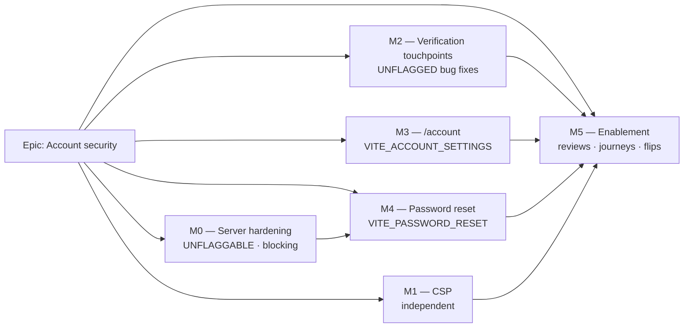

# Implementation Plan: Account security — recovery, verification enforcement, and a Content-Security-Policy

- **Feature spec:** [`./feature-spec.md`](./feature-spec.md)
- **Status:** Draft — awaiting product-owner approval
- **Owner:** _(to be assigned)_
- **ADR:** **ADR-0074** (drafted in M0-T1; `docs/adr/` holds 0001–0073 with no gaps — verified,
  not assumed)

---

## Breakdown

### Epic

**Account security** — give SchedulePoint a self-service account layer (recovery,
verification, credential change), close the two blocking auth-wiring gaps, and serve the web
origin's first Content-Security-Policy. Maps to the security-hardening theme; closes
`TECH_DEBT` #8 and #16, extends #88, pays half of #94.

**Epic-wide invariants** (assert these in review, every milestone):

- **The CPM engine is not imported.** No file in this epic references `computeSchedule`, no
  scheduling input changes, no migration runs. The ADR-0034 recalc parity gate is untouched
  **by construction** — there is nothing to hold parity for.
- **The pen (ADR-0028) is not involved.** Nothing here is a plan write.
- **No new Nest controller, no new endpoint, no new permission, no OpenAPI change, no
  migration.**
- **Enumeration discipline:** no screen and no status code may distinguish a known address
  from an unknown one — including, per M0-T5, inside the audit log.

---

## Milestone 0 — Server hardening (shippable, invisible, blocking)

**Outcome:** reset tokens are stored hashed, a completed reset kills every other session,
`POST /request-password-reset` stops throwing `RESET_PASSWORD_DISABLED`, and every
credential change is an audit row. **No user-visible change.** This milestone is the reason
the epic is ordered the way it is: a cleartext token and a surviving hijacked session are
exploitable the moment the feature exists, however polished the form is.

> **Ordering inside M0 is load-bearing.** T2 (hash the identifier) must merge **before** T4
> (enable the endpoint). If T4 landed first, every reset minted in the gap would sit in
> `verification.identifier` in cleartext for up to an hour. Today no such row can exist,
> because reset is disabled — so ordering these correctly means the cleartext window is
> **empty**, not merely short. Do not reorder for convenience.

---

#### Feature: Better Auth configuration hardening

> **Description:** the two `[RE-VERIFIED]` blocking findings, each one key in `createAuth()`.
> **Complexity:** S (code) / M (proving it)
> **Dependencies:** none
> **Risks:** changing token storage silently breaks the **verification** JWT path if the key
> is applied too broadly → mitigate by asserting in an API e2e that email verification still
> works end to end (it uses a signed JWT that is never persisted, so it should be unaffected —
> **verify, do not assume**).
> **Testing requirements:** API e2e against real Postgres for both; a unit test on the
> `createAuth` options object pinning both keys so a future edit cannot silently drop them.

##### Task M0-T1 — Draft ADR-0074 (≈ one PR, docs only)

- **Description:** write the ADR before the code, per `docs/PROCESS.md` Change management.
- **Complexity:** S
- **Dependencies:** none
- **Risks:** the number is taken by an unfiled decision → **checked**: `docs/adr/` holds
  0001–0073 contiguously and ADR-0071 (the one that was historically unfiled) is present.
- **Testing:** `pnpm check:doc-links`.
- **Development steps:**
  1. `docs/adr/0074-account-recovery-verification-enforcement-and-csp.md` from
     `docs/adr/_template.md`. Sections: **(1)** the two blocking wiring gaps and why they are
     configuration rather than library defects; **(2)** the CSP, the static-theme-boot
     decision and the templated-mode decision; **(3)** the flag structure, including the
     generalised rule _a client surface whose gate is a server-side condition is branched on
     **runtime evidence**, never on a `VITE_` constant_ — the ADR-0060 M0 rule generalised,
     and the precedent this ADR exists to set; **(4)** audit coverage decided by ADR-0073's
     two tests with the note that **no gate would catch its omission**; **(5)** rejected
     options (feature-spec §4.7 table); **(6)** consequences, including the six new debt rows
     from spec §5.
  2. Cross-reference ADR-0003/0012/0016/0051/0060/0072/0073 and this spec folder.
  3. Add the register entry to `CLAUDE.md` §16 in the **same** PR (ADR-0071's filing lesson:
     noticing drift and stepping over it leaves the register exactly as wrong as not noticing).

##### Task M0-T2 — Hash the verification identifier at rest (**B1**)

- **Description:** `verification: { storeIdentifier: { hash: hashToken } }` in `createAuth()`,
  reusing this app's own `common/tokens/token.ts` hasher so there is **one** hashing
  convention (the ADR-0051 bar).
- **Complexity:** S
- **Dependencies:** M0-T1
- **Risks:** (a) it also governs the **invitation**/verification identifiers if those share
  the table → read what else writes `verification` before merging; (b) an existing outstanding
  row becomes unmatchable → acceptable and near-certainly empty (reset is disabled; verify the
  table's live contents on the deployed database before deploying).
- **Testing:** **API e2e — the direct proof:** request a reset, then assert **no `verification`
  row's `identifier` contains the raw token**, and that the raw token still completes the reset.
  Plus a unit test pinning the option, so a later edit to this large options object cannot drop
  it unnoticed.
- **Development steps:**
  1. Add the key; import `hashToken`.
  2. Confirm `processIdentifier` accepts the `{ hash }` shape (`verification-token-storage.mjs:10-12`).
  3. Write the e2e first and watch it fail against the current code.
  4. Check the deployed `verification` table for outstanding rows; note the finding.

##### Task M0-T3 — Revoke sessions on password reset (**B2**)

- **Description:** `emailAndPassword.revokeSessionsOnPasswordReset: true`.
- **Complexity:** S
- **Dependencies:** M0-T1
- **Risks:** none identified; it is the conservative direction.
- **Testing:** API e2e — establish two sessions for one user, complete a reset, assert the
  **other** session 401s and (once M4 exists) that the resetting browser holds no session
  either, because reset issues none.
- **Development steps:** add the key; write the two-session e2e; assert the docblock explains
  _why_ (a forgotten password is sometimes caused by a compromise).

##### Task M0-T4 — `MailService.sendPasswordReset` + wire `sendResetPassword`

- **Description:** the un-flaggable server work that makes reset exist at all.
- **Complexity:** M
- **Dependencies:** **M0-T2 (strict — see the ordering note above)**
- **Risks:** (a) a live single-use token reaching a production log via the logging adapter →
  the logging adapter must redact or omit the token, mirroring the care at
  `logging-mail.service.ts:46`; (b) send failure is swallowed by
  `runInBackgroundOrAwait` → **inherited from `TECH_DEBT` #94**, mitigated by M0-T6, not
  re-solved here.
- **Testing:** unit tests for both adapters; an API e2e proving
  `POST /request-password-reset` returns `200 {status:true}` (rather than
  `RESET_PASSWORD_DISABLED`) and returns **identically** for a known and an unknown address —
  same status, same body.
- **Development steps:**
  1. Add `PasswordResetEmail { to; resetUrl }` and `abstract sendPasswordReset(...)` to the
     `MailService` port. **Fix the stale "v1 ships a logging stub" docblock in the same
     commit** (spec §0.2 / N13).
  2. Implement in `SmtpMailService` (throwing, consistent with `sendEmailVerification`) and
     `LoggingMailService` (**never log the raw token**).
  3. Add `sendResetPassword` to `emailAndPassword` in `createAuth()`, mirroring the
     `sendVerificationEmail` callback shape so the factory stays a pure function of its
     options and never learns about Nest DI.
  4. Extend `CreateAuthOptions` + the Nest provider wiring.
  5. Write the identical-response e2e **before** the implementation.

##### Task M0-T5 — Audit: three new `auth.*` actions

- **Description:** `auth.password_changed`, `auth.password_reset_completed`,
  `auth.password_reset_requested`.
- **Complexity:** M
- **Dependencies:** M0-T4
- **Risks:** **(a) the seams do not generalise.** `auth-audit.ts:10-24` records the "three
  seams, not one" lesson — `/sign-out` needed a `before` hook and `/verify-email` needed a
  dedicated callback, because an after-hook saw no user and an error on the success path.
  **Verify each of the three against a real `hooks.after` before writing the producer.**
  **(b) The reset-requested row is itself an enumeration oracle** if it reaches an
  organisation feed — see step 4. **(c)** Three new actions push `AUDIT_ACTIONS` up; the C4
  defect was an action-filter cap that had fallen behind the vocabulary — confirm the cap is
  still **derived**, and add a test that pins it against the new count.
- **Testing:** `auth-audit.spec.ts` unit coverage per action; API e2e asserting each row
  exists with the right actor; a **redactor test** proving no payload carries a `token` or
  `hash` substring (`audit-redactor.ts:162-175`); an e2e proving the reset-requested row is
  **absent** from the organisation feed and **present** on the subject's `?include=attempts`
  projection. **Do not extend the route census** — it structurally cannot see these routes
  (`audit-coverage.structural.spec.ts:45-47`), so there is no gate here in either direction.
- **Development steps:**
  1. Add the three `AuditAction` members in `packages/types` + their `AUDIT_ACTION_CATEGORY`
     entries (→ `sign-ins`).
  2. `auth.password_changed`: extend `classifyAuthEvent` for `/change-password`.
  3. `auth.password_reset_completed`: prefer `emailAndPassword.onPasswordReset`
     (`password.mjs:168-171`) — **but drive a real hook first** and use `hooks.after` if the
     callback does not carry what is needed.
  4. `auth.password_reset_requested`: its own `hooks.after` branch on `ctx.path` — the
     existing `failed`/`newSession` signals **cannot** see it (the handler succeeds
     uniformly). Apply the ADR-0073 C2.2 pattern: `ANONYMOUS` actor, attempted address as
     `subjectLabel` **with the caller's casing preserved**, best-effort `subjectId` via
     `findUserIdByEmail` resolved at **write** time, `organizationId` null. Normaliser is
     `toLowerCase()` and **nothing else** (C2.1 — trimming would attribute a probe to an
     account the input could never have reached). Reachability must be **identical to a
     failed sign-in**: self-projection only.
  5. Add the derived-cap regression test.

##### Task M0-T6 — Wire Better Auth's logger into Pino (`TECH_DEBT` #94, cheap half)

- **Description:** `betterAuth({ logger })` so the swallowed mail-send error joins the
  structured stream with correlation IDs and redaction.
- **Complexity:** S
- **Dependencies:** M0-T4
- **Risks:** log volume from routine library chatter → set the level deliberately and check
  one boot's output.
- **Testing:** a unit test asserting the adapter forwards to the injected logger; manual
  confirmation of one line in the structured stream.
- **Development steps:** adapt Better Auth's logger interface onto Pino; update `TECH_DEBT`
  #94 to record the cheap half as paid and the hard half (send-before-handoff, needing
  `docs/PROCESS.md`) as still open.

##### Task M0-T7 — Deployment preconditions (docs + one operator check)

- **Description:** the two things that will otherwise make reset fail with nothing on screen.
- **Complexity:** S
- **Dependencies:** M0-T4
- **Risks:** **`redirectTo` passes `originCheck` (`password.mjs:49`) against `trustedOrigins`,
  bound to `config.corsOrigins` (`auth.module.ts:34`). If the deployed app origin is not in
  `CORS_ORIGINS`, EVERY reset fails with an origin error and nothing explains it.**
- **Testing:** an API e2e driving a reset with a `redirectTo` outside `trustedOrigins`,
  asserting the rejection — so the failure mode is at least a known, tested one.
- **Development steps:**
  1. Confirm the deployed origin is in `CORS_ORIGINS` **on the running deployment**.
  2. `docs/DEPLOYMENT.md`: add the precondition, and note that `MAIL_SMTP_URL` is now
     load-bearing for **recovery**, not only verification.
  3. Changeset (patch, `api`).

---

## Milestone 1 — Content-Security-Policy (shippable, independent)

**Outcome:** the web origin serves a CSP in **report-only** mode, plus the missing sibling
headers, with the mode switchable by an operator variable. **Enforcement is M5-T2** — a
separate, separately-approved decision, deliberately held until the new screens exist.

---

#### Feature: CSP + sibling headers on the web origin

> **Description:** closes `TECH_DEBT` #8.
> **Complexity:** M
> **Dependencies:** none (may run in parallel with M0)
> **Risks:** a wrong policy breaks a shipped feature (canvas export, jsPDF, print) → that is
> exactly what the report-only window is for, and why enforce is a separate milestone.
> **Testing requirements:** an nginx config test in the image smoke-boot; a manual operator
> pass over **every** route in report-only, including the four new ones.

##### Task M1-T1 — Externalise the theme-boot script

- **Description:** move the inline IIFE from `index.html:8-23` to `public/theme-boot.js`,
  referenced by `<script src="/theme-boot.js">`.
- **Complexity:** S
- **Dependencies:** none
- **Risks:** (a) losing the anti-flash guarantee → a classic `<script src>` in `<head>` is
  still parser-blocking, so it still runs before first paint — **verify visually in a real
  browser, not by reasoning**; (b) Vite fingerprinting it → `public/` is copied verbatim,
  which is why it goes there; (c) one extra render-blocking request before first paint
  against the CLAUDE.md §15 LCP target → ~400 B on an already-open same-origin connection,
  **measure in the report-only window**; the documented fallback is the `sha256-` hash, with
  the reason it was rejected written into `nginx.conf` as a comment.
- **Testing:** a unit/DOM test that the theme class is applied before React mounts; manual
  hard-reload in light, dark and corporate themes.
- **Development steps:** move the file; add a dedicated nginx `location` with a short
  `max-age` (it is not fingerprinted, so it must not be immutably cached); confirm
  byte-identical behaviour in all three themes.

##### Task M1-T2 — Templated nginx config so the CSP mode is an operator variable

- **Description:** `COPY apps/web/nginx.conf` → `/etc/nginx/templates/default.conf.template`,
  with `${CSP_HEADER_NAME}` / `${CSP_POLICY}` defaulted to report-only.
- **Complexity:** M
- **Dependencies:** M1-T1
- **Risks:** **`envsubst` will eat nginx's own `$scheme`, `$host`, `$remote_addr`,
  `$proxy_add_x_forwarded_for` and `$uri` unless restricted — producing a config that is
  subtly and comprehensively wrong. Set `NGINX_ENVSUBST_FILTER=^CSP_`.** This is the single
  most likely way this task costs a CI round.
- **Testing:** the ADR-0020 image smoke-boot must assert the rendered config still proxies
  `/api/` correctly **and** that the header is present with the default value; add an
  explicit assertion that `$host`/`$scheme` survived substitution.
- **Development steps:** the `nginx:1.31-alpine` runtime already ships
  `/docker-entrypoint.d/20-envsubst-on-templates.sh`, so no new tooling is needed. Set
  defaults in `docker-compose*.yml`; document `CSP_HEADER_NAME`/`CSP_POLICY` in
  `docs/DEPLOYMENT.md` and `.env.example`.

##### Task M1-T3 — The policy, in report-only

- **Description:** ship the spec §4.5 policy as `Content-Security-Policy-Report-Only`.
- **Complexity:** S
- **Dependencies:** M1-T1, M1-T2
- **Risks:** `style-src 'self'` is an **inference from source** (React `style={{…}}` sets
  individual CSSOM properties rather than parsing a `style` attribute string, and browsers
  generally do not gate that on `'unsafe-inline'`) — **it is not a browser-verified fact.
  Treat it as the thing the report-only window exists to falsify.** Fallback:
  `'unsafe-inline'` on **`style-src` only**, never `script-src`.
- **Testing:** manual console review across every route: sign-in/up, accept-invite, share
  guest view, the plan workspace, the Gantt, canvas **export (PNG/PDF)**, the **printed
  programme**, the library screens, the audit log.
- **Development steps:** add the header; **do not** configure `report-to` (a
  `POST /api/v1/csp-reports` sink would be a new `@Public()` route, and ADR-0051 established
  that list stays short — deferred); note explicitly that the API's Helmet config is **not**
  touched.

##### Task M1-T4 — Sibling headers _(optional — PO may descope, spec CQ-3)_

- **Description:** add COOP, CORP and Permissions-Policy to the web origin.
- **Complexity:** S
- **Dependencies:** M1-T2
- **Risks:** **a blanket Permissions-Policy deny would break the Copy buttons.**
  `clipboard-write` is a Permissions-Policy-controlled feature in Chromium and the app uses
  `navigator.clipboard` in `ShareLinksDialog.tsx` and `InviteMemberDialog.tsx`. Deny
  `camera`, `microphone`, `geolocation`, `payment`, `usb`, `interest-cohort` — **leave
  clipboard alone**, and verify both Copy buttons in the report-only window.
- **Testing:** manual verification of both Copy buttons; header assertions in the smoke-boot.
- **Development steps:** add the three headers; record in `docs/SECURITY_STANDARDS.md` that
  **HSTS is deliberately excluded** and why (the block listens on plain `8080`, the container
  cannot know the browser's scheme per `TECH_DEBT` #89, and HSTS is sticky — it belongs at the
  edge terminator).

##### Task M1-T5 — `TECH_DEBT` #89 code half _(optional — PO may descope, spec CQ-3)_

- **Description:** stop `nginx.conf:24` overwriting `X-Forwarded-Proto` with this container's
  unconditionally-`http` `$scheme`.
- **Complexity:** S
- **Dependencies:** M1-T2
- **Risks:** untestable without the operator half → ship the code half and the deployment note
  together, and say plainly in #89 that the pair is required.
- **Testing:** an nginx-level test that a supplied `X-Forwarded-Proto: https` survives and an
  absent one falls back to `$scheme`.
- **Development steps:** a `map $http_x_forwarded_proto $fwd_proto { default
$http_x_forwarded_proto; '' $scheme; }`; use `$fwd_proto` in the `proxy_set_header`; update
  #89 to record the code half as paid; add the Nginx-Proxy-Manager instruction to
  `docs/DEPLOYMENT.md`.

---

## Milestone 2 — Verification touchpoints (shippable, **unflagged**)

**Outcome:** the three latent dead ends are closed, `/verify-email` exists, and a
session-less resend is reachable. **This is the milestone that makes the
`AUTH_REQUIRE_EMAIL_VERIFICATION` flip safe.** Every change here is a **runtime branch on
evidence the server provides**, not a behaviour swap — which is precisely why it is unflagged
(spec §3.2). Each fix ships with a regression test **verified to fail against the old code
first**, asserting **both** enforcement branches.

---

#### Feature: Shared public-screen shell (do this first)

> **Description:** converge `AuthShell` and `InviteShell` before three new callers arrive.
> **Complexity:** S
> **Dependencies:** none
> **Risks:** doing it _after_ the new screens leaves five callers on two implementations —
> the ADR-0062 shape, where each looks right alone and only a reader who opens the same thing
> two ways ever sees one is a version behind.
> **Testing requirements:** every existing sign-in / sign-up / accept-invite suite must pass
> **unchanged** — that is the extraction's proof (the ADR-0062 precedent).

##### Task M2-T1 — Extend `AuthShell`; converge `InviteShell`

- **Complexity:** S · **Dependencies:** none
- **Risks:** a visual regression on three live screens → there must be **no** visual change;
  the suites query by role and accessible name, which is exactly the contract preserved.
- **Testing:** existing suites unchanged; a new test that the polite region is present on
  every variant.
- **Development steps:** add `size?: 'sm' | 'md'`, optional `busy`, an **always-present**
  polite live region, optional `title`/`description`; have `InviteShell` delegate (or delete
  it); document in `docs/COMPONENT_LIBRARY.md` that public screens own their own live region
  because `AnnouncerProvider` is mounted only inside `_authed`.

##### Task M2-T2 — `aria-disabled` + pointer guard on auth submits

- **Complexity:** S · **Dependencies:** M2-T1
- **Description:** fix `SignInForm.tsx:45` and establish the pattern **before** four new forms
  copy the defect four times (`TECH_DEBT` #17a; raised at ADR-0060 M6 and ADR-0063 M6).
- **Testing:** a test asserting focus is retained across a pending submit.
- **Development steps:** replace native `disabled`; do the same on `SignUpForm`; record the
  rule in `docs/DESIGN_SYSTEM.md` so the next form is not a judgement call.

---

#### Feature: The three touchpoints + `/verify-email`

> **Description:** the unflagged bug fixes.
> **Complexity:** M
> **Dependencies:** M2-T1
> **Risks:** a conditionally-registered `/verify-email` referenced from an unflagged branch
> would be a link to nowhere → **register it unconditionally**.
> **Testing requirements:** each fix has a regression test verified to fail first, covering
> **both** server-flag branches; the flag-on journey (M5-T3) drives all three against a real
> API with the env var on **and** off.

##### Task M2-T3 — `/verify-email` route (registered unconditionally)

- **Complexity:** M · **Dependencies:** M2-T1
- **Description:** a **landing** screen, not a token-consuming one — the emailed URL points at
  the auth handler, which verifies on GET and redirects. It serves three arrivals:
  post-verification confirmation, pending-and-needs-a-resend, and used/expired.
- **Risks:** a mail scanner's GET **can** consume this token (unlike the reset link) —
  `TECH_DEBT` #88. Handle the used/expired arrival as **"this link has been used, here's a
  fresh one"**, not as a failure.
- **Testing:** unit coverage of all six states (arrived-after-success; pending with an
  address; pending **without** one → ask for it; resend submitting/sent/rate-limited;
  used/expired; network failure); axe.
- **Development steps:** `routes/verify-email.tsx`; permissive `validateSearch` accepting an
  optional `?email=`; `useSendVerificationEmail` in `use-session.ts`; announce every
  transition through the screen's own polite region.

##### Task M2-T4 — Sign-up: branch on the response, not on `error`

- **Complexity:** S · **Dependencies:** M2-T3
- **Description:** `useSignUp` (`use-session.ts:72-87`) inspects only `error`; with enforcement
  on, sign-up returns `{ token: null }` (`sign-up.mjs:252-254`), so it reports success,
  `SignUpScreen` navigates to `/`, the `_authed` guard finds `session === null` and bounces to
  `/sign-in` **with no explanation whatsoever**.
- **Risks:** **copy.** With enforcement on, a **duplicate** address also returns a generic
  success (`sign-up.mjs:162,169`). "Account created — check your email" is therefore the
  correct and **required** copy for that case too. **Do not add an "email already in use"
  message** — it would reintroduce the enumeration oracle the library just closed.
- **Testing:** a regression test **verified to fail first**, asserting **both** branches:
  session returned → `/`; no session → `/verify-email?email=…`.
- **Development steps:** return the result from the mutation; branch in `SignUpScreen`
  (`sign-up.tsx:16`); write the two-branch test first.

##### Task M2-T5 — Sign-in: `EMAIL_NOT_VERIFIED` as a first-class state

- **Complexity:** S · **Dependencies:** M2-T3
- **Description:** the raw library message currently lands in `SignInForm.tsx:26-30`'s
  `
` with no affordance. Replace with an explained state carrying a **Resend
  verification email** button.
- **Risks:** none material. **Note the rejected alternative:** setting `sendOnSignIn: true`
  server-side would resend automatically but silently — a client-initiated resend has visible
  pending/sent/rate-limited states; a silent server resend has none.
- **Testing:** regression test verified to fail first; both branches (403 with the code → the
  new state; any other error → today's paragraph).
- **Development steps:** detect the code (not the message string); render the state; wire
  `useSendVerificationEmail`; announce.

##### Task M2-T6 — Accept-invite: pre-emptive unverified state

- **Complexity:** S · **Dependencies:** M2-T3
- **Description:** `AcceptInvitationCard` holds `user.emailVerified` and never reads it; the
  server's 403 (`invitations.service.ts:218-220`) falls through to the generic error paragraph
  at `:109-113`. The card already models three refusals as first-class states (not found, not
  pending, wrong account) — this is a fourth.
- **Risks:** **framing.** This refusal is **not reachable today** (it is guarded by
  `requireEmailVerification`, which is false) — spec §0.1. It is a latent dead end, not a live
  one. Fix it with the same priority and describe it accurately.
- **Testing:** regression test verified to fail first, covering the pre-emptive state and the
  403 backstop.
- **Development steps:** check `emailVerified` before the Accept button renders; explain +
  Resend; keep the 403 branch as the server's authoritative second word.

---

## Milestone 3 — `/account` (shippable, flagged `VITE_ACCOUNT_SETTINGS`)

**Outcome:** a signed-in member can change their password and see/resend their verification.
**No server prerequisite** — resend already works today, because
`emailVerification.sendVerificationEmail` **is** configured. This milestone can ship before M0
completes.

---

#### Feature: The account screen

> **Complexity:** M · **Dependencies:** M2-T1, M2-T2
> **Risks:** scope creep into a settings IA → spec §4.4's explicit "what NOT to build" list is
> the contract.
> **Testing requirements:** unit state coverage per `docs/UX_STANDARDS.md`; axe; a flag-off
> parity suite; covered by the M5 journey.

##### Task M3-T1 — Flag + route + menu item

- **Complexity:** S · **Dependencies:** M2-T1
- **Testing:** flag-off parity suite — **no route, no menu item, `AppHeader` byte-for-byte**,
  via `vi.mock('@/config/env', …)` (the ADR-0053 M6 pattern).
- **Development steps:** `ACCOUNT_SETTINGS_ENABLED = flagDefaultOff(import.meta.env.VITE_ACCOUNT_SETTINGS)`
  with a docblock in the house style; `routes/account.tsx` as a flat child of `authedRoute`
  (precedents: `/onboarding`, `/me/activity`); a `MenuItem` in `AccountChip` directly above
  **My activity** (`account-chip.tsx:101-110` is also the conditional-registration precedent).

##### Task M3-T2 — Change-password section

- **Complexity:** M · **Dependencies:** M3-T1
- **Risks:** a wrong-current-password 401 rendered as a form banner rather than on the field
  (the ADR-0060 M6 finding, one control along).
- **Testing:** idle · validation (new ≥ 12, confirm matches, new ≠ current) · submitting ·
  **401 attached to the current-password field** · rate-limited (3/10 s, production) · success
  `role="status"` + reset · network failure. Axe.
- **Development steps:** extend `auth-schemas.ts` (**no second schema file**); add
  `useChangePassword` to `use-session.ts` (**keep it the only `authClient` consumer**);
  `ChangePasswordForm` on `FormSection`/`FieldGrid`; send `revokeOtherSessions: true` and
  **state the consequence on screen before submit** (spec CQ-2).

##### Task M3-T3 — Email-address section

- **Complexity:** S · **Dependencies:** M3-T1
- **Testing:** verified · unverified + Resend · sent · rate-limited. Axe.
- **Development steps:** read `emailVerified` from `useSession()`; `ResendVerificationButton`
  reusing M2-T3's hook; announce each transition.

---

## Milestone 4 — Password reset (shippable, flagged `VITE_PASSWORD_RESET`)

**Outcome:** a signed-out user can recover their account unaided.

---

#### Feature: The reset surface

> **Complexity:** M · **Dependencies:** **M0 complete**, M2-T1, M2-T2
> **Risks:** **stranding** — a "Forgot your password?" link pointing at a
> conditionally-registered route. `pnpm typecheck` will **not** catch it, because
> `...(FLAG ? [route] : [])` widens to `(typeof route)[]` and the registered-route union
> contains the route in **both** branches. The flag structure is the gate: routes **and** link
> share one flag, and the parity suite pins the link's absence.
> **Testing requirements:** full state coverage; a flag-off parity suite pinning the absent
> link **specifically**; the M5 journey.

##### Task M4-T1 — Flag + both routes + the sign-in link (one PR, deliberately)

- **Complexity:** M · **Dependencies:** M0-T4
- **Risks:** as above — **splitting this task across PRs is the stranding failure.**
- **Testing:** flag-off parity suite: **neither route registers and there is no link on
  sign-in.**
- **Development steps:** `PASSWORD_RESET_ENABLED = flagDefaultOff(...)`; register both routes
  and add the link, all behind the one constant.

##### Task M4-T2 — `/forgot-password`

- **Complexity:** M · **Dependencies:** M4-T1
- **Risks:** **undoing the library's enumeration protection in our own layer.** Do **not**
  pre-validate the address against a members lookup, and do **not** render a different state
  per branch.
- **Testing:** idle (prefill from `?email=`) · invalid email · submitting · **submitted —
  identical copy for known and unknown** and **no promise of delivery** (`TECH_DEBT` #94) ·
  `RESET_PASSWORD_DISABLED` 400 rendered as "Password reset isn't available — contact your
  administrator" (**must not read as "no such account"**) · 429 · network failure with input
  preserved · already-signed-in → point at `/account`. Axe.
- **Development steps:** `RequestPasswordResetForm`; `useRequestPasswordReset` passing
  `redirectTo`; announce via the screen's own region.

##### Task M4-T3 — `/reset-password`

- **Complexity:** M · **Dependencies:** M4-T1
- **Risks:** (a) the token persisting in history or a later referrer → **strip it immediately**
  with `navigate({ to: '/reset-password', search: {}, replace: true })`; (b) a hand-edited URL
  crashing the screen → `validateSearch` accepts `token` **and** `error` permissively (the
  house rule stated twice: `router.tsx:169-170`, `:220-222`).
- **Testing:** `?error=INVALID_TOKEN` (an explanation + "Send a new link", **not** a form) ·
  neither param (same, never a crash) · valid token (form; token stripped) · submitting ·
  client validation · server `PASSWORD_TOO_SHORT`/`TOO_LONG`/`INVALID_TOKEN` · **success is
  "Password changed. Sign in." with a link, not a navigation into the app** (reset issues no
  session) · network failure. Axe.
- **Development steps:** `ResetPasswordForm`; `useResetPassword`; add `noindex` +
  `Referrer-Policy: no-referrer` for this route (the `/share` precedent); hold the token in
  component state only.

##### Task M4-T4 — Extend `TECH_DEBT` #88 to cover reset

- **Complexity:** S · **Dependencies:** M4-T3
- **Description:** #88 covers the verification link and names the invitation accept URL; it
  was never extended to reset, which is worse — `GET /reset-password/:token` **302-redirects
  with the raw token on the `Location` header** and does not consume it, so a logging proxy
  captures a live token for the remaining hour, **compounding B1**.
- **Testing:** documentation only.
- **Development steps:** extend #88 with **both** halves honestly: the redirect exposure
  **and** the architectural point in this design's favour — the emailed link lands on a page
  and the actual change is a POST from our form, which is structurally the shape #88 asks for.
  Neither advisory report was wrong; they addressed different halves. The confirm-button
  interstitial for verify/invite stays #88's own, separate remediation.

---

## Milestone 5 — Enablement (the gate pass)

**Outcome:** the specialist reviews run over the **combined** diff, the journeys exist, the
flags flip, the CSP enforces, and verification is enforced. Each flip is its **own**
separately-approved task.

> **Why this milestone exists in its own right.** Each of the last six epics found its worst
> defects here, in code that had already passed a human read — and in four of them the defect
> was _one correct pattern applied to a control and not its neighbour_. This epic ships four
> new forms and touches two existing ones: that is exactly the shape. Budget for findings.

---

##### Task M5-T1 — Specialist review pass over the combined diff

- **Complexity:** M · **Dependencies:** M0–M4
- **Description:** **security-reviewer** (the whole epic is its subject: B1/B2 as landed,
  enumeration, token handling, the CSP, the audit rows' reachability), **api-reviewer** (the
  audit action vocabulary and the three producers), **accessibility-reviewer** (four new
  screens, the public live regions, `aria-disabled`), **ux-reviewer** (copy on every refusal —
  the ADR-0073 C2.5 lesson that the _substance_ of security copy is a UX finding, not a
  polish one), **component-reviewer** (`AuthShell` convergence, no one-off styling, no
  `PasswordField` smuggled in), **test-engineer** (that each regression test was verified to
  fail first).
- **Testing:** every blocking finding folded with a regression test **verified to fail against
  the pre-fix code**; non-blocking findings recorded in `docs/TECH_DEBT.md` rather than rushed.
- **Development steps:** run; fold; record.

##### Task M5-T2 — Flip the CSP to enforce _(its own approval)_

- **Complexity:** S · **Dependencies:** M5-T1, and an observed report-only window that
  **covered the new screens**
- **Risks:** a violation that only appears on a rarely-used path (canvas PDF export, the
  printed programme) → the window must explicitly include them.
- **Testing:** manual pass over every route; rollback is `CSP_HEADER_NAME` back to
  report-only, **no new image** (which is the whole reason M1-T2 exists).
- **Development steps:** confirm a clean window; flip the variable; record the date and the
  observed-clean route list in the ADR; **close `TECH_DEBT` #8**.

##### Task M5-T3 — Flag-on Playwright journey `apps/web/e2e-account/`

- **Complexity:** L · **Dependencies:** M5-T1
- **Description:** its own config, its own `test:e2e:account` script, and **its own CI step**,
  following the 24-suite convention.
- **Risks:** **it must run against a real API with `AUTH_REQUIRE_EMAIL_VERIFICATION` both on
  and off.** That is the only place the sign-up no-session path and the invitation refusal are
  testable at all — a mocked fetch accepts any response shape, and no unit suite can see a
  wrong locator or an accessible name that differs from the assumption.
- **Testing:** the journey **is** the test. Cover: request reset → capture the mail → follow
  the link → set a new password → sign in; **assert the other session died**; change password
  from `/account`; enforcement **on** → sign up → `/verify-email` → resend → verify → sign in;
  enforcement **on** → invitation accept refusal shows the pre-emptive state.
- **Development steps:** add the suite, config, script and CI step; **run
  `scripts/e2e-local.sh web:account` locally before pushing** — the pre-push gate
  (`docs/TESTING.md`) is not optional and not CI's job. Omitting it cost five CI rounds on the
  ADR-0063 journey, every failure in the test rather than the product, every one visible in
  the first local run.

##### Task M5-T4 — Flip `VITE_ACCOUNT_SETTINGS` on _(its own approval)_

- **Complexity:** S · **Dependencies:** M5-T1, M5-T3
- **Testing:** the flag-off parity suite is **kept and pinned**, not weakened — that is the
  rollback contract.
- **Development steps:** `flagDefaultOff` → `flagDefaultOn` with a docblock recording the date
  and the gates cleared; changeset (minor, `web`).

##### Task M5-T5 — Flip `VITE_PASSWORD_RESET` on _(its own approval)_

- **Complexity:** S · **Dependencies:** M5-T1, M5-T3, **M0 deployed with a working transport**
- **Risks:** flipping before a confirmed transport ships a Forgot-password link that silently
  does nothing (`TECH_DEBT` #94).
- **Testing:** parity suite kept; a real reset email confirmed to arrive on the deployment.
- **Development steps:** confirm the transport; flip; changeset.

##### Task M5-T6 — Count unverified accounts on the deployed database

- **Complexity:** S · **Dependencies:** none (do it early — it informs CQ-1)
- **Description:** **the real figure, not an estimate.** `SELECT COUNT(*) … WHERE
email_verified = false`, plus the split by whether the account holds ≥ 1 organisation
  membership (which is exactly the predicate option C turns on).
- **Risks:** none. **The risk is skipping it**, which is what the spec forbids.
- **Testing:** n/a — record the number, the date and the query in the ADR.

##### Task M5-T7 — Execute the existing-user decision _(blocked on CQ-1)_

- **Complexity:** S–M · **Dependencies:** M5-T6, product-owner answer to CQ-1
- **Risks:** a blanket backfill grants verified status to any squatted address holding a
  pending invitation → **which is why option C's membership predicate is recommended** (spec
  CQ-1).
- **Testing:** dry-run the count; execute in a transaction; assert the post-count matches.
- **Development steps:** a one-off, reviewed, logged operation; record what was run and how
  many rows it touched in the ADR.

##### Task M5-T8 — Flip `AUTH_REQUIRE_EMAIL_VERIFICATION` on _(its own approval)_

- **Complexity:** S · **Dependencies:** **M2 deployed** (all three touchpoints live in the
  running bundle), M5-T7, a confirmed transport
- **Risks:** **this is the flip that arms all three dead ends at once.** It must not happen
  before a bundle carrying M2 is live. The ordering rule mirrors ADR-0028 §9 (never enable
  server-side enforcement ahead of the web bundle).
- **Testing:** end-to-end operator verification: sign up → `/verify-email` → verify → sign in
  → accept an invitation.
- **Development steps:** confirm the deployed bundle; set the env var; verify; **close
  `TECH_DEBT` #16**; update `docs/DEPLOYMENT.md` "Turning verification on".

##### Task M5-T9 — Docs, debt rows and the register

- **Complexity:** S · **Dependencies:** M5-T1
- **Development steps:** move ADR-0074 to Accepted with its per-milestone ledger; update
  `CLAUDE.md` §16 (the ADR entry) and §17 (the account-erasure half of the soft-delete
  bullet); close #8 and #16; extend #88; record #94's cheap half as paid; add the **six new
  debt rows** from spec §5 (N1 sessions, N2 change-email, N3 profile, N5 org rename/delete,
  N6 leave-organisation, N7 resend-invitation); fix `docs/FRONTEND_ARCHITECTURE.md:92` (N12)
  and the `MailService` docblock (N13).

---

## Sequencing & slices

```mermaid
gantt
  dateFormat X
  axisFormat %s
  section Independent
  M1 CSP report-only            :m1, 0, 2
  section Blocking
  M0 Server hardening           :m0, 0, 3
  section Unflagged fixes
  M2 Verification touchpoints   :m2, 1, 3
  section Flagged surfaces
  M3 /account                   :m3, after m2, 2
  M4 Password reset             :m4, after m0, 2
  section Gate
  M5 Enablement                 :m5, after m4, 3
```

**Hard ordering rules — none of these is a preference:**

1. **M0-T2 (hash) before M0-T4 (enable reset).** Otherwise the cleartext window is real
   rather than empty.
2. **M0 complete before M4.** No reset UI before the two blocking findings are fixed.
3. **M2 deployed before M5-T8.** The verification flip arms three dead ends at once; the
   bundle that closes them must already be live (the ADR-0028 §9 ordering rule).
4. **M5-T6 + M5-T7 before M5-T8.** Count, decide, execute — then flip.
5. **M1's report-only window stays open until M2–M4's screens exist**, then M5-T2 enforces.
   A window closed before the new DOM surfaces existed would never have covered them.
6. **M4-T1 is one PR.** Splitting the routes from the link is the stranding failure that
   typecheck cannot see.

**Descoping (spec CQ-3):** M1 is fully separable — drop it and the epic still delivers
recovery. M3 is separable from M4 — it has no server prerequisite. **M0 is not separable
from anything and should ship regardless.** M2 is not separable from M5-T8. M1-T4 and M1-T5
are individually optional.

**Each milestone keeps `main` releasable:** M0 is invisible; M1 is report-only; M2 is a
behaviour-preserving branch in both worlds; M3/M4 are default-off flags; M5 is flips.

## Definition of Done (per task)

Each task's PR must satisfy the Feature Completion Criteria in
[`docs/PROCESS.md`](../../PROCESS.md). Two items get emphasis here because this epic is where
they bite:

- **"Tests" means the pre-push gate was _run_.** `pnpm lint && pnpm typecheck && pnpm test`,
  **plus `scripts/e2e-local.sh api`** for every M0 task (they all touch `apps/api`), **plus
  `scripts/e2e-local.sh web:account`** for M5-T3. CI is the second opinion, never the first.
- **Every bug-fix task carries a regression test verified to fail against the pre-fix code**
  — M2-T4, M2-T5 and M2-T6 in particular, where the whole safety argument is that both
  server-flag branches are correct and only a test can hold that.

## Risks & assumptions (rollup)

| Risk / assumption                                           | Likelihood                         | Impact                                                      | Mitigation                                                                                                          |
| ----------------------------------------------------------- | ---------------------------------- | ----------------------------------------------------------- | ------------------------------------------------------------------------------------------------------------------- |
| Reset tokens stored in cleartext (**B1**)                   | **certain** if reset ships unfixed | **high** — account takeover from any DB read                | M0-T2, ordered before M0-T4; proven by an e2e that greps the `verification` table                                   |
| A reset leaves a hijacked session alive (**B2**)            | **certain** if unfixed             | **high**                                                    | M0-T3; two-session e2e                                                                                              |
| `CORS_ORIGINS` missing the app origin                       | medium                             | **high** — every reset fails, nothing on screen explains it | M0-T7 operator check + a deployment note + a negative e2e                                                           |
| Mail transport broken → reset silently no-ops               | medium                             | medium                                                      | Inherited `TECH_DEBT` #94; M0-T6 makes it visible in the structured log; **do not** re-solve                        |
| The verification flip strands existing users                | **high** without a decision        | **high**                                                    | CQ-1; M5-T6 counts the **real** figure; M5-T7 executes; M5-T8 is gated on both                                      |
| Flag-off bundle deployed against a flag-on server           | medium                             | **high** — every new sign-up stranded                       | The three touchpoints are **unflagged runtime branches**, not build-time flags (spec §3.2)                          |
| Stranding: sign-in link without its route                   | medium                             | medium                                                      | One flag for routes **and** link (M4-T1); parity suite pins the link's absence; **typecheck cannot see this**       |
| CSP enforce breaks a shipped path (export/PDF/print)        | medium                             | medium                                                      | Report-only first; the window explicitly covers those paths; rollback is an env var, not an image                   |
| `envsubst` eats nginx's own `$` variables                   | **high** if unguarded              | **high** — subtly wrong proxy config                        | `NGINX_ENVSUBST_FILTER=^CSP_`; smoke-boot asserts `$host`/`$scheme` survived                                        |
| Blanket `Permissions-Policy` breaks the Copy buttons        | medium                             | medium                                                      | Enumerate the deny-list; **leave `clipboard-write` alone**; verify both buttons                                     |
| `style-src 'self'` is inferred, not browser-verified        | medium                             | low                                                         | It is what the report-only window exists to falsify; fallback is `'unsafe-inline'` on **`style-src` only**          |
| Audit seams do not generalise from the two easy cases       | medium                             | medium                                                      | `auth-audit.ts:10-24`'s own "three seams, not one" lesson — drive a real hook per route before writing the producer |
| The reset-requested audit row becomes an enumeration oracle | medium                             | **high**                                                    | Same reachability rule as a failed sign-in: no `organization_id`, no actor, self-projection only (M0-T5 step 4)     |
| Externalised theme-boot costs an LCP round trip             | low                                | low                                                         | ~400 B, same-origin, parser-blocking preserved; measure in the window; hash is the documented fallback              |
| The M5 review pass finds defects that passed a human read   | **high** (six epics running)       | medium                                                      | M5 is budgeted as its own milestone, not a formality                                                                |
| Scope creep into a settings IA / session management         | medium                             | medium                                                      | Spec §4.4's explicit "what NOT to build" list; §5 records N1–N7 as debt instead                                     |
