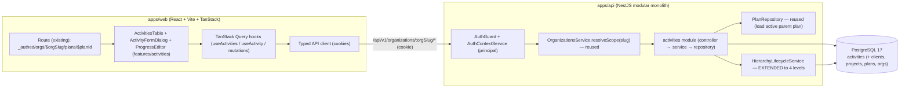
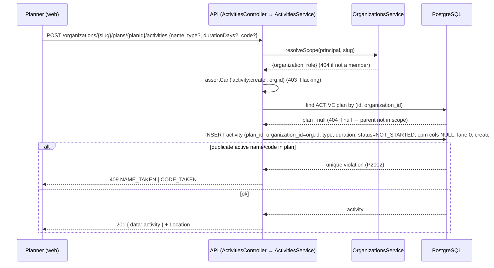
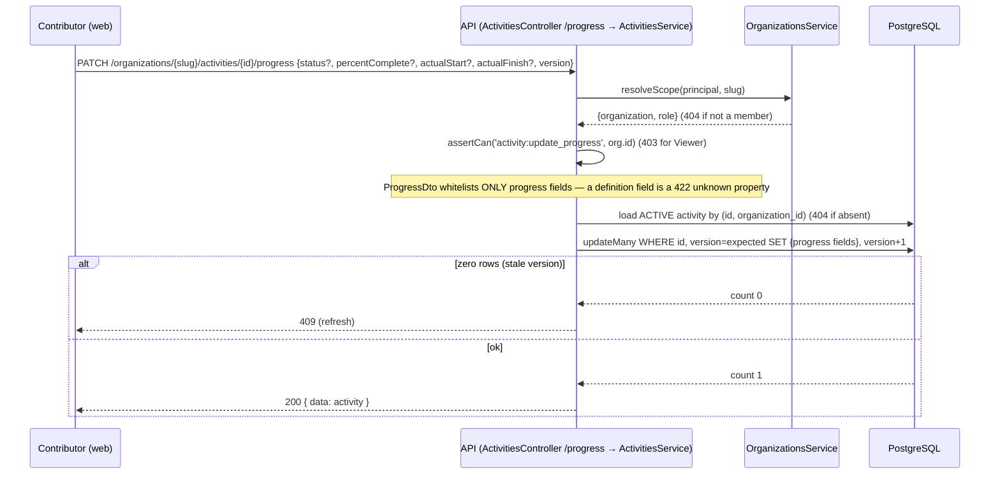
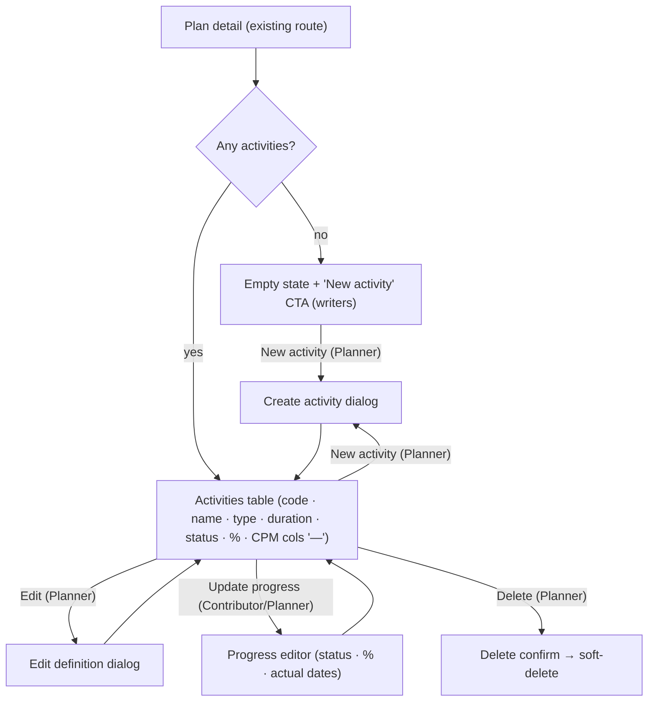
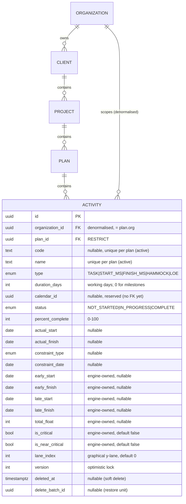

# Feature Spec: Activities foundation

- **Status:** Approved (2026-07-10) — four critical questions confirmed with the recommended defaults.
- **Author(s):** Feature Analyst (Solution Architect / Product Owner / Tech Lead hats)
- **Date:** 2026-07-10
- **Tracking issue / epic:** _TBD_ — Epic "Scheduling core (CPM/GPM & the TSLD)"
- **Roadmap link:** M3 — Activities foundation (first vertical slice of the
  scheduling core; follows M2 Hierarchy CRUD — see `docs/ROADMAP.md`)
- **Related ADR(s):** ADR-0008 (modular monolith), ADR-0012 (RBAC + resource
  scoping), ADR-0014/0015 (reference template), ADR-0016 (identity & tenancy +
  role set). **No new ADR proposed for this slice** — it reuses the org-scoped
  CRUD, tenancy, RBAC, soft-delete/audit/locking and cascade conventions
  established by the hierarchy slice unchanged, extended to a fourth level. Three
  conventions are new-but-not-yet-architectural and are recorded in
  `docs/DECISIONS.md` (see §4): **engine-owned CPM output columns**, **layout
  persisted in the model**, and the **progress-vs-logic RBAC split**. Each is
  flagged as a potential ADR for the reviewer to promote if judged broadly
  load-bearing. The **canvas rendering ADR (Canvas 2D vs WebGL)** is explicitly a
  concern of the later TSLD slice, not this one (PROJECT_BRIEF §15).

> This is the **third vertical slice** of SchedulePoint and the **first of the
> scheduling core**. It builds directly on the hierarchy slice (Client → Project →
> **Plan**) — reusing `OrganizationsService.resolveScope`, deny-by-default RBAC,
> `{data,meta}`/`{error}` envelopes, cursor pagination, soft-delete + audit +
> optimistic locking, the shared `HierarchyLifecycleService`, and the `_authed`
> org-scoped web shell — to give a Plan its first real contents: **Activities**.
>
> Scope is deliberately a **thin but complete vertical slice**: the Activity
> domain entity, its org-scoped REST CRUD (+ a progress-only update path for
> Contributors), and a **minimal web surface** — an activities **table** on the
> plan-detail screen, replacing the reserved "the schedule editor will live here"
> placeholder. **There is no graphical canvas, no dependencies, no calendars, and
> no CPM maths in this slice.** The Activity model, however, **persists all the
> fields the brief calls for** (type, duration, calendar-override ref, status &
> progress, constraints, the CPM output columns, and the graphical lane position)
> so the deferred slices that follow — dependencies, calendars, the CPM engine,
> the TSLD canvas — build on it **without migration churn**.

## 1. Business understanding

### Problem

SchedulePoint's whole reason to exist is CPM/GPM scheduling on a Time-Scaled
Logic Diagram, and the atomic unit of a schedule is the **Activity** — the node
in the network, the bar on the timeline, the row in the Gantt (PROJECT_BRIEF
§9/§22). The hierarchy slice delivered the container tree down to **Plan**, but a
Plan is still empty: a planner who opens a plan sees only a placeholder reading
"the schedule editor (Time-Scaled Logic Diagram) will live here". Nothing can be
scheduled, progressed, connected with logic, baselined, or exported because there
are no activities to attach any of that to.

"Why now": Activities are the immediate, unavoidable prerequisite for **every**
remaining scheduling feature. Dependencies connect activities; calendars and
constraints qualify activities; the CPM engine computes dates and float **onto**
activities; the TSLD canvas draws activities; baselines snapshot activities;
resources are assigned to activities; export lists activities. Landing the
Activity entity — with the full field set persisted up front — unblocks that
entire sequence and lets it proceed as clean, additive slices rather than a
series of wide, backfilling migrations against a live activities table.

Delivering it as **table-based CRUD first** (before the canvas) also de-risks the
flagship: it proves the org-scoped Activity model, the RBAC progress/logic split,
and the lifecycle integration end-to-end while the expensive, uncertain part (the
graphical canvas and its rendering-tech ADR) is designed separately.

### Users

Roles are per **organisation membership** (ADR-0012/0016). This slice is the
**first to distinguish Planner from Contributor by capability**: the brief (§5)
says a **Planner** has full CRUD on activities and holds the edit role, while a
**Contributor** may update **progress** (status, % complete, actual dates) but
**must not alter logic, dates, or structure**. External Guest remains out of
scope (a per-plan share grant, delivered later).

| Role            | Needs in this slice                                                                                                |
| --------------- | ------------------------------------------------------------------------------------------------------------------ |
| **Org Admin**   | Full CRUD on activities (as the org's administrator, never locked out of its data).                                |
| **Planner**     | Full CRUD on activities — create/edit/delete/restore, set type, duration, constraints, lane. The primary author.   |
| **Contributor** | Read activities **and update progress** (status, % complete, actual start/finish) — but not logic/dates/structure. |
| **Viewer**      | Read-only browse of a plan's activities.                                                                           |

### Primary use cases

1. **Add an activity to a plan** — a Planner creates a task (or a
   start/finish milestone), giving it a name, an optional code, a type and a
   duration.
2. **Browse a plan's activities** — any member opens a plan and sees its
   activities in a paginated, sortable table (the pre-canvas view of the schedule).
3. **Edit an activity's definition** — a Planner renames it, changes its type,
   duration, constraint, or lane assignment.
4. **Update progress** — a Contributor (or Planner) marks an activity in
   progress / complete, sets % complete and an actual start/finish, **without**
   touching its logic or planned definition.
5. **Delete / restore an activity** — a Planner soft-deletes a mistaken activity
   and can restore it within the retention window; deleting the parent plan (or
   project/client) also cascades to its activities.

### User journeys

- **Green-field activity entry (happy path).** Planner opens a plan → the
  **Schedule** region now shows an empty activities table with a primary "New
  activity" CTA → creates "Excavate footings", type Task, duration 5, optional
  code `A1000` → the row appears; CPM-derived columns (early/late dates, float,
  critical) show as "—" (not yet computed — the CPM engine is a later slice). They
  add a few more activities the same way. See the user-flow diagram in §4.
- **Weekly progress update (contributor).** A Contributor opens the same plan
  (read + progress permission), edits an activity's progress → sets status "In
  progress", 40% complete, an actual start → saved. Every logic/definition field
  in the form is absent or read-only for them; the API rejects any attempt to
  change those fields regardless of the UI.
- **Tidy up / mistaken delete.** Planner deletes an activity created by accident;
  it disappears from the table. (Restore is available through the same
  soft-delete/restore machinery as the hierarchy; a dedicated "recently deleted"
  activities surface is a light follow-on — see §2 US-8 and the plan.)
- **Read-only browse.** A Viewer opens the plan and sees the activities table
  with no create/edit/delete/progress affordances; the API forbids those actions
  regardless.

### Expected outcomes

- A Plan is no longer inert: planners can populate it with activities and
  progress them, on the existing mobile-first, theme-aware, org-scoped shell.
- The **Activity** entity exists with its **full persisted field set** — type,
  duration, calendar-override ref, status/progress, constraints, the CPM output
  columns, and the graphical lane — so dependencies, calendars, the CPM engine,
  the canvas, baselines, resources and export attach to it without schema churn.
- The **progress-vs-logic RBAC split** the brief mandates is proven end-to-end,
  ready to be reused wherever Contributors get scoped write access.
- The plan-detail placeholder is replaced by a real (if tabular) schedule view —
  the seam the TSLD canvas swaps into later.

### Success criteria

- A Planner can add an activity to a plan in **< 15 seconds** (p90), no docs.
- **Zero cross-tenant / cross-plan leakage**: a member of org A can never read or
  mutate an activity in org B, nor address an activity under a plan they cannot
  see (proven by e2e IDOR tests returning 404).
- **Field-level integrity of the RBAC split**: a Contributor can change only
  status / % complete / actual dates and **nothing else**; every attempt to change
  a logic/definition field via any endpoint returns 403 (proven by e2e).
- List reads (a plan's activities) **p95 < 200ms** at the brief's scale (typical
  plan 100–500 activities; ceiling 2,000 — PROJECT_BRIEF §12/§14), the parent and
  scope columns indexed and the list cursor-paginated.
- Deleting a plan/project/client removes its activities from all active views in
  the same batch; restoring the ancestor returns exactly those activities. No
  active activity can exist under a soft-deleted plan.
- WCAG 2.2 AA on the activities table, forms and progress editor; CI green (lint,
  typecheck, unit, API e2e, Playwright a11y).

### Open questions

The **critical** questions (answers change schema or scope) are consolidated at
the end of this section; each has a recommended default so work is not blocked.

- **CRITICAL — How many activity types are creatable in v1 of this slice?**
  _Recommended default:_ model **all five** (`TASK`, `START_MILESTONE`,
  `FINISH_MILESTONE`, `HAMMOCK`, `LEVEL_OF_EFFORT`) in the DB enum and shared type
  now (zero future enum migration), but the **web create form offers only Task +
  Start/Finish Milestone**. Hammock and Level-of-Effort derive their duration from
  the activities/dependencies they span, so they are not meaningfully authorable
  until the dependency slice exists; their enum values are reserved, not exposed.
- **CRITICAL — Include a human-facing activity code now?** _Recommended default:_
  **yes** — an optional `code` (≤ 32 chars, **unique per plan among active
  rows**). Planners identify activities by ID (e.g. `A1000`) and every later
  view/export references it; adding it now costs one nullable column + one partial
  unique index and avoids a backfilling migration on a live activities table later.
  It is optional (blank allowed) in this slice; auto-numbering is a later nicety.
- **CRITICAL — Duration unit while calendars don't exist?** _Recommended
  default:_ an integer count of **working days**, stored in `duration_days`;
  milestones are fixed at **0**. Until the Calendars slice lands, "working days"
  is documented as equal to calendar days (no working-pattern is applied yet). No
  unit column is stored (the unit is a plan/calendar concern that arrives later).
- **CRITICAL — Ship the CPM output columns now (empty) or defer to the CPM
  slice?** _Recommended default:_ **ship them now**, nullable / defaulted,
  **engine-owned** (excluded from create/update DTOs, never user-settable), shown
  as "—" in the UI. Shipping them now avoids a **wide migration + full-table
  backfill** across every activity row when the CPM engine lands, and lets the
  engine slice be a pure write-path addition. (See the §4 discussion of whether
  this warrants an ADR.)
- _Non-critical (defaults stated, proceeding):_
  - **Percent-complete type & coupling.** _Default:_ integer **0–100**; loose
    coherence with `status` is a soft rule now (status `COMPLETE` ⇒ 100 is
    encouraged, not DB-enforced) and becomes strict when progress/CPM logic lands.
  - **Constraint fields.** _Default:_ a nullable pair `constraint_type`
    (`ConstraintType` enum: SNET/SNLT/FNET/FNLT/MSO/MFO/MANDATORY_START/
    MANDATORY_FINISH) + `constraint_date` (date-only). Persisted and editable by a
    Planner; **no scheduling behaviour keys off them yet** (that is the CPM slice).
    Validation: if a type is set, a date is required.
  - **Calendar override.** _Default:_ a nullable `calendar_id` uuid column **with
    no FK relation yet** (the `Calendar` table does not exist). The FK is added by
    the Calendars slice. It is not settable in this slice's UI.
  - **Graphical layout.** _Default:_ persist `lane_index` (int, default 0) — the
    vertical lane. Horizontal position is **time**, derived from dates at render
    time, so it is **not** stored. This matches PROJECT_BRIEF §9 ("layout is part
    of the persisted model"). Lane is not user-editable in the table UI this slice
    (it is a canvas gesture later); it defaults to 0 and round-trips.
  - **Progress path shape.** _Default:_ a **dedicated** `PATCH …/activities/:id/
progress` sub-resource guarded by a new `activity:update_progress` permission,
    rather than field-level authorisation inside the general update (see §4).
  - **Recently-deleted surface for activities.** _Default:_ **restore is supported
    by the API and lifecycle**, but a dedicated activities "recently deleted"
    screen is a light follow-on; this slice ships delete + the restore endpoint
    and a minimal restore affordance, deferring a full deleted-activities browser.
  - **Re-parenting / moving an activity to another plan.** _Default:_ **out of
    scope** (delete + recreate suffices; a `move` is a later addition).
  - **Uniqueness of name.** _Default:_ activity `name` is unique **per plan among
    active rows** (partial unique index), mirroring the hierarchy convention.

## 2. Functional requirements

### User stories & acceptance criteria

> **US-1 — Create an activity.** As a Planner, I want to add an activity to a
> plan, so that I can start building the schedule.
>
> - **Given** I hold `activity:create` in the plan's org **when** I POST a valid
>   `{name, type?, durationDays?, code?, description?, constraintType?,
constraintDate?}` **then** an activity is created under that plan (its
>   `organization_id` copied from the plan, `type` defaulting to `TASK`,
>   `status` `NOT_STARTED`, `percentComplete` 0, CPM columns null, `laneIndex` 0,
>   audit `created_by` = me, `version` 1) and returned with **201** + `Location`.
> - **Given** a `name` that duplicates an **active** activity in the plan **then**
>   **409** `NAME_TAKEN`; a name equal to a soft-deleted activity's is allowed.
> - **Given** a `code` that duplicates an **active** activity's code in the plan
>   **then** **409** `CODE_TAKEN`; a blank code is always allowed (many may be blank).
> - **Given** the parent plan is missing / soft-deleted / in another org **then**
>   **404** (parent not found in my scope).
> - **Given** an empty/over-long name, a bad enum, a negative duration, or a
>   `constraintType` without a `constraintDate` **then** **422**.
> - **Given** I am only a Viewer/Contributor **when** I create **then** **403**.

> **US-2 — Browse a plan's activities.** As any member, I want a paginated list of
> a plan's activities, so that I can read the schedule before the canvas exists.
>
> - **Given** I am a member of the org **when** I list a plan's activities **then**
>   I see active activities only, cursor-paginated, deterministically ordered
>   (`createdAt, id`), each showing code/name/type/duration/status/% complete and
>   the (currently empty) CPM columns, with accessible empty/loading/error states.
> - **Given** the plan is missing/soft-deleted/foreign **then** **404**.

> **US-3 — Update an activity's definition (logic/metadata).** As a Planner, I
> want to edit an activity's name, code, type, duration, constraint or lane, so
> that the schedule stays accurate.
>
> - **Given** I hold `activity:update` and supply the current `version` **when** I
>   PATCH definition fields **then** it updates and `version` increments.
> - **Given** a stale `version` **then** **409** (optimistic lock; refetch).
> - **Given** a new name/code that collides with another active activity in the
>   plan **then** **409** `NAME_TAKEN` / `CODE_TAKEN`.
> - **Given** I am a Contributor **when** I PATCH the definition endpoint **then**
>   **403** (Contributors use the progress endpoint only).

> **US-4 — Update progress.** As a Contributor, I want to record status, % complete
> and actual dates on an activity, so that the plan reflects real progress —
> without being able to change its logic or planned definition.
>
> - **Given** I hold `activity:update_progress` and supply the current `version`
>   **when** I PATCH `{status?, percentComplete?, actualStart?, actualFinish?}` to
>   the **progress** endpoint **then** only those fields change and `version`
>   increments.
> - **Given** I attempt to send a definition field (name/type/duration/…) to the
>   progress endpoint **then** it is **rejected** (422 unknown/forbidden property —
>   the DTO whitelists progress fields only).
> - **Given** `percentComplete` outside 0–100, or `actualFinish` without a status
>   implying completion is left to the CPM/progress slice — this slice validates
>   the range and date format only.
> - **Given** I am a Viewer **when** I PATCH progress **then** **403**.

> **US-5 — Delete an activity.** As a Planner, I want to remove an activity, so
> that I can correct mistakes without losing history.
>
> - **Given** I hold `activity:delete` **when** I delete an activity **then** it is
>   soft-deleted (its own `delete_batch_id`), disappears from active lists, and
>   returns **204**. (An activity is a leaf in this slice — no dependencies exist —
>   so its delete cascades to nothing.)
> - **Given** a Viewer/Contributor **when** they delete **then** **403**.

> **US-6 — Restore an activity.** As a Planner, I want to undo a deletion, so that
> soft-delete is reversible.
>
> - **Given** I hold `activity:restore` **when** I restore a soft-deleted activity
>   **whose parent plan is active** **then** it (and exactly its batch) is restored
>   → **200**.
> - **Given** the parent plan is still soft-deleted **then** **409** `PARENT_DELETED`
>   (restore the plan first — the top-down invariant, now four levels deep).
> - **Given** restoring collides with an active same-name/code activity **then**
>   **409** `NAME_TAKEN` / `CODE_TAKEN`.

> **US-7 — Cascade with the hierarchy.** As a Planner, I want deleting a plan (or
> project or client) to take its activities with it, so that no orphaned activity
> lingers under a deleted plan.
>
> - **Given** a plan with activities **when** I delete the plan **then** the plan
>   **and its active activities** are soft-deleted under one shared
>   `delete_batch_id`; restoring the plan restores exactly that batch (plan +
>   those activities), and nothing deleted separately earlier.
> - **Given** a client/project delete **then** the cascade reaches down through
>   projects → plans → **activities** in one transaction.
> - **Invariant:** no active activity exists under a soft-deleted plan.

> **US-8 — Manage activities in the plan view.** As a Planner, I want create /
> edit / delete affordances in the plan's activities table, and Contributors want a
> progress editor, so that the whole loop is usable before the canvas exists.
>
> - **Given** I open a plan **when** it loads **then** the reserved "Schedule"
>   region shows the activities table (or a designed empty state with a "New
>   activity" CTA for writers).
> - **Given** my role **then** exactly the affordances I'm permitted appear (full
>   CRUD for Planner/Admin; a progress action for Contributor; none for Viewer),
>   and the API enforces the same regardless of the UI.

### Workflows

- **Create:** `resolveScope(principal, orgSlug)` (404 non-member) →
  `assertCan('activity:create', orgId)` (403) → load the **active parent plan in
  this org** (404 if absent) → insert activity (copy `organization_id` from the
  plan; defaults for type/status/percent/lane; CPM columns null; `created_by` =
  caller) → audit → 201. Duplicate active name/code → DB partial-unique violation
  mapped to **409** `NAME_TAKEN` / `CODE_TAKEN`.
- **List:** resolveScope → `assertCan('activity:read')` → verify plan active &
  in-scope (404) → cursor page of active activities, deterministic `orderBy`.
- **Update (definition):** resolveScope → `assertCan('activity:update')` → load
  active activity in-scope (404) → optimistic-locked `updateMany(where version)`
  over the **definition** fields → 0 rows ⇒ 409.
- **Update (progress):** resolveScope → `assertCan('activity:update_progress')` →
  load active activity in-scope (404) → optimistic-locked update over the
  **progress** fields only (DTO whitelists them) → 0 rows ⇒ 409.
- **Delete:** resolveScope → `assertCan('activity:delete')` → load active in-scope
  (404) → `$transaction`: `cascadeSoftDelete(tx, 'activity', id, actor)` (leaf —
  stamps just the activity with a fresh batch id) → audit → 204.
- **Restore:** resolveScope → `assertCan('activity:restore')` → load soft-deleted
  in-scope; lifecycle asserts the parent **plan** is active (else 409
  `PARENT_DELETED`) and no active name/code clash (else 409) → `$transaction`:
  restore the batch → audit → 200.
- **Hierarchy cascade (extended):** the existing plan/project/client delete now
  also stamps the subtree's **active activities**; restore reactivates them by
  batch. Implemented by extending `HierarchyLifecycleService` to a fourth level.

### Edge cases

- **Empty list** (a plan with no activities) → designed empty state with a "New
  activity" CTA (writers) or a neutral message (readers).
- **Concurrent edits** on one activity → optimistic-lock **409**; a definition
  edit and a progress edit racing both bump the same `version`, so one wins and
  the other refetches (acceptable at this scale; finer field-merging is out of
  scope).
- **Concurrent create of the same name/code** under one plan → DB partial-unique
  ensures one wins; the loser gets **409**.
- **Blank codes** → many activities may have no code; the partial unique index is
  predicated `WHERE deleted_at IS NULL AND code IS NOT NULL`, so blanks never clash.
- **Milestone with non-zero duration** → **422** (a milestone's duration is 0);
  changing a Task with duration 5 to a milestone must set duration 0 (validated).
- **Delete a plan mid-edit of its activity** → the activity's next versioned write
  returns 409/404 (row now soft-deleted under the plan's batch); reads stop showing it.
- **Restore an activity whose plan is still deleted** → **409** `PARENT_DELETED`.
- **Cross-plan / cross-org id probing** (guessing a UUID) → **404**, every load
  filtered by resolved `organization_id`.
- **Deep-linking** to a deleted/foreign activity → route/loader surfaces a
  not-found state, not a crash.

### Permissions

Deny-by-default (ADR-0012): every endpoint is authenticated; every route pairs a
**permission check** with a **resource-scope check** (`resolveScope` → membership
in the plan's org) — the anti-IDOR control. Activity loads additionally filter by
the resolved `organization_id` (and, on create/list, the parent `plan_id`).

**New permission codes** (added to `apps/api/src/common/auth/org-permissions.ts`):
`activity:read | create | update | delete | restore | update_progress`.

**Role → permission matrix** (blank = deny):

| Capability                                        | Org Admin | Planner | Contributor | Viewer |
| ------------------------------------------------- | :-------: | :-----: | :---------: | :----: |
| Read/browse activities (`activity:read`)          |     ✓     |    ✓    |      ✓      |   ✓    |
| Create / update / delete / restore (`activity:*`) |     ✓     |    ✓    |      —      |   —    |
| Update **progress** (`activity:update_progress`)  |     ✓     |    ✓    |      ✓      |   —    |

> Implementation note: extend `org-permissions.ts` — add all `activity:*` codes to
> the existing `HIERARCHY_READ` (read) and `HIERARCHY_WRITE` (create/update/
> delete/restore) sets, and add a **new** `PROGRESS_WRITE` set
> (`activity:update_progress`) granted to `CONTRIBUTOR`, `PLANNER`, `ORG_ADMIN`.
> Contributor thus gains read (already had it via `HIERARCHY_READ`) + progress
> write, and nothing else. This is the **first capability that splits Contributor
> from Viewer** — the progress-vs-logic split the brief mandates.

### Validation rules

Shared client↔server where possible (Zod in web ↔ `class-validator` DTOs in the
API); enums shared through `@repo/types` and kept in lock-step with Prisma:

- **name:** trimmed, **1–200** chars, non-empty; unique per plan among active rows.
- **code:** optional, trimmed, **≤ 32** chars; unique per plan among active rows
  when present; blank ⇒ absent.
- **description:** optional, ≤ **2000** chars.
- **type:** enum ∈ `{TASK, START_MILESTONE, FINISH_MILESTONE, HAMMOCK,
LEVEL_OF_EFFORT}`; default `TASK`. (Web create restricted to Task + milestones.)
- **durationDays:** integer **≥ 0**; **must be 0** for `START_MILESTONE` /
  `FINISH_MILESTONE`; default 1 for `TASK`. Working-day count (see §1 critical Q).
- **status:** enum ∈ `{NOT_STARTED, IN_PROGRESS, COMPLETE}`; default `NOT_STARTED`.
- **percentComplete:** integer **0–100**; default 0.
- **actualStart / actualFinish:** optional **date-only** (`YYYY-MM-DD`).
- **constraintType:** optional enum ∈ `{SNET, SNLT, FNET, FNLT, MSO, MFO,
MANDATORY_START, MANDATORY_FINISH}`; **constraintDate** optional date-only;
  **if a type is set, a date is required** (and vice-versa ⇒ 422).
- **calendarId:** not accepted from clients in this slice (reserved column).
- **CPM output fields** (`earlyStart/earlyFinish/lateStart/lateFinish`,
  `totalFloat`, `isCritical`, `isNearCritical`): **never accepted from clients** —
  engine-owned; excluded from every request DTO.
- **version:** required integer on every update (optimistic lock).
- **path ids** (`planId` / `activityId`): validated as UUID (`ParseUuidPipe`).
- Pagination `limit` default 20 / max 100; `cursor` opaque (row id); order `asc`.

### Error scenarios

| Scenario                                          | Detection                     | User-facing result              | Status |
| ------------------------------------------------- | ----------------------------- | ------------------------------- | ------ |
| Not authenticated                                 | auth guard                    | redirect to sign-in             | 401    |
| Not a member of the org in the URL                | `resolveScope`                | org treated as non-existent     | 404    |
| Member but insufficient role (Viewer write, etc.) | permission check              | friendly forbidden message      | 403    |
| Contributor hits the **definition** update route  | permission check              | forbidden (use progress)        | 403    |
| Parent plan missing/deleted/foreign               | scoped parent load            | "not found"                     | 404    |
| Target activity missing/deleted/foreign (by id)   | scoped, active-only load      | "not found"                     | 404    |
| Invalid payload (name/type/duration/date/enum)    | DTO validation                | inline field errors             | 422    |
| Milestone with non-zero duration                  | DTO cross-field rule          | inline error                    | 422    |
| Constraint type without date (or vice-versa)      | DTO cross-field rule          | inline error                    | 422    |
| Definition field sent to the progress endpoint    | progress DTO whitelist        | rejected (unknown property)     | 422    |
| Duplicate active name under the plan              | partial-unique constraint     | inline "name already used here" | 409    |
| Duplicate active code under the plan              | partial-unique constraint     | inline "code already used here" | 409    |
| Stale update (optimistic lock)                    | zero-row versioned update     | "changed elsewhere — refresh"   | 409    |
| Restore blocked by still-deleted plan             | lifecycle parent-active check | "restore its plan first"        | 409    |

## 3. Technical analysis

| Area           | Impact | Notes                                                                                                                                                                                                                                                                                                                |
| -------------- | ------ | -------------------------------------------------------------------------------------------------------------------------------------------------------------------------------------------------------------------------------------------------------------------------------------------------------------------- |
| Frontend       | med    | One new feature folder (`features/activities`); mount an activities **table** + create/edit/delete dialogs + a progress editor on the existing `plan-detail` route (replace the placeholder). No new routes required.                                                                                                |
| Backend        | high   | One new module (`activities`, copied from the reference template + the plans module); **extend the shared `HierarchyLifecycleService` to a 4th level** (cascade + restore now include activities); reuse `resolveScope`.                                                                                             |
| Database       | high   | One migration: `Activity` model + `ActivityType`/`ActivityStatus`/`ConstraintType` enums; denormalised `organization_id`; `plan_id` FK (`RESTRICT`); partial-unique name & code indexes; scope/parent index; CPM columns.                                                                                            |
| API            | med    | ~6 new endpoints under `/api/v1/organizations/:orgSlug/…` (nested list/create under plan; flat get/update/**progress**/delete/restore by id); OpenAPI + `API.md` updated. No new status codes.                                                                                                                       |
| Security       | high   | Deny-by-default; permission + org-scope on every route; the **progress-vs-logic field split** (dedicated endpoint + whitelisted DTO) is the key new control; IDOR-safe 404s; audit on every mutation incl. progress.                                                                                                 |
| Performance    | med    | A plan can hold up to 2,000 activities (brief ceiling) — index `plan_id` + scope; cursor-paginate the list; avoid selecting/serialising unused columns; the CPM columns are read-only passengers here (no compute).                                                                                                  |
| Infrastructure | none   | No new services/env/secrets. Reuses Postgres, existing CI and containers.                                                                                                                                                                                                                                            |
| Observability  | med    | Structured/correlated logs + audit entries for activity create/update/progress/delete/restore (and the extended cascade batch), per SECURITY_STANDARDS/OBSERVABILITY.                                                                                                                                                |
| Testing        | high   | Unit (service: scope, name/code uniqueness, milestone/duration & constraint rules, optimistic lock, progress-field whitelist, lifecycle 4-level cascade/restore + **regression on client/project/plan cascade**); API e2e (CRUD, progress RBAC, IDOR 404 matrix, cascade+restore); web component + Playwright + axe. |

### Dependencies

- **Prerequisite / must land first:** the hierarchy slice (Client → Project →
  **Plan**) — this feature scopes through its `Plan` model, `resolveScope`,
  `HierarchyLifecycleService`, envelopes, pagination DTO, and the `plan-detail`
  web route/placeholder. All are on `main`.
- **Blocks (the deferred sequence):** Activity dependencies, Calendars, the CPM
  engine, the TSLD canvas, baselines, resources, export — all attach to `Activity`.
- **Third parties:** none.
- **Reference template:** the `activities` module is copied from
  `apps/api/examples/reference-feature/` (ADR-0014/0015) and the plans module, and
  adapted.

## 4. Solution design

### Architecture overview

Standard modular-monolith layering (controller → service → repository), reusing
the org-scope resolver, deny-by-default RBAC and shared lifecycle helper from the
hierarchy slice. Nothing departs from `BACKEND_ARCHITECTURE.md` /
`FRONTEND_ARCHITECTURE.md`. The only structural change to shared code is
**extending `HierarchyLifecycleService` from three levels to four** so activities
participate in cascade delete/restore. The web change is contained to a new
feature folder mounted on the existing plan-detail route.

### Data flow — create an activity (representative write with scope + parent + uniqueness)

### Data flow — progress update (the RBAC split)

### User flow

### Database changes

One migration adding one model + three enums, following `DATABASE.md` (UUID v7
PKs, `snake_case` via `@map`, `timestamptz` UTC for instants but `date` for
calendar-day fields, soft delete, audit with **TEXT** `created_by`/`updated_by`,
optimistic-locking `version`, scoped indexes). **Design with the
database-architect agent before writing the migration.** Partial-unique indexes
use `WHERE deleted_at IS NULL` predicates and are **raw SQL** in the migration
(Prisma cannot express partial indexes), mirroring the hierarchy migration.

- **Enums** (each kept in lock-step with a `@repo/types` union):
  - `ActivityType { TASK, START_MILESTONE, FINISH_MILESTONE, HAMMOCK, LEVEL_OF_EFFORT }`
  - `ActivityStatus { NOT_STARTED, IN_PROGRESS, COMPLETE }`
  - `ConstraintType { SNET, SNLT, FNET, FNLT, MSO, MFO, MANDATORY_START, MANDATORY_FINISH }`
- **`Activity`** columns:
  - Identity/scope/parent: `id` uuid v7; `organization_id` uuid FK (`RESTRICT`,
    denormalised, copied from the plan); `plan_id` uuid FK (`RESTRICT`).
  - Definition: `code?` (text, ≤32), `name`, `description?`, `type ActivityType
@default(TASK)`, `duration_days int @default(1)`, `calendar_id?` uuid
    (**reserved — no FK relation yet**), `constraint_type? ConstraintType`,
    `constraint_date? date`, `lane_index int @default(0)`.
  - Progress: `status ActivityStatus @default(NOT_STARTED)`, `percent_complete int
@default(0)`, `actual_start? date`, `actual_finish? date`.
  - **CPM output (engine-owned, nullable/defaulted, never user-set):**
    `early_start? date`, `early_finish? date`, `late_start? date`,
    `late_finish? date`, `total_float? int`, `is_critical boolean @default(false)`,
    `is_near_critical boolean @default(false)`.
  - Housekeeping: `version int @default(1)`, `created_at`, `updated_at`,
    `created_by?` TEXT, `updated_by?` TEXT, `deleted_at? timestamptz`,
    `delete_batch_id? uuid`.
  - Indexes: `@@index([planId, createdAt, id])` (covers the plan FK + the
    list-under-plan query + its cursor sort); `@@index([organizationId])` (FK +
    org-scoped IDOR loads); **partial unique** `uq_activities_plan_name`
    `(plan_id, name) WHERE deleted_at IS NULL`; **partial unique**
    `uq_activities_plan_code` `(plan_id, code) WHERE deleted_at IS NULL AND code IS
NOT NULL`; partial `idx_activities_delete_batch_id` `WHERE delete_batch_id IS
NOT NULL` (confirm need with database-architect). The exact index set is
    finalised with the database-architect.
- **Denormalised `organization_id`** on Activity (as on Project/Plan): set by the
  service from the resolved parent plan inside the create transaction, never from
  input; invariant `activity.organization_id == plan.organization_id`.
- **`Plan.activities` back-relation** added to the `Plan` model.

### API changes

All under `/api/v1`, cookie-authenticated, standard `{data,meta}`/`{error}`
envelopes, cursor pagination on the list, CSRF on mutations. Org scope is always
`:orgSlug` (resolved via `resolveScope`). **List & create are nested under the
parent plan; get/update/progress/delete/restore are addressed by activity id
under the org** — mirroring the plans module's shape (org scope present on every
route; item paths kept shallow).

| Method | Path                                                      | Permission                 | Success           | Notes                                                              |
| ------ | --------------------------------------------------------- | -------------------------- | ----------------- | ------------------------------------------------------------------ |
| GET    | `/organizations/:orgSlug/plans/:planId/activities`        | `activity:read`            | 200 `{data,meta}` | Active activities under the plan, cursor-paginated.                |
| POST   | `/organizations/:orgSlug/plans/:planId/activities`        | `activity:create`          | 201 `{data}`      | Body `CreateActivityDto`; `Location`. Parent plan active in scope. |
| GET    | `/organizations/:orgSlug/activities/:activityId`          | `activity:read`            | 200 / 404         | Single active activity in scope.                                   |
| PATCH  | `/organizations/:orgSlug/activities/:activityId`          | `activity:update`          | 200 / 409         | **Definition** fields + `version`. Contributor → 403.              |
| PATCH  | `/organizations/:orgSlug/activities/:activityId/progress` | `activity:update_progress` | 200 / 409         | **Progress** fields + `version` (whitelisted DTO). Contributor ✓.  |
| DELETE | `/organizations/:orgSlug/activities/:activityId`          | `activity:delete`          | 204               | Soft-delete (leaf in this slice).                                  |
| POST   | `/organizations/:orgSlug/activities/:activityId/restore`  | `activity:restore`         | 200 / 409         | Restore; parent plan must be active (`PARENT_DELETED` otherwise).  |

- **Request DTOs** (`class-validator`): `CreateActivityDto` (name, code?,
  description?, type?, durationDays?, constraintType?, constraintDate?);
  `UpdateActivityDto` (all definition fields optional + `version`);
  `UpdateActivityProgressDto` (status?, percentComplete?, actualStart?,
  actualFinish? + `version`) — **whitelisted with `forbidNonWhitelisted`** so a
  definition field is rejected. List DTO extends the shared `PaginationQueryDto`.
  Cross-field validators: milestone ⇒ duration 0; constraintType ⇔ constraintDate.
- **Response DTO** `ActivityResponseDto` (+ `.from()` mapper) exposes definition,
  progress, CPM output and `laneIndex`, plus `version`/`createdAt`/`updatedAt`;
  never exposes internal audit/batch columns.
- **Shared types** added to `packages/types`: `ActivitySummary`, `ActivityType`,
  `ActivityStatus`, `ConstraintType` unions (source-of-truth const arrays as with
  `ORGANIZATION_ROLES`).

### Component changes

Web, feature-first (`FRONTEND_ARCHITECTURE.md`), design-system tokens/primitives
only — reusing the DataTable, dialog, select, and destructive-action primitives
established by the hierarchy features; no one-off styling. Every view designs
loading (skeleton) / empty / error (retry) / success (toast) states; mobile-first;
theme-aware. **No new route** — the surface mounts on the existing
`plan-detail.tsx`, replacing the reserved "the schedule editor will live here"
region with the activities table (a comment marks it as the seam the TSLD canvas
supersedes later).

- **`features/activities`:** hooks `useActivities`, `useActivity`,
  `useCreateActivity`, `useUpdateActivity`, `useUpdateActivityProgress`,
  `useDeleteActivity`, `useRestoreActivity` (extending `lib/query/hierarchy-keys`
  with `activityKeys`); Zod `activity-schemas.ts`; components `ActivitiesTable`,
  `ActivityFormDialog` (create/edit definition — type & duration fields, with
  milestone→duration-0 handled in the schema), `ActivityProgressDialog`
  (status/%/actual dates), `DeleteActivityConfirm`.
- **`plan-detail.tsx`:** render `<ActivitiesTable planId=… canWrite=…
canProgress=… />` in place of the placeholder; role-gated affordances
  (`canManageHierarchy` for full CRUD; a new `canUpdateProgress` helper for the
  progress action). CPM columns render "—" until the engine slice fills them.
- **Shared:** reuse the existing `formatCalendarDate` for date fields and the
  status/enum label maps pattern (`ACTIVITY_TYPE_LABELS`, `ACTIVITY_STATUS_LABELS`).

### Implementation approach & alternatives

**Chosen:** copy the reference backend template + the `plans` module into a new
`activities` module (controller/service/repository/DTOs), reusing
`OrganizationsService.resolveScope` for org scope and `PlanRepository` to load the
active parent plan. **Extend the shared `HierarchyLifecycleService` to a fourth
level** so a delete/restore of a client/project/plan includes its activities and
an activity is itself a (leaf) lifecycle entity — one tested helper, four levels,
no divergent copies. Split **progress** from **definition** writes with a
**dedicated `/progress` sub-resource + a new `activity:update_progress`
permission + a whitelisted DTO**, so the brief's "Contributor updates progress,
not logic" rule is enforced by routing and RBAC rather than fragile field-level
checks. Persist the **full field set now** (type, duration, calendar ref,
progress, constraints, CPM outputs, lane) so the deferred slices are additive.
Frontend mounts a table on the existing plan-detail route.

**Alternatives considered:**

- _Field-level authorisation inside one general `PATCH` (no separate progress
  endpoint)._ Rejected: forces per-field role logic in the service (easy to get
  subtly wrong, and an IDOR/priv-esc risk if a field is missed), muddies the DTO,
  and complicates OpenAPI. A dedicated whitelisted sub-resource is simpler,
  auditable, and matches deny-by-default. (Recorded in `DECISIONS.md`.)
- _Defer the CPM output columns to the CPM engine slice._ Rejected as the default:
  it turns the engine slice into a **wide `ALTER TABLE` + full-table backfill** on
  a table that may already hold thousands of rows per plan, and risks a divergence
  between empty-old and computed-new rows. Adding the (cheap, nullable) columns now
  keeps the engine slice a pure write-path change. Offered as the fallback if the
  reviewer prefers a leaner initial table (see critical Q).
- _Defer the graphical `lane_index` to the canvas slice._ Rejected: PROJECT_BRIEF
  §9 explicitly makes layout part of the persisted model; one nullable-defaulted
  int now avoids a later migration and lets the canvas slice be render-only.
- _A generic "schedule item" table shared by activities and future
  dependencies/resources._ Rejected: collapses distinct entities with divergent
  columns/permissions into an untyped table, fighting Prisma typing and the
  per-entity RBAC. An explicit `Activity` model matches the domain and the brief's ER.
- _New DB-level cascade (FK `ON DELETE CASCADE`)._ Rejected: deletes are **soft**;
  the established convention is service-layer cascade via `delete_batch_id` with
  `RESTRICT` FKs (guards against accidental hard delete). Extend the existing
  helper instead.

**Is an ADR required?** **No new ADR for this slice.** The module shape, tenancy,
RBAC, scoping, envelopes, soft-delete/audit/locking, pagination and cascade are
the ADR-0008/0012/0014/0015/0016 patterns reused unchanged; the enums, model,
permission codes and the fourth lifecycle level are **additive**. Three
conventions are new but not (yet) architecturally load-bearing enough to mandate
an ADR on their own — all recorded in `docs/DECISIONS.md`:

1. **Engine-owned computed columns** (CPM outputs persisted on `Activity`,
   excluded from write DTOs, populated by a later engine). **Flag:** promote to an
   ADR when the **CPM engine slice** defines the recompute/staleness/ownership
   contract (that is the natural home for the invariant, e.g. a
   `schedule_version` / `cpm_computed_at` marker).
2. **Layout persisted in the domain model** (`lane_index`; horizontal position is
   derived time). Settled by PROJECT_BRIEF §9; a `DECISIONS.md` note suffices.
3. **Progress-vs-logic RBAC split** (dedicated sub-resource + `update_progress`
   permission + whitelisted DTO — the first field-group-scoped write). **Flag:**
   promote to an ADR if the reviewer judges the "sub-resource per field-group with
   its own permission" pattern broadly load-bearing (resources, notes and
   baselines may reuse it).

The **canvas rendering ADR (Canvas 2D vs WebGL)** remains explicitly the concern
of the **TSLD canvas slice** (PROJECT_BRIEF §15) — out of scope here. This is
flagged, not decided, for the reviewer.

## 5. Links

- Implementation plan: [`docs/plans/activities-foundation.md`](../plans/activities-foundation.md)
- Docs to update with this change: `docs/API.md` (new endpoints), `docs/DATABASE.md`
(Activity model + engine-owned columns + 4-level cascade note), `docs/DECISIONS.md`
(the three conventions above), `CLAUDE.md` §1 (activities exist), `docs/ROADMAP.md`
(M3 progress), OpenAPI spec, `packages/types` contracts, a changeset.
</content>

</invoke>
