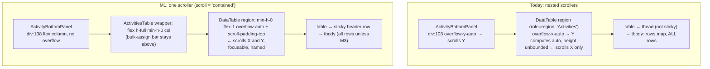
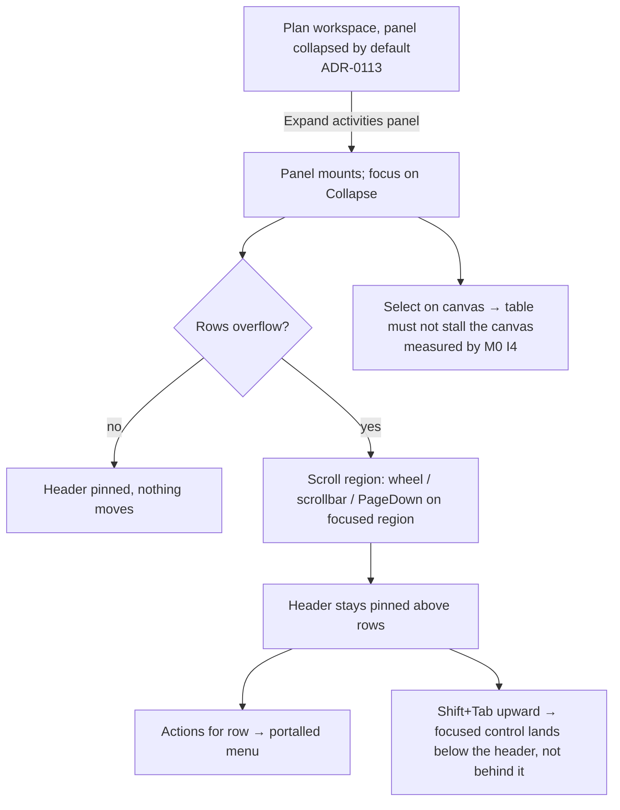

# Feature Spec: The activities panel at plan scale

- **Status:** Approved — by the product owner, 2026-09-28.
- **Author(s):** feature-analyst (Claude)
- **Date:** 2026-09-28
- **Tracking issue / epic:** `docs/TECH_DEBT.md` #334
- **Roadmap link:** none. Exempt, in the ADR-0124/ADR-0131 sense: a register row closing, with no
  new capability a planner would look for on the roadmap.
- **Related ADR(s):** ADR-0026 (the 2,000-activity ceiling), ADR-0059 (virtualized DOM rows, the
  Gantt), ADR-0066 (seed catalogue), ADR-0076 (claims carry evidence), ADR-0081 (entry point and
  journey), ADR-0088 D1 (no `VITE_` flag), ADR-0105 (why this row needs a full spec), ADR-0113
  (the panel defaults collapsed), ADR-0128 (a measurement belongs on the machine that can take it),
  ADR-0142 D4 (a remedy is measured before it is built), ADR-0146 (the `Column.width`
  vocabulary). **A new ADR is required only if M3 is armed** (outline in §4.9).

**Why a full spec for a register row.** ADR-0105 lets a `docs/TECH_DEBT.md` row stand in for
stages 1–2 only while the change adds no new surface. Pinning the header adds a prop to
`DataTable`, a shared primitive with **24 production call sites in 18 files** (`grep -n '<DataTable\b'`
over `apps/web/src`, excluding `*.test.tsx`, two structural `.ts` tests and one docblock mention).
That is "a component's public contract", which is one of ADR-0105's triggers. Virtualization, if
M0 arms it, is a second and larger change to that contract.

---

## 1. Business understanding

### Problem

The plan workspace's activities panel renders one `<tr>` for every activity in the plan, and the
code says it does not.

- **The false claim.** `components/layout/workspace/activity-bottom-panel.tsx:19-20` credits
  `ActivitiesTable` with "computed columns, variance, progress editor, CRUD, **virtualization**".
  There is none. `features/activities/components/ActivitiesTable.tsx` has no `virtual` token, and it
  hands the whole list to `DataTable` (`:950-960`), which renders every row it is given
  (`components/ui/data-table.tsx:370`, `rows.map`). **Correction to the register row:** #334 cites
  `data-table.tsx:247` for the `rows.map`. Line 247 is now the component's props block. The file
  grew and the citation drifted, so the current line is `:370`.
- **The header scrolls away.** The panel's scroller is the outer div at
  `activity-bottom-panel.tsx:108` (`min-h-0 flex-1 overflow-y-auto`). The table's `<thead>`
  (`data-table.tsx:349-368`) has no sticky treatment, so it scrolls out on the first wheel click.
  After that, a planner reading row 40 sees about 17 columns of numbers and dates with no headings.
- **The scale is the plan's, not a page's.** ADR-0026 sets the product's ceiling at **2,000
  activities × 4 dependencies** (`docs/adr/0026-tsld-canvas-rendering-and-architecture.md:23-28`).
  The seed catalogue's scale tier builds plans of that size (`apps/seed-cli/src/main.ts:144-163`).
  So a 2,000-activity plan puts ~2,000 un-virtualized rows in a box whose default height is
  **280 px** (`use-activity-panel-prefs.ts:21`). The register row says "~400 px", which is also
  corrected here. The box is resizable.

**What nobody knows, and this spec does not pretend to:** whether any of this is slow. It has
never been profiled. `docs/TECH_DEBT.md` #75 shows how this goes: on this project the alarming
reading and the reassuring reading have both been half-truths. So measurement comes first and
decides the rest (ADR-0142 D4).

There are also **three cost paths the register row does not name**. Each was found by reading, and
each is measured in M0 rather than asserted:

1. **Canvas interactions re-render the whole table.** Canvas selection lives in the workspace model
   (`use-plan-workspace-model.ts:369`). The model is returned as a fresh object literal every render
   (`:2291`). `ActivityBottomPanel` takes `model` and is not memoised, and it passes inline arrows
   (`activity-bottom-panel.tsx:122-127`). `ActivitiesTable` rebuilds its `columns` array every render
   (`ActivitiesTable.tsx:558`). **Inferred from reading, not yet observed:** with the panel expanded,
   each canvas selection re-runs every cell renderer of every row.
2. **Row interactions re-render the whole table.** The row-menu state (`ActivitiesTable.tsx:303`)
   and the bulk selection (`:300`) live in `ActivitiesTable`. Each row reads the menu state
   (`openHere`, `:866`). So opening one row's menu, or ticking one checkbox, re-renders all rows.
3. **On narrow screens the table is always mounted.** Below `md`, the workspace mounts
   `ActivityBottomPanel` in a `display: none` pane whenever the planner is on the diagram, and it
   does so deliberately so the table keeps its scroll position (`plan-workspace-toolbar.tsx:597-600`,
   `:2347-2354`). So on narrow screens the full table mounts when the workspace opens, and cost
   path 1 applies while the table is invisible. On wide screens a collapsed panel mounts nothing
   (`:2282-2283`).

### Users

The panel is on the plan workspace, which every organisation member who can open a plan reaches:
**Org Admin, Planner, Contributor, Viewer**. The **External Guest** share view does not mount
`ActivitiesTable`. Its only production consumer is `activity-bottom-panel.tsx`
(`grep '<ActivitiesTable\b'`: one non-test file). Guests are therefore unaffected.

- **Planner** on a large imported programme (an XER of hundreds to thousands of activities). Reads
  dates and float down the table, uses row actions, bulk-assigns to WBS.
- **Contributor** reporting progress from the row menu.
- **Viewer** reading the table.
- **Keyboard and screen-reader users.** For them the table's header semantics, row count and
  reachability are the table. Virtualization would change all three (§4.9).

### Primary use cases

1. Read a column's values far down a long plan and know which column is which.
2. Open the panel on a large plan without the workspace stalling.
3. Act on a row (menu, checkbox) without a visible delay.
4. Select on the canvas with the panel open, and not pay for a table the planner is not using.

### User journeys

A planner opens a 1,200-activity imported programme and expands the panel from the foot row
(`Expand activities panel`, which exists today). The panel opens and they scroll down to the
Mechanical phase. The column headings stay pinned above the rows. They open a row's Actions menu
and report progress. On the canvas they select a bar, and the canvas responds as it does with the
panel collapsed. See the user-flow diagram in §4.

### Expected outcomes

- The code says what it does. This holds whatever M0 finds.
- The columns stay labelled at every scroll position.
- M0's numbers decide, in writing and ahead of time, whether the table needs render isolation (M2),
  windowing (M3), or neither. Each outcome can be defended with a measurement.

### Success criteria

| #    | Criterion                                                                                                                                                                                                      | How it is shown                                                                                  |
| ---- | -------------------------------------------------------------------------------------------------------------------------------------------------------------------------------------------------------------- | ------------------------------------------------------------------------------------------------ |
| SC-1 | `activity-bottom-panel.tsx`'s docblock no longer claims virtualization, and states what M0 measured, with the verdict file cited                                                                               | Diff review. `check:doc-links` resolves the citation                                             |
| SC-2 | With the panel expanded and scrolled to its last row, the column headers are visible and pointer-reachable: `elementFromPoint` at a header's centre returns that header, not a row                             | M1 journey, at 1646 and 1920. Verified red against the pre-M1 structure                          |
| SC-3 | No focused control in the table is entirely hidden behind the pinned header (WCAG 2.2 §2.4.11). Checked by Shift+Tab walking upward through rows                                                               | M1 journey. Verified red with the scroll padding removed                                         |
| SC-4 | A `DataTable` that does not opt in renders the same DOM as today                                                                                                                                               | Existing `data-table*` suites pass **unedited**, plus one new case pinning the default class set |
| SC-5 | The panel has **one** scroll container, so the table's horizontal scrollbar sits at the region's visible bottom edge, not after the last row                                                                   | M1 journey reads `scrollHeight`/`clientHeight` of both elements                                  |
| SC-6 | M0's verdicts are recorded against conditions committed **before** the harness ran. The remedy milestones are armed or disarmed by the committed decision table (§4.8), never by a judgement after the numbers | `git log` order of `m0-conditions.md` against `m0-measurement.md`                                |
| SC-7 | If M2 or M3 is armed, the same harness re-measures after it lands, and every armed limb reaches PASS                                                                                                           | M2/M3 verdict files                                                                              |

### Open questions

**Critical: none.** Every design-changing choice has a default below or is decided by M0's
committed decision table. Two questions **become** critical only on specific M0 outcomes. They
are listed so nobody is surprised if they arrive:

- **CQ-A (fires only if a 2,000-row limb is INDETERMINATE).** The container cannot answer that
  limb, and the product owner does not run terminal commands (ADR-0128 Context). Options would be:
  (a) accept the container's median; (b) build a staff-console DOM-table scenario, which is new
  surface and ADR-0128's mechanism extended beyond canvas; (c) stop at M1. The default if it fires
  is (c) with the numbers recorded, but the choice belongs to the product owner.
- **CQ-B (fires only if M3 is armed).** Windowing removes off-screen rows from the DOM. Browser
  find-in-page can then no longer find them, and screen-reader browse mode cannot reach them by
  table navigation (§4.9). Is that acceptable against the measured cost? The ADR that M3 opens with
  carries this question and the numbers.

Non-critical questions, with the defaults taken:

| Question                                                               | Default                                                                                                                                                                                         |
| ---------------------------------------------------------------------- | ----------------------------------------------------------------------------------------------------------------------------------------------------------------------------------------------- |
| Should the pinned header be opt-in or on for every `DataTable`?        | **Opt-in**, and bundled with scroll ownership (§4.6). Unconditional stickiness is expected to do nothing in the other 23 call sites (§4.6, reasoned from specification, verified in M1-T1)      |
| Which CPU is judged?                                                   | **1× (unthrottled) is judged. 4× is `REPORTED_ONLY`.** The product owner's stance is "this isn't a mobile app its a desktop app" (ADR-0146, CLAUDE.md §16), and 4× is Lighthouse's mobile proxy |
| Which viewports?                                                       | **1646×1097 @ DPR 1.75** (the product owner's Surface Pro, ADR-0091) and **1920×1080 @ DPR 1** (the 24" monitor, ADR-0090). Narrow (390×844) is `REPORTED_ONLY` for cost path 3                 |
| Should `docs/TECH_DEBT.md` #334 close after M1 if M2/M3 are not armed? | **Yes**, ledgered with the M0 verdict as the closing evidence                                                                                                                                   |
| Register in `scripts/frontend-only.json`?                              | **No.** It has outlived its epic twice (#194). This epic changes no `apps/api/` or `packages/` file, and the diff shows that                                                                    |

---

## 2. Functional requirements

### User stories & acceptance criteria

> **US-1: the columns stay labelled.** As any member reading a long plan's activities, I want the
> column headings to stay visible while I scroll, so that I know which column a value is in.
>
> - **Given** a plan whose rows overflow the panel, **when** I scroll the table to any position,
>   **then** the header row is painted at the top of the table's visible area, above the rows, and a
>   pointer at a header's centre hits that header.
> - **Given** the table is wider than the panel, **when** I scroll it horizontally, **then** the
>   headers move with their columns, so a heading never sits over the wrong column.
> - **Given** bulk-assign is active (the plan has a WBS summary, `ActivitiesTable.tsx:351-352`),
>   **when** I scroll, **then** the select-all checkbox in the header stays reachable.

> **US-2: focus is never hidden under the header.** As a keyboard user moving backwards through
> the rows, I want the focused control scrolled into view below the pinned header, not behind it.
>
> - **Given** focus is on a row control below the fold, **when** I press Shift+Tab repeatedly,
>   **then** the focused element's rectangle never lies entirely inside the header's rectangle
>   (WCAG 2.2 §2.4.11, AA).

> **US-3: the panel scrolls as one region.** As a keyboard user, I want the table's labelled scroll
> region ("Activities", `data-table.tsx:339-346`) to be the thing that scrolls, so that focusing it
> and pressing Page Down moves through the rows.
>
> - **Given** the region is focused, **when** I press Page Down, **then** the rows scroll.
> - **Given** the table overflows horizontally, **then** the horizontal scrollbar is at the bottom of
>   the visible region, not at the bottom of the full list.

> **US-4: the code tells the truth.** As an engineer reading `activity-bottom-panel.tsx`, I want its
> docblock to state what the table does and what was measured, so that a false claim does not stop
> me looking.
>
> - The virtualization claim is removed. The docblock states the M0 finding and cites
>   `docs/specs/activities-panel-scale/m0-measurement.md`.

> **US-5 (conditional, armed by M0).** As a planner on a 2,000-activity plan, I want opening the
> panel, acting on a row, and selecting on the canvas with the panel open to stay inside the Core
> Web Vitals "good" interaction band (≤ 200 ms, CLAUDE.md §15), so that the workspace does not stall.
>
> - Acceptance is the M0 harness re-run after the armed remedy, with every limb that was armed
>   reaching PASS against its **unchanged** bar.

### Workflows

1. **Expand:** foot row → `Expand activities panel` → the panel mounts (the collapsed state is a
   different component, `plan-workspace-toolbar.tsx:2282-2303`) → focus moves to
   `Collapse activities panel`. This is unchanged.
2. **Scroll:** wheel, trackpad, scrollbar, or keyboard on the focused "Activities" region → rows
   move under a pinned header.
3. **Row action:** unchanged. The `Actions for <name>` menu is portalled (`Menu` primitive), so the
   pinned header's stacking cannot cover it.

### Edge cases

| Case                                                                         | Expected behaviour                                                                                                                                                                                                                                                                           |
| ---------------------------------------------------------------------------- | -------------------------------------------------------------------------------------------------------------------------------------------------------------------------------------------------------------------------------------------------------------------------------------------- |
| Empty plan                                                                   | `DataTable` renders its empty frame (`data-table.tsx:306-333`). Nothing is pinned because there is no table. Unchanged                                                                                                                                                                       |
| Loading                                                                      | The skeleton (`:245-295`) is three rows and never overflows. Contained mode leaves it as it is                                                                                                                                                                                               |
| Error                                                                        | `QueryErrorState`, unchanged                                                                                                                                                                                                                                                                 |
| Plan with fewer rows than the panel height                                   | The header is pinned but nothing moves. No visual change                                                                                                                                                                                                                                     |
| Panel resized to `PANEL_MIN_OPEN` (140 px, `use-activity-panel-prefs.ts:18`) | The header still pins. The rows area may be one or two rows tall. The scroll padding must not exceed the region's height (M1-T1 checks this at 140 px)                                                                                                                                       |
| Narrow single-pane layout (< `md`)                                           | Same contained behaviour. The pane is `display: none` until selected. When revealed, the region measures its height from the pane. M1-T3 verifies at 390 px that the region scrolls and does not overflow the pane                                                                           |
| Bulk-assign bar present                                                      | With the region scrolling, the bar (`ActivitiesTable.tsx:935-948`) sits above the region and stays in view. Today it scrolls away with the rows. This is a behaviour change, stated in the changeset: a bar about the current selection stays visible while the planner scrolls to add to it |
| Delete or dissolve returns focus to the table wrapper (`:902`, `:921`)       | Unchanged. The wrapper is `tabIndex={-1}` (`:928`) and not a scroller                                                                                                                                                                                                                        |
| Forced colours                                                               | The header's background is system-forced to `Canvas`, so rows scrolling underneath are still covered. The M1 journey takes one screenshot under `forced-colors: active` (the ADR-0146 M7 precedent)                                                                                          |

### Permissions

**No permission changes.** The panel is a read surface for any member who can open the plan. Row
actions keep their existing gates: `editorGating`, `canEditSchedule`, `canReportProgress`
(`ActivitiesTable.tsx:142-178`). **The pen (ADR-0028) is not touched.** Nothing here writes, so no
write is structural. Guests never see this table.

### Validation rules

None. No input is added.

### Error scenarios

| Scenario                                                                                  | Detection                                      | Result                                                                                            | Status |
| ----------------------------------------------------------------------------------------- | ---------------------------------------------- | ------------------------------------------------------------------------------------------------- | ------ |
| M0 harness pointed at the Vite **dev** server                                             | The page loads `/@vite/client`                 | The harness **throws**. React's development build is not what ships, and a number from it is void | n/a    |
| M0 plan not recalculated (the scale tier lands uncalculated, `docs/TEST_PLAYBOOK.md:232`) | Every `Float left` cell is `—`                 | The harness **throws** rather than measuring a cheaper table than a real one                      | n/a    |
| Rendered row count ≠ plan row count                                                       | `tbody tr` count against the API's list length | The harness **throws** (non-vacuity: it would not be measuring the un-virtualized table)          | n/a    |
| Repeat spread straddles a bar                                                             | Judge                                          | `INDETERMINATE`, and CQ-A fires                                                                   | n/a    |

---

## 3. Technical analysis

| Area           | Impact                          | Notes                                                                                                                                                                                                                                                                        |
| -------------- | ------------------------------- | ---------------------------------------------------------------------------------------------------------------------------------------------------------------------------------------------------------------------------------------------------------------------------- |
| Frontend       | **low** (M0/M1). **high** if M3 | M1: one opt-in `DataTable` prop, one class change in `ActivityBottomPanel`, and one in `ActivitiesTable`'s wrapper. M2: memoisation in the panel and `ActivitiesTable`. M3: windowing inside the shared primitive (§4.9)                                                     |
| Backend        | none                            | No API module is touched                                                                                                                                                                                                                                                     |
| Database       | none                            | No schema change, so `database-architect` is not engaged: there is nothing to design                                                                                                                                                                                         |
| API            | none                            | M0 reads `GET …/activities` and calls `POST …/schedule/recalculate` as an ordinary client                                                                                                                                                                                    |
| Security       | none                            | No new data, route or permission. M0 seeds through the public REST API (ADR-0066)                                                                                                                                                                                            |
| Performance    | **the subject**                 | M0 measures expand, scroll and interaction latency at 500 and 2,000 rows. The bars are pre-existing targets: CWV "good" INP ≤ 200 ms (CLAUDE.md §15), and ADR-0026 §9's fps floors (≥ 45 @ 500, ≥ 30 @ 2,000). Neither is invented for this epic                             |
| Infrastructure | none                            | No CI step and no Playwright config. The M1 journey joins the existing `e2e-workspace-chrome` suite. M0's harness is a script, not a gate: ADR-0128 D1's "no CI gate for performance" applies in spirit                                                                      |
| Observability  | none                            |                                                                                                                                                                                                                                                                              |
| Testing        | medium                          | M1: a unit case for the default DOM, a structural case for the contained contract, and the journey (SC-2, SC-3, SC-5, verified red). The 21 existing test files that mount `ActivitiesTable` act as the before/after oracle and must pass **unedited**. M3 adds a lot (§4.9) |

**Parity and constraints (CLAUDE.md "constraints that shape every spec"):**

- **Recalc parity gate:** `computeSchedule` is not imported and no scheduling input is added. It is
  untouched by construction.
- **Multi-tenancy/roles:** as §2 Permissions. No change.
- **Pen:** no write, so no structural write.
- **No `VITE_` flag** (ADR-0088 D1). Every published image carries every flag at its default. The
  rollback is the commit boundary: M1 lands as one revertible commit.
- **Entry point (ADR-0081):** M0 ships dark (measurement only). M1's entry point is the workspace
  foot row → `Expand activities panel` → the "Activities" region, and its journey lands with M1.

### Dependencies

- **Existing and reused:** `@tanstack/react-virtual` `^3.14.13` (`apps/web/package.json:81`), used by
  the Gantt (`GanttPanel.tsx:569-575`) and by the Project Explorer's `HierarchyTree`. **No new
  dependency in any milestone.**
- **Seed catalogue** scale tier at `--activities 500` and `--activities 2000`
  (`apps/seed-cli/src/specs.ts:33-41`). At the default throttle a 2,000 plan takes tens of minutes to
  seed. The seeder says so and points at `RATE_LIMIT_LIMIT` (`apps/seed-cli/src/main.ts:144-163`),
  which M0 raises on the measuring instance only.
- **A production build** served by `vite preview`, with the API from `scripts/e2e-local.sh`'s stack.
  The dev server is refused (§2 Error scenarios).
- M1 depends on M0 only for the docblock text. The sticky header does not wait for any verdict.

---

## 4. Solution design

### 4.1 Architecture overview: who owns the scroll

**Today there are two scroll containers, and the one that scrolls vertically is not the one with a
name.** The labelled "Activities" region (`data-table.tsx:339-346`) is `overflow-x-auto`. In CSS,
setting one axis's `overflow` to a non-`visible` value makes the other axis compute to `auto`
(CSS Overflow 3 §3, "visible computes to auto"). So the region is a scroll container on **both**
axes, but it never scrolls vertically, because nothing bounds its height. The outer div at
`activity-bottom-panel.tsx:108` does the vertical scrolling.

**Two consequences follow, both reasoned from specification and both verified in a browser in
M1-T1 before any fix is built:**

1. **`position: sticky` on the `<thead>` or `<th>` would do nothing.** A sticky box sticks within
   its nearest scrollport, which is the region. The region never scrolls vertically, so the header
   would scroll away with the outer div exactly as it does now. **This is why "just add `sticky
top-0`" is not a fix.** It would type-check, pass every unit suite (jsdom has no layout), and
   change nothing a planner can see.
2. **The horizontal scrollbar sits after the last row.** If the table overflows horizontally, the
   region's scrollbar is drawn at the region's bottom edge, which is below row 2,000. M0-T3 records
   whether the table overflows at 1280, 1646 and 1920.

**The fix is the Gantt's rule, reused:** one scroll container, owning both axes, with the header
pinned inside it. `GanttPanel.tsx:358-362`: "Grid and bars live in ONE scroll container … no
second scroller". Its header is `bg-background sticky top-0 z-20` (`:1072`).



### 4.2 Data flow: the M0 harness

```mermaid
sequenceDiagram
  participant H as measure-activities-panel.mjs
  participant S as seed-cli (public REST)
  participant API as API
  participant B as Chromium (prod build via vite preview)
  H->>S: --tier scale --activities 500 / 2000 (RATE_LIMIT_LIMIT raised)
  S->>API: POST activities / dependencies / assignments …
  H->>API: POST …/schedule/recalculate (the scale tier lands uncalculated)
  H->>B: open workspace at 1646@1.75 and 1920@1; refuse if /@vite/client is loaded
  loop 7 repeats × {1×, 4×} CPU
    H->>B: E1 click "Expand activities panel", Event Timing duration + CDP metrics delta
    H->>B: assert tbody rows == API row count, Float-left not all "—" (non-vacuity)
    H->>B: S1 synthesizeScrollGesture on the region/scroller, rAF intervals + long tasks
    H->>B: I2 tick a checkbox at row ~N/2, I3 open that row's Actions menu
    H->>B: I4 listbox ArrowDown (canvas selection), panel expanded vs collapsed
  end
  H->>H: judge against m0-conditions.md, print PASS/FAIL/INDETERMINATE/REPORTED_ONLY
```

### 4.3 User flow



### 4.4 Database changes

None.

### 4.5 API changes

None.

### 4.6 Component changes

**`DataTable` (`components/ui/data-table.tsx`) gains one opt-in prop, which binds scroll ownership
and the pinned header together:**

- `scroll?: 'page' | 'contained'`, default `'page'`.
  - **`'page'` is today's DOM, byte for byte** (SC-4). The region stays `overflow-x-auto` and the
    header is not sticky.
  - **`'contained'`**: "this table owns its vertical scroll". The region fills its parent
    (`min-h-0 flex-1` or `h-full`, chosen in M1-T1 by what resolves in both panel layouts) and scrolls
    both axes. The header row pins to the top of the region with a background from the current
    surface scope's `bg-background`, which is the Gantt's token at `GanttPanel.tsx:1072`. The region
    gets `scroll-padding-top` at a Tailwind scale step no smaller than the measured header height
    (US-2 / §2.4.11). **No arbitrary values**, so the ADR-0097 sizing ratchet does not rise.
- **Why one prop and not `stickyHeader: boolean`.** A sticky header only works inside a scroller the
  table owns (§4.1). A separate boolean would offer a lit-but-inert option: `stickyHeader` without
  the scroll would type-check and do nothing, which is ADR-0064 §7's dead-end shape in a prop.
  Binding the two makes the inert combination unrepresentable.
- **Why opt-in rather than on for everyone.** The other 23 call sites sit in page flow or in
  dialogs, and none of them bounds the region's height. For all of them, **a sticky header would be
  inert** (§4.1, point 1). Turning it on everywhere would buy nothing and would put a stacking
  context and a background into 23 tables that do not need them. `ActivitiesTable` is the only
  consumer inside a height-capped pane.
- **The header rule while pinned.** Tailwind v4's Preflight sets `border-collapse: collapse` on
  tables. The header's rule is a `border-b` on the `<tr>` (`data-table.tsx:350`). Whether a
  collapsed-model row border travels with sticky cells is **engine-dependent and not established
  here**. M1-T1 photographs it in Chromium, Firefox and WebKit before choosing between two
  pre-costed options: (a) in contained mode only, `border-separate border-spacing-0` with the rule
  on each `th` and row rules on each `td`, composed with the caller's `cellClassName` the way
  `width` already composes (`data-table.tsx:125-132`); or (b) keep collapse and draw the header
  rule on the `th`, if all three engines carry it. Option (a) is the default if any engine fails (b).
- **Sticky on `<thead>` or on each `<th>`.** M1-T1 decides by the same three-engine check. Per-`th`
  stickiness has the widest support and is the default.

**`ActivitiesTable`** passes `scroll="contained"`, and its wrapper (`ActivitiesTable.tsx:928`) gains
`h-full min-h-0` so the region can fill it. **`ActivityBottomPanel`** stops scrolling at `:108`:
that div keeps its padding and becomes a flex column with no overflow of its own. The docblock at
`:13-23` is corrected (SC-1).

**Loading, empty, error and success states:** unchanged (§2 Edge cases).

**Documentation:** `docs/DESIGN_SYSTEM.md:735` ("Tables (DataTable)") gains the `scroll` prop and
when to use it. `docs/TECH_DEBT.md` #334 is rewritten or closed.

### 4.7 Implementation approach and alternatives

**Chosen approach: measure, then pin the header with one scroller, then remedy only what M0
arms.**

Alternatives considered:

| Alternative                                                                           | Why not                                                                                                                                                                                                                                                                                                                                                                                                                                         |
| ------------------------------------------------------------------------------------- | ----------------------------------------------------------------------------------------------------------------------------------------------------------------------------------------------------------------------------------------------------------------------------------------------------------------------------------------------------------------------------------------------------------------------------------------------- |
| Add `sticky top-0` to `DataTable`'s `thead` unconditionally                           | Inert (§4.1). It would pass every jsdom suite and fix nothing                                                                                                                                                                                                                                                                                                                                                                                   |
| Make the outer div the only scroller by setting the region to `overflow-x: clip`      | `clip` does not create a scroll container, so the header would stick to the outer div, but horizontal scrolling of a ~17-column table would be lost (WCAG 1.4.10's data-table exception still expects the content to be reachable)                                                                                                                                                                                                              |
| A second header rendered outside the table, synchronised by scroll listener           | This is the two-scroller design the Gantt's docblock records rejecting because it desyncs on momentum scroll (`GanttPanel.tsx:358-362`). It also duplicates header semantics                                                                                                                                                                                                                                                                    |
| Virtualize now, without measuring                                                     | This is what ADR-0142 D4 exists to stop, and it carries the largest accessibility cost of anything here (§4.9)                                                                                                                                                                                                                                                                                                                                  |
| Use the ADR-0128 staff probe for M0                                                   | That probe renders synthetic **canvas** scenes under a `StaffPrincipal` that structurally cannot reach a plan (ADR-0128 D3). Mounting this table there is a new staff-console scenario, which is new surface. It is kept as CQ-A's option (b), not M0's instrument                                                                                                                                                                              |
| CSS `content-visibility: auto` on rows to skip off-screen layout without removing DOM | **Reasoned from specification:** CSS Containment 2 does not apply size or layout containment to internal table boxes (rows, row groups), and `content-visibility` depends on that containment, so the property is expected to be a no-op on `<tr>`. It would also do nothing for React render cost. It is not pursued. If M0's attribution shows layout dominating, it can be checked in one `addStyleTag` line before it is dismissed for good |

### 4.8 M0's committed decision table (copied verbatim into `m0-conditions.md` before the harness runs)

**Environment.** Production build. Viewports 1646×1097 @ DPR 1.75 and 1920×1080 @ DPR 1. Plans
`scale-500` and `scale-2000`, recalculated. Panel at its default 280 px. 7 repeats per limb. CPU
1× judged and 4× `REPORTED_ONLY`. The header records commit, Chromium version, headless flag,
`navigator.hardwareConcurrency`, viewport, DPR and rendered row count.

| Limb                      | Measure                                                                                                                                                                                                                 | Bar (source)                                                             |
| ------------------------- | ----------------------------------------------------------------------------------------------------------------------------------------------------------------------------------------------------------------------- | ------------------------------------------------------------------------ |
| **E1** expand             | Event Timing `duration` of the `Expand activities panel` click. This includes presentation to the next paint, and so covers the synchronous mount of every row                                                          | ≤ 200 ms: CWV "good" INP (CLAUDE.md §15)                                 |
| **S1** scroll             | Mean fps and dropped-frame % from rAF intervals across a 3 s `Input.synthesizeScrollGesture` over the scroller, with long tasks recorded                                                                                | ≥ 45 fps @ 500, ≥ 30 fps @ 2,000 (ADR-0026 §9, the same surface's floor) |
| **I2** checkbox           | Event Timing on a row checkbox toggle at row ≈ N/2                                                                                                                                                                      | ≤ 200 ms                                                                 |
| **I3** row menu           | Event Timing on `Actions for <name>` at row ≈ N/2                                                                                                                                                                       | ≤ 200 ms                                                                 |
| **I4** canvas selection   | Event Timing on ArrowDown in the diagram's activity listbox (`TsldPanel.tsx:3444-3466`), panel **expanded**. The same measure with the panel **collapsed** is the control, and the delta is reported as the panel's tax | ≤ 200 ms absolute. The delta is `REPORTED_ONLY`                          |
| **N1** narrow open        | Workspace-open long-task total at 390×844 with the hidden pane mounted (cost path 3)                                                                                                                                    | `REPORTED_ONLY`                                                          |
| **A** attribution         | CDP `Performance.getMetrics` deltas (`ScriptDuration`, `LayoutDuration`, `RecalcStyleDuration`) around each limb                                                                                                        | `REPORTED_ONLY`. It chooses the remedy family, and never a verdict       |
| **X** horizontal overflow | Region `scrollWidth` against `clientWidth` at 1280, 1646 and 1920                                                                                                                                                       | Fact, recorded                                                           |

**Verdicts** use ADR-0128 D4's four values. `PASS` or `FAIL` when the 7-run range lies wholly on one
side of the bar. `INDETERMINATE` when the range straddles the bar, or when the spread exceeds 50 %
of the bar. The judge **throws** on any non-vacuity failure (§2 Error scenarios).

**Honest limits, stated in the conditions file.** S1's rAF pacing is a main-thread proxy. A PASS
shows the main thread is free during scroll. It does **not** show there is no checkerboarding,
which a headless rasteriser cannot observe (ADR-0128 D1). The container's CPU relative to the
product owner's Surface Pro is **unknown**, and that is why the spread limb exists. D1's
disqualification was measured for Canvas 2D rasterisation. DOM scripting and layout are
CPU-bound, so that finding is expected to transfer less, but this is **reasoned, not
established**, and the spread settles it.

**Prediction, committed so it can be wrong:** at 2,000 rows, S1 passes, because there are no
scroll listeners today, and E1 fails. I2, I3 and I4 are genuinely unknown. The measured slope
between 500 and 2,000 is the effect-size estimate for windowing, which would render about 30 rows
whatever the plan size, so M3's benefit is predicted before M3 is built (ADR-0142 D4).

**Decision table (arms the remedy milestones; nobody re-argues it afterwards):**

| M0 outcome at 2,000 rows, 1× CPU                 | Next                                                                                                                                                                              |
| ------------------------------------------------ | --------------------------------------------------------------------------------------------------------------------------------------------------------------------------------- |
| Every judged limb PASS                           | **M1 only.** #334 closes with the numbers. M2 and M3 are recorded as _not armed, on measurement_                                                                                  |
| E1 and S1 PASS, and any of I2/I3/I4 FAIL         | **M1, then M2** (render isolation), then re-measure. M3 is armed only if a limb still FAILs after M2                                                                              |
| E1 FAIL or S1 FAIL                               | **M1, then M3** (windowing, **ADR first**, CQ-B). M2 as well if I4 FAILs, because windowing reduces rows re-rendered but does not stop the panel re-rendering on canvas selection |
| Any judged limb INDETERMINATE                    | **M1 only, then stop.** CQ-A goes to the product owner with the numbers                                                                                                           |
| Only 500-row limbs or `REPORTED_ONLY` limbs fail | Not reachable for 500 without 2,000 also failing. `REPORTED_ONLY` limbs arm nothing and are recorded                                                                              |

### 4.9 If M3 is armed: where windowing lives, and what it costs (the ADR outline)

**Location: `DataTable`, opt-in, and only inside `scroll="contained"`.** It cannot live in
`ActivitiesTable` alone. `DataTable` owns the `<table>` markup, the four states, the region
semantics and the ADR-0146 width vocabulary. An `ActivitiesTable`-only windowed table would be a
second table implementation, and two implementations drifting apart invisibly is the most-recorded
failure shape in this repository. Windowing needs a bounded scroller, which `'contained'` is, so M1
lays the precondition whatever M0 says. The mode would be refused with `renderDetail`
(`data-table.tsx:231`), because variable-height detail rows defeat a fixed row estimate, and
`ActivitiesTable` does not use `renderDetail`.

**Mechanism: reuse `@tanstack/react-virtual`'s `useVirtualizer`**, the Gantt's mechanism
(`GanttPanel.tsx:569-575`, `overscan: 12`, `initialRect` so jsdom and first paint have a window).
**The rendering shape is not the Gantt's.** The Gantt is a div `treegrid` with absolutely positioned
rows (`:1059-1061`, `:1201-1207`). `DataTable` would keep a **native `<table>`** with a top and a
bottom spacer row (`aria-hidden`, height from the virtualizer), so `<th scope="col">` association
and the table's native semantics survive. Converting to a grid would be ADR-level on its own:
`DataTable` deliberately is not a treegrid (`data-table.tsx:391-393`).

**The decisions the ADR must make, with the costs each carries:**

1. **Column widths.** With `table-layout: auto`, a table sizes its columns from the rows that
   exist. Once rows are windowed, a longer name scrolling into view widens `Name` and shifts every
   column while the planner reads. The options are `table-layout: fixed` with widths frozen from the
   first measured window, or declared per-column widths in windowed mode. Either **conflicts with
   ADR-0146's content-derived `fit`** (`data-table.tsx:40-49`) for this one table. The ADR must say
   which gives way.
2. **Row count and position.** `aria-rowcount` on the `<table>` (total rows + 1 for the header) and
   `aria-rowindex` on each rendered `<tr>`, the pattern the Gantt already uses (`:1061`, `:1348`).
   **Reasoned from ARIA 1.2, not observed:** NVDA and JAWS in Chromium honour `aria-rowcount` on a
   table, and VoiceOver support is partial. The ADR carries the ADR-0083/ADR-0122 label
   "reasoned from specification, not observed with a screen reader" until somebody tests it.
3. **Keyboard.** Tab order through the rows' checkboxes and `Actions` buttons works
   **incrementally**. Focusing the last rendered row's control scrolls it into view, which moves the
   window, and `overscan` keeps the next rows rendered before the next Tab. **This is a claim about
   event timing in a real browser, and it must be a journey:** Tab forward through 60 rows reaches
   row 60, and Shift+Tab walks back to row 1, both without focus leaving the table. There is no
   grid conversion and no roving tabindex. If the journey shows Tab escaping the table, that is the
   ADR's blocking finding.
4. **Find-in-page is lost for off-window rows, and screen-reader browse mode cannot reach them by
   table navigation.** Both are real regressions (CQ-B). The mitigation that exists today is the
   canvas's search (ADR-0079), which finds by name and selects. The panel has no text filter, and
   adding one is new surface outside this epic. Precedent worth putting beside the cost: the
   diagram's parallel listbox already renders **every** activity to the DOM, un-windowed and always
   mounted (`TsldPanel.tsx:3477-3497`). The product has already chosen full-DOM reachability for AT
   on its primary surface.
5. **The React Compiler's lint analysis bails out of any component that calls `useVirtualizer`.**
   `GanttPanel.tsx:621-628` records that bail-out skipping the whole component and costing a caught
   defect. Putting the hook in `DataTable` would take a **shared primitive** out of that analysis's
   sight for all 24 call sites. The ADR must either isolate the hook in a child component that only
   the windowed mode renders, which is the default, or accept the blind spot.
6. **Tests.** jsdom renders only the initial window (`test/setup.ts:62-76` stubs `ResizeObserver`
   and `scrollTo`). Any of the 21 test files that mount `ActivitiesTable` that asserts on a row past
   `initialRect.height / rowHeight + overscan` would break. The ADR states the policy: small fixtures
   stay under the window, and anything larger opts out through a test-only row budget, never
   through a production flag.
7. **Journeys.** 17 journey files call `getByRole('row', …)` (`grep -c` over `apps/web/e2e*`).
   Not all of them target this table: the Gantt, staff and library suites are among them. Their
   fixtures are small, but a full sweep (`scripts/e2e-sweep.sh`) is mandatory before release.

This outline is not a decision. It is what the ADR would have to decide, written now so that
arming M3 does not start from nothing.

---

## 5. Links

- Implementation plan: [`./implementation-plan.md`](./implementation-plan.md)
- Register row: `docs/TECH_DEBT.md` #334
- Docs to update by milestone: `docs/DESIGN_SYSTEM.md` (Tables), `docs/TECH_DEBT.md` (#334), a
  changeset (`web`, patch: the pinned header is user-visible), and `docs/TEST_PLAYBOOK.md` only if
  M0 finds a `scale-2000` behaviour worth a row. **If M3 is armed:** a new ADR, the §16 entry in
  `CLAUDE.md` (gated by `check:adr-coverage`), `docs/adr/README.md`, and `docs/ROADMAP.md`'s
  exemptions.
