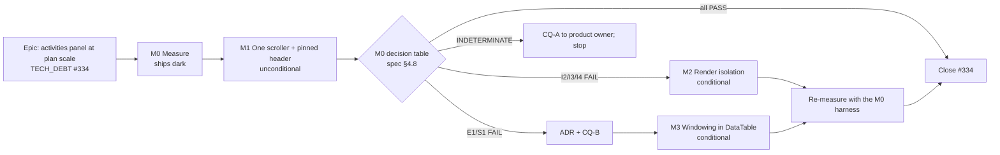

# Implementation Plan: The activities panel at plan scale

- **Feature spec:** [feature-spec.md](./feature-spec.md)
- **Status:** Draft — awaiting approval before implementation
- **Owner:** web

## Breakdown

### Epic

**The activities panel at plan scale.** Close `docs/TECH_DEBT.md` #334: make the code tell the
truth, keep the columns labelled at any scroll position, and change the table's rendering only
where a measurement committed in advance says it must. Maps to no roadmap theme. It is a register
row with a public-contract change (ADR-0105).

---

### Milestone M0: Measure before designing (shippable slice)

**Outcome:** the question #334 leaves open ("is it actually slow?") has a recorded answer at 500
and 2,000 activities, against bars committed before the harness existed. The false virtualization
docblock is corrected, and the correction states the finding.
**Entry point:** `Ships dark: measurement only. The one product-file change is a docblock. M1
surfaces the first user-visible change.`
**Journey:** none required. No capability is claimed (ADR-0081 §1).

---

#### Feature M0-F1: Committed conditions and a harness

> **Description:** the falsification conditions and the decision table (spec §4.8), then a
> Playwright measurement script that judges against them.
> **Complexity:** M
> **Dependencies:** none
> **Risks:** the container cannot answer (ADR-0128 D1). **Mitigation:** the spread limb, the
> `INDETERMINATE` verdict, and CQ-A. A harness that measures the wrong artefact (dev build,
> uncalculated plan, a table that is not the full one). **Mitigation:** the three non-vacuity refusals.
> **Testing requirements:** the harness's judge is a pure function with a `*.test.mjs` beside it.
> The refusals and the four verdicts are each verified red against a named mutation (ADR-0110 D5).

##### M0-T1: Commit the conditions first (≈ one commit, **its own commit**)

- **Description:** `docs/specs/activities-panel-scale/m0-conditions.md` copies spec §4.8 verbatim:
  environment, limbs, bars with their sources, verdict rule, non-vacuity refusals, honest limits,
  the committed prediction, and the decision table. This commit precedes any harness code in
  `git log`, which is SC-6's evidence and ADR-0128's ordering.
- **Complexity:** S
- **Dependencies:** spec approval
- **Risks:** a bar written to the answer. **Mitigation:** every judged bar cites a pre-existing
  source (CLAUDE.md §15 CWV "good"; ADR-0026 §9 fps floors). None is invented here.
- **Testing:** none (a document).
- **Development steps:**
  1. Copy §4.8. Add the commit hash of `main` the harness will run against.
  2. Commit alone: `docs(docs): commit activities-panel M0 falsification conditions`.

##### M0-T2: `apps/web/scripts/measure-activities-panel.mjs`

- **Description:** a Playwright script in the shape of `measure-page-density.mjs` (sign-in, then
  public-API calls from the page) and the `measure-revision-diff.mjs` judge-first discipline.
  1. **Refuses the dev server.** It throws if any loaded script URL contains `/@vite/client`. The
     documented invocation is `pnpm --filter @repo/web build && pnpm --filter @repo/web preview`,
     against the API from `scripts/e2e-local.sh`'s stack. That script refuses to run with anything
     already on 3000/5173 (ADR-0099), so stop stray servers first.
  2. **Seeds or reuses** `scale-500` and `scale-2000` through `schedulepoint-seed --tier scale
--activities N`, with `RATE_LIMIT_LIMIT` raised on the measuring instance only
     (`apps/seed-cli/src/main.ts:144-163`). Then it calls `POST …/schedule/recalculate`, because the
     tier lands uncalculated (`docs/TEST_PLAYBOOK.md:232`).
  3. **Contexts:** 1646×1097 @ `deviceScaleFactor: 1.75`, 1920×1080 @ 1, and 390×844 for N1. CPU at
     1× and 4× through CDP `Emulation.setCPUThrottlingRate`.
  4. **Limbs E1, S1, I2, I3, I4, N1, A, X** exactly as §4.8. Event Timing through
     `PerformanceObserver({ type: 'event', durationThreshold: 16, buffered: true })`. Attribution
     through CDP `Performance.getMetrics` deltas. S1 through CDP `Input.synthesizeScrollGesture`
     (experimental; if it is unavailable, fall back to in-page `scrollBy` per rAF, and the output
     names which path ran).
  5. **Non-vacuity refusals:** rendered `tbody tr` count against the API list length, and
     `Float left` cells not all `—`. The refusals throw; they never judge.
  6. **Waits for network idle** between limbs, so a background refetch of the shared activities
     query cannot land inside a measured window.
  7. **Output:** environment header, per-limb median, min, max and spread, verdict, and a
     paste-ready block for `m0-measurement.md`. The docblock states where the harness bypasses the
     product (ADR-0081 §3). Here that is only the seeding, which uses the public API.
- **Complexity:** M
- **Dependencies:** M0-T1
- **Risks:** Event Timing drops interactions under 16 ms, which would read as "no entry".
  **Mitigation:** a missing entry is recorded as `< 16 ms` and never as 0 or as a failure.
- **Testing:** `measure-activities-panel.judge.test.mjs` covers PASS, FAIL, INDETERMINATE
  (straddle), INDETERMINATE (spread > 50 %), and throw-on-empty. Each is verified red.
- **Development steps:**
  1. Write the pure judge and its tests first.
  2. Write the browser driver. Dry-run it against a small plan to prove every limb produces an entry.
  3. Record the ids of the two seeded plans in the output so a re-run reuses them.

#### Feature M0-F2: The reading, and the truth in the code

> **Description:** run the harness, record verdicts, correct the docblock and the register row.
> **Complexity:** S
> **Dependencies:** M0-F1
> **Risks:** the reading is taken in the container and quoted as if it were the Surface Pro.
> **Mitigation:** the measurement file's first paragraph names the machine, and the docblock cites
> the file rather than restating numbers.
> **Testing requirements:** `pnpm prepush` (the docblock is prose, but `check:doc-links` must
> resolve the new citation).

##### M0-T3: Take the reading

- **Description:** run 7 repeats per limb. Write `m0-measurement.md` with the harness's block, the
  decision-table row that applies, and whether the committed prediction held. Record limb X
  (horizontal overflow) as a fact at 1280, 1646 and 1920.
- **Complexity:** S
- **Dependencies:** M0-T2
- **Risks:** a surprising number tempts a re-read of the bar. **Mitigation:** the bars are
  committed, and the decision table is applied mechanically. A disagreement goes into the file as a
  finding and never as an amended bar (ADR-0128 D5's reasoning: a threshold changed afterwards
  reinterprets history).
- **Testing:** n/a
- **Development steps:**
  1. Run it. Paste the block.
  2. Name the armed milestones, or state "M2 not armed, M3 not armed, on measurement" with the
     figures.
  3. If any judged limb is INDETERMINATE, **stop after M1** and raise CQ-A.

##### M0-T4: Correct the docblock and the register row

- **Description:** at `activity-bottom-panel.tsx:19-20`, remove "virtualization". State that
  `ActivitiesTable` renders every row through `DataTable`, cite `m0-measurement.md`, and give the
  verdict in one sentence. Rewrite `docs/TECH_DEBT.md` #334: fix the stale `data-table.tsx:247`
  citation (now `:370`) and the "~400 px" height (default 280 px,
  `use-activity-panel-prefs.ts:21`), and add the M0 finding with the armed milestones.
- **Complexity:** S
- **Dependencies:** M0-T3
- **Risks:** none material.
- **Testing:** `pnpm prepush`.
- **Development steps:**
  1. Edit the docblock. No code change.
  2. Edit #334. Its `**Verified:**` date becomes the M0 date.

---

### Milestone M1: One scroller and a pinned header (shippable slice, unconditional)

**Outcome:** with the panel expanded, the column headings stay pinned while the rows scroll. The
table's named "Activities" region is the panel's only scroller. The horizontal scrollbar is at the
visible bottom edge. A focused row control is never hidden behind the header.
**Entry point:** plan workspace → foot row → **`Expand activities panel`** → the **"Activities"**
region (`role="region"`, `data-table.tsx:339-346`).
**Journey:** `apps/web/e2e-workspace-chrome/activities-panel-scroll.spec.ts`, in the existing suite.
This is **not** a new Playwright config, so it adds no ADR-0105 trigger and no `ci.yml` step, and
`check:e2e-roster` is unaffected. The spec seeds about 60 activities through the API, expands the
panel with `showActivities` (`apps/web/e2e/workspace.ts:32-38`), and asserts SC-2, SC-3 and SC-5.

---

#### Feature M1-F1: `DataTable` `scroll` prop

> **Description:** `scroll?: 'page' | 'contained'` (spec §4.6). `'page'` is byte-identical.
> `'contained'` makes the region the single two-axis scroller, pins the header, and applies
> `scroll-padding-top`.
> **Complexity:** M
> **Dependencies:** none. It may land in parallel with M0, but merges after M0-T4 so the docblock
> and the behaviour change do not cross.
> **Risks:** (1) the collapsed-border rule does not travel with sticky cells in some engine.
> **Mitigation:** the M1-T1 three-engine check chooses between the two pre-costed options. (2)
> Sticky on `<thead>` is unsupported somewhere. **Mitigation:** sticky per `<th>` by default. (3)
> The sizing ratchet rises. **Mitigation:** scale utilities only, no arbitrary values.
> **Testing requirements:** the existing `data-table*` suites pass **unedited** (SC-4). A new unit
> case pins the `'page'` class set. A new case pins that `'contained'` emits the region and header
> classes. **Verified red** against a copy where the region keeps `overflow-x-auto`.

##### M1-T1: Verify the premise in a browser, then build (≈ one PR with M1-T2)

- **Description:** before writing the prop, confirm spec §4.1's two specification-reasoned claims
  in Chromium with a throwaway probe (not committed): (a) `sticky top-0` on the current structure
  does not pin, which is the verified-red baseline for the journey; (b) with the region as the
  scroller it does pin. Then photograph the header rule while pinned in Chromium, Firefox and WebKit
  (Playwright's configured projects), and pick option (a) or (b) from §4.6. Measure the header's
  height and pick the smallest Tailwind `scroll-pt-*` step at or above it. Check that step against
  the region's height at `PANEL_MIN_OPEN` (140 px).
- **Complexity:** M
- **Dependencies:** none
- **Risks:** a premise found false. **Mitigation:** if (a) pins after all, the spec's §4.1 is
  corrected in place with the probe's output, and M1 shrinks to a single class. The finding is
  recorded rather than smoothed over.
- **Testing:** as for the feature.
- **Development steps:**
  1. Probe (a) and (b). Paste the results into `docs/specs/activities-panel-scale/m1-premise.md`.
  2. Add the prop and its docblock, which says why the header and the scroll are one prop (§4.6).
  3. Make the header row pinned with the current scope's `bg-background` (the Gantt's token,
     `GanttPanel.tsx:1072`) and an explicit stacking order.
  4. Add the unit and structural cases.
  5. Update `docs/DESIGN_SYSTEM.md:735` (Tables): what `contained` means and when to use it (a
     table inside a height-capped pane).

#### Feature M1-F2: Adopt it in the panel

> **Description:** `ActivitiesTable` passes `scroll="contained"`, and its wrapper
> (`ActivitiesTable.tsx:928`) fills its parent. `ActivityBottomPanel`'s `:108` div stops
> scrolling. The bulk-assign bar now stays above the scrolling rows (a stated behaviour change).
> **Complexity:** S
> **Dependencies:** M1-F1
> **Risks:** the height chain breaks in the narrow single-pane layout (`plan-workspace-toolbar.tsx:2347`,
> a `block` pane), and the region then overflows its pane instead of scrolling. **Mitigation:** the
> journey asserts the region scrolls at 390 px as well as at 1646 and 1920.
> **Testing requirements:** all 21 test files that mount `ActivitiesTable` pass **unedited**. They
> are the before/after oracle, because jsdom has no layout and the rows they assert on are unchanged.

##### M1-T2: Wire the panel

- **Description:** as the feature.
- **Complexity:** S
- **Dependencies:** M1-T1
- **Risks:** as above.
- **Testing:** existing suites unedited, plus `pnpm prepush`.
- **Development steps:**
  1. `ActivitiesTable`: pass `scroll="contained"`. Give the wrapper `h-full min-h-0` in a flex column.
  2. `ActivityBottomPanel` `:108`: remove `overflow-y-auto` and make it a flex column that passes its
     height through.
  3. Extend the corrected docblock (M0-T4) with one sentence on the single scroller.

##### M1-T3: The journey

- **Description:** `activities-panel-scroll.spec.ts` in `e2e-workspace-chrome`.
  - **SC-2:** scroll the region to its end. Then `elementFromPoint` at the centre of the `Name`
    columnheader returns that header, not a row cell. Asserted on **pointer reachability, not box
    presence**: ADR-0114 M1 shipped a control whose box was right and which could not be reached.
  - **SC-3:** focus the `Actions for` button of the last row, press Shift+Tab 15 times, and after
    each press assert the focused element's rectangle does not lie entirely inside the header's
    rectangle.
  - **SC-5:** the outer `:108` div has `scrollHeight === clientHeight`, and the region has
    `scrollHeight > clientHeight`.
  - Run at 1646 and 1920. Repeat the region-scrolls assertion at 390 on the Activities pane.
  - Run an axe scan on the expanded panel, and take one screenshot under `forced-colors: active`.
- **Complexity:** M
- **Dependencies:** M1-T2
- **Risks:** a journey that passes against the old structure. **Mitigation:** **verified red**. SC-2
  fails with M1-F2 reverted, and SC-3 fails with the scroll padding removed. Both red runs are
  recorded in the PR.
- **Testing:** the journey is the test. Run `scripts/e2e-local.sh web:workspace-chrome`, then the
  base journey (`web`), because a screen changed (`docs/TESTING.md`, ADR-0096's rule).
- **Development steps:**
  1. Seed about 60 activities through the API (enough to overflow a 280 px panel at every width).
  2. Write the assertions. Verify each one red.
  3. Run the full sweep (`scripts/e2e-sweep.sh`), because the panel's DOM moved and journeys locate
     rows inside it.

##### M1-T4: Review, re-measure, docs, changeset

- **Description:** run **accessibility-reviewer** and **component-reviewer** on the diff **before
  release**. This is §19.13: a shared primitive's scroll and focus behaviour changes, and
  `scroll-padding` interacting with focus scrolling is exactly the class that jsdom cannot see. Then
  re-run the M0 harness on the M1 build as a regression oracle. One scroller instead of two must not
  worsen S1 or E1 by more than the committed spread; this is recorded, not re-judged. Add a `web`
  changeset (patch): pinned column headings, and the bulk-assign bar stays in view. If M2 and M3 are
  not armed, close #334 and ledger it with M0's verdict as the closing evidence.
- **Complexity:** S
- **Dependencies:** M1-T3
- **Risks:** reviewers find a blocking defect. **Mitigation:** fold it with a regression test
  verified red first, before release.
- **Testing:** `pnpm prepush`, `scripts/e2e-local.sh web:workspace-chrome`, and `web`.
- **Development steps:**
  1. Run the two reviewers and fold their findings.
  2. Re-run the harness and append to `m0-measurement.md` under "after M1".
  3. Write the changeset. Update #334 (close, or rewrite to the armed remainder).

---

### Milestone M2 (conditional, armed only by spec §4.8): Render isolation

**Outcome:** acting on a row, or selecting on the canvas with the panel open, stays at or under
200 ms at 2,000 activities.
**Entry point:** unchanged from M1 (no new surface). The journey is M1's, plus the harness re-run.
**Armed if:** E1 and S1 PASS and any of I2, I3 or I4 FAIL. **Not built otherwise, and recorded as
not armed.**

#### Feature M2-F1: The panel stops re-rendering on workspace renders (fixes I4)

> **Description:** `ActivityBottomPanel` receives narrowed, stable props instead of the whole `model`
> (a fresh object each render, `use-plan-workspace-model.ts:2291`) and is memoised. Its callbacks are
> stabilised (the inline arrows at `activity-bottom-panel.tsx:122-127`). The React Compiler is not
> wired into the build (`GanttPanel.tsx:630-633`), so this is manual.
> **Complexity:** M
> **Dependencies:** M1
> **Risks:** a stale prop (memoised over something that changes). **Mitigation:** the 21 test files
> unedited, plus a render-count probe in the ADR-0133 D6 shape: the table's cell renderer runs zero
> times on a canvas selection change. Verified red.
> **Testing requirements:** the render-count case, and the harness's I4 re-run.

##### M2-T1: Narrow and stabilise the panel's props, then memo

- **Description, complexity, dependencies, risks, testing:** as the feature.
- **Development steps:** 1) enumerate what the panel reads from `model`; 2) build a stable
  sub-object in the workspace; 3) `memo` the panel; 4) add the render-count case; 5) re-run I4.

#### Feature M2-F2: Row-level isolation (fixes I2/I3)

> **Description:** `ActivitiesTable`'s `columns` (`:558`) are memoised over their real dependencies.
> Per-row volatile state (menu `openHere` at `:866`, checkbox `checked`) is passed as row-level
> props. `DataTable` renders each row through a memoised row component keyed on row identity and
> column identity. For the other 23 call sites this is identity-neutral: their columns change every
> render, so the memo never hits, and it costs one shallow compare per row.
> **Complexity:** M
> **Dependencies:** M2-F1
> **Risks:** a shared-primitive change. **Mitigation:** component-reviewer before release (§19.13
> does not strictly apply, but the reasoning does), and every `data-table*` suite unedited.
> **Testing requirements:** a render-count case (toggling one checkbox re-renders one row), and I2
> and I3 re-run.

##### M2-T2: Memoise columns and rows, then re-measure

- **Development steps:** 1) memo columns; 2) lift per-row state to props; 3) memoised `DataTable`
  row; 4) render-count cases verified red; 5) re-run the harness. **If any limb still FAILs, arm M3
  per §4.8.**

---

### Milestone M3 (conditional, armed only by spec §4.8): Windowing in `DataTable`

**Outcome:** opening and scrolling the panel at 2,000 activities meets E1 and S1, with the table's
row count and position still announced.
**Entry point:** unchanged (M1's).
**Journey:** M1's spec, extended with the keyboard reachability walk (§4.9 item 3).
**Armed if:** E1 or S1 FAILs at 2,000 rows at 1× CPU. **Opens with an ADR and CQ-B. No code before
both are answered.**

#### Feature M3-F0: ADR and product-owner decision

> **Description:** draft the ADR from spec §4.9 (the next free number at filing, 0163 today; verify
> it). The seven decisions go to the product owner with M0's numbers and the windowing effect size
> predicted from M0's 500→2,000 slope. **CQ-B** (find-in-page and browse-mode reachability) is asked
> explicitly.
> **Complexity:** M
> **Dependencies:** M0 verdict, M1
> **Risks:** approval of a remedy whose cost is under-stated. **Mitigation:** every accessibility
> consequence is written as a cost, not a footnote, and the claims reasoned from specification are
> labelled as such.
> **Testing requirements:** n/a. The ADR is filed with its §16 entry in `CLAUDE.md` and its
> `docs/adr/README.md` row (`check:adr-coverage` refuses otherwise).

#### Feature M3-F1: Windowed mode

> **Description:** an opt-in windowed mode, valid only with `scroll="contained"` and refused with
> `renderDetail` (enforced by a type-level union). It reuses `useVirtualizer` (`GanttPanel.tsx:569-575`).
> It keeps a native `<table>` with `aria-hidden` spacer rows, `aria-rowcount` on the table and
> `aria-rowindex` on each row. The hook is isolated in a child component, so the compiler-lint
> bail-out does not cover `DataTable` for its 24 call sites (§4.9 item 5). The width policy follows
> the ADR (§4.9 item 1).
> **Complexity:** L
> **Dependencies:** M3-F0
> **Risks:** columns jitter while scrolling. Tab escapes the table. jsdom suites lose rows.
> **Mitigation:** in the ADR, and each is a named test: a width-stability journey assertion across
> a full scroll, the Tab/Shift+Tab walk, and the test-only row budget.
> **Testing requirements:** unit (window math, aria attributes), structural (the hook lives only in
> the windowed child), the journey (reachability walk, header pinned, row count announced through
> `aria-rowcount`), a full sweep, and the harness re-run to PASS. **accessibility-reviewer and
> component-reviewer before release** (§19.13).

##### M3-T1…T4

1. The windowed child component and its unit tests. 2. `ActivitiesTable` opts in. 3. Journey
   extensions and the full sweep. 4. Re-measure, record the verdict, update the ADR's status line,
   close #334.

---

## Sequencing & slices

1. **M0-T1** (conditions, its own commit) → **M0-T2** (harness) → **M0-T3/T4** (reading, docblock,
   register). Nothing user-visible changes.
2. **M1** (one PR, or two if M1-T1's premise probe is worth its own). The pinned header ships
   whatever M0 found. It is the unconditional deliverable.
3. **M2 and/or M3, only as armed.** Each re-measures with the unchanged harness against the
   unchanged bars.
4. **No `VITE_` flag** (ADR-0088 D1). The rollback is the commit boundary, and each milestone is one
   revertible commit.
5. **No `scripts/frontend-only.json` registration** (it has outlived two epics, #194). `apps/api/`
   and `packages/` are untouched in every milestone, and the diff shows it.

## Definition of Done (per task)

Each task's PR satisfies the Feature Completion Criteria in [`docs/PROCESS.md`](../../PROCESS.md):
code, tests, docs, security, performance, accessibility, Docker build, CI, changeset and version
impact. "Tests" means `pnpm prepush` has been **run**, plus `scripts/e2e-local.sh web:workspace-chrome`
and `web` for M1 onward, plus the full sweep wherever the panel's DOM moves (CLAUDE.md §19.8). Before
merging, read the check runs for the PR's current head, deduped by name (§19.9).

## Risks & assumptions (rollup)

| Risk / assumption                                                                     | Likelihood    | Impact | Mitigation                                                                                                                                                                                               |
| ------------------------------------------------------------------------------------- | ------------- | ------ | -------------------------------------------------------------------------------------------------------------------------------------------------------------------------------------------------------- |
| The container's numbers do not describe the Surface Pro (ADR-0128 D1)                 | med           | med    | Spread limb, `INDETERMINATE`, CQ-A. 4× is reported as a sensitivity figure, not judged                                                                                                                   |
| §4.1's specification reasoning is wrong (sticky already pins)                         | low           | low    | M1-T1 probes it first. If wrong, M1 shrinks and the spec is corrected in place                                                                                                                           |
| The header rule does not pin in one engine (border-collapse)                          | med           | low    | Three-engine photograph. Option (a) `border-separate` in contained mode only                                                                                                                             |
| `scroll-padding-top` is not honoured by focus scrolling in some engine, so SC-3 fails | med           | med    | The journey asserts it. The fallback is a `focusin` handler that scrolls the focused row below the header. It would be a shared-primitive keyboard change, so accessibility-reviewer runs before release |
| The height chain breaks in the narrow single-pane layout                              | med           | med    | The journey runs at 390 px                                                                                                                                                                               |
| A bar is argued with after the numbers arrive                                         | med           | high   | Conditions committed first (SC-6). Decision table applied mechanically                                                                                                                                   |
| M3's windowing regresses AT reachability and find-in-page                             | high if armed | high   | ADR first, CQ-B, costs written as costs. The diagram listbox's full-DOM precedent is put beside the cost                                                                                                 |
| The compiler-lint bail-out spreads to a shared primitive                              | high if armed | med    | Hook isolated in a child component, pinned by a structural test                                                                                                                                          |
| The bulk-assign bar staying in view is read as a regression                           | low           | low    | Stated in the changeset as intended                                                                                                                                                                      |

## Milestone summary

| Milestone | Armed                 | Outcome                                                                                         | Size |
| --------- | --------------------- | ----------------------------------------------------------------------------------------------- | ---- |
| **M0**    | always                | Conditions committed, then the harness, the reading, the corrected docblock, and #334 corrected | M    |
| **M1**    | always                | One named scroller, a pinned header, focus never hidden under it, journey verified red          | M    |
| **M2**    | only if I2/I3/I4 FAIL | Panel and rows stop re-rendering needlessly. Re-measured to PASS                                | M    |
| **M3**    | only if E1/S1 FAIL    | ADR, then product-owner decision (CQ-B), then windowing inside `DataTable`. Re-measured to PASS | L    |
