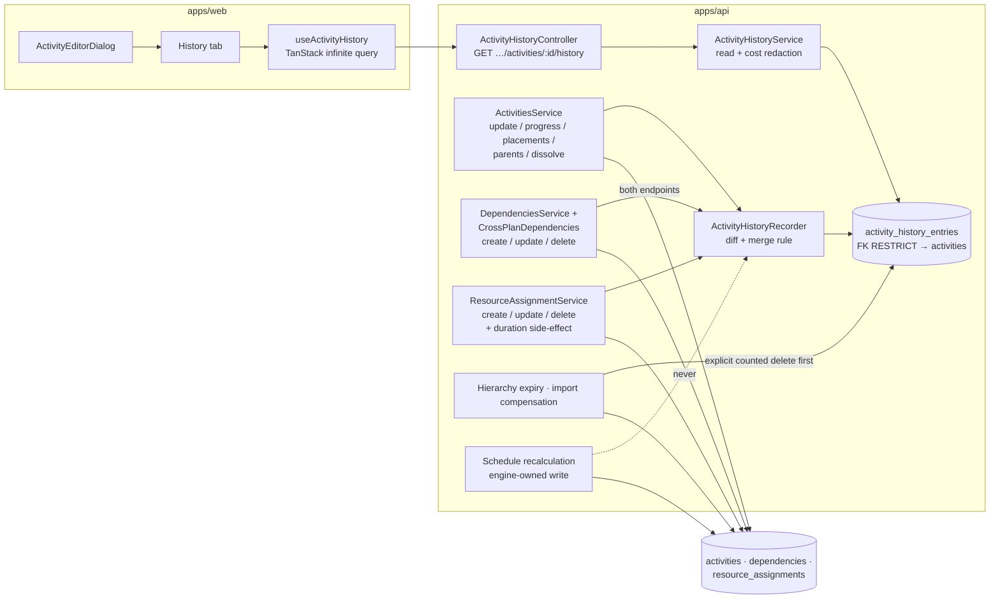
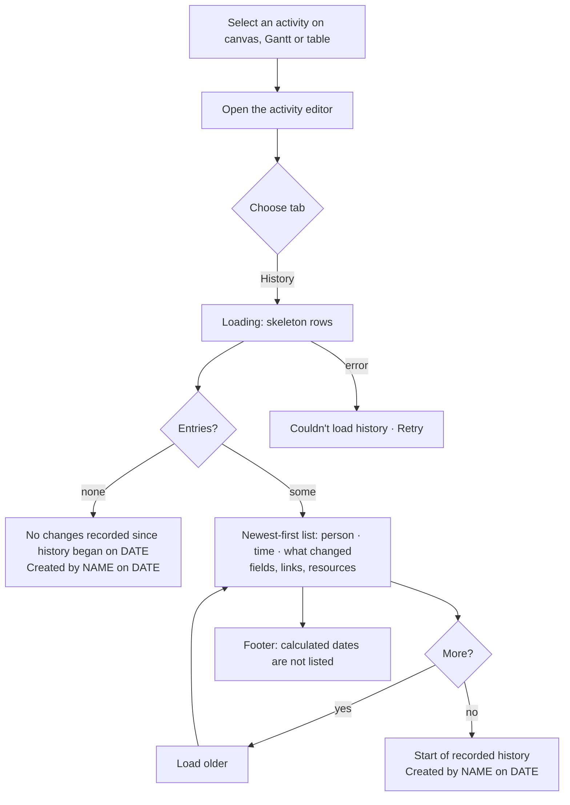

# Feature Spec: Activity change history — "who changed this, and when?"

- **Status:** Approved — by the product owner, 2026-10-03: CQ-1 every organisation member (Viewers included; never External Guests; money hidden where cost is hidden today); CQ-2 kept as long as the activity; **CQ-3 YES — links (dependencies) and resources are recorded from the first release**; CQ-4 and CQ-5 at their recommended defaults (lane-only moves not recorded; a net-zero change inside the merge window leaves no entry). ADR number 0174.
- **Author(s):** feature-analyst (for the product owner); data model by database-architect
  ([`./data-model.md`](./data-model.md))
- **Date:** 2026-10-03 (drafted and approved); amended the same day to fold in CQ-3 and the
  database-architect's corrections
- **Tracking issue / epic:** `docs/BACKLOG.md:247` — the `L` entry "Per-activity plan revision
  history". No register row of its own; this spec is the record.
- **Roadmap link:** none yet. The backlog entry is the only planning artefact that names it.
- **Related ADR(s):** a **new ADR is required — ADR-0174** (outline in §4.9; 0172 and 0173 went to two
  other specs approved the same day). It sits beside ADR-0072/0073 (the audit log, which this is
  deliberately **not**), ADR-0085 (erasure by anonymisation), ADR-0096 / ADR-0087 (retention),
  ADR-0125–0129 (revision comparison answers _what_, never _who_), ADR-0060 / ADR-0169 (per-scope
  saves), ADR-0048 (undo), ADR-0028 (the pen), ADR-0062 / ADR-0101 (the editor and its tabs), ADR-0081
  (entry point and journey) and ADR-0088 D1 (no flag).

**Why a spec and not a register fix (ADR-0105).** Three triggers fire: a schema change (a new table),
a new public API route (a read), and a new user-facing entry point (an editor tab). Any one would be
enough.

**The evidence the backlog asked for.** The entry says the feature is "worth building on evidence
that planners ask for it, not before" (`docs/BACKLOG.md:257`). **On 2026-10-03 the product owner
chose it from the backlog and asked for it.** That is the evidence, recorded here so the next reader
does not re-litigate whether the trigger fired.

### Decisions recorded at approval (2026-10-03)

| Question                                                                                                   | Answer                                                                                                      | Effect on this spec                                                                                                                                                                                                                                                         |
| ---------------------------------------------------------------------------------------------------------- | ----------------------------------------------------------------------------------------------------------- | --------------------------------------------------------------------------------------------------------------------------------------------------------------------------------------------------------------------------------------------------------------------------- |
| CQ-1 Who can see history?                                                                                  | Every organisation member, Viewers included; never External Guests; money hidden where cost is hidden today | §2 Permissions as drafted                                                                                                                                                                                                                                                   |
| CQ-2 How long is it kept?                                                                                  | As long as the activity exists                                                                              | No age sweep; permanent deletion only with the activity (§4.4)                                                                                                                                                                                                              |
| CQ-3 Links and resources in the first release?                                                             | **Yes**                                                                                                     | Link and resource-assignment changes move from a deferred M3 into **M1** (single-object routes) and **M2** (batch and side-effect paths). Two new scopes, `LOGIC` and `RESOURCES`. database-architect must extend `data-model.md` (§4.4 "Still owed by database-architect") |
| CQ-4 Lane-only moves recorded?                                                                             | No                                                                                                          | As drafted                                                                                                                                                                                                                                                                  |
| CQ-5 Change-and-change-back within the window leaves an entry?                                             | No                                                                                                          | As drafted; made exact for descriptions by storing a length + digest (§4.4 correction 4)                                                                                                                                                                                    |
| Follow-up 1 (2026-10-03): which activity records a link change?                                            | **Both ends**                                                                                               | O1 settled: a link create/update/delete writes one entry on the predecessor and one on the successor                                                                                                                                                                        |
| Follow-up 2: how are linked activities and resources named in old entries?                                 | **As they were at the time**                                                                                | Entries store the name at write time; a later rename or deletion never rewrites history (O2)                                                                                                                                                                                |
| Follow-up 3: knock-on entries on surviving activities when an activity or resource is deleted or restored? | **Yes**                                                                                                     | M2 records them, e.g. "Link removed — A was deleted"; fan-out bounds are O7                                                                                                                                                                                                 |

---

## 0. What was checked

Every row below was **read** in the file and line cited. Nothing was measured by running the product;
the measurements this design depends on are tasks in the plan (M1-T7, M2-T3, M3), with pass bars
written before the code exists.

| Claim this spec relies on                                                                                         | Evidence                                                                                                                                                                                                                                                                                                                                                                                                                                                |
| ----------------------------------------------------------------------------------------------------------------- | ------------------------------------------------------------------------------------------------------------------------------------------------------------------------------------------------------------------------------------------------------------------------------------------------------------------------------------------------------------------------------------------------------------------------------------------------------- |
| The audit log permanently excludes ordinary content edits, and names this feature as the answer                   | ADR-0073 §3, `docs/adr/0073-…md:85-99`                                                                                                                                                                                                                                                                                                                                                                                                                  |
| Revision comparison answers _what_ between baselines and nothing about _who_ — a baseline has no actor            | `docs/BACKLOG.md:258-264`; ADR-0125 Decision, `0125-…md:34-39` (delta, never cause)                                                                                                                                                                                                                                                                                                                                                                     |
| Erasure is anonymisation of the user row; attribution columns keep pointing at the same id                        | ADR-0085 D1, `0085-…md:54-60`                                                                                                                                                                                                                                                                                                                                                                                                                           |
| The engine's recalculated dates never touch `version` / `updated_at` / `updated_by`                               | `apps/api/prisma/schema.prisma:1221-1240` (comment on the engine-owned columns); the batched write is `schedule.repository.ts:910`                                                                                                                                                                                                                                                                                                                      |
| The engine's `is_driving` on a link is engine-owned, never accepted from a DTO                                    | `schema.prisma:1624-1630`                                                                                                                                                                                                                                                                                                                                                                                                                               |
| The activity definition write: fields and the version-gated update                                                | `update-activity.dto.ts:42-336`; `activities.service.ts:465-612`; `activity.repository.ts:166-179` (`where … version: expectedVersion`)                                                                                                                                                                                                                                                                                                                 |
| `existing` is read **outside** the update transaction                                                             | `activities.service.ts:475` (read) vs `:613` (`$transaction` opens)                                                                                                                                                                                                                                                                                                                                                                                     |
| The batch writes are set-based `UPDATE … FROM unnest`, gated on `id + version`, up to 2,000 rows                  | `activity.repository.ts:278`, `:315`, `:386`; `@ArrayMaxSize(2000)` in `update-placements.dto.ts:123`, `update-positions.dto.ts:45`, `update-parents.dto.ts:61`                                                                                                                                                                                                                                                                                         |
| Every other place that writes an activity's input columns                                                         | grep `tx\.activity\.(update\|updateMany)\|UPDATE activities` over `apps/api/src`: the activities service and repository; `resource-assignment.service.ts:435` (a units edit rewrites the activity's **duration**); `activity-steps.service.ts:79` (version bump only); `activities.service.ts:1699` (dissolve re-parents children); `hierarchy-lifecycle.service.ts:152,392,487,538,618` (delete/restore stamps); `schedule.repository.ts:910` (engine) |
| A link joins two activities in one plan and carries type, lag (signed minutes) and lag calendar                   | `schema.prisma:1608-1622` (`ActivityDependency`)                                                                                                                                                                                                                                                                                                                                                                                                        |
| Link writes are single-object routes: create, update, delete                                                      | `plan-dependencies.controller.ts:59` (`POST`), `dependencies.controller.ts:52` (`PATCH`), `:73` (`DELETE`); service `dependencies.service.ts:204`, `:352`, `:418`                                                                                                                                                                                                                                                                                       |
| Cross-plan links are a separate table and module, joining activities in two plans                                 | `schema.prisma:1678-1707` (`CrossPlanDependency`); `cross-plan-dependencies.controller.ts:44` (`POST`), `:78` (`DELETE`)                                                                                                                                                                                                                                                                                                                                |
| An assignment joins an activity to a resource and carries units, rate, driving flag, curve and lag                | `schema.prisma:3284-3343` (`ResourceAssignment`)                                                                                                                                                                                                                                                                                                                                                                                                        |
| Assignment writes are single-object routes: create, update, delete                                                | `resource-assignments.controller.ts:73`, `:118`, `:153`; service `resource-assignment.service.ts:95`, `:230`, `:349`                                                                                                                                                                                                                                                                                                                                    |
| Resource-library actions that may touch many assignments: delete, archive, dissolve of a group                    | `resources.controller.ts:156`, `:182`, `:205`, `:240`                                                                                                                                                                                                                                                                                                                                                                                                   |
| A held keyboard nudge is already coalesced client-side into one PATCH per 150 ms pause                            | `apps/web/src/features/tsld/interaction/use-coalesced-nudge.ts:12`, `:67-71`                                                                                                                                                                                                                                                                                                                                                                            |
| A lane-only canvas drag is a single-activity `PATCH` with `laneIndex` only                                        | `apps/web/src/components/layout/workspace/use-plan-workspace-model.ts:1229-1246`                                                                                                                                                                                                                                                                                                                                                                        |
| The editor's tabs                                                                                                 | `apps/web/src/features/activities/lib/activity-editor-intent.ts:18-27` (`general`, `scheduling`, `logic`, `progress`, `cost`, `resources`, `notes`, `members`)                                                                                                                                                                                                                                                                                          |
| Notes are readable by a role that cannot write them — the editor already has a "readable, not writable" tab state | `apps/web/src/features/activities/lib/activity-editor-gating.ts:126-131`                                                                                                                                                                                                                                                                                                                                                                                |
| `cost:read` is Planner + Org Admin only; the Cost tab is **hidden**, not shaded, without it                       | `apps/api/src/common/auth/org-permissions.ts:122-128`; ADR-0060 §6, `0060-…md:179-184`                                                                                                                                                                                                                                                                                                                                                                  |
| Every member holds `activity:read` (Viewer included)                                                              | `org-permissions.ts:171-180`                                                                                                                                                                                                                                                                                                                                                                                                                            |
| A guest DTO strips every user identity                                                                            | ADR-0051, `0051-…md:154-157`                                                                                                                                                                                                                                                                                                                                                                                                                            |
| Applying levelled dates goes through the batch placement route                                                    | ADR-0167 D6, `0167-…md:59-62`                                                                                                                                                                                                                                                                                                                                                                                                                           |
| Permanent deletion of activities: hierarchy expiry, interchange compensation, and ~15 e2e cleanups                | `data-model.md` §0 and §3 (database-architect read `hierarchy-expiry.runner.ts:81-133`, `interchange.service.ts:1274-1290`, grep `activity.deleteMany` over `apps/api/test`)                                                                                                                                                                                                                                                                            |
| There is no history table today                                                                                   | grep `history` in `schema.prisma` — only comments                                                                                                                                                                                                                                                                                                                                                                                                       |

---

## 1. Business understanding

### Problem

A planner opens an activity and sees that its duration is 15 days. Last week it was 10. A link into it
has gone, and a crane has appeared on it. **Nobody can say who changed any of it or when.** The product
holds three partial answers and none of them is this one:

- `updated_by` / `updated_at` on the activity says who touched it **last**, about anything — not who
  changed the duration, and nothing at all about the touches before. A link or an assignment has its
  own `updated_by`, but a **removed** one is soft-deleted and invisible from the activity.
- The **audit log** (ADR-0072/0073) records deletions, settings and governance, plus link creation and
  deletion at organisation level. It deliberately and permanently excludes ordinary field edits
  (ADR-0073 §3), and it is an organisation feed readable by Org Admins, not a per-activity timeline.
- **Revision comparison** (ADR-0125–0129) shows what moved between two baselines. A baseline is a
  snapshot with no author, so it can never say who.

On a shared programme this matters most at the moments of disagreement: "who moved the steel
erection?", "who took the link off the handover milestone?", "who put the second crane on this?",
"was this 60 % reported before or after the site meeting?"

### Users

| Role               | Need                                                                                                            |
| ------------------ | --------------------------------------------------------------------------------------------------------------- |
| **Planner**        | The main user. Wants to see who changed an activity they own — its fields, its links, its resources — and when. |
| **Org Admin**      | Same as Planner; also the person a dispute gets escalated to.                                                   |
| **Contributor**    | Reports progress. Wants to see that their report landed and whether a planner has since changed the activity.   |
| **Viewer**         | Read-only. Sees the same picture as the rest of the team (CQ-1).                                                |
| **External Guest** | Sees a shared plan through a link. **Never** sees history — guest views strip all user identity (ADR-0051).     |

### Primary use cases

1. "Who changed this duration, and when?" — open the activity, read its history.
2. "Who removed the link into this activity?" / "Who added this successor?" — link entries on both ends.
3. "Who put this resource on, or changed its units?" — resource entries on the activity.
4. "What has happened to this activity since I last looked?" — scan the most recent entries.
5. "Who moved this bar on the diagram?" — drags and group moves appear as entries.

### User journeys

**Happy path.** Planner selects an activity on the canvas (or in the Activities table) → opens the
activity editor → chooses the **History** tab → sees a newest-first list: each entry names a person, a
time, and what changed — _"Jane Smith · 2 Oct, 14:32 · Duration 10 d → 15 d"_, _"Tom Lee · 2 Oct,
15:10 · Link removed: FS from 1020 Steel erection"_, _"Tom Lee · 3 Oct, 09:02 · Resource added: Crane
— 40 h"_ → loads older entries → closes.

**Alternates.** An activity with no recorded changes shows _"No changes recorded since history began
on <date>"_ plus who created it and when. A Contributor or Viewer sees the same list minus cost values.
See the user-flow diagram in §4.3.

### Expected outcomes

"Who changed this, and when?" becomes answerable in two clicks for any activity, link or resource
assignment changed after the feature ships. The audit log stays readable because none of this goes
into it.

### Success criteria

- A planner reaches the answer from a selected activity in **≤ 2 actions** (open editor, choose tab).
- A 30-second drag-and-adjust of one bar produces **one** entry, not dozens; adding a link and then
  fixing its lag within the minute produces **one** link entry on each end. Proven by API tests that
  replay the bursts.
- The History read answers in **p95 < 50 ms** for an activity with 1,000 entries (M1-T7 measures it).
- Recording adds **≤ 3 ms p95** to a single-object write (the slow end, **including** the before-value
  read the feature adds) and **≤ 4 ms p95** to a link write, and **≤ 25 % (and ≤ 150 ms absolute)** to a
  2,000-row batch placement write at the 2,000-activity scale plan (M1-T7, M2-T3 measure them). The
  single-object bar was 2 ms until the product owner restated it on 2026-10-04, after M1-T7 priced a
  round trip: see the plan's M1-T7. A single-object save also issues **at most three recorder
  statements**, checked by a count (`test/activity-history-statements.e2e-spec.ts`).
- The CPM engine's output is **byte-identical** with and without the feature (§3, parity).

---

## 2. Functional requirements

### What counts as one change

This is the decision that makes the feature readable, so it comes first.

**One entry = one person's continuous work on one activity, in one write scope.** There are five
scopes:

| Scope        | Which writes                                                                                                                                                         |
| ------------ | -------------------------------------------------------------------------------------------------------------------------------------------------------------------- |
| `DEFINITION` | The editor's General / Scheduling / Cost saves, Gantt cell edits, single-bar drags (`PATCH …/activities/:id`) — **including a WBS parent change made in the editor** |
| `PROGRESS`   | The progress endpoint                                                                                                                                                |
| `PLACEMENT`  | Batch moves from the canvas and Gantt, levelling apply, **batch re-parent** (`PATCH …/activities/parents`) and **dissolve's** re-parent of the children              |
| `LOGIC`      | Link create / change / delete (in-plan and cross-plan)                                                                                                               |
| `RESOURCES`  | Resource-assignment create / change / delete — and the activity duration change the ADR-0040 units triad makes in the same write                                     |

A write **merges into the activity's most recent entry** — the lookup is "the latest entry for this
activity", whoever made it — instead of creating a new one when all of these hold:

1. That latest entry is by the **same person** (same user id).
2. It has the **same scope**.
3. **Quiet gap ≤ 60 seconds** since it was last touched.
4. **Total span ≤ 10 minutes** since it was first recorded — so an afternoon of nudging one bar is
   several entries, not one entry that hides three hours.
5. **Nobody else** has recorded an entry on the activity in between — which is what "the latest entry
   for this activity" guarantees: a colleague's newer entry is the latest, so mine cannot merge past it.
6. **Neither the write nor the latest entry is a batch.** Batch entries **never merge**, in either
   direction. Consequence, stated rather than discovered: dragging the same 40-bar selection three times
   in 30 seconds leaves **three** entries on each of the 40 activities. Single-bar bursts are
   unaffected. If that proves noisy it is a server-constant change, not a schema change.

Actor and scope are compared in the application after the lookup, never put into the lookup — a lookup
on "latest for activity + actor + scope" would find my older entry behind a colleague's newer one and
merge across them (database-architect correction 5).

When an entry merges, each changed item keeps its **original "from"** value and takes the **latest
"to"** value; an item touched for the first time is added. A merged entry carries how many saves it
absorbed (shown as e.g. _"3 edits"_).

**Why these numbers.** The client already squeezes a held arrow key into one request per 150 ms pause
(`use-coalesced-nudge.ts:12`), so the server only has to join requests a person makes while fiddling,
which arrive seconds apart. 60 s joins "drag, look, drag again"; 10 minutes stops a long session
becoming one entry. They are **server constants**, so changing them affects only new entries and needs
no migration (ADR-0151: a constant carries its justification). Times are database time (`now()`), never
the API process clock.

**Net-zero entries are dropped (CQ-5).** If, after a merge, every item's "to" equals its "from" — a
drag and its undo inside the window, a link added and removed again, a description typed and typed
back — the entry is removed. Equality is exact: descriptions compare by length + digest, references by
id (never by the name stored beside it).

**Multi-activity writes** write **one entry per affected activity**, sharing one **batch id** and a
batch size. The tab shows _"saved together with 39 other activities"_ (neutral: a batch does not record which action it was).

**Only real differences are recorded.** The server compares stored values before and after, item by
item (the ADR-0073 C3.2 "diff by value" rule: the editor resends whole scopes, so _sent_ is not
_changed_). A save that changes nothing records nothing.

### Which changes are recorded

Recorded items are **inputs** — what a person sets — and never the engine's outputs.

**Activity fields (M1 for single-activity writes; M2 for batches)**

| Group                            | Fields                                                                                                                                                                                                                       |
| -------------------------------- | ---------------------------------------------------------------------------------------------------------------------------------------------------------------------------------------------------------------------------- |
| Identity                         | name, code, type, description (_"description changed"_ — length and digest stored, never the text)                                                                                                                           |
| Duration                         | duration (minutes, shown in the activity's day units), duration type                                                                                                                                                         |
| Scheduling                       | primary and secondary constraint (type + date), expected finish, external early start / late finish (**stored as instants**, not dates — they are `timestamptz`), schedule as late as possible, calendar, levelling priority |
| Placement                        | visual start; lane **only when it moves with the bar's dates** (CQ-4)                                                                                                                                                        |
| Structure                        | WBS parent (editor: `DEFINITION`; batch / dissolve: `PLACEMENT`)                                                                                                                                                             |
| Progress                         | % complete, actual start, actual finish, remaining duration, suspend / resume dates, physical % complete                                                                                                                     |
| Value measure                    | % complete type, accrual type                                                                                                                                                                                                |
| Cost (shown only to `cost:read`) | budgeted expense, actual expense                                                                                                                                                                                             |

**Links (CQ-3; M1 for the in-plan routes, M2 for cross-plan and side-effects)**

- A link change is recorded on **both** activities it joins: the successor reads _"Link added: Finish to Start +2d
  from 1020 Steel erection"_, the predecessor reads _"Link added: Finish to Start +2d to 1040 Cladding"_. Each end
  gets its own entry in scope `LOGIC`, so each end's merge rule works on its own timeline. Why both:
  "who took the link off this milestone?" is asked from the successor and "who hung this on my
  activity?" from the predecessor; recording one end makes one of those questions unanswerable.
  _(database-architect to confirm — §4.4 item O1.)_
- Recorded items: link added (from nothing), removed (to nothing), type changed, lag changed, lag
  calendar changed. Each link is one item keyed by the link's id, so add-then-fix-lag within the
  window is one item (_"Link added: Start to Start +3d"_), and add-then-remove is net-zero and dropped.
- The other end is named **as it was at the time** (code + name), so a later rename or deletion of
  that activity does not rewrite history (§4.4 item O2).
- **Not recorded:** the engine's `is_driving` flag on a link — it is an output.

**Resource assignments (CQ-3; M1 for the assignment routes, M2 for library side-effects)**

- Recorded on the activity, scope `RESOURCES`: assignment added, removed, or changed — budgeted units,
  units per hour, driving flag, loading curve, assignment lag. One item per assignment keyed by its id.
- The resource is named **as it was at the time**, so a later rename, archive or deletion of the
  resource does not rewrite history.
- The **duration change** the units triad writes onto the activity in the same request
  (`resource-assignment.service.ts:429-446`) is recorded **in the same `RESOURCES` entry** — the person
  made one change and it had two effects. (The data model's `RESOURCE_ASSIGNMENT` origin may therefore
  be unnecessary — §4.4 item O4.)
- Units are exact decimals and are stored without rounding (§4.4 item O3). Any monetary value on an
  assignment is a cost item and is hidden without `cost:read`.

**Side effects of someone deleting something else (M2).** When an activity is deleted, its links to
**surviving** activities disappear with it; when a resource is deleted, archived or dissolved in the
library, assignments may be removed or re-pointed. Those surviving activities' links and resources did
change, so M2 records them on the survivors — one batch entry per affected activity, noting the cause
(_"Link removed — 1020 Steel erection was deleted"_). Restoring reverses it the same way. The deletion
itself stays in the audit log. Which library actions actually touch assignments is settled by the
coverage census at M2, not assumed here.

**Out of scope, each with a reason:**

| Not recorded                                                                                                                         | Why                                                                                                                                                                                               |
| ------------------------------------------------------------------------------------------------------------------------------------ | ------------------------------------------------------------------------------------------------------------------------------------------------------------------------------------------------- |
| **Engine-calculated dates and flags** (early/late dates, floats, critical, violation flags, levelled overlay, a link's `is_driving`) | Not a person's change. They move whenever anything upstream moves; listing them would bury the real edits and imply a cause the product cannot establish (ADR-0125). The tab says so in a footer. |
| **Derived status**                                                                                                                   | Derived from the progress numbers, which are recorded.                                                                                                                                            |
| **Weighted steps**                                                                                                                   | Not asked for; a step edit bumps the activity's version only (`activity-steps.service.ts:79`). A later follow-on, exempt in the census with that reason.                                          |
| **Notes**                                                                                                                            | Already attributed and dated on their own.                                                                                                                                                        |
| **Create, delete, restore, dissolve of the activity itself**                                                                         | Create is shown from the activity's own `created_by` / `created_at`. Delete / restore / dissolve are in the audit log, and a deleted activity cannot be opened.                                   |
| **Imports**                                                                                                                          | An imported activity shows _"Created by <importer> on <date>"_; its links and assignments arrived with it. No rows are written.                                                                   |
| **Links and assignments created together with a new activity** (paste, import)                                                       | Part of the activity's creation, which is not an entry. If a paste links a new activity to an **existing** one, the existing end **is** recorded (census decides per route).                      |
| **Resource-library edits** (rename, rate change, calendar)                                                                           | A change to the library, not to this activity; archive / delete are already audited (ADR-0073 family F).                                                                                          |
| **Lane-only moves**                                                                                                                  | CQ-4.                                                                                                                                                                                             |
| **Description text**                                                                                                                 | Length + digest only, to keep entries small and exact.                                                                                                                                            |
| **Changes before the feature shipped**                                                                                               | Nothing to read them from. The tab says _"History began on <date>"_.                                                                                                                              |

The recorded field vocabulary is **one constant** in `@repo/types`, typed against the response DTOs so a
misspelt field is a compile error. Its keys are a **persisted vocabulary**: a key may be added, never
renamed, without a data migration (data-model §2).

### Undo and redo

**Undo creates entries**, because ADR-0048's undo is an ordinary write by the same person through the
same API (`0048-…md:42-45`). Inside the 60-second window it merges with the edit it reverses and, if
the result is no net change, the entry disappears (CQ-5). Outside the window it is a new entry. No
"undo" label: the server cannot tell an undo from a deliberate edit unless the client says so, and a
client-set header is not evidence (a possible follow-on). A link undo that **re-creates** a deleted
link gets a new id (ADR-0048), so add-after-remove is two items, not net-zero — honest, because it is a
different link row.

### User stories & acceptance criteria

> **US-1** — As a **Planner**, I want to see who changed an activity and when, so that I can ask the
> right person about it.
>
> - **Given** Jane changed an activity's duration from 10 to 15 days **when** I open its editor and
>   choose **History** **then** the newest entry reads Jane, the time, and _Duration 10 d → 15 d_.
> - **Given** the activity has 120 entries **when** I press **Load older** to the end **then** older
>   entries load in pages of 50 and the list says when there are no more.
> - **Given** the activity has no entries **then** I see _"No changes have been recorded for this
>   activity. History recorded since <date>."_ _(Amended after M1 review: "Created by <name> on <date>" is
>   not shown. The activity response carries `createdAt` but no creator, so the name is not derivable on the
>   client; surfacing it needs an API field and is a follow-on. The same "History recorded since <date>."
>   sentence also ends a list that has been loaded to the start.)_

> **US-2** — As a **Planner**, I want a drag-and-adjust to be one entry, so that the history is
> readable.
>
> - **Given** I drag one bar three times within 30 seconds **then** History shows **one** entry, from
>   the original start to the final start, marked _"3 edits"_.
> - **Given** I drag a bar, wait two minutes, and drag again **then** History shows two entries.
> - **Given** I drag a bar and undo within the window **then** no entry remains.
> - **Given** a colleague edits the same activity between my two drags **then** there are three
>   entries in order: mine, theirs, mine.
> - **Given** I drag a 40-bar selection three times in 30 seconds **then** each of the 40 activities
>   shows three entries (batches never merge).

> **US-3** — As a **Planner**, I want group moves to be recognisable. **Given** I drag 40 selected bars
> together, apply levelled dates, or re-parent a batch under a summary **then** each affected activity
> shows one entry noting _"with N other activities"_.

> **US-4** — As a **Planner**, I want link changes on both activities.
>
> - **Given** Tom adds an FS link from A to B **then** A's History shows _"Link added: Finish to Start to B"_ and B's
>   shows _"Link added: Finish to Start from A"_, both by Tom.
> - **Given** Tom adds the link and changes its lag to +2 d within the minute **then** each end shows
>   one entry: _"Link added: Finish to Start +2d …"_.
> - **Given** Tom removes the link **then** both ends show _"Link removed"_ naming the other activity as
>   it was named then.
> - **Given** activity A is deleted **then** B's History shows _"Link removed — A was deleted"_ (M2).

> **US-5** — As a **Planner**, I want resource changes on the activity.
>
> - **Given** I assign a crane at 40 h **then** History shows _"Resource added: Crane — 40 h"_.
> - **Given** I change its units and that recomputes the duration **then** **one** entry shows both the
>   units change and _Duration 5 d → 4 d_.
> - **Given** the crane is later renamed in the library **then** the entry still names it as it was.

> **US-6** — As a **Contributor**, I want to see my progress reports. **Given** I report 60 % **then**
> History shows my entry _"% complete 40 → 60"_; **given** a Planner then changes the budgeted expense
> **then** I do not see that entry; an entry that changed cost **and** something else shows only the
> something else.

> **US-7** — As any reader, I want computed dates **not** to appear as changes. **Given** an upstream
> activity is lengthened and the schedule recalculates **then** the downstream activity gains **no**
> entry, and the footer explains that calculated dates are not listed.

> **US-8** — As an **External Guest**, I never see history: no tab in the guest view, no guest route.

### Workflows

1. **Recording (server, inside the existing write).** The write service reads the affected rows'
   recorded values **inside its transaction** at the version it is about to update, performs the
   existing version-gated write, diffs before/after, and — if anything changed — merges into or inserts
   the history entry **in the same transaction**. If the write rolls back, so does the entry. A link
   write does this for both endpoint activities.
2. **Reading.** `GET …/activities/:activityId/history?cursor=&limit=` returns newest-first pages; the
   client renders each item through one label-and-format map (the ADR-0089 vocabulary).

### Edge cases

| Case                                                                                  | Behaviour                                                                                                                                      |
| ------------------------------------------------------------------------------------- | ---------------------------------------------------------------------------------------------------------------------------------------------- |
| Activity soft-deleted                                                                 | History route answers **404**, as every activity read does. On restore the history is still there (no `deleted_at` on entries; data-model §6). |
| Activity, plan or client permanently expired (ADR-0096)                               | Entries are deleted **explicitly and counted** before their activities, inside the same expiry transaction (FK `RESTRICT`, data-model §3).     |
| Import fails and is compensated                                                       | Compensation deletes any entries for the plan's activities first (normally none).                                                              |
| User erased (ADR-0085 D1)                                                             | Entries keep the user id; the name resolves to the tombstone. Nothing to do here.                                                              |
| Member removed from the organisation                                                  | Their entries still show their name.                                                                                                           |
| Referenced calendar, WBS parent, linked activity or resource later renamed or deleted | The entry shows the **name at the time**.                                                                                                      |
| Two people write the same activity at once                                            | Serialised by the version-gated update; the loser's write and entry do not happen.                                                             |
| A link write races an edit on one of its endpoints                                    | Each endpoint's entry is written under that endpoint's row lock (§4.4 item O5).                                                                |
| A batch write fails part-way                                                          | All-or-nothing today (`activities.service.ts:856-873`); entries are in the same transaction.                                                   |
| A write changes only unrecorded fields (lane-only move, steps)                        | No entry; the merge window is not touched.                                                                                                     |
| Type change re-expresses a zero-duration activity's dates (ADR-0162)                  | Recorded in the same entry.                                                                                                                    |
| Cross-plan link                                                                       | Recorded on both endpoints, each in its own plan's activity history (M2).                                                                      |
| An activity with thousands of entries                                                 | Paginated (50, max 100); read cost is independent of the count.                                                                                |
| Values the reader may not see (cost)                                                  | Removed server-side; an entry with nothing left is not returned, without breaking pagination.                                                  |

### Permissions

Deny-by-default, organisation-scoped (ADR-0012). No new permission.

| Act                        | Permission                                                                                                                        | Roles                                          | Pen                                                                                                                                                                              |
| -------------------------- | --------------------------------------------------------------------------------------------------------------------------------- | ---------------------------------------------- | -------------------------------------------------------------------------------------------------------------------------------------------------------------------------------- |
| Read an activity's history | `activity:read` in the activity's organisation                                                                                    | Org Admin, Planner, Contributor, Viewer (CQ-1) | **No** — a read                                                                                                                                                                  |
| See cost items             | `cost:read`                                                                                                                       | Org Admin, Planner                             | —                                                                                                                                                                                |
| Recording                  | rides the existing write's permission (`activity:update`, `activity:update_progress`, `dependency:*`, the assignment permissions) | as today                                       | as today: definition, placement, structure, link and assignment writes are pen-gated **structural** writes (ADR-0028); progress is not. Recording adds no write and no pen rule. |
| External Guest             | none — no route on the guest surface                                                                                              | —                                              | —                                                                                                                                                                                |

### Validation rules

- `activityId`: UUID (`ParseUuidPipe`), resolved active in the caller's organisation, else 404.
- `limit`: integer 1–100, default 50; `cursor`: the opaque keyset cursor the API already uses
  (`docs/API.md` pagination), via `PaginationQueryDto`.
- No write DTO — history is never written directly by a client.

### Error scenarios

| Scenario                                    | Detection         | User-facing result                                               | Status    |
| ------------------------------------------- | ----------------- | ---------------------------------------------------------------- | --------- |
| Not a member of the organisation            | scope resolution  | standard forbidden / not-found                                   | 403 / 404 |
| Activity in another organisation or deleted | org-scoped lookup | the editor's existing not-found handling                         | 404       |
| Malformed cursor or limit                   | DTO validation    | inline error in the tab; retry                                   | 422       |
| Read fails                                  | query error       | tab shows an error with **Retry**; rest of the editor unaffected | 5xx       |
| Recording fails inside a write              | transaction       | the **write** fails as a whole                                   | 5xx       |

The last row is deliberate: an edit that cannot be recorded is not saved. Best-effort recording after
commit would make the history silently incomplete, which is the one property a reader cannot detect.

---

## 3. Technical analysis

| Area           | Impact       | Notes                                                                                                                                                                                                     |
| -------------- | ------------ | --------------------------------------------------------------------------------------------------------------------------------------------------------------------------------------------------------- |
| Frontend       | **med**      | New **History** tab in `ActivityEditorDialog`; list with pagination, empty, loading and error states; one label + value-format map covering fields, links and assignments. No new route.                  |
| Backend        | **med–high** | An `activity-history` module: a recorder called from the activity, link and assignment write paths (single and batch), a read service + controller.                                                       |
| Database       | **med**      | One new table, two indexes, five CHECKs, FK `RESTRICT` with explicit counted deletes at three sites. Designed by database-architect (`data-model.md`); **extension owed for links and resources** (§4.4). |
| API            | **low**      | One read route. No change to any existing request or response.                                                                                                                                            |
| Security       | **med**      | Org scoping (IDOR), cost redaction, guest exclusion, erasure-by-id, same-org row written from the activity, never the request.                                                                            |
| Performance    | **med**      | One indexed lookup + one insert/update per affected activity per write; a link write touches two activities; batches are set-based. Measured (M1-T7, M2-T3, M3).                                          |
| Infrastructure | **none**     | No new service or env var (CQ-2 needs no sweep).                                                                                                                                                          |
| Observability  | **low**      | Debug log field `historyEntry: inserted / merged / dropped / none`; the `hierarchy.expired` audit row gains `activityHistoryCount`.                                                                       |
| Testing        | **high**     | Unit (diff + merge), API e2e per write path, a structural coverage census across activity, link and assignment writes, a parity check, the expiry census, Playwright journey + a11y.                      |

**The recalc parity gate.** History is a **side record of inputs**: no column on `activities`,
`dependencies` or `resource_assignments`, no DTO field, nothing `computeSchedule` reads. The engine's
batched write (`schedule.repository.ts:910`) goes through no recorded path. A structural test pins both
directions: history imports nothing from `schedule/engine`; `schedule/` imports nothing from history.
`computeSchedule` is byte-identical by construction; the parity suite runs unchanged.

**The pen.** Reading is not structural. Recording rides writes that already carry their pen rule.

**No flag (ADR-0088 D1).** A `VITE_` flag cannot switch off a server recorder and an operator cannot
switch one off in the published image. Rollback is the commit boundary — with one stated hazard: rolling
the image back to a pre-feature release **after** entries exist makes that image's expiry and import
compensation fail with `23503` on plans that have history, until the image moves forward again. Nothing
is lost and expiry ships disabled by default (data-model §8).

**Not the audit log, and the difference is structural.** The audit table refuses `UPDATE`/`DELETE`
(ADR-0072). This table **must** allow both: merging updates an entry, net-zero deletes one, expiry
deletes them. It is **not tamper-resistant** and must never be called an audit trail.

### Size and volume (estimate — M3-T2 replaces it with a measurement)

From `data-model.md` §7 (database-architect's corrected figures):

- **Per entry, with indexes:** **≈ 0.3–0.5 KB**; typical `changes` 80–250 bytes, worst case ~5 KB,
  hard backstop 8 KB.
- **Per busy plan:** 50–300 entries/day ≈ 18k–110k entries/year ≈ **6–55 MB/year**. Links and resources
  raise this: a link change is **two** entries. Estimated +20–40 % on a logic-heavy plan; unmeasured.
- **Per batch:** ≤ 2,000 rows per transaction, ~0.5–1 MB of WAL.
- **Per read:** one activity, newest first, 50 at a time — cost independent of table size.

### Dependencies

- **database-architect re-run** to extend `data-model.md` for `LOGIC` / `RESOURCES` (§4.4 "Still owed")
  **before** M1-T1's migration, so the initial `CREATE TYPE` carries all five scope labels and no
  `ALTER TYPE … ADD VALUE` migration is needed.
- No other epic must land first.

---

## 4. Solution design

### 4.1 Architecture overview



### 4.2 Data flow — a link write recorded on both ends

```mermaid
sequenceDiagram
  participant C as Client (Logic tab)
  participant S as DependenciesService
  participant R as HistoryRecorder
  participant DB as Postgres (one transaction)
  C->>S: PATCH …/dependencies/:id {lagDays: 2, version 3}
  S->>DB: BEGIN; read link at version 3 + both endpoints' code/name (inside tx)
  S->>DB: UPDATE dependencies … WHERE id AND version = 3
  S->>DB: lock both endpoint activity rows in id order (§4.4 O5)
  S->>R: record(link before/after, actor, scope=LOGIC, endpoints)
  loop each endpoint (predecessor, successor)
    R->>DB: latest entry for this activity
    alt same actor, LOGIC, ≤60 s quiet, ≤10 min span, not a batch
      R->>DB: UPDATE entry: keep "from", set "to", edit_count+1
      opt net-zero
        R->>DB: DELETE entry
      end
    else
      R->>DB: INSERT entry (org copied from the activity row)
    end
  end
  S->>DB: COMMIT
  S-->>C: 200 { data: dependency }
```

An activity-field write is the same flow with one endpoint and the activity's own version-gated update
providing the row lock. A **batch** runs set-based: one before-read of the N rows inside the
transaction, the existing `UPDATE … FROM unnest`, one `LATERAL` latest-entry probe for the N activities
(data-model §4), then one multi-row insert and one multi-row update.

**Before-values are read inside the transaction.** `update()` reads `existing` before its transaction
opens (`activities.service.ts:475` vs `:613`). The diff would be correct only because the update is
gated on the same version — fragile, and ADR-0073's "most likely bug". The recorder takes before-values
from a read inside the transaction, and ADR-0174 records why.

### 4.3 User flow



### 4.4 Database changes — designed by database-architect

The model, constraints, indexes and migration are in [`./data-model.md`](./data-model.md). This spec
does not restate the Prisma model. Its corrections are adopted here:

1. **FK `ON DELETE RESTRICT`, not `CASCADE`, with an explicit counted delete** at three sites: the
   hierarchy-expiry runner (charged against the per-run budget as
   `activities + ceil(historyEntries / HISTORY_ROWS_PER_ACTIVITY)`, ratio shipped as `1`, measured and set to `10` by
   M3-T1 on 2026-10-04), interchange compensation, and a DMMF-derived test-cleanup helper for the
   ~15 e2e files that hard-delete activities.
2. **No `plan_id`.** Bulk removal works from activity ids, which the runner already resolves.
3. **External early start / late finish stored as UTC instants**, not calendar dates.
4. **Description stored as `{len, h}`** (length + truncated SHA-256) so net-zero (CQ-5) is exact.
5. **Merge lookup is "latest entry for this activity"**; actor and scope are compared after it.
6. **Size ≈ 0.3–0.5 KB per entry** with indexes (§3).
7. **Scope for batch re-parent and dissolve is `PLACEMENT`; an editor parent change is `DEFINITION`.**
8. **Batch entries never merge** (§2 rule 6).

`changes` is an **object keyed by item** — a field key, or one key per link / assignment (for example
`link:<dependencyId>`, `assignment:<assignmentId>`; the exact key form is database-architect's).

**Still owed by database-architect (CQ-3 extension — re-run before M1-T1's migration):**

- **O1 — Which end records a link change.** This spec recommends **both** endpoints, one entry each.
  Confirm, and state the cost: a link write becomes two latest-entry probes and up to two inserts.
- **O2 — How a link and a resource are named in `changes`.** Value shape for a link item (the other
  activity's id + code + name **at the time**, direction, type, lag minutes, lag calendar) and for an
  assignment item (resource id + name at the time, units, units per hour, driving, curve, lag minutes).
  Net-zero compares ids and values, never the stored names. Confirm the `{ from: null }` = added,
  `{ to: null }` = removed convention, and that the 8 KB backstop still holds for an entry carrying
  several link items.
- **O3 — Exact decimals.** Assignment units are `DECIMAL(18,4)`; specify the JSON encoding (string, to
  avoid float rounding) and how net-zero compares them.
- **O4 — Scope and origin enums.** Add `LOGIC` and `RESOURCES` to the scope type in the **initial**
  migration. Decide whether `ActivityHistoryOrigin.RESOURCE_ASSIGNMENT` is still needed now that the
  triad's duration change lands inside the `RESOURCES` entry, and which origin values M2's side-effects
  need (e.g. "other activity deleted", "resource deleted / dissolved").
- **O5 — Row locks for a link write.** A link write does not update either endpoint activity, so it
  holds neither endpoint's row lock — the guarantee data-model §4 relies on for merge safety. Specify how
  the recorder serialises per activity for `LOGIC` and `RESOURCES` writes (e.g. `SELECT … FOR UPDATE` on
  the endpoint activity rows in id order to avoid deadlock), and what that costs.
- **O6 — Cross-plan links.** Confirm both endpoints in two plans; same-org is copied from each activity.
- **O7 — Side-effect fan-out (M2).** Deleting an activity with many links, or dissolving a resource
  group, can produce many entries on survivors in one transaction; confirm the batch path and any bound.

### 4.5 API changes

**New:** `GET /api/v1/organizations/:orgSlug/activities/:activityId/history`

- Query: `limit` (1–100, default 50), `cursor` (opaque), via `PaginationQueryDto`.
- 200 `{ data: ActivityHistoryEntryDto[], meta: { nextCursor, recordingSince } }`
  - `ActivityHistoryEntryDto`: `id`, `actor { id, name }` (name resolved at read time — the tombstone
    after erasure), `scope`, `firstRecordedAt`, `lastRecordedAt`, `editCount`,
    `batch { id, size } | null`, `origin | null`, `changes` (the stored object, with cost items removed
    for callers without `cost:read`; description as _changed_ only — the digest is never sent).
  - `recordingSince`: the later of the activity's creation and the feature's start date.
- Ordered by `firstRecordedAt DESC, id DESC` (stable while a merge extends the newest entry).
- 403 / 404 / 422 as §2. OpenAPI via `@nestjs/swagger`; `docs/API.md` gains the route.

**Changed:** none. **Guest surface:** no route.

### 4.6 Component changes

- `ActivityEditorTab` gains `'history'`, placed **last** (ADR-0062 §5 subject-first order); a new
  `ActivityEditorPurpose` `'history'` opens it directly.
- `deriveActivityEditorGating` gains a readable-never-writable `history` entry (the Notes shape,
  `activity-editor-gating.ts:126-131`).
- `features/activity-history/`: `useActivityHistory` (infinite query, invalidated after any activity,
  link or assignment save for this activity), `ActivityHistoryPanel`, `ActivityHistoryEntry`, and a pure
  `formatHistoryItem(key, from, to, context)` reusing the existing duration, date, lag and money
  formatters and the Logic tab's link-type wording — no second formatting of a value the editor already
  displays.
- States: loading, empty (+ created by), error (+ Retry), end of list, cost hidden (nothing shown),
  footer about calculated dates.
- Accessibility: `<ol>` newest-first, `<time>` per entry; **Load older** is a button that keeps focus
  in the list; a polite live region announces loaded counts. `tabs.tsx` is not changed (ADR-0111 not
  triggered); accessibility-reviewer runs at the gate.
- No one-off styling. Optional, recommended: **View history** on the table row menu and canvas selection
  actions (ADR-0093).

### 4.7 Implementation approach

**Explicit recording in the service layer, inside each write's transaction, through one recorder.**
Write paths (§0 grep):

| Path                                                                                                                         | Milestone     |
| ---------------------------------------------------------------------------------------------------------------------------- | ------------- |
| `ActivitiesService.update`, `updateProgress`                                                                                 | M1            |
| `DependenciesService.create` / `update` / `remove` (both endpoints)                                                          | M1            |
| `ResourceAssignmentService.create` / `update` / `remove` (+ the duration side-effect)                                        | M1            |
| `updatePlacements`, `updateParents`, dissolve's child re-parent                                                              | M2            |
| Cross-plan link create / delete (both endpoints)                                                                             | M2            |
| Side-effects on survivors: activity delete/restore removing links; resource delete / archive / dissolve touching assignments | M2            |
| `updatePositions` (lane only)                                                                                                | exempt (CQ-4) |

A **structural census** lists every write to an activity's input columns **and** every write to
`dependencies`, `cross_plan_dependencies` and `resource_assignments`, and requires each to be
**recorded**, **pending M2** (a snapshot queue emptied by M2, the ADR-0073 `PENDING_COVERAGE`
precedent), or **exempt with a reason** (engine output, delete/restore stamps of the subject itself,
version-only bump, created-with-a-new-activity).

### 4.8 Alternatives considered

| Alternative                                             | Why not                                                                                                                     |
| ------------------------------------------------------- | --------------------------------------------------------------------------------------------------------------------------- |
| **Put it in the audit log**                             | ADR-0073 §3 rejects this permanently; the log cannot merge or delete rows.                                                  |
| **A Prisma `$extends` / database trigger**              | Would catch the engine's write, delete stamps and version bumps; a trigger cannot know the actor's scope or the merge rule. |
| **Snapshot the whole activity per write, diff at read** | Larger rows; merge and redaction move into the read path; links and assignments are separate rows anyway.                   |
| **Client-side recording**                               | The client is not a trust boundary.                                                                                         |
| **Best-effort recording after commit**                  | Silent gaps a reader cannot detect.                                                                                         |
| **No merging**                                          | A thirty-second fiddle becomes a dozen entries.                                                                             |
| **Merge on read**                                       | Unstable pagination; table grows with clicks rather than decisions.                                                         |
| **Record a link on the successor only**                 | Halves link rows, but "who hung this on my activity?" becomes unanswerable from the predecessor. Rejected pending O1.       |
| **A separate link-history table**                       | A second read, a second merge rule and a timeline the tab has to interleave; one table keyed by activity serves both.       |
| **`CASCADE` from activities**                           | Uncounted, so unbudgetable in expiry (data-model §3).                                                                       |
| **"Add an actor column" to baselines**                  | Baselines answer _what_ between two moments; _who_ lives in a different model (`BACKLOG.md:262-264`).                       |
| **A `VITE_` flag**                                      | ADR-0088 D1.                                                                                                                |

### 4.9 ADR required — outline (ADR-0174, "An activity's history is working memory, not an audit trail")

- **Context:** ADR-0073 §3 named this feature and excluded it from the audit log; the product owner
  asked for it on 2026-10-03, with links and resources from the first release.
- **D1 — a separate table, mutable by design**; not tamper-resistant; never called an audit trail.
- **D2 — what one entry is:** five scopes (`DEFINITION`, `PROGRESS`, `PLACEMENT`, `LOGIC`,
  `RESOURCES`), with batch re-parent and dissolve under `PLACEMENT` and an editor parent change under
  `DEFINITION`; lookup is the activity's latest entry; same person + scope, 60 s quiet, 10 min span;
  batches never merge; net-zero dropped. Constants carry their reason.
- **D3 — inputs only**; engine outputs, a link's `is_driving` and derived status are never recorded.
- **D4 — transactional, before-values read inside the transaction**, per-activity serialisation for
  link and assignment writes (O5); a failed record fails the write.
- **D5 — links on both ends; links and resources named as they were** (O1, O2).
- **D6 — actor by id only**; erasure is ADR-0085 D1 with no extra work.
- **D7 — readers:** every member with `activity:read`; cost only with `cost:read`; never a guest.
- **D8 — retention:** as long as the activity (CQ-2); FK `RESTRICT` with explicit, counted, budgeted
  deletes at expiry, import compensation and test cleanup; the rollback hazard stated.
- **D9 — coverage census**; no flag; parity untouched by construction.

---

## 5. Links

- Data model: [`./data-model.md`](./data-model.md) (database-architect; extension O1–O7 owed)
- Implementation plan: [`./implementation-plan.md`](./implementation-plan.md)
- Related docs updated by this change (at build time): `docs/API.md`, `docs/DATABASE.md` (the table,
  its `RESTRICT` deletes and retention), `docs/SECURITY_STANDARDS.md` (a second attributed store;
  erasure note), `docs/BACKLOG.md` (remove the entry when M2 ships), ADR-0073 (pointer from §3 to
  ADR-0174), ADR-0096 (expiry deletes history explicitly), CLAUDE.md §16 (one line for ADR-0174),
  `docs/TEST_PLAYBOOK.md` (only if a seeded plan is added).

---

## Questions — resolved 2026-10-03

All five critical questions were answered at approval; see "Decisions recorded at approval" at the top
of this document. No question is open. Items O1–O7 in §4.4 are design work for database-architect, not
questions for the product owner.
