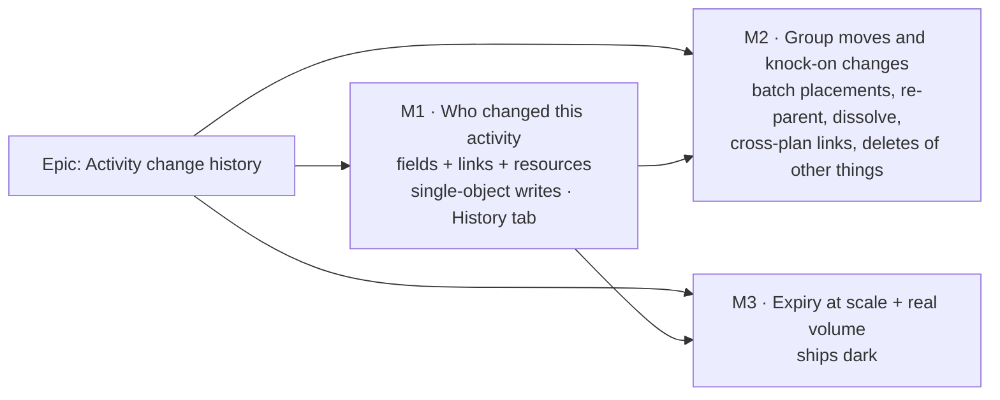

# Implementation Plan: Activity change history

- **Feature spec:** [`./feature-spec.md`](./feature-spec.md)
- **Status:** Approved — by the product owner, 2026-10-03: CQ-1 every organisation member (Viewers included; never External Guests; money hidden where cost is hidden today); CQ-2 kept as long as the activity; **CQ-3 YES — links (dependencies) and resources are recorded from the first release**; CQ-4 and CQ-5 at their recommended defaults (lane-only moves not recorded; a net-zero change inside the merge window leaves no entry). ADR number 0174.
- **Owner:** feature-analyst (plan); database-architect (data model); builder agent (implementation)
- **Data model:** [`./data-model.md`](./data-model.md) — adopted with its eight corrections (spec §4.4);
  **extension O1–O7 for links and resources still owed** before M1-T1's migration.

**Re-sequenced 2026-10-03 for CQ-3.** The draft deferred links and resources to an optional M3. The
product owner wants them in the first release, so the single-object link and assignment routes join
**M1**, and the batch / cross-plan / side-effect paths join **M2**. The old dark measurement milestone
is now **M3**. Every milestone still ships something.

## Breakdown

### Epic

**Activity change history** — answer "who changed this, and when?" for any activity, link or resource
assignment changed after the feature ships, without touching the audit log or the engine. Maps to
`docs/BACKLOG.md:247`.

**No `VITE_` flag in any milestone** (ADR-0088 D1). Rollback is the commit boundary, with the
`RESTRICT` rollback hazard stated in spec §3.

**Agents.** **database-architect**: M1-T0 (extension O1–O7, **re-run, mandatory**) and M1-T1 (migration
review); again at M2-T1 only if O7 changes the shape. Reviewers at each milestone gate:
security-reviewer, api-reviewer, backend-performance-reviewer (server); component-reviewer,
accessibility-reviewer, ux-reviewer (web); test-engineer for the census, the expiry census and the
journey.

---

### Milestone M1: Who changed this activity (shippable slice)

**Outcome:** a planner opens any activity's editor, chooses **History**, and sees who changed its own
fields (name, duration, dates, constraints, calendar, WBS parent, progress, cost if permitted), its
**links** (on both ends) and its **resource assignments**, when, and from what to what — with
single-bar bursts and add-then-adjust bursts merged. Covers every **single-object** write; group moves
and knock-on changes arrive in M2.

**Entry point:** the activity editor dialog (canvas selection, Gantt, or the Activities table row menu
**Edit**) → the tab with accessible name **"History"**.

**Journey:** `apps/web/e2e/` (new `activity-history.spec.ts`): as a Planner holding the pen, open
activity B, change its duration on General and save; on the Logic tab add an FS link from A; on the
Resources tab assign a resource; choose **History** and assert three entries by the signed-in user
(_Duration X d → Y d_, _Link added: Finish to Start from A_, _Resource added: …_); open A → **History** and assert
_Link added: Finish to Start to B_. Sign in as a Viewer, open B, assert the entries are visible and a cost change
made by the Planner is not. axe check on the open tab.

---

#### Feature M1-A: Storage and the decision record

> **Description:** the completed data model, the migration, the three explicit-delete sites, and
> ADR-0174.
> **Complexity:** M
> **Dependencies:** approval (done 2026-10-03).
> **Risks:** R3 (expiry budget), R5 (same-org), R12 (link-write serialisation, O5) → designed by
> database-architect, not discovered in code.
> **Testing requirements:** migration applies to a pristine and a populated DB (ADR-0107);
> `prisma migrate diff` clean; `hierarchy-expiry.structural.spec.ts` passes with the new `RESTRICT`
> child; expiry and interchange-compensation e2e green.

##### Task M1-T0 — database-architect extends `data-model.md` for links and resources (re-run)

- **Description:** hand database-architect spec §4.4 items **O1–O7**: which end records a link (spec
  recommends both); the value shapes for link and assignment items with names at the time; exact-decimal
  encoding; `LOGIC` / `RESOURCES` scope labels in the **initial** `CREATE TYPE`; whether the
  `RESOURCE_ASSIGNMENT` origin survives and which origins M2's side-effects need; per-activity
  serialisation for link and assignment writes that do not update the activity row; cross-plan
  endpoints; side-effect fan-out bounds. **Re-run if it returns nothing** (CLAUDE.md §19.3).
- **Complexity:** S
- **Dependencies:** none.
- **Risks:** O5 answered with a lock order that deadlocks against the activity writes → the architect
  states the order (activity rows by id, before or after the link row) and the concurrency test that
  proves it.
- **Testing:** n/a (design); its answers set M1-T4/T5's tests.

##### Task M1-T1 — migration, explicit deletes, ADR-0174 (≈ one PR)

- **Description:** land the model and migration from `data-model.md` (as extended by M1-T0): table,
  five-label scope enum, origin enum as decided, two indexes, five CHECKs, FK `RESTRICT` to activities
  and organizations, no `plan_id`.
- **Complexity:** M
- **Dependencies:** M1-T0.
- **Risks:** a missed hard-delete site fails with `23503` → the expiry census (DMMF-derived) fails until
  the runner deletes history first; the test helper is DMMF-derived too (TECH_DEBT #253's lesson).
- **Testing:** migration on a populated DB; expiry e2e asserts history is deleted with its activities
  and counted in `hierarchy.expired`'s `activityHistoryCount`; interchange-compensation e2e; the ~15 e2e
  cleanups pass.
- **Development steps:**
  1. Migration + model; CHECKs appended by hand with comments; `pnpm check:counts` updates the banner.
  2. **Expiry runner:** chunked `activityHistoryEntry.deleteMany` before activity-keyed children;
     `ExpiryCounts.activityHistoryEntries`; budget charge
     `activities + ceil(historyEntries / HISTORY_ROWS_PER_ACTIVITY)`, ratio `1` with its justification.
  3. **Interchange compensation** (`interchange.service.ts:1285`): delete history for the plan's
     activities before `activity.deleteMany`.
  4. **Test harness:** a DMMF-derived "children of `activities`" cleanup helper on the
     `test/clear-baseline-tree.ts` pattern; switch `test/audit-reset.ts` and the standalone specs to it.
  5. Draft **ADR-0174** from spec §4.9; one line in CLAUDE.md §16; pointers from ADR-0073 §3 and
     ADR-0096.

#### Feature M1-B: The recorder

> **Description:** pure diff + merge for fields, link items and assignment items; a recorder that
> applies them inside a write's transaction for one or two activities.
> **Complexity:** M
> **Dependencies:** M1-T1.
> **Risks:** R1 (before-values outside the lock); R2 (merge under interleaving); R12 (link writes hold
> no endpoint row lock).
> **Testing requirements:** unit tests for the pure functions; API e2e per wired path; a concurrency
> test per O5.

##### Task M1-T2 — pure diff and merge (≈ one PR)

- **Description:** `@repo/types` gains the recorded-item vocabulary (field keys typed against the
  response DTOs; link / assignment key forms per M1-T0) marked as a **persisted vocabulary — add, never
  rename**. A pure module computes `diff(before, after)` by value (dates by day; the two external dates
  by **instant**; description as `{len, h}`; references, links and resources compared by id and values,
  never by stored names; decimals exactly) and `merge(latest, incoming)` returning
  `insert | update | delete | none` (latest entry for the activity; same actor and scope; 60 s / 10 min;
  **never for a batch on either side**).
- **Complexity:** S
- **Dependencies:** M1-T0 (shapes).
- **Testing:** table tests for every merge condition including "colleague in between" and "batch never
  merges"; net-zero for a field, a description (A → B → A), a link (added then removed), an assignment
  (units changed and changed back); first-touch item added; `from` preserved; cost marker; ADR-0162
  re-expressed dates included; an external date changed only in time of day is **not** net-zero.
- **Development steps:**
  1. Constants `MERGE_QUIET_GAP_MS = 60_000`, `MERGE_MAX_SPAN_MS = 600_000` with justification
     (ADR-0151); timestamps set by SQL `now()`.
  2. Functions and tests.

##### Task M1-T3 — wire the activity's own writes, plus the census and parity specs (≈ one PR)

- **Description:** recorder calls in `ActivitiesService.update` (`activities.service.ts:465`, scope
  `DEFINITION`, including an editor parent change) and `updateProgress` (`:1154`, `PROGRESS`), each
  reading before-values **inside** its transaction after the gated update. Add
  `activity-history-coverage.structural.spec.ts` over writes to activity input columns **and** to
  `dependencies`, `cross_plan_dependencies`, `resource_assignments`: each **recorded**, **pending M2**
  (snapshot queue), **pending M1-T4/T5** (emptied within this milestone), or **exempt with a reason**.
  Parity structural spec: history ↔ engine import isolation.
- **Complexity:** M
- **Dependencies:** M1-T2.
- **Testing:** Supertest: an edit records one entry; a repeat within 60 s merges; a no-op save records
  nothing; a 409 records nothing; a Contributor progress report records `PROGRESS`; a foreign-org write
  cannot plant a row (organisation copied from the activity). Census and parity specs verified to fail
  against a deliberately unwired path (ADR-0110). Recalc parity suite unchanged.

##### Task M1-T4 — wire link writes on both endpoints (≈ one PR)

- **Description:** `DependenciesService.create` / `update` / `remove` (`dependencies.service.ts:204`,
  `:352`, `:418`) record one `LOGIC` item on **each** endpoint per M1-T0's O1/O2, serialising per O5,
  naming the other end as it is at that moment. `is_driving` is never read into the diff.
- **Complexity:** M
- **Dependencies:** M1-T3.
- **Risks:** R12 deadlock between a link write and an activity write → the lock order from M1-T0 and a
  concurrent Supertest; R13 a link removed by the ADR-0048 undo-re-create path produces two items, not
  net-zero → expected and tested, not "fixed".
- **Testing:** Supertest: add → both ends show _added_; add + lag change within 60 s → one item each
  end; add + remove within 60 s → no entries; remove after rename of the other end → the old name is
  kept; a 409 records nothing; census moves the three routes to **recorded**.

##### Task M1-T5 — wire assignment writes, including the duration side-effect (≈ one PR)

- **Description:** `ResourceAssignmentService.create` / `update` / `remove`
  (`resource-assignment.service.ts:95`, `:230`, `:349`) record a `RESOURCES` item per assignment; when
  `persistActivityDuration` (`:429-446`) changes the duration in the same request, that change goes
  **in the same entry**. Monetary assignment values, if any, are cost items.
- **Complexity:** M
- **Dependencies:** M1-T3 (and O3/O4/O5).
- **Testing:** Supertest: assign → _added_ with resource name; units change that recomputes duration →
  one entry with both items; resource renamed later → old name kept; units changed and changed back
  within 60 s → no entry; Contributor/Viewer never see a monetary item. Census moves the routes to
  **recorded**; the `pending M1` queue is now empty and its constant is deleted.

#### Feature M1-C: The read

> **Description:** the history route with cost redaction.
> **Complexity:** S
> **Dependencies:** M1-T1, M1-T2.
> **Risks:** IDOR (R6); cost leak (R7).
> **Testing requirements:** Supertest for 200/403/404/422, pagination, redaction per role.

##### Task M1-T6 — `GET …/activities/:activityId/history` (≈ one PR)

- **Description:** controller + service + DTOs per spec §4.5 in the `modules/clients` shape (ADR-0057).
  Ordered `first_recorded_at DESC, id DESC`; keyset; `has_non_cost_change` in the predicate for
  non-cost readers; description sent as _changed_ only, never the digest; actor names resolved once per
  page; `meta.recordingSince`.
- **Complexity:** S
- **Dependencies:** M1-T1, M1-T2.
- **Testing:** every member role reads; Contributor/Viewer never receive cost items and never a
  cost-only entry, with full pages; foreign-org or deleted activity → 404; guest bearer refused;
  pages stable while a merge extends the newest entry.
- **Development steps:** route, DTOs, OpenAPI; `docs/API.md`; Supertest.

##### Task M1-T7 — measure before calling it done (numbers into ADR-0174)

- **Description:** Postgres 17, `EXPLAIN (ANALYZE, BUFFERS)`: (a) merge lookup and (b) read page for an
  activity with 1,000 entries in a 1M-row table; (c) added p95 of a single-activity PATCH, a link create
  (two endpoints, with the O5 locks) and an assignment update, with and without recording; (d) whether a
  merge UPDATE is HOT and whether a `fillfactor` is warranted (data-model §4). **Pass bars:** read p95
  < 50 ms; lookup an index scan; added write cost ≤ 2 ms p95 per single-object write (≤ 4 ms for a link
  write). A miss stops M1 and returns to database-architect.
- **Complexity:** S
- **Dependencies:** M1-T3 … M1-T6.
- **Risks:** one machine state quoted as general (CLAUDE.md §17) → record the machine; run twice.
- **Status: measured 2026-10-04 — read and lookup PASS, added write cost MISSED; M1 stops here and
  returns to database-architect.** Numbers and machine are in ADR-0174 Consequences. Summary (run 1 /
  run 2, 4 vCPU Xeon 2.8 GHz, 16 GB, **PostgreSQL 16.14**, not 17; 1,000,000 rows, 1,000 per activity):

  | Bar                           | Result (p95, ms)                                                                                       | Verdict        |
  | ----------------------------- | ------------------------------------------------------------------------------------------------------ | -------------- |
  | read page < 50                | 17.2 / 24.7 first page; 23.3 / 25.8 deep; non-cost 20.7 / 23.0                                         | pass           |
  | merge lookup is an index scan | Index Scan, 4 buffers, 0.19 / 0.28 ms                                                                  | pass           |
  | single-object write added ≤ 2 | PATCH merge 4.8 / 3.8; PATCH new entry 8.4 / 3.0; assignment merge 5.5 / 4.1; assignment new 5.5 / 5.3 | **miss**       |
  | link write added ≤ 4          | 7.8 / 14.4 (p50 6.3 / 6.9)                                                                             | **miss**       |
  | HOT / fillfactor (no bar)     | 95 % of live merges HOT at default; 0 % on aged full pages, 10 % at 90, 23 % at 80                     | none warranted |

  Method: `apps/api/test/measure/activity-history.measure.ts` (run with `vitest.measure.config.mts`
  against a disposable database). "Without recording" stubs the recorder's four methods on the
  singleton instance in the harness — there is no production toggle. 200 paired writes per operation
  (150 for links), arms interleaved in random order on different activities. Writes are measured over
  HTTP, so the figures include the request, and only the **difference** is the recording cost. The
  `EXPLAIN (ANALYZE, BUFFERS)` plans, run twice, are `Index Scan using
idx_activity_history_activity_recorded` for the probe (under a `Limit`) and for every read page.

- **Diagnosis (database-architect, 2026-10-04) — the miss is round trips, not database work.** Nothing
  below changes the schema, the code or ADR-0174; it is the input to a product-owner decision.

  **How it was taken.** A throwaway copy of the M1-T7 harness (not committed) on the same machine
  class (4 vCPU, 16 GB, PostgreSQL 16.14, API and database on one host), against a scratch database
  created and dropped for it, two runs. It swapped `PrismaService` for a client with Prisma's `query`
  event on, so every statement each request issued was counted in both arms (120 paired requests per
  operation; 20 for links, so the link HTTP deltas are indicative only). Separately it timed each
  recorder statement from JavaScript inside a real `prisma.$transaction`, 380 repetitions after 20 of
  warm-up, which is what a service pays per `await tx…`.

  **Measured — extra statements per request, recording against stubbed (both runs identical):**

  | Write             | Statements added by the recorder                              | Added p50 (HTTP, runs 1 / 2)       |
  | ----------------- | ------------------------------------------------------------- | ---------------------------------- |
  | activity PATCH    | 3: history lock, probe, entry `update` or `create`            | 2.97 / 3.06 merge; 3.30 / 3.29 new |
  | assignment update | 4: resource-name `findMany`, lock, probe, entry write         | 4.28 / 4.23                        |
  | link create       | 5: endpoint-name `findMany`, lock, probe, two entry `create`s | 5.84 / 4.45                        |

  **Measured — cost of each statement inside an interactive transaction (ms, run 2 p50 / p95; run 1
  within 0.1):** bare `SELECT 1` 0.45 / 0.59; history lock 0.52 / 0.71; probe 0.79 / 1.06; Prisma
  `activityHistoryEntry.create` 1.26 / 1.58; Prisma `.update` 1.14 / 1.45; resource-name `findMany`
  0.89 / 1.10; endpoint-name `findMany` 1.16 / 1.45. The probe's own **server** execution is 0.04 ms.
  The sums (PATCH ≈ 2.6, assignment ≈ 3.5, link ≈ 5.0 at p50) account for the HTTP deltas. So
  **> 90 % of the added cost is the per-statement round trip through Prisma's interactive
  transaction** (a floor of ~0.45 ms p50 / ~0.6 ms p95 even for `SELECT 1`), not index work, locking
  or WAL. Prisma's model `create` / `update` cost about twice a raw statement because they `RETURNING`
  every column, including the `changes` JSONB, and deserialise it.

  **Measured — the harness under-counts the feature's cost.** Commit `7a2936a` also added the services'
  `before` / `after` re-reads inside the transaction (PATCH and assignment update: one `findFirst`, one
  `findFirstOrThrow`). The stub leaves them in the "without" arm (16 statements against 19 for a PATCH),
  so the true added cost of the feature is about **two more round trips (~2 ms)** on those two writes
  than the M1-T7 table shows. Link create has none (the created row is reused).

  **Inferred — why this design estimate was wrong.** Data-model §10 O1 costed a link at "about 1–2 ms";
  that priced the database work and never the round trip, and omitted the name lookup and the second
  insert. That is this agent's error, not the builder's.

  **Options, ranked (expected savings are sums of the measured statement costs above, so inferred
  until re-measured):**

  1. **Recorder-internal, no schema change (recommended first).** (a) Write entries with
     `$executeRaw` and no `RETURNING`: create 1.26 → 0.68, update 1.14 → 0.62 measured, about −0.6 ms
     per write. (b) Fold the name lookups (resource code/name, link endpoints' code/name, calendar and
     WBS parent names) into the probe statement, so names are still read under the lock in this
     transaction: −0.9 ms (assignment), −1.2 ms (link). (c) Write every endpoint's insert / update /
     delete in **one** writable-CTE statement over `unnest(…)` — measured 0.99 ms for three rows
     against 2 × 1.26 for two Prisma `create`s — which is also the shape M2's batch path needs.
     Result: PATCH and assignment 3 round trips (~2.0 p50 / ~2.6 p95), link 3 (~2.4 / ~3.1).
     **Link meets its 4 ms bar; single writes still miss 2 ms at p95.** Risk: low to moderate — the
     diff builders take names from the probe instead of their own reads, so the recorder's API and its
     unit tests change; the lock protocol and every ADR-0174 decision are untouched.
  2. **Lock and probe in one round trip via a `VOLATILE` plpgsql function** (a migration, no table
     change; `audit_events` already ships plpgsql). Measured 0.91 / 1.16 against 1.31 / 1.77 for the
     two statements. Safe **only** as a function: a VOLATILE plpgsql function takes a fresh snapshot
     per statement, so the probe sees an entry a concurrent recorder committed while this one waited.
     Tested on the scratch database — function: saw the concurrent commit (1 row); the same lock and
     read as **one plain statement: did not (0 rows)**, which would be exactly the lost update the
     history lock exists to prevent. With option 1: single ≈ 1.55 p50 / ~2.0 p95, link ≈ 2.0 / ~2.5.
     This is the only route that plausibly reaches 2 ms, and only just — before the re-reads above.
     Risk: the lock order moves into SQL, so `common/db/activity-history-lock.ts` and the function must
     agree (one gate test), and M2's exclusive-plan batch mode needs a second entry point. Changes
     data-model §4.1's mechanism, not ADR-0174 D4's protocol.
  3. **Trim the feature's own re-reads** (applies whichever of 1–2 is chosen). The `after` read can come
     back from the version-gated update itself (`updateManyAndReturn`, in Prisma ≥ 6.2; this repo has
     6.19.3): −1 round trip on PATCH and assignment update. The `before` read stays — diffing against
     the pre-transaction `existing` row is unsafe while engine-owned writes skip `version` (ADR-0022).
  4. **Rejected.** Lock and probe as one plain statement (shown unsafe above). The merge logic in
     plpgsql for a single round trip (duplicates the tested pure diff in a second language). A name
     cache (option 1b removes the round trip without one). Recording after commit or on a queue, and
     replacing the advisory lock with row locks — both reverse ADR-0174 decisions (a failed record
     fails the write; D4's deadlock analysis).

  **Is the bar well-founded? A question for the product owner, not a decision.** The 2 ms bar
  (feature-spec §2) was set before anyone priced a round trip, and on this stack a single extra
  statement costs 0.45–1.3 ms. Recording safely needs at least two (lock-then-read must be separate
  snapshots; the merge is decided in TypeScript between the read and the write), plus the `before`
  read. For scale: these writes run 25–45 ms p95 end to end, so the measured cost is roughly 10 % of
  a save a person makes by hand, against the 200 ms read target in CLAUDE.md §15. **Recommendation:**
  build option 1 (+3) now, keep the 4 ms link bar, and restate the single-object bar as **≤ 3 ms p95
  added, counting the re-reads**, plus a computed gate that fails if the recorder issues more than
  three statements for a single-object write (counted with Prisma's `query` event, so it cannot drift
  with the machine). If the 2 ms figure must stand, option 2 is the route, with the honest note that
  it is marginal at p95 and the bar would still have to say whether the re-reads count.

#### Feature M1-D: The History tab

> **Description:** the tab, list, states and formatting for fields, links and resources.
> **Complexity:** M
> **Dependencies:** M1-T6.
> **Risks:** R8 a second formatter disagreeing with the editor → reuse the duration, date, lag, money
> formatters and the Logic tab's link wording; a test renders a value through both.
> **Testing requirements:** component tests for every state; the journey; a11y.

##### Task M1-T8 — tab, gating and list (≈ one PR)

- **Description:** `'history'` in `ActivityEditorTab` / `ActivityEditorPurpose`, last in tab order;
  readable-never-writable gating; `features/activity-history/` with `useActivityHistory` (invalidated
  after any activity, link or assignment save touching this activity), `ActivityHistoryPanel`,
  `ActivityHistoryEntry`, pure `formatHistoryItem`. States per spec §4.6. **Load older** button; polite
  live region. Optional **View history** row-menu / selection action (ADR-0093).
- **Complexity:** M
- **Dependencies:** M1-T6.
- **Risks:** `tabs.tsx` contract changed → not touched; if it must be, ADR-0111 review before release.
- **Testing:** unit for `formatHistoryItem` across every field key, link item (added / removed / type /
  lag / lag calendar) and assignment item; gating table; panel states; focus after **Load older**.

##### Task M1-T9 — journey, gates, docs, release (≈ one PR)

- **Description:** the journey under M1's header; specialist reviews; `pnpm prepush`,
  `scripts/e2e-local.sh api` and the web suite locally; changesets (`api` minor, `web` minor);
  `docs/DATABASE.md` (table, `RESTRICT` deletes), `docs/SECURITY_STANDARDS.md`.
- **Complexity:** S
- **Dependencies:** M1-T1 … M1-T8.
- **Risks:** a passing unit tier with a broken seam between editor and shell (the ADR-0081 class) → the
  journey drives the real editor from the real table / canvas.

---

### Milestone M2: Group moves and knock-on changes (shippable slice)

**Outcome:** dragging several bars together, applying levelled dates, batch re-parenting, dissolving a
summary, creating or deleting a **cross-plan link**, and the knock-on effects of somebody deleting (or
restoring) an activity or a resource all show in each affected activity's history.

**Entry point:** unchanged — the editor's **History** tab (plus **View history** if not taken in M1).

**Journey:** select two bars on the canvas, drag them together, open one → **History**, assert one
entry by the signed-in user with _with 1 other activity_; delete a third activity linked to the first,
reopen the first's **History**, assert _Link removed — … was deleted_.

#### Feature M2-A: Batch recording

> **Description:** set-based recording for `updatePlacements` (`activities.service.ts:907`),
> `updateParents` (`:995`) and dissolve's child re-parent (`:1695-1706`), all scope `PLACEMENT`, batch id
> and size, **never merging**.
> **Complexity:** M
> **Dependencies:** M1.
> **Risks:** R4 per-activity queries at 2,000 rows → one before-read, the data-model §4 `LATERAL` probe,
> one multi-row insert, one multi-row update; a query-count test.

##### Task M2-T1 — set-based recorder path

- **Description:** batch form of the recorder taking N `(before, after)` pairs and a batch id; reuses
  M1's pure `diff`; inserts only (batches never merge into, or receive merges from, anything).
- **Complexity:** M
- **Dependencies:** M1-T2.
- **Testing:** unit for grouping; Supertest for 1, 40 and 2,000 rows; three drags of one 40-bar
  selection → three entries per activity.

##### Task M2-T2 — wire the batch routes

- **Description:** each batch route reads its rows' recorded values inside its transaction (they read
  nothing before today, `activity.repository.ts:278/315/386`) and calls the batch recorder. Levelling
  apply is covered via the placement route (ADR-0167 D6). Census moves them from **pending M2** to
  **recorded**.
- **Complexity:** M
- **Dependencies:** M2-T1.
- **Testing:** Supertest per route; dissolve records a WBS-parent change on each promoted child; a 409
  mid-batch leaves no entries.

#### Feature M2-B: Cross-plan links and knock-on changes

> **Description:** cross-plan link create / delete on both endpoints; entries on **surviving**
> activities when an activity delete/restore removes/restores their links, and when a resource-library
> action removes or re-points their assignments (which library actions do so is settled by the census).
> **Complexity:** M
> **Dependencies:** M2-T1; database-architect only if M1-T0's O7 answer requires a shape change (then
> **re-run** at M2-T3).
> **Risks:** R14 fan-out — a deleted WBS branch with many links out of it writes many survivor entries
> in the delete transaction → set-based, bounded per O7, measured in M2-T5.

##### Task M2-T3 — cross-plan links

- **Description:** `cross-plan-dependencies` create / delete record `LOGIC` items on both endpoints, each
  in its own plan's activity history, organisation copied from each activity (O6).
- **Testing:** Supertest: both ends recorded; a reader in either plan sees only that activity's entry.

##### Task M2-T4 — knock-on entries on survivors

- **Description:** in the activity delete / bulk delete / restore and the resource delete / archive /
  dissolve transactions, record one batch entry per **surviving** affected activity with the origin from
  O4 (e.g. _"… was deleted"_). The deleted subject itself is not given an entry (audit log).
- **Testing:** Supertest: delete A linked to B → B shows _Link removed — A was deleted_; restore A → B
  shows _Link restored_; census queue **pending M2** is now empty and its constant deleted.

##### Task M2-T5 — measure at 2,000

- **Description:** the 2,000-activity scale plan (ADR-0066): a 2,000-row placement batch with and
  without recording, and a delete of a WBS branch with its outbound links, warm, twice. **Pass bar:**
  added time ≤ 25 % of the route's own time and ≤ 150 ms absolute. A miss returns to database-architect.
- **Complexity:** S
- **Dependencies:** M2-T2, M2-T4.

##### Task M2-T6 — rendering, journey, gates, release

- **Description:** _"with N other activities"_ and knock-on wording; the M2 journey; reviews
  (backend-performance and security mandatory); changesets; remove the backlog entry.
- **Complexity:** S
- **Dependencies:** M2-T1 … M2-T5.

---

### Milestone M3: Expiry at scale and the real volume (ships dark)

**Ships dark:** no user-facing change; it replaces two estimates the design rests on.

##### Task M3-T1 — expiry with history rows

- **Description:** seed a 2,000-activity plan with 500k history rows; run ADR-0096 expiry; record time
  per activity and per history row; replace `HISTORY_ROWS_PER_ACTIVITY = 1` with the measured ratio;
  report the **history-row count at which a single scope reaches the 60 s batch timeout** (data-model §3).
  If a realistic scope can reach it, raise the chunked pre-pass with database-architect as a new decision.
- **Dependencies:** M1-T1.
- **Testing:** expiry e2e asserts history rows are gone and counted.

##### Task M3-T2 — the real row rate

- **Description:** on the product owner's host four weeks after M2, count entries per plan per day,
  bytes per entry, and the share from `LOGIC` / `RESOURCES`; replace the spec's estimate in ADR-0174.
  **Trigger to revisit retention (CQ-2):** any single plan above 1M entries.

---

## Sequencing & slices

1. **M1-T0** (database-architect) before anything that touches the schema.
2. **M1** is the vertical slice: schema → recorder → activity, link and assignment writes → read → tab →
   journey. `main` stays releasable after every task: T1–T5 record silently, T6 adds a read nobody calls
   yet, T8–T9 surface it. The census's queues make any unrecorded path visible meanwhile.
3. **M2** extends recording to batches, cross-plan links and knock-on changes.
4. **M3** runs alongside: T1 right after M1-T1 lands, T2 four weeks after M2.

Session routing (CLAUDE.md §19.14): M1-T0 to **database-architect** (Opus); then switch the session to
Sonnet and send M1-T1 onward to the **builder** agent.

## Definition of Done (per task)

Each task's PR must satisfy the Feature Completion Criteria in
[`docs/PROCESS.md`](../../PROCESS.md) (code, tests, docs, security, performance, accessibility, Docker
build, CI, changelog, version impact). "Tests" means `pnpm prepush` **run**, plus
`scripts/e2e-local.sh api` for API tasks and the web suite for journey tasks.

## Risks & assumptions (rollup)

| #   | Risk / assumption                                                                                      | Likelihood | Impact | Mitigation                                                                                                  |
| --- | ------------------------------------------------------------------------------------------------------ | ---------- | ------ | ----------------------------------------------------------------------------------------------------------- |
| R1  | Before-values read outside the transaction (`activities.service.ts:475` vs `:613`) give a wrong "from" | med        | high   | Read inside the transaction; reviewer checks every call site                                                |
| R2  | Merge wrong under interleaving                                                                         | low        | med    | Lookup is the activity's latest entry; per-activity serialisation; pure `merge` table tests                 |
| R3  | History deletes push ADR-0096 expiry past its budget or its 60 s batch timeout                         | med        | med    | `RESTRICT` + counted delete charged to the budget (M1-T1); measured and the 60 s threshold reported (M3-T1) |
| R4  | Batch recording becomes N queries at 2,000 rows                                                        | med        | high   | `LATERAL` probe + multi-row writes; query-count test; M2-T5 bar                                             |
| R5  | Entry's organisation differs from its activity's                                                       | low        | high   | Organisation copied from the activity row in SQL; foreign-org e2e                                           |
| R6  | IDOR on the read route                                                                                 | low        | high   | Org-scoped activity lookup first                                                                            |
| R7  | Cost leaks to Contributor/Viewer                                                                       | low        | high   | Server-side redaction; `has_non_cost_change` in the keyset; per-role e2e                                    |
| R8  | History formats a value differently from the editor                                                    | med        | low    | Reuse existing formatters; parity test                                                                      |
| R9  | Readers mistake history for an audit trail                                                             | med        | med    | ADR-0174 D1; copy never says "audit"                                                                        |
| R10 | Volume estimate wrong by an order of magnitude (links double-count)                                    | med        | med    | M3-T2 measures; merge constants are server-side                                                             |
| R11 | A new write path skips recording                                                                       | med        | med    | The coverage census over activities, links and assignments                                                  |
| R12 | Link / assignment writes hold no endpoint row lock, so two recorders could interleave or deadlock      | med        | high   | database-architect O5 lock order; concurrency test in M1-T4/T5                                              |
| R13 | Undo of a link removal re-creates it with a new id, so add-after-remove is not net-zero                | high       | low    | Expected and documented (spec §2 Undo); tested                                                              |
| R14 | Knock-on fan-out from deleting a large WBS branch                                                      | med        | med    | Set-based; O7 bound; M2-T5 measurement                                                                      |
| R15 | Image rolled back after entries exist → expiry / compensation fail with `23503` until rolled forward   | low        | med    | Stated in ADR-0174 D8 and `DEPLOYMENT.md`; nothing lost; expiry ships disabled                              |
