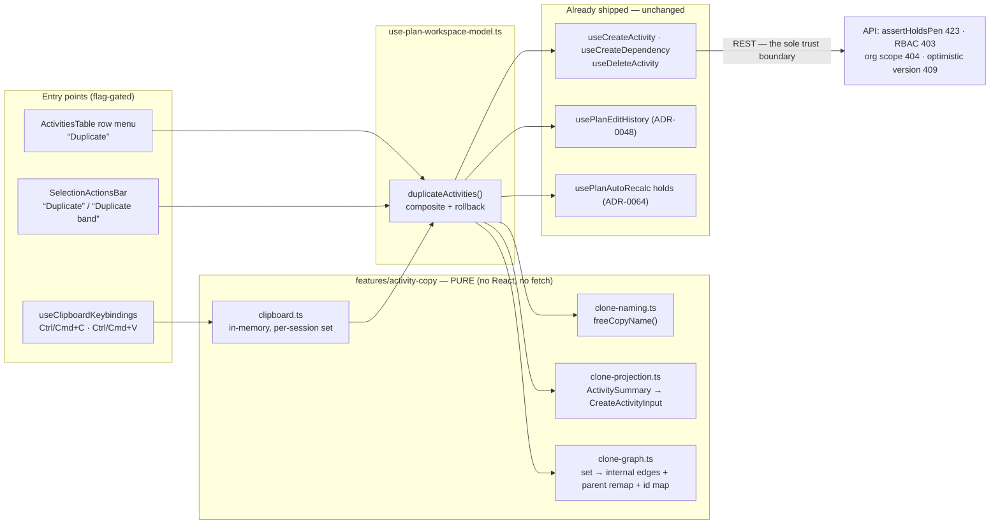
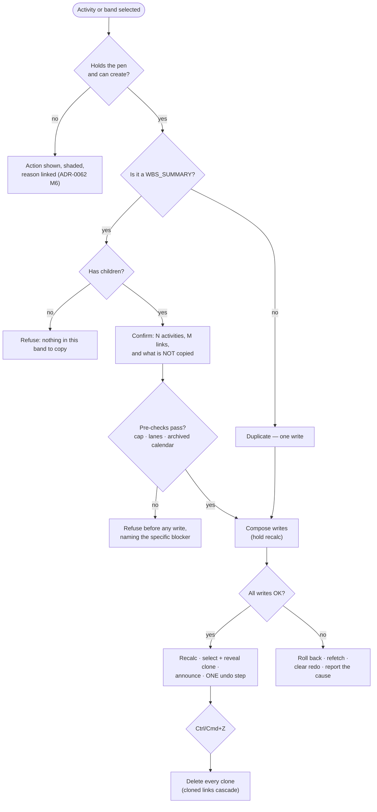

# Feature Spec: Activity copy, paste and duplicate

- **Status:** Draft — **awaiting approval**
- **Author(s):** feature-analyst (Claude Code), with James Ewbank
- **Date:** 2026-08-07
- **Tracking issue / epic:** _(to be opened)_
- **Roadmap link:** Product features — TSLD canvas & editing surface (`docs/ROADMAP.md` §Next)
- **Related ADR(s):** builds on **ADR-0048** (client-side command stack), **ADR-0026** (canvas +
  the parallel DOM a11y layer), **ADR-0028** (the pen), **ADR-0032** (coalesced auto-recalc),
  **ADR-0033** (Early/Visual placement), **ADR-0034** (recalc parity gate), **ADR-0038** (WBS
  parent tree), **ADR-0053 §4** (archive lifecycle), **ADR-0064** (tool-mode contract +
  recalculation holds), **ADR-0068/0070** (per-calendar hours-per-day, minutes as the write unit),
  **ADR-0073 C3.1** (audit families). Proposes an **ADR only if Milestone B (the server-side
  duplicate endpoint) is taken** — see §4.9.

---

## 0. What the code actually says (verified, not assumed)

Per `docs/PROCESS.md` "Decision-bearing claims carry their evidence" and ADR-0076 §19.9, every
load-bearing claim below names the file and line that established it. **The brief for this epic was
checked against the source before any of it was designed.** Eight things differ from, or materially
add to, the summary the work started from.

1. **An activity's `name` is UNIQUE per plan among live rows.**
   `apps/api/prisma/migrations/20260710092048_add_activities/migration.sql:78` —
   `CREATE UNIQUE INDEX "uq_activities_plan_name" ON "activities" ("plan_id","name") WHERE "deleted_at" IS NULL`.
   Line 81 does the same for `code` (`AND "code" IS NOT NULL`). Nothing in `ActivitiesService.create`
   catches the violation, so it surfaces as a Prisma `P2002` mapped by
   `apps/api/src/common/filters/all-exceptions.filter.ts:111-115` to a **409 with a deliberately
   noun-free generic message**. **Naming a copy is therefore a correctness requirement, not a
   cosmetic choice** — a paste that reuses the source name fails, and fails with a sentence that
   names nothing the planner can act on.

2. **A name-disambiguation precedent already exists in this repository, and it exists because this
   exact defect shipped.** `packages/interchange/src/validate.ts:55-63` (`disambiguate`) and
   `:76-110` (`repairDuplicateCodesAndNames`), written after an import of a real P6 file with
   **1,911 duplicate names and 0 duplicate codes** died inside the commit transaction on
   `uq_activities_plan_name` (TECH_DEBT #87). Its own docblock records the cause as "one correct
   pattern applied to a control and not its neighbour".

3. **`POST …/activities` DOES accept `laneIndex`.**
   `apps/api/src/modules/activities/dto/create-activity.dto.ts:290-296` (`@IsInt() @Min(0) @Max(10000)`).
   The web's whole-form body builder `createBody` (`apps/web/src/features/activities/api/use-activities.ts:98-154`)
   simply never sends it, which is why `deleteActivityCommand`
   (`apps/web/src/features/undo-redo/commands.ts:375-387`) issues a **second** relane call under a
   docblock reading "The create endpoint doesn't take a lane". That claim is about the client's body
   builder, not the API. **A clone can therefore be created with its lane in one call.**

4. **Duplicating an activity whose calendar has been ARCHIVED will fail with 422.**
   `apps/api/src/modules/activities/activities.service.ts:291-300` calls
   `assertCalendarUsableBy(…, { currentCalendarId: null })` on create, with the comment "A brand-new
   activity holds no calendar yet, so ANY archived calendar is a new binding here and is refused
   (ADR-0053 §4)". The update path (`:551-560`) passes `existing.calendarId`, which is exactly why an
   activity already on an archived calendar stays editable. **A copy is a new binding, so it is
   refused.** This is not hypothetical — ADR-0053 §4 exists precisely so calendars get retired while
   the work using them keeps running, so the first plans to hit it are the mature ones. §2 handles it.

5. **The engine-owned columns and every progress field are STRUCTURALLY uncopyable, not merely
   policy-excluded.** `CreateActivityDto` carries no `percentComplete`, `actualStart`,
   `actualFinish`, `remainingDuration*`, `suspendDate`, `resumeDate` or any CPM output at all — its
   docblock (`create-activity.dto.ts:34-40`) states "progress … starts at its defaults and is changed
   through the progress endpoint; the CPM output columns are engine-owned and never accepted from
   input". The "do not copy progress" decision therefore cannot be got wrong by a later refactor
   without an API change first.

6. **A dependency create writes an audit row; an activity create does not.**
   `apps/api/src/modules/audit/audit-coverage.structural.spec.ts:71` maps
   `POST …/plans/:planId/dependencies` to `dependency.created`; there is no `activity.created` action
   anywhere in `audit-redactor.ts:92-112`. So a client-composed paste of N activities and M internal
   links writes **M audit rows and zero for the activities** — an asymmetry worth stating before a
   reader of the log tries to reconstruct what happened.

7. **Canvas selection is single; the table's multi-selection is conditional.**
   `TsldPanel.tsx` carries one `selectedId` throughout, and the WBS band is select-only (ADR-0063).
   `ActivitiesTable.tsx:246` does hold a `selectedIds` set — but `:301-302` only renders the column
   when `WBS_IMPROVEMENTS_ENABLED && loadedActivities.some(a => a.type === 'WBS_SUMMARY')`, and
   `:294-299` excludes summaries from it. **It is a bulk-assign selection, not a general one.**
   Consequence for scoping: see §0.8 and §4.4.

8. **Every mechanism a paste needs already exists, and one of them removes the multi-select
   dependency from the critical path.**
   - The multi-write composite with rollback: `createLoeSpan`
     (`apps/web/src/components/layout/workspace/use-plan-workspace-model.ts:1158-1251`) — create,
     then dependent writes, then on any failure delete the created activity (its cascade removes
     partial edges), refetch, `editHistory.clearRedo()`, and classify 423 / 409 / 422 distinctly.
   - The one-command-per-composite undo: `createLoeSpanCommand` (`commands.ts:506-553`), whose undo
     deletes the activity and lets the **dependency cascade** take its edges.
   - Token-based recalculation holds: `usePlanAutoRecalc` `hold` / `release` / `notify` / `flush`
     with a cap and an unmount flush (`use-plan-auto-recalc.test.ts:129-268`, ADR-0064).
   - The full-definition projection: `activityDefinitionInput` (`commands.ts:112-142`).
   - Exact lag carriage in **minutes**: `dependencyLinkOf` (`commands.ts:425-434`), which says in
     terms why — a `lagDays` round-trip silently restored a two-hour cure lag as no lag at all.
   - **And the WBS parent tree is a first-class, server-held set.** A "duplicate this band" gesture
     needs no multi-select at all: the set is `summary + subtree`, which the client already holds.
     That is what makes a genuinely multi-activity slice shippable **before** the multi-select epic
     (§4.4, and Milestone 2 in the plan).

Also verified: the plan workspace loads **every** activity, not a page
(`use-activities.ts:211-221`, `apiFetchAllPages`), so a free copy-name can be computed client-side
with no probe endpoint; `activity:create`, `dependency:create` and `cost:read` are all in the same
Planner + Org Admin bundles (`apps/api/src/common/auth/org-permissions.ts:197,201,254`), which is
what makes carrying a budgeted expense safe today (§2, and the structural test that pins it); and
the guest share DTO is read-only with no write path at all (ADR-0051), so nothing here reaches the
External-Guest surface.

---

## 1. Business understanding

### Problem

**Nothing in SchedulePoint copies anything.** There is no `Duplicate` on the activities-table row
menu (`ActivitiesTable.tsx:341-410` lists Logic / Report progress / Members / Resources / Steps /
Edit / Dissolve / Delete), none on the canvas selection bar
(`selection-actions.tsx:87-198`), no keyboard copy or paste anywhere in the plan workspace, and no
template or fragnet library. The only way to produce a second copy of a work item is to type it
again; the only way to produce a second copy of a **fragnet** — a sequence of activities with the
logic between them — is to type all of it again and re-draw every link by hand.

That is the wrong shape for the domain. Construction programmes are overwhelmingly **repetitive**:
the same six activities per floor for twelve floors, the same fit-out sequence per apartment, the
same "excavate → blind → reinforce → pour → strike" fragnet per pour bay. A planner building a
twelve-storey programme today performs the same eight-step authoring sequence 72 times and draws
~130 links by hand, and every one of those is an opportunity to get a lag, a type or a direction
wrong. The product has spent four epics making the individual gestures excellent (ADR-0052 direct
manipulation, ADR-0064 the tool-mode contract, ADR-0065 link routing) and has never reduced the
**number** of gestures.

**Why now.** Three things landed that make this cheap and make its absence conspicuous:

- **ADR-0048's command stack** means a composite edit can be one undoable step, and its delete-undo
  is already re-create-with-a-new-id — so paste-undo-as-batch-delete needs no new model.
- **ADR-0063's WBS band** put a first-class, server-held grouping of activities on the primary
  surface. "Copy Level 2 to Level 3" is now a gesture with an object to attach to.
- **ADR-0066's seed catalogue** exists to prove the write paths that no engine gate can reach —
  and a copy is nothing but write paths.

### Users

| Role                          | Need                                                                                                                                                             |
| ----------------------------- | ---------------------------------------------------------------------------------------------------------------------------------------------------------------- |
| **Planner** (holds the pen)   | Repeat a work item, and repeat a whole band of work with its internal logic intact, in one action — then place it and adjust. The primary and only writing user. |
| **Org Admin**                 | Everything a Planner can do (superset), plus the pen override — which is the one way a paste can be interrupted mid-flight (§2 Edge cases).                      |
| **Contributor**               | **No capability here.** `activity:create` is deliberately not a Contributor permission (`org-permissions.spec.ts:93`). The affordance is absent, not shaded.     |
| **Viewer**                    | As Contributor — absent.                                                                                                                                         |
| **External Guest** (ADR-0051) | **Out of scope by construction** — the guest surface is read-only and structurally distinct (`GuestPrincipal`); there is no write path to reach.                 |

### Primary use cases

1. **Duplicate one activity.** "Another pour like that one." One action from the row menu or the
   canvas selection bar; the copy appears named, placed and selected.
2. **Duplicate a band with its logic.** "Level 3 is Level 2 again." One action on a `WBS_SUMMARY`;
   the summary, its subtree, the dependencies **internal to** that subtree, and the parent tree
   inside it are all cloned, with every internal link re-pointed at the clones.
3. **Copy an arbitrary set and paste it.** `Ctrl/Cmd+C` on a selection, `Ctrl/Cmd+V` to place a
   copy. Same rules; the set comes from a selection rather than from the WBS.
4. **Undo any of the above as one step.** `Ctrl/Cmd+Z` removes the whole paste, clones and cloned
   links together.

### User journeys

**Happy path — duplicate one activity.** Planner holds the pen → selects "Pour slab L2" on the
canvas → the floating selection bar's **Duplicate** → a copy named "Pour slab L2 (copy)" is created
in the next free lane at the same start, the coalesced auto-recalc redraws (ADR-0032), the new bar
is **selected and revealed**, and the announcement says what happened and what was not copied
("Duplicated "Pour slab L2" as "Pour slab L2 (copy)". Progress and resource assignments were not
copied."). One `Ctrl+Z` removes it.

**Happy path — duplicate a band.** Planner selects the "Level 2" summary in the canvas WBS band →
**Duplicate band** → a confirmation states exactly what will happen and what will not ("Copies
_Level 2_ and the 14 activities in it, with the 21 links between them. Progress, resource
assignments and notes are not copied.") → confirm → the clones land below the plan's lowest lane
preserving their relative lanes and time positions → recalc → the new summary is selected and
revealed → the announcement names the counts. One `Ctrl+Z` removes all 15 activities and 21 links.

**Alternate — the source is on an archived calendar (§0.4).** The action is offered, the
confirmation states the problem before anything is written ("_Pour slab L2_ uses the calendar
"Site 5-day (2025)", which has been retired. A new activity cannot be created on a retired calendar.
Un-retire it, or change this activity's calendar, then try again."), and nothing is sent. This is a
refusal, not a silent substitution: swapping the clone onto the plan calendar would change its dates
without saying so.

**Alternate — the pen is not held.** The action is **present and shaded with a reason** (the
ADR-0062 M6 rule — never hidden, never a dead end), `aria-describedby`-linked, using the existing
`PEN_REASON` copy the neighbouring Edit/Delete items already use.

**Alternate — the paste is interrupted.** An Org-Admin pen override or a dropped connection mid-band
leaves the composite partially applied; the client rolls back the clones it created, refetches,
clears the redo branch, and reports honestly ("The copy could not be completed and was rolled back.
Nothing was added."). Where the rollback itself fails, it says so and the refetch shows the truth
(§2 Error scenarios).

### Expected outcomes

- Building a twelve-storey repetitive programme goes from ~72 authoring sequences and ~130 hand-drawn
  links to **12 band duplicates**, with the logic correct by construction rather than by care.
- The most error-prone part of repetitive authoring — re-drawing the same fragnet's links, with the
  same types and lags, twelve times — stops being done by hand at all.
- A planner can experiment: "copy this sequence, try it four weeks later" becomes a one-step,
  one-undo action rather than a commitment.

### Success criteria

| Measure                                      | Target                                                                                                         |
| -------------------------------------------- | -------------------------------------------------------------------------------------------------------------- |
| Duplicate one activity                       | ≤ 2 user actions from selection; **1** HTTP write; the clone selected and on screen                            |
| Duplicate a 15-activity band with 21 links   | ≤ 3 user actions; every internal link present and re-pointed; **zero** links to the originals                  |
| Paste round-trip fidelity                    | Every carried field byte-equal to the source, proven field-by-field by the census test (§4.7)                  |
| Undo a band duplicate                        | One `Ctrl+Z` removes every clone and every cloned link; active count returns to the pre-paste number           |
| Band-duplicate wall clock (client composite) | **Measured, not assumed** (M2-T4). Provisional gate: p95 < 2 s for 15 activities + 21 links against a real API |
| Recalc parity                                | `computeSchedule` **byte-identical**; no engine file changed; structural (§3)                                  |
| Flag-off parity                              | Every touched surface pinned byte-for-byte by a flag-off suite                                                 |

### Open questions

**CRITICAL (answers change design or scope):** **C-1** the multi-select dependency and whether
Milestone 2 (band duplicate) is accepted as the multi-activity slice · **C-2** whether the
`code` is copied, suffixed or dropped · **C-3** whether resource assignments carry in the first
shipped slice or in Milestone 4 · **C-4** whether Milestone B (the server-side duplicate endpoint)
is taken now, later-on-measurement, or not at all. Full list with proposed defaults in §6.

---

## 2. Functional requirements

### User stories & acceptance criteria

> **US-1** — As a **Planner**, I want to duplicate a single activity, so that repeating a work item
> is one action rather than eight.
>
> **Acceptance criteria**
>
> - **Given** I hold the pen and an activity that is not a `WBS_SUMMARY` is selected, **when** I
>   activate **Duplicate** (row menu or canvas selection bar), **then** exactly one
>   `POST …/plans/:planId/activities` is sent carrying the projected definition (§2 Field carriage)
>   **including `laneIndex`** — never a second relane call (§0.3).
> - **Given** the duplicate succeeds, **then** the clone is named by the copy-name rule (§2
>   Validation), is **selected and revealed** on the canvas, and a single announcement names both
>   the source and the clone and states what was not copied.
> - **Given** the duplicate succeeds, **then** exactly **one** command is pushed onto the ADR-0048
>   stack, whose `undo` deletes the clone and whose `redo` re-creates it with a new id (the
>   conservative M2 rule the house already uses).
> - **Given** I do not hold the pen, or hold it but lack `activity:create`, **when** I open the row
>   menu or the selection bar, **then** **Duplicate** is **present and shaded with a reason**
>   linked by `aria-describedby` — never hidden, never a dead end (ADR-0062 M6).
> - **Given** the selected activity is a `WBS_SUMMARY`, **then** the item reads **Duplicate band**
>   and behaves as US-2 — a lone summary clone is never created (a childless summary collapses to
>   the data date and reads as breakage).
> - **Given** the write is in flight, **then** the control is **`aria-busy`, not `disabled`** — a
>   `disabled` control blurs focus to `<body>` and flips twice per write (the ADR-0060 M6 /
>   ADR-0063 M6 finding, learnt twice).

> **US-2** — As a **Planner**, I want to duplicate a WBS band with the logic inside it, so that
> "Level 3 is Level 2 again" is one action and the links are right by construction.
>
> **Acceptance criteria**
>
> - **Given** a `WBS_SUMMARY` with a subtree, **when** I activate **Duplicate band**, **then** a
>   confirmation states the exact counts of activities and internal links to be copied, and names
>   what will **not** be copied, before anything is written.
> - **Given** I confirm, **then** the summary, every descendant, every dependency **whose
>   predecessor AND successor are both in the copied set**, and the `parentId` edges internal to
>   the set are created — and **no** dependency crossing the set boundary is created.
> - **Given** the set is copied, **then** every cloned link's endpoints are the **clones**, proven
>   by an assertion that no cloned edge references a source id.
> - **Given** any cloned link, **then** its `type`, `lagMinutes` (**minutes**, never a re-derived
>   `lagDays` — §0.8) and `lagCalendar` equal the source link's.
> - **Given** the copy succeeds, **then** exactly **one** command is pushed, whose `undo` deletes
>   every clone (their cloned links cascade with them) and whose `redo` re-composes the whole set.
> - **Given** any write in the composite fails, **then** every clone created so far is deleted, the
>   plan is refetched, the redo branch is cleared, and a message distinguishes 423 (pen lost) from
>   409/422 (rejected) from a rollback that itself failed.
> - **Given** the set exceeds the configured cap, **then** the action is refused **before** any
>   write with a message naming the cap and the actual size.

> **US-3** — As a **Planner**, I want to copy an arbitrary set of activities and paste it, so that a
> fragnet that is not a WBS band can be repeated too.
>
> **Acceptance criteria**
>
> - **Given** a multi-activity selection exists, **when** I press `Ctrl/Cmd+C`, **then** the set is
>   captured into an in-session app clipboard and the count is announced. **Copy is a read** — it
>   requires `activity:create` (so it is offered only to someone who could paste) but **not** the
>   pen; taking the pen is deferred to the paste.
> - **Given** the app clipboard holds a set, **when** I press `Ctrl/Cmd+V` while holding the pen,
>   **then** the set is pasted by exactly the US-2 rules.
> - **Given** focus is in an `input`, `textarea`, `select` or `contenteditable`, **or** a document
>   text selection is non-collapsed, **then** neither accelerator fires and the browser's native
>   copy/paste is untouched. (The undo hook checks only the target element —
>   `use-undo-redo-keybindings.ts:58-60` — which is **not sufficient for copy**: a user can select
>   label text in the activities table with focus on the table body.)
> - **Given** a modal dialog is open, **then** neither accelerator fires (the undo hook's rule,
>   `use-undo-redo-keybindings.ts:53-54`).
> - **Given** `Ctrl/Cmd+V` with an empty clipboard, **then** nothing is written and an announcement
>   says so — never silence.
> - **Given** any tool mode is armed (`add-activity` / `link` / `loe`), **then** paste **does not
>   arm, disarm or interact with it**: paste is a one-shot command like Undo, not a fifth mode
>   (ADR-0064's one arm/disarm contract is untouched).

> **US-4** — As a **Planner**, I want a copy to carry the work's definition and _not_ its history,
> so that a copy never claims progress that did not happen.
>
> **Acceptance criteria**
>
> - **Given** a source with progress (percent, actuals, remaining, suspend/resume, physical %),
>   **then** the clone has none of it — structurally, because the create DTO accepts none of it
>   (§0.5).
> - **Given** a source with notes, **then** the clone has none — a note is an attributed, dated
>   statement by a person about a specific activity, and re-attributing it is a falsification.
> - **Given** a source with external inter-project dates, **then** the clone has none — those are
>   commitments bound to _that_ activity by an interface agreement the copy is not party to.
> - **Given** a field is added to `ActivitySummary` later, **then** the build **fails** until the
>   field is classified carried / transformed / withheld (the field-census test, §4.7).

### Workflows

**W-1 Duplicate one activity (M1).**

1. Client resolves the free copy name against its already-complete activity list (§0's
   `apiFetchAllPages` note).
2. Client pre-checks the archived-calendar case (§0.4) and refuses with a specific message if it
   applies.
3. Client takes a **recalculation hold** (ADR-0064) so bars cannot move under the planner mid-action.
4. One `POST …/activities` with the projected definition + `laneIndex`.
5. Record one `duplicateCommand`; release the hold; `notify()` the coalesced recalc.
6. Select + reveal the clone; announce; return focus to the invoking control.

**W-2 Duplicate a band / paste a set (M2/M3).**

1. Derive the set (summary + subtree, or the clipboard set), and the **internal** edge set —
   `deps.filter(d => set.has(d.predecessor.id) && set.has(d.successor.id))`.
2. Refuse above the cap; refuse on an archived calendar in the set; show the confirmation with real
   counts.
3. Take the recalculation hold.
4. Create activities in **parent-before-child** order (the WBS parent must exist before a child
   names it), building `sourceId → cloneId` as it goes. `parentId` is remapped when the parent is in
   the set, and **carried verbatim** when it is not (a leaf duplicate stays in its band).
5. Create the cloned edges from the id map, in bounded-concurrency batches.
6. Record one `pasteCommand`; release the hold; recalc; select + reveal the anchor clone; announce.
7. On any failure at 4 or 5: delete every clone created so far (their edges cascade), refetch,
   `clearRedo()`, report.

### Field carriage — what a copy carries, and why

The rule is **the principle of least surprise, resolved as: a copy is the same _work_, not the same
_history_ and not the same _commitments_.** Each row states the decision and the reason; the
census test (§4.7) makes the table executable.

| Field(s)                                                                                                                                 | Decision                                         | Why                                                                                                                                                                                                                                                                                                                              |
| ---------------------------------------------------------------------------------------------------------------------------------------- | ------------------------------------------------ | -------------------------------------------------------------------------------------------------------------------------------------------------------------------------------------------------------------------------------------------------------------------------------------------------------------------------------- |
| `name`                                                                                                                                   | **Transformed** — copy-name rule                 | Required by `uq_activities_plan_name` (§0.1). Not a preference.                                                                                                                                                                                                                                                                  |
| `code`                                                                                                                                   | **Withheld** (blank) — _default, C-2_            | Also unique per plan (§0.1). A suffixed code (`A1010-2`) corrupts a real numbering scheme; a blank code is honestly absent and is renamed once by the planner.                                                                                                                                                                   |
| `description`, `type`, `durationType`, `accrualType`, `percentCompleteType`, `scheduleAsLateAsPossible`, `levelingPriority`              | **Carried verbatim**                             | These _are_ "what this work is".                                                                                                                                                                                                                                                                                                 |
| `durationMinutes`                                                                                                                        | **Carried verbatim (minutes, never days)**       | ADR-0070 §5: a `durationDays` round-trip flattens a four-hour activity to zero. `commands.ts:118-123` already makes this exact point.                                                                                                                                                                                            |
| `calendarId`                                                                                                                             | **Carried verbatim**, with a pre-check           | The calendar is part of how the work is measured. But an **archived** calendar makes the create 422 (§0.4) — refuse the copy with a specific message, never substitute.                                                                                                                                                          |
| `parentId`                                                                                                                               | **Remapped if in set, else carried**             | A leaf duplicate belongs in the same band; a band duplicate's members belong to the _cloned_ band. One rule covers both.                                                                                                                                                                                                         |
| `laneIndex`                                                                                                                              | **Recomputed** by the placement rule             | Layout, not definition. See "Placement" below.                                                                                                                                                                                                                                                                                   |
| `constraintType` / `constraintDate`, `secondaryConstraint*`                                                                              | **Carried, dates shifted by the paste offset**   | A copy of a fragnet pasted four weeks later should carry its SNET four weeks later. The offset is in **calendar days**, matching the canvas x-axis (`daysBetween(dataDate, earlyStart)`, `use-plan-workspace-model.ts` auto-arrange).                                                                                            |
| `visualStart`                                                                                                                            | **Not carried; set by placement** in VISUAL mode | ADR-0033: the placement _is_ the decision being made by the paste.                                                                                                                                                                                                                                                               |
| `budgetedExpense`                                                                                                                        | **Carried** (pinned by a structural test)        | Same work, same budget. Safe **only because** `cost:read` and `activity:create` are the same role set today (`org-permissions.ts:197,254`); a structural test asserts that so the day it changes, the build fails rather than the budget silently vanishing (a `null` from a non-cost-reader is indistinguishable from "unset"). |
| `actualExpense`                                                                                                                          | **Withheld**                                     | An actual.                                                                                                                                                                                                                                                                                                                       |
| `expectedFinish`                                                                                                                         | **Withheld**                                     | A target for _this_ instance's remaining work (ADR-0035 §9). Meaningless on work not yet started, and it would move the clone's dates.                                                                                                                                                                                           |
| `externalEarlyStart` / `externalLateFinish`                                                                                              | **Withheld**                                     | Commitments bound to _that_ activity by an inter-project interface (ADR-0043). A copy is not party to the agreement; carrying them would silently clamp it.                                                                                                                                                                      |
| `percentComplete`, `status`, `actualStart`, `actualFinish`, `remainingDuration*`, `suspendDate`, `resumeDate`, `physicalPercentComplete` | **Withheld — structurally**                      | The create DTO accepts none of them (§0.5). A copy claiming 60% complete would also _move dates_ via the data-date floor and corrupt Earned Value.                                                                                                                                                                               |
| Every CPM output + engine flag (`earlyStart`…`levelingDelay`, `isCritical`, `constraintViolated`, `loeNoSpan`, …)                        | **Withheld — structurally**                      | Engine-owned; never accepted from input. The clone gets them from the next recalculation.                                                                                                                                                                                                                                        |
| **Notes** (ADR-0046)                                                                                                                     | **Never carried**                                | An attributed, dated statement by a person about a specific activity. There is also no API that could preserve authorship — the create attributes to the caller.                                                                                                                                                                 |
| **Resource assignments** (ADR-0039/0040/0044/0071)                                                                                       | **Milestone 4** — carried, minus actuals         | A copied concrete task without its crew is half a copy. Deferred because it is one `POST …/assignments` per assignment with its own invariants (exactly-one-driver, `RESOURCE_ARCHIVED` on _create_). Until then the confirmation and the announcement **say** they are not copied.                                              |
| **Weighted steps** (ADR-0044 §33)                                                                                                        | **Milestone 4** — names + weights, `%` zeroed    | The name and weight are definition; the percent is progress. One `PUT …/steps` per clone.                                                                                                                                                                                                                                        |

### Placement — where a clone lands

- **Single duplicate (M1):** same time position as the source, in the **next lane below the plan's
  current lowest lane**. Time is pinned by the same mode-aware mechanism a canvas drop already uses:
  an `SNET` constraint at the source's early start in EARLY mode, a `visualStart` in VISUAL mode
  (ADR-0033/ADR-0052 §3). One code path, already reviewed.
- **Set duplicate / paste (M2/M3):** the whole set moves to `maxLaneIndex + 1 + relativeLane`,
  preserving relative lanes and relative time exactly. **Only the anchor** (the earliest-starting
  clone) is pinned; every other clone's position comes from the cloned internal logic. Pinning all
  of them would write N constraints the planner never asked for — the thing ADR-0033 explicitly
  de-overloaded.
- **Below everything, deliberately.** It is predictable, can never overlap, needs no new geometry
  code, and **Auto-arrange already exists** to tidy it (`packLanes`, `@repo/layout`). "Paste at the
  cursor" is a real want and is a Milestone 4+ candidate — it needs the tool-mode question answered
  (§6, Q-6) and is not worth coupling to this epic.
- **Boundary:** `laneIndex` is capped at 10 000 (`create-activity.dto.ts:295`). Where
  `maxLane + setHeight > 10000` the paste is refused before any write with a message naming the
  cap, rather than 400-ing halfway through.

### Edge cases

| Case                                                        | Expected behaviour                                                                                                                                                                                                                                  |
| ----------------------------------------------------------- | --------------------------------------------------------------------------------------------------------------------------------------------------------------------------------------------------------------------------------------------------- |
| Source calendar archived (§0.4)                             | Refuse before any write, naming the calendar and both remedies. Never silently re-point to the plan calendar (it changes dates).                                                                                                                    |
| Source name at the 200-char limit                           | The base is truncated to fit the ` (copy)` suffix, mirroring `disambiguate` (`validate.ts:55-63`).                                                                                                                                                  |
| `Excavate (copy)` already exists                            | Next free candidate `Excavate (copy 2)`, `(copy 3)`, … probing the live list.                                                                                                                                                                       |
| Name taken between probe and POST (409 `P2002`)             | Retry **once** with the next candidate, then report. The pen makes a second writer near-impossible; an Org-Admin override is the case.                                                                                                              |
| Lone `WBS_SUMMARY`                                          | Never created. The item reads **Duplicate band** and copies the subtree (US-1 AC).                                                                                                                                                                  |
| Summary with **no** children                                | Refused with "There is nothing in this band to copy." — an empty summary collapses to the data date and reads as breakage.                                                                                                                          |
| Lone `LEVEL_OF_EFFORT` (no SS/FF drivers in the set)        | Allowed; the engine already produces-and-flags `loeNoSpan` (ADR-0035 §21). The confirmation says the span will need re-linking.                                                                                                                     |
| Lone `RESOURCE_DEPENDENT` before Milestone 4                | Allowed; the engine already produces-and-flags `resourceDriverMissing`. Named in the announcement.                                                                                                                                                  |
| Set larger than the cap                                     | Refused before any write, naming the cap and the size, and pointing at the Milestone B endpoint if it exists.                                                                                                                                       |
| Lane ceiling exceeded                                       | Refused before any write (above).                                                                                                                                                                                                                   |
| Pen lost mid-composite (Org-Admin override)                 | 423 → roll back the clones created so far, refetch, `clearRedo`, report as a pen loss (not as a rejection).                                                                                                                                         |
| Rollback itself fails                                       | Report it explicitly ("Some copied activities may remain — the plan has been refreshed."), refetch, and truncate the history. Never claim a clean rollback.                                                                                         |
| Plan or source deleted concurrently                         | 404 → refetch, report, no partial state (the composite has not started writing).                                                                                                                                                                    |
| Cloned link would create a **cycle**                        | **Structurally unreachable** in v1: the cloned edge set is isomorphic to a subgraph of an acyclic graph (ADR-0021) over a disjoint set of brand-new nodes, and no edge crosses to the originals. Asserted in a test rather than handled at runtime. |
| Duplicate **dependency** (`uq_dependencies_pred_succ_type`) | Also unreachable for the same reason — every cloned edge's ordered pair is new.                                                                                                                                                                     |
| Undo after the source has since been deleted                | Irrelevant — undo deletes the _clones_, which the client holds ids for. Idempotent via the `existenceToggle` pattern (`commands.ts:312-329`).                                                                                                       |
| Two pastes in quick succession                              | Two commands. A paste carries **no** `coalescing` key — it is a discrete edit, like a dialog save.                                                                                                                                                  |

### Permissions

Deny-by-default, RBAC + organisation scope (ADR-0012), enforced **server-side on the existing
endpoints** — the client composite adds no trust boundary of its own.

| Action                          | Permission(s)                                             | Roles              | Pen (ADR-0028)                                                                                               |
| ------------------------------- | --------------------------------------------------------- | ------------------ | ------------------------------------------------------------------------------------------------------------ |
| Duplicate / paste activities    | `activity:create`                                         | Planner, Org Admin | **Required** — structural plan write                                                                         |
| Clone internal dependencies     | `dependency:create`                                       | Planner, Org Admin | **Required**                                                                                                 |
| Carry budgeted expense          | `cost:read` (already implied by the above)                | Planner, Org Admin | n/a — read                                                                                                   |
| **Copy** into the app clipboard | `activity:create` (offer gate only)                       | Planner, Org Admin | **Not required** — copy writes nothing; the pen is taken at paste (the ADR-0060 per-scope rule in miniature) |
| Carry assignments (M4)          | `resource:assign` (existing gate on `POST …/assignments`) | Planner, Org Admin | **Required**                                                                                                 |

Every write rides `assertHoldsPen` (423), the RBAC guard (403), the org scope (404, never an
existence oracle) and the optimistic `version` (409) **unchanged**. Nothing here can escalate: the
client is composing calls it could already make one at a time.

### Validation rules

- **Copy name** — `` `${base} (copy)` ``, then `` `${base} (copy ${n})` `` for n = 2, 3, …, probing
  the plan's **live** names. Base truncated so the result is ≤ `ACTIVITY_NAME_MAX_LENGTH` (200).
  Shared client↔server only in the sense that the server's unique index is the authority; the
  client computes a free candidate and retries once on a race.
  - **Why ` (copy)` and not `Copy of `:** an activities list sorts and groups by name in several
    places. `Copy of Excavate L2` files under "C", away from its original; `Excavate L2 (copy)`
    files beside it. That is the substantive reason, not aesthetics.
  - **Why not reuse `disambiguate` from `@repo/interchange`:** the rules genuinely differ — an
    import repair must preserve the _source's_ identity (`Excavate-2`), a copy must be identifiable
    _as a copy_. The ADR-0065 "two implementations drift invisibly" argument does not apply here,
    because this drift is visible the instant a name renders. Both live under one documented
    convention in `docs/DECISIONS.md`; neither is a shared function.
- **Set size** — capped. The number is **set by measurement in M2-T4**, not asserted here;
  provisional default **200 activities**, chosen to sit an order of magnitude below the
  `UpdatePositionsDto` 2 000-row precedent and to keep a client composite inside a few seconds.
- **Lane ceiling** — `maxLane + setHeight ≤ 10000` (`create-activity.dto.ts:295`).
- **Internal-edge rule** — an edge is cloned **iff** both endpoints are in the set. No edge crosses
  the boundary, in either direction.
- **Parent-before-child** creation order — a clone naming a cloned parent requires that parent to
  exist (`assertValidParent`, `activities.service.ts:301-303`).

### Error scenarios

| Scenario                           | Detection                                    | User-facing result                                                                             | Status |
| ---------------------------------- | -------------------------------------------- | ---------------------------------------------------------------------------------------------- | ------ |
| Not a Planner/Org Admin            | RBAC guard                                   | The action is **absent** (not a shaded control — this role never gains it)                     | 403    |
| Pen not held                       | `assertHoldsPen`, client-side gate first     | Action **present and shaded** with `PEN_REASON`, `aria-describedby`-linked                     | 423    |
| Pen lost mid-composite             | 423 on a sub-write                           | Roll back the clones, refetch, clear redo, "the copy was rolled back — the pen was taken"      | 423    |
| Source calendar archived           | Client pre-check + server guard              | Refused before any write, naming the calendar and both remedies                                | 422    |
| Name taken (race)                  | `P2002` → generic 409                        | One silent retry with the next candidate; then a specific message naming the clash             | 409    |
| Optimistic conflict on a sub-write | `version` mismatch                           | Roll back, refetch, clear redo, "the plan changed — nothing was added"                         | 409    |
| Set above the cap / lane ceiling   | Client pre-check                             | Refused with the cap and the actual size, before any write                                     | —      |
| Partial failure mid-band           | Any sub-write rejects                        | Rollback + refetch + `clearRedo` + a message distinguishing pen / rejection / rollback failure | varies |
| Rollback fails                     | Delete rejects during rollback               | Explicit "some copied activities may remain; the plan has been refreshed", history truncated   | varies |
| Archived resource in the set (M4)  | 422 `RESOURCE_ARCHIVED` on assignment create | The assignment is **skipped and reported**; the paste itself succeeds                          | 422    |
| Empty clipboard on paste           | Client                                       | Announced ("Nothing has been copied yet."), nothing written                                    | —      |

---

## 3. Technical analysis

| Area           | Impact                                       | Notes                                                                                                                                                                                                 |
| -------------- | -------------------------------------------- | ----------------------------------------------------------------------------------------------------------------------------------------------------------------------------------------------------- |
| Frontend       | **High** (M1–M4) — this is the whole feature | One new feature folder `features/activity-copy/` (pure model + hooks), two toolbar/menu registrations, one keybinding hook, one undo command builder, one composite in `use-plan-workspace-model.ts`. |
| Backend        | **None** (M1–M4) · **Medium** (M-B only)     | M1–M4 use `POST …/activities`, `POST …/plans/:planId/dependencies`, `POST …/assignments`, `PUT …/steps`, `DELETE …/activities/:id` — all shipped. M-B would add one endpoint + DTO + service method.  |
| Database       | **None**                                     | No model, column, index or constraint changes at any milestone, including M-B.                                                                                                                        |
| API            | **None** (M1–M4) · one endpoint (M-B)        | M-B: `POST …/plans/:planId/activities/duplicate` + `@repo/types` response + OpenAPI + a route-census entry (`activity.duplicated`).                                                                   |
| Security       | **Low**                                      | No new trust boundary: the client composes calls it can already make. The API stays the sole authority; the app clipboard is **in-memory and same-tab**, never the system clipboard (see §4.5).       |
| Performance    | **Medium** — the honest cost of a composite  | N + M sequential-ish HTTP writes, each taking the plan advisory lock; M audit rows. Bounded concurrency + a cap + a recalculation hold. **Measured in M2-T4**, and the measurement decides M-B (C-4). |
| Infrastructure | **None**                                     | No new services, env vars beyond the `VITE_` flag, or CI services. One new Playwright project + CI step at M5 (the house pattern).                                                                    |
| Observability  | **Low** (M1–M4)                              | M audit rows per paste for the links, zero for the activities (§0.6) — an asymmetry M-B would fix with one `activity.duplicated` row. No new logs/metrics/traces.                                     |
| Testing        | **High**                                     | Pure-model unit tests incl. the **field census**; hook tests for the composite's rollback paths; component tests for both entry points and both flag states; a flag-on Playwright journey at M5.      |

### Dependencies

**Prerequisites (all met):** ADR-0048 command stack (shipped, default-on) · ADR-0064 recalculation
holds (shipped) · ADR-0063 WBS band + `wbs-groups.ts` derivation (shipped) · ADR-0053 archive
lifecycle (shipped — it is what makes §0.4 a live case) · `@repo/layout` `packLanes` (shipped, used
only as the tidy-up story, not called by this epic).

**Soft dependency — the canvas multi-select epic.** Milestone 3 (arbitrary-set copy/paste) needs a
multi-activity selection on the canvas, which does not exist (§0.7). **Milestones 1 and 2 do not
depend on it at all**, and Milestone 2 delivers the multi-activity capability via the WBS band. If
multi-select slips, M3 can still ship sourced from the activities table's existing selection column
where it is present — a narrower but real surface.

**Affected features:** undo/redo (one new command builder), the activities table (one row action),
the canvas selection bar (one item), the WBS band (the summary case), auto-recalc (one more
`notify` caller and one more hold-taker). **Nothing in the engine, the conformance harness, the
seed catalogue's `SeedSpec` model, or the share/guest surface.**

---

## 4. Solution design

### 4.1 Architecture overview

Frontend-only for M1–M4. One new pure model module, one new hooks module, and one composite added
beside the existing `createLoeSpan` in the plan-workspace model. The API, the database and the CPM
engine are untouched.



**The CPM engine is not imported anywhere in this diagram.** The recalc parity gate (ADR-0034) is
untouched **by construction**: this epic adds no scheduling input, changes no engine file, and sends
only field values `CreateActivityDto` and `CreateDependencyDto` already accept. The evidence is
structural — nothing under `apps/web/src` imports `schedule/engine/*`, and the only files this epic
touches are `apps/web/src/features/*` plus `use-plan-workspace-model.ts`. If Milestone B is taken it
is an API/service change and **still** no engine change: the endpoint composes the same
`ActivitiesService.create` / `DependenciesService.create` paths in one transaction.

### 4.2 Data flow — duplicating a band

```mermaid
sequenceDiagram
  autonumber
  actor P as Planner (holds the pen)
  participant UI as Selection bar / row menu
  participant M as duplicateActivities()
  participant G as clone-graph (pure)
  participant R as usePlanAutoRecalc
  participant A as API
  participant H as Edit history

  P->>UI: Duplicate band
  UI->>M: sourceIds = summary + subtree
  M->>G: derive internal edges, parent remap, free names, placement
  G-->>M: plan of N creates + M links (no I/O yet)
  M->>M: pre-checks — cap, lane ceiling, archived calendar
  M-->>P: confirmation naming N, M and what is NOT copied
  P->>M: Confirm
  M->>R: hold(token)  %% bars cannot move mid-action (ADR-0064)
  loop parent-before-child
    M->>A: POST /activities  (definition + laneIndex)
    A-->>M: clone row (id, version)
    M->>M: sourceId → cloneId
  end
  loop bounded concurrency
    M->>A: POST /plans/:id/dependencies  (type, lagMinutes, lagCalendar)
    A-->>M: cloned edge
  end
  M->>H: record ONE pasteCommand (undo = delete clones; redo = re-compose)
  M->>R: release(token) ; notify()
  R->>A: POST /schedule/recalculate  (coalesced, ADR-0032)
  M-->>P: select + reveal the clone summary; announce counts
```

**Failure branch (any step 7–12):** delete every clone created so far — their cloned edges cascade
with them, which is what makes the rollback composable from existing mutations (`commands.ts:543`
records the same property for the LOE span) — then refetch, `editHistory.clearRedo()`, and report
423 / 409-422 / rollback-failed as three distinct outcomes.

### 4.3 User flow



### 4.4 The multi-select question, resolved

The brief anticipated that any multi-activity slice would be gated on the canvas multi-select epic.
**It does not have to be**, and this is the design's most useful finding: **the WBS parent tree is
already a server-held, first-class set** (ADR-0038, surfaced by ADR-0063's band). "Duplicate this
band" needs no selection model, is the single most valuable repetitive-construction gesture, and
exercises every hard part of the feature — the id map, the internal-edge rule, the parent remap, the
one-command undo, the rollback.

So the sequencing is:

- **M1** single-activity duplicate — no dependency on anything.
- **M2** band duplicate — the multi-activity capability, **no dependency on multi-select**.
- **M3** arbitrary-set copy/paste — the only slice gated on selection, and even it can ship from
  the activities table's existing (conditional) selection column if the canvas epic slips.

This also settles a rule the epic would otherwise have to guess: **Duplicate on a leaf is M1;
Duplicate on a summary is M2.** A lone summary clone is never created, so the "empty band that
collapses to the data date" failure mode cannot be reached from the UI at all.

### 4.5 Why an in-memory app clipboard, not the system clipboard

M3's `Ctrl/Cmd+C` captures into a per-session, in-memory set — not `navigator.clipboard`.

1. The payload is a **graph of ids**, meaningless as text and dangerous as a paste target: a
   clipboard payload naming activity ids from another org would be an IDOR surface the moment
   anything trusted it. Keeping it in memory means there is nothing to trust.
2. `navigator.clipboard.readText()` triggers a permission prompt in some browsers — a permission
   dialog is a terrible thing to put between "Ctrl+V" and "a bar appears".
3. Cross-plan and cross-tab paste are the only things the system clipboard would buy, and cross-plan
   paste is deliberately out of scope (§4.8).

The trade-off is stated rather than hidden: a reload clears the clipboard, exactly as the ADR-0048
undo stack is cleared on reload. The two lifetimes match, which is the right answer for a per-pen-
session authoring aid.

### 4.6 Database changes

**None.** No model, column, index, constraint or migration at any milestone, including Milestone B.
The two unique indexes this feature must respect (`uq_activities_plan_name`,
`uq_activities_plan_code`) already exist and are the reason the naming rule exists.

### 4.7 Component changes

| Component                                                             | Change                                                                                                                                                                                                                                |
| --------------------------------------------------------------------- | ------------------------------------------------------------------------------------------------------------------------------------------------------------------------------------------------------------------------------------- |
| `features/activity-copy/model/clone-naming.ts` **(new, pure)**        | `freeCopyName(sourceName, usedNames)` — the ` (copy)` / ` (copy n)` probe with the 200-char truncation.                                                                                                                               |
| `features/activity-copy/model/clone-projection.ts` **(new, pure)**    | `projectClone(activity, opts)` → the create body. **The field-census test lives beside it.**                                                                                                                                          |
| `features/activity-copy/model/clone-graph.ts` **(new, pure)**         | `planClone(set, dependencies, placement)` → ordered creates (parent-before-child), internal edges, parent remap, lane offsets, and the refusal reasons.                                                                               |
| `features/activity-copy/model/clipboard.ts` **(new)**                 | The in-session set store (M3).                                                                                                                                                                                                        |
| `features/activity-copy/hooks/use-clipboard-keybindings.ts` **(new)** | Returns a React `onKeyDown` handler (never a native listener — `use-undo-redo-keybindings.ts:9-16`: React events follow the React tree, and the toolbar is portalled). Adds the **text-selection guard** the undo hook does not need. |
| `features/undo-redo/commands.ts`                                      | One new builder `pasteCommand` (undo = delete clones in reverse order; redo = re-compose). No change to any existing builder.                                                                                                         |
| `components/layout/workspace/use-plan-workspace-model.ts`             | One new composite `duplicateActivities` beside `createLoeSpan`, following its rollback/classification contract exactly.                                                                                                               |
| `features/activities/components/ActivitiesTable.tsx`                  | One `RowAction` — **Duplicate** / **Duplicate band**, placed after **Edit** and before **Dissolve** (the ADR-0063 adjacency argument: neighbours in intent, and the non-destructive one visible when the destructive one is chosen).  |
| `features/tsld/toolbar/selection-actions.tsx`                         | One `ToolbarItem` — `penGated: true`, `disabledReason` = the existing `PEN_REASON`, label switching on the existing `isSummary` context fact.                                                                                         |
| `config/env.ts`                                                       | `ACTIVITY_COPY_PASTE_ENABLED = flagDefaultOff(import.meta.env.VITE_ACTIVITY_COPY_PASTE)` at M0; `flagDefaultOn` at M5.                                                                                                                |

**The field-census test** is the piece worth calling out. It enumerates the keys of
`ActivitySummary` at type level and asserts that each appears **exactly once** in one of three
sets — `CARRIED`, `TRANSFORMED`, `WITHHELD` — with a stated reason. A field added to
`ActivitySummary` later fails the build until somebody decides what a copy does with it. This is the
ADR-0072 route-census idea applied to a projection, and it exists because the failure mode here is
silent: a new definition field that a copy quietly drops looks correct on every screen and is only
ever noticed by someone comparing a copy with its original.

**States, per the design system:** the row/bar items get shaded-with-reason (never hidden) when the
pen is absent; `aria-busy` (never `disabled`) during the write; the confirmation is the existing
`ConfirmDialog` with real counts; failures raise the existing dismissible conflict banner
(`EditConflictBanner`); every outcome is announced through the existing announcer (WCAG 4.1.3 — the
ADR-0064 finding that pointer paths were silent while keyboard paths announced).

### 4.8 Cross-plan paste — recommended deferral, with the reasons

**Same plan only in v1.** Five concrete blockers, each of which is a design question in its own
right, not an implementation detail:

1. **`calendarId` and `parentId` are plan- and project-scoped ids.** ADR-0053 makes a PROJECT-tier
   calendar usable only inside its owning project (`assertCalendarUsableBy`, 422
   `CALENDAR_WRONG_SCOPE`). A cross-plan paste needs a match-or-create policy — the exact problem
   ADR-0053 M5 solved for interchange, and answered "an import never reuses a calendar".
2. **Money is in the plan's currency.** `budgetedExpense` is `BIGINT` minor units in
   `plans.currency_code` (ADR-0042); two plans can differ, and there is no FX model
   (CLAUDE.md §17). A cross-plan budget copy is a silent currency error.
3. **A "day" is per calendar.** ADR-0068: `durationDays × hoursPerDay × 60`. The same stored minutes
   read as a different number of days in a target plan on a different calendar — the copy would
   arrive looking like a different duration with nothing saying so.
4. **The pen is per plan** (ADR-0028). A cross-plan paste is a write to a plan the user may not hold
   the pen for, so it needs two leases and a defined behaviour when only one is available.
5. **Org scope.** A payload naming ids from another organisation must be re-resolved server-side or
   it is an IDOR surface — which is the batch endpoint (Milestone B) again, with authorisation.

**Recommendation:** when cross-plan copy is wanted, build it on the **interchange pipeline's shape**
(validate → report findings → dry-run → commit, ADR-0050) rather than on a clipboard. Every one of
the five blockers above is a _finding_ in that model — reported to the planner, not guessed at.

### 4.9 Implementation approach & alternatives

**Chosen: a client-side composite over the existing REST mutations**, mirroring `createLoeSpan`
exactly (create → dependent writes → rollback-on-any-failure → one undo command → coalesced recalc),
with the pure parts (naming, projection, graph) in a testable module with no React and no fetch.

_Why:_ it reuses every gate and every pattern the house already reviewed; it needs no schema, no
endpoint, no `@repo/types` change and no ADR; it can ship behind a flag with byte-for-byte flag-off
parity; and the CPM engine is not imported, so ADR-0034's parity gate is untouched by construction
rather than by argument.

**Alternative A — a server-side duplicate endpoint (Milestone B).** `POST
…/plans/:planId/activities/duplicate` taking a source id (or id set) and returning the created
graph, in **one transaction**, one `assertHoldsPen`, one plan advisory lock, one
`activity.duplicated` audit row.

_This is materially better on three axes and the spec says so rather than dismissing it:_

- **Atomicity.** The client composite is not atomic. A mid-paste pen override or dropped connection
  leaves a partial fragnet, and the rollback is best-effort — a rollback can itself fail. The
  interchange import (ADR-0050) is a server transaction for exactly this reason and it, too, creates
  an activity graph. That is a real argument that the endpoint is the _correct_ long-run home, not
  merely the faster one.
- **Cost.** N + M round trips, each taking the plan advisory lock, versus one.
- **Audit legibility.** Today a 15-activity band copy writes 21 `dependency.created` rows and
  nothing about the activities (§0.6). One `activity.duplicated` row carrying scalar counts is what
  a reader of the log actually needs — and it earns its place by the ADR-0073 **blast-radius** test
  (a paste creates durable structure another planner will be judged against), which is the same test
  that put `activity.dissolved` and `activity.reparented` in family D.

_Why not first:_ it is a new endpoint, DTO, service method, census entry, OpenAPI change and
`@repo/types` change — real backend work with its own review surface — for a capability that can be
proven and used with none of it. **Recommendation: sequence it after M2, and take it on a stated
trigger** rather than on instinct: either the M2-T4 measurement exceeds the p95 gate, or the M5
journey observes a single partial paste. That is a measure-first decision in the ADR-0058 style. If
taken, it needs an **ADR** (new endpoint shape + the audit action + why a client composite was not
enough).

**Alternative B — copy as a persisted "template"/fragnet library.** Rejected for v1: it is a
different feature (a named, reusable, org-scoped object with its own CRUD, permissions and
lifecycle), and it is much easier to design _after_ a copy exists than before. Nothing here forecloses
it — a template is a persisted clipboard payload.

**Alternative C — paste at the cursor as a tool mode.** Rejected for v1. ADR-0064 bought one
arm/disarm contract across four modes at the cost of a whole epic; a fifth mode whose only job is
"where does this land" is not worth reopening that. Deterministic placement plus one drag is the
cheaper answer, and paste-at-cursor stays available as a later, separately-decided slice.

---

## 5. Links

- Implementation plan: [./implementation-plan.md](./implementation-plan.md)
- Docs this change updates: `docs/ROADMAP.md` (a Next entry), `docs/DECISIONS.md` (the copy-name
  convention and why it is not shared with `@repo/interchange`'s `disambiguate`), `CLAUDE.md` §16
  (only if Milestone B is taken and an ADR is filed), `docs/TESTING.md` (the new Playwright project),
  `apps/web/src/config/env.ts` (the flag's own docblock, per house style).

---

## 6. Open questions

**Critical — an answer changes the design or the scope.**

| #       | Question                                                                                                                         | Proposed default (what happens if you say nothing)                                                                                                                                                                                                      |
| ------- | -------------------------------------------------------------------------------------------------------------------------------- | ------------------------------------------------------------------------------------------------------------------------------------------------------------------------------------------------------------------------------------------------------- |
| **C-1** | Is **Milestone 2 (duplicate a WBS band)** accepted as the multi-activity slice, decoupling this epic from the multi-select epic? | **Yes.** M1 and M2 ship with no dependency on multi-select; only M3 (arbitrary-set copy/paste) is gated on it, and M3 can fall back to the activities table's existing selection column.                                                                |
| **C-2** | Does a copy carry the activity's **`code`**?                                                                                     | **No — the clone's code is blank.** A suffixed code corrupts a real numbering scheme (`A1010-2` is not an activity ID anyone uses); a blank one is honestly absent. Alternative on request: suffix like the import repair does.                         |
| **C-3** | Do **resource assignments** carry in the first shipped slice, or in Milestone 4?                                                 | **Milestone 4.** M1–M3 copy the definition only and **say so** in the confirmation and the announcement. Carrying them earlier doubles the write count and pulls in `RESOURCE_ARCHIVED` and the exactly-one-driver invariant before the core is proven. |
| **C-4** | Is **Milestone B** (the server-side duplicate endpoint) taken now, on a measured trigger, or not at all?                         | **On a measured trigger**, sequenced after M2: taken if the M2-T4 measurement exceeds the p95 gate, or if the M5 journey observes any partial paste. Taking it now is defensible and would need an ADR.                                                 |

**Non-critical — defaults stated, proceeding unless told otherwise.**

| #    | Question                                             | Default                                                                                                                                                              |
| ---- | ---------------------------------------------------- | -------------------------------------------------------------------------------------------------------------------------------------------------------------------- |
| Q-5  | Naming form — `X (copy)` vs `Copy of X` vs `X-2`     | **`X (copy)` / `X (copy 2)`** — it sorts beside its original, which `Copy of X` does not (§2 Validation).                                                            |
| Q-6  | Paste placement — below everything, or at the cursor | **Below the plan's lowest lane**, relative geometry preserved; Auto-arrange is the tidy-up. Paste-at-cursor is a later slice.                                        |
| Q-7  | Set-size cap                                         | **Measured in M2-T4**; provisional 200 activities.                                                                                                                   |
| Q-8  | Is copy pen-gated?                                   | **No** — copy writes nothing; the pen is taken at paste. Copy still requires `activity:create` so it is only offered to someone who could paste.                     |
| Q-9  | Are **weighted steps** carried?                      | **Milestone 4**, with names + weights carried and every step's percent **zeroed** (name/weight is definition, percent is progress).                                  |
| Q-10 | Does a copy carry **notes**?                         | **Never**, at any milestone. Re-attributing a person's dated statement to a different activity is a falsification, and the API could not preserve authorship anyway. |
| Q-11 | Does duplicating a leaf keep its WBS parent?         | **Yes** — one rule covers both cases: remap the parent if it is in the copied set, otherwise carry it verbatim.                                                      |
