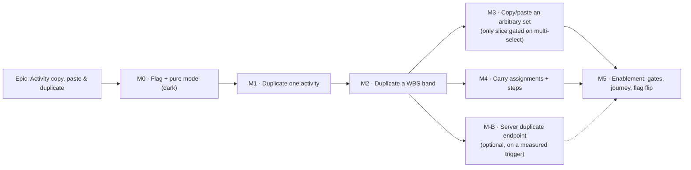

# Implementation Plan: Activity copy, paste and duplicate

- **Feature spec:** [./feature-spec.md](./feature-spec.md) — **awaiting approval**
- **Status:** Draft
- **Owner:** _(unassigned)_
- **Flag:** `VITE_ACTIVITY_COPY_PASTE` — `flagDefaultOff` from M0, flipped to `flagDefaultOn` in M5.

## Breakdown

### Epic

**Activity copy, paste and duplicate** — give the TSLD the repetition primitive a construction
programme is made of, composed entirely from shipped write paths, behind a flag, as one undoable
step per user action. Maps to the roadmap's _Product features — TSLD canvas & editing surface_
theme.

---

## Milestone 0 — The flag and the pure model (dark)

**Outcome:** nothing is visible to a user, and every hard decision in the feature is expressed as a
pure, unit-tested function with a census test that will fail the build if a future field is left
unclassified.

---

#### Feature: The clone model

> **Description:** `features/activity-copy/model/` — naming, projection, graph planning. No React,
> no fetch, no flag reads inside the pure functions.
> **Complexity:** M
> **Dependencies:** none.
> **Risks:** getting the field carriage wrong is silent (a copy that quietly drops a definition
> field looks correct on every screen) → mitigated by the census test, which is the point of this
> milestone existing separately at all.
> **Testing requirements:** unit only; ≥ 95% on this module (it is pure and cheap to cover).

##### Task M0-T1 — Flag + feature scaffold (≈ one PR)

- **Description:** add `ACTIVITY_COPY_PASTE_ENABLED = flagDefaultOff(import.meta.env.VITE_ACTIVITY_COPY_PASTE)`
  with the house-style docblock (what it turns on, what flag-off restores, what the pre-flip gates
  are), and the empty `features/activity-copy/` folder with its `index.ts` barrel.
- **Complexity:** S
- **Dependencies:** none
- **Risks:** none.
- **Testing:** the existing `env.test.ts` covers `flagDefaultOff` including the `"TRUE"`
  case-sensitivity trap; add the new constant to its assertions.
- **Development steps:**
  1. Add the constant + docblock to `apps/web/src/config/env.ts`.
  2. Create `features/activity-copy/{model,hooks}/` and the barrel.
  3. Document the flag in `.env.example` if the file enumerates `VITE_` flags.

##### Task M0-T2 — `clone-naming.ts`

- **Description:** `freeCopyName(sourceName, usedNames): string` — ` (copy)`, then ` (copy 2)`, …,
  probing a `ReadonlySet<string>` of live names; base truncated so the result is
  ≤ `ACTIVITY_NAME_MAX_LENGTH` (200).
- **Complexity:** S
- **Dependencies:** M0-T1
- **Risks:** silently exceeding 200 chars → a 422 at write time. Mitigated by a boundary test at
  exactly 200, 199 and 201.
- **Testing:** unit — first copy, second copy, a 200-char source, a source already ending in
  `(copy)`, a gap in the sequence (`(copy)` and `(copy 3)` exist → returns `(copy 2)`).
- **Development steps:**
  1. Implement with the `disambiguate` shape (`packages/interchange/src/validate.ts:55-63`) but the
     copy-name rule.
  2. Docblock stating **why it is not a shared function** with `disambiguate` (spec §2 Validation) —
     so the next reader does not "fix" the duplication.
  3. Add the convention to `docs/DECISIONS.md`.

##### Task M0-T3 — `clone-projection.ts` **and the field census**

- **Description:** `projectClone(activity, { name, laneIndex, parentId, placement, offsetDays })`
  → the `POST …/activities` body, carrying `laneIndex` in the same call (spec §0.3). Plus
  `activity-field-census.test.ts`.
- **Complexity:** M
- **Dependencies:** M0-T2
- **Risks:** the census test is the mitigation for this milestone's headline risk; if it is written
  loosely (e.g. against a hand-listed array rather than the type's keys) it protects nothing → the
  test must derive its key set from `ActivitySummary` so a new field breaks it.
- **Testing:** unit per field group; the census asserting every `ActivitySummary` key appears
  **exactly once** across `CARRIED` / `TRANSFORMED` / `WITHHELD`, each with a stated reason string.
  A deliberate red run first: add a fake key, watch it fail, remove it.
- **Development steps:**
  1. Encode the spec §2 carriage table as three exported `const` sets with reasons.
  2. Implement `projectClone` **from** those sets, so the table and the code cannot disagree.
  3. Write the census test; **verify it fails** against an unclassified field before committing.
  4. Add the structural test asserting `activity:create` ⊆ `cost:read` role holders
     (`org-permissions.ts:197,254`), so carrying `budgetedExpense` stops being safe loudly rather
     than silently.

##### Task M0-T4 — `clone-graph.ts`

- **Description:** `planClone(set, dependencies, plan)` → `{ creates (parent-before-child ordered),
links, refusal }`. Derives the internal-edge set (`both endpoints in set`), the `parentId` remap
  (in-set → clone, out-of-set → verbatim), the lane offsets from `maxLaneIndex + 1`, the calendar-day
  time offset, and every **refusal reason** (cap exceeded, lane ceiling, empty band, archived
  calendar) as data rather than a thrown error.
- **Complexity:** M
- **Dependencies:** M0-T3
- **Risks:** a wrong topological order silently creates a child before its parent → a 422 mid-band.
  Mitigated by a test over a 3-deep summary tree with siblings.
- **Testing:** unit — internal-edge filtering (an edge leaving the set is **not** cloned, in both
  directions); parent remap both ways; lag carried in **minutes**; deterministic ordering; each
  refusal reason; the acyclicity assertion (no cloned edge references a source id, and the cloned
  edge set is acyclic).
- **Development steps:**
  1. Implement the id-map pass and the ordered plan.
  2. Assert the structural claim in a test rather than guarding at runtime (spec §2 Edge cases).
  3. Return refusals as a discriminated union so the caller cannot forget a case.

---

## Milestone 1 — Duplicate one activity (shippable slice)

**Outcome:** a Planner holding the pen can duplicate any non-summary activity from the activities
table or the canvas selection bar, in one action, with one undo step. Flag-off is byte-for-byte
today's product.

---

#### Feature: The duplicate composite and its two entry points

> **Description:** the host composite, the undo command, the row action, the selection-bar item, the
> announcements and the flag-off parity suites.
> **Complexity:** L
> **Dependencies:** M0.
> **Risks:** (a) a partial write with no rollback → mitigated by following `createLoeSpan`'s
> contract verbatim; (b) a control that uses native `disabled` during the write → this repo has
> learnt that lesson three times (ADR-0060 M6, ADR-0063 M6, ADR-0064 §7), so it is an explicit test;
> (c) the clone lands off-screen and the planner thinks nothing happened → select + reveal is an
> acceptance criterion, not a nicety.
> **Testing requirements:** hook tests for every branch of the composite; component tests for both
> entry points in both flag states; an a11y test for the shaded-with-reason state.

##### Task M1-T1 — `pasteCommand` in `features/undo-redo/commands.ts`

- **Description:** one builder taking the created clone rows + the inputs that recreate them. `undo`
  deletes every clone in reverse creation order (cloned links cascade); `redo` re-composes with new
  ids. No `coalescing` key — a paste is a discrete edit.
- **Complexity:** M
- **Dependencies:** M0-T4
- **Risks:** a double-undo double-deleting → use the shipped `existenceToggle` pattern
  (`commands.ts:312-329`), which is idempotent in both directions.
- **Testing:** unit — undo removes all; undo twice is a no-op; redo recreates with new ids; a failed
  inverse leaves the stacks intact (the `usePlanEditHistory` contract).
- **Development steps:**
  1. Add the builder beside `createLoeSpanCommand`, reusing `existenceToggle`.
  2. Label it concretely (`Duplicate “Excavate”` / `Copy 15 activities`) — the S1 entity-naming
     convention the file's other builders follow.
  3. Export from `features/undo-redo/index.ts`.

##### Task M1-T2 — `duplicateActivities()` in `use-plan-workspace-model.ts`

- **Description:** the composite: pre-checks → recalculation `hold` → creates → links (M2) →
  `editHistory.record` → `release` + `notify` → select + reveal + announce. Rollback and error
  classification copied from `createLoeSpan` (`:1158-1251`).
- **Complexity:** L
- **Dependencies:** M1-T1
- **Risks:** a **leaked recalculation hold** silently stalls every later recalc for the session
  (ADR-0064 says so in terms) → release in a `finally`, and test the failure path explicitly.
- **Testing:** hook tests — happy path; 423 (pen) distinct from 409/422 (rejected) distinct from a
  failed rollback; the hold released on every path including throw; exactly one command recorded;
  `clearRedo` called on the failure paths and **not** on the happy path.
- **Development steps:**
  1. Implement pre-checks from `planClone`'s refusal union (no ad-hoc checks at the call site).
  2. Wire the hold/release with a token, released in `finally`.
  3. Classify errors exactly as `createLoeSpan` does; never surface a rollback's own error over the
     original cause.
  4. Select + reveal the clone and announce; return focus to the invoking control.

##### Task M1-T3 — Entry points: row menu + selection bar

- **Description:** one `RowAction` in `ActivitiesTable.tsx` (after **Edit**, before **Dissolve**) and
  one `ToolbarItem` in `selection-actions.tsx` (`penGated: true`, existing `PEN_REASON`), both
  flag-gated by conditional spread so flag-off is byte-for-byte.
- **Complexity:** M
- **Dependencies:** M1-T2
- **Risks:** the item appearing on a `WBS_SUMMARY` and creating an empty band → gate on the existing
  `isSummary` context fact, exactly as `dissolve` does (`selection-actions.tsx:179-181`), so the
  action cannot reach a state the product would render as breakage.
- **Testing:** component — present + shaded with reason without the pen (`aria-describedby` linked);
  absent for a Contributor/Viewer; `aria-busy` **not** `disabled` during the write; label switches on
  a summary; **flag-off parity suites** pinning the prior row-action list and the prior selection-bar
  item set (the `ActivitiesTable.wbs-improvements-off.test.tsx` /
  `selection-actions.resources-off.test.tsx` precedents).
- **Development steps:**
  1. Add both items with conditional spreads.
  2. Add the two flag-off parity suites **first**, verified green against the pre-change code.
  3. Confirmation-free for a leaf duplicate (one activity, one undo — a confirm would be friction);
     the confirmation belongs to M2.

##### Task M1-T4 — Archived-calendar pre-check + copy

- **Description:** the client-side pre-check for spec §0.4, and the exact refusal sentence naming
  the calendar and both remedies.
- **Complexity:** S
- **Dependencies:** M1-T2
- **Risks:** the temptation to "helpfully" fall back to the plan calendar → forbidden; it changes
  dates without saying so. Encode the decision in the docblock so it is not re-litigated.
- **Testing:** unit on the refusal; component asserting the sentence names the calendar.
- **Development steps:**
  1. Read the archived state from the already-loaded calendar list (no new query).
  2. Refuse before any write; announce.

---

## Milestone 2 — Duplicate a WBS band (shippable slice)

**Outcome:** a Planner can copy a summary, its whole subtree, and every dependency between the
copied activities, in one confirmed action with one undo step — **without any multi-select**.

---

#### Feature: Set duplication

> **Description:** the multi-write composite, the confirmation with real counts, bounded concurrency,
> the cap, and the measurement that sets it.
> **Complexity:** L
> **Dependencies:** M1.
> **Risks:** (a) a partial band left behind by a failed rollback — the residual risk the client
> composite cannot remove, and the argument for Milestone B; (b) N + M writes each taking the plan
> advisory lock; (c) M audit rows and none for the activities (spec §0.6).
> **Testing requirements:** hook tests over a 3-deep tree; an API-level e2e proving no link crosses
> the set boundary; the measurement in M2-T4.

##### Task M2-T1 — Derive the set from the WBS

- **Description:** reuse `features/wbs/model/wbs-groups.ts` — the **same** derivation the Gantt row
  model and the canvas band already share (ADR-0063's one-derivation rule) — to produce
  `summary + subtree`. Do not write a second descendant walk.
- **Complexity:** S
- **Dependencies:** M0-T4
- **Risks:** a second opinion on "what is in this band" would disagree exactly when it mattered →
  reuse, and assert the reuse with an identity test if the shape allows.
- **Testing:** unit over a 3-deep tree with siblings and an empty branch.

##### Task M2-T2 — The confirmation

- **Description:** the existing `ConfirmDialog` with **real counts** ("Copies _Level 2_ and the 14
  activities in it, with the 21 links between them.") and an explicit list of what is **not** copied
  (progress, resource assignments, notes — and, until M4, steps).
- **Complexity:** S
- **Dependencies:** M2-T1
- **Risks:** the counts drifting from what is actually sent → derive both from the same `planClone`
  result, never recount.
- **Testing:** component — the counts match the plan; the not-copied list is present; the empty-band
  refusal; the cap refusal naming the cap and the size.

##### Task M2-T3 — The multi-write composite

- **Description:** extend `duplicateActivities` — parent-before-child creates building the id map,
  then the cloned links in bounded-concurrency batches, then one `pasteCommand`.
- **Complexity:** L
- **Dependencies:** M2-T2, M1-T1
- **Risks:** unbounded `Promise.all` over 60 link creates hammering the plan advisory lock → bound
  the concurrency (start at 4, tune with the measurement).
- **Testing:** hook — every link re-pointed at clones (assert **no** cloned edge references a source
  id); failure at create #7 rolls back exactly 6; failure at link #12 rolls back all activities;
  one command recorded; rollback-failure reported distinctly.
- **Development steps:**
  1. Sequential creates (ordering is required), batched links (they are independent).
  2. Rollback deletes activities only — their links cascade (`commands.ts:543` records the property).
  3. Keep the hold across the whole composite; release in `finally`.

##### Task M2-T4 — **Measure**, then set the cap

- **Description:** measure a 15-activity / 21-link band duplicate and a 60-activity / 90-link band
  against a **real API with the pen enforced**, wall clock and per-request. Set the cap constant and
  the concurrency from the numbers. Record the numbers in the spec.
- **Complexity:** M
- **Dependencies:** M2-T3
- **Risks:** shipping an asserted cap instead of a measured one — the exact failure ADR-0058 and
  ADR-0073 C1/C3.0 exist to prevent. The provisional 200 in the spec is **provisional**.
- **Testing:** the measurement itself is the artefact; assert the cap constant is consumed by the
  refusal path.
- **Development steps:**
  1. Use the seed catalogue (ADR-0066) rather than hand-building a plan.
  2. Record wall clock, per-request p95, and whether any partial paste occurred.
  3. **Feed the result into C-4**: exceeding the p95 gate, or any partial paste, triggers M-B.
- **Outcome (2026-08-08):** done. `scripts/measure-band-copy.mjs` is the artefact; the numbers are in
  the feature spec §2 "Set size". Caps set to **50 activities / 90 internal links**, both consumed by
  `planClone`'s refusal path with tests. **C-4 answered: M-B not taken.** Two notes worth carrying:
  the first run's two alarming figures were both defects in the measurement script and were verified
  before anything was escalated (ADR-0076 §19.9); and the run needed one dependency-internals claim
  about `@nestjs/throttler`'s key derivation, which surfaced that `check:claims` could not see
  `scripts/` at all and truncated dotted basenames (`docs/TECH_DEBT.md` #101, narrowed).

---

## Milestone 3 — Copy and paste an arbitrary set

**Outcome:** `Ctrl/Cmd+C` captures a selection; `Ctrl/Cmd+V` pastes it by the M2 rules.

> **Gating:** this is the **only** milestone that depends on the parallel canvas multi-select epic.
> If that slips, M3 ships sourced from the activities table's existing selection column
> (`ActivitiesTable.tsx:246,294-314`) — narrower, because that column only renders when the plan has
> a `WBS_SUMMARY`, but real and independently testable.

---

#### Feature: The app clipboard and its accelerators

> **Complexity:** M
> **Dependencies:** M2; canvas multi-select (soft).
> **Risks:** hijacking a genuine text copy — the single most likely user-visible defect in this
> epic.
> **Testing requirements:** the guard matrix below is the whole point of the milestone's tests.

##### Task M3-T1 — `clipboard.ts` (in-memory, per session)

- **Description:** the set store, cleared on plan switch and on pen release, mirroring the ADR-0048
  history lifetime so the two cannot rot apart.
- **Complexity:** S
- **Dependencies:** M2-T3
- **Risks:** a stale clipboard referencing deleted activities → resolve ids against the live list at
  **paste** time and report what is no longer there.
- **Testing:** unit — cleared on plan switch; stale ids dropped and reported.

##### Task M3-T2 — `use-clipboard-keybindings.ts`

- **Description:** returns a React `onKeyDown` handler (never a native listener —
  `use-undo-redo-keybindings.ts:9-16`), bound at the workspace root beside the undo handler.
- **Complexity:** M
- **Dependencies:** M3-T1
- **Risks:** the undo hook's target check is **not sufficient for copy**: a user can select label
  text in the activities table with focus on the table body, press `Ctrl+C`, and lose their text
  copy. Mitigated by the extra guard below, which is a test before it is a line of code.
- **Testing:** the guard matrix — fires: focus on the canvas listbox / a table row, nothing selected.
  Does **not** fire: focus in `input` / `textarea` / `select` / `contenteditable`; a non-collapsed
  document selection; a modal open; the flag off; no `activity:create`. Plus: `preventDefault` is
  called on every handled combo (the Back/Forward suppression precedent, TECH_DEBT #25).
- **Development steps:**
  1. Compose with the undo handler at the workspace root.
  2. Add the `window.getSelection()?.isCollapsed` guard **and** the target-element guard.
  3. Announce the copy count; announce the empty-clipboard paste.

##### Task M3-T3 — Paste placement and the tool-mode non-interaction

- **Description:** paste lands below the plan's lowest lane preserving relative geometry; pinning
  only the anchor. Prove paste **does not** arm, disarm or otherwise touch any ADR-0064 tool mode.
- **Complexity:** M
- **Dependencies:** M3-T2
- **Risks:** an accidental interaction with `link` mode's open pick → assert it directly.
- **Testing:** component — paste while `add-activity` is armed leaves it armed; paste while a link
  pick is open leaves the pick open; the lane-ceiling refusal.

---

## Milestone 4 — Carry resource assignments and weighted steps

**Outcome:** a copied activity arrives with its crew and its step definition, so the copy is a whole
copy.

---

#### Feature: Assignment and step carriage

> **Complexity:** M
> **Dependencies:** M1 (M2 for the set case).
> **Risks:** an archived resource 422s on assignment **create** (ADR-0053 §4) — a paste must not
> fail because of it.
> **Testing requirements:** unit on the projection; hook on the skip-and-report path.

##### Task M4-T1 — Assignment projection + carriage

- **Description:** one `POST …/activities/:id/assignments` per source assignment, carrying
  `resourceId`, `budgetedUnits`, `isDriving`, `unitsPerHour`, `lagMinutes` (ADR-0071) and
  `curveType` (ADR-0044); **withholding** `actualUnits` and `actualCost`.
- **Complexity:** M
- **Dependencies:** M1-T2
- **Risks:** the exactly-one-driver invariant → the source already satisfies it, so a faithful copy
  does too; assert it.
- **Testing:** unit projection incl. an assignment-field census like M0-T3's; hook — an archived
  resource is **skipped and reported**, and the paste still succeeds.
- **Development steps:**
  1. Extend the census pattern to `ResourceAssignmentSummary`.
  2. Skip-and-report on `RESOURCE_ARCHIVED`; name the resource in the report.
  3. Update the M2 confirmation copy — it no longer says assignments are not copied.

##### Task M4-T2 — Weighted steps

- **Description:** one `PUT …/activities/:id/steps` per clone that has steps; names + weights
  carried, every `percentComplete` **zeroed**.
- **Complexity:** S
- **Dependencies:** M4-T1
- **Risks:** carrying the percents would make a copy claim progress through the back door the
  create DTO closes (spec §0.5) → the zeroing is an explicit test.
- **Testing:** unit — weights preserved, percents zero; the pen assertion on `PUT …/steps`
  (ADR-0060 M0) is exercised in the M5 journey.

---

## Milestone B — Server-side duplicate endpoint (optional; recommended on a measured trigger)

**Outcome:** a band duplicate is **atomic** — one transaction, one pen assertion, one advisory lock,
one audit row — and the partial-paste residual risk disappears.

> **Trigger (decide, do not drift):** taken if **either** the M2-T4 measurement exceeds the stated
> p95 gate, **or** the M5 journey observes a single partial paste. Otherwise deferred and recorded
> in `docs/TECH_DEBT.md` with the measurement attached.
>
> **First half fired NO (2026-08-08).** M2-T4 measured **969 ms** against a 2 s gate for 15
> activities + 21 links, and **no partial paste** at 15/21, 40/58 or 60/90 — see the table in the
> feature spec's §2 "Set size". M-B is deferred and recorded in `docs/TECH_DEBT.md`. The measurement
> did change the caps (200 → 50 activities + a new 90-link cap), because it found that the binding
> constraint is the **per-route-handler** rate limiter rather than latency; those caps are what keep
> a composite inside the limiter, so they are load-bearing for this deferral rather than incidental
> to it. **The second half of the trigger is still live** — a single partial paste observed by the
> M5 journey takes M-B.
> **If taken, it needs an ADR** (new endpoint shape, the `activity.duplicated` audit action, and why
> a client composite was not sufficient).

---

#### Feature: `POST …/plans/:planId/activities/duplicate`

> **Complexity:** L
> **Dependencies:** M2 (its rules are the endpoint's spec; the pure `clone-graph` logic ports).
> **Risks:** re-implementing the clone rules server-side would create the invisible drift ADR-0065
> warns about → port the pure module's **rules** into a service helper with the same test vectors,
> and pin the two with a shared fixture.
> **Testing requirements:** Supertest API e2e against a real Postgres — atomicity (a forced failure
> leaves zero rows), pen 423, RBAC 403, org scope 404, cap 422; the audit census entry.

##### Task MB-T1 — Design with **database-architect** and **api-reviewer**

- **Description:** DTO, response shape, status codes, cap, and the transaction/lock ordering
  (`acquirePlanWriteLock` + `assertHoldsPen`, the ADR-0022 single-plan transaction precedent). No
  schema change — confirm that.
- **Complexity:** M
- **Testing:** the design review itself; the ADR draft.

##### Task MB-T2 — Service + controller + census

- **Description:** one service method composing the existing create paths inside one transaction;
  one `activity.duplicated` audit action carrying **scalar counts** (`activityCount`, `linkCount`,
  `sourceName`) — never a nested object, which the redactor reduces to a type marker by design
  (ADR-0073 C3.1 learnt this the hard way); the route-census entry.
- **Complexity:** L
- **Dependencies:** MB-T1
- **Risks:** the producer must sit **inside** the transaction — and note ADR-0073 C4's inverse
  finding: a producer written outside a transaction that calls `record()` fails its caller. Get the
  placement right and test the failure path.
- **Testing:** Supertest — atomicity, every guard, the audit row, the OpenAPI declarations.

##### Task MB-T3 — Point the client at it

- **Description:** the composite becomes one call; the pure model still computes the plan for the
  confirmation's counts, so nothing the user sees changes.
- **Complexity:** M
- **Risks:** two code paths coexisting → delete the client composite in the same PR, keeping the
  pure model.

---

## Milestone 5 — Enablement: gates, journey, flag flip

**Outcome:** the flag is default-on because every gate is green, not because the code is written.

---

#### Feature: The enablement gate pass

> **Description:** the house pattern (ADR-0060 M6 / ADR-0063 M6 / ADR-0064 §7 / ADR-0067 M4): run
> the specialist reviews over the **combined** diff, fold every blocking finding with a regression
> test **verified to fail first**, add the flag-on journey with its own CI step, then flip.
> **Complexity:** L
> **Dependencies:** M1–M4 (M-B if taken).
> **Risks:** the epic's own premise — four consecutive epics found blocking defects here that had
> passed a human read, most of them "one correct pattern applied to a control and not its
> neighbour". Budget for finding some.
> **Testing requirements:** the journey below is the only place several of these are testable at all.

##### Task M5-T1 — Specialist reviews over the combined diff

- **Description:** run **accessibility-reviewer** (shaded-with-reason wiring, `aria-busy` vs
  `disabled`, focus return, every outcome announced), **ux-reviewer** (confirmation copy, the
  not-copied list, the refusal sentences, whether "below everything" reads as lost),
  **component-reviewer** (the two entry points sharing one gate object rather than two; no one-off
  styling), **security-reviewer** (the composite adds no trust boundary; the clipboard holds no
  cross-org ids), **backend-performance-reviewer** (advisory-lock contention across N + M writes;
  the concurrency bound), **test-engineer** (the guard matrix, the census tests).
- **Complexity:** M
- **Testing:** each blocking finding gets a regression test **verified red against the old code**.

##### Task M5-T2 — Flag-on Playwright journey `apps/web/e2e-copy-paste/`

- **Description:** its own project + CI step (`pnpm --filter @repo/web test:e2e:copy-paste`), driving
  a **real API with the pen enforced**.
- **Complexity:** L
- **Risks:** the things only a journey can catch, and which this repo has been caught by repeatedly:
  a locator that matches nothing, a control whose accessible name differs from the assumption, an
  optimistic `version` trap a mocked fetch would accept, and a menu portalled outside a modal
  `<dialog>`'s top layer (ADR-0067 M4 — invisible to jsdom).
- **Testing / what it must prove:**
  1. Duplicate one activity → the clone exists, is named, is selected, and the **API** reports the
     carried fields (assert the server's row, not the DOM under test — the ADR-0070 M6 rule).
  2. Duplicate a band → every internal link present, **zero** links to the originals, counts match
     the confirmation.
  3. One `Ctrl+Z` removes every clone; the active activity count returns to the pre-paste number.
  4. Without the pen, the action is present, shaded, and the reason is programmatically associated.
  5. `Ctrl+C` with a text selection does **not** capture activities.
  6. Duplicating onto an archived calendar refuses with the specific message.
  7. `Ctrl+Z` does not trigger browser Back (the TSLD_EDITING / UNDO_REDO precedent).
- **Development steps:**
  1. Seed from the ADR-0066 catalogue; add a playbook row if a new seeded plan is needed
     (`pnpm check:playbook`).
  2. Wire the CI step beside the existing flag-on suites.
  3. Run `scripts/e2e-local.sh web:copy-paste` locally **before** pushing (CLAUDE.md §19.7).

##### Task M5-T3 — Flip the flag, changeset, docs

- **Description:** `flagDefaultOff` → `flagDefaultOn` with the docblock updated to state the date and
  the gates that cleared; keep the flag-off parity suites **pinned** (they are the rollback contract,
  not scaffolding — ADR-0053 M6's rule).
- **Complexity:** S
- **Development steps:**
  1. Flip; update the docblock.
  2. `pnpm changeset` (minor, pre-1.0 user-visible).
  3. Update `docs/ROADMAP.md`, `docs/DECISIONS.md`, and `CLAUDE.md` §16 only if M-B filed an ADR.
  4. Run the full pre-push gate: `pnpm lint && pnpm typecheck && pnpm test`, plus
     `scripts/e2e-local.sh api` if M-B touched `apps/api`, plus the new web suite.

---

## Sequencing & slices

| Order | Slice                                  | Independently valuable?                                        | `main` releasable? |
| ----- | -------------------------------------- | -------------------------------------------------------------- | ------------------ |
| 1     | **M0** flag + pure model               | No user value; dark and fully tested                           | Yes (inert)        |
| 2     | **M1** duplicate one activity          | **Yes** — the single most common ask, flag-gated               | Yes                |
| 3     | **M2** duplicate a WBS band            | **Yes** — the repetitive-programme capability, no multi-select | Yes                |
| 4a    | **M4** assignments + steps             | **Yes** — makes an existing capability whole                   | Yes                |
| 4b    | **M-B** server endpoint _(on trigger)_ | Atomicity + audit legibility; no user-visible change           | Yes                |
| 5     | **M3** arbitrary-set copy/paste        | **Yes** — the only multi-select-gated slice                    | Yes                |
| 6     | **M5** enablement                      | Flips the flag                                                 | Yes                |

M4 is placed before M3 deliberately: it deepens a capability that already exists rather than adding
one that depends on another epic, so it cannot be blocked by a slip elsewhere.

**Flags:** one — `VITE_ACTIVITY_COPY_PASTE`, default-off through M4, flipped in M5-T3. Flag-off
parity suites land **with each surface**, not at the end, and are kept afterwards.

## Definition of Done (per task)

Each task's PR must satisfy the Feature Completion Criteria in
[`docs/PROCESS.md`](../../PROCESS.md) — code, tests (**run**, not merely written, including the e2e
half where the change touches `apps/api` or a flag-on journey), docs, security, performance,
accessibility, Docker build, CI, changeset, version impact.

## Risks & assumptions (rollup)

| Risk / assumption                                                                        | Likelihood  | Impact | Mitigation                                                                                                                                                      |
| ---------------------------------------------------------------------------------------- | ----------- | ------ | --------------------------------------------------------------------------------------------------------------------------------------------------------------- |
| **A partial paste survives a failed rollback** (the client composite is not atomic)      | low         | high   | Rollback modelled on `createLoeSpan`; the failure is **reported honestly** rather than claimed clean; history truncated. Milestone B removes the risk entirely. |
| A new `ActivitySummary` field is silently dropped by a copy                              | med         | med    | The **field census** (M0-T3) fails the build until the field is classified. Verified red before it is trusted.                                                  |
| `Ctrl+C` hijacks a genuine text copy                                                     | med         | med    | The guard matrix (M3-T2): target-element **and** non-collapsed-selection checks — the undo hook's check alone is insufficient, and that is stated.              |
| The cap or the concurrency is asserted rather than measured                              | med         | med    | M2-T4 measures both against a real API before either constant ships; the spec's 200 is labelled provisional.                                                    |
| Duplicating onto an **archived calendar** 422s and reads as a bug                        | **high**    | med    | Verified at `activities.service.ts:291-300`; pre-checked client-side with a specific refusal (M1-T4). Never silently substituted.                               |
| A leaked recalculation hold stalls every later recalc, silently                          | low         | high   | Released in `finally`, with the failure path explicitly tested (ADR-0064 names this exact failure).                                                             |
| The audit log records a band copy as 21 link rows and nothing about the activities       | **certain** | low    | Stated in the spec (§0.6) rather than discovered by a reader of the log; **fixed** by Milestone B's single `activity.duplicated` row.                           |
| M3 is blocked by the canvas multi-select epic                                            | med         | low    | M1 + M2 deliver the capability without it; M3 falls back to the table's existing selection column.                                                              |
| The enablement pass finds blocking defects that passed a human read                      | **high**    | med    | Budgeted as a milestone, not a formality — four consecutive epics have found some, mostly "one correct pattern applied to a control and not its neighbour".     |
| **Assumption:** the CPM engine is not imported and the ADR-0034 parity gate is untouched | —           | —      | Structural: no engine file is touched, no new scheduling input exists, and every value sent is one the create DTOs already accept. Holds for M-B too.           |
| **Assumption:** copy/paste stays **same-plan** in v1                                     | —           | —      | Five concrete blockers recorded in spec §4.8; cross-plan belongs on the interchange pipeline's validate→report→commit shape, not on a clipboard.                |
