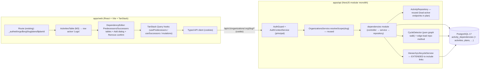
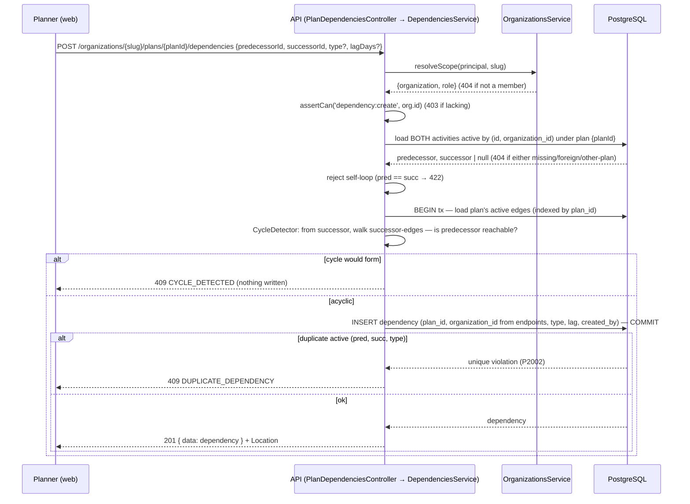
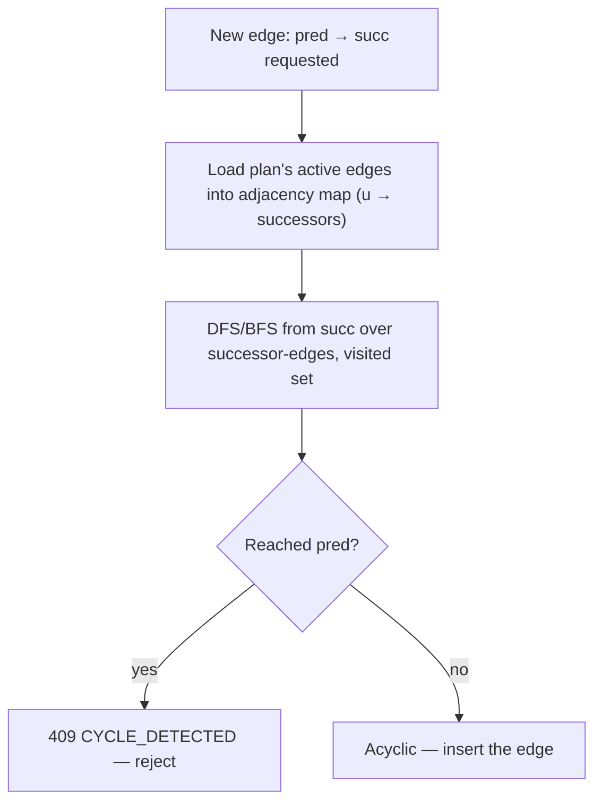
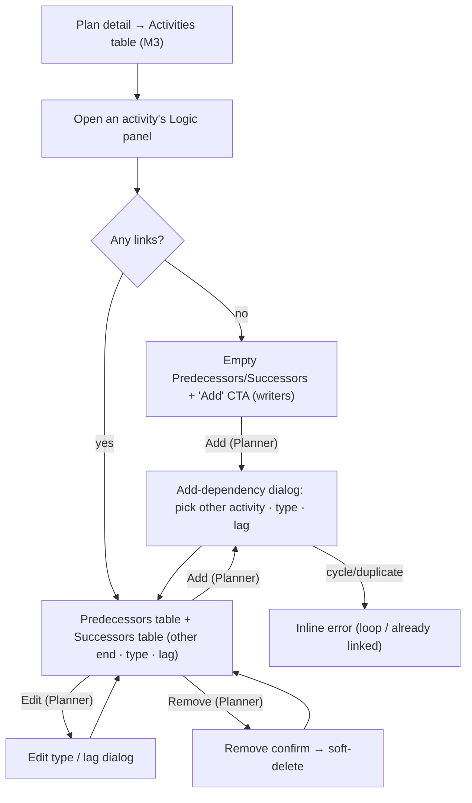
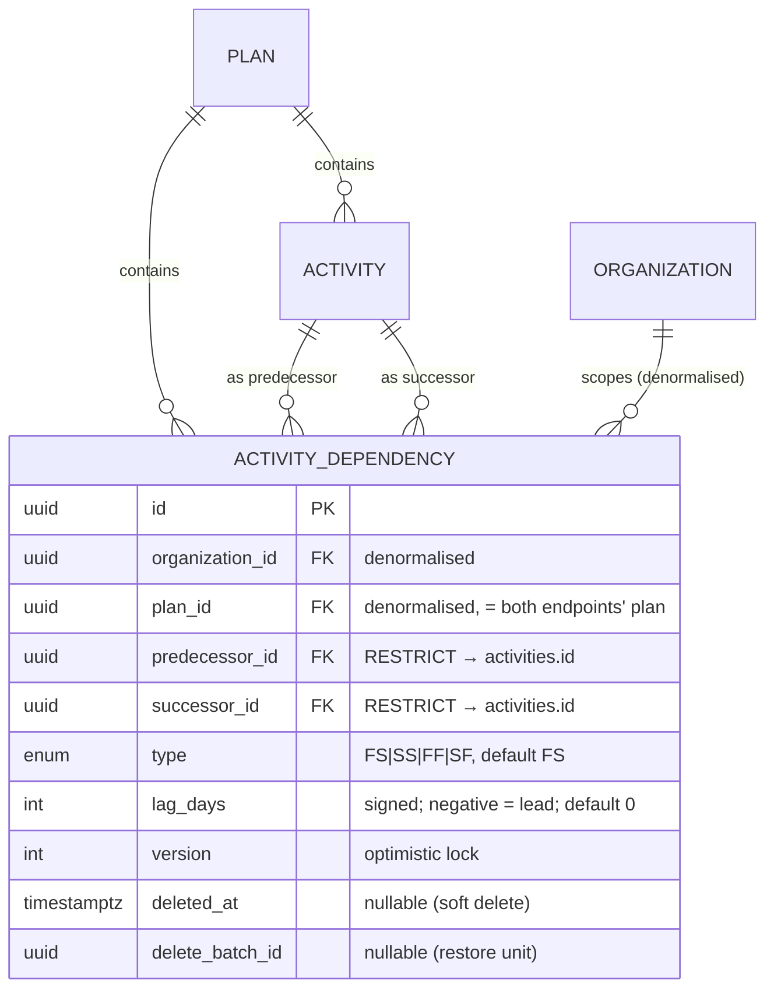

# Feature Spec: Activity logic / dependencies

- **Status:** Draft — awaiting approval (three critical questions in §1, each with a recommended default)
- **Author(s):** Feature Analyst (Product Owner / Solution Architect / Technical Lead hats)
- **Date:** 2026-07-10
- **Tracking issue / epic:** _TBD_ — Epic "Scheduling core (CPM/GPM & the TSLD)"
- **Roadmap link:** **M4 — Activity dependencies (logic network)** — the second
  vertical slice of the scheduling core, following **M3 Activities foundation**
  (`docs/specs/activities-foundation.md`) and the immediate prerequisite for
  **M6 — the CPM engine**.
- **Related ADR(s):** ADR-0008 (modular monolith), ADR-0012 (RBAC + resource
  scoping), ADR-0014/0015 (reference template), ADR-0016 (identity & tenancy +
  role set). **One new ADR is proposed by this slice** — **ADR-0021: Activity
  dependency graph — the DAG invariant & service-layer cycle prevention** — because
  the acyclicity guarantee and the chosen cycle-detection strategy are a
  cross-cutting invariant that the whole CPM engine (and later the TSLD canvas)
  depends on. Two smaller conventions are recorded in `docs/DECISIONS.md`: the new
  **`dependency:*` permission namespace** and the **link cascade/restore behaviour**
  on activity delete.

> This is the **fourth vertical slice** of SchedulePoint and the **second of the
> scheduling core**. M3 gave a Plan its nodes (**Activities**); this slice gives it
> its **edges** — the typed, lagged **dependencies** between activities that turn a
> flat list into a **schedule network** (a directed graph). It builds directly on
> the M3 module and reuses every cross-cutting pattern unchanged: `resolveScope`
> org scoping, deny-by-default RBAC, `{data,meta}`/`{error}` envelopes, cursor
> pagination, soft-delete + audit + optimistic locking, and the shared
> `HierarchyLifecycleService` (extended again here).
>
> Scope is a **thin but complete vertical slice**: the `ActivityDependency` entity
> and its four CPM/GPM relationship types (FS/SS/FF/SF) with lag, its org-scoped
> REST CRUD, the **DAG-preserving integrity rules** (no self-loop, no duplicate, no
> cycle), the lifecycle integration with activity/plan soft-delete, and a
> **minimal, functional web editor** — a predecessors/successors panel on an
> activity, add + remove. **There is no graphical TSLD canvas and no CPM maths in
> this slice**; both are later milestones that consume this graph. The model is,
> however, the complete edge the CPM engine needs (type + signed lag), so M6 is a
> pure read-of-the-graph + write-the-columns addition.

## 1. Business understanding

### Problem

After M3, a Plan holds Activities but they are **disconnected**: each is an island
with a duration and (optionally) a constraint, but nothing expresses that
"Pour foundations" cannot start until "Excavate footings" finishes, or that two
activities run in parallel offset by a few days. Without **logic ties** there is no
**network**, and without a network there is no schedule: the CPM engine cannot
compute early/late dates, total float, or the critical path, because those are all
derived by walking the dependency graph. The TSLD canvas has nothing to draw as
links; baselines have no logic to snapshot; "what drives this date?" cannot be
answered.

"Why now": **dependencies are the immediate, unavoidable prerequisite for the CPM
engine (M6)** — the flagship computation that makes SchedulePoint a scheduling tool
rather than an activity list. The engine consumes exactly this graph (nodes =
activities with durations/constraints/calendars; edges = dependencies with type +
lag) and requires it to be a **DAG** (directed acyclic graph) so a topological
order — and therefore a terminating forward/backward pass — exists. Landing the
dependency entity **with the acyclicity invariant enforced at write time** unblocks
the engine and lets M6 be an additive, read-only-of-the-graph computation slice.

Delivering it as a **functional predecessor/successor editor first** (before the
canvas) de-risks the flagship the same way M3 did: it proves the graph model, the
integrity rules, and the cycle-prevention algorithm end-to-end while the expensive,
uncertain drawing surface is designed separately.

### Users

Roles are per **organisation membership** (ADR-0012/0016). Logic is **schedule
structure**, which the brief (§5) reserves to the **Planner** (and Org Admin):
creating and editing relationships is a definition-level, Planner-owned act — the
same class as creating an activity or editing its duration. A **Contributor** may
report progress but **must not alter logic**; a **Viewer** browses read-only.

| Role            | Needs in this slice                                                                                          |
| --------------- | ------------------------------------------------------------------------------------------------------------ |
| **Org Admin**   | Full CRUD on dependencies (the org's administrator is never locked out of its data).                         |
| **Planner**     | Full CRUD on dependencies — link activities (FS/SS/FF/SF + lag), retype/relag, and remove links. The author. |
| **Contributor** | **Read** a plan's / an activity's logic — but **no** create/update/delete (logic is not progress).           |
| **Viewer**      | Read-only browse of the plan's / an activity's predecessors and successors.                                  |

### Primary use cases

1. **Link two activities** — a Planner adds a dependency: pick a predecessor and a
   successor in the same plan, choose the type (default FS) and a lag (default 0).
2. **View an activity's logic** — any member opens an activity and sees its
   **predecessors** and **successors** (with type and lag) — the pre-canvas view of
   the network around a node.
3. **Adjust a link** — a Planner changes a dependency's type (e.g. FS → SS) or its
   lag (e.g. +2 days), without re-creating it.
4. **Remove a link** — a Planner deletes a dependency that no longer applies.
5. **Keep the network valid** — the system refuses a self-loop, a duplicate, or any
   link that would create a **cycle** (a loop is not schedulable), with a clear
   message, and keeps links consistent when an activity or plan is deleted/restored.

### User journeys

- **Building logic (happy path).** Planner opens a plan (M3 activities table) →
  opens "Excavate footings" → the **Logic** panel shows empty Predecessors and
  Successors tables with an "Add predecessor/successor" CTA → adds a successor
  "Pour foundations", type **FS**, lag **0** → the row appears in Successors; the
  reciprocal link shows under "Pour foundations"'s Predecessors. They add an **SS +2**
  parallel tie to "Set formwork". See the user-flow diagram in §4.
- **Catching a loop.** Planner tries to add "Excavate footings" as a successor of
  "Pour foundations" — but that would close a cycle (foundations already depends on
  excavation). The API returns **409 `CYCLE_DETECTED`**; the editor shows "This would
  create a circular dependency" and no link is created.
- **Retype / relag.** Planner edits the "Set formwork" tie from **SS +2** to **SS +1**
  (supplying the current `version`); the change is saved; a stale version → 409 →
  refetch.
- **Delete an activity that has logic.** Planner deletes "Set formwork"; it
  disappears from the table **and its incident links disappear** from every
  activity's Logic panel (they are soft-deleted in the same batch). Restoring the
  activity restores those links whose other end is still active.
- **Read-only browse.** A Viewer/Contributor opens an activity's Logic panel and
  sees its predecessors/successors with no add/remove affordances; the API forbids
  those actions regardless of the UI.

### Expected outcomes

- A Plan becomes a **schedule network**: activities are connected by typed, lagged
  relationships and every activity shows what precedes and follows it.
- The `ActivityDependency` entity exists with the **complete edge the CPM engine
  needs** (four types + signed lag), org-scoped and lifecycle-integrated, so M6 is a
  pure "read the graph, write the engine-owned columns" addition — no schema churn.
- The **DAG invariant is enforced at write time**, guaranteeing the CPM engine a
  computable (acyclic) graph and the canvas a drawable one.
- The **logic-is-Planner-owned** rule is realised as a distinct `dependency:*`
  permission set, cleanly separated from Contributor progress.

### Success criteria

- A Planner can add a valid dependency in **< 15 seconds** (p90), no docs.
- **Zero invalid graphs persist**: no self-loop, no duplicate, and — critically —
  **no cycle** can ever be committed (proven by unit + e2e tests, including
  concurrent-create races).
- **Zero cross-tenant / cross-plan leakage**: a member of org A can never read or
  mutate a dependency in org B, nor link activities across plans or a plan they
  cannot see (e2e IDOR tests return 404).
- Cycle detection adds **< 50ms** to a create at the brief's ceiling (a plan of
  2,000 activities and its dependencies), and list reads are **p95 < 200ms**
  (indexed by plan/predecessor/successor, cursor-paginated).
- Deleting an activity/plan removes its incident/contained links from all active
  views in the same batch; restoring returns those whose endpoints are still active;
  **no active dependency ever references a soft-deleted activity** (invariant).
- WCAG 2.2 AA on the logic editor (tables, add dialog, remove confirm); CI green.

### Open questions

The **CRITICAL** questions (answers change the schema, the integrity rules, or the
permission surface) are listed here first, each with a **recommended default** so
work is not blocked. Non-critical questions follow with defaults already applied.

- **CRITICAL Q1 — Is a dependency unique per activity pair, or per pair-and-type?**
  i.e. may the same predecessor→successor pair carry **more than one** relationship
  (e.g. an **SS +2** and an **FF +1** together, the classic overlap "ladder" of
  linear/construction scheduling)? _Recommended default:_ **unique per
  `(predecessor, successor, type)`** — at most one link of each type between a given
  ordered pair, so a pair may hold up to four distinct-typed links but never two
  FSs. This is the more capable choice (SchedulePoint targets construction/linear
  work where SS+FF overlap pairs are idiomatic) while still blocking exact
  duplicates. It sets the partial-unique index on three columns. _Alternative:_
  unique per `(predecessor, successor)` (P6/MS-Project style: one relationship per
  pair) — simpler, but forbids the overlap ladder. **The chosen answer sets the DB
  unique index and the create validation.**

- **CRITICAL Q2 — A new `dependency:*` permission set, or reuse `activity:*` write?**
  _Recommended default:_ a **new namespace** `dependency:read | create | update |
delete`, with **read** folded into the existing `HIERARCHY_READ` set (every
  member) and **create/update/delete** into `HIERARCHY_WRITE` (Planner + Org Admin) —
  no new roles, no Contributor grant. A distinct namespace keeps audit/authorisation
  legible, lets a future **External Guest** share-grant carry `dependency:read`
  independently, and mirrors how `activity:*` is its own namespace rather than
  overloading `plan:*`. _Alternative:_ reuse `activity:update`/`activity:read`
  (fewer codes, but conflates "edit an activity" with "edit the network's topology"
  and blocks independent future grants). **The chosen answer sets the permission
  codes and the role map.**

- **CRITICAL Q3 — What happens to a dependency when an activity is deleted (and on
  restore)?** _Recommended default:_ a dependency is itself **soft-deleted** (house
  style: `deleted_at` + `delete_batch_id` + `version`). When an activity is
  soft-deleted, its **active incident links** (where it is predecessor **or**
  successor) are soft-deleted **in the same batch**; a plan/project/client cascade
  soft-deletes all links **contained in** the affected plans. **Restore is
  endpoint-guarded:** restoring an activity/plan reactivates its batch's links
  **only where both endpoints are now active** — any link whose other end was
  separately deleted stays soft-deleted (documented, bounded edge case). A link
  deleted **directly** (its own DELETE) gets a fresh batch and is simply recreated
  if needed — **no standalone dependency-restore endpoint** in this slice.
  _Alternatives:_ (a) **hard-delete** incident links on activity delete — loses the
  "restore returns things as they were" property; (b) leave links dangling — breaks
  the "no active link to a deleted activity" invariant the CPM engine relies on.
  **The chosen answer sets the lifecycle extension and whether a restore endpoint
  ships.**

- _Non-critical (defaults stated, proceeding):_
  - **Cycle-detection placement & limits.** _Default:_ **service-layer** directed
    graph walk (DFS/BFS) on **create** and on any **endpoint change** — but note
    endpoint changes are **disallowed** in this slice (see below), so the check runs
    on create only. Load the plan's active edges once (indexed by `plan_id`), walk
    from the proposed **successor** following successor-edges; if the **predecessor**
    is reachable, the new edge would close a cycle → **409 `CYCLE_DETECTED`**. O(V+E)
    per create, bounded by the plan (≤ 2,000 activities). Runs inside the create
    transaction with the row-write, so a concurrent pair of "mirror" inserts cannot
    both pass (see §4 and ADR-0021). No separate graph service/table.
  - **Mutable fields on update.** _Default:_ a dependency's **`type` and `lagDays`
    are editable**; its **`predecessorId`/`successorId` are immutable** (change =
    delete + recreate). This keeps update from having to re-run cycle detection or
    re-scope endpoints, and matches how planners actually re-wire logic.
  - **Lag semantics.** _Default:_ a **signed integer** `lag_days` (negative = lead),
    default 0, bounded to a sane range (e.g. **−3650…3650**). Unit is **working
    days** (= calendar days until the M5 Calendars slice), consistent with
    `Activity.durationDays`; **no separate lag-unit column** (a plan/calendar concern
    arriving later). No lag on... — lag applies to all four types.
  - **Type ↔ activity-type semantics.** _Default:_ **no cross-validation** between a
    dependency's type and its endpoints' activity types in this slice (e.g. an FF
    into a START_MILESTONE is permitted). Such semantic rules are a **CPM-engine (M6)
    concern**; this slice models the graph, not its scheduling meaning.
  - **Activity-scoped list shape.** _Default:_ two endpoints —
    `.../activities/:id/predecessors` and `.../activities/:id/successors` — each a
    normal cursor-paginated `DependencySummary` list (uses the `successor_id` /
    `predecessor_id` indexes). The web editor calls both. Cleaner and more RESTful
    than one merged, direction-tagged page.
  - **Denormalised `plan_id` on the dependency.** _Default:_ **yes** — both
    activities always share a plan, so the link carries a denormalised `plan_id`
    (and `organization_id`), set from the endpoints inside the create transaction.
    It powers the plan-level list, the single-load cycle walk, and the plan-level
    cascade without a join. Invariant: `dep.plan_id == predecessor.plan_id ==
successor.plan_id`.
  - **Driving/near-driving flags.** _Default:_ **out of scope** — `is_driving` is a
    CPM output (which relationship actually drives the successor's start), so it
    belongs to the M6 engine's write path, not this slice. Not modelled now (adding
    one boolean later is a trivial additive column).
  - **Max links per plan/activity.** _Default:_ no hard cap; bounded in practice by
    activity count. Performance addressed by indexes + the bounded cycle walk.

## 2. Functional requirements

### User stories & acceptance criteria

> **US-1 — Create a dependency.** As a Planner, I want to link two activities in a
> plan with a typed, lagged relationship, so that the schedule expresses real logic.
>
> - **Given** I hold `dependency:create` in the plan's org **when** I POST a valid
>   `{predecessorId, successorId, type?, lagDays?}` to the plan **then** a dependency
>   is created (its `organization_id` and `plan_id` copied from the endpoints, `type`
>   defaulting to `FS`, `lagDays` to 0, `version` 1, audit `created_by` = me) and
>   returned with **201** + `Location`.
> - **Given** `predecessorId == successorId` **then** **422** (`SELF_DEPENDENCY`; an
>   activity cannot depend on itself).
> - **Given** a `(predecessor, successor, type)` that already exists **active** in
>   the plan **then** **409** `DUPLICATE_DEPENDENCY` (per Q1 default).
> - **Given** the new link would create a **cycle** (the successor can already reach
>   the predecessor) **then** **409** `CYCLE_DETECTED` and nothing is written.
> - **Given** either activity is missing / soft-deleted / in another plan or org
>   **then** **404** (endpoint not found in this plan's scope).
> - **Given** a bad enum, or `lagDays` out of range **then** **422**.
> - **Given** I am a Viewer/Contributor **when** I create **then** **403**.

> **US-2 — View an activity's predecessors and successors.** As any member, I want
> to see what precedes and follows an activity, so that I can read the network
> before the canvas exists.
>
> - **Given** I am a member **when** I GET `.../activities/:id/predecessors` (and
>   `/successors`) **then** I see the active links where the activity is successor
>   (resp. predecessor), cursor-paginated, each showing the other endpoint's
>   code/name plus `type` and `lagDays`, with accessible empty/loading/error states.
> - **Given** the activity is missing/soft-deleted/foreign **then** **404**.

> **US-3 — List a plan's dependencies.** As any member, I want the whole plan's
> logic as a list, so that the network can be reviewed and (later) fed to the engine.
>
> - **Given** I am a member **when** I GET `.../plans/:planId/dependencies` **then**
>   I see the plan's active dependencies, cursor-paginated, deterministically ordered.
> - **Given** the plan is missing/soft-deleted/foreign **then** **404**.

> **US-4 — Retype or relag a dependency.** As a Planner, I want to change a link's
> type or lag, so that I can tune the logic without re-drawing it.
>
> - **Given** I hold `dependency:update` and supply the current `version` **when** I
>   PATCH `{type?, lagDays?}` **then** it updates and `version` increments.
> - **Given** I try to change `predecessorId`/`successorId` **then** those fields are
>   rejected (immutable — the DTO does not accept them; delete + recreate instead).
> - **Given** a stale `version` **then** **409** (optimistic lock; refetch).
> - **Given** retyping would duplicate an existing active `(pred, succ, type)`
>   **then** **409** `DUPLICATE_DEPENDENCY`.
> - **Given** I am a Contributor/Viewer **then** **403**.

> **US-5 — Delete a dependency.** As a Planner, I want to remove a link, so that the
> schedule reflects reality.
>
> - **Given** I hold `dependency:delete` **when** I delete a dependency **then** it
>   is soft-deleted (its own `delete_batch_id`), disappears from active lists, and
>   returns **204**.
> - **Given** a Viewer/Contributor **then** **403**.

> **US-6 — Links follow the activity/plan lifecycle.** As a Planner, I want deleting
> an activity (or plan/project/client) to take its logic with it, so that no active
> link ever points at a deleted activity.
>
> - **Given** an activity with incident links **when** I delete the activity **then**
>   the activity **and its active incident links** (predecessor or successor) are
>   soft-deleted under one shared `delete_batch_id`.
> - **Given** I delete a plan (or project/client) **then** the cascade also
>   soft-deletes every dependency contained in the affected plan(s), in the same
>   batch/transaction.
> - **Given** I restore that activity/plan **then** its batch's links are reactivated
>   **only where both endpoints are now active**; a link whose other end is still
>   deleted stays soft-deleted.
> - **Invariant:** no **active** dependency references a **soft-deleted** activity.

> **US-7 — Manage logic in the plan view.** As a Planner, I want add/remove logic
> affordances on an activity's predecessors/successors, and readers want a read-only
> view, so that the loop is usable before the canvas exists.
>
> - **Given** I open an activity **when** the Logic panel loads **then** it shows
>   Predecessors and Successors tables (or designed empty states with an "Add" CTA
>   for writers).
> - **Given** my role **then** exactly the affordances I'm permitted appear (add/edit/
>   remove for Planner/Admin; none for Contributor/Viewer), and the API enforces the
>   same regardless of the UI.

### Workflows

- **Create:** `resolveScope(principal, orgSlug)` (404 non-member) →
  `assertCan('dependency:create', orgId)` (403) → load **both** activities active &
  in-org & **under the URL plan** (404 on any miss/mismatch) → reject self-loop
  (422) → within a `$transaction`: **run the cycle check** over the plan's active
  edges (409 `CYCLE_DETECTED` if the successor already reaches the predecessor) →
  insert the link (copy `organization_id`/`plan_id` from the endpoints) → audit → 201. A concurrent duplicate hits the partial-unique → **409**.
- **List (plan):** resolveScope → `assertCan('dependency:read')` → verify plan
  active & in-scope (404) → cursor page of the plan's active links.
- **List (activity predecessors/successors):** resolveScope → `dependency:read` →
  load active activity in-scope (404) → cursor page filtered by `successor_id = id`
  (resp. `predecessor_id = id`).
- **Update:** resolveScope → `assertCan('dependency:update')` → load active link
  in-scope (404) → optimistic-locked `updateMany(where version)` over `{type?,
lagDays?}` → 0 rows ⇒ 409; retype duplicate ⇒ 409.
- **Delete:** resolveScope → `assertCan('dependency:delete')` → load active in-scope
  (404) → `$transaction`: `cascadeSoftDelete(tx, 'dependency', id, actor)` (leaf —
  stamps just the link with a fresh batch) → audit → 204.
- **Lifecycle cascade (extended):** an activity delete additionally stamps its
  active incident links; a plan/project/client delete additionally stamps links in
  the affected plans; restore reactivates a batch's links **where both endpoints are
  active**. Implemented by extending `HierarchyLifecycleService`.

### Edge cases

- **Empty logic** (an activity/plan with no links) → designed empty state with an
  "Add predecessor/successor" CTA (writers) or a neutral message (readers).
- **Self-loop** (`pred == succ`) → **422** before any DB write.
- **Duplicate** `(pred, succ, type)` (incl. a concurrent double-submit) → DB
  partial-unique ensures one wins; the loser gets **409** `DUPLICATE_DEPENDENCY`.
- **Two-node mirror race** — two requests concurrently add A→B and B→A: each cycle
  check runs inside its own serialisable/row-locked create transaction, so the
  second to commit sees the first's edge and is rejected `CYCLE_DETECTED` (never
  both committed — see ADR-0021 for the concurrency argument).
- **Longer cycle** (A→B→C, then C→A) → the walk from A reaches C's reachable set
  including A's predecessor path → 409.
- **Cross-plan link attempt** (endpoints in different plans, or an endpoint not
  under the URL plan) → **404** (endpoint not found in this plan).
- **Endpoint change attempt** via PATCH → field not accepted (422 unknown property /
  ignored); planners delete + recreate.
- **Delete an activity mid-add of a link to it** → the create's endpoint load returns
  404 (row now soft-deleted), so no active link to a deleted activity is created.
- **Restore an activity whose counterpart link-end was separately deleted** → that
  specific link stays soft-deleted (endpoint-guarded restore); other links return.
- **Cross-org/plan id probing** (guessing a UUID) → **404**, every load filtered by
  resolved `organization_id` (and plan where relevant).

### Permissions

Deny-by-default (ADR-0012): every endpoint is authenticated; every route pairs a
**permission check** with a **resource-scope check** (`resolveScope` → membership in
the plan's org). Dependency and endpoint loads additionally filter by the resolved
`organization_id` (and `plan_id` on create/list).

**New permission codes** (added to `apps/api/src/common/auth/org-permissions.ts`):
`dependency:read | create | update | delete` (per Q2 default).

**Role → permission matrix** (blank = deny):

| Capability                                                         | Org Admin | Planner | Contributor | Viewer |
| ------------------------------------------------------------------ | :-------: | :-----: | :---------: | :----: |
| Read plan / activity logic (`dependency:read`)                     |     ✓     |    ✓    |      ✓      |   ✓    |
| Create / update / delete logic (`dependency:create/update/delete`) |     ✓     |    ✓    |      —      |   —    |

> Implementation note: add `dependency:read` to `HIERARCHY_READ` and
> `dependency:create/update/delete` to `HIERARCHY_WRITE` in `org-permissions.ts`.
> Contributor keeps read (via `HIERARCHY_READ`) but gains **no** logic write — logic
> is definition-level, distinct from the `activity:update_progress` a Contributor
> holds. This deliberately mirrors M3's Planner/Contributor split.

### Validation rules

Shared client↔server where possible (Zod in web ↔ `class-validator` DTOs in the
API); the `DependencyType` enum is shared through `@repo/types` in lock-step with
Prisma:

- **predecessorId / successorId:** required UUIDs; must reference **active**
  activities under the **same plan** (the URL `:planId`) in the caller's org;
  `predecessorId != successorId`.
- **type:** enum ∈ `{FS, SS, FF, SF}`; default `FS`.
- **lagDays:** integer in **−3650…3650**; default 0 (negative = lead). Working days.
- **version:** required integer on update (optimistic lock).
- **immutable on update:** `predecessorId`, `successorId` (not accepted by
  `UpdateDependencyDto`).
- **path ids** (`planId` / `activityId` / `dependencyId`): validated as UUID
  (`ParseUuidPipe`).
- Pagination `limit` default 20 / max 100; `cursor` opaque (row id); order `asc`.
- **DAG invariant** (domain rule, service-enforced): the plan's dependency graph
  remains acyclic after every create.

### Error scenarios

| Scenario                                                | Detection                    | User-facing result                          | Status |
| ------------------------------------------------------- | ---------------------------- | ------------------------------------------- | ------ |
| Not authenticated                                       | auth guard                   | redirect to sign-in                         | 401    |
| Not a member of the org in the URL                      | `resolveScope`               | org treated as non-existent                 | 404    |
| Member but insufficient role (Contributor/Viewer write) | permission check             | friendly forbidden message                  | 403    |
| Parent plan missing/deleted/foreign                     | scoped parent load           | "not found"                                 | 404    |
| Endpoint activity missing/deleted/foreign/other-plan    | scoped, active, in-plan load | "not found"                                 | 404    |
| Target dependency missing/deleted/foreign (by id)       | scoped, active-only load     | "not found"                                 | 404    |
| Self-dependency (`pred == succ`)                        | service rule                 | inline "an activity can't depend on itself" | 422    |
| Bad enum / lag out of range                             | DTO validation               | inline field error                          | 422    |
| Attempt to change an endpoint via PATCH                 | DTO whitelist                | rejected (unknown property)                 | 422    |
| Duplicate active `(pred, succ, type)`                   | partial-unique constraint    | inline "these are already linked (FS)"      | 409    |
| Would create a circular dependency                      | service cycle walk (in tx)   | "this would create a loop"                  | 409    |
| Stale update (optimistic lock)                          | zero-row versioned update    | "changed elsewhere — refresh"               | 409    |

## 3. Technical analysis

| Area           | Impact | Notes                                                                                                                                                                                                                                                                                                         |
| -------------- | ------ | ------------------------------------------------------------------------------------------------------------------------------------------------------------------------------------------------------------------------------------------------------------------------------------------------------------- |
| Frontend       | med    | Extend `features/activities` (or a sibling `features/dependencies`) with a **Logic panel** (predecessors/successors tables + add dialog + remove confirm), opened from the M3 activities table. No new route.                                                                                                 |
| Backend        | high   | One new module (`dependencies`, copied from the reference template + the `activities` module); a **cycle-detection service/helper**; **extend `HierarchyLifecycleService`** so activity/plan cascade + restore include links.                                                                                 |
| Database       | high   | One migration: `ActivityDependency` model + `DependencyType` enum; denormalised `organization_id` + `plan_id`; two FKs to `activities` (`RESTRICT`, named relations); partial-unique `(pred, succ, type)`; direction + scope indexes.                                                                         |
| API            | med    | ~6 endpoints (nested create/list under a plan; activity predecessors/successors; flat get/update/delete by id); OpenAPI + `API.md` updated. No new status codes.                                                                                                                                              |
| Security       | high   | Deny-by-default; permission + org-scope on every route; endpoints re-scoped to the plan (anti-IDOR + no cross-plan links); the **cycle check runs server-side inside the create tx** (never trusted to the client); audit on all mutations.                                                                   |
| Performance    | med    | Plan ceiling 2,000 activities → index `plan_id`, `predecessor_id`, `successor_id`; cursor-paginate; the cycle walk loads the plan's edges once (indexed) and is O(V+E), bounded; no N+1 (batch-load endpoint summaries).                                                                                      |
| Infrastructure | none   | No new services/env/secrets. Reuses Postgres, existing CI and containers.                                                                                                                                                                                                                                     |
| Observability  | med    | Structured/correlated logs + audit entries for dependency create/update/delete and the extended cascade batch; a distinct log for a rejected cycle (useful signal).                                                                                                                                           |
| Testing        | high   | Unit (cycle detection incl. self/2-node/longer cycles + concurrency reasoning; scope; duplicate; optimistic lock; lifecycle cascade/restore incl. endpoint-guard + **regression on the M3 4-level cascade**); API e2e (CRUD, cycle 409 matrix, IDOR/cross-plan 404 matrix); web component + Playwright + axe. |

### Dependencies

- **Prerequisite / must land first:** the **M3 Activities foundation** slice
  (Activity model, `activities` module, the 4-level `HierarchyLifecycleService`, the
  `plan-detail` activities table) — all on `main`.
- **Blocks:** the **CPM engine (M6)** — it reads this graph to compute dates/float/
  critical path; the **TSLD canvas (M7)** — it draws these links; baselines snapshot
  them. All are additive on this model.
- **Third parties:** none.
- **Reference template:** the `dependencies` module is copied from
  `apps/api/examples/reference-feature/` (ADR-0014/0015) and the `activities` module,
  and adapted.

## 4. Solution design

### Architecture overview

Standard modular-monolith layering (controller → service → repository), reusing the
org-scope resolver, deny-by-default RBAC, and shared lifecycle helper. The only
structural change to shared code is **extending `HierarchyLifecycleService` so
activity/plan cascade + restore include dependencies**. A small, dependency-owned
**cycle-detection** unit (a pure function over an adjacency map, plus a repository
method to load a plan's active edges) enforces the DAG invariant. The web change is a
Logic panel mounted from the existing plan-detail activities table — no new route.

### Data flow — create a dependency (scope + endpoints + cycle check + uniqueness)

### Cycle detection — the DAG invariant

Adding an edge `predecessor → successor` creates a cycle **iff** the `successor`
can **already reach** the `predecessor` by following existing successor-edges. So the
check is a single reachability walk from the proposed successor:

The walk is O(V + E) within one plan (≤ 2,000 nodes), runs **inside the create
transaction** alongside the insert, and does **not** depend on type or lag (a cycle
is a structural property of the graph). Concurrency (two mirror inserts racing) is
argued in **ADR-0021**: the create transaction takes the row lock / uses a
sufficient isolation level so the second committer observes the first edge and is
rejected — the invariant can never be violated by a race.

### User flow

### Database changes

One migration adding one model + one enum, following `DATABASE.md` (UUID v7 PKs,
`snake_case` via `@map`, `timestamptz` UTC, soft delete, audit with **TEXT**
`created_by`/`updated_by`, optimistic-locking `version`, scoped indexes). **Design
with the database-architect agent before writing the migration.** Partial-unique
indexes use `WHERE deleted_at IS NULL` predicates and are **raw SQL** (Prisma cannot
express partial indexes), mirroring the M3 activity indexes.

- **Enum** (kept in lock-step with a `@repo/types` union):
  - `DependencyType { FS, SS, FF, SF }`
- **`ActivityDependency`** columns:
  - Identity/scope/parent: `id` uuid v7; `organization_id` uuid FK (`RESTRICT`,
    denormalised); `plan_id` uuid FK (`RESTRICT`, denormalised — both endpoints'
    plan).
  - Endpoints: `predecessor_id` uuid FK → `activities.id` (`RESTRICT`),
    `successor_id` uuid FK → `activities.id` (`RESTRICT`) — **named relations**
    (`predecessorLinks` / `successorLinks` back-relations on `Activity`).
  - Logic: `type DependencyType @default(FS)`, `lag_days int @default(0)`.
  - Housekeeping: `version int @default(1)`, `created_at`, `updated_at`,
    `created_by?` TEXT, `updated_by?` TEXT, `deleted_at? timestamptz`,
    `delete_batch_id? uuid`.
  - Indexes: `@@index([planId, createdAt, id])` (plan FK + plan-list + cursor);
    `@@index([predecessorId])` (successors-of query + FK); `@@index([successorId])`
    (predecessors-of query + FK); `@@index([organizationId])` (org-scoped IDOR
    loads); **partial unique** `uq_activity_dependencies_pair`
    `(predecessor_id, successor_id, type) WHERE deleted_at IS NULL` (per Q1 default —
    drop `type` for the per-pair alternative); partial
    `idx_activity_dependencies_delete_batch_id` `WHERE delete_batch_id IS NOT NULL`.
    The exact set is finalised with the database-architect.
  - Denormalised `organization_id`/`plan_id`: set by the service from the resolved
    endpoints inside the create transaction, never from input.
- **`Activity`** gains two back-relations (`predecessorLinks`, `successorLinks`);
  **`Plan`**/`Organization` gain a `dependencies` back-relation.

### API changes

All under `/api/v1`, cookie-authenticated, standard `{data,meta}`/`{error}`
envelopes, cursor pagination on lists, CSRF on mutations. Org scope is always
`:orgSlug` (via `resolveScope`). **Create and both direction-lists are nested under
the plan / activity; update/delete/get are addressed by dependency id under the
org** — mirroring the M3 activities module shape.

| Method | Path                                                          | Permission          | Success           | Notes                                                                            |
| ------ | ------------------------------------------------------------- | ------------------- | ----------------- | -------------------------------------------------------------------------------- |
| GET    | `/organizations/:orgSlug/plans/:planId/dependencies`          | `dependency:read`   | 200 `{data,meta}` | A plan's active dependencies, cursor-paginated.                                  |
| POST   | `/organizations/:orgSlug/plans/:planId/dependencies`          | `dependency:create` | 201 `{data}`      | Body `CreateDependencyDto`; `Location`. Endpoints active in-plan; cycle-checked. |
| GET    | `/organizations/:orgSlug/activities/:activityId/predecessors` | `dependency:read`   | 200 `{data,meta}` | Links where the activity is successor.                                           |
| GET    | `/organizations/:orgSlug/activities/:activityId/successors`   | `dependency:read`   | 200 `{data,meta}` | Links where the activity is predecessor.                                         |
| GET    | `/organizations/:orgSlug/dependencies/:dependencyId`          | `dependency:read`   | 200 / 404         | Single active dependency in scope.                                               |
| PATCH  | `/organizations/:orgSlug/dependencies/:dependencyId`          | `dependency:update` | 200 / 409         | `{type?, lagDays?}` + `version`. Endpoints immutable. Contributor → 403.         |
| DELETE | `/organizations/:orgSlug/dependencies/:dependencyId`          | `dependency:delete` | 204               | Soft-delete (leaf; fresh batch).                                                 |

- **Request DTOs** (`class-validator`, `whitelist + forbidNonWhitelisted`):
  `CreateDependencyDto` (`predecessorId`, `successorId`, `type?`, `lagDays?`);
  `UpdateDependencyDto` (`type?`, `lagDays?`, `version` — **no endpoint fields**).
  List DTOs extend the shared `PaginationQueryDto`.
- **Response DTO** `DependencyResponseDto` (+ `.from()` mapper) exposes
  `id, planId, predecessorId, successorId, type, lagDays, version, createdAt,
updatedAt`, plus **light endpoint summaries** (`predecessor`/`successor`: `{id,
code, name}`) so the web tables render without an N+1; never exposes audit/batch
  columns.
- **Shared types** added to `packages/types`: `DependencyType` union (source-of-truth
  const array as with `ORGANIZATION_ROLES`) and `DependencySummary`.

### Component changes

Web, feature-first (`FRONTEND_ARCHITECTURE.md`), design-system tokens/primitives
only — reusing the DataTable, dialog, select/combobox, and destructive-action
primitives from M3; no one-off styling. Every view designs loading/empty/error/
success states; mobile-first; theme-aware. **No new route** — the Logic panel opens
from the existing plan-detail activities table.

- **`features/activities` (extended) or `features/dependencies`:** hooks
  `usePredecessors`, `useSuccessors`, `usePlanDependencies`, `useCreateDependency`,
  `useUpdateDependency`, `useDeleteDependency` (extend `lib/query/hierarchy-keys`
  with `dependencyKeys`); Zod `dependency-schemas.ts`; components
  `DependencyEditor` (the panel with two tables), `AddDependencyDialog` (pick the
  other activity via a combobox that **excludes self**, choose type + lag),
  `EditDependencyDialog` (type + lag), `RemoveDependencyConfirm`.
- **`ActivitiesTable` (M3):** add a **"Logic"** row action opening the
  `DependencyEditor` for that activity; writers see add/edit/remove, readers see the
  tables only. Cycle/duplicate 409s surface as friendly inline messages.
- **Shared:** `DEPENDENCY_TYPE_LABELS` map (FS = "Finish → Start", etc.); reuse the
  existing enum-label pattern and the lag formatter (`+2d` / `−1d`).

### Implementation approach & alternatives

**Chosen:** copy the reference backend template + the `activities` module into a new
`dependencies` module (controller/service/repository/DTOs), reusing `resolveScope`
and `ActivityRepository` to load and scope the endpoints. Enforce the DAG invariant
with a **service-layer reachability walk inside the create transaction** (a pure
`CycleDetector` over a plan-scoped adjacency map loaded via one indexed query) plus
the partial-unique for duplicates. **Extend `HierarchyLifecycleService`** so activity
delete stamps incident links and plan/project/client delete stamps contained links,
with an **endpoint-guarded restore**. Make `type`/`lag` mutable but **endpoints
immutable** (delete + recreate) so update never re-runs cycle detection. Persist
denormalised `organization_id`/`plan_id` so scope, list, cycle-load and cascade are
all single-column/indexed. Frontend mounts a Logic panel from the M3 table.

**Alternatives considered:**

- _Cycle detection in the database (recursive CTE trigger / `ltree` / a materialised
  transitive closure)._ Rejected for this slice: a service-layer O(V+E) walk over a
  bounded plan is simpler, unit-testable, and fast enough (< 50ms at the ceiling); a
  DB trigger or closure table adds migration/maintenance weight and splits the
  invariant across layers. Revisit only if plans blow past the 2,000 ceiling
  (recorded as a TECH_DEBT follow-up, gated by ADR-0021).
- _Skip cycle detection now, add it with the CPM engine._ Rejected: an un-guarded
  graph lets a cycle be persisted, which then **crashes / non-terminates** the engine
  and corrupts the user's plan. The invariant belongs at write time, where the bad
  edge is cheap to reject with a clear message.
- _Allow editing a dependency's endpoints (mutable pred/succ)._ Rejected: it forces a
  re-scope and a re-run of cycle detection on update and muddies optimistic locking,
  for a workflow (re-wiring) that delete + recreate already serves cleanly.
- _One relationship per pair (per-pair uniqueness)._ Offered as the Q1 alternative;
  rejected as the default because construction/linear scheduling idiomatically uses
  SS+FF overlap pairs — the per-type unique is the more capable choice while still
  blocking exact duplicates.
- _Reuse `activity:*` permissions for logic._ Offered as the Q2 alternative; rejected
  as the default because a distinct `dependency:*` namespace keeps authorisation/
  audit legible and allows independent future grants (e.g. an External Guest with
  `dependency:read` on a shared plan).
- _Hard-delete incident links on activity delete._ Offered as the Q3 alternative;
  rejected as the default because soft-delete + batch restore preserves the "restore
  returns things as they were" property in the common case, consistent with the
  M2/M3 lifecycle.
- _A generic edge/graph table shared across future features._ Rejected: collapses a
  typed domain entity with its own permissions/validation into an untyped table,
  fighting Prisma typing and per-entity RBAC.

**Is an ADR required?** **Yes — ADR-0021 (proposed).** The **DAG invariant + the
service-layer cycle-prevention strategy (and its concurrency guarantee and scale
limits)** is a genuinely cross-cutting architectural contract: the CPM engine and the
canvas both rely on "the persisted graph is always acyclic," and the chosen algorithm/
isolation approach is a decision with trade-offs future work must respect. It records
problem, options (service walk vs DB CTE/closure), the choice, the concurrency
argument, and the scale limit + revisit trigger. The two smaller choices — the
**`dependency:*` permission namespace** and the **link cascade/restore behaviour** —
are recorded as **`docs/DECISIONS.md`** entries (additive, composing existing
patterns), flagged for promotion if a reviewer judges them broadly load-bearing.

## 5. Links

- Implementation plan: [`docs/plans/activity-dependencies.md`](../plans/activity-dependencies.md)
- Docs to update with this change: `docs/API.md` (new endpoints), `docs/DATABASE.md`
  (`ActivityDependency` model + indexes + link-in-cascade note), `docs/adr/ADR-0021-*`
  (new), `docs/DECISIONS.md` (permission namespace + link cascade/restore), `CLAUDE.md`
  §1 (dependencies exist), `docs/ROADMAP.md` (M4 progress), OpenAPI spec,
  `packages/types` contracts, a changeset.
